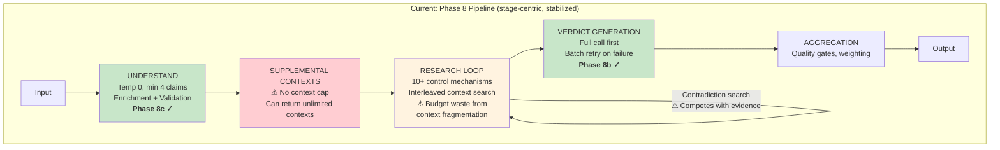
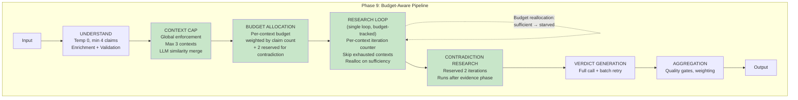

# Phase 9 — Research Loop Redesign Proposal

**Date:** 2026-02-15
**Author:** Claude Opus 4.6 (Lead Architect)
**Status:** Proposal — awaiting review and Captain approval
**Prerequisite:** Read `Phase8_Senior_Developer_Review_2026-02-15.md` (especially §11) and `Phase8_Pipeline_Redesign_Proposal_2026-02-15.md` (§6)

---

## 1. Phase 8 Recap — What Was Done

### 1.1 Commits Delivered

| Commit | Phase | Change | Impact |
|--------|-------|--------|--------|
| `0b14d7e` | Instrumentation | 16 per-stage funnel counters + language-tagged logging | Enabled data-driven diagnosis of bottlenecks |
| `b6752d7` | 8a | Open source selection funnel (maxResults 6→10, maxSourcesPerIteration 4→8, STRICT→MODERATE) | More search results enter pipeline |
| `92d7706` | 8b | Batch verdict retry for high-claim jobs (batches of ≤5) | Eliminates blanket 50/50 fallback for large jobs |
| `0d603b6` | 8c | Stabilize claim decomposition (temperature 0, enrichment pass, LLM validation) | Reduces run-to-run instability |
| `061bb23` | Bugfix | Accept `secondary_commentary` in MODERATE mode | Fixed 0-17% LLM relevance accept rate (code gate made MODERATE identical to STRICT) |
| `c509978` | Bugfix | Enforce `contextDetectionMaxContexts` in reconciliation function | Prevents orphan-driven context explosion via LLM similarity reassignment |

### 1.2 Full Comparison Data — BEFORE → Phase 7 → Phase 8c → Phase 8+fixes

#### Bolsonaro: "Was the Bolsonaro judgment (trial) fair and based on Brazil's law?"

| Phase | Verdict | Conf | Claims | Ctx | Evidence | Searches | Ev/Srch | LLM Accept | Fallback |
|-------|---------|------|--------|-----|----------|----------|---------|------------|----------|
| BEFORE | LT 69% | 74% | 9 | 2 | 30 | 31 | 0.97 | N/A | N/A |
| P7 | MX 49% | 74% | 9 | 3 | 15 | 31 | 0.48 | N/A | N/A |
| P8c | LT 69% | 69% | 9 | 3 | 24 | 21 | 1.14 | 4/24 (17%) | 9 |
| **P8+fix** | **MX 54%** | **75%** | **8** | **4** | **15** | **19** | **0.79** | **8/24 (33%)** | **6** |

#### H2 vs EV: "Using hydrogen for cars is more efficient than using electricity"

| Phase | Verdict | Conf | Claims | Ctx | Evidence | Searches | Ev/Srch | LLM Accept | Fallback |
|-------|---------|------|--------|-----|----------|----------|---------|------------|----------|
| BEFORE | LF 38% | 53% | 7 | 9 | 25 | 18 | 1.39 | N/A | N/A |
| P7 | MX 54% | 60% | 11 | 7 | 14 | 23 | 0.61 | N/A | N/A |
| P8c | LF 42% | 56% | 16 | 12 | 37 | 23 | 1.61 | 4/32 (12%) | 12 |
| **P8+fix** | **UV 47%** | **58%** | **23** | **11** | **50** | **23** | **2.17** | **13/32 (41%)** | **2** |

#### SRG DE: "Die Medien der SRG sind vertrauenswürdige Informationsquellen."

| Phase | Verdict | Conf | Claims | Ctx | Evidence | Searches | Ev/Srch | LLM Accept | Fallback |
|-------|---------|------|--------|-----|----------|----------|---------|------------|----------|
| BEFORE | UV 50% | 10% | 4 | 1 | 2 | 30 | 0.07 | N/A | N/A |
| P7 | UV 50% | 10% | 2 | 1 | 3 | 30 | 0.10 | N/A | N/A |
| P8c | MX 50% | 64% | 6 | 1 | 10 | 22 | 0.45 | 0/19 (0%) | 4 |
| **P8+fix** | **MX 50%** | **62%** | **6** | **1** | **17** | **26** | **0.65** | **3/25 (12%)** | **5** |

#### SRG EN: "The media outlets of the SRG are trustworthy sources of information."

| Phase | Verdict | Conf | Claims | Ctx | Evidence | Searches | Ev/Srch | LLM Accept | Fallback |
|-------|---------|------|--------|-----|----------|----------|---------|------------|----------|
| P7 | LT 68% | 54% | 2 | 8 | 16 | 20 | 0.80 | N/A | N/A |
| P8c | MX 55% | 63% | 5 | 1 | 15 | 20 | 0.75 | 2/24 (8%) | 10 |
| **P8+fix** | **LT 69%** | **64%** | **6** | **7** | **49** | **16** | **3.06** | **4/14 (29%)** | **2** |

### 1.3 LLM Relevance Fix Impact

| Job | P8c Accept Rate | P8+fix Accept Rate | Change | Fallback P8c → P8+fix |
|-----|----------------|-------------------|--------|----------------------|
| Bolsonaro | 17% (4/24) | **33% (8/24)** | +94% | 9 → 6 |
| H2 vs EV | 12% (4/32) | **41% (13/32)** | +242% | 12 → 2 |
| SRG DE | 0% (0/19) | **12% (3/25)** | ∞ | 4 → 5 |
| SRG EN | 8% (2/24) | **29% (4/14)** | +263% | 10 → 2 |

The relevance fix (`061bb23`) doubled or tripled LLM acceptance across the board. Fallback dependency dropped dramatically for H2 vs EV (12→2) and SRG EN (10→2), meaning the primary relevance path is now carrying the load as designed.

### 1.4 Context Cap Fix Impact

| Job | P8c Contexts | P8+fix Contexts | Assessment |
|-----|-------------|-----------------|------------|
| Bolsonaro | 3 | **4** | Slight increase (from UNDERSTAND, not reconciliation) |
| H2 vs EV | 12 | **11** | Barely changed — explosion from `requestSupplementalContexts`, not reconciliation |
| SRG DE | 1 | **1** | Unchanged (correct) |
| SRG EN | 1 | **7** | Increased — same bypass via `requestSupplementalContexts` |

**The reconciliation cap (`c509978`) did NOT solve the context explosion.** Root cause is `requestSupplementalContexts` at `orchestrated.ts:5427` which REPLACES the entire `analysisContexts` array with whatever the LLM returns, without checking `contextDetectionMaxContexts`. The reconciliation fix only prevents orphan-driven creation — a different and less impactful code path.

### 1.5 Phase 8 Conclusions

**What Phase 8 solved:**
- Evidence famine — SRG DE: 2→17 items (8.5x), SRG EN: 16→49 (3x), H2: 25→50 (2x)
- Language parity gap — DE vs EN evidence: 5.3x gap → 1.7x gap
- LLM relevance classifier — from non-functional (0-17%) to operational (12-41%)
- Blanket verdict fallback — batch retry mechanism in place (not yet stress-tested)
- Run-to-run claim instability — temperature 0 + enrichment + validation

**What Phase 8 did NOT solve:**
- **Context explosion** — H2 vs EV still at 11, SRG EN at 7. Bypass via `requestSupplementalContexts`.
- **Verdict instability** — Bolsonaro oscillates between LT 69% and MX 49-54% across runs. H2 shifts between LF 38-42% and UV 47%.
- **Research loop complexity** — Still 10+ interacting control mechanisms. Budget waste from context fragmentation.
- **SRG DE verdict quality** — 3/6 claims at exactly 50%. Evidence is there (17 items) but verdict LLM can't differentiate for German-language sources.
- **Contradiction search competing with evidence** — No dedicated budget, still interleaved.

---

## 2. Phase 9 Design Principles

1. **Fix what Phase 8 revealed.** The instrumentation and fixes exposed two structural problems: context explosion via supplemental contexts, and research budget waste from interleaved loop complexity.
2. **Balanced compromise.** Don't replace the research loop wholesale (too risky). Add budget discipline and failure isolation while preserving the adaptive behaviors that work.
3. **Enforce context cap globally.** The `contextDetectionMaxContexts` setting must be a hard ceiling across ALL context creation paths, not just reconciliation.
4. **Budget discipline over structural separation.** Per-context budget accounting within the existing loop, not physically separate per-context research phases.
5. **Incremental and testable.** Each change independently valuable and independently rollback-safe.

---

## 3. Architecture: Current State → Phase 9 Target

### 3.1 Current State (Post-Phase 8)



**Legend:** Green = Phase 8 improvements working. Red = known problem. Orange = working but suboptimal.

### 3.2 Phase 9 Target Architecture



### 3.3 Key Architectural Differences

| Aspect | Current (Post-Phase 8) | Phase 9 Target |
|--------|----------------------|----------------|
| Context creation | Uncapped in supplemental path | **Global cap enforced at all creation points** |
| Research budget | Single global counter, contexts interleave freely | **Per-context budget, weighted by claim count** |
| Contradiction search | Competes with evidence gathering in same loop | **Reserved 2 iterations, runs after evidence** |
| Budget waste | 11 contexts × 1-2 iterations each = scattered | **Max 3 contexts × focused iterations** |
| Evidence sharing | Cross-context via interleaving (implicit) | **Cross-context via shared source pool (explicit)** |
| Loop termination | 10+ mechanisms interact unpredictably | **5 clear mechanisms with defined precedence** |
| Exhausted context handling | `exhaustedContextNames` set + starvation logic | **Per-context counter, skip when budget=0** |

---

## 4. Phase 9 Changes

### Change A: Global Context Cap Enforcement

**Problem:** `contextDetectionMaxContexts=3` is only enforced in `analysis-contexts.ts:186`. Two bypass paths exist:
1. `requestSupplementalContexts` (`orchestrated.ts:5427`) — REPLACES `analysisContexts` array without checking cap
2. Initial UNDERSTAND LLM output — can return any number of contexts

**Design:**
- Add a `enforceContextCap(parsed, maxContexts)` function that runs AFTER every context creation point
- When contexts exceed cap: use `assessTextSimilarityBatch` to find the most similar context pairs, merge them (combine claims, reassign evidence), repeat until at or below cap
- Merging preserves all claims and evidence — no data loss, just fewer context buckets
- Function called at 4 points: after UNDERSTAND parse, after supplemental contexts, after reconciliation, after supplemental claims

**UCM parameter:** Uses existing `contextDetectionMaxContexts` (default: 3).

**Files:** `orchestrated.ts` (new function + 4 call sites)

### Change B: Per-Context Budget with Reallocation

**Problem:** The current research loop uses a single `maxResearchIterations` counter. Contexts interleave freely, leading to:
- Starvation: one context uses 8/10 iterations, leaving 2 for three other contexts
- The `exhaustedContextNames` set and Block 2 budget logic attempt to fix this but add complexity

**Design:**
- After context cap enforcement, allocate per-context budgets: `budget[ctx] = ceil(totalIterations × claimCount[ctx] / totalClaims)`
- Reserve 2 iterations for contradiction search (deducted from total before allocation)
- Each iteration, the loop picks the context with the most remaining budget (ties broken by lowest evidence count)
- When a context reaches evidence sufficiency (≥3 items), its remaining budget is redistributed proportionally to under-evidenced contexts
- Cross-context evidence sharing: if a source fetched for context A yields evidence tagged to context B, that counts toward B's sufficiency

**UCM parameters:**
- `researchContradictionReservedIterations` (default: 2) — iterations reserved for contradiction
- `researchEvidenceSufficiencyThreshold` (default: 3) — evidence items per context before reallocation

**What this replaces:** `maxResearchIterations` (kept as total cap), `exhaustedContextNames` (removed), Block 2 context budget logic (removed), `scaledMinEvidence` (replaced by sufficiency threshold), `gapResearch` (replaced by reallocation)

**Files:** `orchestrated.ts` (research loop refactor), `config-schemas.ts` (2 new UCM params)

### Change C: Reserved Contradiction Budget

**Problem:** Contradiction/inverse claim searches compete with evidence gathering. In budget-constrained runs, contradiction may not fire at all.

**Design:**
- 2 iterations reserved from total budget (configurable via UCM)
- These fire AFTER all per-context research budgets are exhausted
- Only contradiction and inverse-claim queries during these iterations
- Evidence from contradiction sources is tagged with `fromOppositeClaimSearch=true` as today
- If contradiction budget is unused (rare), it does NOT roll back to evidence — contradiction is guaranteed

**What this replaces:** `contradictionSearchPerformed` flag, `inverseClaimSearchPerformed` flag — both removed, replaced by the reserved iteration counter.

**Files:** `orchestrated.ts` (loop control modification)

---

## 5. Research Loop Control: Current vs Phase 9

### 5.1 Current Mechanisms (10+)

| # | Mechanism | What it does | Interactions |
|---|-----------|-------------|-------------|
| 1 | `maxResearchIterations` | Global iteration cap | Interacts with 2, 5, 7 |
| 2 | `scaledMinEvidence` | Minimum evidence threshold | Interacts with 1, 9 |
| 3 | `contradictionSearchPerformed` | Boolean flag | Interacts with 4 |
| 4 | `inverseClaimSearchPerformed` | Boolean flag | Interacts with 3 |
| 5 | Context budget (Block 2) | Per-context iteration tracking | Interacts with 1, 6 |
| 6 | `exhaustedContextNames` | Set of "done" contexts | Interacts with 5 |
| 7 | `gapResearch` | Extra iterations for evidence gaps | Interacts with 1, 2 |
| 8 | `adaptiveFallback` | Broadens search when relevance low | Independent |
| 9 | `centralClaimEvidence` | Tracks evidence for central claims | Interacts with 2 |
| 10 | `legalFrameworkSearch` | Dedicated legal source queries | Independent |
| 11 | `recencySensitiveClaims` | Time-sensitive query modification | Independent |

### 5.2 Phase 9 Mechanisms (5)

| # | Mechanism | What it replaces | Interactions |
|---|-----------|-----------------|-------------|
| 1 | **Total budget** | `maxResearchIterations` (unchanged) | Cap for 2 + 3 |
| 2 | **Per-context budget with reallocation** | Mechanisms 2, 5, 6, 7, 9 | Feeds from 1, realloc on sufficiency |
| 3 | **Reserved contradiction budget** | Mechanisms 3, 4 | Deducted from 1 before allocation |
| 4 | **Adaptive fallback** | Mechanism 8 (unchanged) | Independent |
| 5 | **Search hints** | Mechanisms 10, 11 (kept as query-level hints, not loop controls) | Independent |

**Net reduction:** 11 → 5 mechanisms. Six removed, five consolidated.

---

## 6. Execution Sequence

```
Phase 9a: Global context cap enforcement              → Re-run 4 test jobs
    ↓
Phase 9b: Per-context budget allocation + reallocation → Re-run 4 test jobs
    ↓
Phase 9c: Reserved contradiction budget                → Re-run 4 test jobs + stability runs
```

Each phase is independently valuable:
- **9a alone** fixes the 11-context and 7-context explosion, concentrating research budget
- **9b alone** prevents starvation and eliminates 5 loop control mechanisms
- **9c alone** guarantees contradiction search fires every run

### 6.1 Estimated Effort

| Phase | Scope | Files | Risk |
|-------|-------|-------|------|
| 9a | New `enforceContextCap` function + 4 call sites | `orchestrated.ts` | Low — additive, no existing logic changed |
| 9b | Research loop control flow refactor | `orchestrated.ts`, `config-schemas.ts` | Medium — replaces 5 mechanisms |
| 9c | Extract contradiction into reserved phase | `orchestrated.ts` | Low — moves existing code, doesn't change logic |

---

## 7. Success Criteria

| Metric | Current (Phase 8+fix) | Target (Phase 9) | How Measured |
|--------|----------------------|-------------------|-------------|
| Max contexts (H2 vs EV) | 11 | **≤3** | Context count in result |
| Max contexts (SRG EN) | 7 | **≤3** | Context count in result |
| Ev/Search (average) | 1.67 | **≥1.5** | No regression from evidence gains |
| Bolsonaro verdict stability | ±20pp (49-69%) | **±8pp** | 3 runs of same input |
| SRG DE claims at 50% | 3/6 (50%) | **≤1/6** | Fewer "I don't know" verdicts |
| Contradiction search fires | Unknown (no instrumentation) | **100% of runs** | Add counter to funnel stats |
| Research loop mechanisms | 10+ | **5** | Code complexity reduction |

---

## 8. What NOT to Touch

- **Source selection funnel** — Phase 8a + relevance fix working well. LLM accept rates 12-41%.
- **Verdict batch retry** — Phase 8b in place, not yet stress-tested but zero risk.
- **Claim decomposition** — Phase 8c enrichment and validation working.
- **Aggregation logic** — Sound, problem is input quality not aggregation.
- **Evidence filter** — Working correctly.

---

## 9. Risk and Mitigation

| Risk | Likelihood | Mitigation |
|------|-----------|------------|
| Context merging loses important distinctions | Medium | Use high similarity threshold (0.8+). Admin can raise `contextDetectionMaxContexts` via UCM if merging is too aggressive. |
| Per-context budget causes under-researched contexts | Low | Reallocation mechanism ensures sufficient contexts donate budget to starved ones. Minimum 1 iteration per context. |
| Contradiction reservation wastes budget on simple inputs | Low | 2 iterations out of 10 is 20%. For simple single-claim inputs, contradiction is fast and useful. UCM-configurable. |
| Research loop refactor introduces regressions | Medium | Phase 9b is the riskiest change. Run full test suite + 4 integration jobs + 3x stability runs before and after. |

---

## 10. UCM Parameter Summary

| Parameter | Default | Phase | Description |
|-----------|---------|-------|-------------|
| `contextDetectionMaxContexts` | 3 | 9a | Already exists — now enforced globally |
| `researchContradictionReservedIterations` | 2 | 9c | Iterations reserved for contradiction search |
| `researchEvidenceSufficiencyThreshold` | 3 | 9b | Evidence items per context before budget reallocation |

---

## 11. Relationship to Phase 8 Proposal §6

Phase 8's §6.2 proposed a full architectural shift to per-context isolated research with a separate contradiction phase. Phase 9 takes a **balanced compromise** that captures most benefits while avoiding the key drawbacks:

| §6.2 Proposed | Phase 9 Compromise | Drawback Avoided |
|--------------|-------------------|-----------------|
| Per-context isolated research | Per-context **budget** in single loop | Cross-context evidence sharing preserved |
| Equal budget split per context | **Weighted** by claim count | Important contexts get proportional budget |
| Separate contradiction phase | **Reserved** iterations in same loop | Mid-stream course correction still possible |
| 4 mechanisms (hard consolidation) | **5** mechanisms (practical consolidation) | Recency and legal hints kept as query-level |
| Parallel context research | Sequential with budget tracking | No rate-limit/concurrency issues |

The key insight: §6.2's benefits come from **budget discipline and failure isolation**, not from physical separation. Phase 9 achieves both within the existing loop structure.
