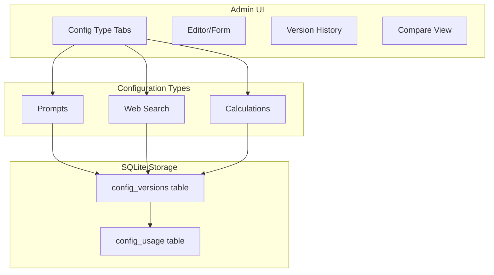

# Unified Configuration Management System

**Status:** Proposal for Review  
**Date:** January 2026  
**Author:** AI Assistant  

## Overview

Extend the existing prompt versioning system to manage all tunable configurations (prompts, web search settings, calculation parameters) in a unified admin UI with shared database storage, versioning, and rollback capabilities.

---

## Current State

The prompt management system already provides:

- Content-addressable versioning (SHA-256 hash as primary key)
- Version history with rollback
- Usage tracking per job
- Admin UI with editor, history, compare tabs

---

## Proposed Approach: Extend Existing System

Rather than creating separate systems, generalize the prompt versioning to handle multiple **configuration types**:



---

## Database Changes

### Option A: Add `config_type` column to existing tables (Recommended)

Rename and extend `prompt_versions` to `config_versions`:

| Column | Type | Description |
|--------|------|-------------|
| content_hash | TEXT PK | SHA-256 hash (unchanged) |
| config_type | TEXT | `prompt`, `search`, `calculation` |
| pipeline | TEXT | For prompts: `orchestrated`, etc. For others: `default` |
| version_label | TEXT | Human-readable label |
| content | TEXT | JSON/YAML content |
| is_active | INTEGER | One active per (config_type, pipeline) |
| usage_count | INTEGER | How many times used |
| previous_hash | TEXT | Link to previous version |
| created_utc | TEXT | ISO timestamp |
| activated_utc | TEXT | ISO timestamp |

**Migration**: Add `config_type` column with default `'prompt'` for existing rows.

---

## Configuration Content Structures

### Web Search Config (JSON)

```json
{
  "enabled": true,
  "provider": "auto",
  "mode": "standard",
  "maxResults": 6,
  "maxSourcesPerIteration": 4,
  "timeoutMs": 12000,
  "dateRestrict": null,
  "domainWhitelist": [],
  "domainBlacklist": []
}
```

**Tunable Parameters:**
- `enabled` - Enable/disable web search entirely
- `provider` - Provider selection: `auto`, `google-cse`, `serpapi`
- `mode` - Search mode: `standard` or `grounded` (Gemini only)
- `maxResults` - Maximum results to request from provider
- `maxSourcesPerIteration` - Sources to use per analysis iteration
- `timeoutMs` - Request timeout in milliseconds
- `dateRestrict` - Limit to recent results: `y` (year), `m` (month), `w` (week), or `null`
- `domainWhitelist` - Only search these domains (empty = all)
- `domainBlacklist` - Exclude these domains

### Calculation Config (JSON)

```json
{
  "verdictBands": {
    "true": [86, 100],
    "mostlyTrue": [72, 85],
    "leaningTrue": [58, 71],
    "mixed": [43, 57],
    "leaningFalse": [29, 42],
    "mostlyFalse": [15, 28],
    "false": [0, 14]
  },
  "aggregation": {
    "centralityWeights": { "high": 3.0, "medium": 2.0, "low": 1.0 },
    "harmPotentialMultiplier": 1.5,
    "contestationWeights": { "established": 0.3, "disputed": 0.5, "opinion": 1.0 }
  },
  "sourceReliability": {
    "confidenceThreshold": 0.8,
    "consensusThreshold": 0.15,
    "defaultScore": 0.5
  },
  "qualityGates": {
    "gate1OpinionThreshold": 0.5,
    "gate1SpecificityThreshold": 0.3,
    "gate1MinContentWords": 5,
    "gate4MinSourcesHigh": 3,
    "gate4MinSourcesMedium": 2,
    "gate4QualityThresholdHigh": 0.7,
    "gate4QualityThresholdMedium": 0.6,
    "gate4AgreementThresholdHigh": 0.8,
    "gate4AgreementThresholdMedium": 0.6
  },
  "contestationPenalties": {
    "established": -12,
    "disputed": -8
  },
  "deduplication": {
    "scopeThreshold": 0.85,
    "claimSimilarityThreshold": 0.6,
    "contextMergeThreshold": 0.85
  },
  "mixedConfidenceThreshold": 60
}
```

**Tunable Parameters:**
- **Verdict Bands** - Percentage ranges for each verdict label
- **Aggregation Weights** - How centrality, harm potential, and contestation affect scoring
- **Source Reliability** - Thresholds for accepting LLM-evaluated source scores
- **Quality Gates** - Thresholds for claim validation and verdict confidence
- **Contestation Penalties** - Truth percentage reductions for counter-evidence
- **Deduplication** - Similarity thresholds for scope/claim merging

---

## Files to Modify

### Backend (Storage & API)

| File | Changes |
|------|---------|
| `apps/web/src/lib/prompt-storage.ts` | Rename to `config-storage.ts`, add `configType` parameter |
| `apps/web/src/app/api/admin/prompts/` | Generalize to `/api/admin/config/[configType]/[pipeline]/` |
| `apps/web/src/lib/analyzer/config.ts` | Load search/calc configs from DB instead of env vars |

### Frontend (Admin UI)

| File | Changes |
|------|---------|
| `apps/web/src/app/admin/prompts/page.tsx` | Rename to `config/page.tsx`, add config type selector |
| `apps/web/src/app/admin/prompts/prompts.module.css` | Rename to `config.module.css`, add form styles |

### Config Consumers

| File | Changes |
|------|---------|
| `apps/web/src/lib/web-search.ts` | Read settings from loaded config |
| `apps/web/src/lib/analyzer/orchestrated.ts` | Read calculation params from loaded config |
| `apps/web/src/lib/analyzer/aggregation.ts` | Use config for weights/thresholds |
| `apps/web/src/lib/analyzer/quality-gates.ts` | Use config for gate thresholds |

---

## UI Design

### Config Type Selector (Top Level)

```
[Prompts] [Web Search] [Calculations]
     ↓
[Pipeline/Variant Selector] (for prompts only)
     ↓
[Editor] [History] [Files] [Compare]
```

### Web Search Editor

Form-based UI (not raw text editor):

- Toggle: Search Enabled
- Dropdown: Provider (auto / google-cse / serpapi)
- Number inputs: Max Results, Max Sources Per Iteration, Timeout (ms)
- Dropdown: Date Restrict (None / Year / Month / Week)
- Tag inputs: Domain Whitelist, Domain Blacklist

### Calculation Editor

Grouped form with collapsible sections:

**Verdict Bands**
- 7 range inputs with visual scale preview

**Aggregation Weights**
- Sliders for centrality (high/medium/low)
- Slider for harm potential multiplier
- Sliders for contestation weights

**Source Reliability**
- Confidence threshold (0-1)
- Consensus threshold (0-1)
- Default score (0-1)

**Quality Gates**
- Gate 1: Opinion threshold, Specificity threshold, Min content words
- Gate 4: Min sources (high/medium), Quality thresholds, Agreement thresholds

**Contestation Penalties**
- Number inputs for established/disputed penalties

---

## Implementation Order

1. **Database Migration** - Add `config_type` column, rename tables
2. **Storage Layer** - Generalize `prompt-storage.ts` to `config-storage.ts`
3. **API Routes** - Add `/api/admin/config/[type]/...` routes
4. **Web Search Config** - Create schema, loader, form UI
5. **Calculation Config** - Create schema, loader, form UI
6. **Integration** - Wire configs into analyzer pipeline
7. **Job Tracking** - Record which config versions were used per job

---

## Fallback Behavior

Configuration priority (highest to lowest):

1. **Environment Variable** - Always wins if set (deployment flexibility)
2. **Database Config** - Active version from admin UI
3. **Hardcoded Default** - Built-in fallback values

This ensures:
- Existing env var deployments continue working
- Admins can tune without code changes
- Safe defaults if nothing is configured

---

## Benefits

- **Single admin UI** for all tunable parameters
- **Unified version history** and rollback for all config types
- **A/B testing** possible (switch configs between jobs)
- **Audit trail** - which config produced which results
- **No code changes** needed to tune parameters
- **Backwards compatible** - existing env vars still work

---

## Risks and Mitigations

| Risk | Mitigation |
|------|------------|
| Breaking existing prompt management | Migration adds column, doesn't modify existing data |
| Config changes cause unexpected results | Version history allows instant rollback |
| Complexity of calculation parameters | Grouped UI with sensible defaults, validation |
| Performance impact of DB lookups | Cache configs in memory, reload on change |

---

## Open Questions

1. Should calculation config be one monolithic JSON or split into sub-configs (e.g., `calculation-verdicts`, `calculation-aggregation`)?
2. Should we add a "preview" mode to test config changes on sample data before activating?
3. Should config changes require confirmation/approval workflow for production environments?

---

## Implementation Tasks

- [ ] Add `config_type` column to `prompt_versions` table, create migration script
- [ ] Rename `prompt-storage.ts` to `config-storage.ts`, add `configType` parameter
- [ ] Create `/api/admin/config/[type]/[pipeline]` routes for search and calculation
- [ ] Define search config schema, create form-based editor UI
- [ ] Define calculation config schema, create grouped form editor UI
- [ ] Create config loader that reads from DB with env var fallback
- [ ] Wire search config into `web-search.ts` and analyzer
- [ ] Wire calculation config into `orchestrated.ts` and `aggregation.ts`

---

## Reviewer Notes (Architecture & Lead Dev)

### What’s strong in the proposal

- **Leverages existing strengths**: The prompt system already has content-addressable versioning, rollback, and job usage tracking; extending this pattern is the right direction.
- **Admin UX direction is correct**: Prompts remain text-based, while structured configs (search/calculations) should be form-based with validation and guardrails.
- **Reproducibility is explicitly valued**: “Which config produced which results” is a core requirement for debugging and trust.

### Architectural gaps / risks to address before implementing

- **Config identity/scoping model is underspecified**
  - The proposal uses `(config_type, pipeline)` for “one active”. That fits prompts, but it is limiting for other config classes.
  - You will likely want additional scopes later (service scope, environment scope, named profile). If you encode this as `pipeline=default`, you’ll migrate again.

- **Activation semantics and invariants**
  - Storing `is_active` on the immutable content row is workable, but it’s easy to introduce “two actives” under concurrency, and it conflates content with activation.
  - Prefer an explicit activation pointer model so “activate” is a transactional operation with audit fields.

- **Validation and schema versioning**
  - Non-prompt configs need strict validation at save-time and activate-time (ranges, required fields, forward-compat).
  - Add a machine-readable **schema version** (distinct from `version_label`) so shapes can evolve safely.

- **Secrets handling**
  - Do NOT store API keys/tokens/credentials in DB-backed config content.
  - Keep secrets in env vars/secret managers and store only non-sensitive toggles/thresholds in config.

- **Caching/invalidation across processes**
  - “Cache in memory” needs an invalidation strategy across node processes/instances (TTL polling, check active pointer, etc.).
  - Make “read the active config pointer” cheap and “read large blobs” less frequent.

- **Reproducibility: record the effective config**
  - If env vars can override DB config, then the active DB hash is not enough for post-mortems.
  - Record either: (a) the resolved effective config hash/content, or (b) the active hash + explicit list of applied overrides.

- **Migration risk (rename vs add)**
  - Renaming `prompt_versions` → `config_versions` is clean conceptually but creates broad churn.
  - Consider adding new generalized tables and migrating prompts gradually, unless you’re prepared to update all consumers in one change-set.

- **Safety rails for calculation config**
  - Calculation parameters have high blast radius. Enforce invariants such as:
    - verdict bands are contiguous, non-overlapping, and within 0–100
    - weights/multipliers are within sane bounds
    - a validation/preview path exists before activation

---

## Proposed Revisions (Concrete)

### 1) Introduce a `scopeKey` instead of overloading `pipeline`

- Replace the conceptual key `(config_type, pipeline)` with `(config_type, scopeKey)`.
- For prompts: `scopeKey = pipeline` (e.g., `orchestrated`, `monolithic-canonical`).
- For global configs: start with `scopeKey = "default"`, but keep the door open for additional scopes later.

### 2) Separate immutable content from activation pointers

Recommended tables (names illustrative):

- **`config_blobs`** (immutable)
  - `content_hash` (PK, sha256)
  - `config_type`
  - `scope_key`
  - `schema_version` (machine-readable, e.g. `search.v1`, `calc.v1`)
  - `version_label` (human-friendly)
  - `content` (TEXT: JSON/YAML/markdown)
  - `created_utc`, `created_by` (optional)

- **`config_active`** (mutable pointer)
  - `config_type`, `scope_key` (unique)
  - `active_hash` (FK → `config_blobs.content_hash`)
  - `activated_utc`, `activated_by`, `activation_reason`

- **`config_usage`** (per job/run)
  - `job_id`
  - `config_type`, `scope_key`
  - `content_hash`
  - `loaded_utc`
  - optional: `effective_hash` / `effective_content` if env overrides materially change behavior

This design makes “one active” easier to enforce and makes activation auditable and transactional.

### 3) Add strict validation + canonicalization at save/activate time

- Define a Zod schema (or equivalent) per config type.
- On save:
  - validate structure and ranges
  - canonicalize content (stable ordering/formatting) before hashing
- On activate:
  - validate again (defense-in-depth)
  - write activation metadata (who/when/why)

### 4) Refine fallback behavior with an explicit override policy

The current priority (env > DB > defaults) is fine as a starting point, but needs operational control:

- Add a deploy-time switch such as `FH_CONFIG_ENV_OVERRIDES=on|off`.
- When `off`, env overrides are ignored (or constrained to an allowlist).
- Record in job metadata whether env overrides were applied.

### 5) Add a preview/dry-run workflow for high-blast-radius configs

Especially for calculation parameters:

- Provide “Validate only” (no activation).
- Provide “Run once with this config” (job-scoped override) for admins.

### 6) Clarify “A/B testing” vs “global activation”

If you want to vary configs between jobs safely, you need one of:

- **job-scoped overrides** (e.g., analyze request contains `configOverrides`), or
- **routing keys** (experiment groups) that deterministically select a config version.

### 7) UI additions

- Show an “effective config” preview (defaults + DB + overrides).
- Offer export/import JSON for power users (still validated).
- For calculation bands: enforce constraints in UI (contiguous, no overlap) and show a visual preview.

### 8) Suggested incremental rollout

1. Read-only viewing of active configs + version history
2. Validation + save for new config types
3. Activation pointer + rollback
4. Wire consumers with caching + invalidation
5. Per-job usage tracking (active hash + effective overrides)
