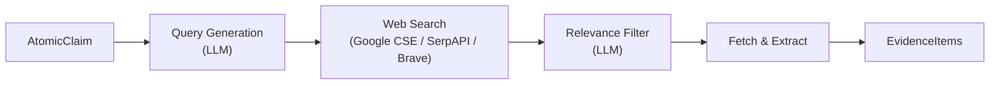
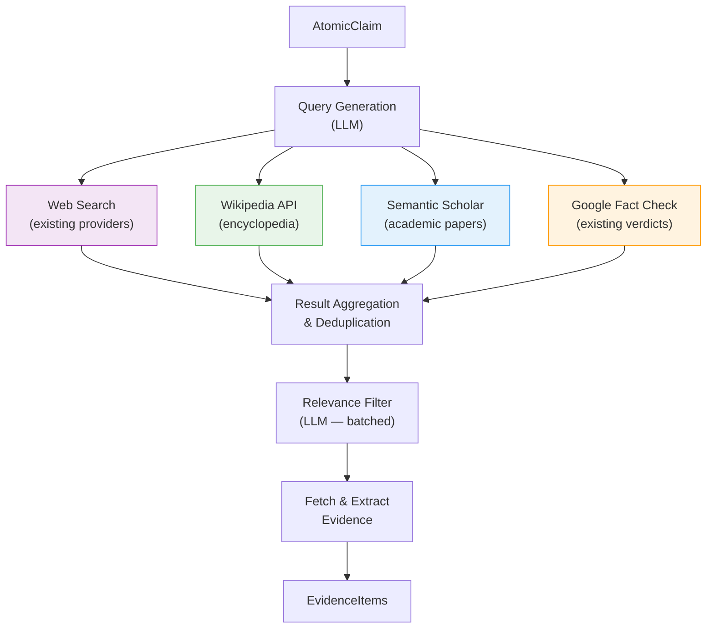
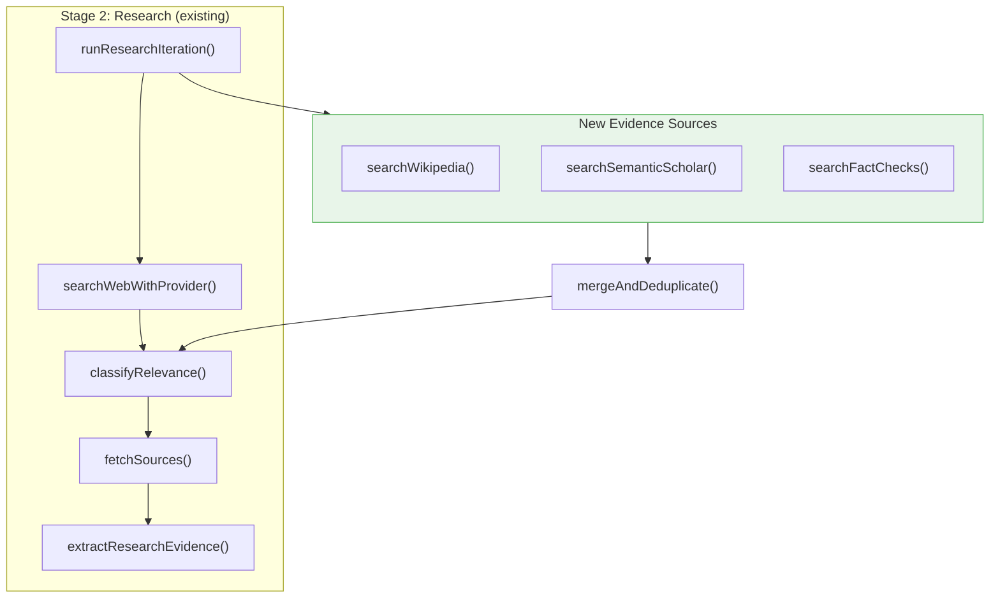
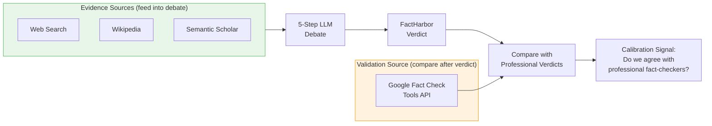

# Multi-Source Evidence Retrieval — Specification

**Date:** 2026-02-23
**Last Updated:** 2026-04-04
**Status:** Partially implemented. Provider-layer support for Wikipedia, Semantic Scholar, and Google Fact Check already exists in the codebase; Wikipedia supplementary completion is implemented and validated. Remaining work is deeper pipeline-aware integration and any future promotion of additional supplementary providers.
**Priority:** High — addresses the #1 quality bottleneck (evidence pool asymmetry, C13 = 8/10 pairs)
**Cross-references:** [Executive Summary](../Knowledge/EXECUTIVE_SUMMARY.md) | [Factiverse Analysis](../Knowledge/Factiverse_Lessons_for_FactHarbor.md) | [Global Landscape](../Knowledge/Global_FactChecking_Landscape_2026.md) | [Research Ecosystem](../Knowledge/Stammbach_Research_Ecosystem_and_FactHarbor_Opportunities.md)

---

## 1. Problem Statement

FactHarbor currently relies on a single evidence channel: **web search** (Google CSE / SerpAPI / Brave). Calibration testing (Baseline v1, 2026-02-20) found that **8 out of 10 political claim pairs** had asymmetric evidence pools — the dominant source of directional skew (27.6pp mean). Web search alone returns what's popular, not what's balanced.

Factiverse's published architecture demonstrates that multi-source retrieval is both achievable and effective: their LiveFC pipeline queries **6 sources in parallel** (Google, Bing, You.com, Wikipedia, Semantic Scholar, FactiSearch). This pattern directly addresses evidence asymmetry by diversifying the information supply.

**Original goal:** Add 3 supplementary evidence sources — Wikipedia, Semantic Scholar, Google Fact Check Tools API — to the existing search provider architecture, with zero cost increase and minimal implementation effort.

**Current April 2026 posture:**

- provider modules for Wikipedia, Semantic Scholar, and Google Fact Check are already implemented
- Wikipedia is now enabled by default as a bounded supplementary provider
- supplementary-provider execution is UCM-controlled via `supplementaryProviders.mode`
- Semantic Scholar and Google Fact Check remain wired but disabled by default
- the remaining open work is no longer basic provider plumbing; it is deeper pipeline-aware integration, provider-aware query shaping, and any future promotion decisions

---

## 2. Architecture Overview

### 2.1 Historical Baseline (Single Channel)



### 2.2 Expanded Multi-Source Target State



### 2.3 Integration into ClaimBoundary Pipeline



All new sources feed into the **existing pipeline** at the same point as web search results. The provider-layer and bounded supplementary orchestration already exist. Remaining work is deeper provider-aware retrieval and evidence-treatment logic, not basic dispatcher plumbing.

---

## 3. Source-by-Source Analysis

### 3.1 Wikipedia

| Dimension | Detail |
|-----------|--------|
| **What it provides** | Encyclopedia content with cited references — establishes factual background and provides source trails |
| **API** | MediaWiki Action API (`en.wikipedia.org/w/api.php`) + REST API |
| **Cost** | **Free** — no API key required (recommended for higher rate limits) |
| **Rate limits** | Unauthenticated: ~200 req/s. Authenticated (free OAuth): 5,000 req/hr |
| **Auth setup** | Register at `api.wikimedia.org` (free, instant) |
| **Commercial use** | Allowed (CC BY-SA 4.0) — requires attribution |
| **Language support** | 300+ language editions (change subdomain: `en.` → `fr.` → `de.`) |
| **Integration effort** | ~2 hours |
| **npm library** | `wikipedia` (TypeScript native, ~49K weekly downloads) |

**Relevant endpoints:**

| Endpoint | Use Case | Example |
|----------|----------|---------|
| `action=query&list=search` | Find articles matching a claim | Full-text search across all articles |
| `action=query&prop=extracts&explaintext` | Get article text for LLM evidence extraction | Clean plaintext, no HTML |
| `action=parse&prop=references` | Extract cited sources (the real evidence trail) | References point to primary sources |
| `/api/rest_v1/page/summary/{title}` | Quick article summary for relevance screening | Structured JSON with description |

**Integration pattern:**
```
AtomicClaim → search Wikipedia → get top 3-5 articles →
extract summaries + references → feed as WebSearchResult[] →
existing relevance filter + evidence extraction
```

**Quality considerations:**
- Wikipedia is a **secondary/tertiary source** — its cited references are more valuable than article text
- Article quality varies (Featured Articles are excellent, stubs may be unreliable)
- Vandalism risk mitigated by REST API (serves cached/stable versions)
- "Verifiability, not truth" aligns well with FactHarbor's evidence-based approach
- Not ideal for breaking news or very recent events

**Mandatory requirement:** Set `User-Agent` header (Wikimedia blocks generic user-agents):
```
User-Agent: FactHarbor/1.0 (https://factharbor.com; admin@factharbor.com)
```

---

### 3.2 Semantic Scholar

| Dimension | Detail |
|-----------|--------|
| **What it provides** | 214M+ academic papers with abstracts, citation graphs, venue metadata |
| **API** | REST API at `api.semanticscholar.org/graph/v1` |
| **Cost** | **Free** — no charges at any tier |
| **Rate limits** | Standard key: **1 RPS** on search, 10 RPS on paper details. Partner: up to 100 RPS |
| **Auth setup** | Request API key via form (free, ~1 month backlog). No free-email domains accepted. |
| **Commercial use** | **Uncertain** — license prohibits "embedding API into products for commercial gain." Needs clarification with Allen Institute for AI. |
| **Language support** | Papers in all languages, but search works best on English titles/abstracts |
| **Integration effort** | ~2 hours |
| **npm library** | `semanticscholarjs` (small, or write thin wrapper ~100 lines) |

**Relevant endpoints:**

| Endpoint | Use Case | Rate |
|----------|----------|------|
| `GET /paper/search?query=...&fields=title,abstract,year,citationCount,venue` | Find papers relevant to a claim | 1 RPS |
| `GET /snippet/search?query=...` | Find specific text passages within papers | 1 RPS |
| `POST /paper/batch` (up to 500 IDs) | Enrich results with full metadata | 1 RPS |
| `GET /paper/{id}/citations` | Trace citation chains (who cited this?) | 10 RPS |

**Data fields (selected):**

| Field | Value for Fact-Checking |
|-------|------------------------|
| `abstract` | Primary evidence text — feed to LLM for extraction |
| `tldr` | AI-generated 1-sentence summary (~60M papers) — quick relevance check |
| `citationCount` | Quality signal — highly-cited = more established |
| `venue` | Source reliability mapping (Nature > arXiv preprint) |
| `publicationTypes` | Map to FactHarbor `sourceType` (JournalArticle → `peer_reviewed_study`) |
| `isOpenAccess` + `openAccessPdf` | Full-text retrieval for open-access papers |
| `s2FieldsOfStudy` | Topic classification — filter irrelevant fields |

**Integration pattern:**
```
AtomicClaim → LLM generates 2-3 academic search queries →
parallel: /paper/search + /snippet/search →
top results by citationCount + relevance →
map to WebSearchResult[] (url=semanticscholar.org/paper/..., title, snippet=abstract) →
existing pipeline handles the rest
```

**Critical constraint:** At 1 RPS, searching 5 claims × 2 queries = 10 seconds minimum. Budget 20-30 seconds for Semantic Scholar evidence per job. This is acceptable since the full pipeline already takes several minutes.

**SourceType mapping:**
```
JournalArticle + high venue → peer_reviewed_study
Conference → peer_reviewed_study
Review → peer_reviewed_study
Preprint (arXiv) → expert_analysis
ClinicalTrial → government_data
Other → academic_source (new sourceType)
```

**Commercial use risk:** The Semantic Scholar license states: "You shall not embed or install the API into products for the licensee's own or third-parties' commercial gain." This may apply to FactHarbor if it becomes a commercial product. **Action needed:** Contact AI2 to clarify whether using S2 as one of multiple evidence sources in a fact-checking tool constitutes prohibited commercial use. Do this before investing in production integration.

---

### 3.3 Google Fact Check Tools API

| Dimension | Detail |
|-----------|--------|
| **What it provides** | Existing fact-checks from 100+ organizations (PolitiFact, Snopes, AFP, Full Fact, etc.) via ClaimReview markup |
| **API** | REST at `factchecktools.googleapis.com/v1alpha1/claims:search` |
| **Cost** | **Free** — no billing account required |
| **Rate limits** | Standard GCP quota (likely ~10K/day, not explicitly published) |
| **Auth setup** | Google Cloud Console → enable API → create API key (5 minutes) |
| **Commercial use** | Allowed under standard Google APIs ToS |
| **Language support** | 70+ languages in corpus (coverage drops sharply outside EN/ES/FR) |
| **Integration effort** | **~1 hour** (single GET endpoint, no SDK needed) |
| **npm library** | Not needed — simple `fetch` call. (`googleapis` package available if preferred.) |

**Query parameters:**

| Parameter | Purpose |
|-----------|---------|
| `query` | Claim text to search for |
| `languageCode` | BCP-47 code (e.g., `en-US`, `fr`, `de`) |
| `reviewPublisherSiteFilter` | Restrict to specific fact-checker (e.g., `snopes.com`) |
| `maxAgeDays` | Only recent fact-checks |
| `pageSize` | Results per page (default 10) |

**Response structure:**
```json
{
  "claims": [{
    "text": "Crime has doubled in the last 2 years",
    "claimant": "John Smith",
    "claimReview": [{
      "publisher": { "name": "PolitiFact", "site": "politifact.com" },
      "url": "https://www.politifact.com/...",
      "title": "No, crime has not doubled",
      "textualRating": "Mostly False",
      "languageCode": "en"
    }]
  }]
}
```

**Critical coverage limitation:** Academic evaluation found only **15.8% of claims return any results** (tested on 1,000 COVID claims). But when results exist, quality is high: **94% relevance, 91% accurate ratings.**

**Special role in FactHarbor:**

Unlike Wikipedia and Semantic Scholar (which provide raw evidence), the Fact Check Tools API returns **pre-existing verdicts from professional fact-checkers**. This has a different strategic value:



**Two usage modes:**
1. **Pre-verdict (evidence source):** Feed existing fact-checks as high-probativeValue EvidenceItems into the debate. The `textualRating` requires LLM normalization (free-text: "Pants on Fire", "Four Pinocchios", "Verdadero").
2. **Post-verdict (validation):** Compare FactHarbor's independent verdict against professional consensus. This is a calibration signal, not evidence.

**Recommendation:** Start with Mode 1 (evidence source). Mode 2 can be added later as a quality metric.

**Wording sensitivity warning:** The API does keyword matching, not semantic search. "Was inflation caused by Biden?" and "Biden caused inflation" may return different results. **Mitigation:** Generate the search query from the LLM-extracted AtomicClaim (already normalized), not from raw user input.

---

## 4. Cost Summary

| Source | API Cost | Auth Cost | Infra Cost | Total |
|--------|----------|-----------|------------|-------|
| **Wikipedia** | Free | Free | Negligible | **$0** |
| **Semantic Scholar** | Free | Free | Negligible | **$0** |
| **Google Fact Check Tools** | Free | Free (GCP project) | Negligible | **$0** |
| **Total new cost** | | | | **$0** |

**Existing costs affected:** None. New sources add ~5-30 seconds of wall-clock time per job (parallel queries) but zero dollar cost. LLM evidence extraction costs may increase marginally if more sources yield more relevant results (~$0.01-0.05 per job at Haiku tier).

---

## 5. Implementation Plan

### 5.1 Architecture Fit

The current search architecture (`apps/web/src/lib/web-search.ts`) already supports multi-provider orchestration:

- **Provider contract:** `Promise<WebSearchResult[]>` with type `{ url, title, snippet }`
- **AUTO mode:** Priority-based provider selection with fallback/accumulation plus bounded supplementary-provider execution
- **Circuit breaker:** Per-provider health tracking (automatic disable on failures)
- **Cache:** SQLite-based, provider-independent (cache key = query hash)
- **Rate limiting:** Per-provider timeout configuration via UCM

As of April 2026, the provider-layer additions are already shipped:
1. provider modules exist: `search-wikipedia.ts`, `search-semanticscholar.ts`, `search-factcheck-api.ts`
2. dispatcher registration exists in `web-search.ts`
3. UCM config entries and defaults exist in `config-schemas.ts` / `search.default.json`
4. bounded supplementary-provider orchestration exists via `supplementaryProviders.mode`

The remaining work is higher-level integration work, not basic source registration.

### 5.2 Implementation Steps

| Phase | Status | Scope |
|------|--------|-------|
| **1** | DONE | Provider modules implemented for Wikipedia, Semantic Scholar, and Google Fact Check |
| **2** | DONE | Dispatcher registration, UCM schema/default wiring, and provider tests |
| **3** | DONE | Wikipedia supplementary completion: bounded `always_if_enabled` mode, detected-language threading, Admin/UCM control |
| **4** | OPEN | Deeper Semantic Scholar pipeline integration (beyond index-page discovery) |
| **5** | OPEN | Deeper Google Fact Check integration (beyond bounded discovery results) |
| **6** | OPEN | Provider-aware query generation / blending / weighting decisions |

### 5.3 Provider Priority Configuration (UCM)

```json
{
  "providers": {
    "googleCse":       { "enabled": true,  "priority": 1 },
    "serper":          { "enabled": true,  "priority": 2 },
    "wikipedia":       { "enabled": true,  "priority": 3, "language": "en" },
    "semanticScholar": { "enabled": false, "priority": 3 },
    "googleFactCheck": { "enabled": false, "priority": 4 }
  },
  "supplementaryProviders": {
    "mode": "always_if_enabled",
    "maxResultsPerProvider": 3
  }
}
```

This reflects the current bounded-default supplementary posture more accurately than the original proposed category-based example.

### 5.4 Provider Module Pattern

Each shipped provider follows the same general pattern:

```typescript
// apps/web/src/lib/search-wikipedia.ts
import type { WebSearchOptions, WebSearchResult } from "./web-search";
import { SearchProviderError } from "./web-search";

export async function searchWikipedia(
  options: WebSearchOptions
): Promise<WebSearchResult[]> {
  // 1. Build API URL from options.query
  // 2. Call Wikipedia API with User-Agent header
  // 3. Map response to WebSearchResult[]
  // 4. Handle errors → SearchProviderError for fatal failures
  // 5. Return results
}
```

### 5.5 Recommended Remaining Integration Order

1. **Wikipedia supplementary completion** — DONE
2. **Semantic Scholar deeper integration** — optional future work, especially for research-heavy claims
3. **Google Fact Check deeper integration** — optional future work where prior public fact-check coverage is likely

---

## 6. Risk Assessment

| Risk | Severity | Probability | Mitigation |
|------|----------|-------------|------------|
| **Semantic Scholar commercial license** | High | Medium | Contact AI2 before production integration. Can use in pre-release without issue. |
| **Rate limit throttling (S2)** | Medium | Medium | 1 RPS → queue requests, budget 20-30s. Circuit breaker auto-disables if degraded. |
| **Wikipedia vandalism** | Low | Low | REST API serves cached versions. LLM relevance filter catches nonsensical content. |
| **Fact Check API low recall** | Low | High (~85%) | Expected — supplementary source, not primary. Pipeline continues normally when no results. |
| **Added latency** | Low | Medium | New sources run **in parallel** with web search. Wall-clock impact: max(providers), not sum(providers). |
| **Evidence volume increase** | Low | Medium | Existing probativeValue filter + evidence sufficiency caps (D5 controls) prevent evidence bloat. |

---

## 7. Success Metrics

| Metric | Current | Target | How to Measure |
|--------|---------|--------|----------------|
| **Evidence source diversity** | 1 category (web) | 3+ categories | Count distinct `sourceCategory` in EvidenceItems |
| **C13 evidence asymmetry** | 8/10 pairs | ≤5/10 pairs | Re-run calibration with multi-source enabled |
| **Mean directional skew** | 27.6pp | ≤18pp | Calibration gate run |
| **Academic evidence presence** | 0% of jobs | >30% of jobs (where relevant) | Count EvidenceItems with `sourceType=peer_reviewed_study` |
| **Fact-check cross-validation** | Not available | Available for ≥15% of claims | Count claims with Google Fact Check results |

---

## 8. Factiverse Comparison

Our approach learns from Factiverse's published architecture while adapting to FactHarbor's strengths:

| Dimension | Factiverse LiveFC | FactHarbor (Proposed) |
|-----------|------------------|----------------------|
| **Sources** | 6 (Google, Bing, You.com, Wikipedia, Semantic Scholar, FactiSearch) | 4-6 (Google CSE/SerpAPI/Brave + Wikipedia + Semantic Scholar + Google Fact Check) |
| **Claim detection** | XLM-RoBERTa (fine-tuned) | LLM-based (Haiku) |
| **Query generation** | Mistral-7b → research questions | LLM-based (configurable model) |
| **Evidence ranking** | mMiniLMv2 cross-encoder | LLM-based relevance classification |
| **Stance detection** | XLM-RoBERTa NLI + majority voting | 5-step multi-agent debate |
| **Architecture pattern** | Pipeline (6 stages, no debate) | Pipeline + debate (unique) |

**Key difference:** Factiverse uses fine-tuned small models (355M params) that beat GPT-4 on specific tasks (+19% claim detection, +25% veracity). FactHarbor uses general LLMs with debate. Both approaches are valid — FactHarbor's is more flexible and adaptable to new topics without retraining.

See [Factiverse Analysis](../Knowledge/Factiverse_Lessons_for_FactHarbor.md) for the full 8-lesson breakdown.

---

## 9. Future Extensions (Not in Scope)

These are **not part of the current proposal** but are documented for backlog consideration:

- **Bing Web Search API** — paid ($7/1K transactions), adds diversity beyond Google/Brave
- **You.com API** — Factiverse uses it; limited public documentation
- **FactiSearch** — Factiverse's internal 330K fact-check database; no public API
- **Wikidata SPARQL** — structured claims with references; useful for statistical fact-checking
- **Government data APIs** — country-specific (BLS, Eurostat, World Bank); high value for economic claims
- **News APIs** (NewsAPI, GDELT) — real-time news evidence; adds recency dimension
- **SPECTER2 embeddings** — Semantic Scholar's 768-dim paper embeddings for semantic claim-paper matching
- **Formal SearchProvider interface** — refactor dispatcher to use plugin registry instead of hardcoded cases (nice-to-have, not blocking)

---

## Appendix A: API Quick Reference

### Wikipedia
```bash
# Search for articles
curl "https://en.wikipedia.org/w/api.php?action=query&list=search&srsearch=climate+change+effects&format=json"

# Get article summary
curl "https://en.wikipedia.org/api/rest_v1/page/summary/Climate_change"

# Get article text (plain)
curl "https://en.wikipedia.org/w/api.php?action=query&titles=Climate_change&prop=extracts&explaintext&format=json"

# Get references
curl "https://en.wikipedia.org/w/api.php?action=parse&page=Climate_change&prop=references&format=json"
```

### Semantic Scholar
```bash
# Search papers
curl -H "x-api-key: YOUR_KEY" \
  "https://api.semanticscholar.org/graph/v1/paper/search?query=vaccine+efficacy&fields=title,abstract,year,citationCount,venue&limit=10"

# Snippet search (passages within papers)
curl -H "x-api-key: YOUR_KEY" \
  "https://api.semanticscholar.org/graph/v1/snippet/search?query=mRNA+vaccine+efficacy+rates"

# Batch paper lookup
curl -X POST -H "x-api-key: YOUR_KEY" -H "Content-Type: application/json" \
  -d '{"ids": ["DOI:10.1038/...", "CorpusId:12345"]}' \
  "https://api.semanticscholar.org/graph/v1/paper/batch?fields=title,abstract,citationCount"
```

### Google Fact Check Tools
```bash
# Search fact-checks
curl "https://factchecktools.googleapis.com/v1alpha1/claims:search?query=crime+doubled&languageCode=en&pageSize=10&key=YOUR_KEY"
```
