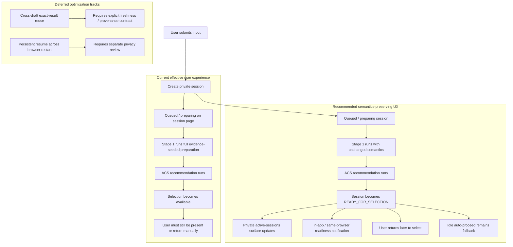

# Session Preparation Semantics-Preserving Async Proposal

## 1. Purpose

This document replaces the text-first redesign as the recommended direction for solving the user-interaction problem around Atomic Claim Selection.

The key clarification is:

- preliminary evidence currently influences Stage 1 atomic-claim generation
- Captain does not want to change that behavior to solve the UX problem

So the recommended direction is:

- keep Stage 1 AC-generation semantics unchanged
- keep ACS recommendation semantics unchanged
- solve the UX problem first with asynchronous session handling, better readiness signaling, and same-semantics Stage 1 hardening
- treat cross-draft reuse and browser-persistent resume as separate guarded follow-on tracks, not part of the primary fix

## 2. Decision Summary

The recommended direction is now:

1. keep current evidence-seeded Stage 1 semantics unchanged
2. stop requiring the user to wait live for selection readiness
3. make session readiness private, visible, and resumable within the same browser session without depending on the selection page staying open
4. continue Stage 1 hardening and waste reduction without changing analytical meaning
5. defer cross-draft prepared-result reuse and browser-persistent resume until they pass separate correctness/privacy review

This is the preferred follow-on path.

The earlier text-first proposal is retained only as a historical debate artifact and is no longer the recommended design for this problem.

## 3. Problem Statement

The current user pain is not only that preparation is slow.

The bigger product problem is that selection becomes available late, while the user experiences the flow as if they must stay present and wait for it.

That creates three UX failures:

- the user can wait a long time before selection is possible
- the session can feel “stuck” even when it is just queued or preparing
- users may leave and not return at the moment selection becomes ready

At the same time, the current architecture means Stage 1 preparation is doing meaningful analytical work:

- Pass 1
- preliminary web search
- Pass 2 evidence-grounded refinement
- Gate 1 / contract validation

Because that behavior currently contributes to atomic-claim generation, this proposal treats it as semantically authoritative and avoids redesigning it away.

## 4. Core Principles

### 4.1 Preserve analytical semantics

Do not change:

- current Stage 1 extraction semantics
- current Gate 1 authority boundary
- current ACS recommendation contract

### 4.2 Make waiting asynchronous

The user should not need to babysit the session page in order to reach selection.

### 4.3 Keep reports and sessions separate

Queued/preparing sessions are not real report jobs and should not be mixed into the global reports list.

### 4.4 Keep recommendation semantics intact

This proposal does not make ACS recommendation optional and does not weaken the current recommendation contract.

### 4.5 Make Phase 1 safe before making it ambitious

The first shipped async slice must not:

- weaken the existing draft-token privacy boundary
- claim cross-browser or cross-device recovery the product does not yet support
- introduce cross-draft analytical drift under the label of “reuse”

## 5. Recommended Solution Stack

### 5.1 Private active sessions surface

Add a private “My active sessions” or equivalent session-inbox surface for the submitting browser/session context.

This surface should show:

- queued
- preparing
- ready for claim selection
- auto-continued
- failed

In the current product, “private” means scoped to the submitting browser session rather than a full authenticated user account model.

### 5.2 Readiness signaling

When a session reaches `AWAITING_CLAIM_SELECTION`, the system should signal that clearly:

- in-app badge
- browser notification only while the app/browser context is still alive and permission exists
- later, optionally, stronger channels after separate product design

This turns long preparation from a live-wait problem into an async resume problem.

### 5.3 Same-semantics Stage 1 hardening

Keep improving latency and stability under the current Stage 1 semantics:

- reduce duplicate retrieval or retry waste
- harden known failure/retry paths
- improve observability
- continue fixing under-splitting, input-expansion, and queue-recoverability bugs

### 5.4 Deferred optimization tracks

Two ideas remain potentially useful, but they are not part of the primary async-fix proof:

- cross-draft exact-result reuse
- browser-persistent resume across full browser restart

Both require separate correctness/privacy approval.

## 6. Current vs Proposed User Experience



## 7. Design

### 7.1 Session/Job boundary

Keep the current conceptual split:

- session = pre-job object that owns preparation and selection
- job = real report-analysis object

Queued or preparing sessions should remain outside the global reports list.

### 7.2 Same-browser session registry

Because the product currently has no authenticated per-user account model, the first private-session surface should be same-browser-session scoped.

The initial design should use a client-side registry rather than a new cross-user server list.

Recommended client-side record shape:

```ts
type ActiveClaimSelectionSessionRef = {
  draftId: string;
  createdUtc: string;
  inputType: string;
  inputPreview: string;
  selectionMode: "interactive" | "automatic";
  lastKnownStatus: string;
  lastKnownFinalJobId?: string | null;
  lastNotifiedStatus?: string | null;
  hidden?: boolean;
};
```

Recommended storage key:

- `fh_active_claim_selection_sessions`

The registry should be updated when:

- a draft is created
- a draft is reopened
- a draft status changes during polling
- a draft reaches a terminal state

Initial Phase 1 storage recommendation:

- keep the active-session registry in `sessionStorage`
- optimize for resumability across navigation in the same browser session
- do not claim full browser-restart persistence in the first slice

### 7.3 Private session inbox

The user should have a persistent place to resume outstanding sessions without needing the original session page open.

This surface should:

- list active sessions for the current browser session
- show state and latest milestone
- link back to the exact session page
- not expose sessions globally to other users

The first implementation should avoid a new “list drafts on the server” endpoint.

Instead:

- read same-browser session refs from session storage
- use the existing access token per draft
- fan out to existing `GET /claim-selection-drafts/{draftId}` reads
- render the inbox from those authenticated per-draft reads

That keeps the privacy boundary simple and avoids inventing shared list semantics before the product has real user accounts.

### 7.4 Access token boundary

Current access tokens are stored in session storage.

For the first async slice, that is acceptable because the goal is same-browser-session resumability, not durable cross-restart recovery.

Recommended direction:

- keep admin-key behavior unchanged
- keep draft access tokens in `sessionStorage`
- clear tokens when the session is cancelled, expired, or promoted to a stable job state
- defer any move to browser-persistent token storage until a dedicated security/privacy review approves it

Persistent resume across browser restart is therefore a separate track, not part of Phase 1.

### 7.5 Notification triggers

A readiness notification should trigger when:

- session status changes to `AWAITING_CLAIM_SELECTION`

It may also be useful later for:

- `FAILED`
- `AUTO_CONFIRMED`
- `COMPLETED_TO_JOB`

The initial slice should focus on selection readiness.

The first notification stack should be:

- in-app badge / active-session count
- browser notification when permission exists and the app/browser context is still active

Do not describe the first slice as push-style recovery after the browser is gone. The current product does not support that.

### 7.6 Inbox load and cleanup safeguards

Because draft reads can also kick queue recovery, the inbox must stay conservative.

Required safeguards:

- cap concurrent per-draft refresh fan-out
- poll with backoff, not tight loops
- dedupe refresh work across visible surfaces where possible
- prune expired, cancelled, and completed entries aggressively
- allow explicit local dismissal/removal

### 7.7 Deferred exact-result reuse contract

Reuse must be exact-contract, not heuristic.

Minimum analytical contract dimensions would include:

- exact active input
- input type
- prompt profile/hash relevant to Stage 1
- config hash relevant to Stage 1 and recommendation
- code or pipeline contract version
- selection cap / recommendation contract where reused

If any of those differ, recompute.

However, review debate found that exact input or URL equality alone is not enough to preserve semantics, because current Stage 1 includes live preliminary search and evidence-seeded refinement.

So this track is deferred unless a stronger correctness contract is approved.

If explored later, any reuse design must include:

- exact resolved-content identity or explicit freshness revalidation
- not just URL string equality
- plus the existing analytical contract dimensions

Recommended backend cache key inputs for any later exploration:

- `activeInputType`
- exact `activeInputValue`
- `pipelineVariant`
- Stage 1 prompt hash
- effective pipeline config hash relevant to Stage 1 and selection
- executing code / contract version

Recommended cache payload:

- prepared Stage 1 snapshot
- recommendation payload
- selection cap used for recommendation
- creation and last-used timestamps
- provenance metadata needed to prove identical-contract reuse

### 7.8 Deferred reuse scope

Start narrow:

- same exact text input only, or
- same resolved-content identity plus same analytical contract

Do not start with:

- same URL string only
- heuristic URL-family matching
- semantic similarity reuse
- cross-contract approximate reuse

### 7.9 Deferred reuse control and invalidation

Because reuse affects live analysis behavior, the on/off control should be UCM-configurable.

Recommended initial controls for any later exploration:

- `pipeline.sessionPreparationReuse.enabled`
- `pipeline.sessionPreparationReuse.maxAgeHours`
- `pipeline.sessionPreparationReuse.allowExactText`
- `pipeline.sessionPreparationReuse.allowResolvedContentIdentity`

The cache must invalidate automatically when any contract dimension in the reuse key changes.

This entire reuse section is deferred until correctness review approves the contract.

### 7.10 Same-semantics hardening priorities

The async UX work should not become an excuse to stop fixing Stage 1.

Priority hardening areas remain:

- duplicate retrieval or retry waste
- queue liveness and recoverability
- fragment/input expansion bugs
- under-splitting / contract-preservation regressions
- misleading or stale session observability

## 8. Why This Is Preferred

This solves the user problem without changing how atomic claims are generated.

That matters because the earlier clarification showed:

- preliminary evidence currently affects Stage 1 AC generation
- changing that would be an analytical change, not just a UX optimization

So this proposal improves:

- usability
- resumability
- perceived responsiveness
- resume success within the same browser session

without changing the analytical contract.

## 9. Risks

### 9.1 Session discoverability risk

Without a good private active-sessions surface, users may still abandon sessions and never return when selection becomes ready.

### 9.2 Notification reliability risk

Browser notifications and in-app badges can improve UX, but they are not guaranteed delivery channels.

They reduce the problem; they do not remove the need for resumable session discovery.

### 9.3 Same-browser limitation risk

The first safe slice improves resumability within the same browser session, but not full cross-restart or cross-device recovery.

That is a real limitation and should be communicated honestly.

### 9.4 Reuse-key incompleteness risk

If the exact-result reuse key is missing a semantics-relevant dimension, stale or invalid prepared snapshots could be reused.

This is the main correctness risk in the deferred optimization track.

### 9.5 False progress risk

If the team improves async UX but not Stage 1 waste and stability, users may still face long waits; they will just experience them differently.

This is why Stage 1 hardening remains part of the plan.

## 10. Rollout Plan

### Phase 1 — Same-browser async session UX

- add a private active-sessions surface on the analyze experience
- expose resumable state, latest milestone, and direct resume links
- add in-app badge and same-browser notification for `AWAITING_CLAIM_SELECTION`
- add inbox load/backoff/pruning safeguards

Implementation outline:

- extend `claim-selection-client.ts` with a small same-browser active-session registry helper
- register new sessions on create and refresh registry entries on draft reads / status changes
- add an analyze-surface component that renders active sessions from the local registry and existing per-draft reads
- add selection-readiness badge and same-browser notification wiring without introducing a new server-side draft-list endpoint
- keep draft access tokens in `sessionStorage` and reuse the current per-draft access model

Acceptance criteria:

- a user can submit input, leave the analyze landing flow, and later resume the same session from the same browser session
- queued and preparing sessions remain outside the global reports list
- when a session reaches `AWAITING_CLAIM_SELECTION`, the analyze experience surfaces that readiness without requiring the original session page to stay open
- no Stage 1 extraction, Gate 1, or recommendation semantics change as part of this phase
- no browser-persistent draft-token storage is introduced in this phase

Primary files likely involved:

- `apps/web/src/lib/claim-selection-client.ts`
- `apps/web/src/app/analyze/page.tsx`
- `apps/web/src/app/analyze/select/[draftId]/page.tsx`
- new web components for the active-session surface

### Phase 2 — Same-semantics hardening and polish

- continue Stage 1 observability and waste reduction
- harden known failure and retry paths
- expand session cleanup, notification dedupe, and recoverability UX
- refine terminal-session pruning and stale-entry cleanup

Acceptance criteria:

- known queue-liveness and stale-state regressions have focused regression coverage
- no visible session surface starts more than one active refresh loop for the same local session list, and the same draft is not fetched concurrently twice within a single scheduled refresh cycle
- failed, cancelled, and expired sessions disappear from the private session surface on the next successful refresh or explicit local dismissal
- sessions promoted to a real job no longer appear as active sessions after the user dismisses them or follows the final job link
- each transition into `AWAITING_CLAIM_SELECTION` emits at most one readiness notification per draft per browser session unless the user explicitly dismisses and later reopens that session

### Phase 3 — Deferred optimization tracks (separate approval)

- evaluate whether browser-persistent resume should exist at all under the current no-account model
- evaluate whether exact-result reuse can be made correctness-safe under current Stage 1 semantics
- do not ship either without separate approval

Exit criteria before any implementation starts:

- explicit approval that Phase 1 excludes persistent token storage and excludes cross-draft reuse
- explicit approval of the local-registry UX shape on the analyze surface
- explicit confirmation that any later reuse design must pass a separate correctness review

## 11. Non-Recommendations

This proposal does not recommend:

- showing selection before the final Stage 1 candidate set exists
- running recommendation on a provisional claim set
- mixing sessions into the global reports list
- redesigning AC generation semantics to make preparation faster
- assuming URL string equality is enough for safe prepared-result reuse
- weakening the draft access-token privacy boundary in Phase 1

## 12. Recommendation

Adopt this as the active follow-on direction.

The user-interaction problem should be solved by:

- asynchronous session UX
- private resumability
- readiness notifications
- same-semantics Stage 1 hardening

not by changing the current semantics of atomic-claim generation.

## 13. Delivery Notes

This proposal is implementation-ready in architecture terms, but still needs explicit approval before any work starts on two deferred areas:

- whether browser-persistent draft access token storage should exist at all
- whether any cross-draft prepared-result reuse can be semantics-safe under current Stage 1 behavior

Those are the two places where a superficially simple UX improvement can accidentally create privacy or correctness drift.

## 14. Review Debate Disposition

The review debate accepted the async direction with two important corrections:

- Phase 1 must be same-browser resumability, not implied cross-browser or cross-device recovery.
- Cross-draft reuse must be deferred because current Stage 1 semantics include live preliminary search and evidence-seeded refinement; exact URL or input equality alone is not a semantics-complete reuse contract.

So the approved implementation target is now narrower and safer:

- ship async resumability first
- keep tokens in `sessionStorage`
- keep Stage 1 semantics unchanged
- treat persistent resume and cross-draft reuse as separate post-approval tracks
