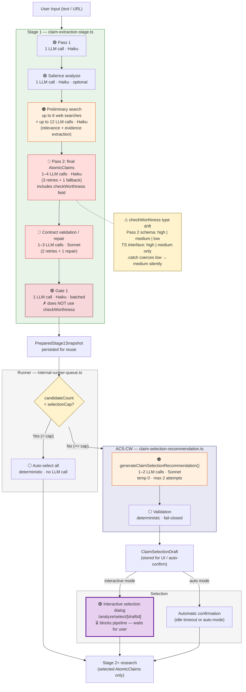
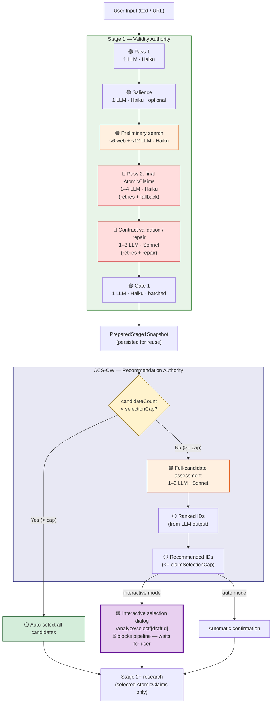

# Atomic Claim Stage 1 and Check-Worthiness Unification Assessment

**Date**: 2026-04-24
**Role**: Lead Architect
**Status**: Architecture assessment complete; implementation not started
**Decision**: **MODIFY** - unify the service contract and ownership boundary, not the extraction stage or Gate 1 control flow.

---

## Executive Summary

FactHarbor currently has two adjacent capabilities:

1. **AtomicClaim extraction** in Stage 1, implemented mainly in `apps/web/src/lib/analyzer/claim-extraction-stage.ts`.
2. **Claim selection / check-worthiness recommendation** after Stage 1, implemented mainly in `apps/web/src/lib/analyzer/claim-selection-recommendation.ts` and executed by the draft preparation path in `apps/web/src/lib/internal-runner-queue.ts`.

They are similar because both reason about which assertions matter for analysis. They should not be fully merged because they have different authority:

- Stage 1 decides what the valid final `AtomicClaim` candidate set is.
- ACS-CW decides which already-valid `AtomicClaim`s should be selected first when manual or automatic claim selection is needed.

The lean architecture is therefore:

- Keep Stage 1 extraction, contract validation, and Gate 1 unchanged as the validity authority.
- Treat ACS-CW as the single internal post-Gate-1 recommendation authority.
- Unify terminology, types, audit metadata, and service contract around that recommendation layer.
- Keep `AtomicClaim.checkWorthiness` as coarse extraction-time metadata only until it is type-aligned, renamed, or retired.

This gives the desired unification without adding work to the already slow Stage 1 critical path.

---

## Method

This assessment used:

- Source review of Stage 1 extraction, claim selection recommendation, runner draft preparation, selection flow, pipeline configuration, prompt sections, and supporting tests.
- Recent architecture and WIP documentation review, especially the Atomic Claim Selection implementation spec, check-worthiness recommendation design, and current selection-readiness root-cause plan.
- A standard adversarial debate with advocate, challenger, and reconciler agents. The debate transcript is intentionally not recorded here; only the resulting decision is captured.

---

## Current Architecture



**Cost/latency legend:** 🔴 expensive (Sonnet tier or high retry multiplier) · 🟠 moderate (multiple calls or web I/O) · 🟢 cheap (single Haiku call) · ⚪ deterministic (no LLM) · 🟣 user-blocking (interactive selection dialog — pipeline pauses until user confirms). Stage 1 dominates total time-to-selection: preliminary search + Pass 2 retries + contract validation retries can reach **~19 LLM calls** before ACS-CW adds 1–2 more.

### Stage 1 AtomicClaim extraction

Primary file: `apps/web/src/lib/analyzer/claim-extraction-stage.ts`

The current Stage 1 flow is not just text splitting. It is an evidence-seeded understand/extract stage:

1. Pass 1 extracts rough claims from the original input.
2. Salience analysis reasons about centrality and article-level focus.
3. Preliminary search fetches sources for a bounded set of rough claims.
4. Pass 2 emits final `AtomicClaim`s using original input plus preliminary evidence context.
5. Contract validation checks preservation of the user's claim contract and may retry or repair.
6. Gate 1 filters invalid candidates based on opinion/specificity/grounding rules.

Important details:

- Pass 2 currently emits `checkWorthiness: "high" | "medium" | "low"` in the schema/prompt.
- The `AtomicClaim` TypeScript interface currently narrows this to `"high" | "medium"`, which is contract drift.
- Runtime Gate 1 does not use `AtomicClaim.checkWorthiness` as selection authority.
- Recent WIP docs explicitly treat `AtomicClaim.checkWorthiness` as coarse advisory metadata.

Conclusion: Stage 1 owns candidate validity. It should not also become the user-facing selection ranking authority.

### Post-Gate-1 ACS-CW recommendation

Primary file: `apps/web/src/lib/analyzer/claim-selection-recommendation.ts`

The current recommendation module:

- Consumes the final Stage 1 `atomicClaims`.
- Runs one batched LLM call over all candidates.
- Produces one assessment per candidate.
- Produces a complete ranked list.
- Produces recommended claim IDs bounded by `claimSelectionCap`.
- Validates full candidate coverage, ranked permutation, subset/cap constraints, and rationale presence.
- Fails closed if recommendation generation cannot satisfy the contract.

The runner path in `apps/web/src/lib/internal-runner-queue.ts` places it after `prepareStage1Snapshot(...)`, and skips the recommendation call when the candidate count is below the configured cap.

Conclusion: ACS-CW already has the right lean shape. It is a single batched, post-Gate-1, auditable LLM recommendation service.

### Prepared Stage 1 reuse boundary

Primary file: `apps/web/src/lib/analyzer/claimboundary-pipeline.ts`

The prepared-job path stores a `PreparedStage1Snapshot` and later builds the research state from only the selected claim IDs. This means:

- Stage 1 is executed before claim selection.
- Stage 2+ operate only on selected claims.
- The recommendation service should never produce candidates that were not emitted by Stage 1.

This is the right boundary for lean unification. It avoids re-running extraction and avoids a second authority over what the valid claims are.

---

## Recent Documentation Alignment

### Canonical ACS implementation direction

`Docs/WIP/2026-04-22_Atomic_Claim_Selection_Implementation_Spec.md` says the recommendation should be one batched LLM call over the final candidate claims, not a second Stage 1 authority. It also says current Stage 1 `checkWorthiness` is advisory.

### Check-worthiness recommendation design

`Docs/WIP/2026-04-22_Check_Worthiness_Recommendation_Design.md` defines ACS-CW as post-Gate-1, inside ACS draft/prepared-job architecture. It rejects fallback from recommendation failure to extraction-time `checkWorthiness`.

### Current selection-readiness root cause

`Docs/WIP/2026-04-24_Selection_Readiness_Root_Cause_And_Fix_Plan.md` identifies the dominant latency as the full Stage 1 path before selection readiness, not ACS-CW by itself.

### Retired alternatives

`Docs/WIP/2026-04-23_Session_Preparation_Text_First_Follow_On_Proposal.md` is retired. Text-first or pre-ACS shortcuts are not the current direction because preliminary evidence can affect final atomic claims.

Conclusion: A full merge would contradict the recent architecture record. A service-contract unification matches it.

---

## Debate Result

The reconciled debate result was **MODIFY**:

- Adopt lean unification only at the internal contract/service-boundary level.
- Reject unifying Stage 1 extraction, Gate 1 validity, and ACS check-worthiness into one combined LLM judgment.
- Keep Stage 1 as the authority for extraction, contract validation, and Gate 1 validity.
- Make ACS-CW the single internal post-Gate-1 recommendation authority for final `atomicClaims`.
- Type-align, rename, or retire extraction-time `AtomicClaim.checkWorthiness`.
- Do not use deterministic semantic shortcuts.
- Do not expose ACS-CW as a public pre-ACS service.

---

## Architectural Diagnosis

### Why the features look duplicative

Both capabilities ask a semantic question about claim value:

- Stage 1 asks: "Which assertions from the input are valid, central, grounded enough, and worth carrying forward as `AtomicClaim`s?"
- ACS-CW asks: "Given the final valid `AtomicClaim`s, which should be selected first for a bounded analysis run?"

The overlap is real, but it is not identical. Stage 1 is about validity and preservation of the user's claim contract. ACS-CW is about selection priority within a valid candidate set.

### Why a full merge is risky

A full merge would put candidate validity, extraction, Gate 1 survival, and selection ranking into one overloaded LLM decision. That creates several risks:

- Gate 1 could become entangled with selection preference.
- User-facing selection could inherit extraction-time prompt constraints that were not designed for ranking.
- Failure handling would become ambiguous: extraction failure and recommendation failure require different operational responses.
- Latency could increase on the Stage 1 critical path because selection reasoning would happen during extraction instead of after final candidates exist.
- It would be harder to keep multilingual robustness and input neutrality stable because one prompt would own more competing tasks.

### Why pure status quo is also insufficient

Keeping everything as-is leaves avoidable ambiguity:

- The name `checkWorthiness` appears in both extraction-time metadata and ACS recommendation concepts, but they do not have the same authority.
- There is schema/type drift around `low`.
- The UI currently displays both extraction `checkWorthiness` and recommendation assessment fields, which can confuse the user unless labels make the authority distinction clear.
- Observability can under-attribute latency between Stage 1 and the recommendation call.

---

## Options

### Option 1: Full merge into Stage 1

**Description**: Expand Pass 2 or Gate 1 so extraction emits final selected/recommended claims, removing the post-Gate-1 ACS-CW call.

**Benefits**:

- One fewer conceptual layer.
- Possibly one fewer LLM call in some cases.

**Costs and risks**:

- Collapses candidate validity and selection authority.
- Reintroduces the retired direction of pre-final or text-first selection shortcuts.
- Makes Stage 1 prompt and retry behavior more complex.
- Makes fail-closed recommendation behavior harder to isolate.
- Does not address the documented Stage 1 latency root cause.
- Requires prompt changes, which need explicit human approval.

**Assessment**: Reject.

### Option 2: Keep strict separation with no cleanup

**Description**: Leave extraction-time `checkWorthiness` and ACS-CW recommendation as-is.

**Benefits**:

- No implementation risk.
- Current ACS-CW is already lean: one batched call and skipped below cap.

**Costs and risks**:

- Leaves authority ambiguity in names and UI.
- Leaves `low` schema/type drift.
- Makes future reuse harder because consumers may choose the wrong field.
- Leaves cost/latency attribution less clear.

**Assessment**: Acceptable short-term, but not the best architecture.

### Option 3: Lean internal service/contract unification

**Description**: Preserve the layered runtime but make ACS-CW the single recommendation authority and clean up the contract around it.

This means:

- `claim-selection-recommendation.ts` remains the reusable internal recommendation boundary.
- Stage 1 continues to emit final `AtomicClaim`s.
- `AtomicClaim.checkWorthiness` is explicitly treated as coarse extraction-time metadata only.
- Recommendation output owns user-facing rank, triage, directness, evidence-yield estimate, distinct-dimension status, and selection rationale.
- Types/docs/UI labels are aligned so consumers cannot confuse advisory extraction metadata with recommendation authority.

**Benefits**:

- Keeps ACS-CW lean and batched.
- Preserves Gate 1 authority.
- Avoids adding work to Stage 1.
- Makes future reuse safer.
- Allows precise observability around Stage 1 versus recommendation latency.

**Costs and risks**:

- Not a "true" single-stage unification.
- Requires discipline to prevent future consumers from using `AtomicClaim.checkWorthiness` as a shortcut.
- Needs some no-behavior cleanup in types, labels, tests, and docs.

**Assessment**: Preferred.

### Option 4: Future unified model after shadow evaluation

**Description**: Keep current architecture, but run a future experiment where a single model output attempts to produce both final claims and selection recommendation.

**Benefits**:

- Could eventually reduce calls or simplify UX.
- Could discover whether extraction and selection can share reasoning safely.

**Costs and risks**:

- Needs high-quality multilingual evaluation.
- Needs Captain-approved inputs only.
- Needs no prompt changes without explicit approval.
- Must prove no regression in contract preservation, Gate 1 quality, selection quality, latency, and cost.

**Assessment**: Defer. Only consider after current Stage 1 latency and ACS correctness are stable.

---

## Recommended Architecture

### Decision

Use **Option 3: Lean internal service/contract unification**.

### Target shape



### ACS-CW service interface

Source: `apps/web/src/lib/analyzer/claim-selection-recommendation.ts`

**Entry point:**

```typescript
generateClaimSelectionRecommendation({
  originalInput: string,
  impliedClaim: string,
  articleThesis: string,
  atomicClaims: AtomicClaim[],
  selectionCap?: number | null,
  pipelineConfig?: PipelineConfig,
}): Promise<ClaimSelectionRecommendation>
```

**Output contract** (`ClaimSelectionRecommendation`):

| Field | Type | Constraint |
|---|---|---|
| `rankedClaimIds` | `string[]` | Exact permutation of all candidate IDs |
| `recommendedClaimIds` | `string[]` | Subset of ranked; `length <= selectionCap` |
| `assessments` | `ClaimSelectionRecommendationAssessment[]` | One per candidate; full coverage required |
| `rationale` | `string` | Batch-level reasoning (max 240 chars) |

**Per-claim assessment** (`ClaimSelectionRecommendationAssessment`):

| Field | Type |
|---|---|
| `claimId` | `string` |
| `triageLabel` | `"fact_check_worthy" \| "fact_non_check_worthy" \| "opinion_or_subjective" \| "unclear"` |
| `thesisDirectness` | `"high" \| "medium" \| "low"` |
| `expectedEvidenceYield` | `"high" \| "medium" \| "low"` |
| `coversDistinctRelevantDimension` | `boolean` |
| `redundancyWithClaimIds` | `string[]` |
| `recommendationRationale` | `string` (max 160 chars) |

**Skip-below-cap gate** (`claim-selection-flow.ts`):

```typescript
shouldAutoContinueWithoutSelection(candidateCount, configuredCap): boolean
// Returns true when candidateCount > 0 AND candidateCount < normalizedCap (default 5, max 5)
// True → skip recommendation, auto-select all candidates
// False → generate recommendation via one batched LLM call
```

**Invariants enforced at validation time:**

- Assessment coverage: every candidate ID has exactly one assessment.
- Ranked permutation: `rankedClaimIds` is an exact permutation of candidate IDs.
- Subset constraint: `recommendedClaimIds` is a subset of `rankedClaimIds`.
- Cap constraint: `recommendedClaimIds.length <= selectionCap`.
- Rationale presence: both batch `rationale` and per-assessment `recommendationRationale` are non-empty after normalization.
- Fail-closed: any validation failure throws; no silent fallback to extraction-time `checkWorthiness`.

**Runtime configuration:**

| Setting | Value | Source |
|---|---|---|
| Model task | `"context_refinement"` | `getModelForTask()` |
| Temperature | `0` | Deterministic |
| Max attempts | `2` | Hardcoded |
| Selection cap | `1–5` (default 5) | `normalizeClaimSelectionCap()` |

### Authority rules

| Area | Authority | Notes |
|---|---|---|
| Candidate existence | Stage 1 | ACS-CW cannot invent claims. |
| Contract preservation | Stage 1 contract validation | ACS-CW receives only final candidates. |
| Gate 1 validity | Stage 1 Gate 1 | ACS-CW ranks among survivors. |
| User-facing claim priority | ACS-CW | `AtomicClaim.checkWorthiness` must not drive selection. |
| Failure handling | Separate | Extraction failure and recommendation failure stay operationally distinct. |
| Semantic decisions | LLM only | No deterministic check-worthiness fallback. |

### Lean cost controls to preserve

- Run ACS-CW only after final Stage 1 candidates exist.
- Skip ACS-CW below the configured selection cap.
- Keep one batched recommendation call for all candidates.
- Keep strict invariant checks so bad output fails closed rather than silently selecting.
- Do not add a second or parallel check-worthiness call inside Stage 1.

### Lean hardening opportunities

These are small, compatible improvements:

- Add explicit observability for Stage 1 duration versus recommendation duration.
- Add a bounded output/token and timeout policy if compatible with the AI SDK wrapper and UCM model settings.
- Add focused tests around recommendation failure handling and draft-service API behavior.
- Consider a dedicated model-task name for ACS-CW only if it improves observability/configuration without changing behavior.
- Evaluate any tier change from `context_refinement`/standard only after quality baselines, not as a blind cost reduction.

---

## Pre-Selection Latency Assessment

*Added 2026-04-25 by Lead Developer review.*

### Question

Can any significant-latency work currently before the interactive selection dialog be moved to after it without losing quality?

### Pre-selection cost breakdown

| Step | Cost | Model | Movable? | Why |
|---|---|---|---|---|
| Pass 1 | 1 LLM call | Haiku | No | Produces the rough claims that seed everything else |
| Salience | 1 LLM call (optional) | Haiku | No | Informs centrality — needed for claim quality |
| Preliminary search | 6 web + up to 12 LLM | Haiku | **Technically yes** | Only enriches `expectedEvidenceProfile` and `groundingQuality` — claim statements are text-derived |
| Pass 2 | 1–4 LLM calls | Haiku | No | Produces the AtomicClaims the user selects from |
| Contract validation | 1–3 LLM calls | Sonnet | No | Validates fidelity to input — must run before user sees claims |
| Gate 1 | 1 LLM call | Haiku | No | Filters invalid claims — user should not see them |
| ACS-CW | 1–2 LLM calls | Sonnet | No | Produces the recommendation that powers the selection UI |

### The one candidate: preliminary search

Preliminary search is the only significant pre-selection cost that does not structurally gate what the user sees. The prompt contract (`claimboundary.prompt.md`) explicitly states:

> *"Extract precise, research-ready atomic claims from the original input. Use preliminary evidence only to populate `expectedEvidenceProfile` and `groundingQuality`."*

The claim `statement` fields are derived from input text alone. A fallback path already exists in `claim-extraction-stage.ts` that runs Pass 2 without any evidence (used for soft-refusal retries). Contract validation and Gate 1 do not use preliminary evidence at all. ACS-CW recommendation consumes only the final AtomicClaim objects, not the evidence.

### Why this was already rejected

The retired text-first proposal (`Docs/WIP/2026-04-23_Session_Preparation_Text_First_Follow_On_Proposal.md`) proposed exactly this: run Pass 2 text-only, show selection earlier, run evidence grounding later. The Captain rejected it as a **semantics-changing redesign** because:

- Preliminary evidence helps calibrate `groundingQuality` on difficult inputs (campaign pages, long PDFs, manifesto-style content).
- The quality loss from removing it is **not yet measured**.
- Changing the default path would violate the current ACS v1 contract.

### Conclusion

There is no free latency win hiding in the current pipeline. Every step before the selection dialog either produces the claims, validates them, filters invalid ones, or ranks them for selection. The only movable cost (preliminary search) requires a product decision backed by shadow-mode quality validation — not a code refactoring.

The right path is already documented in this assessment's Phase 3 roadmap: defer to a future experiment track with Captain-approved test inputs and before/after quality comparison. Do not silently remove preliminary search from the default path.

---

## Type and Terminology Cleanup

### Current issue

`AtomicClaim.checkWorthiness` currently has conflicting contracts:

- Pass 2 schema/prompt allows `"high" | "medium" | "low"`.
- The `AtomicClaim` TypeScript interface narrows it to `"high" | "medium"`.
- ACS-CW has richer fields and owns the actual recommendation decision.

### Recommended cleanup

Choose one of these cleanup paths:

1. **Type-align advisory field**: update `AtomicClaim.checkWorthiness` to match the schema and document it as `extraction-time advisory`.
2. **Rename field in a future migration**: use a clearer name such as `extractionCheckWorthiness` or `extractionPriorityHint`.
3. **Retire field after migration**: remove extraction-time check-worthiness once ACS-CW coverage and UI usage no longer need it.

Path 1 is the leanest short-term fix. Paths 2 and 3 are cleaner long-term, but they need migration care.

### UI wording

If both signals remain visible, labels should distinguish them:

- Extraction signal: "Extraction priority hint" or "Stage 1 priority hint".
- ACS-CW signal: "Recommendation" or "Selection recommendation".

The UI should not imply that both are equal-ranking authorities.

---

## Risk Analysis

| Risk | Where it appears | Impact | Mitigation |
|---|---|---:|---|
| Authority drift | Consumers use `AtomicClaim.checkWorthiness` as selector | High | Document and enforce ACS-CW as sole recommendation authority. |
| Schema/type drift | `low` allowed by schema but not type | Medium | Type-align or deprecate the field. |
| Latency misdiagnosis | Blaming ACS-CW for full Stage 1 delay | High | Instrument Stage 1 and recommendation durations separately. |
| Prompt overloading | Full merger into Pass 2/Gate 1 | High | Reject full merge unless shadow evaluation proves parity. |
| Deterministic fallback | Rule-based selection if LLM fails | High | Keep fail-closed behavior; no semantic heuristics. |
| Public pre-ACS service | External caller uses ACS-CW before final candidates | Medium | Keep module internal and post-Gate-1. |
| Multilingual regression | Selection labels overfit English phrasing | Medium | Validate with Captain-approved multilingual inputs before behavior changes. |
| Cost creep | Additional recommendation/retry calls | Medium | Preserve one batched call and skip-below-cap behavior; add observability. |
| UI confusion | Two check-worthiness-like signals displayed | Medium | Rename labels and document authority distinction. |

---

## Opportunity Analysis

| Opportunity | Value | How to capture |
|---|---:|---|
| Clearer architecture | High | Make ACS-CW the only recommendation authority. |
| Lower implementation risk | High | Avoid prompt/control-flow merge. |
| Better cost visibility | Medium | Split telemetry for Stage 1 and ACS-CW. |
| Safer future reuse | Medium | Keep a reusable internal recommendation contract over final candidates. |
| Better UI trust | Medium | Distinguish advisory extraction metadata from recommendation output. |
| Easier testing | Medium | Keep extraction tests and recommendation invariant tests separate. |
| Future optimization | Medium | Evaluate model tier or caching only after metrics. |

---

## Proposed Roadmap

### Phase 0 - Decision record

Status: this document.

- Record that full runtime unification is rejected.
- Record that lean service/contract unification is preferred.
- Record that Stage 1 latency must be handled directly, not hidden by ACS-CW changes.

### Phase 1 - No-behavior cleanup

Recommended first implementation slice:

- Type-align or explicitly deprecate `AtomicClaim.checkWorthiness`.
- Add comments/docs making it extraction-time advisory only.
- Review UI labels so recommendation authority is clear.
- Add or update focused tests that protect ACS-CW invariants and skip-below-cap behavior.
- Add metrics/log labels separating Stage 1 duration from recommendation duration.

No prompt change is required for this slice unless the Captain explicitly approves it.

### Phase 2 - Service hardening

Recommended second slice:

- Treat `claim-selection-recommendation.ts` as the internal ACS-CW service boundary.
- Add explicit operational limits where supported: timeout, output bound, attempt metrics.
- Add API-side draft-service tests for recommendation failure, confirmation subset/cap validation, and stale draft handling if coverage is missing.
- Keep fail-closed behavior for invalid recommendation output.

### Phase 3 - Future experiments only after baselines

Potential later work:

- Evaluate a lower-cost model tier for ACS-CW against quality baselines.
- Evaluate exact same-job or cross-session snapshot reuse only under provenance/freshness rules.
- Shadow-test deeper unification with Captain-approved multilingual inputs.

Do not ship deeper unification unless it preserves claim contract, Gate 1 behavior, selection quality, multilingual robustness, latency, and cost.

---

## Non-Goals

- Do not merge ACS-CW into Pass 2 or Gate 1 now.
- Do not remove preliminary evidence from Stage 1.
- Do not add deterministic semantic scoring, keywords, regex rules, or fallback selection.
- Do not expose a public standalone pre-ACS check-worthiness endpoint.
- Do not change analysis prompts without explicit human approval.
- Do not treat ACS-CW optimization as the fix for full Stage 1 time-to-selection.

---

## Validation Plan for Any Future Code Change

For Phase 1 or Phase 2 cleanup:

- Run focused unit tests for claim selection recommendation and Stage 1 contract behavior.
- Run `npm test` if the change touches shared analyzer contracts.
- Run `npm -w apps/web run build` for type-level contract changes.

For any behavior-changing recommendation work:

- Use only Captain-defined analysis inputs.
- Include multilingual scenarios.
- Compare before/after selected IDs, ranked order, rationale quality, failure rate, latency, and model cost.
- Do not run expensive live validation routinely; commit/restart/reseed discipline applies if live jobs are needed.

---

## Final Recommendation

Unify **ownership and contract**, not **runtime reasoning stages**.

The right lean move is to make ACS-CW the single internal recommendation authority over final post-Gate-1 `AtomicClaim`s, while Stage 1 remains the only authority for extraction, contract preservation, and Gate 1 validity.

This preserves quality boundaries, avoids worsening the Stage 1 critical path, and still removes the real duplication risk: ambiguous check-worthiness terminology and unclear authority.
