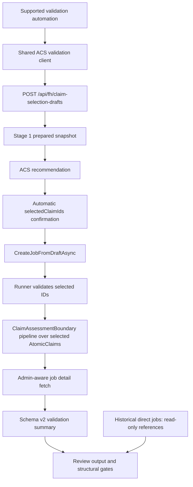
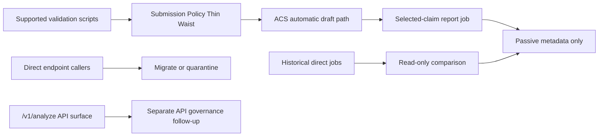
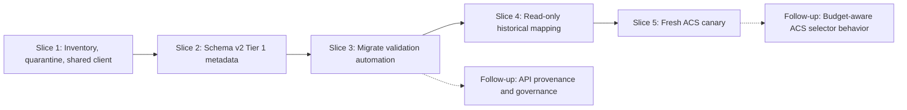

# ACS Validation Final Specification and Implementation Plan

**Date:** 2026-04-28
**Status:** Final consolidated specification for implementation review
**Decision:** Use one supported live non-interactive validation path through ACS automatic drafts. Do not add a direct-full rerun mode. Add passive metadata, read-only historical comparison, and explicit quarantine of direct-analysis callers.

---

## 1. Goal

Reduce validation-path complexity while preserving report quality, speed, cost control, and low operational risk.

The current regression pattern is path-related: recent non-interactive validation jobs used `claimSelectionDraftId` and ACS automatic selection, while the historical good references were direct all-claim jobs. The fix is not another execution path. The fix is a narrower supported path with enough passive metadata to explain what ACS prepared, ranked, recommended, deferred, selected, and finally analyzed.

## 2. Final Decision

- Supported non-interactive validation automation must use ACS automatic drafts through one shared client.
- The final report job must analyze only the selected `AtomicClaim`s.
- Validation summaries must expose passive schema v2 metadata from existing draft/job/result state.
- Historical direct jobs are read-only attribution references, not acceptance baselines.
- Direct `/v1/analyze` and `/api/fh/analyze` callers are migrated or quarantined before they can be used for validation decisions.
- API-level `/v1/analyze` governance is a separate follow-up, not part of the next implementation stream.
- Recent Stage 2 research-budget fixes are baseline behavior; ACS validation work must observe them, not duplicate them.
- No prompt changes, analyzer changes, extra LLM calls, extra searches, direct-full reruns, or deterministic semantic checks are part of this specification.

## 3. Scope Boundaries

### Supported Validation Automation

Supported validation automation means scripts allowed to submit live jobs used for regression, release, or quality decisions.

After migration, supported automation is:

- `scripts/validation/extract-validation-summary.js`
- `scripts/run-validation-matrix.js`
- `apps/web/scripts/baseline-runner.js`

Every supported script must go through the shared ACS validation client and emit `submissionPath: "acs-automatic-draft"`.

### Quarantined or Legacy Inputs

These tools are not supported validation automation until migrated or explicitly reclassified:

| Path | Current target | Required disposition |
|---|---|---|
| `scripts/Benchmarks/phaseA_search_experiment.py` | `/v1/analyze` | Quarantine as benchmark/forensic unless migrated. |
| `scripts/Benchmarks/phase1_experiment.py` | `/v1/analyze` | Quarantine as benchmark/forensic unless migrated. |
| `scripts/inverse-scope-regression.ps1` | `/v1/analyze` | Migrate or quarantine before live validation use. |
| `scripts/run-regression.ps1` | `/v1/analyze` | Migrate or quarantine before live validation use. |
| `scripts/submit-hydrogen-job.ps1` | `/v1/analyze` | Quarantine as ad hoc manual helper. |
| `scripts/run-baseline.ps1` | `/api/fh/analyze` | Migrate to shared ACS validation client. |
| `apps/web/test/scripts/regression-test.js` | ACS helper, but stale hardcoded inputs/result schema | Quarantine because inputs are not Captain-approved and result parsing is stale. |

Quarantine means labeling and exclusion from supported-validation documentation, not runtime enforcement.

## 4. Target Architecture

The target is one supported validation thin waist. Legacy direct API access can still exist, but it must not feed release or regression validation decisions.

### Target Execution Path

### Policy Boundary Diagram

### Implementation Flow

## 5. Shared ACS Validation Client Specification

Extend `apps/web/scripts/automatic-claim-selection.js` into the canonical validation client.

It must:

- submit ACS drafts with automatic selection;
- wait for draft and final job completion;
- fetch final job details with admin headers when available;
- extract current ClaimAssessmentBoundary result summaries;
- extract prepared/ranked/recommended/not-recommended/not-selected/explicitly-deferred/selected metadata from `PreparedStage1Json` and `ClaimSelectionJson`;
- return `AWAITING_CLAIM_SELECTION` as a structured terminal outcome, not an opaque helper crash;
- report `metadataUnavailable` when admin metadata cannot be fetched or parsed.

The client must not:

- call the analyzer directly;
- submit direct full-analysis jobs;
- trigger extra LLM calls, searches, pipeline stages, or retries for validation bookkeeping;
- infer semantic meaning from text with regex, keywords, or language-specific heuristics.

## 6. Summary Schema v2

Summary schema v2 is passive. It reads existing draft/job/result state and labels the submission path. `submissionPath` is introduced by this schema v2 summary work; older summaries created before this implementation will not contain it.

### Tier 1 - Required in Slice 2

| Field | Notes |
|---|---|
| `schemaVersion` | New version for ACS-aware summaries. |
| `submissionPath` | `acs-automatic-draft` for supported validation summaries. |
| `draftId` | ACS draft ID when present. |
| `jobId` | Final job ID. |
| `claimSelectionDraftId` | Job-level draft link. |
| `draftStatus`, `jobStatus` | Terminal and intermediate state. |
| `gitCommitHash` | Source provenance already present in job/result metadata when available. |
| `metadataUnavailable`, `metadataUnavailableReason` | Required if admin metadata cannot be fetched or parsed. |
| `preparedClaimCount`, `preparedClaimIds` | From `PreparedStage1Json`. |
| `rankedClaimCount`, `rankedClaimIds` | From `ClaimSelectionJson`. |
| `recommendedClaimCount`, `recommendedClaimIds` | From `ClaimSelectionJson`. |
| `selectedClaimCount`, `selectedClaimIds` | From `ClaimSelectionJson`. |
| `notRecommendedClaimCount`, `notRecommendedClaimIds` | Derived structurally as ranked claims not in `recommendedClaimIds`; do not treat as rejected or invalid. |
| `notSelectedClaimCount`, `notSelectedClaimIds` | Derived structurally as prepared claims not in `selectedClaimIds`; do not treat as rejected or invalid. |
| `deferredClaimCount`, `deferredClaimIds` | Explicit budget-deferred claims only, from `ClaimSelectionJson` when budget-aware `allow_fewer_recommendations` metadata exists. Do not use this field for ordinary unselected candidates. |
| `claimSelectionCap` | From `ClaimSelectionJson` when present; otherwise status as unavailable, not inferred. |
| `truthPercentage`, `verdict`, `confidence` | Current ClaimAssessmentBoundary result schema. |
| `claimVerdictCount`, `claimBoundaryCount` | Result scope. |
| `evidenceCount`, `sourceCount` | Result quality surface. |
| `warnings` | Type/severity/count. |

### Current Read-If-Present Stage 2 Telemetry

These fields already exist on current reports when ACS research-waste observability is present. Read them from the concrete result path below; do not create drifting aliases and do not mark metadata unavailable solely because older jobs lack this block.

| Field | Source path |
|---|---|
| `selectedClaimResearch` | `resultJson.analysisObservability.acsResearchWaste.selectedClaimResearch` |
| `contradictionReachability` | `resultJson.analysisObservability.acsResearchWaste.contradictionReachability` |

### Tier 2 - Add When Passive Telemetry Exists

| Field | Notes |
|---|---|
| `executedWebGitCommitHash` | Add when the executed web revision is separately available. |
| `promptHash` | Prompt content hash from result metadata when reliably surfaced. |
| `activePipelineConfigHash` | UCM/config hash when available from runtime provenance. |
| `claimSelectionDefaultMode` | UCM value captured at submission time when available. |
| `claimSelectionBudgetAwarenessEnabled` | UCM value when available. |
| `claimSelectionBudgetFitMode` | UCM value when available. |
| `claimSelectionMinRecommendedClaims` | UCM value when available. |
| `budgetFitRationale` | Required once budget-aware fewer-than-cap selection is visible in summary data. |
| `stage1Ms`, `recommendationMs`, `totalPrepMs` | Draft timing observability when available. |
| `budgetFeasibility` | Future ACS selector output: `within_budget`, `tight`, or `over_budget`. |
| `selectedClaimBudgetRationale` | Future ACS selector output explaining selected-set budget fit. |
| `selectedClaimBudgetSignals` | Future per-candidate or selected-set labels such as estimated research cost, source availability risk, source reuse potential, and representativeness role. |

Slice 4 may add `historicalDirectReferenceJobId` or an equivalent review-table column. It is not required for Slice 2.

## 7. Structural Validation Gates

These gates classify validation health. They do not make semantic truth judgments and must not use keywords, regexes, English-only assumptions, or deterministic text interpretation.

### Blockers

- Supported validation job has `submissionPath` other than `acs-automatic-draft`.
- ACS validation job lacks admin metadata and no explicit `metadataUnavailable` status is recorded.
- Draft ends in `AWAITING_CLAIM_SELECTION` during automatic validation.
- Selected count is `0`.
- Script uses a direct endpoint while marked as supported validation automation.

### Warnings

- Historical direct reference is missing or stale.
- `UNVERIFIED` appears on a historically evidenced Captain-approved input. This is suspicious and triggers AGENTS.md UNVERIFIED ambiguity discipline before anyone classifies it as genuine evidence scarcity.
- Prepared-to-selected collapse is large and not explained by ordinary not-selected vs explicit budget-deferred metadata.
- UCM/config provenance is missing when explicitly expected by a review, while it remains Tier 2 telemetry.
- Fewer-than-cap selection occurs without visible rationale, if budget-aware ACS is active.
- Acquisition warnings suggest materially degraded report quality.

### Future Gates

Use these only once passive telemetry exists:

- selected claims receive zero Stage 2 iterations; report this as a pipeline-quality finding, not as a validation-tooling blocker;
- contradiction phase is unreachable because budget was exhausted;
- per-selected-claim evidence count is zero where the claim was selected for final analysis;
- ACS recommendation timing or Stage 1 timing exceeds configured review thresholds.

## 8. Historical Comparison Policy

Historical direct jobs are attribution references only.

Use them to ask:

- Did the submission path change?
- Did prepared/selected claim scope change?
- Did boundary/evidence/verdict shape collapse in the ACS path?

Do not use them to claim:

- current ACS parity is proven;
- direct full-analysis should be rerun;
- current prompt/analyzer behavior is equivalent to historical behavior.

Implementation fixture:

`scripts/validation/captain-approved-families.json` carries the current
read-only historical direct references for all 8 Captain-approved validation
families. These rows are passive comparator metadata only. They must not be
used to submit direct reruns or to claim current ACS parity is proven.

| Family | Historical direct reference | ACS job that exposed concern |
|---|---|---|
| `bundesrat_eu_rechtskraeftig` | `bb040bdd292746db94c3f4d02f5882c3` | pending fresh ACS canary |
| `bundesrat_eu_bevor` | `a6b0e0fc14984926a678a462456bc110` (stale direct; best available) | pending fresh ACS canary |
| `asyl_schweiz_235000` | `8707c63709a64b6489a9a31d1fd0f979` | pending fresh ACS canary |
| `fluechtlinge_schweiz_235000` | `c5c8956d57944a92ac56398470c2270b` | pending fresh ACS canary |
| `bolsonaro_en_legal_fair_trial` | `790573c784214a97b7fa75365960f13a` | `7ece4b51add7470685ceb56387c715da` |
| `bolsonaro_pt_processo` | `93eb78a0e53b4e3f93e2279f88ad8880` | pending fresh ACS canary |
| `hydrogen_cars_efficiency` | `99b663a5a13040f88e1d81ae56cde337` | pending fresh ACS canary |
| `plastic_recycling_pointless` | `f174e02fa0c54070b0a25c6922b13836` | pending fresh ACS canary |

Previously reviewed URL triage references remain useful context but are not in
the current Captain-approved validation fixture:

| Family | Historical direct reference | ACS job that exposed concern |
|---|---|---|
| SVP PDF | `9acde15a85c24512845d7255aa7e5d96` | `9f338d563781412f80e7a2edf43f1dd6` |
| RT URL | No clean successful direct comparator in reviewed set | `18b07fa8efa345178f5eb59406ea2805` |

Slice 4 maps all Captain-approved validation families to their best available
historical direct reference, including marking stale comparators explicitly.

## 9. Stage 2 Baseline and Budget-Aware ACS Follow-Up

The ACS validation implementation must treat the following Stage 2 fixes as already-landed baseline behavior:

- `c1c6e62a` - Preserve contradiction research budget within iterations.
- `d59d18f3` - Continue research after zero-yield claims.
- `22b1caa2` - Prioritize first research pass per claim.

Do not reimplement these fixes inside ACS or validation scripts. The validation client should expose enough passive metadata to see whether the selected set still causes avoidable research-budget stress.

Budget-aware ACS selector behavior is a follow-up after validation metadata exists. When that follow-up starts, optimize the selected set rather than only ranking claims independently:

- preserve centrality and representativeness of the input;
- keep the selected set feasible for the configured Stage 2 budget;
- prefer a mix that can receive at least one targeted pass per selected claim plus the protected contradiction pass when enabled;
- avoid selecting multiple claims that require separate high-cost source discovery when a lower-cost representative claim covers the same argumentative function.

Allowed budget signals are structural config and LLM-produced structured labels, not topic keywords:

- structural/config signals: selected claim count, configured cap, `researchMaxQueriesPerIteration`, `maxTotalIterations`, `contradictionAdmissionEnabled`, `contradictionProtectedTimeMs`, `researchTimeBudgetMs`, and passive selected-claim research telemetry;
- LLM-produced labels, if a selector prompt/config change is approved later: `estimatedResearchCost`, `sourceAvailabilityRisk`, `sourceReusePotential`, `representativenessRole`, `budgetFeasibility`, `selectedClaimBudgetRationale`, `coveredArgumentRoles`, and `deprioritizedDueToBudget`.

Risks for that follow-up:

- do not silently drop central claims because they are expensive;
- do not tune to the SVP stress family specifically;
- do not hardcode selected-claim counts outside UCM;
- do not add deterministic semantic keyword logic;
- preserve the meaning of existing candidate-count telemetry such as `ClaimSelectionStage1Observability.candidateClaimCount` and `researchWasteMetrics.preparedCandidateCount`.

## 10. Implementation Plan

### Slice 1 - Inventory, Quarantine, Shared Client

Files likely touched:

- `apps/web/scripts/automatic-claim-selection.js`
- direct-caller scripts listed in section 3, for comments/labels only where appropriate
- validation docs or inline comments that define supported vs quarantined validation

Tasks:

- Inventory direct `/v1/analyze` and `/api/fh/analyze` callers.
- Classify each as `migrate`, `quarantine`, or `legacy-forensic`.
- Mark quarantined scripts in place without deleting them.
- Extend the ACS helper into the shared validation client.
- Add admin-aware final job fetch.
- Add structured `AWAITING_CLAIM_SELECTION` and `metadataUnavailable` outcomes.

Acceptance:

- The direct-caller/quarantine table is confirmed.
- Supported automation has one client entry point.
- No direct-full rerun mode exists.
- No product runtime path changes.

### Slice 2 - Schema v2 Tier 1 Metadata

Files likely touched:

- `apps/web/scripts/automatic-claim-selection.js`
- validation summary extraction scripts that consume the shared client

Tasks:

- Emit the Tier 1 metadata contract.
- Parse `PreparedStage1Json` and `ClaimSelectionJson` when admin metadata is available.
- Fail visibly with `metadataUnavailable` when required metadata cannot be fetched or parsed.

Acceptance:

- ACS summaries include prepared, ranked, recommended, not-recommended, not-selected, explicit budget-deferred, and selected counts/IDs where available.
- ACS summaries separate ordinary `notSelectedClaimIds`/`notRecommendedClaimIds` from explicit budget-deferred `deferredClaimIds`.
- Summary output labels `submissionPath: "acs-automatic-draft"`.
- Existing Stage 2 telemetry is read from `resultJson.analysisObservability.acsResearchWaste.selectedClaimResearch` and `resultJson.analysisObservability.acsResearchWaste.contradictionReachability` when present.
- Missing admin metadata is visible and not silently treated as comparable.

### Slice 3 - Migrate Validation Automation

Files likely touched:

- `scripts/validation/extract-validation-summary.js`
- `scripts/run-validation-matrix.js`
- `apps/web/scripts/baseline-runner.js`
- `apps/web/test/scripts/regression-test.js` only to quarantine or update before any live run

Tasks:

- Replace duplicated polling and stale result-shape assumptions with shared-client calls.
- Remove direct endpoint usage from supported validation automation.
- Keep quarantined tools out of release/regression validation.

Acceptance:

- Supported validation scripts call the shared client.
- Stale fields such as `verdictSummary`, `articleVerdict`, `claims`, and `analysisContexts` are not required by migrated scripts.
- Quarantined scripts cannot be mistaken for supported validation tooling.

### Slice 4 - Read-Only Historical Mapping

Files likely touched:

- validation fixture or summary output files under the existing validation tooling area

Tasks:

- Add a fixture mapping Captain-approved validation inputs/families to historical direct job IDs where clean comparators exist.
- Show historical direct references in review output.
- Record missing or stale references explicitly.

Acceptance:

- Historical references are read-only rows, not live reruns.
- Families with no clean comparator are visible.
- No direct full-analysis jobs are submitted.

### Slice 5 - Fresh ACS Canary

Prerequisites:

- implementation patch committed;
- affected services restarted or reseeded as needed;
- active UCM state captured;
- Captain-approved inputs only.

Tasks:

- Run a small ACS-only canary.
- Compare against historical direct references read-only.
- Monitor for `UNVERIFIED`, metadata loss, acquisition degradation, stale runtime state, and unexpected delay.

Acceptance:

- Canary jobs use `submissionPath: "acs-automatic-draft"`.
- Admin metadata is available or visibly marked unavailable.
- Selected claim IDs in summary match the final job's selected draft claims.
- When passive Stage 2 telemetry exists, review output reports whether every selected claim received at least one targeted pass and classifies any zero-iteration selected claims as pipeline findings for separate quality/release disposition.
- Contradiction reachability remains visible when enabled; a successful contradiction pass does not automatically make zero-iteration selected claims a tooling failure.
- If the final result is still `UNVERIFIED`, review output distinguishes available causes: metadata loss, selected-set budget tradeoff, acquisition miss, or genuine evidence scarcity after AGENTS.md ambiguity discipline.
- No direct reruns are submitted.

## 11. Follow-Up Outside This Stream

Open separate follow-up items after validation tooling is stable.

### API Provenance and Governance

- add explicit provenance for `/v1/analyze` jobs, such as `submissionPath: "direct-api-legacy"`;
- decide whether `/v1/analyze` should reject non-admin direct analysis, require forensic labeling, or remain as a documented legacy endpoint;
- keep this separate so the validation simplification does not expand into API policy work.

### Budget-Aware ACS Selector Behavior

- Use the metadata and canary output from this implementation stream to decide whether selector-budget behavior is actually the next root cause.
- If selector behavior changes are needed, run review/debate first because this crosses prompt/config behavior.
- Keep any new tunables in UCM/default JSON and TypeScript config schema in sync.
- Use only Captain-approved live validation inputs unless Captain explicitly approves additional stress cases.

## 12. Verification Requirements

For each code slice before merge:

- `npm test`
- `npm -w apps/web run build`
- focused syntax checks for touched Node scripts when not covered by tests

Before live jobs:

- commit first so job provenance maps to source;
- restart or reseed affected runtime state;
- capture active UCM state;
- use only Captain-approved inputs;
- do not run expensive suites or live jobs unless explicitly in the canary slice.

## 13. Non-Goals

- No direct-full rerun mode.
- No prompt changes.
- No ACS selector prompt tuning.
- No deterministic important-claim heuristics.
- No regex, keyword, or English-only semantic validation.
- No additional LLM calls, searches, or pipeline stages for validation bookkeeping.
- No claim that historical direct jobs prove current ACS quality.
- No source artifact reuse work.
- No ACS budget-aware selector behavior change in this implementation stream.

## 14. Review Checklist

Before implementation starts, reviewers should confirm:

- the target architecture has one supported validation thin waist;
- target diagrams match the written implementation plan;
- direct callers and quarantined scripts are listed;
- metadata Tier 1 is shippable without future telemetry;
- validation gates are structural, not semantic;
- `UNVERIFIED` handling preserves AGENTS.md ambiguity discipline;
- API governance is clearly a follow-up, not hidden scope;
- budget-aware ACS selector changes are preserved as follow-up, not mixed into validation tooling;
- the implementation stream improves auditability without adding runtime overhead.
