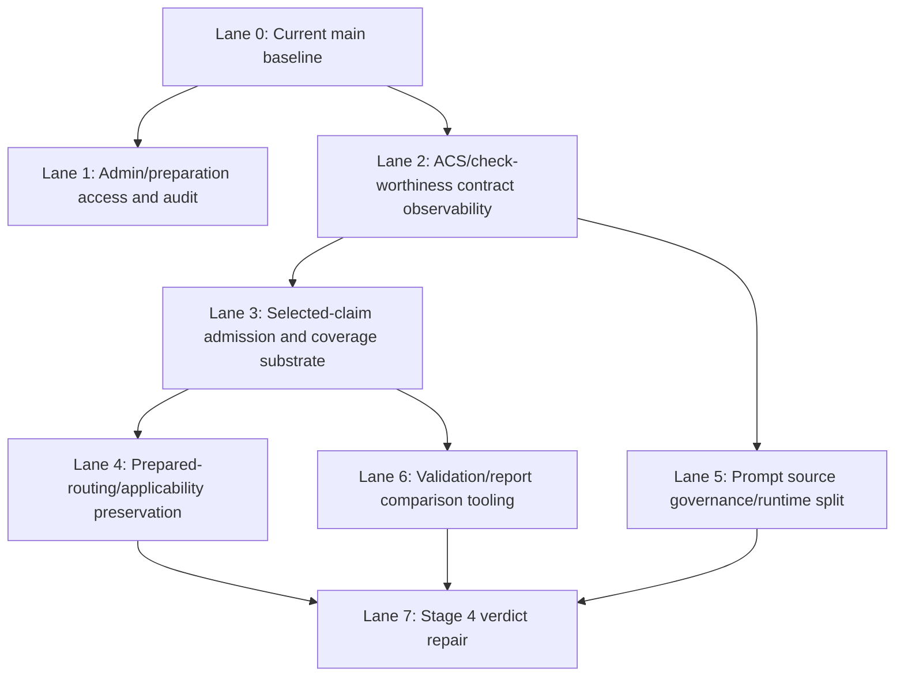

# Main Regression Snapshot Integration Plan

**Date:** 2026-05-01
**Status:** Integration plan; no merge authorized
**Source snapshot:** `codex/main-regression-snapshot-2026-05-01` at `fccd2733`
**Current public main:** `7f9d1194`
**Base:** `origin/main` at `2a713bcc`

## Decision Frame

The preserved branch `codex/main-regression-snapshot-2026-05-01` is now an integration source, not a rollout branch.

Do **not** merge it wholesale. Do **not** discard it. Use it as a catalog of investigated fixes, docs, tests, and live-run evidence that must be promoted, re-authored, or held lane by lane.

Current `main` already contains the approved clean rollout path:

| Commit | Decision | Notes |
|---|---|---|
| `4dfebd86` | Keep | Public nonprofit readiness text docs restored without private legal PDFs. |
| `152f39ad` | Keep | Public legal working papers moved/internalized; active public links now avoid deleted legal `.md` files. |
| `2ea964b4` | Keep | Manual reimplementation of the safe part of `0482c962`: seeds `lastSelectionInteractionUtc` for interactive waiting drafts. |
| `7f9d1194` | Keep | Handoff and Agent_Outputs record for the idle auto-proceed clean rollout. |

No analysis-code, prompt, ACS budget, warning, UCM, live-job, or verdict-repair changes from `fccd2733` are currently on `main`.

## Dependency Lanes



## Keep / Promote / Re-author / Hold Matrix

| Lane | Snapshot material | Decision | Why |
|---|---|---|---|
| 0. Current clean baseline | `2ea964b4`, `7f9d1194`, legal-doc commits on current `main` | **Promoted / keep** | Already manually re-authored onto clean `main`; verified by targeted tests/build/full safe test before promotion of the idle slice. |
| 1. Admin/preparation access and audit | `525d1082`, `26cc2cee`, `750f9352`, `9f8eb419`, `785076e2`, `e0f70130`, `e4b9d27b`, `dee70865`, `bd401e03`, `8d9c6d64`, `47e9b005`, `c7d4251c` | **Re-author** | Likely valuable, but touches C# draft service, controllers, admin UI, migrations, runner recovery, and audit surfaces. Rebuild as a bounded admin/preparation slice against current `main`; do not cherry-pick. |
| 2. ACS/check-worthiness contract observability | `46807bdf`, `59e1c806`, `ba234200`, `78013460`, `423a49fd`, `5e5272ab`, `1ed5744f`, related docs | **Re-author** | Prior reviews were broadly positive, but files now sit amid broader branch drift. Recreate the type/label/provenance/prompt-registry subset with focused tests and docs. |
| 3. Selected-claim admission and coverage substrate | `9efd8eda`, `b43f6b53`, `71cc8786`, `1fa82a90`, `c1c6e62a`, `d59d18f3`, `22b1caa2`, `d8961dbb`, `4f26141a`, `08dfe69b`, `ee1ef6ce`, `952b0847`, `b1229c39`, `0f696419`, `daa7bc61` | **Re-author as one designed lane** | This is a real product-quality substrate, but reviewers disagreed on phase coupling. Rebuild as an “Admission & Coverage” lane with explicit API/web boundary, UCM defaults, scheduler behavior, terminal not-run reasons, and validation summary semantics. |
| 4. Prepared-routing/applicability preservation | `e45b1515`, `4c8aa89e`, portions of claim applicability/routing commits | **Hold until Lane 3 exists, then re-author** | Depends on selected/recommended/ranked claim metadata and prepared Stage 1 snapshot contracts. Do not apply before admission/coverage substrate is stable. |
| 5. Prompt source governance/runtime split | `58b1235c`, `0bf5ae49`, `d9635da9`, `6209cdd3`, `09cfbe27`, `55ef87bf`, prompt-surface docs/tests | **Re-author after Lane 2** | Useful architecture, but high prompt/config blast radius. Keep source-layout intent, rebuild with prompt hash/provenance tests. No prompt wording changes without explicit approval. |
| 6. Validation and comparison tooling | `f79544d4`, `5d841c6c`, validation scripts, `captain-approved-families.json`, `compare-batches.js`, `extract-validation-summary.js` | **Re-author selectively** | Good operational value, but must align with current Captain-defined inputs and current result schema. Pull only tooling that can run without changing analysis behavior. |
| 7. Stage 4 verdict repair and report-quality fixes | `453f9e34`, `26b5e6cb`, `950cab26`, `1377969b`, `1c237f78`, `2b8b9064`, `501f00a2`, `c3c83c18`, `13e62c89`, `c897a71a`, `89a0c8e8`, `75538b43`, `5b28ef5d`, `5a746754`, `3403a6f4`, `b85719af`, `b82948a1`, `cc37f9f9`, `d56f54b6`, `3d20e789`, `b5421841`, related prompt commits | **Hold; re-author only after fresh report-review** | Highest quality-risk lane. Contains prompt and repair-chain changes driven by live regressions. Needs fresh `/report-review` on current `main`, minimal root-cause slice, and explicit Captain approval before any prompt or verdict changes. |
| 8. Legal/private documents | Legal PDFs and legal working papers present on snapshot | **Hold off public main** | These belong in `C:\DEV\FactHarbor-internal\Operations\Legal` / `Operations\Finance`, not public repo. Public docs may reference internal locations when useful. |
| 9. Workflow policy changes | `18000277`, AGENTS/report-review/pipeline UNVERIFIED discipline edits | **Re-author only if desired** | Useful review discipline, but broad policy changes affect all agents. Should be separate from analyzer code and reviewed as governance/workflow change. |

## Promote Now

Nothing else should be promoted immediately from `fccd2733`.

The only already-promoted code behavior is the idle auto-proceed timestamp seeding on current `main`.

## Re-author Next

Recommended next integration branch:

`codex/integrate-admin-preparation-access`

Scope:

- admin list/detail of waiting/preparing claim-selection drafts;
- administrator-on-behalf selection action if still desired;
- draft event audit exposure;
- no ACS budget changes;
- no prompt changes;
- no Stage 2 scheduling changes;
- no verdict repair.

Rationale:

This lane is mostly operational/admin surface area and has less analytical blast radius than ACS budget, prompt split, or Stage 4 repair. It also supports future investigation without changing report quality behavior.

Verification gate:

- API focused tests for draft service/controller behavior;
- web targeted admin/preparation tests;
- `npm -w apps/web run build`;
- no live jobs unless a runtime-only admin workflow cannot be verified otherwise.

## Re-author After Admin Lane

Recommended second branch:

`codex/integrate-acs-observability-contracts`

Scope:

- check-worthiness type/label cleanup;
- ACS research coverage telemetry;
- submission path/provenance labeling;
- prompt-surface registry as inventory only;
- validation-summary fields that are observational only.

Hold out of this branch:

- budget-aware ACS defaults;
- selected-claim admission cap;
- Stage 2 scheduler changes;
- prompt wording changes.

## Re-author As A Combined Correctness Lane

Recommended third branch:

`codex/integrate-selected-claim-admission-coverage`

Scope:

- budget-aware admission contract across automatic, manual, and admin-on-behalf paths;
- selected-claim coverage telemetry;
- zero-targeted selected-claim detection;
- no-search terminal reasons;
- Stage 2 below-floor scheduling behavior;
- validation summary/report visibility for budget and coverage state.

Design constraints:

- No deterministic semantic selector.
- No hidden claim dropping in the final runner.
- No prompt wording change unless a separate prompt review approves it.
- Web/UCM may compute budget feasibility, but final persisted draft/job boundary must structurally enforce the selected count actually admitted.

## Hold Until Fresh Evidence

The Stage 4 verdict repair lane must remain held until there is fresh evidence on current `main`.

Required before re-authoring:

1. Use `/report-review` or equivalent static report review on the exact affected jobs and current expectations.
2. Confirm whether the failure is Stage 1 extraction, Stage 2 acquisition, Stage 3 boundary grouping, Stage 4 adjudication, or report rendering.
3. Prefer source-code repair over prompt changes where the bug is structural.
4. If prompt changes are needed, keep them topic-neutral and explicitly approved.
5. Run focused unit tests first; live jobs only after commit and runtime/config refresh.

## Explicit Non-Actions

- Do not merge `codex/main-regression-snapshot-2026-05-01`.
- Do not cherry-pick the prior 11-commit slice.
- Do not reintroduce private legal PDFs or legal working papers into public `main`.
- Do not apply `05c8c864` as a default-timeout change unless Captain approves the UX default.
- Do not apply `0f696419` / `daa7bc61` without the full admission/coverage lane.
- Do not apply `e45b1515` without prepared-routing/applicability prerequisites.
- Do not apply `b5421841` or adjacent Stage 4 repair commits without a fresh verdict-repair review gate.

## Working Commands

Inspect source snapshot without changing `main`:

```powershell
git log --oneline main..codex/main-regression-snapshot-2026-05-01
git diff --stat main..codex/main-regression-snapshot-2026-05-01
```

Start a re-author branch from current main:

```powershell
cd C:\DEV\FactHarbor
git switch main
git switch -c codex/integrate-admin-preparation-access
```

Use snapshot diffs as reference only:

```powershell
git show <snapshot-commit> -- <path>
git diff main..codex/main-regression-snapshot-2026-05-01 -- <path>
```

## Current Branch Preservation

Keep these refs until all lanes are either promoted or explicitly rejected:

- `codex/main-regression-snapshot-2026-05-01` at `fccd2733`
- `C:\DEV\FactHarbor-main-regression`
- `codex/idle-autoproceed-rollout` at `2cfdfe72` for traceability, even though its code/docs are now represented on `main` as `2ea964b4` / `7f9d1194`

