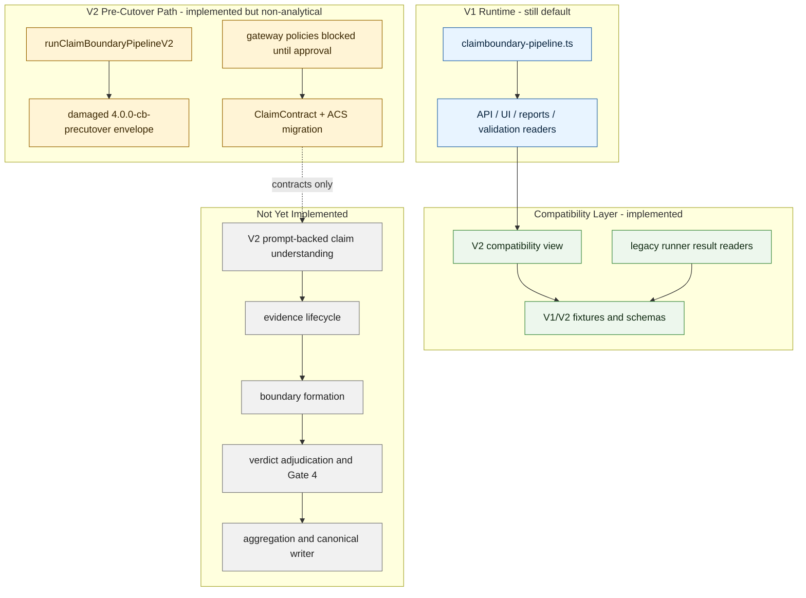
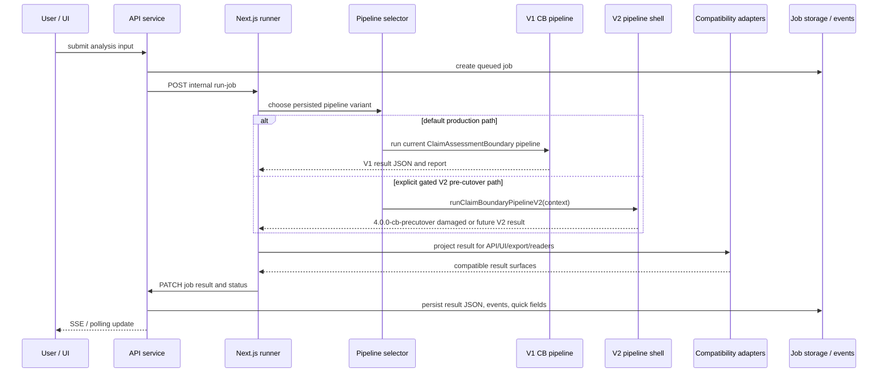
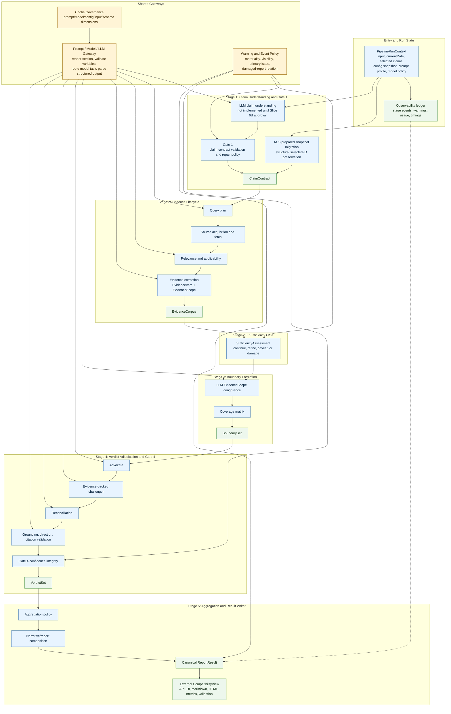
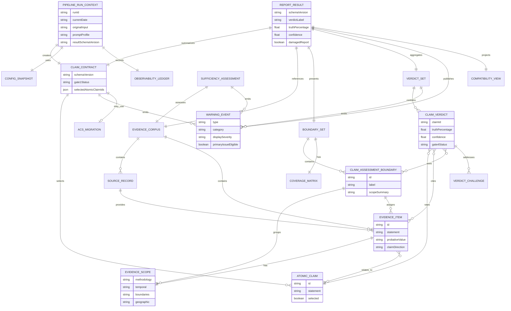
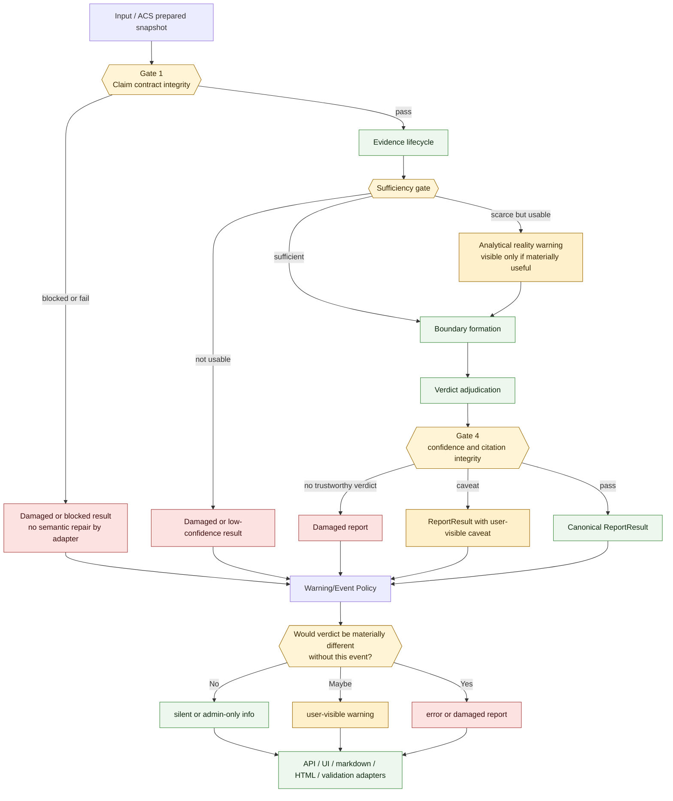
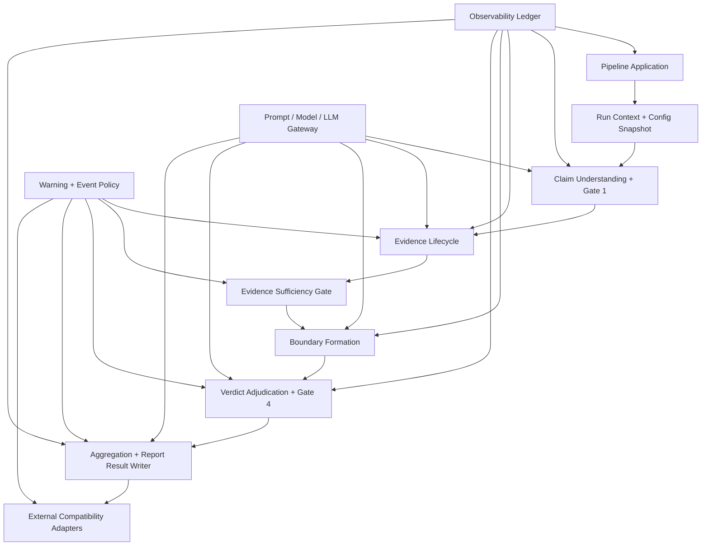

# Pipeline Rebuild Target Specification Draft

**Date:** 2026-05-12  
**Worktree:** `C:\DEV\FactHarbor-pipeline-rebuild-spec`  
**Branch:** `codex/pipeline-rebuild-spec`  
**Status:** Deputy-approved target architecture; implementation in progress through Slice 6A
**Owner role:** Lead Architect  

---

## 1. Purpose

This document defines the target architecture for replacing the current ClaimAssessmentBoundary pipeline with a cleaner, more maintainable pipeline.

The goal is replacement, not additive refactoring. The new pipeline should be built as an isolated V2 path, then verified and cut over only after the specification and validation gates approve it. The current hot path must remain runnable until V2 passes the approved structural, compatibility, warning/report, quality, cost, and performance gates.

The final redesigned state must not retain the V1 pipeline implementation as an alternate analysis path. V1 may remain temporarily as frozen runtime/fallback support before cutover, but after V2 cutover and stabilization the V1 pipeline code must be removed in audited cleanup slices. Historical report readability remains supported through adapters/fixtures, not by keeping the V1 analysis pipeline alive. Investigation of old V1 behavior uses Git history and old-commit worktrees, not retained forward-code paths.

Captain quality rationale: V1 is not the quality target for V2. The current pipeline is judged insufficiently stable and below the desired report-quality bar, with no acceptable progress since the last deployment and little meaningful progress after the early ClaimAssessmentBoundary creation period. V2 therefore preserves only explicitly justified concepts, contracts, and safeguards; it must not preserve V1 code, prompts, or mechanisms merely because they are current.

This draft intentionally does not edit source code, prompts, config, UI, or tests. It is the review package that should be challenged by Lead Architect, LLM Expert, Senior Developer, Code Reviewer, and Gemini/Challenger roles before implementation starts.

---

## 1.1 Implementation Progress Addendum - 2026-05-13

Implementation has started in the new worktree after deputy approval of this target architecture. Current committed state:

| Slice | Status | Commit | Notes |
|---|---|---|---|
| Target specification | done | `869b8861` | Deputy-approved architecture baseline |
| Slice 1: contract fixtures | done | `80deeb6f` | V2/V1 result, warning, ACS, and legacy fixtures plus schema tests |
| Slice 2A-2H: compatibility readers/adapters | done | slice commits through `041c0bd5` | Public/read surfaces can consume V2 fixtures while V1 runtime remains default |
| Slice 3: disabled V2 shell | done | `ce42e058` | V2 entry exists but is double-gated and disabled by default |
| Slice 4: damaged V2 envelope | done | `a654f125` | V2 shell returns schema-valid damaged/non-analytical result |
| Slice 5: gateway governance skeleton | done | `aa07554f` | Prompt/model/cache governance is static and non-executable |
| Slice 6A: Claim Understanding contracts | done | `617f8540` | V2 ClaimContract schema/fixture and pure ACS prepared-snapshot migration adapter |
| Slice 6B: Claim Understanding prompt/model execution | blocked | not started | Requires explicit Captain prompt-change approval and LLM Expert review |

No live jobs have been used for these slices. Approved live-job budget remaining: 8.

Current architectural boundary:

The next implementation step is Slice 6B only if the Captain approves prompt-change work. Until then, V2 stays non-executable for real analysis and V1 remains the product runtime.

---

## 1.2 xWiki Architecture Crosscheck - 2026-05-13

This specification is implementation-led: source reverse-engineering and current contract tests remain authoritative for the V2 rebuild. The `.xwiki` architecture documentation was reviewed as design intent and as a model for reader-level diagrams, with stale portions filtered out before being carried forward.

Reviewed `.xwiki` sources:

| xWiki page | Useful for V2 | Staleness / caution |
|---|---|---|
| `Architecture/WebHome.xwiki` | Reader-level 5-stage overview and audience navigation style | "Start simple" wording must not override this project phase's completeness/correctness bar |
| `System Design/WebHome.xwiki` | Two-service lifecycle and API/runner responsibility split | Some route/file names may drift from current code |
| `AKEL Pipeline/WebHome.xwiki` and `AKEL Pipeline Detail/WebHome.xwiki` | Human-readable stage flow, sequence diagram level, LLM call budget framing | Old diagrams show V1 mechanisms and schema versions, not V2 ownership |
| `Deep Dive/Pipeline Variants/WebHome.xwiki` | Non-negotiable invariants: no stage skipping, fail closed, no synthetic evidence, result envelope | Variant dispatch details are V1/V2 compatibility context, not V2 target design |
| `Data Model/WebHome.xwiki` and diagram pages | Entity hierarchy and ERD readability | Field names and schema versions are V1-oriented |
| `Deep Dive/Context Detection/WebHome.xwiki` | EvidenceScope vs ClaimAssessmentBoundary separation and evidence-emergent boundary rationale | Some examples and function names are historical |
| `Quality and Trust/WebHome.xwiki` and quality gate diagrams | Gate 1/Gate 4 placement and defense-in-depth explanation style | Deterministic confidence/evidence mechanisms must be revalidated against current AGENTS rules |
| `Deep Dive/Prompt Architecture/WebHome.xwiki` | UCM prompt authority, section rendering, provider-output governance | Provider detection snippets and known exceptions are V1 implementation details |
| `Deep Dive/Verdict Debate Pattern/WebHome.xwiki` | Multi-role verdict adjudication and evidence-backed challenge principle | Exact step count/model tiers remain V2 policy decisions, not automatic carry-forward |
| `Deep Dive/Direction Semantics/WebHome.xwiki` | Direction-layer separation and warning against deterministic direction correction | Prompt snippets cannot be copied without approval |
| `Source Reliability/*` | Batch prefetch/sync lookup as a clean integration pattern | Direct verdict weighting formulas are not accepted V2 design until quality-validated |

Useful design intent incorporated or reaffirmed:

- keep `.xwiki`-level diagrams in the target spec, not only code-facing tables;
- preserve the two-service request lifecycle: API owns job persistence/events, Next.js runner owns analysis;
- keep EvidenceScope as per-evidence metadata and ClaimAssessmentBoundary as post-research evidence-emergent grouping;
- keep Gate 1 and Gate 4 as named trust checkpoints, but make V2 warning/materiality policy the user-facing authority;
- keep structured verdict adjudication with evidence-backed challenge and reconciliation; do not collapse to one prompt;
- keep UCM/prompt section governance and explicit prompt/model/cache policy before any LLM-backed stage executes;
- keep a result/entity ERD so external adapters and reviewers can see the contract relationships;
- use diagrams to show where V2 is intentionally simpler: one run context, one gateway, one result writer, one warning policy, and thin adapters.

Stale or rejected `.xwiki` content for V2:

- V1 schema strings such as `3.0.0-cb` are historical; V2 pre-cutover runs use `4.0.0-cb-precutover`.
- V1 monolithic pipeline files and some old function names are not V2 implementation targets.
- Deterministic semantic filters such as vague-phrase matching, Jaccard-like dedupe, keyword provider detection, or direction correction cannot be reintroduced as analysis logic.
- Direct source-reliability truth-percentage formulas are not accepted as V2 verdict math until deputy review and comparator validation approve them.
- Prompt examples or snippets from `.xwiki` are design references only; prompt text changes still need Captain approval and LLM Expert review.

Compact Design Intent Mapping:

| V2 area | xWiki intent preserved | Explicitly rejected or deferred mechanism | V2 authority |
|---|---|---|---|
| Request lifecycle | API owns job persistence/events; Next.js runner owns analysis execution | Changing public API/UI behavior as part of V2 rebuild | Sections 4.2 and 15; compatibility adapter tests |
| Pipeline shape | Understand -> Research -> Boundary formation -> Verdict -> Aggregation/report | Stage skipping or collapsing verdicting into one prompt | Sections 3, 4, 7-12 |
| Claim understanding | Gate 1 protects claim fidelity, analyzability, and selected-claim integrity | Copying old prompt wording; deterministic semantic claim filtering | Section 7; `ClaimContract` schema/tests |
| ACS compatibility | Prepared Stage 1 snapshots and selected IDs remain consumable | Invalidating drafts or redoing selected Stage 1 without approval | Sections 7 and 15; ACS migration contract tests |
| Evidence lifecycle | EvidenceItem remains source-backed and carries EvidenceScope metadata | Vague-phrase, keyword, or Jaccard semantic evidence decisions | Sections 8 and 16 |
| Boundary formation | ClaimAssessmentBoundaries emerge after research from compatible EvidenceScopes | Predefining AnalysisContexts or exact-text semantic fingerprints | Sections 10 and 16 |
| Verdict adjudication | Evidence-backed challenge and reconciliation remain trust safeguards | Baseless challenge weight reduction; deterministic direction correction | Sections 12, 14, and 16 |
| Aggregation/result writer | One canonical result authority drives public interpretation | Adapter-side verdict reinterpretation or legacy formula carryover by default | Sections 6, 12, 15, and 18.1 |
| Warning policy | User-visible warnings are governed by materiality, not raw event severity | Inline warning display rules in UI/API/export readers | Section 14; warning fixture/tests |
| Prompt/model governance | UCM prompt sections and model policies remain explicit runtime contracts | New prompt text/profile/model execution without Captain approval and LLM Expert review | Section 13; gateway policy tests |
| Source reliability | Existing service/cache/admin surfaces remain shared; V2 consumes source-trust signals through a thin integration boundary | Rebuilding, forking, or directly importing source-reliability truth-percentage formulas without quality validation | Sections 8, 12, 18.1 |
| Diagrams/readability | Human readers need xWiki-level lifecycle, entity, gate, and stage diagrams | Treating old diagrams as implementation proof | Sections 1.2 and 1.3 |

## 1.3 Reader-Level V2 Diagrams

The following diagrams mirror the old xWiki diagram level, but describe the new V2 target and the current guarded implementation posture.

### V2 Request Lifecycle

### Target V2 Pipeline Detail

### Target V2 Entity Model

### V2 Quality Gates And Warning Materiality

The old `.xwiki` diagrams showed the current CB pipeline as a dense single-path flow. The V2 diagrams intentionally make the policy gateways visible because that is the architectural simplification: stages own domain outputs, shared gateways own prompt/model/cache and warning behavior, and adapters own compatibility.

---

## 1.4 xWiki-Derived V2 Specification Refinements - 2026-05-13

This section is additive to Sections 1.2 and 1.3. The new V2 `.xwiki` pages are canonical reader-level design documentation, but they do not override source reverse-engineering, committed V2 schemas, fixtures, contract tests, or approved implementation slices.

| Refinement | Spec expectation | Boundary / non-import rule |
|---|---|---|
| Documentation parity | V2 readiness and cutover review must keep reader-level xWiki parity for lifecycle, entity, gate, verdict-debate, prompt-architecture, and presentation diagrams. | This is a readiness and review expectation, not a blocker for every implementation commit and not authority over tests or code. |
| Academic/research-platform view | Validation planning should treat cost, latency, verdict stability, evidence coverage, input neutrality, and multilingual robustness as research-platform observability lenses. | Concrete metrics, benchmark scope, live-job spend, or new validation batches still require the normal approval gate. These metrics must not become source-reliability verdict formulas or deterministic source-type scoring. |
| Explanation/report quality | Before cutover, ReportResult and quality-gate contracts must keep explanation/report quality visible through narrative status, evidence references, report-quality status, warnings, and adapter parity tests. | This docs-only refinement does not introduce schema changes. Any schema expansion belongs to an explicit contract slice with fixtures and tests. |
| Job lifecycle and audit trail | When V2 ledger implementation reaches persistence/adapters, ledger concepts must map cleanly to persisted job status/events, warnings, usage/timing metadata, and audit artifacts. | No API, database, or event-shape change is approved by this section. Implementation must use the relevant slice review. |
| ACS selected-claim integrity | Selected AtomicClaim IDs and selected claim statements must not silently disappear during V2 ACS snapshot migration or claim understanding. Missing or invalid selected claims must produce a Gate 1 blocked/damaged status or an explicitly approved ACS retry path. | V2 may not silently reselect, drop, or redo selected Stage 1 claims to recover from migration failure. |
| xWiki reader links | The V2 spec is accompanied by the xWiki pages for `AKEL Pipeline V2`, `AKEL Pipeline Detail V2`, `Data Model V2`, `Quality and Trust V2`, `Quality Gates V2`, `Pipeline Variants V2`, `Evidence Lifecycle V2`, `Verdict Debate Pattern V2`, `Calculations and Verdicts V2`, `Prompt Architecture V2`, `Source Reliability V2`, and `Academic Cooperation V2 Diagrams`. | Older V1 xWiki pages remain historical/runtime references for the current pipeline and must not be treated as V2 implementation proof. |

Additional xWiki non-import list for V2:

- prompt snippets or prompt examples without Captain approval and LLM Expert review;
- V1 schema strings, route names, file names, or function names as target implementation truth;
- deterministic semantic filters, keyword lists, text-overlap grouping, or language-specific meaning decisions;
- direct source-reliability truth-percentage formulas without later quality validation approval;
- provider-detection snippets or hardcoded model-tier assumptions from older docs;
- old `AnalysisContext` framing or context-detection diagrams as replacements for ClaimAssessmentBoundary terminology;
- polished diagrams as proof that a behavior is currently implemented.

Deputy consolidation verdict: Franklin and Lorentz both returned `MODIFY` and approved this bounded addendum only with the authority, scope, and non-import guards above. A follow-up Claude Opus review of commit `b6c9926c` returned `APPROVE` with no blockers or required edits. No source, prompt, config, runtime, API, UI, or live-job change is included.

---

## 2. Governing Intent

Captain intent, restated in implementation-ready wording:

> Replace the current FactHarbor analysis pipeline with a cleaner, maintainable architecture. Start from a reverse-engineered current-state specification, then design the cleaned target architecture, then implement only after review approval. The new pipeline must be clearly less complicated than the current one, but it must not drop the analytical safeguards that make FactHarbor trustworthy. UI behavior should remain unchanged unless a concrete product, trust, or compatibility need is approved.

Normal decision points in this specification are delegated to the Captain Deputy team. Escalate to Captain only for high risk, no deputy consensus, live validation spend, material UI/API/report/persisted-data breakage, prompt edits, security/production concerns, or removal of core analysis guarantees.

---

## 3. Non-Negotiable Contracts

V2 must preserve these contracts:

1. Analytical flow: Understand -> Research -> Boundary formation -> Verdict -> Aggregation/report.
2. Gate 1 claim validation and Gate 4 confidence integrity.
3. Evidence transparency: every verdict must cite supporting/opposing evidence items where relevant.
4. ClaimAssessmentBoundary, AtomicClaim, EvidenceScope, EvidenceItem, and probativeValue terminology.
5. LLM ownership for semantic text decisions.
6. Generic topic behavior and multilingual robustness.
7. Input neutrality, including question vs assertion neutrality.
8. ACS prepared Stage 1 snapshot compatibility by default.
9. Canonical result JSON and persisted historical report readability.
10. Warning materiality policy across all user-facing surfaces.
11. UCM governance for analysis-affecting prompts/config/model choices.
12. Comparator-based report quality expectations before cutover.

V2 must not:

- collapse Stage 4 into a single verdict prompt;
- remove Gate 1 or Gate 4;
- make semantic decisions with regex, keyword lists, token overlap, or language-specific deterministic rules;
- break UI/API/report/export behavior without explicit approval;
- spend live validation budget before an approved gate;
- start implementation before this target specification is approved.

---

## 4. Target Architecture Overview

V2 should be a clean pipeline application composed of explicit use-case owners and shared policy gateways.

Core principle: the orchestrator controls sequence and state handoff; it does not own semantic decisions, prompt strings, source reliability policy, warning display policy, result interpretation, or UI/export compatibility behavior.

---

## 4.1 Deputy Review Consolidation

Five deputy reviewers returned **approve with required changes** and no Captain escalation. This revision folds their required changes into the spec:

- implementation isolation is operationalized with a proposed V2 namespace, disabled-by-default pre-cutover entry, feature flag, kill switch, and V1 protection rules;
- external adapters now require field-level mapping, ownership, fallback lifetime, and fixture-driven tests;
- canonical result, warning, sufficiency, verdict, and compatibility contracts have schema skeletons and invariants;
- every stage has explicit failure/event/gate behavior;
- every deterministic semantic hotspot needs a disposition and verifier or a deputy-approved waiver;
- ACS compatibility is no longer open-ended: V2 consumes/migrates V1 prepared snapshots by default and preserves selected-claim IDs;
- runtime/cost acceptance uses a measured baseline and approved comparator method, not vague "acceptable" wording.

Implementation remains blocked until the review gate confirms these revisions.

---

## 4.2 V2 Implementation Boundary And Pre-Cutover Strategy

V2 must be built in an isolated path. The proposed implementation boundary is:

| Boundary item | Required decision |
|---|---|
| V2 code root | `apps/web/src/lib/analyzer-v2/` |
| V2 public TypeScript entrypoint | `runClaimBoundaryPipelineV2(context)` exported from `apps/web/src/lib/analyzer-v2/index.ts` |
| Shared contract artifacts | versioned JSON schemas/fixtures under `apps/web/test/fixtures/analyzer-v2/`, consumable by both TypeScript and API-side tests |
| V1 hot path | remains `apps/web/src/lib/analyzer/claimboundary-pipeline.ts` until cutover approval |
| Runner integration | V1 remains default; V2 can run only through an explicit disabled-by-default pre-cutover gate |
| Proposed pre-cutover gate | `FH_ANALYZER_PIPELINE=v2-precutover` plus explicit internal-run request metadata |
| Kill switch | absence of the pre-cutover gate routes all runs to V1 |
| Public persistence | V2 must not replace public `resultJson` or `reportMarkdown` before cutover approval |
| Allowed V1 changes before cutover | contract fixtures, compatibility adapters, adapter/test seams, and explicit pre-cutover routing guard only |
| Forbidden before cutover | deleting V1 hot-path mechanisms, changing public UI behavior, changing public API behavior, replacing V1 output, or running V2 for normal public jobs |

V2 modules may import shared structural utilities only when the utility is proven semantic-free. V1 may not import V2 stage internals. External adapters may consume `ReportResult` and compatibility fixtures; they may not call stage internals. Stages may not call UI, markdown, static HTML, API, validation, or metrics helpers.

Clean-room boundary rule: V2 implementation must not import, reuse, alias, extend, or clone V1 pipeline analysis code, V1 prompt files, V1 prompt profiles, or V1 pipeline-owned types. Compatibility at the runner/storage edge is allowed only as a one-way structural mapping from current job/request data into V2-owned contracts. That mapping must live at a clearly named seam and must not expose V1 types into V2 internals. Internal V2 contracts are derived from this specification and the current slice's actual needs, not from copying V1 shapes.

The current master V1 pipeline is not the report-quality oracle for V2. V2 quality comparison should use pinned deployed historical reports, Captain-defined benchmark expectations, and stored fixtures. Master V1 remains only a frozen runtime/fallback path until V2 cutover and must not survive as a parallel production analysis path after the redesign is complete. Backward investigation is handled by checking out old commits as worktrees, never by preserving V1 code for forward development.

**Final naming policy**

V2 should not accumulate awkward names only because V1 still occupies the current runtime namespace. During rebuild, the temporary namespace is the module/package boundary: `apps/web/src/lib/analyzer-v2/`, the gated pre-cutover schema, and the pre-cutover runner flag. Inside that boundary, contracts should use clean domain names such as `PipelineRunContext`, `ReportResult`, `ClaimContract`, `EvidenceCorpus`, `BoundarySet`, and `VerdictSet`, not permanent names like `V2InternalEvaluationResult`.

After V2 cutover stabilizes and V1 analysis code is deleted, a mandatory naming-normalization cleanup slice must rename surviving V2 package/entrypoint/schema labels to final names and add a guard that fails if obsolete rebuild labels, `precutover`, or unnecessary `V2` prefixes remain in final runtime code. Shared services that are not V1-pipeline-owned, such as Source Reliability, keep their meaningful service names.

"Clean the current pipeline" means quarantine and remove V1 mechanisms after V2 owns the equivalent contract and passes the named verifier. Cleanup must not leave FactHarbor in a broken intermediate state, but it is a mandatory end-state requirement rather than an optional follow-up.

---

## 5. Logical Module Boundaries

Exact file names can be refined by implementation, but the V2 root and public entrypoint in Section 4.2 are the default unless deputy review changes them before implementation.

| Boundary | Owns | Must not own |
|---|---|---|
| Pipeline application | Stage sequencing, cancellation/damage exits, run state, typed handoff | LLM prompt content, semantic classification, result rendering |
| Run context/config snapshot | Current date, input, selected claims, UCM config, prompt profile, model policy, run metadata | Per-stage mutable config reads |
| Prompt/model/LLM gateway | Prompt section rendering, variable validation, model task routing, LLM provider retry/fallback, LLM structured output parsing | Stage business rules, search/source acquisition, or hardcoded analysis strings |
| Claim understanding | AtomicClaim extraction, contract validation/repair, Gate 1, ACS prepared-state reuse | Source acquisition loops or verdict work |
| Evidence lifecycle | Query plan, search/source acquisition, relevance, extraction, applicability, provenance, retrieval policies | Claim rewriting, boundary clustering, verdict labels, LLM provider retry mechanics |
| Sufficiency gate | Evidence sufficiency, evidence scarcity warnings, continuation/stop decision | Retrieval implementation or verdict confidence |
| Boundary formation | EvidenceScope normalization/equivalence, ClaimAssessmentBoundary construction, evidence assignment, coverage matrix | Verdict generation or aggregation math |
| Verdict adjudication | Advocate/challenger/reconciler roles, citation integrity, grounding/direction repair, Gate 4 | Public result schema conversion, UI display, or LLM provider retry mechanics |
| Aggregation/result writer | Aggregation math, article adjudication, narrative, canonical result JSON, quality gates | API/UI/static export fallback logic |
| Warning/event policy | Warning registration, materiality, user/admin visibility, primary issue selection | Stage-specific semantic judgment |
| External adapters | API list/detail, job UI shape, markdown, static HTML, validation, calibration, metrics, historical read compatibility | Reinterpreting verdicts independently |
| Observability ledger | Acquisition trace, repair events, prompt/model usage, timings, warnings, adapter decisions | Product semantics |

---

## 6. Canonical V2 Data Contracts

V2 should use explicit typed handoff objects. Names below are logical contract names, not final implementation class names.

| Contract | Required content | Notes |
|---|---|---|
| `PipelineRunContext` | run id, original input, current date, locale/language signal, config snapshot, prompt profile, model policy, ACS selected IDs when present | Created once and passed through all stages |
| `ClaimContract` | original input, extracted AtomicClaims, selected AtomicClaims, contract validation result, repair/audit events, Gate 1 status | Claim fidelity authority |
| `EvidenceCorpus` | sources, EvidenceItems, EvidenceScopes, acquisition trace, applicability results, source reliability signals, evidence warnings | Owns evidence lifecycle state |
| `SufficiencyAssessment` | sufficiency status, missing evidence dimensions, continuation/refinement policy, user-facing scarcity warnings | Separate from retrieval implementation |
| `BoundarySet` | ClaimAssessmentBoundaries, normalized scopes, evidence assignments, coverage matrix, boundary warnings | Owns CAB product semantics |
| `VerdictSet` | per-claim/per-boundary verdicts, debate artifacts, citation integrity results, direction/grounding repairs, Gate 4 status | Owns verdict integrity |
| `ReportResult` | canonical truth, verdict, confidence, quality gates, warnings, evidence references, narrative, schema version, metadata | Sole source for public interpretation |
| `CompatibilityView` | API/UI/export/validation-specific projection of `ReportResult` | Thin adapter; no independent verdict semantics |

The public result schema should be versioned. Implementation-entry default:

- pre-cutover schema: `4.0.0-cb-precutover`;
- public cutover schema: `4.0.0-cb`;
- V1 public compatibility schema remains `3.2.0-cb`.

The exact string can still be changed by deputy review before implementation, but it cannot remain open once the first result-contract implementation slice starts. Historical V1 read compatibility has no automatic expiry. The V1 analysis pipeline implementation does have an expiry: it must be removed after V2 cutover, stabilization, and audited cleanup verification.

**ReportResult schema skeleton**

`ReportResult` must include these top-level groups before adapter work starts:

| Group | Required fields or invariants |
|---|---|
| Schema | `_schemaVersion`, `meta.schemaVersion`, `meta.pipeline`, `meta.resultContractVersion` |
| Run metadata | run id, current date, executed commit/hash fields when available, prompt/config/model hashes when available |
| Input | original input reference, selected AtomicClaim IDs when ACS is used, input language signal without forcing translation |
| Claims | AtomicClaim id, `statement`, Gate 1 status, selected status, related ClaimAssessmentBoundary IDs |
| Evidence | EvidenceItem id, statement, source id, claim direction, evidenceScope, probativeValue, sourceType, claimBoundaryId, citation reference |
| Boundaries | ClaimAssessmentBoundary id, label, scope summary, covered claim IDs, evidence IDs, coverage matrix link |
| Verdict | canonical verdict label, truthPercentage, confidence, confidence tier, Gate 4 status, verdict source marker |
| Quality gates | Gate 1, sufficiency, Gate 4, report integrity, warning integrity, damaged-report flag when applicable |
| Warnings | list of canonical `WarningEvent` objects, already classified for display by the shared warning policy |
| Narrative/report | markdown, narrative sections, evidence references, report-quality status |
| Compatibility | optional V1 compatibility projection fields, clearly marked as fallback/adapter material |

Adapters must read this canonical schema. They may expose legacy aliases, but they may not compute a different verdict authority when canonical fields are present.

**WarningEvent schema skeleton**

Every warning or user/admin-visible event that can leave the pipeline must carry:

- stable `type`;
- `category`: routine operation, system failure, analytical reality, or internal diagnostic;
- raw `severity`;
- display severity from the shared warning policy;
- visibility: silent, admin-only, user-visible, or blocking;
- affected stage/owner;
- affected claim/boundary/evidence/source IDs when applicable;
- materiality rationale;
- recovery state;
- primary-issue eligibility;
- damaged-report relation if applicable.

`severe` is represented as `severity: "error"` plus a damaged-report/report-damaged flag. Internal diagnostics remain admin-only unless a separate damage event is emitted.

**Typed provider/search outcomes**

Retry, fallback, circuit accounting, and parse recovery have one owner per mechanism:

- LLM provider mechanics belong to the prompt/model/LLM gateway and return typed `LLMCallResult` outcomes to stages.
- Search/source acquisition mechanics belong to the evidence lifecycle source-acquisition owner and return typed `SourceAcquisitionResult` outcomes.
- Stages may request an LLM task or acquisition policy, but they must not implement independent provider retries, credential fallback, parse recovery, or circuit accounting.

---

## 7. Stage Contract: Claim Understanding And Gate 1

**Purpose:** Convert user input or ACS prepared input into a validated, selected AtomicClaim contract.

**Inputs**

- `PipelineRunContext`
- raw user input or URL/PDF-derived text
- optional `InputGroundingSeed` containing already-resolved source bodies or preliminary snippets, without letting claim understanding own full research
- optional ACS `PreparedStage1Snapshot`
- optional selected AtomicClaim IDs

**Semantic LLM tasks**

- claim extraction;
- contract validation;
- contract repair;
- atomicity and salience judgment where they affect claim selection.

**Structural tasks**

- schema validation;
- ID generation;
- selected-ID matching;
- prepared snapshot compatibility checks;
- event/ledger recording.

**Outputs**

- `ClaimContract`;
- Gate 1 pass/fail/damaged status;
- repair/audit ledger;
- ACS-compatible prepared snapshot data when required.

**Simplification from V1**

- Consolidate salience, low-count reprompt, contract retry, narrow repair, final refresh, and atomicity audit under one `ClaimIntegrityPolicy`.
- Move preliminary evidence seeding out of claim understanding into `InputGroundingSeed` and the evidence lifecycle as first-class seed states.
- Keep the two-pass grounding intent where evidence grounding materially improves claim quality. V2 does this by allowing claim understanding to consume `InputGroundingSeed`; any new search/fetch/retrieval belongs to evidence lifecycle unless a deputy-approved verifier shows the behavior must remain before claim extraction.
- Preserve ACS prepared snapshots by default; V1 snapshot invalidation requires deputy/Captain approval.

**Failure modes**

- no valid AtomicClaim -> damaged report;
- contract validation failure after allowed repair -> damaged report;
- selected claim missing from prepared snapshot -> damaged report or explicit ACS retry path;
- prompt/model unavailable -> provider failure warning or damaged report depending on recovery.

**ACS compatibility contract**

V2 must consume V1 `PreparedStage1Snapshot` by default. Migration may normalize shape internally, but it must preserve:

- draft id and job association;
- selected AtomicClaim IDs and selected-claim finality;
- original `statement` text for selected claims;
- prepared evidence/source seed data when present;
- retry/restart/hide behavior for active drafts;
- runner reuse semantics so final jobs do not redo prepared Stage 1 unless the draft is explicitly invalid.

Invalidating existing snapshots, dropping selected IDs, changing active draft behavior, or forcing users to reselect claims requires deputy/Captain approval and an explicit user/admin behavior plan.

---

## 8. Stage Contract: Evidence Lifecycle

**Purpose:** Build a transparent, source-backed evidence corpus for selected AtomicClaims.

**Inputs**

- `PipelineRunContext`
- `ClaimContract`
- optional seeded evidence/source bodies from Stage 1 or URL/PDF resolution

**Semantic LLM tasks**

- query planning;
- source relevance assessment;
- evidence extraction;
- applicability assessment;
- source/evidence quality judgments where semantic;
- contradiction/refinement decision inputs.

**Structural tasks**

- search/source provider calls;
- fetch retry/circuit behavior;
- deduplication by structural source identity;
- budget accounting;
- source and evidence ID assignment;
- acquisition trace recording.

**Outputs**

- `EvidenceCorpus`;
- acquisition trace;
- source reliability signals;
- evidence warnings;
- input to `SufficiencyAssessment`.

**Retrieval policies**

V2 should replace a tangled loop with named retrieval policies:

| Policy | Purpose | Notes |
|---|---|---|
| Baseline research | Establish initial supporting/opposing/neutral corpus | Always present unless input invalid |
| Primary-source refinement | Seek source-native decisive documents when secondary/current routes are insufficient | Avoid token-overlap selection |
| Contradiction search | Seek evidence-backed contestation, not opinion-only doubts | Must preserve contestation policy |
| Supplementary language lane | Add cross-language coverage when useful | Source-language-first; no English default, no forced translation, no English analysis fallback; cross-language policy is UCM-owned |
| Evidence scarcity handling | Surface real-world scarcity as info/warning, not system error | Uses warning materiality policy |

**Simplification from V1**

- Make seeded evidence a first-class state instead of special remap plumbing.
- Separate semantic relevance/applicability from structural fetch and dedupe.
- Replace deterministic text overlap and vague-string checks with LLM assessment or structural-only checks.
- Keep budget controls, but make them owned by config snapshot and observable in the ledger.
- Source type, trust, reliability, and applicability that affect analysis must be LLM/UCM-governed and generic. Provider metadata may be used as structural evidence, not as hidden verdict-affecting classification.

---

## 9. Stage Contract: Sufficiency Gate

**Purpose:** Decide whether the corpus is adequate to continue to boundary/verdict work or whether retrieval should refine, warn, or produce a damaged/low-confidence report.

**Inputs**

- `EvidenceCorpus`
- `ClaimContract`
- config snapshot

**Outputs**

- `SufficiencyAssessment`
- continuation/refinement decision
- evidence scarcity warning when material

**Rules**

- Sufficiency is a gate, not a hidden loop condition.
- Evidence scarcity is an analytical reality category unless caused by system failure.
- Degrading issues must be visible; recovered routine fallbacks should be silent/info.
- Sufficiency must not use hardcoded domain keywords or language-specific assumptions.

---

## 10. Stage Contract: Boundary Formation

**Purpose:** Form ClaimAssessmentBoundaries from EvidenceScopes and assign evidence to boundaries.

**Inputs**

- `EvidenceCorpus`
- `ClaimContract`
- `SufficiencyAssessment`

**Semantic LLM tasks**

- scope normalization/equivalence;
- boundary clustering;
- boundary rationales where useful for audit;
- low-coherence explanation.

**Structural tasks**

- boundary ID generation;
- coverage matrix construction;
- evidence assignment by stable IDs after semantic assignment;
- fallback boundary creation when no valid boundary can be formed.

**Outputs**

- `BoundarySet`
- `claimBoundaryId` assignments
- coverage matrix
- boundary warnings/events

**Simplification from V1**

- Do not use exact string fingerprints or Jaccard-like text overlap to decide semantic grouping.
- Keep `CB_GENERAL`-style fallback behavior, but make it observable through structured events/warnings where material.
- Persist or expose enough boundary rationale for debugging if LLM clustering produces low coherence.

---

## 11. Stage Contract: Verdict Adjudication And Gate 4

**Purpose:** Produce evidence-cited verdicts with integrity checks and confidence gating.

**Inputs**

- `ClaimContract`
- `EvidenceCorpus`
- `BoundarySet`
- config snapshot
- prompt/model policy

**Semantic LLM tasks**

- advocate verdict;
- challenger verdict;
- reconciliation;
- grounding validation;
- direction validation/repair;
- source reliability calibration if productized;
- confidence reasoning.

**Structural tasks**

- citation ID validation;
- evidence ID existence checks;
- consume typed LLM provider outcomes from the prompt/model/LLM gateway;
- structural parse/citation validation after the gateway has returned a typed result;
- phantom citation stripping;
- Gate 4 status calculation from canonical confidence policy.

**Outputs**

- `VerdictSet`
- Gate 4 status
- citation/grounding/direction repair ledger
- verdict warnings

**Rules**

- Preserve advocate/challenger/reconciler role separation.
- Preserve baseless challenge enforcement: opinion-only contestation cannot reduce truth/confidence.
- Preserve safe downgrade when integrity checks cannot recover.
- Unify the current multiple confidence schemes into one canonical confidence contract.
- Do not collapse this stage into a one-shot verdict prompt.

---

## 12. Stage Contract: Aggregation, Article Adjudication, And Report Result

**Purpose:** Convert verdicts and evidence into one canonical report result.

**Inputs**

- `ClaimContract`
- `EvidenceCorpus`
- `BoundarySet`
- `VerdictSet`
- config snapshot

**Semantic LLM tasks**

- article-level adjudication where configured and justified;
- narrative generation;
- explanation quality checks if semantic.

**Structural tasks**

- aggregation math over LLM-produced fields;
- quality-gate object construction;
- canonical warning projection;
- result schema serialization.

**Outputs**

- `ReportResult`
- `reportMarkdown`
- adapter-ready compatibility views

**Rules**

- `ReportResult.verdict`, `truthPercentage`, confidence, quality gates, and warnings are authoritative.
- API/UI/export/metrics/validation adapters must not independently infer verdict meaning except as legacy fallback.
- Article adjudication should have an explicit model task, UCM-owned temperature/budget, and observable failure behavior.
- Narrative/report-quality failures should be visible to admins and user-visible only when material under warning policy.

---

## 12.1 Stage Failure, Event, And Gate Matrix

Each stage contract includes this matrix. Implementers may add more events, but they may not remove the listed failure/gate behavior without review.

| Stage | Failure/damaged behavior | Required events | Gate or warning behavior |
|---|---|---|---|
| Claim understanding | damaged report when no valid selected AtomicClaim or contract repair fails | claim extraction start/end, contract validation, repair attempt/result, ACS snapshot consumed/migrated/invalid | Gate 1 status; ACS invalidation requires approval |
| Evidence lifecycle | system failure warning/error when all acquisition paths fail; analytical scarcity warning when evidence is genuinely sparse | query plan, acquisition attempt/result, fetch retry, evidence extraction, applicability, seed reuse, budget use | no hidden stage skip; scarcity surfaced through warning policy |
| Sufficiency gate | low-confidence/damaged path only when corpus cannot support a trustworthy verdict | sufficiency assessment, refinement decision, stop/continue reason | D5/sufficiency status; material insufficiency visible |
| Boundary formation | fallback boundary when clustering fails recoverably; damaged report only if no coherent boundary/evidence assignment can be produced | normalization, clustering, fallback boundary, orphan assignment, coverage matrix build | boundary concentration/low coherence warnings through warning policy |
| Verdict adjudication | safe downgrade or damaged report when citation/grounding/direction integrity cannot recover | advocate/challenger/reconciliation calls, citation validation, direction repair, safe downgrade, Gate 4 | Gate 4 canonical confidence status; baseless challenges do not reduce verdict |
| Aggregation/result writer | damaged report when canonical result cannot be serialized; admin warning for narrative/adjudication fallback unless material | aggregation, article adjudication, narrative generation, quality gate build, result serialization | one canonical verdict/truth/confidence/warning authority |
| External adapters | adapter failure must not reinterpret the canonical result; user-visible failure only when product output is degraded | adapter input schema, legacy fallback use, field mapping, export/render status | adapter parity tests; warnings use shared display policy |

---

## 13. Prompt, Config, And Model Governance

V2 must treat prompts, config, and model routing as first-class architecture.

**Prompt registry**

- Every analysis prompt section has a registered owner, semantic task, variables, output schema, model task, and test coverage.
- Prompt frontmatter variables must match rendered variables.
- Prompt render warnings should fail contract tests for required sections.
- Orphan sections such as `CLAIM_GROUPING` are quarantined until a real V2 caller is proven.
- Inline analysis-affecting prompt text in code is not allowed in new implementation.
- Prompt text changes require explicit human approval and LLM Expert review.

**Config snapshot**

- UCM/JSON defaults remain authoritative for analysis-affecting tunables.
- TypeScript schemas and JSON defaults must remain synchronized.
- Duplicate JSON keys should be detected by tests or config loading.
- Hardcoded analysis-affecting temperatures, thresholds, token budgets, and timeouts are not allowed unless classified as fixed structural constants.
- Dead/unwired knobs should fail a dedicated config contract test.

**Model policy**

- One model task registry owns model tier, provider preferences, temperature, token budget, timeout, retry, and fallback policy.
- Semantic tasks should batch aggressively, cache identical/equivalent inputs, and use lower-cost models where fit.
- Provider fallback is structural resilience; it must not silently change prompt/task semantics.

**Cache governance**

Any analysis-affecting cache key must include every value that can change the semantic answer:

- prompt section name and prompt content hash;
- model task id, provider, model, temperature profile, and output schema version;
- config snapshot hash and result schema version;
- source/evidence identity when evidence is part of the task;
- language/search context where it affects retrieval or interpretation;
- current-date bucket when the task reasons about current facts;
- compatibility adapter version when cached output feeds public projection.

Cache reuse for structurally identical inputs is allowed. Cache reuse for semantically equivalent but textually different inputs is allowed only if equivalence is LLM-owned or structurally proven by stable IDs.

**Prompt genericity and multilingual gate**

Before any V2 prompt migration or cutover:

- no analysis prompt may include test-case terms or concrete examples derived from Captain validation inputs;
- no prompt may steer by concrete date periods, regions, people, or topic vocabulary unless it is an input variable or provider-facing search query;
- prompt variable rendering must be warning-free for every required section;
- multilingual behavior must be source-language-first and must not force English analysis fallback;
- LLM Expert review and explicit human approval are required for actual prompt text edits.

**Quarantine list before implementation**

The implementation plan must classify these prompt/config/model surfaces before code starts:

- `CLAIM_GROUPING` prompt section;
- `model-tiering.ts` vs active model resolver behavior;
- legacy model tier aliases and `orchestrated` profile usage;
- duplicate or weakly wired config knobs, including timeout/token/temperature fields identified in the baseline;
- hardcoded call-site temperatures and budgets.

---

## 14. Warning And Event Policy

V2 must have one warning authority for UI, markdown, HTML export, API summaries, metrics, and validation.

The authority may be `warning-display.ts` or a reviewed replacement, but there must be exactly one product-facing materiality policy.

**Severity rule**

Before any warning is user-visible, apply:

> Would the verdict be materially different if this event had not occurred?

- No: silent or admin-only info.
- Maybe: warning at most.
- Yes: error or severe/damaged report.

**Required categories**

- Routine operations: silent/info unless aggregate quality degrades.
- System failures: warning/error/severe depending on verdict impact.
- Analytical reality: info/warning, never error/severe.
- Internal diagnostics: info unless the result is actually damaged.

Adapters must not filter warnings by raw severity without the shared policy.

**Primary issue selection**

API summaries, UI headers, markdown, static HTML, metrics, and validation must use the same primary-issue policy:

1. Pick blocking damaged-report events first.
2. Then pick user-visible errors that can change verdict direction or confidence tier.
3. Then pick user-visible warnings that materially caveat the same verdict direction.
4. Do not promote admin-only diagnostics to user-visible primary issues.
5. Do not surface recovered routine fallbacks as primary issues.

Raw severity is an input to the policy, not the policy itself.

---

## 15. External Compatibility Matrix

Default posture: preserve behavior through adapters. Retire or break only with approval.

Adapters have a named owner, a field-level mapping, a fallback lifetime, and a fixture-driven verifier. The canonical V2 fields below refer to the `ReportResult` schema skeleton in Section 6.

| Surface | V2 disposition | Canonical field authority | Legacy fallback | Required verifier |
|---|---|---|---|---|
| API job detail | Preserve through adapter | `ReportResult.verdict`, `truthPercentage`, `confidence`, `qualityGates`, `warnings`, `report.markdown`, `evidence`, `claimBoundaries` | Read `3.2.0-cb` fields when canonical V2 absent; no expiry without approved migration | Serialization tests for V2 fixture and legacy fixture |
| API job list/quick fields | Preserve through adapter | same canonical verdict/truth/confidence plus primary issue from warning policy | derive only when canonical fields absent | Quick-field tests proving no rederived label when V2 verdict exists |
| Runner/internal run-job | Preserve | result writer output plus run metadata | V1 runner path remains default until cutover | route contract test or integration test |
| ACS draft/prepared snapshot | Preserve/migrate | `ClaimContract.selectedAtomicClaimIds`, prepared snapshot metadata, seed state | consume V1 snapshot; migration is internal | draft-to-job reuse contract test |
| Job UI | Preserve behavior | compatibility view over canonical result, warnings, evidence, boundaries | legacy display helpers only for legacy reports | fixture-driven UI adapter/component tests and render smoke check whenever result adapters change |
| Markdown report | Preserve through adapter | canonical verdict, warnings, evidence citations, quality gates, narrative | legacy markdown read-only | warning/result parity test |
| Static HTML export | Preserve through adapter unless retirement approved | canonical verdict, warnings, quality gates, citations, narrative | legacy fields only when reading legacy reports | static export fixture test and render smoke check |
| Metrics/report-quality scripts | Versioned adapter | canonical quality gates, warnings, result metadata, Q-code outputs | explicit legacy parser branch | parser tests for V2 and legacy fixtures |
| Validation/calibration scripts | Versioned adapter | canonical claims, verdict/truth/confidence, warnings, evidence counts | explicit legacy parser branch | validation-summary adapter tests |
| Historical reports | Preserve read compatibility | legacy stored `resultJson` and `reportMarkdown` remain readable | no automatic retirement | legacy fixture/read test |
| Warning display registry | Preserve or reviewed replacement | `WarningEvent.displaySeverity`, visibility, primary issue policy | legacy warnings mapped through shared policy | cross-surface warning parity test |

Cross-language ownership: JSON schemas and fixtures are the shared source of truth between TypeScript pipeline code and C# API code. TypeScript types and C# DTOs are generated from or tested against those fixtures; neither language owns the public contract alone.

---

## 16. Deterministic Semantic Hotspot Disposition

V2 implementation must include a hotspot disposition checklist before code lands. Every hotspot needs an automated verifier, static-review verifier, or explicit deputy-approved waiver. "Where practical" is not sufficient.

| Hotspot family | V2 rule | Required verifier |
|---|---|---|
| substring anchor/salience checks | Structural ID checks only; semantic preservation via LLM | static guard plus unit test for ID-only structural path |
| input-type heuristics | Structural routing only; semantic route choice via LLM if needed | route contract test or deputy waiver |
| source-type regex/string bucketing | Provider metadata is structural only; source type/trust/reliability/applicability that affects analysis is LLM/UCM-governed | source-classification contract test |
| token-overlap primary-source selection | LLM source completeness/relevance assessment | retrieval-policy test proving token overlap is not the selector |
| hardcoded non-directional labels overriding evidence direction | LLM/schema policy, not deterministic label list | verdict/direction contract test or static review |
| vague-string scope quality checks | LLM scope quality signal | scope-quality prompt/schema contract test |
| platform/TLD/name-length reliability heuristics | Curated UCM or LLM source-trust policy where analysis-affecting | source-trust policy review and config test |
| exact scope fingerprints for grouping | Stable structural IDs only; semantic equivalence via LLM | boundary equivalence test |
| Jaccard-like boundary merge | Structural cap plus LLM equivalence | boundary cap/equivalence test |
| narrative/report regex quality checks | Structural formatting only or LLM rubric | report-quality contract test |
| English fallback language behavior | Preserve source language or explicitly mark non-analysis fallback | multilingual contract test |

---

## 17. Test And Validation Strategy

Implementation must start with contract tests and adapters, not live jobs.

**Pre-implementation required tests**

Pre-implementation tests are grouped by slice to avoid one oversized first change:

| Slice | Required tests before slice implementation |
|---|---|
| Contract fixtures | V1 fixture, V2 fixture, warning fixture, ACS prepared snapshot fixture, JSON schema validation |
| Compatibility adapters | API list/detail serialization, markdown parity, static HTML export, metrics parser, validation parser, historical report read |
| V2 shell | disabled-by-default routing, kill switch, no public result replacement, V1 hot-path still runnable |
| Prompt/config/model gateway | prompt registry/frontmatter/variables, prompt genericity audit, multilingual prompt audit, model task registry, cache key/invalidation tests |
| Claim understanding | Gate 1 contract, ACS snapshot consumption/migration, selected-ID finality, `InputGroundingSeed` behavior |
| Evidence lifecycle | retrieval policy tests, seed reuse, source-language-first behavior, source classification boundary, acquisition warning policy |
| Sufficiency/boundary | sufficiency warning tests, boundary equivalence, fallback boundary, coverage matrix |
| Verdict/Gate 4 | citation integrity, direction repair, baseless challenge, safe downgrade, canonical confidence policy |
| Aggregation/result writer | canonical verdict/truth/confidence, quality gates, warning event schema, article adjudication fallback |
| UI/export/render | fixture-driven UI adapter test, markdown output test, static HTML render smoke check whenever adapters change |
| Hotspot gate | one verifier or deputy-approved waiver for every hotspot in Section 16 |

**Safe verification during implementation**

- `npm test`
- `npm -w apps/web run build`
- focused unit/contract tests for touched surfaces
- `git diff --check`

**Expensive/live validation**

Run only after approval, with commit-first and runtime-refresh discipline. Use only Captain-defined analysis inputs. Compare against:

- `Docs/AGENTS/Captain_Quality_Expectations.md`
- `Docs/AGENTS/benchmark-expectations.json`
- `Docs/AGENTS/report-quality-expectations.json`
- exact/family comparator reports where available

**Cutover quality gates**

- Gate 1 and Gate 4 parity or improvement against approved comparator reports and Q-code expectations;
- no evidence transparency regression: every verdict has traceable supporting/opposing evidence references where applicable;
- no warning materiality regression across UI, markdown, HTML export, API summaries, metrics, and validation;
- no UI/API/report/export compatibility regression unless explicitly approved;
- no deterministic semantic hotspot introduced without a verifier or deputy-approved waiver;
- no material multilingual/input-neutrality regression on Captain-defined inputs and approved comparator families;
- runtime/cost measured against current-stack baselines using separate buckets for preparation, interactive wait, queue, active final runtime, retrieval, verdict, and export;
- final-report active runtime target is approximately 15 minutes average where applicable, with longer runs requiring evidence that extra cost protects quality or handles more than 3 selected AtomicClaims;
- deputy signoff records exact comparators used, exact vs variant status, local vs deployed status, and any accepted residual risk.

---

## 18. Implementation Slice Outline After Approval

This is not approval to implement. It is the proposed order once the target spec passes review.

1. Golden result, ACS, warning, and legacy fixtures plus JSON schema contract tests.
2. Compatibility adapters for V1 fixture, V2 fixture, API list/detail, job UI, markdown, static HTML, metrics, validation, calibration, and historical reports.
3. Isolated V2 shell returning a fixture/stub result, disabled by default behind the pre-cutover gate.
4. Prompt/config/model gateway skeleton, cache governance, and dead-knob detection.
5. Claim understanding and Gate 1, including ACS snapshot consumption/migration and `InputGroundingSeed`.
6. Evidence lifecycle and sufficiency gate, with retrieval policies and source-language-first behavior.
7. Boundary formation.
8. Verdict adjudication and Gate 4.
9. Aggregation and canonical result writer.
10. Pre-cutover verification path that can compare V1/V2 without replacing public output.
11. Comparator-based quality review and approved live validation only at the named gate.
12. Controlled cutover with rollback plan.
13. Mandatory V1 pipeline cleanup after V2 gates pass and cutover stabilizes.
14. Mandatory naming-normalization cleanup after V1 deletion: surviving package, entrypoint, schema, and documentation names become the final clean names, with a guard against leftover rebuild labels in runtime code.

No expensive validation or live jobs are part of slices 1 through 10 unless Captain explicitly approves the spend.

Failed-validation recovery during implementation must classify the prior attempt as `keep`, `quarantine`, or `revert` before broadening scope.

**Cutover checklist**

- V1 hot path still runnable.
- Pre-cutover gate and kill switch verified.
- API list/detail parity verified.
- UI fixture render and smoke check pass.
- Markdown and static HTML export parity pass.
- ACS draft reuse and selected-ID behavior pass.
- Warning parity and primary issue selection pass.
- Historical report read compatibility pass.
- Metrics/validation parser compatibility pass.
- Comparator/Q-code quality gate accepted by deputy team.
- Rollback path documented.
- V1 cleanup list has owner, verifier, and deletion criteria.
- Final naming-normalization slice has owner, verifier, and runtime-code guard.

---

## 18.1 Mechanism Retention And Cleanup Ledger

No V1 mechanism may be carried into V2 only because V1 had it. Each retained mechanism needs an owner, allowed mechanism boundary, removed/quarantined parts, and verifier.

No V1 type or prompt may be copied into V2 under a new name. If a concept is required, the implementation slice must define the minimal V2 contract from this specification and verify why each field exists. Similar field names are acceptable only at compatibility seams or when they are canonical domain terms, not because V1 already exposed them.

V1 prompt cleanup condition: V1 analysis prompt files, prompt profiles, prompt sections, and UCM active prompt entries are removal debt once V2 owns the corresponding prompt-backed task. They must be removed from runtime selection after all of these are true:

- the V2 task has its own prompt profile, section id, required-variable contract, output schema, approval record, and tests;
- no runtime code, prompt registry, config profile, or model-task route can load the V1 prompt/profile/section;
- historical report readability relies only on stored report data, fixtures, and adapters, not on reloading V1 prompts;
- static prompt-boundary guards and prompt/config/model contract tests pass;
- deputy signoff records whether any V1 prompt material is archived for historical reading only or deleted from the forward tree.

| Mechanism family | V2 owner | Preserve/simplify/remove rule | Verifier before cutover |
|---|---|---|---|
| Claim integrity repairs | Claim understanding | preserve contract validation, repair, atomicity, and salience intent; simplify overlapping retries under `ClaimIntegrityPolicy` | Gate 1/ACS/contract tests |
| Two-pass grounding | Claim understanding plus evidence lifecycle | preserve grounding via `InputGroundingSeed`; new retrieval belongs to evidence lifecycle | claim quality fixture tests and seed reuse tests |
| Retrieval loops | Evidence lifecycle | preserve baseline, refinement, contradiction, multilingual/source-language policies; remove hidden loop branches | retrieval policy tests and acquisition ledger checks |
| Source reliability | source-trust policy owner, decided before Stage 4/5 implementation | preserve source-trust signal; consolidate duplicate deterministic and LLM calibration paths into one reviewed policy | source-trust policy review, config test, quality validation when verdict math changes |
| Scope normalization and boundaries | Boundary formation | preserve CAB semantics and coverage matrix; remove exact text semantic equivalence | boundary equivalence and coverage tests |
| Verdict debate and repair | Verdict adjudication | preserve debate roles, citation integrity, baseless challenge policy, direction repair, safe downgrade; remove duplicate provider retry/parse handling from stage code | Gate 4 and citation/direction tests |
| Article adjudication | Aggregation/result writer | preserve only as explicit, observable, UCM/model-task-owned mechanism; default behavior-preserving until quality validation approves changes | adjudication fallback and quality tests |
| Warning display | Warning/event policy | preserve materiality policy; remove raw-severity-only public filtering | cross-surface warning parity tests |
| Result adapters | External adapters | preserve behavior through field-level mapping; remove independent verdict derivation when canonical fields exist | API/UI/export/metrics/validation fixture tests |
| V1 analysis prompt files/profiles/sections | Prompt/model/LLM gateway and config snapshot | no reuse, copy, alias, or active runtime loading; remove from runtime after V2-owned prompt task is approved and verified; archive only if historical reading value remains | prompt-boundary static guard, prompt/config/model contract tests, UCM active-profile check, deputy signoff |
| Legacy config/model surfaces | Prompt/model/LLM gateway and config snapshot | quarantine orphan/dead/unwired surfaces until consumer proof; remove only with verifier | prompt/config/model contract tests and deputy signoff |

V1 cleanup can start only after this ledger has a completed verifier for the relevant mechanism and the deputy team approves deletion or quarantine. Cleanup means removing dead/stale/non-hot-path code after replacement is proven, not deleting the current product path first. Once V2 owns the public path and the stabilization gate passes, remaining V1 analysis pipeline code is treated as removal debt with owners and deadlines; it is not an indefinitely supported variant. After V1 deletion, final naming normalization is part of cleanup completion, not optional polish.

---

## 19. Complexity Reduction Criteria

V2 is not considered simpler unless these are true:

- one canonical result writer;
- one confidence/Gate 4 contract;
- one warning display/materiality authority;
- one prompt/model task registry;
- one config snapshot per run;
- adapters read canonical result instead of reinterpreting it;
- stage inputs/outputs/failure modes are typed and testable;
- the orchestrator contains no semantic analysis logic;
- retrieval policies are named and observable rather than hidden loop branches;
- semantic decisions are LLM-owned or structural-only by explicit classification;
- stale prompt/config/model surfaces are quarantined or removed with proof;
- every retained V1 mechanism has a named V2 owner and verifier.

---

## 20. Rejected Alternatives

| Alternative | Rejected because |
|---|---|
| Patch the current pipeline in place | Preserves ownership drift and does not satisfy replacement intent |
| Delete/clean V1 hot path before V2 exists | Creates broken intermediate system risk |
| Collapse verdicting into one prompt | Loses citation integrity, adversarial review, direction repair, and Gate 4 protections |
| Keep adapters guessing result shape | Preserves the current compatibility drift |
| Remove ACS as plumbing | ACS is an external workflow contract |
| Treat warning severity as raw filtering | Violates warning materiality policy |
| Keep exact text fingerprints for semantic grouping | Violates LLM-intelligence and multilingual rules |
| Start with live benchmark jobs | Violates cost and commit/runtime discipline for spec phase |
| Migrate prompts immediately | Prompt edits require explicit approval and LLM Expert review |

---

## 21. Open Decisions For Deputy Review

These decisions are no longer all equally open. Some are implementation-entry defaults; others are dependency-gated and cannot remain unresolved past the slice they govern.

| Decision | Draft default | Must be resolved before | Escalate to Captain if |
|---|---|---|---|
| Public V2 schema version string | `4.0.0-cb`, with `4.0.0-cb-precutover` before cutover | Slice 1 contract fixtures | public API/persisted report compatibility would break |
| V1 pipeline implementation lifetime | temporary only; remove after V2 cutover and stabilization | Slice 1 contract fixtures plus cleanup ledger | proposal tries to keep V1 as a parallel production variant |
| Historical V1 read compatibility lifetime | no automatic expiry for persisted reports; preserve reads through adapters/fixtures, not pipeline code | Slice 1 contract fixtures | retirement or migration is proposed |
| V1 behavioral archaeology | use old commits/worktrees, not retained forward-code paths | Git history plus tagged/deployed revision references | proposal keeps V1 implementation for backward investigation |
| V2 namespace/path | `apps/web/src/lib/analyzer-v2/` with `runClaimBoundaryPipelineV2(context)` | Slice 3 V2 shell | repo organization outside analyzer scope changes |
| ACS V1 snapshot handling | consume/migrate by default and preserve selected IDs | Slice 1 fixtures and Slice 5 claim understanding | invalidation or user-visible draft loss is proposed |
| Static HTML export | preserve through adapter | Slice 2 adapters | retirement is proposed |
| Source reliability | behavior-preserving source-trust policy until reviewed quality validation approves verdict-math changes | before Stage 4/5 implementation | verdict math changes materially |
| Article adjudication | keep explicit, observable, UCM/model-task-owned; default behavior-preserving | before aggregation/result writer implementation | cost/latency increase is material |
| Prompt migration | defer actual prompt edits until approved implementation slice | before gateway or stage prompt edits | any prompt text edit is proposed |
| Live validation plan | contract tests first, live jobs only after implementation readiness | before comparator-quality gate | any live/expensive validation is requested |

---

## 22. Reviewer Prompt

Review `Docs/WIP/2026-05-12_Pipeline_Rebuild_Target_Specification_Draft.md` as the cleaned target architecture for replacing the current FactHarbor ClaimAssessmentBoundary pipeline. Treat Captain intent as replacement-with-clean-architecture, not additive refactoring. Check whether the draft is genuinely simpler than the current pipeline while preserving Gate 1, Gate 4, evidence transparency, ClaimAssessmentBoundary semantics, ACS compatibility, warning materiality, multilingual robustness, LLM-owned semantic decisions, and external UI/API/report/export compatibility. Focus on hidden coupling, over-preserved legacy complexity, missing adapters/tests, prompt/config/model governance gaps, deterministic semantic hotspots, broken-intermediate risk, and any place where the spec weakens report quality or trust.

Expected reviewer output:

- verdict: approve / approve with required changes / reject;
- blockers;
- required changes before implementation approval;
- optional improvements;
- escalation needed: yes/no, with reason.

---

## 23. Verification State

This is a draft specification only.

- No analyzer source files changed.
- No prompt files changed.
- No config files changed.
- No UI files changed.
- No tests were run for this document.
- No live jobs or validation batches were submitted.

Run `npm run index` and `git diff --check` after this file and tracking docs are updated.
