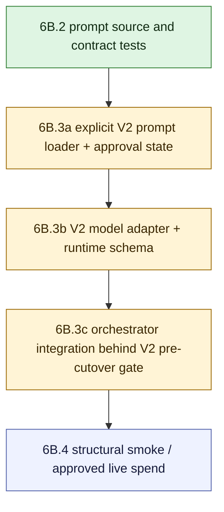

# V2 Slice 6B.3 Gated Model Execution Approval Package

**Date:** 2026-05-14
**Status:** Reviewed; MODIFY; implementation not approved
**Owner role:** Lead Architect / Captain deputy
**Workspace:** `C:\DEV\FactHarbor`
**Git branch:** `main`
**Baseline commits:** Slice 6B.2 prompt draft and contract tests `8a1ef8cd`; status consolidation `75b015cd`

---

## 1. Purpose

This package defines the approval boundary for Slice 6B.3: adding a gated runtime Claim Understanding model path for V2.

This document is intentionally not an implementation patch. It does not enable `claimboundary-v2` file seeding, does not flip prompt/model/cache approvals, does not mark `claim_understanding_gate1` executable, does not add a runtime LLM call, and does not authorize live jobs.

The low-risk next step was to make the execution gate reviewable before any behavior changes. The deputy/LLM review returned `MODIFY`; this package now records the required changes before implementation may start.

## 2. Current Baseline

Slice 6B.2 is complete:

- `apps/web/prompts/claimboundary-v2.prompt.md` exists with `V2_CLAIM_UNDERSTANDING_GATE1`.
- The prompt is clean-room V2 text and passed static/contract tests.
- `claimboundary-v2` remains not file-seeded.
- `claim_understanding_gate1` remains `blockedUntilPromptApproved`.
- Prompt/model/cache approvals are not approved.
- V2 runner/orchestrator still returns a damaged structural pre-cutover envelope; no analytical V2 execution exists.

Current code facts:

| Surface | Current behavior |
|---|---|
| `apps/web/src/lib/analyzer-v2/gateway/policy.ts` | `canExecuteAnalyzerV2GatewayTask(...)` requires `status: "executable"` plus approved prompt, model, and cache policies |
| `apps/web/src/lib/analyzer-v2/gateway/model-policy-registry.ts` | `claim_understanding_gate1` has concrete blocked model metadata: standard tier, temperature `0.15`, max calls `2`, one schema retry, 120s timeout, 6000 output tokens |
| `apps/web/src/lib/analyzer-v2/gateway/cache-governance.ts` | Claim Understanding cache requires direct/ACS source separation and `inputGroundingSeedHash`; ACS runs additionally require `acsSnapshotHash` |
| `apps/web/src/lib/analyzer-v2/execution-selection.ts` | V1 remains default; V2 shell only runs for persisted `claimboundary-v2` plus explicit pre-cutover env gate |
| `apps/web/src/lib/analyzer-v2/orchestrator.ts` | V2 currently builds run context and returns the damaged pre-cutover envelope |

## 3. Review Consolidation - 2026-05-14

Review verdict: **MODIFY**. Do not implement 6B.3 yet.

| Reviewer | Verdict | Key finding |
|---|---|---|
| Claude Opus LLM/runtime-safety expert | MODIFY | Require structural-only schema retry, full provenance values, closed blocked-reason validation, multilingual/input-neutral runtime tests, internal-only Claim Understanding state, V2 cache isolation, and gateway-owned damaged mapping |
| Gemini challenger | MODIFY | Prefer explicit V2 prompt loader over legacy file seeding, require V2 cache namespace isolation, keep ACS migration at the edge, and add adversarial schema tests |
| Senior Developer / regression reviewer | MODIFY | Current repo lacks a clean-room V2 model adapter, `claimboundary-v2` runtime prompt loading, runtime validation schema, and full cache metadata construction |

Consolidated required changes before implementation:

1. Use an explicit V2 prompt-loader abstraction for 6B.3 by default. Do not add `claimboundary-v2` to `FILE_SEEDED_PROMPT_PROFILES` unless Captain explicitly overrides this package after review.
2. Add a V2-owned or neutral shared model-execution adapter. Do not import `@/lib/analyzer/llm` or any other V1 analyzer module into Analyzer V2.
3. Add runtime validation schemas for `ClaimUnderstandingResult` and embedded `ClaimContract`, suitable for the structured-output call and post-call validation.
4. Make the single allowed schema retry structural-only: identical rendered prompt bytes and identical inputs, with no error-feedback prompt, no "fix this JSON" instruction, and no semantic repair.
5. Require real provenance values before execution: prompt hash, config snapshot hash, model/provider, token usage, timings, retry count, cache decision, output schema, and result schema. Do not allow placeholders in an executable 6B.3 path.
6. Keep Claim Understanding output internal to V2 pre-cutover state inside the damaged envelope. Do not add a new public or non-public API/UI diagnostic field in 6B.3.
7. Explicitly isolate V2 cache keys from V1 and from other V2 tasks; direct-input and ACS-prepared paths must remain distinct, and missing or mismatched ACS hashes must fail closed.
8. Keep ACS migration at the V2 edge and map into pure V2 types before the V2 orchestrator sees the data.
9. Add multilingual and input-neutral direct-input execution tests; 6B.2 static prompt tests are not enough once a model call exists.
10. Keep only `claim_understanding_gate1` eligible for executable status; all later V2 gateway tasks remain blocked.

Captain escalation is required if an implementation proposes legacy file seeding, public/API/UI diagnostic exposure, live jobs before a committed/refreshed 6B.3 implementation, or a shared model adapter that would weaken the V1/V2 boundary. Otherwise the deputy team can review the revised implementation plan again before coding.

## 4. Proposed 6B.3 Scope

Slice 6B.3 should add an executable Claim Understanding path only inside the already gated V2 pre-cutover shell.

Allowed in 6B.3 after approval:

- load `claimboundary-v2.prompt.md` through an explicit V2 prompt-loader abstraction;
- record approved prompt/model/cache policy states for `claim_understanding_gate1`;
- render `V2_CLAIM_UNDERSTANDING_GATE1` through the approved V2 prompt profile;
- execute one structured model task for direct-input Claim Understanding;
- map validated model output into `ClaimUnderstandingResult`;
- preserve the ACS-prepared path as structural migration whenever selected claims are valid, normally avoiding the LLM call;
- return blocked/damaged Claim Understanding envelopes on contract, provider, schema, selected-claim, no-valid-claim, or shell-placeholder failures;
- keep execution limited to the explicit V2 pre-cutover gate.

Not allowed in 6B.3:

- public cutover;
- changing V1 default execution;
- UI/API behavior changes;
- live jobs without a separate 6B.4 spend approval;
- adding `claimboundary-v2` to the legacy `FILE_SEEDED_PROMPT_PROFILES` path unless Captain explicitly overrides the default explicit-loader decision;
- prompt wording changes beyond mechanical metadata needed for activation;
- importing or cloning V1 analyzer code, V1 prompt sections, or V1 pipeline-owned contracts;
- adding semantic retries or hidden repair loops;
- changing report generation, verdicting, evidence lifecycle, or source reliability behavior.

## 5. Recommended Implementation Split

### 6B.3a - Explicit V2 Prompt Loader And Approval State

Goal: make activation explicit and testable before any runtime call.

Consolidated decision after review: do not enable legacy file seeding for 6B.3 by default. Add an explicit V2 prompt loader that can load `apps/web/prompts/claimboundary-v2.prompt.md`, validate `pipeline: claimboundary-v2`, render only `V2_CLAIM_UNDERSTANDING_GATE1`, and reject V1 prompt profiles/sections/files.

If Captain explicitly overrides this decision and approves file seeding, the prompt-surface registry and `FILE_SEEDED_PROMPT_PROFILES` must change together, and postbuild reseed behavior must prove the V2 profile is seeded only when intentionally enabled.

Required tests:

- `claimboundary-v2` file seeding stays off in the default 6B.3 path;
- the explicit V2 loader loads only `apps/web/prompts/claimboundary-v2.prompt.md`;
- frontmatter remains `pipeline: claimboundary-v2`;
- V1 `claimboundary.prompt.md` cannot be loaded for the V2 profile;
- gateway execution remains false unless prompt, model, and cache approvals are all approved and the task status is executable.

### 6B.3b - V2 Model Adapter, Runtime Schema, And Claim Understanding Gateway

Goal: add the minimal V2-owned adapter that renders the prompt, calls the approved model task, validates the result, and returns a typed `ClaimUnderstandingResult`.

Design rules:

- use the existing prompt/profile infrastructure structurally, but do not reuse V1 prompt text or V1 task contracts;
- use a V2-owned or neutral shared model adapter; Analyzer V2 must not import from `apps/web/src/lib/analyzer/`;
- validate model output through runtime schemas for `ClaimUnderstandingResult` and embedded `ClaimContract`;
- one model call plus one bounded schema retry is the maximum;
- the bounded schema retry must reuse identical rendered prompt bytes and identical inputs, with no error-feedback injection or semantic repair instruction;
- provider unavailability maps to `damagedReason: "claim_understanding_unavailable"`;
- schema/contract failure after the allowed structural retry maps to `damagedReason: "claim_contract_validation_failed"`;
- model-authored output may use `accepted` or `blocked`; `damaged` remains gateway-owned;
- unknown enum values, unknown top-level keys, and malformed blocked reasons are gateway-owned validation failures, not model-authored truth;
- gateway/run context remains authoritative for hashes, prompt/model/config provenance, ACS migration metadata, and execution telemetry;
- executable telemetry requires real prompt hash, config snapshot hash, model/provider, token usage, timings, retry count, cache decision, output schema, and result schema values;
- no semantic repair, no downstream research, no verdict, no report generation.

Required tests:

- direct-input accepted fixture maps to a valid `ClaimContract`;
- direct-input `no_valid_claim` returns blocked without a dummy claim;
- provider failure returns damaged unavailable;
- invalid schema after bounded retry returns damaged contract-validation failure;
- retry prompt bytes equal first-call prompt bytes;
- unknown blocked/damaged reason from the model fails validation;
- rendered prompt uses exactly the four approved variables;
- call metadata records real prompt hash, profile, section, model task, schema version, config snapshot hash, timing, token usage, retry count, and cache decision.

### 6B.3c - Orchestrator Integration

Goal: wire Claim Understanding into the V2 shell while preserving V1 default and the pre-cutover gate.

Design rules:

- ACS prepared snapshots with valid selected claims use the structural migration adapter and normally do not call the model;
- invalid ACS snapshots fail closed; V2 must not silently redo selected Stage 1;
- direct input uses the approved model path;
- `runClaimBoundaryPipelineV2(...)` may advance only through Claim Understanding and then return a pre-cutover damaged envelope that includes the Claim Understanding result as internal V2 state until later evidence/verdict stages exist;
- no new API/UI diagnostic field is added in 6B.3;
- no public result replacement and no report-quality claims are made from 6B.3 alone.

Required tests:

- V1 remains default for normal jobs;
- V2 shell still requires stored `claimboundary-v2` plus explicit env gate;
- ACS valid migration avoids the model call;
- direct input invokes the gateway only when `claim_understanding_gate1` can execute;
- direct-input multilingual and phrasing-neutral samples preserve source-language framing and do not introduce English-only normalization;
- blocked/damaged Claim Understanding returns a damaged structural V2 envelope, not a fake report;
- shell-only placeholder IDs cannot enter the model path;
- Analyzer V2 boundary guard still blocks V1 imports and V1 prompt reuse.

## 6. Approval Questions

Reviewers should answer before any 6B.3 implementation:

1. Does the explicit V2 prompt-loader default fully replace file seeding for 6B.3, or is there a concrete reason to escalate and request Captain approval for legacy file seeding?
2. Are the current model-policy values acceptable for first gated execution: standard tier, temperature `0.15`, max calls `2`, one schema retry, 120s timeout, 6000 output tokens?
3. Is the cache approval model sufficient for first execution, especially direct input vs. ACS prepared snapshot separation?
4. Are full cache/provenance dimensions buildable before execution, or must 6B.3 explicitly disable cache writes while still recording cache decision metadata?
5. Are the failure mappings complete enough to avoid semantic retries and repairs?
6. What exact verifier set must pass before 6B.4 structural smoke or live jobs?

## 7. Review Roles

Recommended review team:

| Role | Focus |
|---|---|
| LLM Expert / Claude Opus | prompt execution safety, model policy, structured-output contract, no hidden semantic repair |
| Senior Developer | implementation feasibility, prompt seeding and config storage, gateway adapter boundaries |
| Code Reviewer | regression risk, tests, V1 default protection, no accidental public behavior change |
| Gemini / Challenger | challenge file-seeding activation, over-preserved legacy coupling, and broken-intermediate risk |
| Lead Architect | consolidate decision, preserve clean-room architecture and slice boundaries |

Captain escalation is required if reviewers propose legacy file seeding, public/API/UI diagnostic exposure, live jobs before a committed/refreshed 6B.3 implementation, or a shared model adapter that weakens the V1/V2 boundary.

## 8. Reviewer Prompt

Review `Docs/WIP/2026-05-14_V2_Slice_6B3_Gated_Model_Execution_Approval_Package.md` as the approval package for FactHarbor V2 Slice 6B.3 gated Claim Understanding model execution. Treat Captain intent as clean-room replacement with quality priority, no V1 prompt/code/type reuse, multilingual robustness, input neutrality, Gate 1 integrity, and prevention-first recovery. Check whether the proposed file-seeding decision, approval-state requirements, gateway adapter, ACS/direct-input behavior, model policy, cache policy, failure mapping, and verifier set are sufficient before any executable V2 model path is added. Return `approve`, `modify`, or `reject`; list blockers, required changes, optional improvements, and whether Captain escalation is needed.

## 9. Current Decision

Current decision after review: **MODIFY**. Do not implement 6B.3 yet.

Recommended next low-risk action: prepare or review a revised 6B.3 implementation plan that incorporates the consolidated required changes above. The next code slice, if approved, should start with the V2 prompt loader, V2/neutral model adapter boundary, runtime schemas, and cache/provenance construction tests before any live model call.

Until that review is complete, keep the repository behavior unchanged:

- `claimboundary-v2` not file-seeded;
- `claim_understanding_gate1` not executable;
- prompt/model/cache approvals not approved;
- no runtime LLM call;
- no live jobs;
- V1 remains the default product runtime.
