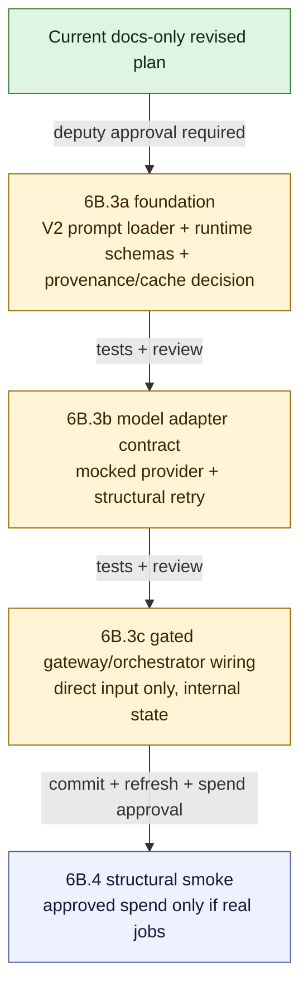

# V2 Slice 6B.3 Revised Implementation Plan

**Date:** 2026-05-14
**Status:** 6B.3a foundation complete at `2d14c89a`; 6B.3b model adapter complete at `04742922`; 6B.3c review returned `MODIFY`; 6B.3c-0 structural no-dispatch orchestration complete at `3223d99f`; 6B.3c-1 dispatch-frame contract complete at `8a663d3f`; 6B.3c-2B dispatch-readiness contract complete at `6a9d7143`
**Owner role:** Lead Architect / Captain deputy
**Workspace:** `C:\DEV\FactHarbor`
**Git branch:** `main`
**Inputs:** `Docs/WIP/2026-05-14_V2_Slice_6B3_Gated_Model_Execution_Approval_Package.md`; Claude Opus LLM/runtime review; Claude Sonnet Senior Developer review; Gemini Challenger review; 6B.3b Claude Opus/Sonnet/Gemini adapter review

---

## 1. Debate Consolidation

The 6B.3 approval package returned `MODIFY`. The follow-up debate answered whether to proceed to code or stay in planning.

Consensus:

- Do **not** implement 6B.3 runtime code yet.
- The next low-risk step is this docs-only revised implementation plan.
- After this plan is reviewed and approved, the first code slice should be a narrow prerequisite slice with no model calls and no runtime activation.
- No Captain escalation is needed for this docs-only plan.

Reasoning:

- Runtime execution is not low risk because current V2 lacks a clean-room model adapter, V2 runtime prompt loader, runtime validation schemas, and complete cache/provenance construction.
- A prerequisite code slice may be low risk later, but only after the plan answers the open questions and the deputy team approves it.

## 2. Decisions For Revised 6B.3

| Question | Decision |
|---|---|
| File seeding vs explicit loader | Use an explicit V2 prompt loader by default. Do not add `claimboundary-v2` to `FILE_SEEDED_PROMPT_PROFILES` in 6B.3. Escalate to Captain only if someone proposes legacy file seeding. |
| Claim Understanding visibility | Keep the Claim Understanding result internal to the V2 pre-cutover damaged envelope/state. Do not add a public, API, UI, or non-public diagnostic field in 6B.3. |
| Model adapter ownership | 6B.3b must use a V2-owned adapter under `apps/web/src/lib/analyzer-v2/`, preferably `apps/web/src/lib/analyzer-v2/claim-understanding/model-adapter.ts`. Do not use a neutral/shared adapter in 6B.3b. Analyzer V2 must not import from `apps/web/src/lib/analyzer/`. |
| Runtime schemas | Add runtime schemas for `ClaimUnderstandingResult` and embedded `ClaimContract` before any model dispatch. Test fixtures are not enough. |
| Retry policy | One structural schema retry maximum, using identical rendered prompt bytes and identical input variables. No error-feedback prompt and no semantic repair instruction. |
| Cache/provenance | For first execution, prefer cache bypass/no-store unless all required dimensions are fully available. Still record real cache-decision metadata. Placeholders are not allowed in executable telemetry. |
| Model policy | Keep the existing policy as the review baseline. The current `claim_understanding_gate1` temperature remains `0.15`; 6B.3b must read it from policy and must not change it without later LLM Expert approval. |
| Live jobs | None in 6B.3. Any real job belongs to 6B.4 after commit-first, runtime refresh, and explicit spend approval. |

## 3. Revised Slice Split

## 4. Required Changes Mapped To Slices

| Required change from review | Owning slice | Required verifier |
|---|---|---|
| Explicit V2 prompt loader; no legacy file seeding | 6B.3a | loader rejects V1 profile/file/section; `claimboundary-v2` remains absent from `FILE_SEEDED_PROMPT_PROFILES` |
| V2-owned model adapter under `apps/web/src/lib/analyzer-v2/`; no neutral/shared adapter; no V1 analyzer import | 6B.3b | boundary guard plus import scan for `apps/web/src/lib/analyzer-v2` |
| Runtime `ClaimUnderstandingResult` and `ClaimContract` schemas | 6B.3a | accepted, blocked, damaged, malformed enum, unknown key, and invalid embedded-contract tests |
| Structural-only schema retry | 6B.3b | retry prompt bytes equal first-call prompt bytes; no error-feedback prompt |
| Real provenance values, no placeholders | 6B.3a and 6B.3b | telemetry/provenance object requires prompt hash, config snapshot hash, model/provider, schema, retry count, token/timing fields where provider dispatch occurs |
| Internal-only Claim Understanding state | 6B.3c | API/UI/result JSON compatibility tests or fixture guard proving no new public field |
| V2 cache namespace and direct/ACS isolation | 6B.3a | cache decision/key tests prove V1 cannot hit V2; ACS hash mismatch fails closed |
| ACS migration at V2 edge into pure V2 types | 6B.3c | ACS valid migration avoids model call; invalid ACS fails closed; no V1 types in orchestrator |
| Multilingual and input-neutral runtime tests | 6B.3b and 6B.3c | 6B.3b adapter pass-through tests preserve source-language framing without prompt/input mutation; 6B.3c direct-input runtime tests prove the wired path does the same |
| Only `claim_understanding_gate1` eligible for executable status | 6B.3a | policy tests prove later V2 tasks remain blocked |

## 5. 6B.3a Foundation Slice

Purpose: prepare V2 runtime prerequisites without model dispatch or runtime activation.

Implementation status: 6B.3a is complete at `2d14c89a` as a structural foundation slice. This completion does not approve 6B.3b, 6B.3c, runtime execution, model calls, approval flips, file seeding, orchestrator wiring, API/UI/report changes, or live jobs.

Allowed:

- add explicit V2 prompt-loader abstraction for `claimboundary-v2.prompt.md`;
- validate frontmatter, required variables, and section id;
- validate that only the approved V2 Claim Understanding variables are accepted;
- reject V1 prompt files, V1 profile names, and V1 section names;
- add production V2 runtime schemas for `ClaimUnderstandingResult` and embedded `ClaimContract`; fixture JSON schemas alone are insufficient;
- add provenance/cache-decision data structures and tests, with cache reads/writes disabled unless full dimensions are available;
- record explicit no-dispatch/no-store cache/provenance decisions in 6B.3a; provider, token, timing, and retry telemetry belongs only to later dispatch-capable slices;
- update policy tests so only `claim_understanding_gate1` is structurally eligible to become executable in a future approved slice.

Forbidden:

- no model calls;
- no imports from `apps/web/src/lib/analyzer/` anywhere in 6B.3a, including prompt-loader, provider, type, schema, and helper imports;
- no orchestrator wiring;
- no file seeding;
- no addition of `claimboundary-v2` to `FILE_SEEDED_PROMPT_PROFILES`;
- no approval flips;
- no production registry/status change that makes `claim_understanding_gate1` executable; policy tests may use synthetic cloned entries only;
- no live jobs.

Minimum verifier:

- V2 prompt-loader tests;
- deterministic render byte-equality test for identical prompt source hash, profile, section, and variables;
- runtime schema tests;
- schema id/version pinning tests for `v2.claim_understanding_result.0` and `v2.claim_contract.0`;
- cache/provenance decision tests;
- gateway policy tests;
- Analyzer V2 boundary guard, including prompt-loader import paths and zero imports from `apps/web/src/lib/analyzer/`;
- `git diff --check`;
- `npm -w apps/web run build`.

Schema enum and key hygiene: status and reason values are structural contract keys, not analysis-language decisions. Unknown enum/key values must fail schema validation as gateway-owned validation failures, never as model-authored truth.

## 6. 6B.3b Model Adapter Contract Slice

Purpose: add model adapter mechanics without public execution.

Implementation status: 6B.3b is complete at `04742922` as a mock-only adapter contract slice. This completion does not approve 6B.3c, runtime execution, approval flips, file seeding, orchestrator wiring, API/UI/report changes, live jobs, provider SDK callsites, cache IO, or public cutover.

The 6B.3b review returned `MODIFY`, so the implementation followed the constraints below as the operative contract.

Allowed:

- add a V2-owned adapter at `apps/web/src/lib/analyzer-v2/claim-understanding/model-adapter.ts`, or another path under `apps/web/src/lib/analyzer-v2/` approved before code;
- expose a dependency-injected dispatch boundary that receives the rendered prompt and an injected provider-call function; 6B.3b ships no built-in provider SDK callsite;
- add mocked provider tests for accepted, blocked, provider failure, malformed JSON/plain text, unknown enum, and invalid schema after bounded retry;
- implement structural-only retry with identical prompt bytes;
- read `schemaRetryCount` and call-budget limits from `getAnalyzerV2TaskModelPolicy("claim_understanding_gate1")` rather than hardcoding retry count or call budget;
- fail closed whenever `canExecuteAnalyzerV2GatewayTask(...)` is false, independent of mock/live mode;
- parse provider responses with the production Zod schemas from `claim-understanding/schemas.ts`;
- return a damaged result with `damagedReason: "claim_contract_validation_failed"` after the bounded structural retry is exhausted;
- record typed telemetry/provenance fields for dispatch paths: `promptContentHash`, `configSnapshotHash`, provider id, model id, schema id, retry count, token counters, timings, and cache decision;
- use only mock/synthetic provider calls in tests.

Forbidden:

- no V1 analyzer imports;
- no neutral/shared adapter in 6B.3b;
- no placement in, or dependency on, `apps/web/src/lib/analyzer/`;
- no exports from `apps/web/src/lib/analyzer-v2/index.ts` and no imports from `orchestrator.ts`, `pipeline-shell.ts`, `runner-ingress.ts`, `runClaimBoundaryAnalysis`, or other product execution paths in 6B.3b;
- no provider SDK import or built-in provider callsite;
- no hidden semantic retry or repair;
- no error-feedback prompt, continuation prompt, temperature change, prompt mutation, input mutation, or model escalation between retry attempts;
- no normalization, translation, lowercasing, diacritic stripping, or other mutation of `renderedPrompt`, `analysisInput`, or `resolvedInputText`;
- no cache read or cache write, even in mock mode;
- no placeholder telemetry values such as `placeholder`, `todo`, or `unknown` in any real dispatch path;
- no production registry/status change, approval flip, or shipped executable state change;
- no orchestrator integration that can run in product paths;
- no live jobs.

Minimum verifier:

- mocked adapter tests for accepted, blocked, provider failure, malformed JSON/plain text, unknown enum, invalid schema, and damaged-after-retry outcomes;
- structural-only retry byte-equality test proving the second attempt reuses identical `renderedPrompt` and `promptContentHash`;
- policy fail-closed test proving dispatch is blocked when `canExecuteAnalyzerV2GatewayTask(...)` is false;
- synthetic eligible-task fixture tests that do not flip shipped registry/status approvals;
- runtime schema validation tests proving unknown enums and extra keys reject before accepted output is returned;
- telemetry/provenance tests proving required fields are typed and no placeholder strings appear in real dispatch paths;
- cache decision test proving no-store remains in force when execution is not approved;
- multilingual/input-neutral pass-through test with at least one non-English fixture proving no prompt/input mutation;
- no-import/no-export guard covering `index.ts`, `orchestrator.ts`, `pipeline-shell.ts`, `runner-ingress.ts`, and V1 analyzer paths;
- no provider SDK import scan;
- Analyzer V2 boundary guard;
- focused Analyzer V2 test slice;
- `npm -w apps/web run build`;
- `git diff --check`.

Adapter design notes:

- The adapter may define a local `adapterVersion` constant.
- The current model-policy temperature remains `0.15` unless a later LLM Expert review changes it. Do not switch to `0.0` inside 6B.3b without that review.
- Test telemetry may use synthetic values, but production-capable dispatch code must require typed caller/provider-supplied telemetry rather than hardcoded placeholders.
- Structural retry is for provider/schema resilience only. It is not a semantic repair or quality-improvement loop.

## 7. 6B.3c Gated Gateway And Orchestrator Wiring

Purpose: connect Claim Understanding to the existing V2 pre-cutover shell while preserving V1 default and internal-only state.

Review status: expert debate returned `MODIFY`. Do not implement 6B.3c as a full runtime-dispatch/orchestrator slice from the earlier wording. Split it first.

### 7.1 6B.3c-0 Structural Claim Understanding Orchestration

Purpose: add the internal Claim Understanding orchestration boundary without provider dispatch.

Implementation status: 6B.3c-0 is complete at `3223d99f` as a structural no-dispatch orchestration slice. It does not approve provider dispatch, prompt rendering, cache IO/eligibility, approval flips, API/UI/report exposure, public cutover, live jobs, or V1 cleanup.

Allowed:

- add a V2-owned internal `ClaimUnderstandingRuntimeState` or equivalent object;
- call a V2-owned Claim Understanding stage from the V2 orchestrator;
- ACS valid migration path that avoids prompt rendering, model adapter dispatch, and provider callbacks;
- blocked/damaged Claim Understanding mapped into a damaged structural V2 pre-cutover envelope;
- internal V2 state only, no API/UI/report diagnostic field.
- direct input may perform the gateway approval check and must fail closed while shipped `claim_understanding_gate1` remains non-executable;
- shell-placeholder selected IDs must be detected from raw runner input before normalization can drop them;
- ACS migration must occur at the V2 edge before orchestrator-stage logic consumes prepared snapshot data;
- ACS snapshot hash and input-grounding seed hash must be canonical V2 hashes. Do not treat `resolvedInputSha256` as an ACS snapshot hash unless a later reviewed migration explicitly proves that equivalence;
- blocked direct input must do no prompt loading/rendering, no cache read/write, no cache-decision construction that implies eligibility, no provider callback creation, and no model-adapter call.

Forbidden:

- no model adapter import from product execution paths in 6B.3c-0;
- no prompt loading or rendering;
- no provider SDK import or provider callback;
- no cache read/write;
- no production approval/status mutation or synthetic approved task in product code;
- no public cutover;
- no V1 default change;
- no API/UI changes;
- no report generation;
- no evidence/research/verdict stage execution;
- no live jobs.

Minimum verifier:

- V1 default routing tests;
- V2 pre-cutover env-gate routing tests;
- ACS migration avoids prompt load, adapter call, model call, and provider callback;
- direct input performs the gateway check before prompt rendering, cache decision construction, provider callback creation, or adapter invocation;
- shipped default `claim_understanding_gate1` remains blocked and cannot execute;
- shell-placeholder ID in raw runner input fails before provider dispatch and cannot be hidden by normalization;
- invalid/stale/mismatched ACS data fails closed with no cache eligibility;
- multilingual and input-neutral direct-input tests;
- API/UI/result compatibility guard proving no public field change and recursively rejecting public `claimUnderstanding`, adapter telemetry, prompt text, provider telemetry, and cache key material;
- import-time side-effect guard proving V1-default runner imports do not load prompts, create provider callbacks, perform cache IO, or touch provider SDKs;
- Analyzer V2 boundary guard;
- focused Analyzer V2 test slice;
- `npm -w apps/web run build`;
- `git diff --check`.

#### 7.1.1 6B.3c-0 Acceptance Addendum

Follow-up deputy debate verdict: `MODIFY`. The narrowed Section 7.1 direction is acceptable only after this addendum constrains the exact source and verifier envelope. Source edits may start under the rules below; any pressure to exceed them reopens review.

Exact source envelope:

- `apps/web/src/lib/analyzer-v2/runner-ingress.ts`: detect shell-only placeholder selected IDs from the raw runner input before any normalization can drop or hide them; stop mapping `preparedStage1.preparationProvenance.resolvedInputSha256` to `acsSnapshotHash` unless a reviewed V2 canonical ACS hash is provided by the caller.
- `apps/web/src/lib/analyzer-v2/run-context.ts`: keep run context structural and stop treating shell-placeholder removal as the protection mechanism for Claim Understanding; the guard belongs at ingress/stage boundaries, not silent normalization.
- `apps/web/src/lib/analyzer-v2/claim-understanding/`: add a V2-owned structural stage/runtime-state boundary for no-dispatch Claim Understanding orchestration. The stage may call `migrateAcsPreparedSnapshotToClaimContract(...)` for ACS-backed runs and may perform the gateway blocked check for direct input, but it must not import the model adapter, prompt loader, provider SDK, cache store, or V1 analyzer code.
- `apps/web/src/lib/analyzer-v2/orchestrator.ts`: call the structural Claim Understanding stage and keep the returned state internal to the orchestrator. It must not place Claim Understanding result, telemetry, prompt text, cache key material, or provider/model fields into public `resultJson`.
- `apps/web/src/lib/analyzer-v2/result-envelope.ts`: remain the public damaged pre-cutover envelope. It may use existing run-context fields, but it must not expose internal Claim Understanding state in 6B.3c-0.

Required tests before code is accepted:

- `runner-ingress.test.ts`: raw shell-placeholder selected IDs fail before they can be normalized away; ACS snapshot hash is not derived from `resolvedInputSha256`.
- `run-context.test.ts`: run context no longer acts as the only shell-placeholder protection.
- new/focused Claim Understanding orchestration test: valid ACS migration reaches accepted internal state without prompt loading, adapter call, model call, cache decision construction, provider callback, or provider SDK.
- direct-input orchestration test: shipped `claim_understanding_gate1` remains blocked, returns internal blocked/damaged state, and performs no prompt/cache/provider/adapter work.
- invalid/stale/mismatched ACS tests: fail closed with no cache eligibility.
- recursive public-result compatibility guard: result JSON must not contain `claimUnderstanding`, adapter telemetry, prompt text, provider telemetry, cache key material, or internal runtime-state fields.
- import-time side-effect guard: importing V1-default runner/V2 shell paths must not load prompts, create provider callbacks, perform cache IO, or touch provider SDK modules.
- boundary guard remains active: no V1 analyzer imports and no product-path model-adapter import.

Do not expand this slice to solve URL resolution, provider dispatch, prompt variable construction, cache key materialization, approval source mutation, API/UI/report diagnostics, or live jobs. Those stay in later reviewed slices.

### 7.2 Later 6B.3c Dispatch Integration Slice

Provider dispatch remains deferred until after a later review approves executable integration. A later reviewed slice may wire the existing model adapter only if it defines:

Current review package: `Docs/WIP/2026-05-14_V2_Slice_6B3c_Dispatch_Integration_Review_Package.md`.

Follow-up debate after 6B.3c-0 returned `MODIFY`: product runtime dispatch remains blocked. Deputy review of the dispatch package also returned `MODIFY`, with consent for a narrower 6B.3c-1 dispatch-frame boundary contract only. Slice 6B.3c-1 is complete at `8a663d3f`: it stops at frame construction/rejection and does not import the model adapter, prompt loader, cache-governance builders, provider SDKs, mocks, test fixtures, or V1 analyzer code.

6B.3c-1 implementation consolidation:

- Added `apps/web/src/lib/analyzer-v2/claim-understanding/dispatch-frame.ts` as a pure internal frame builder.
- Direct text input produces a frame and preserves submitted text exactly as `analysisInput` and `resolvedInputText`.
- Direct URL input fails closed before prompt/cache/provider/adapter work and does not treat the URL as body text.
- ACS-backed input requires resolved snapshot text plus canonical `acsSnapshotHash` and `inputGroundingSeedHash`.
- Static guards prove the frame module imports no V1 analyzer, prompt loader, model adapter, cache-governance builder, gateway policy, provider SDK, mock, or fixture module.

6B.3c-1 verification:

- `npm -w apps/web run test -- test/unit/lib/analyzer-v2/claim-understanding/dispatch-frame.test.ts test/unit/lib/analyzer-v2/boundary-guard.test.ts`
- `npm -w apps/web run test -- test/unit/lib/analyzer-v2`
- `npm -w apps/web run build`; postbuild reseed reported `Prompts: 0 changed, 3 unchanged`
- targeted clean-room source scan for forbidden dispatch-frame imports
- `git diff --check`

- the approval source for execution without mutating shipped registry constants;
- the exact runtime provider-dispatch boundary;
- why an adapter import from a product path is now allowed and what guard replaces the 6B.3b no-import guard;
- how mocks are excluded from product paths;
- full prompt variable, config snapshot, cache/no-store, current-date bucket, input identity, ACS hash, and input-grounding seed hash construction;
- URL-input handling without pretending an unresolved URL string is resolved body text.

Captain escalation is required before any production approval flip, real provider SDK callsite, cache IO enablement, public/API/UI/report diagnostic exposure, file seeding, live job, or V1/V2 boundary weakening.

Post-6B.3c-1 deputy debate:

- Claude Opus-style LLM/runtime safety: `BLOCK` product-runtime source code now.
- Senior Developer: `MODIFY`; draft a docs-only runtime-dispatch gate package first.
- Code Reviewer / clean-room: `MODIFY`; source code is safe only if it is another non-executable/internal contract or guard slice.
- Gemini-style Challenger: `BLOCK` product runtime dispatch and require a dispatch-readiness contract before replacing the adapter-import ban.

Consolidated decision: no product runtime dispatch source code is approved after 6B.3c-1. The next low-risk step is the docs-only gate package `Docs/WIP/2026-05-14_V2_Slice_6B3c_Product_Runtime_Dispatch_Review_Package.md`. That package does not approve prompt rendering, model-adapter product imports, provider callbacks, provider SDKs, cache IO, approval flips, public diagnostics, direct URL body assumptions, live jobs, or V1 reuse.

Review of the first 6B.3c-2 gate package returned `MODIFY`. The revised package keeps 6B.3c-2A docs-only and changes any later 6B.3c-2B source candidate to contract-only, preferably `dispatch-readiness-contract.ts` rather than a runtime owner: approval snapshot shape, dispatch-owner boundaries, replacement import guards, URL fail-closed rules, provenance packet types/tests, and negative reachability guards. Prompt rendering, cache-decision construction, model-adapter calls, provider callbacks, provider SDK imports, approval enablement, cache IO, public surfaces, direct URL dispatch, live jobs, and V1 reuse remain blocked.

6B.3c-2B is complete at `6a9d7143` as an inert dispatch-readiness contract. Post-readiness expert review returned `BLOCK/BLOCK/BLOCK/MODIFY` for product runtime dispatch. The only accepted next source envelope is 6B.3c-3A: a non-executable `runtime-dispatch.ts` owner/activation contract, readiness approval-source tightening, and stronger boundary guards. Product wiring, prompt rendering, cache-decision construction, adapter calls, provider callbacks/SDKs, approval flips, public surfaces, direct URL dispatch, live jobs, and V1 reuse remain blocked.

6B.3c-3A source envelope:

- `apps/web/src/lib/analyzer-v2/claim-understanding/runtime-dispatch.ts`;
- `apps/web/test/unit/lib/analyzer-v2/claim-understanding/runtime-dispatch.test.ts`;
- `apps/web/src/lib/analyzer-v2/claim-understanding/dispatch-readiness-contract.ts`;
- `apps/web/test/unit/lib/analyzer-v2/claim-understanding/dispatch-readiness-contract.test.ts`;
- `apps/web/test/unit/lib/analyzer-v2/boundary-guard.test.ts`.

Required 6B.3c-3A verifier additions:

- readiness contract blocks review-package snapshots and requires runtime approval snapshot identity metadata;
- runtime owner contract remains `contract_only`, not product-reachable, and records false side-effect flags;
- cache posture stays no-read/no-write and does not construct a cache decision;
- prompt rendering, provider callback/SDK, adapter call, product wiring, public exposure, and direct URL dispatch remain blocked;
- boundary guard proves protected product paths have no direct or transitive reachability to dispatch-capable internals.

6B.3c-3A is complete at `a79cba3f`. The follow-up 6B.3c-3B owner-implementation package initially proposed prompt rendering, no-store cache-decision construction, and adapter invocation inside a non-product-wired owner. Expert review returned `BLOCK/MODIFY/MODIFY/MODIFY`; the revised package now splits the work:

- **6B.3c-3B1:** preflight/provenance binding and guard hardening only;
- **6B.3c-3B2:** explicit runtime no-store cache decision contract;
- **6B.3c-3B3:** prompt rendering and adapter invocation owner, still non-product-wired, only after 3B1/3B2 pass.

For 3B1, prompt rendering, cache-decision construction, provider callback acceptance, adapter invocation, product wiring, public surfaces, direct URL dispatch, live jobs, and V1 reuse remain blocked.

6B.3c-3B1 is complete as pre-render readiness/provenance binding and guard hardening. 6B.3c-3B2 is complete as a pure gateway cache-contract slice: `gateway/types.ts` adds `no_store_runtime_dispatch_safety`, `gateway/cache-governance.ts` adds `buildAnalyzerV2ClaimUnderstandingRuntimeNoStoreCacheDecision(...)`, and tests/guards prove the runtime no-store decision cannot enable cache read/write or leak to runtime/product/public surfaces. `runtime-dispatch.ts` still does not consume cache governance.

Post-3B2 deputy review returned `MODIFY/MODIFY` for 6B.3c-3B3. 3B3 may be specified only as a narrowed internal direct-text owner slice in `runtime-dispatch.ts`: owner-built prompt variables, owner-created post-render provenance, runtime no-store cache decision, adapter call through injected provider callback only, and one private executable-clone helper if required by the adapter. Product wiring, provider SDKs, public surfaces, ACS/direct URL execution, cache read/write, approval flips, prompt/config changes, live jobs, and V1 reuse remain blocked.

6B.3c-3B3 is complete as that narrowed internal direct-text owner slice. `runtime-dispatch.ts` now renders the V2 prompt after satisfied readiness, builds the runtime no-store cache decision, calls the adapter only through the injected provider callback, and confines executable gateway task state to the private runtime-dispatch clone helper. Product wiring, public surfaces, ACS/direct URL execution, built-in provider SDKs, cache read/write, prompt/config changes, live jobs, and V1 reuse remain blocked.

## 8. Approval Gate Before Code

Reviewers have approved this revised plan for 6B.3a foundation only.

Required review lenses:

- LLM Expert / Claude Opus: runtime prompt execution, model policy, retry, provenance, multilingual/input-neutral runtime tests;
- Senior Developer: feasibility of explicit loader, runtime schemas, adapter boundary, cache/provenance construction;
- Code Reviewer: regression risk, V1 default protection, public-surface guards, no accidental file seeding;
- Gemini Challenger: broken-intermediate risk, clean-room boundary, hidden legacy coupling.

Captain escalation is required only if the plan changes to include legacy file seeding, public/API/UI diagnostic exposure, live jobs before a committed/refreshed implementation, or a shared adapter that weakens the V1/V2 boundary. After the 6B.3b review, the neutral/shared adapter option is removed from 6B.3b rather than escalated, because a V2-owned local adapter is simpler and lower risk.

## 9. Review Approval Consolidation

Reviewer outcome for the revised plan:

| Reviewer lens | Verdict | Notes |
|---|---|---|
| Claude Opus LLM/runtime safety | APPROVE for 6B.3a only | No blockers. Recommended render determinism, schema version pinning, explicit no-file-seeding restatement, and structural enum/key hygiene. |
| Claude Sonnet code/regression review | APPROVE | No blockers. Recommended clarifying that policy tests preserve shipped blocked state and that the build is unconditional for 6B.3a. |
| Gemini challenger | APPROVE | No blockers. Recommended strict approved-variable validation and zero V1 analyzer imports in runtime schemas. |
| Senior Developer | APPROVE with required clarifications | Required all V1 analyzer imports to be forbidden, production status flips to stay out of scope, runtime schemas to live in production V2 code, and 6B.3a cache/provenance to avoid placeholder provider telemetry. |

Captain escalation is not needed for 6B.3a because the approved slice excludes legacy file seeding, public/API/UI diagnostic exposure, live jobs, shared adapters, runtime model calls, and approval flips.

## 10. Current Decision

6B.3a foundation code is complete and committed at `2d14c89a`.

6B.3b review and implementation consolidation:

| Reviewer lens | Verdict | Required outcome |
|---|---|---|
| Claude Opus senior architect / LLM runtime | MODIFY | Use V2-owned adapter path, dependency-injected dispatch, production schema validation, fail-closed gateway policy, identical structural retry, full telemetry/provenance, no cache IO, and no product-path imports. |
| Claude Sonnet senior developer | APPROVE with optional clarifications | Prefer `claim-understanding/model-adapter.ts`, keep current temperature unless LLM Expert changes it, add no-export/no-orchestrator verifier, and require real typed telemetry fields in dispatch-capable paths. |
| Gemini challenger | MODIFY | Remove neutral/shared adapter ambiguity; require the adapter to live exclusively under `apps/web/src/lib/analyzer-v2/` for 6B.3b before code starts. |

Consolidated decision: 6B.3b code was implemented only under the tightened Section 6 contract above and committed at `04742922`.

6B.3b verification:

- `npm -w apps/web run test -- test/unit/lib/analyzer-v2/claim-understanding/model-adapter.test.ts test/unit/lib/analyzer-v2/boundary-guard.test.ts test/unit/lib/analyzer-v2/gateway/policy.test.ts test/unit/lib/analyzer-v2/gateway/cache-governance.test.ts`
- `npm -w apps/web run test -- test/unit/lib/analyzer-v2`
- Source import/provider scan for V1 analyzer imports, V1 prompt reuse, prompt-loader reuse, and provider SDK imports in Analyzer V2 plus the adapter test
- `npm -w apps/web run build`; postbuild reseed reported `Prompts: 0 changed, 3 unchanged`
- `git diff --check`

Safe `npm test` did not complete cleanly as a full-suite run because three existing runner/admin tests timed out under concurrent full-suite execution. The failed tests passed when rerun directly: `test/unit/lib/internal-runner-v2-routing.test.ts`, `test/unit/lib/drain-runner-pause.integration.test.ts`, and `test/unit/app/api/admin/test-config/route.test.ts`. The failed-validation classification for 6B.3b is `keep`; no 6B.3b change was broadened or reverted.

Until 6B.3c receives separate review and implementation approval:

- `claimboundary-v2` remains not file-seeded;
- `claim_understanding_gate1` remains non-executable;
- prompt/model/cache approvals remain unflipped;
- no runtime LLM call is added;
- no live jobs are submitted;
- V1 remains the default runtime.

6B.3c review consolidation:

| Reviewer lens | Verdict | Required outcome |
|---|---|---|
| LLM/runtime safety | MODIFY | Split 6B.3c; preserve shipped blocked state; define internal-only state, cache/no-store construction, prompt variables, hash provenance, URL handling, and provider-dispatch ownership before code. |
| Senior Developer | MODIFY | Start only with a narrower 6B.3c-0 structural no-dispatch slice; ACS migration may be wired, direct input must remain gateway-blocked with no provider dispatch, and product adapter import needs a later guard change. |
| Code Reviewer | MODIFY | Gateway approval must be checked before prompt rendering/cache/provider setup; approval source is undefined; ACS hash provenance is ambiguous; product-path import guards need a 6B.3c-appropriate side-effect/reachability replacement. |
| Challenger | MODIFY | Shell-placeholder IDs can be hidden by current normalization; internal state could leak through persisted `resultJson`; provider dispatch ownership and ACS migration edge are under-specified. |

Consolidated decision: 6B.3c code is not approved as originally written. The next low-risk step is the documentation tightening in this Section 7. Implementation may start only as 6B.3c-0 structural no-dispatch orchestration after this tightened plan is accepted by the deputy team.

6B.3c-0 acceptance addendum:

| Reviewer lens | Verdict | Required outcome |
|---|---|---|
| LLM/runtime advocate | APPROVE within boundaries | Code may start only inside Section 7.1: internal state, ACS-at-edge migration, direct-input fail-closed gateway check, no prompt/cache/provider/adapter dispatch, no public leakage, and V1 default preserved. |
| Senior implementation challenger | MODIFY | Before source edits, name the exact file/test envelope and close the currently visible ambiguities: raw shell-placeholder hiding, `resolvedInputSha256` misuse as ACS hash, internal-state leak boundary, side-effect guards, and public-result recursive guards. |

Consolidated decision: Section 7.1.1 is the accepted implementation envelope for 6B.3c-0. Source work may proceed only within those files/tests and must stop for review if it reaches adapter import, prompt rendering, provider callback/SDK, cache IO/eligibility, approval/status mutation, public result/API/UI/report exposure, live jobs, or V1/V2 boundary weakening.

6B.3c-0 implementation consolidation:

- commit: `3223d99f`;
- raw runner selected IDs now reject `AC_V2_SHELL_01` before normalization;
- runner ingress no longer maps `preparedStage1.preparationProvenance.resolvedInputSha256` to `acsSnapshotHash`;
- run context no longer silently removes shell-placeholder IDs;
- `claim-understanding/runtime-stage.ts` adds an internal-only no-dispatch stage that accepts ACS migration only with canonical V2 ACS/input-grounding hashes and blocks direct input while the shipped gateway task is non-executable;
- the V2 orchestrator calls the runtime stage but keeps the state out of public `resultJson`;
- boundary/public-leak tests guard against model-adapter imports, prompt-loader/provider SDK imports, public Claim Understanding state, prompt text, provider telemetry, and cache material.

6B.3c-0 verification:

- `npm -w apps/web run test -- test/unit/lib/analyzer-v2/claim-understanding/runtime-stage.test.ts test/unit/lib/analyzer-v2/runner-ingress.test.ts test/unit/lib/analyzer-v2/run-context.test.ts test/unit/lib/analyzer-v2/pipeline-shell.test.ts test/unit/lib/analyzer-v2/boundary-guard.test.ts`
- `npm -w apps/web run test -- test/unit/lib/analyzer-v2`
- `npm -w apps/web run test -- test/unit/lib/internal-runner-v2-routing.test.ts`
- clean-room scan for V1 analyzer imports, V1 prompt reuse, V1 prompt-loader reuse, provider SDK imports, model-adapter product imports, and prompt-loader product imports
- `npm -w apps/web run build`; postbuild reseed reported `Configs: 0 changed, 4 unchanged | Prompts: 0 changed, 3 unchanged`
- `git diff --check`

6B.3a verification:

- `npm -w apps/web run test -- test/unit/lib/analyzer-v2/claim-understanding/claim-contract.test.ts test/unit/lib/analyzer-v2/claim-understanding/prompt-contract.test.ts test/unit/lib/analyzer-v2/gateway/cache-governance.test.ts test/unit/lib/analyzer-v2/gateway/policy.test.ts test/unit/lib/analyzer-v2/boundary-guard.test.ts`
- `npm -w apps/web run test -- test/unit/lib/analyzer-v2`
- Source import scan for V1 analyzer imports/prompt-loader reuse in `apps/web/src/lib/analyzer-v2`
- `npm -w apps/web run build`; postbuild reseed reported `Prompts: 0 changed, 3 unchanged`
- `npm test`
- `git diff --check`
