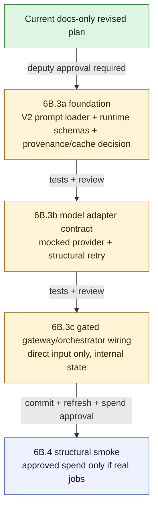

# V2 Slice 6B.3 Revised Implementation Plan

**Date:** 2026-05-14
**Status:** 6B.3a foundation complete at `2d14c89a`; 6B.3b model adapter complete at `04742922`; 6B.3c not approved
**Owner role:** Lead Architect / Captain deputy
**Workspace:** `C:\DEV\FactHarbor`
**Git branch:** `main`
**Inputs:** `Docs/WIP/2026-05-14_V2_Slice_6B3_Gated_Model_Execution_Approval_Package.md`; Claude Opus LLM/runtime review; Claude Sonnet Senior Developer review; Gemini Challenger review; 6B.3b Claude Opus/Sonnet/Gemini adapter review

---

## 1. Debate Consolidation

The 6B.3 approval package returned `MODIFY`. The follow-up debate answered whether to proceed to code or stay in planning.

Consensus:

- Do **not** implement 6B.3 runtime code yet.
- The next low-risk step is this docs-only revised implementation plan.
- After this plan is reviewed and approved, the first code slice should be a narrow prerequisite slice with no model calls and no runtime activation.
- No Captain escalation is needed for this docs-only plan.

Reasoning:

- Runtime execution is not low risk because current V2 lacks a clean-room model adapter, V2 runtime prompt loader, runtime validation schemas, and complete cache/provenance construction.
- A prerequisite code slice may be low risk later, but only after the plan answers the open questions and the deputy team approves it.

## 2. Decisions For Revised 6B.3

| Question | Decision |
|---|---|
| File seeding vs explicit loader | Use an explicit V2 prompt loader by default. Do not add `claimboundary-v2` to `FILE_SEEDED_PROMPT_PROFILES` in 6B.3. Escalate to Captain only if someone proposes legacy file seeding. |
| Claim Understanding visibility | Keep the Claim Understanding result internal to the V2 pre-cutover damaged envelope/state. Do not add a public, API, UI, or non-public diagnostic field in 6B.3. |
| Model adapter ownership | 6B.3b must use a V2-owned adapter under `apps/web/src/lib/analyzer-v2/`, preferably `apps/web/src/lib/analyzer-v2/claim-understanding/model-adapter.ts`. Do not use a neutral/shared adapter in 6B.3b. Analyzer V2 must not import from `apps/web/src/lib/analyzer/`. |
| Runtime schemas | Add runtime schemas for `ClaimUnderstandingResult` and embedded `ClaimContract` before any model dispatch. Test fixtures are not enough. |
| Retry policy | One structural schema retry maximum, using identical rendered prompt bytes and identical input variables. No error-feedback prompt and no semantic repair instruction. |
| Cache/provenance | For first execution, prefer cache bypass/no-store unless all required dimensions are fully available. Still record real cache-decision metadata. Placeholders are not allowed in executable telemetry. |
| Model policy | Keep the existing policy as the review baseline. The current `claim_understanding_gate1` temperature remains `0.15`; 6B.3b must read it from policy and must not change it without later LLM Expert approval. |
| Live jobs | None in 6B.3. Any real job belongs to 6B.4 after commit-first, runtime refresh, and explicit spend approval. |

## 3. Revised Slice Split

## 4. Required Changes Mapped To Slices

| Required change from review | Owning slice | Required verifier |
|---|---|---|
| Explicit V2 prompt loader; no legacy file seeding | 6B.3a | loader rejects V1 profile/file/section; `claimboundary-v2` remains absent from `FILE_SEEDED_PROMPT_PROFILES` |
| V2-owned model adapter under `apps/web/src/lib/analyzer-v2/`; no neutral/shared adapter; no V1 analyzer import | 6B.3b | boundary guard plus import scan for `apps/web/src/lib/analyzer-v2` |
| Runtime `ClaimUnderstandingResult` and `ClaimContract` schemas | 6B.3a | accepted, blocked, damaged, malformed enum, unknown key, and invalid embedded-contract tests |
| Structural-only schema retry | 6B.3b | retry prompt bytes equal first-call prompt bytes; no error-feedback prompt |
| Real provenance values, no placeholders | 6B.3a and 6B.3b | telemetry/provenance object requires prompt hash, config snapshot hash, model/provider, schema, retry count, token/timing fields where provider dispatch occurs |
| Internal-only Claim Understanding state | 6B.3c | API/UI/result JSON compatibility tests or fixture guard proving no new public field |
| V2 cache namespace and direct/ACS isolation | 6B.3a | cache decision/key tests prove V1 cannot hit V2; ACS hash mismatch fails closed |
| ACS migration at V2 edge into pure V2 types | 6B.3c | ACS valid migration avoids model call; invalid ACS fails closed; no V1 types in orchestrator |
| Multilingual and input-neutral runtime tests | 6B.3b and 6B.3c | 6B.3b adapter pass-through tests preserve source-language framing without prompt/input mutation; 6B.3c direct-input runtime tests prove the wired path does the same |
| Only `claim_understanding_gate1` eligible for executable status | 6B.3a | policy tests prove later V2 tasks remain blocked |

## 5. 6B.3a Foundation Slice

Purpose: prepare V2 runtime prerequisites without model dispatch or runtime activation.

Implementation status: 6B.3a is complete at `2d14c89a` as a structural foundation slice. This completion does not approve 6B.3b, 6B.3c, runtime execution, model calls, approval flips, file seeding, orchestrator wiring, API/UI/report changes, or live jobs.

Allowed:

- add explicit V2 prompt-loader abstraction for `claimboundary-v2.prompt.md`;
- validate frontmatter, required variables, and section id;
- validate that only the approved V2 Claim Understanding variables are accepted;
- reject V1 prompt files, V1 profile names, and V1 section names;
- add production V2 runtime schemas for `ClaimUnderstandingResult` and embedded `ClaimContract`; fixture JSON schemas alone are insufficient;
- add provenance/cache-decision data structures and tests, with cache reads/writes disabled unless full dimensions are available;
- record explicit no-dispatch/no-store cache/provenance decisions in 6B.3a; provider, token, timing, and retry telemetry belongs only to later dispatch-capable slices;
- update policy tests so only `claim_understanding_gate1` is structurally eligible to become executable in a future approved slice.

Forbidden:

- no model calls;
- no imports from `apps/web/src/lib/analyzer/` anywhere in 6B.3a, including prompt-loader, provider, type, schema, and helper imports;
- no orchestrator wiring;
- no file seeding;
- no addition of `claimboundary-v2` to `FILE_SEEDED_PROMPT_PROFILES`;
- no approval flips;
- no production registry/status change that makes `claim_understanding_gate1` executable; policy tests may use synthetic cloned entries only;
- no live jobs.

Minimum verifier:

- V2 prompt-loader tests;
- deterministic render byte-equality test for identical prompt source hash, profile, section, and variables;
- runtime schema tests;
- schema id/version pinning tests for `v2.claim_understanding_result.0` and `v2.claim_contract.0`;
- cache/provenance decision tests;
- gateway policy tests;
- Analyzer V2 boundary guard, including prompt-loader import paths and zero imports from `apps/web/src/lib/analyzer/`;
- `git diff --check`;
- `npm -w apps/web run build`.

Schema enum and key hygiene: status and reason values are structural contract keys, not analysis-language decisions. Unknown enum/key values must fail schema validation as gateway-owned validation failures, never as model-authored truth.

## 6. 6B.3b Model Adapter Contract Slice

Purpose: add model adapter mechanics without public execution.

Implementation status: 6B.3b is complete at `04742922` as a mock-only adapter contract slice. This completion does not approve 6B.3c, runtime execution, approval flips, file seeding, orchestrator wiring, API/UI/report changes, live jobs, provider SDK callsites, cache IO, or public cutover.

The 6B.3b review returned `MODIFY`, so the implementation followed the constraints below as the operative contract.

Allowed:

- add a V2-owned adapter at `apps/web/src/lib/analyzer-v2/claim-understanding/model-adapter.ts`, or another path under `apps/web/src/lib/analyzer-v2/` approved before code;
- expose a dependency-injected dispatch boundary that receives the rendered prompt and an injected provider-call function; 6B.3b ships no built-in provider SDK callsite;
- add mocked provider tests for accepted, blocked, provider failure, malformed JSON/plain text, unknown enum, and invalid schema after bounded retry;
- implement structural-only retry with identical prompt bytes;
- read `schemaRetryCount` and call-budget limits from `getAnalyzerV2TaskModelPolicy("claim_understanding_gate1")` rather than hardcoding retry count or call budget;
- fail closed whenever `canExecuteAnalyzerV2GatewayTask(...)` is false, independent of mock/live mode;
- parse provider responses with the production Zod schemas from `claim-understanding/schemas.ts`;
- return a damaged result with `damagedReason: "claim_contract_validation_failed"` after the bounded structural retry is exhausted;
- record typed telemetry/provenance fields for dispatch paths: `promptContentHash`, `configSnapshotHash`, provider id, model id, schema id, retry count, token counters, timings, and cache decision;
- use only mock/synthetic provider calls in tests.

Forbidden:

- no V1 analyzer imports;
- no neutral/shared adapter in 6B.3b;
- no placement in, or dependency on, `apps/web/src/lib/analyzer/`;
- no exports from `apps/web/src/lib/analyzer-v2/index.ts` and no imports from `orchestrator.ts`, `pipeline-shell.ts`, `runner-ingress.ts`, `runClaimBoundaryAnalysis`, or other product execution paths in 6B.3b;
- no provider SDK import or built-in provider callsite;
- no hidden semantic retry or repair;
- no error-feedback prompt, continuation prompt, temperature change, prompt mutation, input mutation, or model escalation between retry attempts;
- no normalization, translation, lowercasing, diacritic stripping, or other mutation of `renderedPrompt`, `analysisInput`, or `resolvedInputText`;
- no cache read or cache write, even in mock mode;
- no placeholder telemetry values such as `placeholder`, `todo`, or `unknown` in any real dispatch path;
- no production registry/status change, approval flip, or shipped executable state change;
- no orchestrator integration that can run in product paths;
- no live jobs.

Minimum verifier:

- mocked adapter tests for accepted, blocked, provider failure, malformed JSON/plain text, unknown enum, invalid schema, and damaged-after-retry outcomes;
- structural-only retry byte-equality test proving the second attempt reuses identical `renderedPrompt` and `promptContentHash`;
- policy fail-closed test proving dispatch is blocked when `canExecuteAnalyzerV2GatewayTask(...)` is false;
- synthetic eligible-task fixture tests that do not flip shipped registry/status approvals;
- runtime schema validation tests proving unknown enums and extra keys reject before accepted output is returned;
- telemetry/provenance tests proving required fields are typed and no placeholder strings appear in real dispatch paths;
- cache decision test proving no-store remains in force when execution is not approved;
- multilingual/input-neutral pass-through test with at least one non-English fixture proving no prompt/input mutation;
- no-import/no-export guard covering `index.ts`, `orchestrator.ts`, `pipeline-shell.ts`, `runner-ingress.ts`, and V1 analyzer paths;
- no provider SDK import scan;
- Analyzer V2 boundary guard;
- focused Analyzer V2 test slice;
- `npm -w apps/web run build`;
- `git diff --check`.

Adapter design notes:

- The adapter may define a local `adapterVersion` constant.
- The current model-policy temperature remains `0.15` unless a later LLM Expert review changes it. Do not switch to `0.0` inside 6B.3b without that review.
- Test telemetry may use synthetic values, but production-capable dispatch code must require typed caller/provider-supplied telemetry rather than hardcoded placeholders.
- Structural retry is for provider/schema resilience only. It is not a semantic repair or quality-improvement loop.

## 7. 6B.3c Gated Gateway And Orchestrator Wiring

Purpose: connect Claim Understanding to the existing V2 pre-cutover shell while preserving V1 default and internal-only state.

Allowed:

- direct-input Claim Understanding through the approved gateway only when `canExecuteAnalyzerV2GatewayTask(...)` is true;
- ACS valid migration path that avoids model dispatch;
- blocked/damaged Claim Understanding mapped into a damaged structural V2 pre-cutover envelope;
- internal V2 state only, no API/UI/report diagnostic field.

Forbidden:

- no public cutover;
- no V1 default change;
- no API/UI changes;
- no report generation;
- no evidence/research/verdict stage execution;
- no live jobs.

Minimum verifier:

- V1 default routing tests;
- V2 pre-cutover env-gate routing tests;
- ACS migration avoids model call;
- direct input cannot call the model unless gateway approval checks pass;
- shell-placeholder ID fails before provider dispatch;
- multilingual and input-neutral direct-input tests;
- API/UI/result compatibility guard proving no public field change;
- Analyzer V2 boundary guard;
- focused Analyzer V2 test slice;
- `npm -w apps/web run build`;
- `git diff --check`.

## 8. Approval Gate Before Code

Reviewers have approved this revised plan for 6B.3a foundation only.

Required review lenses:

- LLM Expert / Claude Opus: runtime prompt execution, model policy, retry, provenance, multilingual/input-neutral runtime tests;
- Senior Developer: feasibility of explicit loader, runtime schemas, adapter boundary, cache/provenance construction;
- Code Reviewer: regression risk, V1 default protection, public-surface guards, no accidental file seeding;
- Gemini Challenger: broken-intermediate risk, clean-room boundary, hidden legacy coupling.

Captain escalation is required only if the plan changes to include legacy file seeding, public/API/UI diagnostic exposure, live jobs before a committed/refreshed implementation, or a shared adapter that weakens the V1/V2 boundary. After the 6B.3b review, the neutral/shared adapter option is removed from 6B.3b rather than escalated, because a V2-owned local adapter is simpler and lower risk.

## 9. Review Approval Consolidation

Reviewer outcome for the revised plan:

| Reviewer lens | Verdict | Notes |
|---|---|---|
| Claude Opus LLM/runtime safety | APPROVE for 6B.3a only | No blockers. Recommended render determinism, schema version pinning, explicit no-file-seeding restatement, and structural enum/key hygiene. |
| Claude Sonnet code/regression review | APPROVE | No blockers. Recommended clarifying that policy tests preserve shipped blocked state and that the build is unconditional for 6B.3a. |
| Gemini challenger | APPROVE | No blockers. Recommended strict approved-variable validation and zero V1 analyzer imports in runtime schemas. |
| Senior Developer | APPROVE with required clarifications | Required all V1 analyzer imports to be forbidden, production status flips to stay out of scope, runtime schemas to live in production V2 code, and 6B.3a cache/provenance to avoid placeholder provider telemetry. |

Captain escalation is not needed for 6B.3a because the approved slice excludes legacy file seeding, public/API/UI diagnostic exposure, live jobs, shared adapters, runtime model calls, and approval flips.

## 10. Current Decision

6B.3a foundation code is complete and committed at `2d14c89a`.

6B.3b review and implementation consolidation:

| Reviewer lens | Verdict | Required outcome |
|---|---|---|
| Claude Opus senior architect / LLM runtime | MODIFY | Use V2-owned adapter path, dependency-injected dispatch, production schema validation, fail-closed gateway policy, identical structural retry, full telemetry/provenance, no cache IO, and no product-path imports. |
| Claude Sonnet senior developer | APPROVE with optional clarifications | Prefer `claim-understanding/model-adapter.ts`, keep current temperature unless LLM Expert changes it, add no-export/no-orchestrator verifier, and require real typed telemetry fields in dispatch-capable paths. |
| Gemini challenger | MODIFY | Remove neutral/shared adapter ambiguity; require the adapter to live exclusively under `apps/web/src/lib/analyzer-v2/` for 6B.3b before code starts. |

Consolidated decision: 6B.3b code was implemented only under the tightened Section 6 contract above and committed at `04742922`.

6B.3b verification:

- `npm -w apps/web run test -- test/unit/lib/analyzer-v2/claim-understanding/model-adapter.test.ts test/unit/lib/analyzer-v2/boundary-guard.test.ts test/unit/lib/analyzer-v2/gateway/policy.test.ts test/unit/lib/analyzer-v2/gateway/cache-governance.test.ts`
- `npm -w apps/web run test -- test/unit/lib/analyzer-v2`
- Source import/provider scan for V1 analyzer imports, V1 prompt reuse, prompt-loader reuse, and provider SDK imports in Analyzer V2 plus the adapter test
- `npm -w apps/web run build`; postbuild reseed reported `Prompts: 0 changed, 3 unchanged`
- `git diff --check`

Safe `npm test` did not complete cleanly as a full-suite run because three existing runner/admin tests timed out under concurrent full-suite execution. The failed tests passed when rerun directly: `test/unit/lib/internal-runner-v2-routing.test.ts`, `test/unit/lib/drain-runner-pause.integration.test.ts`, and `test/unit/app/api/admin/test-config/route.test.ts`. The failed-validation classification for 6B.3b is `keep`; no 6B.3b change was broadened or reverted.

Until 6B.3c receives separate review and implementation approval:

- `claimboundary-v2` remains not file-seeded;
- `claim_understanding_gate1` remains non-executable;
- prompt/model/cache approvals remain unflipped;
- no runtime LLM call is added;
- no live jobs are submitted;
- V1 remains the default runtime.

6B.3a verification:

- `npm -w apps/web run test -- test/unit/lib/analyzer-v2/claim-understanding/claim-contract.test.ts test/unit/lib/analyzer-v2/claim-understanding/prompt-contract.test.ts test/unit/lib/analyzer-v2/gateway/cache-governance.test.ts test/unit/lib/analyzer-v2/gateway/policy.test.ts test/unit/lib/analyzer-v2/boundary-guard.test.ts`
- `npm -w apps/web run test -- test/unit/lib/analyzer-v2`
- Source import scan for V1 analyzer imports/prompt-loader reuse in `apps/web/src/lib/analyzer-v2`
- `npm -w apps/web run build`; postbuild reseed reported `Prompts: 0 changed, 3 unchanged`
- `npm test`
- `git diff --check`
