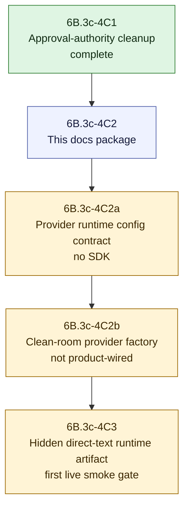

# V2 Slice 6B.3c-4C2 Provider Factory Approval Package

**Date:** 2026-05-14
**Status:** 4C2a implemented after deputy approval; 4C2b provider factory remains unapproved
**Owner role:** Lead Architect / Captain deputy
**Baseline:** `0aa31d4` (`feat: clean up v2 runtime approval authority`)
**Checklist version/hash:** `V2-RUNTIME-GATE-CHECKLIST-2026-05-14.1` / `sha256:9029402e8d359ef21a5e92a181e290a9362203acaca1923a98606b63018fec96`

---

## 1. Purpose

This package defines the next proposed gate after 6B.3c-4C1. It does not approve provider factory code, provider SDK imports, product runtime injection, live jobs, public V2 exposure, cache IO, ACS/direct URL execution, prompt/config changes, approval flips, or V1 cleanup.

4C1 made product/live runtime dispatch fail closed unless the real shipped gateway task becomes executable through real prompt/model/cache policy. 4C2 must now define how a clean-room provider callback factory can be built outside Analyzer V2 without reintroducing scaffold approval, V1 provider helper reuse, hidden config authority, cache IO, or public leakage.

## 2. Deputy Debate Consolidation

| Reviewer lens | Verdict | Required outcome |
|---|---|---|
| LLM/runtime quality reviewer | MODIFY | Do not start source. First define exact provider/config snapshot source, SDK-import exception, factory input/output contract, failure behavior, telemetry, and no-repair/no-fallback rules. |
| Clean-room/security challenger | MODIFY | Do not start source. Add a reviewed guard exception for exactly one factory file; keep Analyzer V2, public surfaces, cache IO, V1 analyzer code, approval flips, ACS/direct URL execution, and live jobs blocked. |
| Implementation architect | MODIFY | Split 4C2 into a docs package, then a config/provenance contract slice, then a provider factory slice. Product runtime injection and first live job belong to later 4C3. |

Consolidated decision:

- The first low-risk action was this docs-only 4C2 package.
- Deputy review of this package approved **4C2a provider runtime config/provenance contract** only.
- 4C2b clean-room provider factory remains unapproved until a later deputy review approves it.
- Product injection and hidden direct-text runtime artifact testing belong to later **4C3**, not 4C2.

## 3. Proposed Slice Split

## 4. 6B.3c-4C2a Proposed Config/Provenance Contract

Purpose: define the V2-owned runtime provider/config snapshot contract before any provider SDK import exists.

Allowed source envelope, approved for 4C2a by deputy review:

- `apps/web/src/lib/analyzer-v2-runtime/claim-understanding-provider-runtime-config.contract.ts`
- `apps/web/test/unit/lib/analyzer-v2-runtime/claim-understanding-provider-runtime-config.contract.test.ts`
- `apps/web/test/unit/lib/analyzer-v2-runtime/claim-understanding-provider-boundary.contract.test.ts`
- `apps/web/test/unit/lib/analyzer-v2/boundary-guard.test.ts`
- documentation and handoff updates

Allowed behavior:

- define the data contract for provider id, model id/name, config snapshot hash, model policy id, temperature, timeout, max output tokens, max calls, schema retry count, output schema version, and approval status;
- require that provider/model/config values come from a V2 task-policy/config snapshot, not ad hoc caller strings;
- preserve direct-text-only scope and internal-only output posture;
- keep the contract inert: no provider callback creation, no provider SDK import, no product wiring, no prompt rendering, no adapter invocation.

Forbidden behavior:

- no provider SDK imports;
- no imports from `apps/web/src/lib/analyzer/`, including `llm.ts`;
- no config-storage/cache IO;
- no prompt/config source edits or file seeding;
- no approval/status flips or executable gateway construction;
- no public API/UI/report/export changes;
- no live jobs.

## 5. 6B.3c-4C2b Proposed Provider Factory

Purpose: add a clean-room provider callback factory outside Analyzer V2, still not product-wired.

Candidate source envelope for later review, not approved by this package:

- `apps/web/src/lib/analyzer-v2-runtime/claim-understanding-provider-factory.ts`
- `apps/web/test/unit/lib/analyzer-v2-runtime/claim-understanding-provider-factory.test.ts`
- `apps/web/test/unit/lib/analyzer-v2-runtime/claim-understanding-provider-runtime-config.contract.test.ts`
- `apps/web/test/unit/lib/analyzer-v2-runtime/claim-understanding-provider-boundary.contract.test.ts`
- `apps/web/test/unit/lib/analyzer-v2/boundary-guard.test.ts`
- documentation and handoff updates

Required ownership rules:

- provider SDK imports, if any, are allowed only in the explicitly approved factory file under `apps/web/src/lib/analyzer-v2-runtime/`;
- Analyzer V2 (`apps/web/src/lib/analyzer-v2/`) remains free of provider SDK imports;
- the factory must not import from `apps/web/src/lib/analyzer/` or reuse V1 provider/model/prompt/config helpers;
- the factory builds an injected `ClaimUnderstandingProviderCall` compatible with the existing V2 model adapter;
- the factory must not own retries, semantic repairs, prompt mutation, model escalation, fallback providers, cache reads, or cache writes;
- provider failures return through the existing adapter failure path with sanitized errors and no fabricated telemetry;
- real telemetry is required: provider id, model id, input/output/total tokens, duration, attempt identity, output schema id, prompt hashes, and config snapshot hash.

Provider factory code is not approved until 4C2 receives separate deputy review and approval.

## 5.1 6B.3c-4C2a Implementation Record

Implementation status: complete; implementing commit pending at time of this source commit and recorded by follow-up traceability update.

Approval pointer:

- package path and section: this document, Section 4;
- checklist version/hash: `V2-RUNTIME-GATE-CHECKLIST-2026-05-14.1` / `sha256:9029402e8d359ef21a5e92a181e290a9362203acaca1923a98606b63018fec96`;
- approval body/date: deputy-team review of this package in the current Codex thread on 2026-05-14;
- approval outcome: LLM/runtime reviewer `APPROVE for 4C2a only`, clean-room/security challenger `APPROVE`, implementation architect `APPROVE for 4C2a only`;
- source envelope: `claim-understanding-provider-runtime-config.contract.ts`, matching test, provider-boundary contract test update, boundary guard update, docs and handoff updates.

Implemented behavior:

- adds an inert `ClaimUnderstandingProviderRuntimeConfigSnapshot` contract under `apps/web/src/lib/analyzer-v2-runtime/`;
- validates that provider/model/config provenance comes from a V2 task-policy/config snapshot, not ad hoc caller strings or legacy pipeline config;
- records approval metadata as provenance only and blocks any contract that attempts to become execution authority;
- rejects provider SDK/callback construction, semantic repair, prompt mutation, model escalation, fallback providers, ACS/direct URL scope, cache IO, public exposure, incomplete telemetry, missing/placeholder provider/model/config identity, wrong task ownership, and invalid retry/call budgets;
- keeps product paths, runtime dispatch, Analyzer V2, prompt/config sources, approval state, and live jobs unchanged.

Verification:

- `npm -w apps/web run test -- test/unit/lib/analyzer-v2-runtime/claim-understanding-provider-runtime-config.contract.test.ts test/unit/lib/analyzer-v2-runtime/claim-understanding-provider-boundary.contract.test.ts test/unit/lib/analyzer-v2/boundary-guard.test.ts` passed 3 files / 45 tests.
- `npm -w apps/web run test -- test/unit/lib/analyzer-v2` passed 20 files / 164 tests.
- `npm -w apps/web run build` passed; postbuild reseed reported `Configs: 0 changed, 4 unchanged | Prompts: 0 changed, 3 unchanged`.
- Production static scans found no provider SDK imports, no V1 analyzer/`llm.ts` imports, no cache/config IO, no executable status construction, no `executionApproved: true`, and no scaffold option pass-through in product callers.
- `git diff --check` passed.

## 6. Guard Requirements

Any approved 4C2 source slice must update static guards before or with source code:

- allowlist exactly one provider SDK import location if 4C2b is approved;
- continue forbidding provider SDK imports in Analyzer V2, public app/components, report/export surfaces, tests not explicitly in the source envelope, and all other runtime files;
- forbid imports from V1 analyzer modules, `llm.ts`, V1 prompt/config helpers, cache IO/storage, config storage, runtime dispatch, and public surface modules;
- forbid `status: "executable"` construction and `executionApproved: true` in production source;
- forbid public result/schema leakage of provider telemetry, rendered prompts, cache decisions, key parts, owner contracts, or callback state;
- keep scaffold option leakage guards active for product callers.

## 7. Live-Job Plan

No live jobs are meaningful for this package, 4C2a, or 4C2b if they remain not product-wired and the shipped gateway task remains blocked.

Live jobs become meaningful only in later 4C3 after:

- source is committed;
- runtime is refreshed;
- real gateway approval authority is explicit;
- a hidden direct-text runtime artifact can be produced without scaffold-only injection;
- public API/UI/report/export output remains unchanged.

The first 4C3 live smoke should run one Captain-defined direct-text input before considering expansion up to the current Captain allowance of four.

## 8. Required Verifier

Minimum verifier for approved 4C2a:

- `npm -w apps/web run test -- test/unit/lib/analyzer-v2-runtime/claim-understanding-provider-runtime-config.contract.test.ts test/unit/lib/analyzer-v2-runtime/claim-understanding-provider-boundary.contract.test.ts test/unit/lib/analyzer-v2/boundary-guard.test.ts`
- `npm -w apps/web run test -- test/unit/lib/analyzer-v2`
- `npm -w apps/web run build`
- static scans for V1 analyzer imports, provider SDK imports, cache/config IO, public leakage, executable status construction, and scaffold option leakage
- `git diff --check`

Minimum verifier for approved 4C2b:

- all 4C2a verifiers;
- `npm -w apps/web run test -- test/unit/lib/analyzer-v2-runtime/claim-understanding-provider-factory.test.ts`
- `npm -w apps/web run test -- test/unit/lib/analyzer-v2/claim-understanding/model-adapter.test.ts`
- static scan proving provider SDK imports exist only in the approved factory file and do not become reachable from Analyzer V2 product/public paths.

## 9. Open Questions For Deputy Review

- What is the authoritative V2 runtime config snapshot source for provider and model name before formal task-policy storage exists?
- Should 4C2a define only a contract, or also a pure builder that validates a supplied snapshot without IO?
- Which provider SDK is allowed first, if any, and where should its import live?
- Should 4C3 use a temporary internal admin/env gate, or wait until formal task-policy approval storage exists?

## 10. Recommended Review Request

Recommended deputy-review prompt:

> Review `Docs/WIP/2026-05-14_V2_Slice_6B3c4C2_Provider_Factory_Approval_Package.md`. Decide whether 6B.3c-4C2a may proceed as source code limited to an inert provider runtime config/provenance contract, and whether the proposed 4C2b provider factory envelope is acceptable for later review. Keep provider SDK imports, product runtime injection, public API/UI/report/export exposure, cache IO, ACS/direct URL execution, live jobs, approval/status flips, prompt/config changes, and V1 cleanup out unless the reviewed slice explicitly approves them. Confirm the guard exceptions and verifier set before source starts.

Expected reviewer output:

- verdict: APPROVE / MODIFY / BLOCK;
- blockers;
- required changes before 4C2a source approval;
- whether 4C2b can be reviewed from this package or needs a separate package;
- whether Captain confirmation is required;
- whether any live job is meaningful before 4C3.
