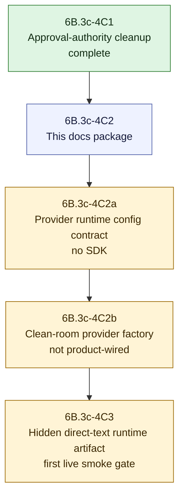

# V2 Slice 6B.3c-4C2 Provider Factory Approval Package

**Date:** 2026-05-14
**Status:** 4C2a implemented after deputy approval; 4C2b-0 contract addendum implemented; 4C2b provider factory source implemented at `7f6f310a`; product wiring/live jobs remain blocked
**Owner role:** Lead Architect / Captain deputy
**Baseline:** `0aa31d4` (`feat: clean up v2 runtime approval authority`)
**Checklist version/hash:** `V2-RUNTIME-GATE-CHECKLIST-2026-05-14.1` / `sha256:9029402e8d359ef21a5e92a181e290a9362203acaca1923a98606b63018fec96`

---

## 1. Purpose

This package defines the 6B.3c-4C2 gate after 6B.3c-4C1. It initially did not approve provider factory code or provider SDK imports. As of 2026-05-15, 4C2b source is approved and implemented at `7f6f310a` under a narrow factory-only envelope. This package still does not approve product runtime injection, live jobs, public V2 exposure, cache IO, ACS/direct URL execution, prompt/config changes, approval flips, or V1 cleanup.

4C1 made product/live runtime dispatch fail closed unless the real shipped gateway task becomes executable through real prompt/model/cache policy. 4C2 must now define how a clean-room provider callback factory can be built outside Analyzer V2 without reintroducing scaffold approval, V1 provider helper reuse, hidden config authority, cache IO, or public leakage.

## 2. Deputy Debate Consolidation

| Reviewer lens | Verdict | Required outcome |
|---|---|---|
| LLM/runtime quality reviewer | MODIFY | Do not start source. First define exact provider/config snapshot source, SDK-import exception, factory input/output contract, failure behavior, telemetry, and no-repair/no-fallback rules. |
| Clean-room/security challenger | MODIFY | Do not start source. Add a reviewed guard exception for exactly one factory file; keep Analyzer V2, public surfaces, cache IO, V1 analyzer code, approval flips, ACS/direct URL execution, and live jobs blocked. |
| Implementation architect | MODIFY | Split 4C2 into a docs package, then a config/provenance contract slice, then a provider factory slice. Product runtime injection and first live job belong to later 4C3. |

Consolidated decision:

- The first low-risk action was this docs-only 4C2 package.
- Deputy review of this package approved **4C2a provider runtime config/provenance contract** only.
- 4C2b-0 then resolved the factory-only state, exact SDK import specifiers, supplied validated snapshot authority, sanitized failure mapping, telemetry ownership, and static guard expectations required before source.
- 4C2b clean-room provider factory source was approved by deputy-team source review and implemented at `7f6f310a`.
- Product injection and hidden direct-text runtime artifact testing belong to later **4C3**, not 4C2.

## 3. Proposed Slice Split

## 4. 6B.3c-4C2a Proposed Config/Provenance Contract

Purpose: define the V2-owned runtime provider/config snapshot contract before any provider SDK import exists.

Allowed source envelope, approved for 4C2a by deputy review:

- `apps/web/src/lib/analyzer-v2-runtime/claim-understanding-provider-runtime-config.contract.ts`
- `apps/web/test/unit/lib/analyzer-v2-runtime/claim-understanding-provider-runtime-config.contract.test.ts`
- `apps/web/test/unit/lib/analyzer-v2-runtime/claim-understanding-provider-boundary.contract.test.ts`
- `apps/web/test/unit/lib/analyzer-v2/boundary-guard.test.ts`
- documentation and handoff updates

Allowed behavior:

- define the data contract for provider id, model id/name, config snapshot hash, model policy id, temperature, timeout, max output tokens, max calls, schema retry count, output schema version, and approval status;
- require that provider/model/config values come from a V2 task-policy/config snapshot, not ad hoc caller strings;
- preserve direct-text-only scope and internal-only output posture;
- keep the contract inert: no provider callback creation, no provider SDK import, no product wiring, no prompt rendering, no adapter invocation.

Forbidden behavior:

- no provider SDK imports;
- no imports from `apps/web/src/lib/analyzer/`, including `llm.ts`;
- no config-storage/cache IO;
- no prompt/config source edits or file seeding;
- no approval/status flips or executable gateway construction;
- no public API/UI/report/export changes;
- no live jobs.

## 5. 6B.3c-4C2b Proposed Provider Factory

Purpose: add a clean-room provider callback factory outside Analyzer V2, still not product-wired.

Approved source envelope after 4C2b-0 deputy consensus:

- `apps/web/src/lib/analyzer-v2-runtime/claim-understanding-provider-factory.ts`
- `apps/web/test/unit/lib/analyzer-v2-runtime/claim-understanding-provider-factory.test.ts`
- `apps/web/test/unit/lib/analyzer-v2-runtime/claim-understanding-provider-runtime-config.contract.test.ts`
- `apps/web/test/unit/lib/analyzer-v2-runtime/claim-understanding-provider-boundary.contract.test.ts`
- `apps/web/test/unit/lib/analyzer-v2/boundary-guard.test.ts`
- documentation and handoff updates

Required ownership rules:

- provider SDK imports, if any, are allowed only in the explicitly approved factory file under `apps/web/src/lib/analyzer-v2-runtime/`;
- Analyzer V2 (`apps/web/src/lib/analyzer-v2/`) remains free of provider SDK imports;
- the factory must not import from `apps/web/src/lib/analyzer/` or reuse V1 provider/model/prompt/config helpers;
- the factory builds an injected `ClaimUnderstandingProviderCall` compatible with the existing V2 model adapter;
- the factory must not own retries, semantic repairs, prompt mutation, model escalation, fallback providers, cache reads, or cache writes;
- provider failures return through the existing adapter failure path with sanitized errors and no fabricated telemetry;
- real telemetry is required: provider id, model id, input/output/total tokens, duration, attempt identity, output schema id, prompt hashes, and config snapshot hash.

Provider factory source is implemented at `7f6f310a` under this envelope. The implementation remains factory-only and not product-wired.

### 5.1 2026-05-15 4C2b Re-Review Consolidation (Historical)

Deputy re-review verdict: **MODIFY**.

Historical consolidated decision before 4C2b-0:

- Do not implement `claim-understanding-provider-factory.ts` from the package as it stood before 4C2b-0.
- The next allowed low-risk action was a 4C2b-0 approval addendum and, if needed, inert contract updates that define a `factory_only_not_product_wired` state before any provider SDK code exists.
- The current 4C2a contracts intentionally treat `sdkImportState: "imported"` and `callbackCreationState: "created"` as blocked. A real factory would violate the satisfied 4C2a state unless a separate factory-only state is reviewed first.
- No Captain confirmation is needed for a docs/contract-only addendum. Captain confirmation is required if the slice proposes product activation, gateway/prompt/model/cache approval flips, public output changes, live jobs, or V1 cleanup.

Required decisions before provider factory source can start:

- exact first provider SDK specifiers and the single allowed import file;
- whether the first factory is provider-specific or provider-dispatching;
- authoritative V2 runtime config snapshot source, without config-storage IO inside the factory;
- factory-only contract state and tests distinct from 4C2a `contract_only`;
- sanitized provider failure mapping and telemetry fields;
- static guard exception proving SDK imports are allowed only in the reviewed factory file.

Allowed 4C2b-0 addendum envelope:

- this package;
- `Docs/AGENTS/V2_Pipeline_Implementation_Guardrails.md`;
- `apps/web/src/lib/analyzer-v2-runtime/claim-understanding-provider-boundary.contract.ts`;
- `apps/web/src/lib/analyzer-v2-runtime/claim-understanding-provider-runtime-config.contract.ts`;
- matching contract tests;
- `apps/web/test/unit/lib/analyzer-v2/boundary-guard.test.ts`;
- handoff documentation.

Still forbidden during 4C2b-0 and still forbidden everywhere outside the approved factory source gate:

- provider SDK imports;
- concrete provider callback creation;
- product/orchestrator/runtime-stage/runtime-dispatch wiring changes;
- prompt/config source changes or file seeding;
- cache read/write/storage IO;
- approval/status flips or executable gateway construction;
- public API/UI/report/export exposure;
- ACS/direct URL execution;
- live jobs;
- V1 analyzer, prompt, helper, model resolver, or provider helper reuse.

Second reviewer confirmation before 4C2b-0:

- 4C2b provider factory remained blocked; the next action was this docs/contract addendum path (`4C2b-0`) before provider SDK imports, callback creation, or factory source.
- The authoritative V2 runtime config snapshot source is unresolved. The current contract validates a supplied shape only; later factory/product wiring depends on this decision.
- V2 product wiring remains gated. No runtime-stage, orchestrator, product injection, approval flip, cache IO, public exposure, or live job is allowed until a later reviewed 4C3 gate.

#### 5.1.1 4C2b-0 Contract Addendum

Implementation status: complete as the 4C2b-0 contract addendum slice.

4C2b-0 resolved the contract vocabulary needed before provider factory source approval.

Resolved for the 4C2b source package:

- provider factory source file: `apps/web/src/lib/analyzer-v2-runtime/claim-understanding-provider-factory.ts`;
- provider SDK import specifiers: exactly `ai` and `@ai-sdk/anthropic`;
- first provider mode: `single_provider_anthropic_initial`;
- factory config authority: accept a validated `ClaimUnderstandingProviderRuntimeConfigSnapshot` supplied by a reviewed caller; the factory must not read config storage, environment, UCM, or ad hoc caller strings directly;
- factory state: `factory_only_not_product_wired`, separate from 4C2a `contract_only` and separate from any execution-approved/product-wired state;
- failure mapping: provider failures become sanitized model-adapter provider failures; raw SDK response exposure and secret exposure remain forbidden;
- telemetry ownership: provider id, model id, token usage, duration, config snapshot hash, attempt identity, output schema version, and prompt hashes are required.

Implemented contract/guard behavior:

- 4C2a `contract_only` still requires no SDK import and no callback creation.
- `factory_only_not_product_wired` can be represented only with the exact factory source path, exact SDK specifier set, supplied validated runtime config snapshot authority, and sanitized failure mapping.
- `execution_approved`, product reachability, cache IO, public exposure, ACS/direct URL scope, legacy source reuse, wrong task ownership, invalid retry budgets, incomplete telemetry, and raw failure exposure remain blocked.
- 4C2b-0 boundary guards asserted that provider factory source was absent until a later source gate approved it. 4C2b source replaced this with an exact one-file SDK import allowlist.

Still unresolved for 4C3/product wiring:

- authoritative storage/retrieval source for the V2 runtime config snapshot;
- product-owned approval authority and activation UI/admin gate;
- hidden direct-text artifact routing and rollback behavior;
- live smoke plan after commit and runtime refresh.

#### 5.1.2 4C2b Provider Factory Source Implementation

Implementation status: complete at `7f6f310a`.

Approval pointer:

- package path and section: this document, Sections 5.1 and 5.1.1;
- checklist version/hash: `V2-RUNTIME-GATE-CHECKLIST-2026-05-14.1` / `sha256:9029402e8d359ef21a5e92a181e290a9362203acaca1923a98606b63018fec96`;
- baseline reviewed for source approval: `8a33e38c` (`docs: define v2 provider factory gate contract`);
- approval body/date: deputy-team source review in the current Codex thread on 2026-05-15;
- approval outcome: three deputy reviewers returned `APPROVE` for the narrow 4C2b source envelope;
- Captain policy context: continue if clear and low risk; use the deputy team for decision points unless there is no consent or a high-risk Captain decision is required;
- implementing commit: `7f6f310a` (`feat: add v2 provider factory source`).

Implemented source envelope:

- `apps/web/src/lib/analyzer-v2-runtime/claim-understanding-provider-factory.ts`;
- `apps/web/test/unit/lib/analyzer-v2-runtime/claim-understanding-provider-factory.test.ts`;
- `apps/web/test/unit/lib/analyzer-v2/boundary-guard.test.ts`;
- documentation and handoff updates.

Implemented behavior:

- validates a supplied `ClaimUnderstandingProviderRuntimeConfigSnapshot`;
- requires `executionState: "factory_only_not_product_wired"`;
- supports only `providerId: "anthropic"`;
- creates a model-adapter-compatible `ClaimUnderstandingProviderCall`;
- dispatches one `generateText` call per adapter attempt with `maxRetries: 0`;
- uses the validated snapshot's `modelId`, `temperature`, `maxOutputTokens`, and `timeoutMs`;
- checks request model policy, schema version, and call budget against the validated snapshot before SDK dispatch;
- requires real provider token usage and duration telemetry instead of fabricating values;
- sanitizes provider failures into the model-adapter provider-failure path;
- performs no config/cache IO, no environment reads, no V1 imports, and no product/runtime-stage/runtime-dispatch wiring.

Verification:

- `npm -w apps/web run test -- test/unit/lib/analyzer-v2-runtime/claim-understanding-provider-factory.test.ts test/unit/lib/analyzer-v2-runtime/claim-understanding-provider-runtime-config.contract.test.ts test/unit/lib/analyzer-v2-runtime/claim-understanding-provider-boundary.contract.test.ts test/unit/lib/analyzer-v2/boundary-guard.test.ts` passed 4 files / 55 tests.
- `npm -w apps/web run test -- test/unit/lib/analyzer-v2/claim-understanding/model-adapter.test.ts` passed 1 file / 7 tests.
- `npm -w apps/web run test -- test/unit/lib/analyzer-v2 test/unit/lib/analyzer-v2-runtime` passed 21 files / 176 tests.
- `npm -w apps/web run build` passed; postbuild reseed reported `Configs: 0 changed, 4 unchanged | Prompts: 0 changed, 3 unchanged`.
- Static scans confirmed provider SDK imports exist only in `apps/web/src/lib/analyzer-v2-runtime/claim-understanding-provider-factory.ts` and that the factory does not reference V1 analyzer imports, V1 prompt reuse, config/cache IO, runtime dispatch, prompt loader reuse, `process.env`, or executable gateway construction.
- `git diff --check` passed.

Still blocked after 4C2b:

- product/orchestrator/runtime-stage/runtime-dispatch wiring;
- prompt/model/cache approval flips or executable gateway construction;
- public API/UI/report/export exposure;
- cache read/write/storage IO;
- ACS/direct URL execution;
- live jobs;
- V1 analyzer, prompt, helper, model resolver, or provider helper reuse;
- V1 cleanup/removal.

## 5.2 6B.3c-4C2a Implementation Record

Implementation status: complete at `dc65268b`.

Approval pointer:

- package path and section: this document, Section 4;
- checklist version/hash: `V2-RUNTIME-GATE-CHECKLIST-2026-05-14.1` / `sha256:9029402e8d359ef21a5e92a181e290a9362203acaca1923a98606b63018fec96`;
- approval body/date: deputy-team review of this package in the current Codex thread on 2026-05-14;
- approval outcome: LLM/runtime reviewer `APPROVE for 4C2a only`, clean-room/security challenger `APPROVE`, implementation architect `APPROVE for 4C2a only`;
- source envelope: `claim-understanding-provider-runtime-config.contract.ts`, matching test, provider-boundary contract test update, boundary guard update, docs and handoff updates.

Implemented behavior:

- adds an inert `ClaimUnderstandingProviderRuntimeConfigSnapshot` contract under `apps/web/src/lib/analyzer-v2-runtime/`;
- validates that provider/model/config provenance comes from a V2 task-policy/config snapshot, not ad hoc caller strings or legacy pipeline config;
- records approval metadata as provenance only and blocks any contract that attempts to become execution authority;
- rejects provider SDK/callback construction, semantic repair, prompt mutation, model escalation, fallback providers, ACS/direct URL scope, cache IO, public exposure, incomplete telemetry, missing/placeholder provider/model/config identity, wrong task ownership, and invalid retry/call budgets;
- keeps product paths, runtime dispatch, Analyzer V2, prompt/config sources, approval state, and live jobs unchanged.

Verification:

- `npm -w apps/web run test -- test/unit/lib/analyzer-v2-runtime/claim-understanding-provider-runtime-config.contract.test.ts test/unit/lib/analyzer-v2-runtime/claim-understanding-provider-boundary.contract.test.ts test/unit/lib/analyzer-v2/boundary-guard.test.ts` passed 3 files / 45 tests.
- `npm -w apps/web run test -- test/unit/lib/analyzer-v2` passed 20 files / 164 tests.
- `npm -w apps/web run build` passed; postbuild reseed reported `Configs: 0 changed, 4 unchanged | Prompts: 0 changed, 3 unchanged`.
- Production static scans found no provider SDK imports, no V1 analyzer/`llm.ts` imports, no cache/config IO, no executable status construction, no `executionApproved: true`, and no scaffold option pass-through in product callers.
- `git diff --check` passed.

## 6. Guard Requirements

Any approved 4C2 source slice must update static guards before or with source code:

- allowlist exactly one provider SDK import location if 4C2b is approved;
- continue forbidding provider SDK imports in Analyzer V2, public app/components, report/export surfaces, tests not explicitly in the source envelope, and all other runtime files;
- forbid imports from V1 analyzer modules, `llm.ts`, V1 prompt/config helpers, cache IO/storage, config storage, runtime dispatch, and public surface modules;
- forbid `status: "executable"` construction and `executionApproved: true` in production source;
- forbid public result/schema leakage of provider telemetry, rendered prompts, cache decisions, key parts, owner contracts, or callback state;
- keep scaffold option leakage guards active for product callers.

## 7. Live-Job Plan

No live jobs are meaningful for this package, 4C2a, or 4C2b source because they remain not product-wired and the shipped gateway task remains blocked.

Live jobs become meaningful only in later 4C3 after:

- source is committed;
- runtime is refreshed;
- real gateway approval authority is explicit;
- a hidden direct-text runtime artifact can be produced without scaffold-only injection;
- public API/UI/report/export output remains unchanged.

The first 4C3 live smoke should run one Captain-defined direct-text input before considering expansion up to the current Captain allowance of four.

## 8. Required Verifier

Minimum verifier for approved 4C2a:

- `npm -w apps/web run test -- test/unit/lib/analyzer-v2-runtime/claim-understanding-provider-runtime-config.contract.test.ts test/unit/lib/analyzer-v2-runtime/claim-understanding-provider-boundary.contract.test.ts test/unit/lib/analyzer-v2/boundary-guard.test.ts`
- `npm -w apps/web run test -- test/unit/lib/analyzer-v2`
- `npm -w apps/web run build`
- static scans for V1 analyzer imports, provider SDK imports, cache/config IO, public leakage, executable status construction, and scaffold option leakage
- `git diff --check`

Minimum verifier for approved 4C2b:

- `npm -w apps/web run test -- test/unit/lib/analyzer-v2-runtime/claim-understanding-provider-factory.test.ts test/unit/lib/analyzer-v2-runtime/claim-understanding-provider-runtime-config.contract.test.ts test/unit/lib/analyzer-v2-runtime/claim-understanding-provider-boundary.contract.test.ts test/unit/lib/analyzer-v2/boundary-guard.test.ts`
- `npm -w apps/web run test -- test/unit/lib/analyzer-v2/claim-understanding/model-adapter.test.ts`
- `npm -w apps/web run test -- test/unit/lib/analyzer-v2 test/unit/lib/analyzer-v2-runtime`
- `npm -w apps/web run build`
- static scan proving provider SDK imports exist only in the approved factory file and do not become reachable from Analyzer V2 product/public paths.
- static scan proving the factory does not import V1 analyzer code, prompt/config/cache IO, runtime dispatch, prompt loader reuse, `process.env`, or executable gateway construction.
- `git diff --check`

Minimum verifier for 4C2b-0 contract addendum:

- `npm -w apps/web run test -- test/unit/lib/analyzer-v2-runtime/claim-understanding-provider-runtime-config.contract.test.ts test/unit/lib/analyzer-v2-runtime/claim-understanding-provider-boundary.contract.test.ts test/unit/lib/analyzer-v2/boundary-guard.test.ts`
- `npm -w apps/web run test -- test/unit/lib/analyzer-v2 test/unit/lib/analyzer-v2-runtime`
- `npm -w apps/web run build`
- `git diff --check`

## 9. Open Questions For Deputy Review

- What is the authoritative V2 runtime config snapshot storage/retrieval source for product wiring before formal task-policy storage exists? 4C2b resolves only the factory-side rule: accept a supplied validated snapshot, do not read storage or ad hoc config inside the factory.
- Should 4C3 use a temporary internal admin/env gate, or wait until formal task-policy approval storage exists?

2026-05-15 status: factory source is implemented at `7f6f310a`; storage/retrieval authority and 4C3 activation remain open for product wiring.

## 10. Review Requests

Historical 4C2/4C2a deputy-review prompt, already consumed:

> Review `Docs/WIP/2026-05-14_V2_Slice_6B3c4C2_Provider_Factory_Approval_Package.md`. Decide whether 6B.3c-4C2a may proceed as source code limited to an inert provider runtime config/provenance contract, and whether the proposed 4C2b provider factory envelope is acceptable for later review. Keep provider SDK imports, product runtime injection, public API/UI/report/export exposure, cache IO, ACS/direct URL execution, live jobs, approval/status flips, prompt/config changes, and V1 cleanup out unless the reviewed slice explicitly approves them. Confirm the guard exceptions and verifier set before source starts.

Expected reviewer output:

- verdict: APPROVE / MODIFY / BLOCK;
- blockers;
- required changes before 4C2a source approval;
- whether 4C2b can be reviewed from this package or needs a separate package;
- whether Captain confirmation is required;
- whether any live job is meaningful before 4C3.

Historical 4C2b-0 review request, already consumed:

> Review the 2026-05-15 4C2b re-review consolidation in this package. Decide whether a docs/contract-only 4C2b-0 addendum may proceed to define factory-only state, exact SDK import specifiers, config snapshot authority, sanitized failure mapping, telemetry ownership, and static guard exceptions. Do not approve provider SDK imports, provider callback construction, product wiring, public exposure, cache IO, approval flips, ACS/direct URL execution, live jobs, prompt/config changes, or V1 cleanup unless the reviewed source package explicitly names and constrains them.

Current next review prompt for 4C3:

> Review the V2 6B.3c-4C3 product activation proposal before any source wiring. Decide whether the product-owned runtime can use the 4C2b provider factory to produce a hidden direct-text V2 artifact without public API/UI/report/export exposure. The proposal must define authoritative runtime config snapshot storage/retrieval, real gateway prompt/model/cache approval authority, rollback behavior, public leak guards, runtime refresh discipline, and a commit-first live-smoke plan. Do not approve ACS/direct URL execution, cache IO, prompt/config source changes, public output changes, V1 cleanup, or more than the approved live-smoke scope unless explicitly named and constrained.
