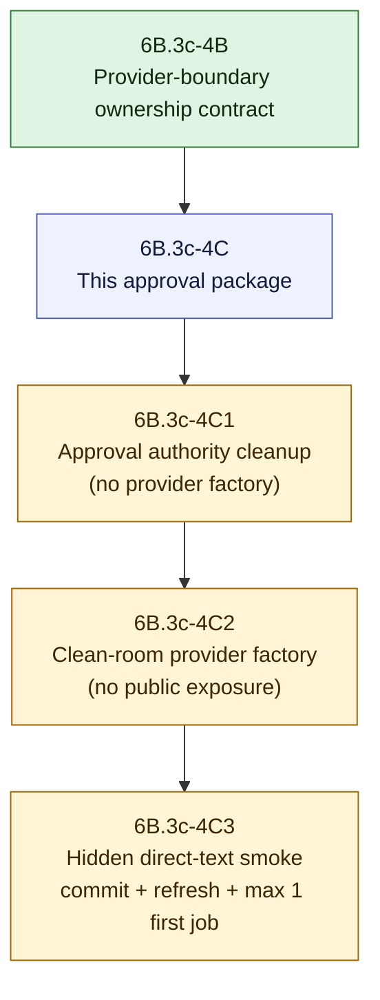

# V2 Slice 6B.3c-4C Provider Source Wiring Approval Package

**Date:** 2026-05-14
**Status:** 4C1 implemented after deputy-reviewed package tightening; no provider factory or product exposure approved
**Owner role:** Lead Architect / Captain deputy
**Baseline:** `65f640d6` (`docs: clarify v2 runtime gate governance`)
**Checklist version/hash:** `V2-RUNTIME-GATE-CHECKLIST-2026-05-14.1` / `sha256:9029402e8d359ef21a5e92a181e290a9362203acaca1923a98606b63018fec96`

---

## 1. Purpose

This package defines the next proposed gate after 6B.3c-4B. It does not approve provider factory implementation, product runtime wiring, live jobs, public V2 exposure, cache IO, ACS/direct URL execution, prompt/config changes, approval flips, or V1 cleanup.

The immediate problem is not the provider SDK call itself. The immediate problem is that 6B.3c-4A still uses a scaffolded approval snapshot and the runtime-dispatch owner still builds a private executable task clone for adapter dispatch. Those were acceptable for a Captain-approved internal scaffold, but they must not become the product/live authorization path.

## 2. Debate Consolidation

| Reviewer lens | Verdict | Required outcome |
|---|---|---|
| Implementation advocate | MODIFY | Create a docs-only source-wiring package now. Split later source into approval-authority cleanup first, provider factory wiring second. |
| Clean-room challenger | MODIFY | Do not code yet. Explicitly block V1 provider/model helper reuse, public exposure, cache/provider/prompt approval bypass, and missing approval traceability. |
| LLM/runtime quality and cost reviewer | MODIFY | No live jobs yet. Product/live path must use real approval/config provenance and must not rely on the 4A scaffold snapshot or private executable clone. |
| Implementation architect follow-up | MODIFY | 4C1 is feasible, but the source envelope must include product shell cleanup because `orchestrator.ts` and `pipeline-shell.ts` currently expose scaffold options. |

Consolidated decision:

- The next low-risk action is this docs-only approval package.
- The next possible source work is **6B.3c-4C1 approval-authority cleanup**, not provider factory implementation.
- Provider factory implementation belongs to a later **6B.3c-4C2** gate after 4C1 proves product/live execution cannot use scaffold-only approval.
- Deputy review permits 4C1 source work after this package is tightened to include product shell cleanup and removal/neutralization of the private executable gateway-task clone path.

## 3. Proposed Slice Split

## 4. 6B.3c-4C1 Proposed Source Slice

Purpose: remove the production temptation to use the 4A scaffold as real approval authority.

This slice should make direct-text runtime dispatch fail closed unless the real shipped gateway task is executable through approved prompt/model/cache policy. It should keep tests able to exercise internal owners without giving product callers a synthetic approval path.

Allowed source envelope, pending deputy approval:

- `apps/web/src/lib/analyzer-v2/claim-understanding/runtime-stage.ts`
- `apps/web/src/lib/analyzer-v2/claim-understanding/runtime-dispatch.ts`
- `apps/web/src/lib/analyzer-v2/orchestrator.ts`
- `apps/web/src/lib/analyzer-v2/pipeline-shell.ts`
- `apps/web/test/unit/lib/analyzer-v2/claim-understanding/runtime-stage.test.ts`
- `apps/web/test/unit/lib/analyzer-v2/claim-understanding/runtime-dispatch.test.ts`
- `apps/web/test/unit/lib/analyzer-v2/pipeline-shell.test.ts`
- `apps/web/test/unit/lib/analyzer-v2/boundary-guard.test.ts`
- documentation and handoff updates

Allowed behavior:

- replace product-path use of the 4A hardcoded approval snapshot with a real gateway-policy approval check;
- remove product shell/orchestrator ability to pass test-only scaffold provider options as the production activation path;
- remove or neutralize private executable gateway-task clone behavior in `runtime-dispatch.ts`;
- require real prompt/model/cache approval metadata before product/live runtime dispatch can execute;
- keep normal V2 shell calls damaged/pre-cutover while the shipped gateway task remains blocked;
- preserve direct-text-only scope;
- keep injected provider callbacks limited to tests/controlled harnesses unless the real gateway task is executable;
- add guards proving scaffold approval constants and executable-task clones cannot authorize product/live dispatch.

Forbidden behavior:

- no provider SDK import or provider factory;
- no import or reuse of `apps/web/src/lib/analyzer/llm.ts`;
- no V1 analyzer imports, V1 prompt/profile/section reuse, or cloned V1 provider helpers;
- no public API/UI/report/export exposure;
- no cache read/write/storage IO;
- no prompt/config source edits;
- no shipped gateway status or approval mutation unless a separate approval package explicitly authorizes it;
- no ACS or direct URL runtime execution;
- no live jobs;
- no V1 cleanup.

Required 4C1 verifier:

- focused runtime-stage and runtime-dispatch tests proving the shipped blocked gateway task cannot execute even with scaffold options and injected provider boundary;
- tests proving any test-only approved fixture is confined to direct owner tests and cannot be passed through product shell/orchestrator paths;
- pipeline-shell tests proving product shell callers cannot pass runtime scaffold options into the orchestrator;
- direct URL and ACS/prepared inputs still fail or defer before prompt/cache/adapter/provider work;
- boundary guard proving product callers cannot reference scaffold option keys or source a synthetic approval snapshot;
- static scan proving no product caller scaffold option pass-through, no private executable gateway-task clone, no `status: "executable"` construction in runtime-dispatch, no V1 analyzer imports, no V1 prompt/profile reuse, no provider SDK imports in Analyzer V2, no cache IO, and no public owner-field leakage;
- `npm -w apps/web run test -- test/unit/lib/analyzer-v2/claim-understanding/runtime-stage.test.ts test/unit/lib/analyzer-v2/claim-understanding/runtime-dispatch.test.ts test/unit/lib/analyzer-v2/pipeline-shell.test.ts test/unit/lib/analyzer-v2/boundary-guard.test.ts`;
- `npm -w apps/web run test -- test/unit/lib/analyzer-v2`;
- `npm -w apps/web run build`;
- `git diff --check`.

## 5. 6B.3c-4C2 Later Provider Factory Gate

Purpose: add a clean-room provider callback factory outside Analyzer V2 after 4C1 removes scaffold-only approval from the product path.

Candidate source envelope for later review, not approved by this package:

- `apps/web/src/lib/analyzer-v2-runtime/claim-understanding-provider-factory.ts`
- `apps/web/test/unit/lib/analyzer-v2-runtime/claim-understanding-provider-factory.test.ts`
- `apps/web/test/unit/lib/analyzer-v2-runtime/claim-understanding-provider-boundary.contract.test.ts`
- `apps/web/test/unit/lib/analyzer-v2/boundary-guard.test.ts`
- narrow runtime-stage/orchestrator shell tests only if product injection is also proposed

Required ownership rules:

- provider SDK imports, if any, live outside `apps/web/src/lib/analyzer-v2/`;
- no import from `apps/web/src/lib/analyzer/`, including `llm.ts`;
- no legacy prompt/profile/type reuse;
- provider/model/config values come from a V2 task-policy/config snapshot, not caller-supplied ad hoc strings;
- telemetry must include provider id, model id, token usage, duration, retry count, schema id, prompt hashes, and config snapshot hash;
- direct text only; ACS and direct URL remain blocked.

Provider factory code is not approved until 4C2 receives separate review and approval.

## 6. Live-Job Plan

No live jobs are meaningful for this package or 4C1.

Live jobs become meaningful only after a committed and runtime-refreshed source slice can produce a real hidden V2 direct-text artifact without scaffold-only approval or scaffold-only provider injection.

First live-job gate after source wiring:

- run only one Captain-defined direct-text input first;
- verify real provider telemetry, prompt/config provenance, no public owner-field leakage, no V1/default-route disturbance, and expected fail-closed behavior for unsupported inputs;
- expand up to the current Captain allowance of 4 only if the first run is clean.

## 7. Approval Traceability Requirement

Any implementing handoff for 4C1, 4C2, or later source slices must record:

- package path and section;
- checklist version/hash;
- approver or approval body;
- approval date;
- exact message/artifact pointer;
- implementing commit;
- source envelope;
- verifier results;
- live job IDs, only if live jobs are approved and run.

Missing approval pointer means not approved.

## 8. 4C1 Implementation Record

Implementation status: complete at `a3edff1c`.

Approval pointer:

- package path and section: this document, Section 4;
- checklist version/hash: `V2-RUNTIME-GATE-CHECKLIST-2026-05-14.1` / `sha256:9029402e8d359ef21a5e92a181e290a9362203acaca1923a98606b63018fec96`;
- approval body/date: deputy-team review in the current Codex thread on 2026-05-14;
- approval outcome: LLM/runtime reviewer `APPROVE`, clean-room/security challenger `APPROVE`, implementation architect `MODIFY`; consolidated approval allowed 4C1 only after adding `orchestrator.ts`, `pipeline-shell.ts`, and `pipeline-shell.test.ts` to the envelope and requiring removal/neutralization of the private executable gateway-task clone;
- Captain policy context: continue if clear and low risk; use deputy-team decision making for decision points unless high risk or no consent.

Implemented behavior:

- `runtime-stage.ts` no longer contains a hardcoded Captain/scaffold approval snapshot; it derives a runtime approval snapshot only from real approved prompt/model/cache gateway-policy metadata.
- `runtime-dispatch.ts` blocks on the real shipped gateway task before prompt rendering, no-store cache-decision construction, adapter invocation, or provider callback use.
- `runtime-dispatch.ts` no longer creates a private `status: "executable"` gateway-task clone.
- `orchestrator.ts` and `pipeline-shell.ts` no longer expose scaffold provider option pass-through as a product activation path.
- The public V2 shell still returns the damaged pre-cutover envelope; no API/UI/report/export surface changed.

Verification:

- `npm -w apps/web run test -- test/unit/lib/analyzer-v2/claim-understanding/runtime-stage.test.ts test/unit/lib/analyzer-v2/claim-understanding/runtime-dispatch.test.ts test/unit/lib/analyzer-v2/pipeline-shell.test.ts test/unit/lib/analyzer-v2/boundary-guard.test.ts` passed 4 files / 55 tests.
- `npm -w apps/web run test -- test/unit/lib/analyzer-v2` passed 19 files / 156 tests.
- `npm -w apps/web run build` passed; postbuild reseed reported `Configs: 0 changed, 4 unchanged | Prompts: 0 changed, 3 unchanged`.
- Static scans found no scaffold approval id, no private executable clone helper, no `status: "executable"` construction in runtime dispatch/stage, and no scaffold option pass-through in product callers.
- `git diff --check` passed.

4C2 remains the next gate if provider factory work is proposed. It still requires separate deputy review and approval.

## 9. Recommended Review Request

Recommended deputy-review prompt:

> Review `Docs/WIP/2026-05-14_V2_Slice_6B3c4C_Provider_Source_Wiring_Approval_Package.md`. Decide whether 6B.3c-4C1 may proceed as source code limited to approval-authority cleanup. Keep provider factory implementation, provider SDK imports, public API/UI/report/export exposure, cache IO, ACS/direct URL execution, live jobs, approval/status flips, prompt/config changes, and V1 cleanup out of 4C1. Confirm whether the 4C1 verifier is sufficient to prove that product/live dispatch cannot rely on the 4A scaffold approval snapshot or private executable gateway-task clone.

Expected reviewer output:

- verdict: APPROVE / MODIFY / BLOCK;
- blockers;
- required changes before 4C1 source approval;
- whether Captain confirmation is required;
- whether any live job is meaningful before 4C2.
