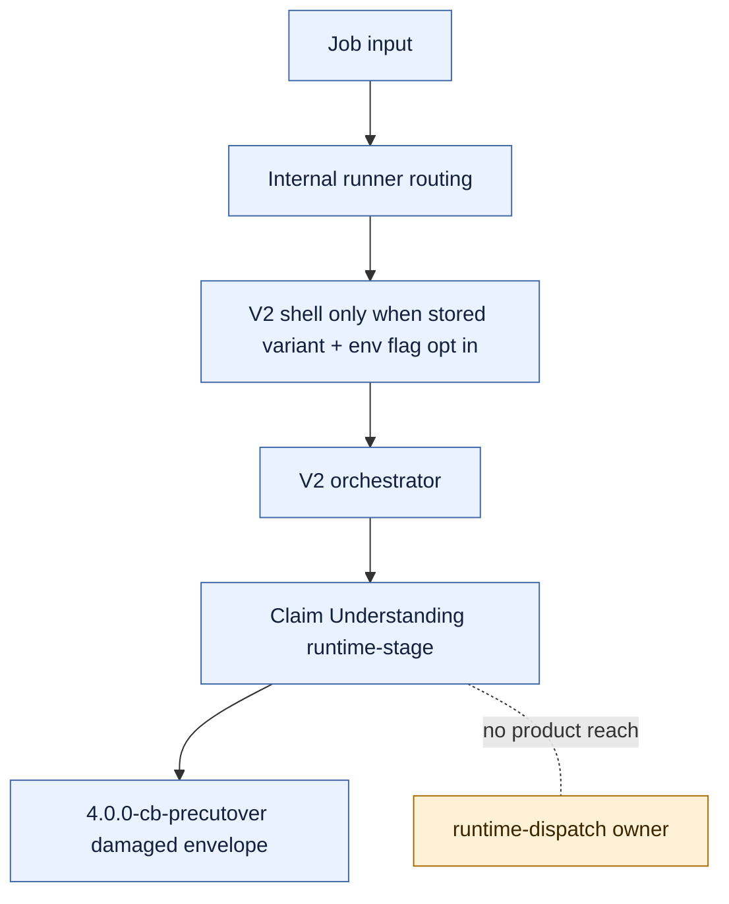

# V2 Slice 6B.3c-4 Product Runtime Dispatch Wiring Gate

**Date:** 2026-05-14
**Status:** Docs-only gate complete; product wiring is blocked until this package receives deputy review approval
**Owner role:** Lead Architect / Captain deputy
**Baseline:** `d615b699` (`feat: add v2 runtime dispatch owner`)

---

## 1. Decision

Post-3B3 reviewer outcome:

| Reviewer lens | Verdict | Consolidated finding |
|---|---|---|
| Senior architect / LLM runtime | MODIFY | 3B3 is internally sound, but product wiring crosses unresolved approval-authority, provider-boundary, API/UI, rollback, and live-job gates. |
| Clean-room code review | BLOCK | Runtime dispatch is still intentionally isolated; product paths must not reach it until a reviewed wiring package defines exact authority and leak guards. |

Consolidated decision:

- Do not implement product runtime wiring now.
- Do not change API/UI/report/export behavior now.
- Do not run live jobs now.
- Create this docs-only wiring gate so the next source slice cannot accidentally turn the internal owner into product behavior.

No Captain escalation is needed because the reviewer team reached consent on a safer docs-only step.

## 2. Current Runtime Topology

As of `d615b699`, `runtime-dispatch.ts` can execute only when called directly with a satisfied direct-text readiness contract and an injected provider callback. Product paths cannot reach it.

Current product behavior:

- V1 remains default.
- V2 shell runs only when both the stored job variant and `FH_ANALYZER_V2_SHELL=enabled` opt in.
- Direct input still reaches `runtime-stage.ts`, not `runtime-dispatch.ts`, and returns the pre-cutover damaged envelope.
- Direct URL and ACS execution are not product-wired.
- No public result field exposes Claim Understanding owner state, prompt text, cache key material, provider telemetry, or side effects.

## 3. Required Decisions Before Source Wiring

Any later source package must answer these items explicitly before files are edited.

| Topic | Required decision |
|---|---|
| Runtime approval authority | Define the product-owned source of `runtime_approval_snapshot`. The caller must not supply approval snapshots. Test/deputy snapshots cannot authorize product execution. |
| Gateway status | Shipped gateway policy must remain blocked unless a separate approval package authorizes a status/approval change. Executable clones may not escape the runtime owner. |
| Execution scope | First wiring, if approved, is direct text only. ACS and direct URL remain unsupported until separate ownership and hash/body-resolution contracts are approved. |
| API acceptance | Decide whether `claimboundary-v2` remains hidden/env-gated, admin-only, or accepted by public API. Default recommendation: hidden/env-gated until full Understand -> Research -> Verdict exists. |
| Provider boundary | Analyzer V2 must not import provider SDKs. A provider callback factory, if needed, must live outside Analyzer V2 and inject a callback across a narrow boundary. |
| Public behavior | No UI/report/export owner telemetry leakage. Partial Claim Understanding must not appear as a completed product analysis. |
| Runner integration | Define the exact path from job input -> ingress -> frame -> readiness -> runtime-dispatch, including fail-closed behavior for URL and ACS inputs. |
| Rollback | Preserve an env kill switch. Disabled V2 requests fall back to V1 only under current documented fallback semantics; enabled-but-unsupported V2 modes must fail closed or be rejected explicitly, not silently converted. |
| Failure classification | Provider failure, invalid schema, prompt-render failure, invalid telemetry, and unsupported input must map to clear internal state without public owner-field leakage. |
| Live jobs | Commit first, refresh runtime/config/prompt state, then run only Captain-defined inputs under an approved spend gate. |
| V1 removal | Do not combine wiring with V1 removal. V1 cleanup belongs after V2 owns and verifies full Understand -> Research -> Verdict plus cutover/rollback. |

## 4. Recommended Later Source Shape

If deputy review later approves source work, start with a minimal `6B.3c-4A` package:

- direct text only;
- env-gated/admin-internal only;
- no public UI selector change;
- no public report/schema expansion;
- no ACS/direct URL execution;
- no cache read/write;
- no provider SDK imports in Analyzer V2;
- no V1 removal;
- no live jobs until committed and refreshed.

Candidate source envelope for review, not yet approved:

- `apps/web/src/lib/analyzer-v2/claim-understanding/runtime-stage.ts`
- `apps/web/src/lib/analyzer-v2/orchestrator.ts`
- `apps/web/src/lib/analyzer-v2/pipeline-shell.ts`
- `apps/web/src/lib/analyzer-v2/runner-ingress.ts` only if input gating needs adjustment
- `apps/web/test/unit/lib/analyzer-v2/claim-understanding/runtime-stage.test.ts`
- `apps/web/test/unit/lib/analyzer-v2/pipeline-shell.test.ts`
- `apps/web/test/unit/lib/analyzer-v2/boundary-guard.test.ts`
- `apps/web/test/unit/lib/internal-runner-v2-routing.test.ts`

Provider callback factory placement is intentionally not approved here. It must be proposed with the source package and must stay outside Analyzer V2 internals.

## 5. Required Verifiers For A Future Wiring Source Package

Minimum verifier set for any future source candidate:

- focused runtime-stage/orchestrator/pipeline-shell tests;
- V2 internal runner routing tests;
- public-result leak guard for owner state, prompt text, provider telemetry, cache decision/key material, and side effects;
- static reachability guard proving public/app/report/export surfaces do not import dispatch-capable internals;
- static scan proving Analyzer V2 imports no V1 analyzer code, no V1 prompt/profile/section, no provider SDK, no mocks/fixtures in production source, and no production `executionApproved: true`;
- direct-text success test with a Captain-defined input;
- direct URL and ACS blocked/deferred tests before prompt/cache/adapter/provider work;
- provider failure, invalid telemetry, invalid schema, and prompt-render failure tests;
- `npm -w apps/web run test -- test/unit/lib/analyzer-v2`;
- `npm -w apps/web run test -- test/unit/lib/internal-runner-v2-routing.test.ts`;
- `npm -w apps/web run build`;
- `git diff --check`.

No live validation jobs belong in the wiring source package unless a separate commit-first live-job gate approves them.

## 6. Captain Escalation Conditions

Escalate to Captain before any of these changes:

- public UI mode changes;
- accepting `claimboundary-v2` on public API;
- changing default pipeline behavior;
- exposing partial V2 results;
- enabling ACS or direct URL execution;
- adding provider SDK imports or provider callback factories without a reviewed boundary;
- enabling cache read/write;
- flipping prompt/model/cache approvals or shipped gateway status;
- running live jobs;
- removing V1 code.

## 7. Reviewer Prompt

Review `Docs/WIP/2026-05-14_V2_Slice_6B3c4_Product_Runtime_Dispatch_Wiring_Gate.md` after 3B3. Decide whether the next source package may wire internal direct-text Claim Understanding into product runtime. Keep V1 default, no public UI/report/export leakage, no ACS/direct URL execution, no provider SDK imports in Analyzer V2, no cache read/write, no approval/status mutation, no live jobs, and no V1 removal unless explicitly approved.

## 8. Gate Review Outcome

Follow-up deputy review of this gate returned split results:

| Reviewer lens | Verdict | Consolidated interpretation |
|---|---|---|
| Senior architect / LLM runtime | MODIFY | A later `6B.3c-4A` source package could be considered only as an env-gated, internal direct-text wiring scaffold with injected provider callback and fail-closed missing-provider behavior. |
| Clean-room product/runtime challenger | BLOCK | No product/runtime wiring is low enough risk yet; only guard/test hardening is acceptable until approval authority, API acceptance, provider ownership, and partial-result behavior are settled. |

Consolidated decision:

- There is no deputy-team consent to start source wiring.
- Do not wire product paths to `executeClaimUnderstandingRuntimeDispatch(...)`.
- Do not narrow the product reachability guards yet.
- The only low-risk implementation work before a new source package is guard/test hardening that preserves the current blocked topology.

Additional blockers surfaced by review:

- Product-owned runtime approval authority is still undefined.
- Provider callback factory ownership is still undefined; Analyzer V2 must still import no provider SDK.
- API acceptance mode for `claimboundary-v2` is still not approved beyond the existing hidden/env-gated shell.
- Partial Claim Understanding cannot be exposed as a product result.
- The current product runtime path reaches gateway policy, and gateway policy imports cache-governance metadata. Any future "no transitive cache-governance reachability" requirement must either split policy metadata from cache-governance or receive an explicit reviewed exception. Do not add a failing guard without resolving this architecture point.
- Live jobs remain blocked.

Next approved action: write or review a separate source package, or add guard/test hardening only if it preserves the current no-product-reach state.
