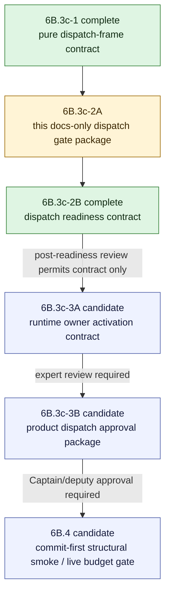

# V2 Slice 6B.3c-2 Product Runtime Dispatch Review Package

**Date:** 2026-05-14
**Status:** Product runtime dispatch remains blocked; superseded for post-3B3 wiring by `Docs/WIP/2026-05-14_V2_Slice_6B3c4_Product_Runtime_Dispatch_Wiring_Gate.md`
**Owner role:** Lead Architect / Captain deputy
**Current stable implementation:** 6B.3c-1 complete at `8a663d3f`; 6B.3c-2B dispatch-readiness contract complete at `6a9d7143`; 6B.3c-3B3 internal runtime-dispatch owner complete at `d615b699`

---

## 1. Debate Consolidation

After 6B.3c-1, the deputy team reviewed whether the next step could be product runtime dispatch.

| Reviewer lens | Verdict | Consolidated finding |
|---|---|---|
| Claude Opus-style LLM/runtime safety | BLOCK | Product runtime dispatch would cross unresolved prompt rendering, adapter reachability, cache/provenance, approval source, provider boundary, and URL-resolution ownership. |
| Senior Developer | MODIFY | Source code is not low risk yet. Draft a runtime-dispatch gate package first; first package review narrowed any later source candidate to contract-only. |
| Code Reviewer / clean-room | MODIFY | Source is acceptable only for another non-executable/internal contract or guard slice; product dispatch needs review/debate first. |
| Gemini-style Challenger | BLOCK | 6B.3c-1 proves frame readiness, not dispatch readiness. Removing the product-path adapter-import ban before a replacement guard is a sequencing error. |

Consolidated decision:

- Do not implement product runtime dispatch now.
- Do not import the model adapter from product execution paths now.
- Do not render prompts, create provider callbacks, import provider SDKs, construct cache IO, flip approvals, expose public diagnostics, run live jobs, or treat URL strings as body text.
- The next low-risk action is this docs-only gate package.
- No Captain escalation is needed because the deputy team reached consent on a safer path.

## 1.1 Package Review Consolidation

Review of the first draft returned `MODIFY`.

| Reviewer lens | Verdict | Required revision |
|---|---|---|
| Claude Opus-style LLM/runtime safety | MODIFY | Keep the package docs-only; make any source candidate contract-only; add multilingual/input-neutral preservation; defer cache-decision construction unless complete provenance and no-read/no-write behavior are proven. |
| Senior Developer | MODIFY | A later source slice may be feasible only as non-executable and test-only; product paths must not import it, URL stays blocked by the frame, and provider calls must remain injected. |
| Code Reviewer / clean-room | MODIFY | Add mechanical guard requirements for adapter-import replacement, mock/fixture leakage, approval mutation, provider/cache side effects, and public-surface leakage. |
| Gemini-style Challenger | MODIFY | The first draft's mock-dispatch candidate was too permissive; next source must be contract-only, not prompt rendering, cache-decision construction, adapter call, or provider callback. |

Revised decision:

- This package approves no source code.
- A later package may propose a **contract-only** source slice.
- Prompt rendering, cache-decision construction, model-adapter calls, provider callbacks, and provider SDKs remain deferred until that contract passes review.

## 1.2 Post-Readiness Contract Review Consolidation

After `6a9d7143`, the deputy team reviewed whether product runtime dispatch could start.

| Reviewer lens | Verdict | Consolidated finding |
|---|---|---|
| LLM/runtime safety | BLOCK | The readiness contract is inert but does not define a real runtime approval source, prompt rendering owner, cache no-read/no-write construction, or provider boundary. |
| Senior Developer / implementability | MODIFY | Product dispatch is not the next low-risk slice. A smaller non-executable runtime-dispatch owner/activation contract is feasible. |
| Code Reviewer / clean-room | BLOCK | Direct-import guards are not enough for runtime dispatch. Add transitive reachability and production-source guard coverage before product wiring. |
| Challenger | BLOCK | Product dispatch would remove the current safety guard before a replacement guard and public-leak contract are proven. |

Consolidated decision:

- Do not implement product runtime dispatch after 6B.3c-2B.
- Tighten readiness so review-package snapshots cannot satisfy runtime readiness.
- Add only a non-executable `runtime-dispatch.ts` owner/activation contract.
- Strengthen static guards for transitive dispatch reachability, provider SDK imports, nonliteral dynamic imports, and executable gateway-status construction.
- Continue to block prompt rendering, cache-decision construction, model-adapter calls, provider callbacks/SDKs, approval flips, public surfaces, live jobs, direct URL dispatch, and V1 reuse.

## 2. Non-Goals

This package does not approve:

- executable `claim_understanding_gate1` status;
- prompt/model/cache approval flips;
- product-path model-adapter imports;
- provider callbacks or provider SDK imports;
- cache read/write;
- file seeding for `claimboundary-v2`;
- public/API/UI/report/export diagnostics;
- runtime LLM calls;
- live jobs or validation batches;
- V1 analyzer, V1 prompt, or V1 type reuse.

## 3. Blockers Before Product Runtime Dispatch

Product dispatch remains blocked until a reviewed package resolves all of these:

1. **Executable approval source** - how `claim_understanding_gate1` becomes executable without mutating shipped registry constants.
2. **Dispatch owner** - the only source file allowed to coordinate prompt rendering, no-store cache decision construction, adapter call, and provider callback creation.
3. **Adapter-import replacement guard** - the guard that replaces the current product-path `model-adapter` import ban.
4. **Provider boundary** - provider callback ownership, provider SDK import ownership, mock exclusion, timeout/cancellation, budget handling, and telemetry ownership.
5. **Prompt/config/cache provenance** - real prompt hash, config snapshot hash, input identity, current-date bucket, ACS hash, input-grounding seed hash, model/provider metadata, retry count, timing, and token fields.
6. **Cache posture** - first runtime dispatch should be no-read/no-write unless a later review explicitly approves cache IO with complete dimensions.
7. **URL handling** - direct URL input remains blocked unless a reviewed resolver supplies body text and canonical identity material.
8. **Public leakage** - Claim Understanding state, prompt text, provider telemetry, cache key material, side effects, and internal diagnostics stay out of `resultJson`, API, UI, report, export, and compatibility views.
9. **Clean-room boundary** - no V1 analyzer imports, V1 prompt/profile/section reuse, V1 type reuse, mocks, or fixtures in product paths.

## 4. Proposed Slice Split

6B.3c-2B is complete as an inert contract, and 6B.3c-3A is complete at `a79cba3f` as an inert runtime owner/activation contract. The broader 6B.3c-3B owner-implementation package was reviewed and narrowed to 6B.3c-3B1 preflight/provenance binding and guard hardening only. Product dispatch remains blocked.

## 5. Candidate 6B.3c-2B Contract-Only Envelope For Later Review

A later package may propose this source envelope. This package does not approve it.

Candidate source envelope for later review:

- `apps/web/src/lib/analyzer-v2/claim-understanding/dispatch-readiness-contract.ts`
- `apps/web/test/unit/lib/analyzer-v2/claim-understanding/dispatch-readiness-contract.test.ts`
- `apps/web/test/unit/lib/analyzer-v2/boundary-guard.test.ts`

This candidate file is not a runtime owner. It may contain only inert types, pure structural guards, and negative reachability contract checks.

Candidate allowed behavior:

- define contract types for the future dispatch owner in one V2-owned file;
- accept only a ready `ClaimUnderstandingDispatchFrame` produced by 6B.3c-1;
- define an approval-snapshot shape without making shipped tasks executable;
- define provenance packet types with complete non-placeholder fields;
- define fail-closed reason types for blocked approval, unresolved URL, incomplete provenance, and forbidden side-effect reachability;
- prove product paths still cannot reach dispatch-capable code;
- prove direct URL remains blocked at the dispatch-frame boundary.

Candidate forbidden behavior:

- no prompt rendering;
- no prompt/config/input/cache hash construction;
- no cache-decision construction;
- no model-adapter import or adapter call;
- no provider callback;
- no provider SDK import or built-in provider callsite;
- no production approval/status mutation;
- no product orchestrator dispatch wiring;
- no `claimboundary-v2` file seeding;
- no cache IO;
- no public/API/UI/report/export surface;
- no live jobs;
- no direct URL dispatch without resolved body ownership;
- no V1 analyzer, prompt, profile, section, type, mock, or fixture reuse.

## 5.1 6B.3c-3A Runtime Owner / Activation Contract Envelope

The post-readiness review permits this next source envelope only:

- `apps/web/src/lib/analyzer-v2/claim-understanding/runtime-dispatch.ts`
- `apps/web/test/unit/lib/analyzer-v2/claim-understanding/runtime-dispatch.test.ts`
- `apps/web/src/lib/analyzer-v2/claim-understanding/dispatch-readiness-contract.ts`
- `apps/web/test/unit/lib/analyzer-v2/claim-understanding/dispatch-readiness-contract.test.ts`
- `apps/web/test/unit/lib/analyzer-v2/boundary-guard.test.ts`

Allowed behavior:

- define a single future runtime owner identity without making it reachable from product paths;
- require `runtime_approval_snapshot` as the approval source for satisfied readiness;
- block `review_packet_snapshot` from satisfying runtime readiness;
- require approval snapshot identity metadata;
- define no-read/no-write cache posture as an inert activation contract, without constructing a cache decision or importing cache IO;
- require prompt rendering, provider callback creation, provider SDK imports, adapter calls, product wiring, public surfaces, and direct URL dispatch to remain deferred;
- add static guards for transitive dispatch reachability, provider SDK imports, nonliteral dynamic imports, executable gateway-status construction, and runtime-owner side-effect imports.

Forbidden behavior:

- no `orchestrator.ts`, `runtime-stage.ts`, `pipeline-shell.ts`, `runner-ingress.ts`, or `index.ts` product wiring;
- no prompt rendering;
- no prompt/config/input/cache hash construction beyond validating externally supplied non-placeholder fields;
- no cache-decision construction or cache IO;
- no model-adapter import or adapter call;
- no provider callback or provider SDK import;
- no production approval/status mutation;
- no public/API/UI/report/export surface;
- no live jobs;
- no direct URL dispatch;
- no V1 analyzer, prompt, profile, section, type, mock, or fixture reuse.

## 6. Protected Product Paths

Until a later reviewed gate replaces these rules:

- `apps/web/src/lib/analyzer-v2/orchestrator.ts` must not import or export `dispatch-readiness-contract.ts`, `runtime-dispatch.ts`, prompt loader, model adapter, cache-governance builders, provider SDKs, or any dispatch-capable path.
- `apps/web/src/lib/analyzer-v2/pipeline-shell.ts` must not import prompt/model/cache/provider code.
- `apps/web/src/lib/analyzer-v2/runner-ingress.ts` must stay a one-way structural adapter and must not construct prompt/cache/provider state.
- `apps/web/src/lib/analyzer-v2/claim-understanding/runtime-stage.ts` must remain no-dispatch unless a later gate explicitly replaces it.
- `apps/web/src/lib/analyzer-v2/index.ts` must not export `dispatch-readiness-contract.ts`, `runtime-dispatch.ts`, or dispatch-capable internals.

## 7. Approval Source Proposal For Review

Preferred direction:

- Keep shipped `ANALYZER_V2_GATEWAY_TASKS` blocked.
- Do not mutate shipped registry constants at runtime.
- Future executable status should be derived from a runtime approval snapshot that combines prompt, model, and cache approvals.
- Tests may use cloned synthetic executable task objects only after the production approval-snapshot contract is structurally defined enough that tests cannot normalize the wrong design.
- Production activation requires separate Captain/deputy approval and UCM/admin visibility before any source path can execute real model calls.

Deferred decision:

- UCM-backed runtime approval snapshots are deferred before any executable path. A later package must decide whether the approval snapshot belongs in the contract-only slice or the product-dispatch approval package.

## 8. Prompt, Config, And Cache Provenance Packet

Future dispatch must not use placeholders. A candidate contract must define ownership and verifier coverage for these fields before any prompt rendering, cache-decision construction, adapter call, or provider callback:

| Field | Required owner before dispatch |
|---|---|
| `promptProfile` | V2 prompt loader / UCM active profile |
| `promptSectionId` | gateway task policy |
| `promptContentHash` | V2 prompt loader after rendering source is approved |
| `renderedPromptHash` | dispatch owner after exact variables are rendered |
| `configSnapshotHash` | explicit model/config snapshot owner |
| `modelTask` | gateway model policy |
| `provider` / `modelName` | provider dispatch boundary |
| `temperature` / token budget / timeout | model task policy |
| `outputSchemaVersion` | Claim Understanding schema contract |
| `resultSchemaVersion` | `ClaimUnderstandingResult` schema contract |
| `inputSource` | 6B.3c-1 dispatch frame |
| `inputIdentityHash` | input-grounding owner; direct URL blocked until resolved body exists |
| `acsSnapshotHash` | ACS prepared-seed owner |
| `inputGroundingSeedHash` | input-grounding seed owner |
| `currentDateBucket` | run-context owner |
| `cacheDecision` | V2 cache-governance owner; first reviewed dispatch should be no-read/no-write |

Cache-decision construction remains deferred unless a later package proves complete non-placeholder provenance and enforceable no-read/no-write behavior.

## 9. URL Rule

Direct URL input remains blocked for Claim Understanding dispatch.

Allowed later only after separate review:

- a resolver supplies `resolvedInputText`;
- identity material hashes the resolved body/source identity, not the URL string alone;
- cache provenance distinguishes submitted URL, resolved body, source identity, and retrieval date;
- tests prove unresolved URLs cannot reach prompt rendering or cache identity construction.

ACS-backed URL snapshots may continue only when they carry resolved text plus canonical V2 ACS and input-grounding hashes.

## 10. Multilingual And Input-Neutral Guard

Future dispatch contracts must preserve the original user/submitted text exactly. They must not translate, normalize, lowercase, rewrite, strip diacritics, or language-detect in any way that changes the analysis input semantics.

`analysisInput` and `resolvedInputText` from the 6B.3c-1 frame are the only allowed text inputs for later Claim Understanding dispatch contracts.

## 11. Candidate Verifier Matrix

Before any source beyond this docs package is accepted, reviewers should require:

| Area | Required verifier |
|---|---|
| Product reachability | `orchestrator.ts`, `pipeline-shell.ts`, `runner-ingress.ts`, `runtime-stage.ts`, and `index.ts` cannot import or export dispatch-capable prompt/model/cache/provider code |
| Dispatch ownership | only a later-reviewed owner module may import prompt loader, model adapter, and cache-governance builders; this package approves no such import |
| Provider boundary | no provider SDK import anywhere in Analyzer V2 product source |
| Mock/fixture leakage | product source under `apps/web/src/lib/analyzer-v2/**` cannot import `/test/`, `/fixtures/`, `*.test.*`, mock helpers, or synthetic approved task fixtures |
| Approval state | shipped gateway task remains blocked; product code cannot assign or mutate task status; synthetic executable tasks are cloned test data only |
| Cache posture | no cache IO; no cache-decision construction until complete dimensions and no-read/no-write semantics are specified as an enforceable contract |
| URL safety | direct unresolved URL fails before prompt rendering, input identity construction, cache-decision construction, or provider callback creation |
| Public leakage | `resultJson`, API/internal runner output, UI/report/export compatibility surfaces, and report schema fixtures remain free of Claim Understanding internals, prompt text, provider telemetry, cache material, side-effect fields, and diagnostics |
| Clean-room | no V1 analyzer imports, V1 prompt/profile/section reuse, V1 type reuse, mocks, or fixtures in product paths; any new candidate path is included in V1 import, legacy prompt literal, V1 identifier, mock/fixture, provider SDK, and public-export scans |
| Regression | full Analyzer V2 unit slice and `npm -w apps/web run build` |

## 12. Reviewer Questions

1. Is a contract-only `dispatch-readiness-contract.ts` boundary useful now, or should dispatch ownership remain outside source until UCM approval snapshots are defined?
2. What exact guard replaces the current product-path model-adapter import ban?
3. Should the next source slice define only approval/provenance packet types and negative reachability guards?
4. Should cache-decision construction remain deferred until complete dimensions and no-read/no-write semantics are enforceable?
5. Is direct URL resolution a prerequisite before any direct-input dispatch, or can text-only dispatch proceed while URL stays blocked?
6. What minimum proof is required before asking Captain to approve a real model call or live job?

## 13. Short Reviewer Prompt

Review `Docs/WIP/2026-05-14_V2_Slice_6B3c_Product_Runtime_Dispatch_Review_Package.md` after 6B.3c-1. Decide whether a later 6B.3c-2 source slice may be contract-only, with no prompt rendering, no cache-decision construction, no model-adapter call, no provider callback, no provider SDK, no cache IO, no approval flip, no public surface, no direct URL body assumption, no live job, and no V1 reuse.
