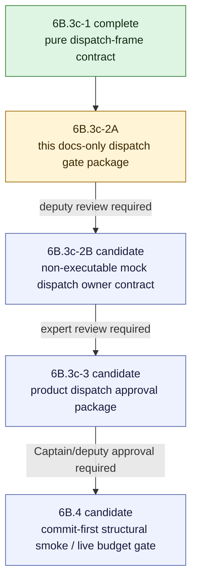

# V2 Slice 6B.3c-2 Product Runtime Dispatch Review Package

**Date:** 2026-05-14
**Status:** Draft for deputy review; no source code approved
**Owner role:** Lead Architect / Captain deputy
**Current stable implementation:** 6B.3c-1 complete at `8a663d3f`; docs current through `b02fe12f`

---

## 1. Debate Consolidation

After 6B.3c-1, the deputy team reviewed whether the next step could be product runtime dispatch.

| Reviewer lens | Verdict | Consolidated finding |
|---|---|---|
| Claude Opus-style LLM/runtime safety | BLOCK | Product runtime dispatch would cross unresolved prompt rendering, adapter reachability, cache/provenance, approval source, provider boundary, and URL-resolution ownership. |
| Senior Developer | MODIFY | Source code is not low risk yet. Draft a runtime-dispatch gate package first; if later approved, the smallest code slice should be mock-only and non-executable. |
| Code Reviewer / clean-room | MODIFY | Source is acceptable only for another non-executable/internal contract or guard slice; product dispatch needs review/debate first. |
| Gemini-style Challenger | BLOCK | 6B.3c-1 proves frame readiness, not dispatch readiness. Removing the product-path adapter-import ban before a replacement guard is a sequencing error. |

Consolidated decision:

- Do not implement product runtime dispatch now.
- Do not import the model adapter from product execution paths now.
- Do not render prompts, create provider callbacks, import provider SDKs, construct cache IO, flip approvals, expose public diagnostics, run live jobs, or treat URL strings as body text.
- The next low-risk action is this docs-only gate package.
- No Captain escalation is needed because the deputy team reached consent on a safer path.

## 2. Non-Goals

This package does not approve:

- executable `claim_understanding_gate1` status;
- prompt/model/cache approval flips;
- product-path model-adapter imports;
- provider callbacks or provider SDK imports;
- cache read/write;
- file seeding for `claimboundary-v2`;
- public/API/UI/report/export diagnostics;
- runtime LLM calls;
- live jobs or validation batches;
- V1 analyzer, V1 prompt, or V1 type reuse.

## 3. Blockers Before Product Runtime Dispatch

Product dispatch remains blocked until a reviewed package resolves all of these:

1. **Executable approval source** - how `claim_understanding_gate1` becomes executable without mutating shipped registry constants.
2. **Dispatch owner** - the only source file allowed to coordinate prompt rendering, no-store cache decision construction, adapter call, and provider callback creation.
3. **Adapter-import replacement guard** - the guard that replaces the current product-path `model-adapter` import ban.
4. **Provider boundary** - provider callback ownership, provider SDK import ownership, mock exclusion, timeout/cancellation, budget handling, and telemetry ownership.
5. **Prompt/config/cache provenance** - real prompt hash, config snapshot hash, input identity, current-date bucket, ACS hash, input-grounding seed hash, model/provider metadata, retry count, timing, and token fields.
6. **Cache posture** - first runtime dispatch should be no-read/no-write unless a later review explicitly approves cache IO with complete dimensions.
7. **URL handling** - direct URL input remains blocked unless a reviewed resolver supplies body text and canonical identity material.
8. **Public leakage** - Claim Understanding state, prompt text, provider telemetry, cache key material, side effects, and internal diagnostics stay out of `resultJson`, API, UI, report, export, and compatibility views.
9. **Clean-room boundary** - no V1 analyzer imports, V1 prompt/profile/section reuse, V1 type reuse, mocks, or fixtures in product paths.

## 4. Proposed Slice Split

Only 6B.3c-2A is in scope for this commit. 6B.3c-2B and later slices are candidates for review, not approval.

## 5. Candidate 6B.3c-2B Source Envelope For Review

If deputies approve code after reviewing this package, the smallest candidate implementation is a non-executable mock dispatch owner contract.

Candidate source envelope:

- `apps/web/src/lib/analyzer-v2/claim-understanding/runtime-dispatch.ts`
- `apps/web/test/unit/lib/analyzer-v2/claim-understanding/runtime-dispatch.test.ts`
- `apps/web/test/unit/lib/analyzer-v2/boundary-guard.test.ts`

Candidate allowed behavior:

- own the future dispatch sequence in one V2-owned file;
- accept a `ClaimUnderstandingDispatchFrame` produced by 6B.3c-1;
- require an explicit injected/synthetic executable task in tests only;
- render the already approved V2 prompt only under synthetic test approval;
- build a no-read/no-write cache decision only under synthetic test approval and with complete non-placeholder dimensions;
- call the existing V2 model adapter only with an injected mock provider callback in tests;
- return internal-only accepted/blocked/damaged Claim Understanding results;
- prove product paths still cannot dispatch.

Candidate forbidden behavior:

- no provider SDK import or built-in provider callsite;
- no production approval/status mutation;
- no product orchestrator dispatch wiring;
- no `claimboundary-v2` file seeding;
- no cache IO;
- no public/API/UI/report/export surface;
- no live jobs;
- no direct URL dispatch without resolved body ownership;
- no V1 analyzer, prompt, profile, section, type, mock, or fixture reuse.

## 6. Protected Product Paths

Until a later reviewed gate replaces these rules:

- `apps/web/src/lib/analyzer-v2/orchestrator.ts` must not import prompt loader, model adapter, cache-governance builders, provider SDKs, or runtime-dispatch code capable of model calls.
- `apps/web/src/lib/analyzer-v2/pipeline-shell.ts` must not import prompt/model/cache/provider code.
- `apps/web/src/lib/analyzer-v2/runner-ingress.ts` must stay a one-way structural adapter and must not construct prompt/cache/provider state.
- `apps/web/src/lib/analyzer-v2/claim-understanding/runtime-stage.ts` must remain no-dispatch unless a later gate explicitly replaces it.
- `apps/web/src/lib/analyzer-v2/index.ts` must not export dispatch-capable internals.

## 7. Approval Source Proposal For Review

Preferred direction:

- Keep shipped `ANALYZER_V2_GATEWAY_TASKS` blocked.
- Do not mutate shipped registry constants at runtime.
- Future executable status should be derived from a runtime approval snapshot that combines prompt, model, and cache approvals.
- Tests may use cloned synthetic executable task objects; product code must not import synthetic approved tasks.
- Production activation requires separate Captain/deputy approval and UCM/admin visibility before any source path can execute real model calls.

Open review question:

- Should the runtime approval snapshot be UCM-backed in 6B.3c-2B, or deferred until the product-dispatch approval package?

## 8. Prompt, Config, And Cache Provenance Packet

Future dispatch must not use placeholders. A candidate dispatch packet must define ownership and verifier coverage for:

| Field | Required owner before dispatch |
|---|---|
| `promptProfile` | V2 prompt loader / UCM active profile |
| `promptSectionId` | gateway task policy |
| `promptContentHash` | V2 prompt loader after rendering source is approved |
| `renderedPromptHash` | dispatch owner after exact variables are rendered |
| `configSnapshotHash` | explicit model/config snapshot owner |
| `modelTask` | gateway model policy |
| `provider` / `modelName` | provider dispatch boundary |
| `temperature` / token budget / timeout | model task policy |
| `outputSchemaVersion` | Claim Understanding schema contract |
| `resultSchemaVersion` | `ClaimUnderstandingResult` schema contract |
| `inputSource` | 6B.3c-1 dispatch frame |
| `inputIdentityHash` | input-grounding owner; direct URL blocked until resolved body exists |
| `acsSnapshotHash` | ACS prepared-seed owner |
| `inputGroundingSeedHash` | input-grounding seed owner |
| `currentDateBucket` | run-context owner |
| `cacheDecision` | V2 cache-governance owner; first reviewed dispatch should be no-read/no-write |

## 9. URL Rule

Direct URL input remains blocked for Claim Understanding dispatch.

Allowed later only after separate review:

- a resolver supplies `resolvedInputText`;
- identity material hashes the resolved body/source identity, not the URL string alone;
- cache provenance distinguishes submitted URL, resolved body, source identity, and retrieval date;
- tests prove unresolved URLs cannot reach prompt rendering or cache identity construction.

ACS-backed URL snapshots may continue only when they carry resolved text plus canonical V2 ACS and input-grounding hashes.

## 10. Candidate Verifier Matrix

Before any source beyond this docs package is accepted, reviewers should require:

| Area | Required verifier |
|---|---|
| Product reachability | `orchestrator.ts`, `pipeline-shell.ts`, `runner-ingress.ts`, and `index.ts` cannot import dispatch-capable prompt/model/cache/provider code |
| Dispatch ownership | only the reviewed owner module may import prompt loader, model adapter, and cache-governance builders |
| Provider boundary | no provider SDK import anywhere in Analyzer V2 product source |
| Approval state | shipped gateway task remains blocked; synthetic executable tasks are test-only |
| Cache posture | no cache IO; no-store/no-read decision only with complete dimensions |
| URL safety | direct unresolved URL fails before prompt rendering and before input/cache identity construction |
| Public leakage | public result/API/UI/report/export surfaces remain free of Claim Understanding internals, prompt text, provider telemetry, and cache key material |
| Clean-room | no V1 analyzer imports, V1 prompt/profile/section reuse, V1 type reuse, mocks, or fixtures in product paths |
| Regression | full Analyzer V2 unit slice and `npm -w apps/web run build` |

## 11. Reviewer Questions

1. Is the proposed `runtime-dispatch.ts` owner the right boundary, or should dispatch ownership remain outside source until UCM approval snapshots are defined?
2. Is mock-only dispatch integration safe before UCM-backed runtime approvals exist?
3. What exact guard replaces the current product-path model-adapter import ban?
4. Should first runtime dispatch build a no-store/no-read cache decision, or should cache decision construction remain deferred?
5. Is direct URL resolution a prerequisite before any direct-input dispatch, or can text-only dispatch proceed while URL stays blocked?
6. What minimum proof is required before asking Captain to approve a real model call or live job?

## 12. Short Reviewer Prompt

Review `Docs/WIP/2026-05-14_V2_Slice_6B3c_Product_Runtime_Dispatch_Review_Package.md` after 6B.3c-1. Decide whether any 6B.3c-2 source code is safe, and if so whether it is limited to a non-executable mock dispatch owner contract. Treat product runtime dispatch, prompt/model/cache approval flips, provider SDK imports, cache IO, public diagnostics, direct URL body assumptions, live jobs, and V1 reuse as blockers unless explicitly justified.
