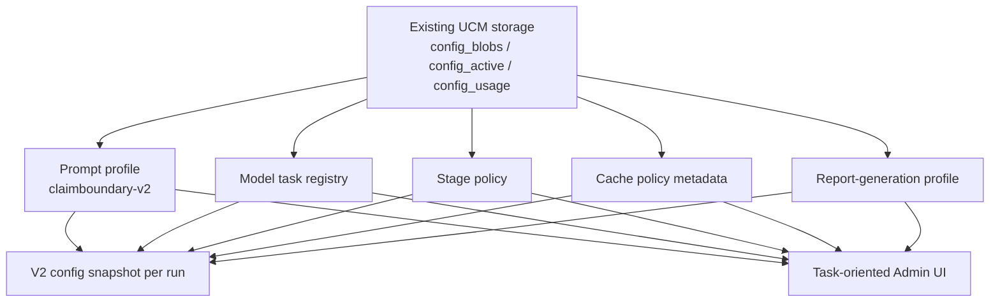

# V2 Slice 6B Prompt And Model Review Package

**Date:** 2026-05-14
**Status:** Slice 6B.2 prompt draft and contract tests complete; Slice 6B.3 gated model execution approval required next
**Owner role:** Lead Architect / Captain deputy
**Workspace:** `C:\DEV\FactHarbor`
**Git branch:** `main`
**Baseline commits:** Slice 6A.5 implementation `724dd9aa`; status checkpoint `2e6fb865`; review package `eef99156`; 6B.1a envelope `24f55d4a`; 6B.1b UCM/profile/model-policy plumbing `2f1b60a4`; 6B.2 prompt draft and contract tests `8a1ef8cd`

---

## 1. Purpose

This package prepares the first prompt/model execution gate for the V2 pipeline: Slice 6B, Claim Understanding and Gate 1.

It originally defined the reviewable contract, approval questions, reviewer prompts, and UCM follow-up plan needed before executable V2 Claim Understanding is added. As of `8a1ef8cd`, it also records the completed non-executable Slice 6B.2 prompt draft and contract-test result.

Captain authorization on 2026-05-14 approved the review package and deputy/LLM Expert review, then approved the 6B.2 prompt-text slice. Prompt profile activation, file seeding, model execution, runtime LLM-backed Claim Understanding, and live jobs still require the separate 6B.3 approval gate defined below.

## 2. Current Stable Baseline

Slice 6A.5 is complete at `724dd9aa`; 6B.1a is complete at `24f55d4a`; 6B.1b is complete at `2f1b60a4`; 6B.2 is complete at `8a1ef8cd`:

- V2 runner ingress carries the full ACS prepared snapshot.
- `PipelineRunContext` no longer injects shell-only placeholder claim IDs.
- Shell placeholder IDs are isolated to the damaged pre-cutover envelope.
- ACS prepared-snapshot migration fails closed on shell-only placeholders and missing selected claims.
- Claim Understanding cache governance supports ACS-backed and direct-input key paths.
- Gateway Claim Understanding output schema now maps to `v2.claim_understanding_result.0`; accepted results carry `v2.claim_contract.0`.
- `apps/web/prompts/claimboundary-v2.prompt.md` now contains the clean-room `V2_CLAIM_UNDERSTANDING_GATE1` section and contract-oriented frontmatter.
- `claimboundary-v2` remains not file-seeded, not activated, and not executable; prompt/model/cache approvals are not flipped.

Verified before this package:

- `npm -w apps/web run test -- test/unit/lib/analyzer-v2`
- `npm -w apps/web run test -- test/unit/lib/internal-runner-v2-routing.test.ts`
- `npm -w apps/web run build`
- clean-room scan for V1 analyzer imports, V1 prompt reuse, and prompt/model execution in Analyzer V2
- `git diff --check`

No live jobs have been used. Approved live-job budget remains 8.

## 3. Proposed Slice 6B Scope

Slice 6B should be split into reviewable sub-slices:

| Sub-slice | Purpose | Executable model call? | Approval required before start |
|---|---|---:|---|
| 6B.0 review package | This document plus reviewer prompts and UCM proposal | No | Captain authorization to prepare package |
| 6B.1a Claim Understanding result envelope | Define success/failure output boundary so no-claim/direct-input failure does not corrupt `ClaimContract` | No | Complete at `24f55d4a` |
| 6B.1b UCM/profile plumbing | Allow V2 prompt profile and task policy metadata without changing analysis behavior | No | Complete at `2f1b60a4` |
| 6B.2 V2 Claim Understanding prompt draft + contract tests | Add new clean-room `V2_CLAIM_UNDERSTANDING_GATE1` prompt section and schema/render tests | No | Complete at `8a1ef8cd`; final Claude Opus LLM Expert review approved |
| 6B.3 gated model execution path | Add runtime LLM call behind V2 pre-cutover gate; no public cutover | Yes, gated | Approval package prepared at `Docs/WIP/2026-05-14_V2_Slice_6B3_Gated_Model_Execution_Approval_Package.md`; implementation still needs deputy/Captain approval |
| 6B.4 non-public structural smoke | Exercise the gated path on fixtures or explicitly approved jobs only | Yes, gated | Commit-first, runtime-refresh, and live-job spend approval if real jobs are used |

The split prevents profile/schema plumbing from smuggling in prompt text or runtime analysis behavior.

## 4. Claim Understanding Contract For Review

Gateway task:

| Field | Target |
|---|---|
| Task id | `claim_understanding_gate1` |
| Owner | `claim_understanding` |
| Prompt profile | `claimboundary-v2` |
| Prompt section | `V2_CLAIM_UNDERSTANDING_GATE1` |
| Model task | `understand` |
| Output schema | `v2.claim_understanding_result.0`; accepted results carry `v2.claim_contract.0` |
| Cache policy | `v2.semantic.claim-understanding` |
| Current status | `blockedUntilPromptApproved` |

Required prompt variables already declared in the gateway policy:

| Variable | Meaning | Required behavior |
|---|---|---|
| `currentDate` | ISO date for temporal anchoring | Must be shown to the model; no unanchored relative-time reasoning |
| `analysisInput` | Direct input/run input payload | Must preserve original wording and detected input type; no paraphrase before analysis |
| `acsSnapshotJson` | Full ACS prepared snapshot or `null` | If complete and selected claims are valid, preserve selected claim wording/finality; do not reselect silently |
| `inputGroundingSeedJson` | Typed seed for resolved text/URL body/current-date/language/hash metadata | May ground claim understanding, but must not make Claim Understanding own full research |

Implemented output contract adjustment after LLM Expert review:

- Keep `ClaimContract` as the successful, usable claim contract only.
- Slice 6B.1a added a `ClaimUnderstandingResult` envelope before prompt text:
  - `status: "accepted"` contains a valid `claimContract`;
  - `status: "blocked"` or `status: "damaged"` contains no `claimContract`;
  - blocked/damaged branches carry typed `ClaimIntegrityEvent` entries, reason codes, and damaged-report guidance;
  - structural fields such as input hashes, current date, and ACS migration facts are gateway-copied, not invented by the LLM.
- The gateway output schema for executable Claim Understanding should become the envelope schema, for example `v2.claim_understanding_result.0`, while accepted outputs still validate the embedded `ClaimContract` against `v2.claim_contract.0`.

Successful `ClaimContract` output contract:

- `ClaimContract.input.selectedAtomicClaimIds` must be explicit.
- `atomicClaims[*].statement` must preserve the claim meaning and be generic by topic/language.
- `Gate1Status` must use valid states: `passed`, `failed`, or `blocked`.
- `ClaimIntegrityEvent` must record ACS consumption, missing selected claims, duplicate selected IDs, prepared-snapshot invalidity, or shell-placeholder leakage.

Blocked/damaged output contract:

- no valid AtomicClaim -> `ClaimUnderstandingResult.status = "damaged"` or `"blocked"`; do not create a dummy claim;
- selected claim missing from prepared snapshot -> blocked/damaged result; do not silently reselect;
- direct input that is not analyzable -> blocked/damaged result with Gate 1 reason;
- shell placeholder leakage -> blocked/damaged result with `shell_placeholder_claim_id` event;
- provider/schema failure after bounded structural retry -> provider warning or damaged result.

ACS rule:

- A valid ACS prepared snapshot with selected claims should normally avoid a new Claim Understanding LLM call. The migration adapter owns the structural conversion.
- Invalid ACS snapshots fail closed or follow an explicitly approved ACS retry path. V2 must not silently redo selected Stage 1 or rewrite user-selected claim wording.

Direct-input rule:

- Direct text/URL input may use `V2_CLAIM_UNDERSTANDING_GATE1` to create the first `ClaimContract`.
- URL/body resolution may seed the prompt through `InputGroundingSeed`; search/research remains Stage 2 responsibility.
- Direct-input success must not fabricate `acsMigration`. The result envelope or contract must represent ACS migration as absent/not-applicable for direct input, or keep migration metadata outside `ClaimContract`.

Structural-field authorship rule:

| Field family | Author |
|---|---|
| hashes, current date, source/profile ids, prompt/model/config hashes | gateway/run context |
| ACS migration/source metadata | migration adapter/gateway |
| claim statements, selected claim IDs for direct input, Gate 1 semantic status/reasons | LLM within approved prompt |
| selected claim IDs for ACS path | ACS migration adapter, unless an explicit retry path is approved |
| damaged/blocked envelope status after provider/schema failure | gateway |

## 5. Prompt Design Constraints

The V2 Claim Understanding prompt must be newly specified. It may use V1 behavior analysis as design input, but must not copy V1 prompt text, examples, section structure, or profile content.

Prompt requirements:

- no Captain validation input terms or concrete examples derived from validation cases;
- no topic-specific people, countries, industries, dates, legal systems, or events unless passed as input variables;
- no English-only wording assumptions;
- preserve original language unless the task explicitly requires a language label;
- use stable claim IDs and structured output, not prose instructions that require downstream semantic parsing;
- separate ACS-preservation behavior from direct-input extraction behavior;
- allow honest `blocked`/`failed` Gate 1 outcomes instead of retries for a better answer;
- avoid low-cost first attempts that expect later semantic repair;
- include no provider-specific or model-specific wording.

Model policy requirements:

- provider/model/temperature/token budget/timeout/retry policy come from a model task registry or equivalent V2 policy record;
- default temperature should be deterministic or near-deterministic for contract fidelity unless LLM Expert approves otherwise;
- structural retry may be bounded for provider/schema failure;
- semantic repair loops are not approved by this package;
- every call records prompt hash, model task, model/provider, output schema version, config snapshot hash, timings, token usage, retry count, and cache decision.

Cache requirements:

- direct input and ACS-prepared input must have distinct cache dimensions;
- ACS-backed cache keys require `acsSnapshotHash`;
- direct-input cache keys require `inputGroundingSeedHash` but do not require ACS hash;
- prompt content hash, model policy, output schema, config snapshot, result schema, language context, and current-date bucket remain analysis-affecting dimensions.

## 6. Review Questions

Reviewers should answer:

1. Does the settled `v2.claim_understanding_result.0` envelope sufficiently separate accepted `ClaimContract` results from blocked/damaged outcomes?
2. Are the four gateway variables sufficient and not overly broad?
3. Does the ACS rule correctly reduce cost/time without compromising claim fidelity?
4. Does the direct-input rule keep research out of Claim Understanding while still allowing enough grounding?
5. Are the prompt-genericity and multilingual constraints strong enough?
6. Is the prevention-first recovery policy clear enough to avoid hidden retries and repairs?
7. What minimal UCM/profile plumbing is required before a V2 prompt can be drafted safely?
8. What tests must block Slice 6B.3 executable model calls?

Expected reviewer verdict:

- `approve`: proceed to the next sub-slice as written;
- `modify`: required changes before the next sub-slice;
- `reject`: do not implement Slice 6B under this shape.

## 7. Deputy Review Consolidation - 2026-05-14

Two deputy reviews returned `MODIFY`.

LLM Expert review:

- Direction is sound: clean-room `claimboundary-v2`, no V1 prompt reuse, blocked execution, and task ownership are correct.
- Blocker: `ClaimContract` should not be forced to represent no-valid-claim or damaged states.
- Blocker: `acsMigration` is currently mandatory and V1-specific, which does not fit direct-input Claim Understanding.
- Blocker: model policy is still a placeholder; Claim Understanding needs concrete model tier, max calls, schema retry count, timeout, token cap, fallback behavior, and escalation behavior before execution.
- Required before prompt text: settle success/failure output contract, define LLM-authored vs gateway-copied fields, and define direct-input/null ACS shapes.

UCM/Senior Developer review:

- Do not use the existing V1-era `pipeline` config as the long-term home for V2 prompt/model/task policy.
- Minimal pre-6B UCM work: register `claimboundary-v2`, support prompt frontmatter validation for that profile, add task-oriented model policy for `claim_understanding_gate1`, and keep execution blocked.
- Admin UI changes can be minimal before 6B, but before cutover a V2 task-policy matrix is needed.
- Tests needed: duplicate JSON-key detection, V2 prompt profile seed/load/reseed, prompt variable drift, gateway executable approval guard, UCM API roundtrip for new config types if introduced, and provenance hash tests.

Consolidated decision:

- **MODIFY before implementation.**
- Insert 6B.1a for `ClaimUnderstandingResult`/failure-contract design and tests. Implemented at `24f55d4a`.
- Insert 6B.1b for minimal V2 UCM/profile/model-policy plumbing. Implemented at `2f1b60a4`.
- Do not draft `V2_CLAIM_UNDERSTANDING_GATE1` prompt text until both pre-prompt blockers are resolved and LLM Expert review is updated.

## 8. Reviewer Prompt

Use this prompt for Claude/Gemini/deputy reviewers:

> Review `Docs/WIP/2026-05-14_V2_Slice_6B_Prompt_Model_Review_Package.md` as the approval package for FactHarbor V2 Slice 6B Claim Understanding. Treat Captain intent as clean-room replacement with quality priority, no V1 prompt/code reuse, multilingual robustness, input neutrality, evidence transparency, Gate 1 integrity, and prevention-first recovery. Check whether the proposed sub-slices, prompt variables, output schema choice, ACS/direct-input behavior, model policy, cache policy, and UCM prerequisites are sufficient before any executable V2 prompt/model call. Return `approve`, `modify`, or `reject`; list blockers, required changes, optional improvements, and whether Captain escalation is needed.

## 9. UCM Redesign Proposal

The V2 architecture likely needs UCM redesign, but not as a prerequisite for drafting this review package. The recommendation is a staged UCM track that preserves the existing versioned storage backend while redesigning the content model and admin UI around V2 tasks.

### 9.1 Current UCM Baseline

Current UCM storage is a useful foundation:

- immutable `config_blobs`;
- mutable `config_active` pointers;
- per-job `config_usage`;
- default JSON files for non-prompt configs;
- prompt files seeded into the prompt config store;
- Admin UI history, validation, diff, import/export, rollback, and prompt editor capabilities.

Current structural limits for V2 after 6B.1b:

- config types are broad: `prompt`, `search`, `calculation`, `pipeline`, `sr`;
- `pipeline.default.json` mixes model selection, stage behavior, ACS mode/caps, retry/repair controls, thresholds, and report-related knobs;
- prompt frontmatter now recognizes `claimboundary-v2`, and a clean-room V2 prompt source exists for contract review, but file seeding is intentionally disabled;
- V2 gateway tasks already want task-level prompt/model/cache approval, but UCM UI is type/profile/file-oriented;
- dead or weakly wired knobs are hard to see in the current UI;
- prompt and model approval state is not a first-class admin workflow.

### 9.2 Recommendation

Do not redesign the database first. Keep the generic versioned UCM storage model and introduce a V2 task-oriented configuration model on top of it.

Recommended target concepts:

| Concept | Purpose | Likely storage |
|---|---|---|
| Prompt profile | Owns V2 prompt sections and hashes | existing `prompt` config type with `claimboundary-v2` profile |
| Model task registry | Owns provider/model/tier/temperature/token/timeout/retry/fallback/cost policy per semantic task | new V2 config domain or structured `pipeline` subdocument |
| Stage policy | Owns stage caps, sufficiency behavior, warning behavior, and allowed uncertainty states | new V2 config domain or structured `pipeline` subdocument |
| Cache policy registry | Owns required cache dimensions per semantic task | code-owned constants plus UCM-visible policy metadata |
| Report-generation profile | Owns narrative/report prompt, renderer/export profile, comparator gate, rollback profile | separate profile before Stage 5/report work |
| Approval record | Captures reviewer, approval time, scope, verifier, and rollback pointer | config metadata or adjacent approval ledger |

The preferred direction is a new V2 analysis profile domain, for example `analysis-profile` or `analyzer-v2`, rather than continuing to overload `pipeline.default.json`. The exact name should be decided in a dedicated UCM design slice after 6B.1, because it affects API routes, admin UI, default files, schema drift tests, and migration.

### 9.3 Minimal UCM Work Before Slice 6B.3 Execution

Before enabling actual `V2_CLAIM_UNDERSTANDING_GATE1` model execution:

1. Decide how `claimboundary-v2` is represented in prompt frontmatter and validation. Done in 6B.1b.
2. Add or update tests so V2 prompt profile names are accepted without allowing V1 prompt profile reuse. Done in 6B.1b and extended in 6B.2.
3. Keep `claimboundary` and `claimboundary-v2` separate in UCM active profile selection. Done in 6B.1b at the validation/profile-list level; broader approval-state UI is later.
4. Ensure the Admin UI can load, validate, diff, import/export, and activate a `claimboundary-v2` prompt profile without confusing it with V1. Partially done through existing generic UCM surfaces; task-oriented approval UI is later.
5. Add a static guard that no V2 prompt profile loads `claimboundary.prompt.md` or V1 sections. Covered by Analyzer V2 boundary guard and prompt-surface registry tests; extend again when file seeding or runtime execution is enabled.
6. Decide explicitly whether and when `claimboundary-v2` becomes file-seeded. If enabled, the prompt-surface registry and file-seeded profile list must change together and the postbuild reseed behavior must be verified.
7. Record prompt/model/cache approvals and keep the gateway fail-closed until all required approval states are present.

This is enough to plan 6B.3. It is not enough for broad V2 cutover.

### 9.4 UCM UI Direction

The existing `/admin/config` page should remain for raw expert editing and history. V2 should add a task-oriented view before broad prompt/model execution:

- Analysis profile overview: each V2 gateway task as a card/table row.
- Columns: task id, owner, prompt section, output schema, model task, cache policy, approval status, active hash, last verifier, rollback target.
- Prompt editor scoped by task/section, with frontmatter and variable validation visible before save.
- Model policy editor grouped by model task, not by scattered pipeline fields.
- Stage policy editor grouped by V2 stage.
- Activation workflow: draft -> validate -> LLM Expert review -> Captain/deputy approval -> activate -> rollback available.
- Dead-knob view: shows config fields with no current consumer or no verifier.
- Job provenance drill-down: shows the exact prompt/model/config hashes used by a run.

Do not attempt a polished UI before the V2 config model is stable. First expose a minimal read-only gate dashboard for V2 gateway tasks; then add edit/activation flows once the schema is settled.

### 9.5 Recommended UCM Track

| Track | Timing | Output |
|---|---|---|
| UCM-0 | complete at `2f1b60a4` | `claimboundary-v2` prompt profile support and profile-separation tests |
| UCM-1 | complete at `2f1b60a4` | blocked model task registry contract for Claim Understanding only |
| UCM-2 | before Stage 7/Evidence Lifecycle prompts | V2 analysis profile schema proposal and config snapshot shape |
| UCM-3 | before broad V2 cutover | task-oriented Admin UI read-only dashboard plus approval-state visibility |
| UCM-4 | before Stage 5/report generation promotion | report-generation profile UI, comparator gate, and rollback controls |
| UCM-5 | after V1 cleanup | remove V1 prompt/config runtime paths and normalize final names |

## 10. Required Tests Before Executable Claim Understanding

Minimum verifier set:

- Analyzer V2 boundary guard: no V1 imports, prompt files, prompt profiles, or V1-owned types.
- Prompt frontmatter/profile test accepting `claimboundary-v2` without accepting V1 reuse.
- Prompt variable/render test for `V2_CLAIM_UNDERSTANDING_GATE1`.
- Prompt genericity/static hygiene test that forbids Captain validation terms and concrete examples.
- `ClaimContract` schema validation test for direct-input and ACS-backed outputs.
- `ClaimUnderstandingResult` envelope tests for accepted, blocked, damaged, ACS success, direct-input success, selected-claim-missing failure, no-valid-claim failure, and shell-placeholder failure.
- ACS prepared-snapshot migration tests remain passing.
- Cache governance tests for ACS/direct input remain passing.
- Gateway policy test proves task cannot execute until prompt, model, and cache approvals are recorded.
- Config drift/default test remains passing if any UCM schema changes.
- Web build passes.

No live jobs are required for 6B.1 or 6B.2. Any 6B.4 real job must follow commit-first, runtime-refresh, Captain-defined input, and live-budget discipline.

## 11. Pre-6B.2 LLM Expert Review - 2026-05-14

Claude Opus performed a read-only LLM Expert review after Slice 6B.1a and 6B.1b completed. This was the approval-request review before the 6B.2 prompt source existed; the post-draft result is recorded in Section 12.

Verdict: **APPROVE** proceeding to a Captain prompt-text approval request for Slice 6B.2.

The review found no hard blocker to the approval request:

- `ClaimUnderstandingResult` now separates `accepted`, `blocked`, and `damaged` results; only `accepted` carries a usable `ClaimContract`.
- Direct-input `ClaimContract` currently uses `acsMigration: null`; ACS-backed success still records migration metadata.
- `claim_understanding_gate1` now has concrete blocked model-policy metadata.
- Cache governance separates ACS-backed and direct-input key dimensions.
- Gateway execution remains blocked unless prompt, model, and cache approvals are all approved and the gateway task is executable.
- `claimboundary-v2` is valid/manageable but not file-seeded, preventing accidental V1 prompt-file reuse before an approved V2 prompt source exists.

Required disclosures before Captain approval:

- Prompt/model approvals are still missing and the cache approval state is still pending. This is behaviorally blocked by the gateway guard, but it must not be interpreted as partial runtime approval.
- `acsMigration: null` is the current direct-input contract shape for 6B.2 unless Captain explicitly asks to move migration metadata entirely outside `ClaimContract` before prompt drafting.

Conditions for Captain approval request:

- Slice 6B.2 is non-executable only: prompt source/section text plus render, schema, contract, static hygiene, and boundary tests.
- No gateway task status changes to executable, no approval-status flips, no runtime LLM call, and no live jobs.
- The prompt artifact must be a clean-room V2 source/profile for `claimboundary-v2`, exposing `V2_CLAIM_UNDERSTANDING_GATE1` with the four declared variables: `currentDate`, `analysisInput`, `acsSnapshotJson`, and `inputGroundingSeedJson`.
- No V1 prompt text, prompt section structure, examples, profile content, or V1 analyzer-owned contracts may be copied or aliased.
- Static hygiene tests must reject Captain validation inputs, topic-specific examples, English-only assumptions, provider/model-specific wording, and missing or unstable structured-output requirements.
- Tests must pin `v2.claim_understanding_result.0`, embedded `v2.claim_contract.0`, ACS success, direct-input success, selected-claim-missing failure, no-valid-claim failure, and shell-placeholder failure.
- File seeding for `claimboundary-v2` must be explicitly decided when the V2 prompt source is added; if enabled, guards must still forbid V1 sections and V1 prompt-file reuse.
- The drafted prompt text must receive another LLM Expert review before any Slice 6B.3 executable model path.

Residual risks:

- Static hygiene cannot prove multilingual semantic quality before execution; 6B.2 approval is wording/contract approval, not analysis-quality approval.
- The prompt-surface registry and boundary guard must be extended when the new section is added, otherwise section-id drift could bypass the intended guard.
- Embedding nullable ACS migration metadata in `ClaimContract` may require a later schema bump if Captain chooses to move migration metadata outside the contract.

## 12. Slice 6B.2 Implementation Result - 2026-05-14

Slice 6B.2 is complete at `8a1ef8cd`.

Implemented scope:

- Added `apps/web/prompts/claimboundary-v2.prompt.md` with clean-room `V2_CLAIM_UNDERSTANDING_GATE1` prompt text, frontmatter, variables, and required-section metadata.
- Added prompt render/frontmatter/static-hygiene/schema tests and extended Claim Understanding envelope tests.
- Extended prompt-surface and boundary guards so the V2 prompt source is visible for review while `claimboundary-v2` remains not file-seeded.
- Kept gateway execution blocked; no approval-status flips, runtime LLM call, UI/API change, live job, or V1 prompt/code/type reuse was added.

Final Claude Opus LLM Expert review returned **APPROVE** before commit, with no blockers and no required changes. Residual risks carried to 6B.3:

- E2E runtime behavior is still untested because 6B.2 is intentionally non-executable.
- When file seeding is later approved, the prompt-surface registry and `FILE_SEEDED_PROMPT_PROFILES` must change together and be verified.
- The prompt version remains pre-release `0.1.0`.

Verification for `8a1ef8cd`:

- Focused 6B.2 verifier passed 7 files / 145 tests.
- Full Analyzer V2 unit slice passed 13 files / 70 tests.
- `npm -w apps/web run build` passed and did not seed `claimboundary-v2`.
- Safe `npm test` passed.
- `git diff --check` passed before commit.

## 13. Current Decision

Proceed with Slice 6B only as sub-slices. Slices 6B.1a, 6B.1b, and 6B.2 are complete at `24f55d4a`, `2f1b60a4`, and `8a1ef8cd`. The 6B.3 approval package is prepared at `Docs/WIP/2026-05-14_V2_Slice_6B3_Gated_Model_Execution_Approval_Package.md`, but implementation is not approved or started. Do not activate `claimboundary-v2` file seeding, flip prompt/model/cache approvals, make `claim_understanding_gate1` executable, or submit live jobs until separate Captain/deputy approval, LLM Expert/runtime review, and commit-first/runtime-refresh/spend discipline are recorded.
