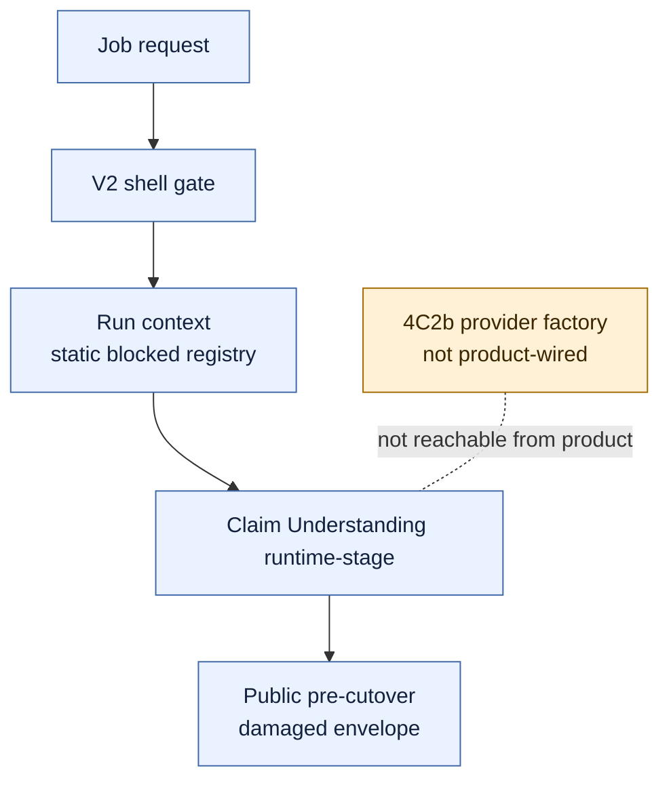
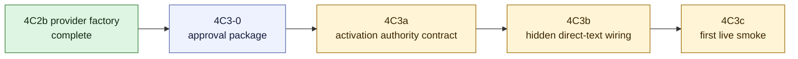

# V2 Slice 6B.3c-4C3 Product Activation Approval Package

**Date:** 2026-05-15
**Status:** docs-only package reviewed by deputy team; 4C3a may proceed only as inert activation-authority/hidden-artifact contract source after the modifications in Section 13; product activation source, live jobs, approval flips, cache IO, public exposure, ACS/direct URL execution, and V1 cleanup remain blocked
**Owner role:** Lead Architect / Captain deputy
**Baseline:** `88787787` (`docs: record v2 provider factory source`)
**Checklist version/hash:** `V2-RUNTIME-GATE-CHECKLIST-2026-05-14.1` / `sha256:9029402e8d359ef21a5e92a181e290a9362203acaca1923a98606b63018fec96`

---

## 1. Purpose

4C2b added a clean-room provider factory, but no product path can use it. 4C3 is the first gate that may allow the V2 shell to produce a hidden direct-text Claim Understanding runtime artifact through real prompt/model/cache approval authority.

This package does not approve source wiring. It defines the review boundary that must be accepted before implementation starts.

4C3 must answer four questions before any source edits:

- where the authoritative V2 runtime config snapshot comes from;
- how the real `claim_understanding_gate1` gateway task becomes executable without test-only clones or caller-supplied approval snapshots;
- where a hidden runtime artifact is captured without changing public API/UI/report/export output;
- how the first live smoke is committed, refreshed, monitored, and rolled back.

## 2. Current Topology

Current 4C2b state:

- `claim-understanding-provider-factory.ts` can build an injected provider callback from a validated `factory_only_not_product_wired` snapshot.
- `run-context.ts` still freezes `source: "static_precutover_registry"` and `configSnapshot.source: "not_loaded_pre_provider_wiring_gate"`.
- `runtime-stage.ts` dispatches only when `directTextRuntimeDispatch.enabled === true`, the real gateway task is executable, and a provider boundary is supplied.
- `orchestrator.ts` calls `runClaimUnderstandingRuntimeStage(input, context)` without product activation options.
- `pipeline-shell.ts` only normalizes runner input and calls the V2 orchestrator.
- Public V2 output remains the damaged pre-cutover envelope.

## 3. Recommended 4C3 Slice Split

Do not jump directly from 4C2b to live execution. The recommended split is:

| Slice | Purpose | Source approval in this package |
|---|---|---|
| 4C3-0 | This docs-only product activation package | yes, docs only |
| 4C3a | Activation authority contract: define product-owned runtime activation snapshot, approval source, hidden artifact sink, and rollback model without provider dispatch | not yet |
| 4C3b | Hidden direct-text runtime wiring using the 4C2b factory after 4C3a is reviewed | not yet |
| 4C3c | First live smoke, one Captain-defined direct-text input, commit-first and runtime-refreshed | not yet |

## 4. Activation Authority Decision

The highest-risk unresolved question is the authority source.

Rejected authority sources:

- caller-supplied approval snapshots;
- test fixture gateway tasks;
- private executable gateway-task clones;
- ad hoc env strings for model id, prompt approval, cache approval, provider id, timeout, token budget, or temperature;
- V1 config/model/provider helpers;
- static code constants that bypass UCM for analysis-affecting tunables.

Recommended authority source for 4C3 review:

- a V2 task-policy activation snapshot, frozen once per run in `PipelineRunContext`;
- derived from a reviewed UCM/task-policy source or a deputy-approved temporary activation profile if UCM storage is not yet ready;
- not supplied by the caller, environment, test fixture, or provider factory;
- containing prompt, model, cache, provider, schema, budget, timeout, and approval metadata;
- with `configSnapshotHash`, active profile hash, approval metadata, and rollback target recorded before dispatch;
- with no mutable per-stage config reads after the context is built.

If reviewers do not consent on this authority source, 4C3 must stop at 4C3a and must not wire product execution.

The 4C2b `factory_only_not_product_wired` snapshot remains only a provider-construction contract. It must not be interpreted as runtime execution approval. A later product activation state needs a separate approved activation snapshot and must update the naming/contract so the factory state remains truthful once product wiring starts.

## 5. Hidden Artifact Definition

"Hidden direct-text runtime artifact" means:

- an internal Claim Understanding runtime artifact for a V2 direct-text run;
- produced only when V2 shell opt-in and 4C3 runtime activation are both enabled;
- captured in an explicitly reviewed internal artifact sink;
- not added to public API response shape, UI report, markdown export, static export, compatibility view, or public result JSON;
- sufficient for reviewers to inspect prompt/model provenance, provider telemetry, schema outcome, warning/materiality classification, and failure state.

The artifact sink class must be decided by 4C3a before 4C3b source wiring. Allowed sink candidates for review:

- existing internal job event/audit trail, if it can be made admin-only and non-public;
- V2 observability ledger handle, if the implementation slice defines the storage and leak guards;
- a temporary internal-only artifact file or test-output sink for local smoke only, if live job verification does not require product persistence.

Forbidden sink:

- public `resultJson`, report markdown, UI-visible warnings, export payload, or API compatibility adapter.

## 6. Candidate 4C3a Source Envelope

4C3a is the recommended next source candidate after this package is reviewed. It must be an activation contract and hidden-artifact contract, not live dispatch.

Candidate files for review:

- `apps/web/src/lib/analyzer-v2-runtime/claim-understanding-runtime-activation.contract.ts`
- `apps/web/test/unit/lib/analyzer-v2-runtime/claim-understanding-runtime-activation.contract.test.ts`
- `apps/web/test/unit/lib/analyzer-v2/boundary-guard.test.ts`
- documentation and handoff updates

Allowed 4C3a behavior:

- define a V2-owned runtime activation snapshot contract;
- define acceptable approval provenance fields and rollback target fields;
- define the hidden artifact sink contract;
- select or explicitly defer the hidden artifact sink class, with 4C3b blocked until the selected sink is non-public and inspectable;
- require direct-text-only scope;
- require product/public surface non-exposure;
- require provider factory import and use to remain blocked until 4C3b;
- add static guards proving 4C3a does not import provider SDKs, provider factory source, config storage, cache IO, runtime dispatch, product callers, V1 analyzer code, prompt loaders, or public/report/export surfaces.

Forbidden 4C3a behavior:

- no product/orchestrator/runtime-stage/runtime-dispatch wiring;
- no provider callback construction or provider factory invocation;
- no provider factory import;
- no prompt rendering, adapter invocation, or model call;
- no config/cache storage IO;
- no prompt/model/cache approval flips;
- no `execution_approved`, `status: "executable"`, or executable gateway construction;
- no public API/UI/report/export exposure;
- no ACS/direct URL execution;
- no live jobs;
- no V1 cleanup.

## 7. Candidate 4C3b Source Envelope

4C3b may be reviewed only after 4C3a resolves activation authority and hidden artifact sink.

Candidate files for later review:

- `apps/web/src/lib/analyzer-v2-runtime/claim-understanding-runtime-activation.ts`
- `apps/web/src/lib/analyzer-v2/run-context.ts`
- `apps/web/src/lib/analyzer-v2/pipeline-shell.ts`
- `apps/web/src/lib/analyzer-v2/orchestrator.ts`
- `apps/web/src/lib/analyzer-v2/claim-understanding/runtime-stage.ts`
- `apps/web/test/unit/lib/analyzer-v2-runtime/claim-understanding-runtime-activation.test.ts`
- `apps/web/test/unit/lib/analyzer-v2/claim-understanding/runtime-stage.test.ts`
- `apps/web/test/unit/lib/analyzer-v2/pipeline-shell.test.ts`
- `apps/web/test/unit/lib/analyzer-v2/boundary-guard.test.ts`
- `apps/web/test/unit/lib/internal-runner-v2-routing.test.ts`
- documentation and handoff updates

Allowed 4C3b behavior, if separately approved:

- direct-text-only runtime activation behind the existing V2 shell gate plus a separate runtime kill switch;
- product-owned activation builder creates the provider boundary by using the 4C2b factory and a validated runtime config snapshot;
- run context freezes real prompt/model/cache policy and config snapshot before stage execution;
- runtime-stage receives activation from product-owned code only, not caller/test scaffold options;
- public V2 result remains the damaged pre-cutover envelope;
- hidden artifact sink captures the internal runtime artifact for admin/deputy review only;
- missing activation, disabled activation, missing provider boundary, unsupported input, invalid schema, provider failure, invalid telemetry, or closed gateway policy fails closed to the V2 damaged/pre-cutover envelope with internal diagnostics. Once explicit V2 runtime activation has started, do not silently fall back to V1.

Forbidden 4C3b behavior:

- no ACS or direct URL execution;
- no cache read/write/storage IO;
- no public API/UI/report/export schema changes;
- no report-markdown or compatibility-view exposure of partial Claim Understanding;
- no V1 analyzer/prompt/provider/helper reuse;
- no prompt text changes;
- no broad UCM UI redesign;
- no V1 cleanup/removal.

## 8. Live-Smoke Gate

Live jobs are not approved by this package.

4C3c live smoke may be proposed only after 4C3b source is committed and runtime state is refreshed. The first live smoke must:

- use exactly one Captain-defined direct-text input;
- record the commit hash, runtime restart/refresh evidence, config snapshot hash, prompt hash, provider/model identity, token usage, duration, and hidden artifact location;
- prove no public API/UI/report/export leakage;
- prove V1 default route and unsupported V2 input handling are unchanged;
- monitor for provider failure, invalid telemetry, invalid schema, warning escalation, and stale runtime state;
- stop after one job unless the result is clean, then expand only up to the current Captain allowance of four.

No live job is meaningful if the hidden artifact cannot be inspected.

## 9. Required Review Questions

Reviewers must answer:

- Is the 4C3a -> 4C3b -> 4C3c split acceptable, or should product activation wait for formal task-policy UCM storage first?
- Which runtime config snapshot authority is acceptable for 4C3a?
- Which hidden artifact sink is acceptable and testable without public leakage?
- Is a temporary internal runtime kill switch acceptable, and what should disable do: fail closed or route to V1 under existing variant fallback semantics?
- Are prompt/model/cache approval flips allowed in 4C3b, or must a separate UCM/admin approval slice precede it?
- What exact source envelope is acceptable for 4C3a?
- What verifier proves no public result leakage?
- Is any live job meaningful before 4C3b? Recommended answer: no.

## 10. Required Verifiers

Minimum verifier for 4C3a if approved:

- focused activation-contract tests;
- boundary guard proving no provider SDK, V1 analyzer, prompt loader, config/cache IO, runtime dispatch, product caller, public/report/export import, approval mutation, or executable gateway construction;
- static scan for forbidden strings and imports;
- static guard proving no `execution_approved`, `status: "executable"`, executable gateway construction, approval mutation, provider factory import, or provider factory invocation in 4C3a source;
- `npm -w apps/web run test -- test/unit/lib/analyzer-v2-runtime/claim-understanding-runtime-activation.contract.test.ts test/unit/lib/analyzer-v2/boundary-guard.test.ts`;
- `npm -w apps/web run test -- test/unit/lib/analyzer-v2 test/unit/lib/analyzer-v2-runtime`;
- `npm -w apps/web run build`;
- `git diff --check`.

Minimum verifier for 4C3b if later approved:

- all 4C3a verifiers;
- focused runtime-stage, pipeline-shell, runtime-activation, and internal-runner routing tests;
- direct-text success test with a mocked provider boundary and real activation snapshot;
- direct URL and ACS blocked/deferred tests before prompt/cache/adapter/provider work;
- provider failure, invalid telemetry, invalid schema, prompt-render failure, closed gateway policy, and missing activation tests;
- recursive public-result leak guard for Claim Understanding runtime state, prompt text, provider telemetry, cache key material, activation snapshots, and hidden artifact pointers;
- static scans for V1 reuse, public-surface reachability, cache IO, `status: "executable"` construction outside the approved authority, and product caller test-scaffold option leakage;
- `npm -w apps/web run build`;
- `git diff --check`.

## 11. Captain Escalation Conditions

Escalate before source if reviewers cannot reach consent on activation authority, hidden artifact sink, public exposure, approval flips, or rollback behavior.

Escalate before implementation if the source proposal includes any of:

- public API/UI/report/export output changes;
- ACS or direct URL execution;
- cache read/write/storage IO;
- prompt text or prompt profile changes;
- broad UCM/admin UI redesign;
- V1 cleanup/removal;
- more than one first live-smoke job;
- any fallback that silently routes an explicitly enabled V2 runtime request to V1 after runtime activation has started.

## 12. Recommended Deputy Review Prompt

> Review `Docs/WIP/2026-05-15_V2_Slice_6B3c4C3_Product_Activation_Approval_Package.md`. Decide whether 4C3 may proceed only as 4C3a activation-authority and hidden-artifact contract source, with no product dispatch, provider callback construction, prompt rendering, model call, cache IO, public exposure, ACS/direct URL execution, live jobs, approval flips, prompt/config changes, or V1 cleanup. If you approve or modify 4C3a, name the acceptable runtime config snapshot authority, hidden artifact sink, source envelope, verifier set, and whether 4C3b must wait for formal UCM task-policy storage.

Expected reviewer output:

- verdict: APPROVE / MODIFY / BLOCK;
- blockers;
- required source envelope changes before 4C3a implementation;
- whether 4C3b may be planned from this package or needs a separate package;
- whether Captain confirmation is required;
- whether any live job is meaningful before 4C3b.

## 13. Deputy Review Consolidation

Deputy review result: `APPROVE for 4C3a only` / `MODIFY` / `MODIFY`.

Consolidated decision:

- 4C3a may proceed only as an inert activation-authority and hidden-artifact contract source slice.
- 4C3a source envelope is limited to `claim-understanding-runtime-activation.contract.ts`, its focused contract test, `boundary-guard.test.ts`, docs, and handoff updates.
- 4C3a must define activation snapshot provenance, approval pointer, config/profile hash, rollback target, direct-text-only scope, hidden artifact sink policy, fail-closed kill-switch behavior, and public-surface non-exposure.
- The activation snapshot must be frozen in `PipelineRunContext`, hashable, approval-traceable, and not caller/env/test supplied.
- 4C3a must keep provider factory import/invocation, runtime dispatch, prompt rendering, model calls, cache IO, approval flips, executable gateway construction, product wiring, public exposure, ACS/direct URL execution, live jobs, and V1 cleanup blocked.
- 4C3b requires a separate reviewed source package. It must select the exact hidden artifact storage, source envelope, import exceptions, rollback behavior, and verifier coverage before implementation.
- 4C3c live smoke is not meaningful before committed, runtime-refreshed 4C3b can produce an inspectable hidden direct-text artifact without public leakage.

Captain confirmation:

- not needed for 4C3a if it remains contract-only under the consolidated envelope;
- required before 4C3b if it enables real prompt/model/cache approval, executable gateway state, real hidden runtime wiring, selected artifact sink implementation, or any live job.
