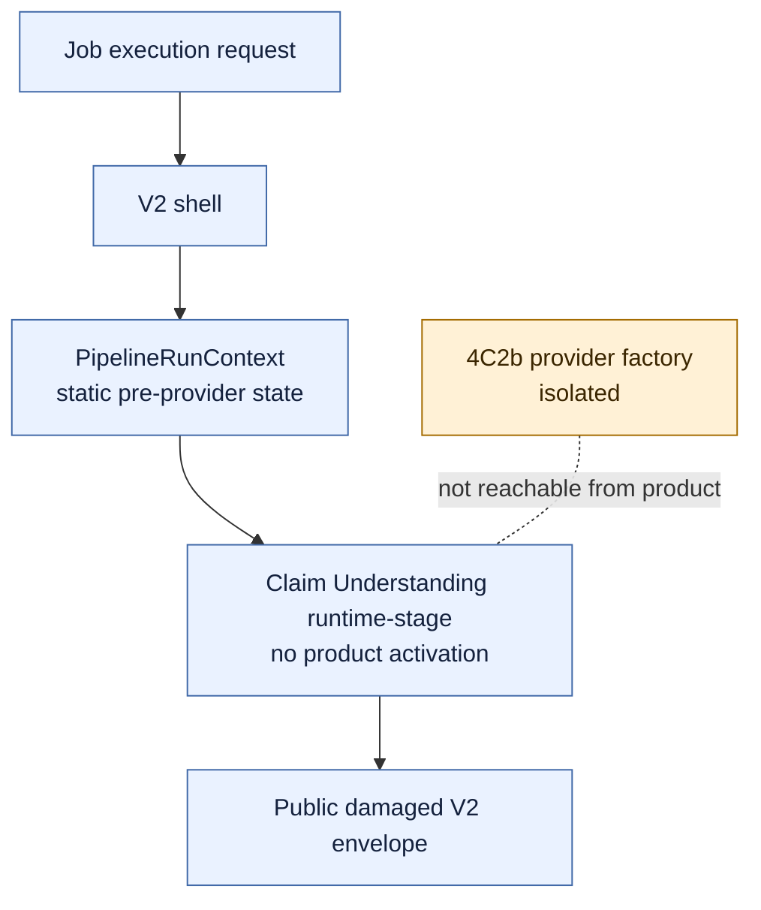
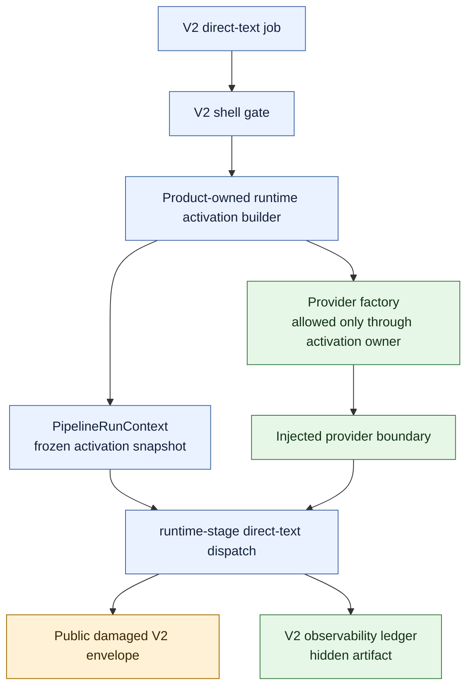

# V2 Slice 6B.3c-4C3b Hidden Direct-Text Wiring Approval Package

**Date:** 2026-05-15
**Status:** 4C3b source wiring implemented after Captain confirmation; 4C3c live smoke, public exposure, cache IO, ACS/direct URL execution, and V1 cleanup remain blocked
**Owner role:** Lead Architect / Captain deputy
**Baseline:** `fc68915d` (`feat: add v2 runtime activation contract`)
**Checklist version/hash:** `V2-RUNTIME-GATE-CHECKLIST-2026-05-14.1` / `sha256:9029402e8d359ef21a5e92a181e290a9362203acaca1923a98606b63018fec96`

---

## 1. Purpose

4C3a added the inert activation-authority contract. 4C3b is the first slice that could make hidden direct-text Claim Understanding execution reachable from the V2 product shell.

This package did **not** approve implementation by itself. It defined the source envelope and constraints that required Captain confirmation before code started.

Captain confirmation was received on 2026-05-15 with the recommended approval wording in Section 12.

4C3b must produce, at most, an internal hidden direct-text Claim Understanding artifact while the public result remains the V2 damaged pre-cutover envelope.

## 2. Current State

Current state at `fc68915d`:

- `claim-understanding-runtime-activation.contract.ts` validates product-owned activation authority requirements but is not product-wired.
- `run-context.ts` still uses `configSnapshot.source: "not_loaded_pre_provider_wiring_gate"` and `modelPolicy.source: "static_precutover_registry"`.
- `orchestrator.ts` calls `runClaimUnderstandingRuntimeStage(input, context)` without activation options.
- `runtime-stage.ts` can dispatch only when explicit direct-text runtime options and a provider boundary are supplied.
- `claim-understanding-provider-factory.ts` is isolated under `analyzer-v2-runtime` and currently requires `executionState: "factory_only_not_product_wired"`.
- Public API/UI/report/export output is unchanged and remains damaged/pre-cutover.

## 3. Deputy Debate Consolidation

Reviewer outcomes:

| Lens | Verdict | Main point |
|---|---|---|
| Senior architect / LLM runtime | APPROVE for docs-only package | Source wiring requires Captain confirmation because it enables real hidden prompt/model/provider execution. |
| Clean-room/security challenger | APPROVE docs-only, BLOCK source until confirmed | Public leakage is the primary risk; existing job events are not safe as hidden artifact storage. |
| Senior implementation / developer | APPROVE docs-only | Do not use the current `factory_only_not_product_wired` state for product activation without renaming/contract adjustment. |

Consolidated decision:

- proceed with this docs-only 4C3b package;
- do not start source wiring until Captain confirms the package;
- do not use existing job events/history as the hidden artifact sink;
- prefer a V2-owned observability ledger sink with an internal local smoke artifact adapter for later 4C3c inspection;
- keep 4C3b direct-text-only, no public result changes, no cache IO, no live jobs, no V1 cleanup.

## 4. Target 4C3b Flow

The public envelope remains damaged/pre-cutover. The hidden artifact is for admin/deputy inspection only and must not leak through `resultJson`, report markdown, UI, export, compatibility view, or public job events.

## 5. Activation Authority

Recommended authority:

- a product-owned V2 runtime activation snapshot frozen once per run in `PipelineRunContext`;
- derived from formal V2 task-policy/UCM state if ready;
- otherwise, a deputy-approved temporary activation profile is acceptable only if it is hashable, approval-traceable, rollback-targeted, and not caller/env/test supplied;
- records prompt/model/cache/provider approval pointers, config/profile hash, provider/model identity, timeout/token/temperature values, output schema id, activation snapshot hash, and rollback target before dispatch;
- constructs any executable gateway state only inside the approved activation owner module.

Forbidden authority:

- caller-supplied approval snapshots;
- env ad hoc approval/model/provider strings;
- test fixture gateway tasks in product paths;
- private executable clones outside the activation owner;
- V1 config/model/provider helpers;
- static hardcoded analysis-affecting tunables that bypass the approved activation profile.

The current `factory_only_not_product_wired` runtime-config state must not be reused as product activation approval. 4C3b source must either:

- introduce a new explicit state such as `product_activation_wired_hidden_direct_text`; or
- add a separate activation wrapper that keeps the provider factory snapshot truthful while the product activation snapshot owns execution approval.

## 6. Hidden Artifact Sink

Recommended sink: `v2_observability_ledger`.

Required properties:

- V2-owned and internal/admin-only;
- no public pointer in `resultJson`, report markdown, UI, export, compatibility view, or public events;
- inspectable for provenance, approval pointer, config/profile hash, prompt hashes, provider/model identity, token usage, duration, schema outcome, failure state, cache no-store decision, and warning materiality;
- tied to `PipelineRunContext.observabilityLedger`;
- testable without live jobs.

Rejected sink:

- existing job event/history endpoints as currently implemented. They are message-oriented and readable through public job event routes for non-hidden jobs, so they are not a safe hidden artifact store for provider telemetry or prompt/runtime provenance.

Allowed implementation direction after Captain confirmation:

- add a V2-owned artifact sink interface and an internal in-memory/local smoke adapter under `analyzer-v2-runtime`;
- use a local internal artifact file only for committed, runtime-refreshed 4C3c smoke inspection, never as a public API/report pointer;
- keep artifact content out of the damaged public envelope.

## 7. Source Envelope Requiring Captain Confirmation

Proposed 4C3b source envelope:

- `apps/web/src/lib/analyzer-v2-runtime/claim-understanding-runtime-activation.ts`;
- `apps/web/src/lib/analyzer-v2-runtime/claim-understanding-runtime-artifact-sink.ts`;
- `apps/web/src/lib/analyzer-v2-runtime/claim-understanding-provider-runtime-config.contract.ts`;
- `apps/web/src/lib/analyzer-v2-runtime/claim-understanding-provider-boundary.contract.ts`;
- `apps/web/src/lib/analyzer-v2/run-context.ts`;
- `apps/web/src/lib/analyzer-v2/orchestrator.ts`;
- `apps/web/src/lib/analyzer-v2/claim-understanding/runtime-stage.ts`;
- `apps/web/src/lib/analyzer-v2/pipeline-shell.ts`, only if needed to preserve caller isolation;
- focused tests under `apps/web/test/unit/lib/analyzer-v2-runtime/` and `apps/web/test/unit/lib/analyzer-v2/`;
- `apps/web/test/unit/lib/internal-runner-v2-routing.test.ts`;
- `apps/web/test/unit/lib/analyzer-v2/boundary-guard.test.ts`;
- documentation and handoff updates.

Any source file outside this envelope reopens review.

## 8. Allowed 4C3b Behavior If Confirmed

- direct-text-only hidden runtime activation behind the V2 shell gate and a runtime kill switch;
- product-owned activation builder freezes activation state in `PipelineRunContext`;
- activation owner constructs the provider boundary through the 4C2b provider factory;
- runtime-stage dispatches only with product-owned activation, never caller/test scaffold options;
- hidden artifact sink captures the internal runtime artifact;
- public V2 result remains the damaged pre-cutover envelope;
- missing activation, closed kill switch, missing approval, invalid activation snapshot, missing provider boundary, prompt render failure, invalid schema, invalid telemetry, provider failure, or closed gateway policy fails closed to the damaged V2 envelope with internal diagnostics.

## 9. Forbidden 4C3b Behavior

- no ACS execution;
- no direct URL execution;
- no cache read/write/storage IO;
- no public API/UI/report/export/compatibility schema change;
- no hidden artifact content or pointer in public result/report/UI/export/public events;
- no prompt text changes;
- no broad UCM/admin UI redesign;
- no V1 analyzer, prompt, provider, type, or helper reuse;
- no provider SDK import outside `claim-understanding-provider-factory.ts`;
- no product caller import of provider SDKs;
- no live jobs;
- no V1 cleanup/removal.

## 10. Kill Switch And Rollback

Required behavior:

- default closed;
- disabled activation means no prompt rendering, no provider factory invocation, no adapter call, no model call, and no hidden artifact except a minimal internal blocked diagnostic if needed;
- after explicit V2 runtime activation starts, failures must fail closed to the V2 damaged/pre-cutover envelope, not silently fall back to V1;
- pre-activation V1 default routing may remain unchanged when the V2 shell itself is not selected;
- rollback target must be recorded in the activation snapshot before dispatch.

## 11. Required Verifiers For 4C3b Source

Minimum source verifier if Captain confirms implementation:

- activation builder tests: disabled activation, missing approval, invalid snapshot, missing provider boundary, executable gateway construction confined to activation owner;
- hidden artifact sink tests: required fields, internal/admin-only visibility, no public pointer, inspectability of success and failure cases;
- runtime-stage tests: direct-text success with mocked provider boundary, provider failure, invalid telemetry, invalid schema, prompt render failure, closed gateway, disabled kill switch;
- ACS and direct URL blocked tests before prompt/cache/provider work;
- pipeline-shell/orchestrator tests proving activation is product-owned and caller-supplied scaffold options do not leak back in;
- internal runner V1/V2 routing tests proving V1 default and V2-disabled fallback remain unchanged;
- recursive public leak guard for prompt text, rendered prompt hash, provider telemetry, activation snapshots, hidden artifact pointers, cache key material, and runtime state;
- boundary guard for exact import exceptions and provider SDK import location;
- static scans for V1 analyzer/prompt/type reuse, provider SDK imports outside the factory, cache IO, public surface reachability, `process.env` activation authority, and executable gateway construction outside activation owner;
- `npm -w apps/web run test -- test/unit/lib/analyzer-v2 test/unit/lib/analyzer-v2-runtime`;
- `npm -w apps/web run test -- test/unit/lib/internal-runner-v2-routing.test.ts`;
- `npm -w apps/web run build`;
- `git diff --check`.

No live job is part of 4C3b. Live smoke belongs to 4C3c after committed source, runtime refresh, and inspectable hidden artifact proof.

## 12. Captain Confirmation Required

Captain confirmation is required before 4C3b source wiring because the slice enables real hidden prompt/model/provider execution and executable gateway state inside an approved owner.

Recommended confirmation wording:

> Approved to implement 4C3b source wiring exactly under `Docs/WIP/2026-05-15_V2_Slice_6B3c4C3b_Hidden_Direct_Text_Wiring_Approval_Package.md`: direct-text-only hidden runtime activation, V2-owned observability ledger hidden artifact sink, product-owned activation snapshot frozen in `PipelineRunContext`, fail-closed kill switch, no public API/UI/report/export/compatibility exposure, no cache IO, no ACS/direct URL execution, no live jobs, no V1 reuse, and no V1 cleanup.

Confirmation was received before implementation.

## 13. 4C3b Implementation Result

4C3b was implemented inside the approved source envelope:

- `apps/web/src/lib/analyzer-v2-runtime/claim-understanding-runtime-activation.ts`;
- `apps/web/src/lib/analyzer-v2-runtime/claim-understanding-runtime-artifact-sink.ts`;
- provider runtime-config/factory contract updates under `apps/web/src/lib/analyzer-v2-runtime/`;
- `PipelineRunContext` activation snapshot fields in `apps/web/src/lib/analyzer-v2/run-context.ts`;
- product-owned activation construction in `apps/web/src/lib/analyzer-v2/orchestrator.ts`;
- direct-text hidden dispatch handoff in `apps/web/src/lib/analyzer-v2/claim-understanding/runtime-stage.ts`;
- focused runtime, boundary, public-leak, and routing tests.

Implementation constraints preserved:

- activation defaults to `kill_switch_closed`;
- disabled activation performs no prompt rendering, provider factory invocation, adapter call, model call, or cache IO;
- enabled activation is direct-text-only and builds executable gateway state only inside the approved activation owner;
- hidden runtime artifacts are captured only in the V2-owned `v2_observability_ledger` in-memory sink;
- public `resultJson`, report markdown, UI, export, compatibility view, and public job events receive no hidden artifact pointer or runtime telemetry;
- ACS and direct URL execution remain blocked before prompt/cache/provider work;
- no V1 analyzer, prompt, provider, type, or helper was reused;
- no live jobs were submitted.

Verification:

- `npm -w apps/web run test -- test/unit/lib/analyzer-v2 test/unit/lib/analyzer-v2-runtime test/unit/lib/internal-runner-v2-routing.test.ts` passed 25 files / 201 tests;
- `npm -w apps/web run build` passed with postbuild prompt/config reseed unchanged;
- `git diff --check` passed;
- provider SDK scan found SDK imports only in `apps/web/src/lib/analyzer-v2-runtime/claim-understanding-provider-factory.ts`;
- cache/config/job-history IO scan found no forbidden access in the new activation path;
- public-surface leak scan found no activation snapshot, hidden artifact, artifact sink, or runtime activation import leakage.

## 14. Review Follow-Up

Post-implementation review approved 4C3b and raised one pre-4C3c action:

- F1 was addressed before 4C3c: the temporary in-memory `v2_observability_ledger` store now caps both retained ledgers and retained records per ledger, and reads/clears no longer create empty ledger entries.
- F2 is accepted planned temporary debt: `CAPTAIN_APPROVAL` remains a static deputy-approved temporary activation profile for 4C3b. It must be replaced by real UCM/task-policy-derived approval when that storage and activation authority are ready.
