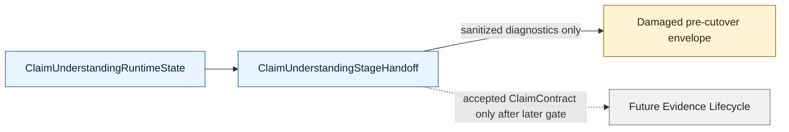

# V2 Slice 6B.3c-4C4 Claim Understanding Accepted-Result Handoff Gate

**Date:** 2026-05-15
**Status:** source slice implemented at `91ba03c0`
**Owner role:** Lead Architect / Captain deputy
**Baseline:** `5e0ecb87` (`docs: update v2 guardrails after 4c3c smoke`)
**Checklist version/hash:** `V2-RUNTIME-GATE-CHECKLIST-2026-05-14.1` / `sha256:9029402e8d359ef21a5e92a181e290a9362203acaca1923a98606b63018fec96`

---

## 1. Decision

Do **not** start Evidence Lifecycle source work yet.

4C3c proved that the hidden direct-text Claim Understanding runtime is reachable under the approved triple gate and can write an inspectable internal artifact without public leakage. It did **not** prove that direct-text Claim Understanding can produce a valid accepted `ClaimContract` that downstream stages may consume.

Accepted smoke:

- job `7b56c24a79ee4ab390cc3a6d5aed8986`
- commit `efb1f33f30209a56a9fbb392f27eb6ea18ed28bc`
- hidden artifact execution status `completed`
- schema outcome `damaged`
- damaged reason `claim_contract_validation_failed`

The next step is therefore a **Claim Understanding accepted-result handoff gate**. This gate defines the internal transition from runtime state to a stable stage handoff. It must keep public output damaged/pre-cutover until a later cutover gate.

## 2. Deputy-Team Consolidation

Post-4C3c review roles returned compatible recommendations:

- LLM/quality reviewer: **BLOCK Evidence Lifecycle** while Claim Understanding cannot produce a valid `ClaimContract`; first diagnose and gate the contract path.
- Architecture reviewer: **MODIFY** sequencing; create a docs/contract gate for accepted `ClaimUnderstandingResult -> ClaimContract -> internal V2 orchestrator state` before downstream stages.
- Implementation reviewer: source work is safe only as a narrow typed internal handoff; no runtime/provider/UCM/EvidenceCorpus changes.

Consolidated verdict: **APPROVE docs/contract gate; allow only a narrow structural source slice after this gate is recorded.**

Captain escalation is not required for this docs-only gate. Captain escalation is required if the follow-up source proposal includes prompt/config changes, model-tier changes, approval flips, public exposure, cache IO, ACS/direct URL runtime dispatch, broader live jobs, or V1 cleanup.

## 3. 4C4 Scope

4C4 defines a V2-owned internal stage handoff:

The handoff is internal and typed. It may represent:

- `accepted`: contains a valid `ClaimContract`, source `acs_prepared_snapshot` or `v2_claim_understanding`, and structural stage metadata;
- `blocked`: contains no `ClaimContract`, a typed blocked reason, and no downstream-start permission;
- `damaged`: contains no `ClaimContract`, a typed damaged reason, and no downstream-start permission.

The handoff must make downstream permission explicit:

| Handoff status | ClaimContract | Evidence Lifecycle may start | Public V2 result |
|---|---|---|---|
| `accepted` | present | not in 4C4; later gate only | still damaged/pre-cutover |
| `blocked` | absent | no | damaged/pre-cutover |
| `damaged` | absent | no | damaged/pre-cutover |

4C4 does **not** change public semantics. It only prepares the internal boundary required before Evidence Lifecycle can be implemented safely.

## 4. Allowed Source Envelope For Follow-Up Source Slice

The next source slice may touch only:

- `apps/web/src/lib/analyzer-v2/claim-understanding/stage-handoff.ts` (new)
- `apps/web/test/unit/lib/analyzer-v2/claim-understanding/stage-handoff.test.ts` (new)
- `apps/web/src/lib/analyzer-v2/orchestrator.ts`
- `apps/web/src/lib/analyzer-v2/result-envelope.ts` only if needed to consume a cleaner sanitized diagnostic shape
- `apps/web/test/unit/lib/analyzer-v2/boundary-guard.test.ts`
- focused documentation/handoff/index files

The follow-up source slice must remain structural. It must not call providers, render prompts, read/write cache, change UCM, or alter public outputs.

## 5. Forbidden Scope

The following remain blocked:

- Evidence Lifecycle source implementation;
- public API/UI/report/export/compatibility exposure of Claim Understanding internals;
- prompt text edits, prompt seeding, UCM/config/default changes, or model-tier changes;
- approval flips in shipped gateway policy;
- cache read/write/storage IO;
- ACS or direct URL runtime dispatch;
- broad live-job expansion;
- V1 analyzer/prompt/type reuse;
- V1 cleanup/removal or final naming normalization.

## 6. Contract Requirements

The internal `ClaimUnderstandingStageHandoff` must:

- be built from `ClaimUnderstandingRuntimeState`;
- preserve accepted `ClaimContract` internally when present;
- never fabricate a `ClaimContract` for blocked/damaged states;
- expose a structural downstream-start decision, initially `blocked_precutover` even for accepted states;
- carry only typed stage status, source, blocked/damaged reason, integrity event summaries, and selected claim IDs;
- separate internal contract data from public envelope diagnostics;
- avoid provider telemetry, prompt hashes, rendered prompt hashes, activation snapshot hashes, cache decisions, ledger IDs, and artifact IDs in public-result paths;
- make damage/block reasons explicit enough for the later Evidence Lifecycle gate to refuse invalid upstream state without re-reading provider artifacts.

## 7. Required Tests

Focused tests:

- accepted ACS migration becomes an internal accepted handoff with a `ClaimContract`;
- accepted hidden direct-text result becomes an internal accepted handoff with a `ClaimContract` in a mocked/unit path;
- blocked runtime state becomes a blocked handoff with no `ClaimContract`;
- damaged runtime state becomes a damaged handoff with no `ClaimContract`;
- blocked/damaged states explicitly forbid downstream Evidence Lifecycle start;
- accepted state still does not alter the public damaged pre-cutover envelope in 4C4;
- sanitized diagnostics omit provider telemetry, prompt hashes, rendered prompt hashes, activation snapshot hashes, cache decisions, ledger IDs, and artifact IDs.

Verification commands:

- `npm -w apps/web run test -- test/unit/lib/analyzer-v2/claim-understanding/stage-handoff.test.ts test/unit/lib/analyzer-v2/pipeline-shell.test.ts test/unit/lib/analyzer-v2/boundary-guard.test.ts`
- `npm -w apps/web run test -- test/unit/lib/analyzer-v2 test/unit/lib/analyzer-v2-runtime`
- `npm -w apps/web run build`
- `git diff --check`

No live job is required or justified for the structural 4C4 source slice.

## 8.1 Source Implementation Result

Implementation commit: `91ba03c0` (`feat: add v2 claim understanding handoff`).

Implemented source:

- `apps/web/src/lib/analyzer-v2/claim-understanding/stage-handoff.ts`
- `apps/web/src/lib/analyzer-v2/orchestrator.ts`
- `apps/web/test/unit/lib/analyzer-v2/claim-understanding/stage-handoff.test.ts`

Implemented contract:

- `ClaimUnderstandingStageHandoff` is built from `ClaimUnderstandingRuntimeState`;
- accepted states preserve the internal `ClaimContract`;
- blocked and damaged states never fabricate a `ClaimContract`;
- every handoff blocks Evidence Lifecycle start with `evidenceLifecycleStatus: "blocked_precutover"`;
- public damaged-envelope diagnostics are derived only through sanitized preparation diagnostics;
- hidden runtime/provider details remain outside the public envelope.

Verification:

- `npm -w apps/web run test -- test/unit/lib/analyzer-v2/claim-understanding/stage-handoff.test.ts test/unit/lib/analyzer-v2/pipeline-shell.test.ts test/unit/lib/analyzer-v2/boundary-guard.test.ts` - passed, 47 tests.
- `npm -w apps/web run test -- test/unit/lib/analyzer-v2 test/unit/lib/analyzer-v2-runtime` - passed, 25 files / 208 tests.
- `npm -w apps/web run build` - passed.
- `git diff --check` - passed.

## 8. Later Gates

After 4C4, the next decision is either:

1. a reviewed Claim Understanding contract-quality fix if the direct-text hidden runtime still cannot produce an accepted `ClaimContract`; or
2. an Evidence Lifecycle contract/source gate only after an accepted `ClaimContract` handoff exists and is guarded.

Any prompt/schema/model/config correction must be reviewed separately before implementation. More live jobs are justified only after such a reviewed correction is committed and runtime-refreshed.
