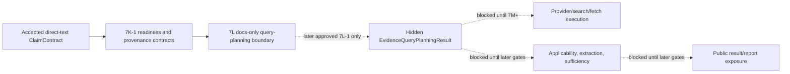

# V2 Slice 7L Evidence Query-Planning Execution Package

**Date:** 2026-05-15
**Status:** docs-only design/review package; no source authorization
**Owner role:** Lead Architect / Captain deputy
**Baseline:** `1a007020` (`docs: record v2 evidence readiness contracts`)
**Prior source gate:** 7K-1 `218fc879` (`feat: add v2 evidence readiness contracts`)
**Checklist version/hash:** `V2-RUNTIME-GATE-CHECKLIST-2026-05-14.1` / `sha256:9029402e8d359ef21a5e92a181e290a9362203acaca1923a98606b63018fec96`

## 1. Purpose

Define the first Evidence Lifecycle execution boundary after the inert 7K-1 readiness contracts.

7L is intentionally a docs/review package first. It does not authorize source edits, prompt/model runtime execution, provider/search/fetch execution, UCM/default changes, cache IO, Source Reliability integration, product wiring, public exposure, live jobs, direct-text canary execution, ACS/direct URL execution, approval flips, file seeding, or V1 cleanup.

The proposed first executable candidate is query planning only:

- input: accepted direct-text `ClaimContract`;
- output: hidden/internal bounded `EvidenceQueryPlanningResult`;
- authority: later Captain-approved execution gate only.

## 2. Expert Review Consolidation

Review participants:

- LLM Expert review: `Docs/AGENTS/Handoffs/2026-05-15_LLM_Expert_V2_Slice_7L_Query_Planning_Gate_Review.md`
- Senior Developer implementation-risk review: `Docs/AGENTS/Agent_Outputs.md` entry `V2 Slice 7L Execution Package Risk Review`
- Lead Architect challenger review: `Docs/AGENTS/Handoffs/2026-05-15_Lead_Architect_V2_Slice_7L_Query_Planning_Position_Memo.md`

Consolidated decision:

- Query planning is the correct first executable Evidence Lifecycle candidate.
- 7L must remain docs/review-first and must not implement execution.
- Query planning must not become source acquisition, provider IO, source ranking, source credibility, sufficiency, scarcity, warning materialization, or report behavior.
- 7K-1 readiness/provenance contracts are contract inputs to a future runtime owner, not execution authority.
- Direct Captain approval is required before any source implementation that can execute prompt/model work.

## 3. Boundary Diagram



## 4. Proposed 7L Scope

7L defines the review boundary for a later `7L-1` source package. It does not implement it.

Allowed design scope:

- `evidence_query_planning` only.
- Direct-text accepted `ClaimContract` only.
- Hidden/internal result only.
- Bounded batched query plan over selected AtomicClaims where quality allows.
- Source-language-first and multilingual planning.
- Supplementary-language lane decision as an LLM/UCM-governed decision.
- Prompt section and schema ownership using:
  - `V2_EVIDENCE_QUERY_PLANNING`;
  - `v2.evidence_query_planning_result.0`.
- 7K-1 batch input, pre-call readiness, and provenance envelope consumption.
- No-store/no-read cache posture.
- Blocked/damaged outcomes as valid internal envelopes.
- Exact verifier, rollback, and approval traceability requirements.

Blocked design scope:

- Provider/search/fetch/parser/network execution.
- Direct `fetch(...)`.
- Applicability, extraction, sufficiency, `EvidenceCorpus` population, or scarcity.
- Source Reliability import/call/cache/admin changes.
- UCM/default JSON changes.
- Prompt/profile file seeding.
- Gateway/model/cache approval flips.
- Product/orchestrator/runtime wiring.
- Public API/UI/report/export/compatibility exposure.
- Hidden artifact expansion beyond the later approved 7L-1 package.
- Cache read/write/storage IO.
- ACS/direct URL execution.
- Live jobs or canary execution.
- V1 analyzer/prompt/type/code reuse or cloning.
- V1 cleanup.

## 5. Future 7L-1 Source Package Shape

A later source package may be proposed only after review and Captain approval. The narrow recommended implementation envelope is:

| Area | Narrow 7L-1 direction |
|---|---|
| Task | `evidence_query_planning` only |
| Input | accepted direct-text `ClaimContract`, selected AtomicClaim IDs, frozen run context snapshot |
| Output | hidden/internal `EvidenceQueryPlanningResult` |
| Prompt | clean-room `V2_EVIDENCE_QUERY_PLANNING` only |
| Schema | existing strict query-planning task-result schema |
| Model path | V2-owned injected prompt/model execution path, no provider SDK in Analyzer V2 |
| Provider/search/fetch | forbidden |
| Cache | no-store/no-read |
| Public surface | forbidden |
| Live jobs | forbidden until a later smoke gate explicitly approves them |

7L-1 must not wire provider/search/fetch. It may at most produce an internal query plan that a later 7M source-acquisition package can consume after separate review.

## 6. Readiness Preconditions For Later Execution

Before any future 7L-1 execution source package can run prompt/model work, it must define and verify:

- accepted direct-text `ClaimContract` input only;
- no ACS/direct URL execution;
- exact selected AtomicClaim ID validation;
- no fabricated `ClaimContract`;
- prompt profile, section id, and prompt content hash;
- output schema version;
- frozen task-policy snapshot and hash;
- frozen config snapshot and hash;
- model policy snapshot and approval pointer;
- no-store/no-read cache decision;
- token and call budget checks before model call;
- hidden/internal result sink ownership;
- parse failure, schema failure, blocked policy, provider failure, timeout, and budget exit telemetry;
- no public leak path;
- rollback switch that returns to blocked/non-executable behavior.

## 7. Quality And Cost Controls

Quality remains first. Cost and latency should be controlled by architecture, not by weakening the analysis.

Required prevention-first controls:

- batch selected AtomicClaims in one query-planning call where quality allows;
- keep query counts bounded by future UCM task policy;
- keep source-language-first behavior and avoid English-only assumptions;
- require rationale for source-language and supplementary-lane decisions;
- avoid provider-shaped output such as provider-specific operators unless a later source-acquisition gate approves it;
- forbid deterministic keyword expansion, language heuristics, and semantic routing in code;
- make blocked/damaged outcomes valid rather than retry bait;
- permit only structural retry policy if later UCM/model policy and LLM Expert review approve it;
- keep dynamic claim content separate from stable prompt text for future prompt-caching efficiency.

## 8. Failure Semantics

Future query-planning execution must distinguish these outcomes:

| Outcome | Meaning | Public effect |
|---|---|---|
| `accepted` | Valid bounded query plan produced | hidden/internal only |
| `blocked` | Preconditions or policy not executable | hidden/internal only |
| `damaged` | Execution attempted but result cannot be trusted structurally | hidden/internal only |

No query-planning state may create:

- evidence items;
- source records;
- sufficiency/scarcity findings;
- user-visible warnings;
- verdict confidence;
- report text;
- public API fields.

## 9. Verifier Envelope For 7L-1 Proposal

A future 7L-1 source package must include at least:

```powershell
npm -w apps/web run test -- test/unit/lib/analyzer-v2/evidence-lifecycle/execution-readiness/static-contract.test.ts test/unit/lib/analyzer-v2/evidence-lifecycle/task-contracts/schemas.test.ts test/unit/lib/analyzer-v2/evidence-lifecycle/task-contracts/prompt-contract.test.ts test/unit/lib/analyzer-v2/gateway/policy.test.ts test/unit/lib/analyzer-v2/boundary-guard.test.ts
npm -w apps/web run test -- test/unit/lib/analyzer-v2
npm -w apps/web run build
git status --short
git diff --check
git diff --cached --check
```

Add focused tests for any new execution-readiness owner, prompt rendering/loader boundary, hidden result sink, or runtime artifact path.

Static guards must prove no:

- V1 analyzer/prompt/type import or reuse;
- provider SDK import inside Analyzer V2;
- search/fetch/parser/network import;
- direct `fetch(...)`;
- Source Reliability import/call;
- cache IO;
- UCM/default JSON edit;
- product/public surface import;
- public result/report/export leak;
- live-job path;
- approval flip.

## 10. Approval Boundary

This 7L package is non-authorizing. It can be reviewed and committed without Captain escalation because it changes only documentation.

Captain approval is required before any 7L-1 source package that executes prompt/model work.

Suggested approval wording:

> Approved to implement V2 Slice 7L-1 under `Docs/WIP/2026-05-15_V2_Slice_7L_Evidence_Query_Planning_Execution_Package.md`, limited to internal hidden direct-text query-planning prompt/model execution for accepted `ClaimContract` input only. No provider/search/fetch/parser/network execution, no Source Reliability import/call, no UCM/default JSON changes, no cache IO, no public API/UI/report/export/compatibility exposure, no live jobs/canary execution, no ACS/direct URL execution, no approval flips beyond the reviewed query-planning task authority, no prompt/profile file seeding unless explicitly stated, and no V1 analyzer/prompt/type/code reuse or V1 cleanup.

If reviewers cannot consent on exact execution authority, model policy ownership, hidden result ownership, or rollback behavior, return to Captain before implementation.

## 11. Reviewer Prompt

Use this prompt for Claude, Gemini, LLM Expert, Senior Developer, Code Reviewer, or deputy reviewers:

> Review `Docs/WIP/2026-05-15_V2_Slice_7L_Evidence_Query_Planning_Execution_Package.md` as a FactHarbor V2 Evidence Lifecycle query-planning execution review package. Treat Captain intent as clean-room V2 replacement, quality before cost/speed, no V1 prompt/code/type reuse, multilingual/source-language-first behavior, Source Reliability unchanged until a later thin-port gate, prevention-first design, and no public/runtime/source execution without later reviewed gates. Return `approve`, `modify`, or `reject`; list blockers, required changes, optional improvements, and whether direct Captain escalation is needed before a 7L-1 source package.

## 12. Verification For This Package

Docs-only verification:

- `git diff --check`;
- `git diff --cached --check` after staging new files;
- no source/test/prompt/config/schema changes;
- no live jobs;
- this document explicitly keeps runtime/source execution blocked.
