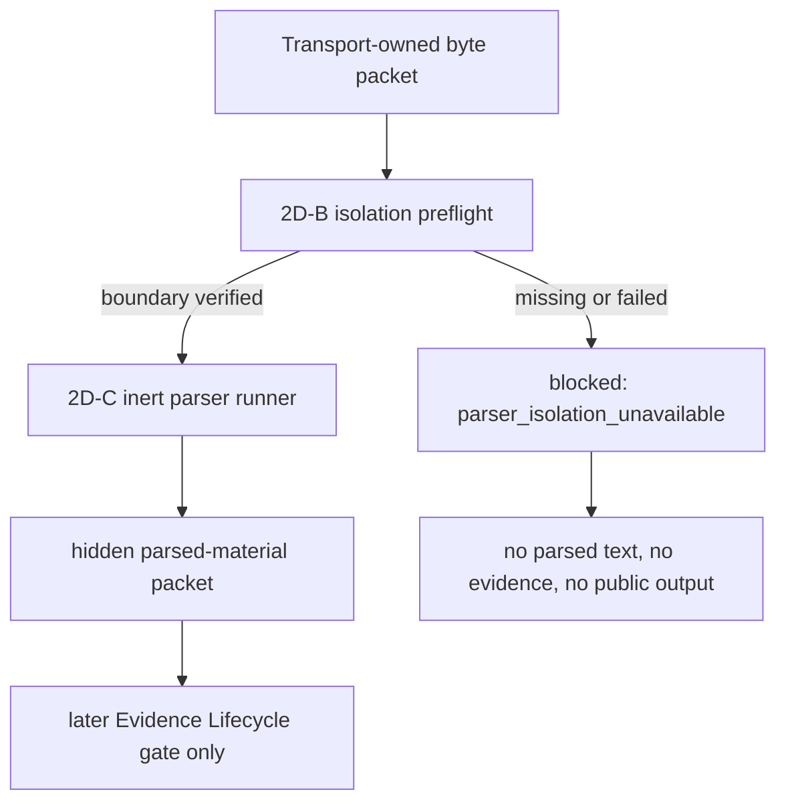

# V2 Slice 7N-3B3-2D-B OS-Level Parser Isolation Package

**Date:** 2026-05-16
**Status:** review-clean docs-only package; no source implementation approved
**Owner role:** Lead Architect / Captain deputy
**Predecessors:**
- `Docs/WIP/2026-05-16_V2_Slice_7N3B3-2D_Parser_Isolation_Design_Package.md`
- `Docs/WIP/2026-05-16_V2_Slice_7N3B3-2D-A_Fixture_Control_Parser_Runner_Source_Package.md`
- `Docs/AGENTS/Handoffs/2026-05-16_Lead_Architect_V2_X5_Hidden_Integration_Harness.md`

## 1. Purpose

Define the OS-level denial boundary required before V2 may parse real fetched bytes.

2D-A proved a child-process runner protocol over fixture/control bytes only. X5 proved hidden Claim Understanding to Query Planning to non-executable Source Acquisition handoff continuity. Neither gate proves that untrusted real fetched bytes can safely enter parser code.

This package is docs-only. It does not authorize parser source, real-byte parser execution, product wiring, live jobs, prompt/config/model changes, cache IO, Source Reliability, Evidence Lifecycle consumption of parsed text, or public result exposure.

## 1.1 Allowed Files For This Package

Allowed files:

- `Docs/WIP/2026-05-16_V2_Slice_7N3B3-2D-B_OS_Level_Parser_Isolation_Package.md`
- `Docs/STATUS/Current_Status.md`
- `Docs/STATUS/Backlog.md`
- one completion handoff under `Docs/AGENTS/Handoffs/`, if this package is committed after review
- `Docs/AGENTS/Agent_Outputs.md`, only if the active agent uses the standard exchange log instead of a handoff

Forbidden in this package:

- `apps/web/src/**`;
- `apps/web/test/**`;
- `apps/web/prompts/**`;
- `apps/web/configs/**`;
- `apps/api/**`;
- `apps/api.Tests/**`;
- `scripts/**`;
- `package.json`;
- `package-lock.json`;
- `Docs/AGENTS/V2_Gate_Register.json`.

Any need to touch a forbidden file stops this package and requires a separate reviewed source/proof package.

## 2. Consolidated Deputy Direction

After X5, the expert team compared four next-step options:

| Option | Verdict | Reason |
|---|---|---|
| 2D-B OS-level parser isolation package | APPROVE | Required security/governance prerequisite before real fetched-byte parsing. |
| Live-smoke readiness | DEFER | X5 is non-product and not live-job reachable; a live job would not exercise the X5 chain. |
| X3-B prompt alignment | BLOCKED | Requires explicit Captain/LLM Expert prompt approval. |
| Another implementation slice | DEFER | More plumbing risks mechanism creep before the parser isolation boundary is defined. |

One governance reviewer proposed a source proof, but the consolidated decision is to draft and review the OS-level denial package first. Source proof may follow only after this package is approved.

## 2.1 Package Review Result

Final deputy review result:

- Security/runtime isolation reviewer: `APPROVE`.
- LLM/Evidence Lifecycle reviewer: `APPROVE`.
- Senior Developer/runtime feasibility reviewer: initial `MODIFY`, then `APPROVE` after the package added an exact allowed-file envelope, forbade gate-register edits, tightened the docs-only verifier to catch untracked app/API/source/test/config/script files, and inserted a mandatory separate 2D-B proof package before any 2D-C parser work.

Review-clean decision:

- 2D-B is accepted as a docs-only OS-level parser isolation gate.
- It does not authorize source implementation or real fetched-byte parser execution.
- The next implementation-adjacent step must be a separate reviewed 2D-B proof package that chooses and proves one OS-level denial boundary. 2D-C parser work remains blocked until that proof package is approved and verified.

## 3. Current State

Already implemented:

- hidden source-acquisition candidate/network/content custody contracts;
- fixture/control packet sink and parser runner harness;
- hidden transport-owner real-byte handoff into packet sink, still blocked from parser consumption;
- hidden integration harness proving accepted Claim Understanding handoff continuity into hidden Query Planning and non-executable Source Acquisition request/handoff;
- public V2 cutover guard keeping public output damaged/blocked.

Still blocked:

- parser consumption of real fetched bytes;
- parsed text output from real fetched bytes;
- source-acquisition execution wiring;
- product/orchestrator/runner/API/UI/report/export reachability;
- live jobs;
- evidence items, EvidenceCorpus, applicability, extraction, sufficiency, warnings, verdicts, confidence, or report prose from parsed content;
- cache IO, durable raw/parsed storage, Source Reliability, prompt/model/config/schema edits, ACS/direct URL execution, V1 reuse, and V1 cleanup.

## 4. Decision Question

What OS-level denial boundary is acceptable before V2 can execute parser code over real fetched bytes?

The answer must be concrete enough that a later 2D-C source package can implement fail-closed runtime checks and tests. If no acceptable boundary is available in the supported local and deployment environments, real-byte parser execution remains blocked.

## 5. Required Security Properties

The parser boundary for real fetched bytes must deny:

- network access;
- inherited environment secrets;
- arbitrary filesystem read;
- arbitrary filesystem write;
- shell invocation;
- child-process spawning;
- worker-thread creation used as an escape path;
- native addon loading;
- WASI or equivalent host escape;
- provider SDK imports;
- cache/storage/config access;
- Source Reliability access;
- product/public/API/UI/report/export imports;
- V1 analyzer/prompt/type reuse.

Defense-in-depth mechanisms are allowed, but they are not sufficient alone:

- child process;
- stripped env;
- static import guards;
- Node permission flags;
- TypeScript brands;
- message protocol validation;
- timeout/cancellation handling.

These are required supporting controls, not the OS-level denial boundary.

## 6. Accepted Boundary Candidates

The later source package must choose exactly one reviewed boundary model.

| Candidate | Acceptable only if | Review concerns |
|---|---|---|
| Container sandbox | Network, filesystem, env, process, and writable paths are denied by container config and tested locally/CI/deploy. | Docker availability, Windows parity, deployment artifact access. |
| Separate OS user | Parser process runs as a restricted user with denied repo/secrets/network/write access. | Windows service/user setup, CI/deploy provisioning, cleanup. |
| OS sandbox | Platform sandbox such as Windows Job Object/AppContainer or equivalent with denied authorities. | Implementation complexity, portability, testability. |
| Reviewed equivalent | Provides the same denial properties with deterministic tests. | Must be explicit; "equivalent" cannot be prose-only. |

Not acceptable as the primary boundary:

- plain Node child process;
- Node `vm`;
- worker threads;
- browser parsing;
- Node permission flags alone;
- static import guards alone;
- convention or code review alone.

## 7. Fail-Closed Contract

Real fetched-byte parser execution must be blocked unless all of these are true:

1. The selected OS-level boundary is present.
2. Runtime verification confirms the boundary is active.
3. The parser request is bound to a valid 2C-A transport-owned packet/frame.
4. The content type is in the approved allowlist.
5. The byte count and digest match the packet/frame.
6. The parser policy version and runner version are approved.
7. Denied-authority probes pass for the current platform.

If any condition fails, the result is a structural blocked outcome such as `parser_isolation_unavailable`, not a fallback to child-process-only parsing.



## 8. Required 2D-B Proof Package Before 2D-C

This package does not choose the concrete OS-level boundary. It defines the denial requirements and blocks parser source until a separate 2D-B proof package selects exactly one boundary model and proves it.

Before any 2D-C parser work, a later reviewed 2D-B proof package must:

1. choose one boundary model from Section 6, or define an explicit reviewed equivalent;
2. define the exact production/runtime mechanism for Windows/local development and deployed runtime;
3. add fail-closed runtime checks for boundary availability;
4. add denial probes for env/secrets, filesystem, network, child/worker creation, native addon loading, writable paths, stdout/stderr leakage, timeout/cancel cleanup, and no orphan processes;
5. prove unavailable or failed isolation returns a structural blocked result such as `parser_isolation_unavailable`;
6. keep real fetched-byte parsing blocked until those proof verifiers pass.

If no boundary can be selected and proven, 2D-C remains blocked.

## 9. Future 2D-C Source Envelope

This package does not approve source edits. If a later 2D-B proof package is approved and verified, a later 2D-C source package may propose a minimal source envelope such as:

- `apps/web/src/lib/analyzer-v2-runtime/source-acquisition-content-parser-isolation.ts`
- one deployable worker/sandbox entrypoint if needed;
- focused analyzer-v2-runtime tests;
- `apps/web/test/unit/lib/analyzer-v2/boundary-guard.test.ts`;
- status/handoff docs.

The later package must not touch product runner, orchestrator, API, UI, reports, exports, prompts, configs, models, schemas, cache/SR, ACS/direct URL, V1 code, or X5 harness except for guard assertions if explicitly reviewed.

## 10. Content-Type Scope For First Real-Byte Parser

The first real-byte parser may only target inert textual formats:

- `text/plain`;
- `application/json` structurally only.

`text/html` remains blocked unless the later source package proves passive parsing with no script execution, subresource loading, link following, browser rendering, or active content execution.

Blocked until later packages:

- PDF;
- office documents;
- images;
- audio/video;
- archives;
- executable scripts;
- browser-rendered pages;
- dynamic content;
- credentialed/cookie-dependent content.

## 11. Parser Output Boundary

Allowed future structural output:

- parser attempt id;
- packet/frame id;
- content type policy id;
- parser policy id;
- runner/isolation version;
- byte count and digest references;
- structural parse status;
- bounded parsed-material packet reference;
- hidden diagnostics with structural stop reason only.

Forbidden output:

- raw bytes;
- URLs, domains, paths, headers, source names, snippets, provider JSON;
- unbounded parsed text in product/public objects;
- cache keys;
- Source Reliability scores;
- evidence items;
- source records;
- EvidenceCorpus;
- applicability, relevance, claim direction, probative value, sufficiency, warning materiality, verdict, confidence, or report prose;
- prompt/model telemetry;
- V1 type names or V1 prompt/model identifiers.

Parsed text is hidden intermediate material. It is not evidence and must not enter Evidence Lifecycle semantic tasks until a later reviewed LLM-owned gate.

## 12. Required Denial Tests For Later Source

A later source package must test at minimum:

- sandbox unavailable fails closed;
- sentinel env variables cannot be read or leaked;
- sentinel repo/CWD/temp files cannot be read;
- writes outside explicitly approved scratch space are denied;
- network calls are denied;
- child process spawning is denied;
- worker thread creation is denied or not available to parser code;
- native addon loading is denied;
- stdout/stderr are bounded and sanitized;
- timeout, cancellation, crash, malformed output, and oversize output clean up without orphan processes;
- no raw bytes, parsed text, URLs, headers, secrets, file paths, provider JSON, evidence, warnings, verdicts, confidence, or report prose appear in serialized outputs;
- worker/sandbox entrypoint is available in test and deployed Next runtime without dev-only loaders;
- default behavior blocks real fetched bytes when boundary proof is missing.

Windows checks are mandatory because the shared workspace is Windows.

## 13. Minimum Verifiers For This Docs Package

This package is docs-only. Minimum verifier:

```powershell
git diff --check
git status --short --untracked-files=all -- apps/web/src apps/web/test apps/web/prompts apps/web/configs apps/api apps/api.Tests scripts package.json package-lock.json Docs/AGENTS/V2_Gate_Register.json
```

The second command must return no files for the docs-only package. Gate-register edits are forbidden in this package; if the gate register must be touched, stop and open a separate reviewed register update.

## 14. Reviewer Questions

Reviewers must answer:

1. Is 2D-B the right next gate after X5?
2. Are the required denial properties complete enough?
3. Is the accepted-boundary candidate list concrete and testable?
4. Is child-process-only parsing correctly rejected for real fetched bytes?
5. Is the fail-closed contract strong enough?
6. Is the required separate 2D-B proof package explicit enough before 2D-C?
7. Is the future 2D-C source envelope narrow enough?
8. Are first-parser content types conservative enough?
9. Are parser outputs clearly blocked from evidence/report semantics?
10. Are Windows/dev and deployment constraints explicit enough?
11. Are the verifier expectations sufficient before source implementation?

If any answer is uncertain, return `modify` or `reject`; do not implement source.

## 15. Reviewer Prompt

> Review `Docs/WIP/2026-05-16_V2_Slice_7N3B3-2D-B_OS_Level_Parser_Isolation_Package.md` as a docs-only V2 OS-level parser isolation package after X5 and 2D-A. Return `approve`, `modify`, or `reject`. Confirm that it authorizes no source edits, real fetched-byte parser execution, product/public wiring, live jobs, prompt/model/config/schema changes, cache IO, Source Reliability, Evidence Lifecycle consumption of parsed text, ACS/direct URL execution, V1 reuse, V1 cleanup, or gate-register edits. Pay special attention to whether child-process-only parsing is clearly rejected for real fetched bytes, whether the package explicitly requires a separate 2D-B proof package to choose and verify one OS-level boundary before any 2D-C parser work, whether unavailable isolation fails closed, whether Windows/deployment constraints are testable, and whether the later 2D-C source envelope and verifiers are narrow enough.

## 16. Stop Conditions

Stop and return to deputy review before any of these:

- source implementation;
- parser execution over real fetched bytes;
- parser output consumed by Evidence Lifecycle;
- product/orchestrator/runner/API/UI/report/export wiring;
- public exposure;
- live jobs or Captain canary runs;
- prompt/config/model/schema edits;
- cache IO, durable raw/parsed storage, or Source Reliability integration;
- semantic text-analysis code;
- child-process-only real-byte parsing;
- dev-only parser worker loaders in production;
- ACS/direct URL execution;
- V1 reuse or V1 cleanup.
