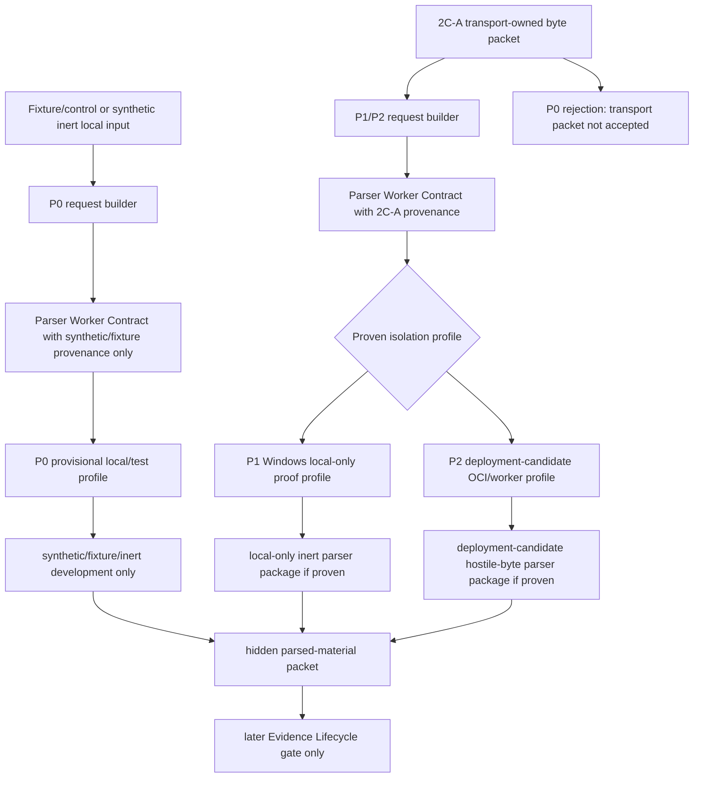

# V2 Slice 7N-3B3-2D-C0 Parser Worker Architecture And Provisional Isolation

**Date:** 2026-05-16
**Status:** draft review package; docs-only; no source edits approved
**Owner role:** Lead Architect / Captain deputy
**Baseline:** `dbd1b8d0` (`docs: record v2 parser isolation deployment direction`)
**Predecessors:**
- `Docs/WIP/2026-05-16_V2_Slice_7N3B3-2D_Parser_Isolation_Design_Package.md`
- `Docs/WIP/2026-05-16_V2_Slice_7N3B3-2D-B4_Windows_Local_Isolation_Alternative_Decision.md`
- `Docs/WIP/2026-05-16_V2_Slice_7N3B3-2D-B3_Provisioned_OCI_Deployment_Candidate_Proof_Package.md`

## 1. Purpose

Define the small architecture package for a future isolated parser worker and a provisional isolation profile.

Captain approved preparing for production local parsing of hostile external documents, but production-grade isolation does not have to be implemented immediately. This package creates the architectural seam now so parser code can be shaped correctly while real hostile-byte parsing remains blocked until a later proof gate.

This package is docs-only. It does not approve source edits, parser execution, product/public wiring, live jobs, prompt/config/model/schema changes, cache IO, Source Reliability, Evidence Lifecycle consumption, ACS/direct URL execution, V1 reuse, or V1 cleanup.

## 2. Decision

Introduce two separate concepts:

1. **Parser Worker Contract** - a stable parent-to-worker protocol that all future parser execution must use, regardless of isolation mechanism.
2. **Provisional Isolation Profile** - a temporary, local/test-only runtime profile that may support fixture/control and synthetic inert parser development, but is not a production hostile-document sandbox.

Production parser execution still requires a later accepted deployment-candidate isolation proof.

## 3. Architecture



The parser worker contract is the stable seam. Isolation profiles can change without changing parser semantics or product/public interfaces.

## 4. Parser Worker Contract

Every future parser worker request must carry only structural data:

- request id;
- parser worker contract version;
- parser policy id;
- isolation profile id;
- content-type policy id;
- input provenance id:
  - for P0, only fixture/control or synthetic inert provenance ids;
  - for P1/P2, 2C-A transport-owned packet/frame ids only after the relevant proof gate;
- byte count;
- byte digest;
- transfer mode, such as fixture/control, synthetic inert, local-only, or deployment-candidate;
- maximum input bytes;
- maximum output bytes;
- timeout;
- cancellation token reference;
- no URL, headers, source name, provider JSON, evidence, prompt/model telemetry, cache keys, SR data, report prose, or V1 identifiers.

Every future parser worker response must carry only structural data:

- request id;
- contract version;
- parser policy id;
- isolation profile id;
- status;
- byte digest reference;
- parsed-material packet id or blocked reason;
- bounded text length and metadata counts;
- disposal status;
- sanitized diagnostics;
- no raw bytes, unbounded parsed text, URLs, headers, source identifiers, evidence, warnings, verdicts, confidence, report prose, prompt/model telemetry, cache keys, SR data, or V1 identifiers.

The parent process must treat every response as untrusted until schema validation and provenance checks pass.

## 5. Isolation Profiles

| Profile | Purpose | Authority | Unlock |
|---|---|---|---|
| `P0_PROVISIONAL_LOCAL_INERT` | Local/test parser contract development with fixture/control or synthetic inert bytes only. | Process hygiene and defense-in-depth only; not a security boundary. | No real hostile fetched-byte parsing, no deployment, no product/live. |
| `P1_WINDOWS_LOCAL_DENIED_AUTHORITY` | Local-only parser proof using a real Windows denied-authority boundary. | AppContainer/restricted identity or reviewed equivalent plus probes. | May unlock later reviewed local-only inert parser source package. |
| `P2_DEPLOYMENT_CANDIDATE_ISOLATED_WORKER` | Production local parsing of hostile external documents. | Rootless OCI or deployment-equivalent isolated parser worker accepted by Architect/Security. | May unlock later reviewed deployment parser source package. |

Only P2 can support broader production release with local parsing of hostile external documents.

## 6. Provisional Isolation Profile P0

P0 exists to avoid blocking all parser-interface development while the production isolation story is being prepared.

P0 may include:

- one-shot child process;
- absolute executable path;
- `shell: false`;
- no PATH lookup;
- `windowsHide: true`;
- pipe-only stdio;
- empty or strictly allowlisted environment;
- non-repo working directory;
- bounded stdin/stdout/stderr;
- timeout and cancellation cleanup;
- Node defense-in-depth flags when supported;
- static import guards blocking network, provider SDK, cache, config, SR, product/public, Evidence Lifecycle, V1, shell, child-process, native-addon, and filesystem owner imports except reviewed bootstrap code;
- sentinel checks proving diagnostics do not leak env, paths, raw bytes, parsed text, URLs, provider JSON, evidence, warnings, verdicts, confidence, or report prose.

P0 must be labelled in code and docs as:

```text
provisional_local_inert_only_not_security_boundary
```

P0 must not process:

- real fetched bytes;
- 2C-A transport-owned packets;
- arbitrary user URLs;
- HTML fetched from the network;
- PDFs, office documents, archives, images, browser-rendered pages, executable content, WASM, native-code parser inputs;
- production or staging traffic.

P0 must return a structural blocked result if asked to parse anything outside fixture/control or synthetic inert inputs.

P0 must specifically reject any request carrying 2C-A transport-owned packet/frame provenance, even if the content type appears inert.

## 7. Why P0 Is Still Useful

P0 lets the team build and test:

- request/response schemas;
- parent/worker lifecycle;
- bounded output and error mapping;
- timeout/cancellation behavior;
- parser policy plumbing;
- hidden parsed-material packet shape;
- no-public-leak guards;
- future P1/P2 integration seams.

P0 prevents parser logic from being written directly in product/orchestrator code. That is the main architectural value.

P0 is not a reason to postpone P2 before broader release. It is a way to keep core V2 implementation moving without normalizing unsafe production parsing.

## 8. Future Source Package Shape

A later P0 source package, if approved, may propose a narrow source/test envelope such as:

- parser worker contract types;
- parser worker request/response schemas;
- hidden provisional worker runner;
- fixture/control or synthetic inert text parser only;
- boundary guard tests;
- no product/orchestrator/runner/API/UI/report/export wiring;
- no Evidence Lifecycle consumption.

The source package must explicitly reject real fetched bytes and 2C-A packet consumption.

A later P1 or P2 source package must not reuse P0 as the security boundary. It may reuse the parser worker contract and schemas.

## 9. Infomaniak Production Path

Because Captain wants to prepare for production local parsing of hostile external documents, the production architecture should be evaluated separately before broader release.

Preferred deployment architecture:

- keep current web/API hosting unchanged initially;
- add a separate isolated parser worker service or container-capable runtime;
- communicate through an internal structural contract;
- keep parser output hidden and non-public;
- fail closed if the parser worker is unavailable or the isolation proof is missing.

If production remains on Infomaniak managed Node.js hosting without an isolated parser worker or equivalent denied-authority boundary, real fetched-byte parser execution remains disabled in deployment.

## 10. Capability Roadmap

V2 capability readiness is staged. "Pipeline ready" does not mean every input type is ready.

| Capability | Earliest profile | Required gates | Public/product status |
|---|---|---|---|
| Direct text analysis | Core V2 pipeline | Claim Understanding, Evidence Lifecycle, Sufficiency, Boundary, Verdict, Result Writer, cutover gates | First production target |
| Fixture/control parser-interface tests | P0 | C0 architecture plus later reviewed P0 source package | Hidden local/test only |
| Synthetic inert parser tests | P0 | Same as fixture/control; no 2C-A packet provenance | Hidden local/test only |
| Simple web page text/HTML parsing | P1 or P2 | Source acquisition, content dereference, parser worker, passive text/HTML parser source package, isolation proof, parsed-material lifecycle, Evidence Lifecycle intake gate | Not available until reviewed parser and Evidence Lifecycle gates pass |
| Production local parsing of hostile web pages | P2 | Deployment-candidate isolated parser worker, accepted proof, no-public-leak proof, operational deployment decision | Before broader release if web-page input is part of the release promise |
| PDF parsing | Later high-risk profile | Separate PDF parser package, stronger isolation, parser-library approval, malformed/adversarial PDF tests, resource-exhaustion limits | Later than simple web pages |

Direct text should remain the first production-ready V2 path. Simple web page support can follow once parser-worker and Evidence Lifecycle gates are reviewed. PDF support must not be bundled into the first web-page parser package.

## 11. Required Guardrails

Any later source package must preserve:

- no product/public parser reachability;
- no live jobs from parser gate;
- no Evidence Lifecycle consumption from parsed material;
- no cache/SR/storage writes;
- no prompt/model/config/schema edits unless separately approved;
- no ACS/direct URL execution;
- no V1 reuse or cleanup;
- no parser output in public report/export/API fields;
- no parser semantics that classify, summarize, translate, rank, or infer meaning.

Parser code is structural plumbing only. Meaning stays LLM-owned in later Evidence Lifecycle gates.

## 12. Review Questions

Reviewers must answer:

1. Does this package keep production-grade isolation postponed without weakening the security invariant?
2. Is P0 narrow enough and clearly labelled as not a security boundary?
3. Is the parser worker contract useful and stable enough to avoid future refactoring?
4. Are P1/P2 upgrade paths clear?
5. Is the Infomaniak production path framed clearly enough?
6. Is the direct-text -> web page -> PDF capability sequence explicit enough?
7. Are source stop conditions strong enough?

Return `approve`, `modify`, or `reject`. If review returns `modify` or `reject`, do not draft the P0 source package until this architecture is corrected and re-reviewed.

## 13. Reviewer Prompt

> Review `Docs/WIP/2026-05-16_V2_Slice_7N3B3-2D-C0_Parser_Worker_Architecture_And_Provisional_Isolation.md` as a docs-only architecture package. Return `approve`, `modify`, or `reject`. Confirm that it creates a parser-worker seam and a P0 provisional profile without authorizing real hostile fetched-byte parsing or production deployment. Verify that P0 is clearly not a security boundary, is limited to fixture/control or synthetic inert inputs, and cannot consume 2C-A packets. Confirm that P1/P2 remain required for local-only real-byte or deployment-candidate parser work, that Infomaniak deployment implications are preserved, and that product/public/live/cache/SR/Evidence/V1 behavior remains blocked. Verify that capability readiness is explicitly staged: direct text first, simple web pages only after parser-worker/isolation/Evidence Lifecycle gates, PDFs only through a later high-risk package.

## 14. Stop Conditions

Stop before any:

- source implementation;
- parser execution;
- 2C-A packet consumption;
- real fetched-byte parsing;
- product/orchestrator/runner/API/UI/report/export wiring;
- live jobs;
- prompt/config/model/schema edits;
- cache/SR/storage writes;
- Evidence Lifecycle consumption;
- ACS/direct URL execution;
- V1 reuse or cleanup;
- treating P0 as a production or hostile-document security boundary.
