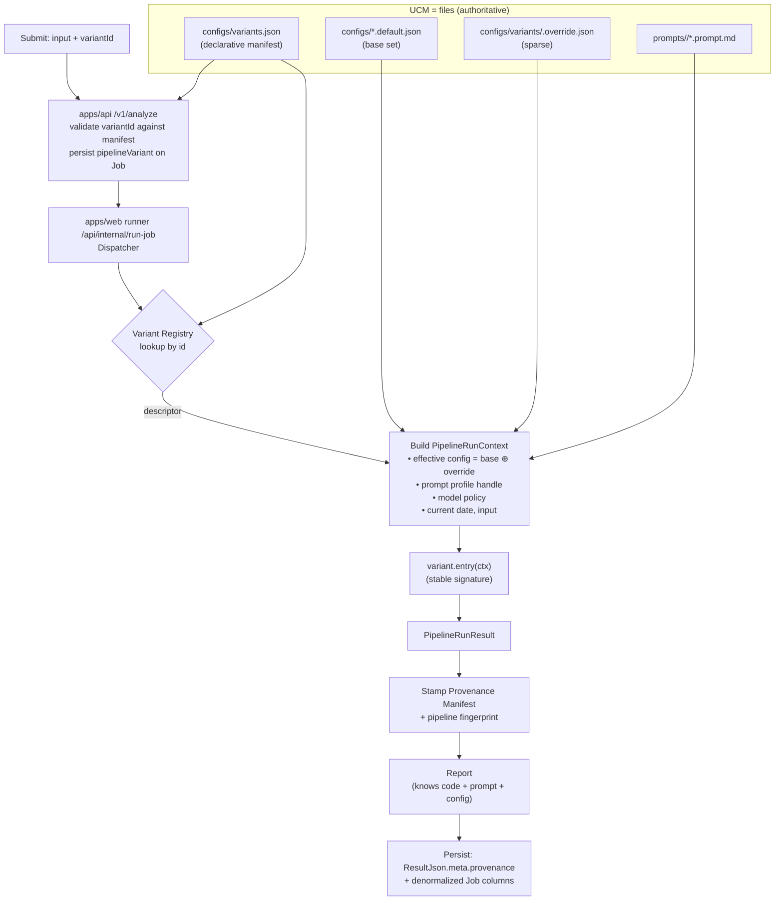

# Multi-Variant Pipeline Architecture

> **⚠ STATUS 2026-06-04 — DEFERRED / DECOUPLED CAPABILITY.** After the Gemini scoped review, the Captain chose a **worktree-native era-comparison study** for the near-term goal — see **[`2026-06-04_Pipeline_Era_Comparison_Worktree_Study_Plan.md`](2026-06-04_Pipeline_Era_Comparison_Worktree_Study_Plan.md)**. This in-tree design (registry + Stage-1 pin + file-authoritative UCM + embedded provenance) is **not discarded**: it is the design for a **separate, deferred capability** to pursue *only if forward variant testing is wanted*. The Codex/Gemini reviews and all decisions below remain valid **for that capability**. Do not start implementing this doc unless the capability is explicitly revived.

**Date:** 2026-06-04
**Role:** Lead Architect
**Status:** Proposal — reviewed (Codex GPT-5.5, 2026-06-04: *commit-with-required-changes*); all required changes folded in. No code changed.
**Owner:** Captain (active human) → Lead Architect
**Companion docs:** [Specification](2026-06-04_Multi_Variant_Pipeline_Specification.md) · [Implementation Plan](2026-06-04_Multi_Variant_Pipeline_Implementation_Plan.md) · [Codex review prompt](2026-06-04_Multi_Variant_Pipeline_Codex_Review_Prompt.md)

> **Codex review (2026-06-04) incorporated.** Verdict *commit-with-required-changes*; all 3 blockers + required changes accepted (none refuted — two spot-verified against source). Changes: factual baseline corrected (variant **persisted** but not yet execution-dispatched — runner/UI/retry surfaces added to Phase 0); `ClaimContract` payload expanded (full post-selection understanding + prelim evidence + geo/lang + Gate-1 stats + selection meta; immutable contract + mutable working copy); prompt-profile threading added (24 hardcoded `loadAndRenderSection("claimboundary",…)` sites; Stage-1→HEAD vs Stages-2-5→variant); config-DB removal blast radius widened (job config/prompts endpoints, admin UI, tests, snapshot **write**); fingerprint reframed as a **setup fingerprint** (resolved concrete model ids; `environment` block recorded but excluded); risks added (API cross-app file path, substring-anchor guardrail, API git-from-BaseDirectory).

---

## 1. Purpose

Enable FactHarbor to **test different pipeline variants in parallel** along three axes — **source code, prompt, and UCM config** — and to **add / remove / replace** pipeline implementations cheaply. Make every report self-describing about exactly which code, prompt, and config produced it, so any variant can be reasoned about, compared, and rebuilt later.

Captain intent, restated:

> Support running and comparing multiple pipeline variants at once. Make variants easy to add/remove/replace. UCM default files are always authoritative and editable by agents and users — no sophisticated UCM editing UI is needed. A single default set of UCM values exists; each variant overrides only a sparse subset of it. Prompts are **per-variant** (each variant owns its prompt). The **AtomicClaim generation + selection *logic* is the same (pinned to HEAD) for every variant** — identical claim *output* is not required. Each report must know the configs, prompt, and pipeline source (commit + fingerprint) used to produce it. The future ask is: *"Rebuild a pipeline variant that does the same as the pipeline at commit X on branch Y."*

This document is the **architecture**. It does not edit source, prompts, config, or tests. Decisions confirmed by Captain on 2026-06-04 are marked **[confirmed]**.

### Locked decisions (Captain, 2026-06-04)

A cold reviewer can treat these as settled; the rest of the doc is the rationale and mechanics.

1. **Variant coexistence — in-tree registry** (declarative `configs/variants.json` + code binding `variants/registry.ts`). Not process-per-variant. (§3.1)
2. **Parallelism — per-job selection + matrix run** (one input → N variants → comparison view). (§5)
3. **UCM — files authoritative; base set + sparse per-variant key override** (deep-merge by key; arrays/scalars replace; Zod-validated). Config DB, versioning/activation, and editing UI **removed**; read-only inspector kept. (§4, §7)
4. **Prompt sharing — Phase 1 wholesale per-variant (Option A);** section base+override (Option B) is gated and **currently dropped** for this population. (§4.3a)
5. **Stage 1 (claim generation + selection) *logic* pinned to HEAD for all variants;** identical claim *output* not required; a variant = **Stages 2–5 only**. (§3.3)
6. **Provenance — each report embeds `meta.provenance` + a pipeline fingerprint** (variantId + commit + Stage-1 logic fingerprint + downstream prompt hashes + effective-config hashes + model map). Config embedded; prompt by reference (hash + git). (§6)
7. **Variant scope (build now): `quality_before_decline`, `Quality_Top_Peak`, `2before_bol_fix`;** `Deployed_6.Apr` + `deployed_22.4` deferred. (§3.3)
8. **Two bounded prerequisite refactors (not a rewrite): the Stage-1 `ClaimContract` seam (Phase 0b) and in-stage config-threading for override correctness (Phase 1).** No general "refactor-first" phase — the pipeline is already decomposed. (Plan §Guiding constraints)
9. **§11 review questions resolved** (module layout, merge semantics, prompt capture, matrix identity, manifest sync).

---

## 2. What already exists (so we build, not rebuild)

The codebase was originally built for **multiple variants** and later collapsed to one. The seams remain — this is the strongest "lean, not new machinery" argument.

| Existing seam | Where | Status today |
|---|---|---|
| `pipelineVariant` field on the job | `apps/api/Data/Entities.cs` (`JobEntity`), `JobService.CreateJobAsync` line ~32 | Persisted at creation (default `"claimboundary"`); **reproducible even if defaults change** — exactly the provenance principle we want |
| `pipelineVariant` in submission body | `apps/api/Controllers/AnalyzeController.cs` `CreateJobRequest` | Accepted, but allowlist hardcoded to `["claimboundary"]` (~line 57) |
| `pipelineVariant` on retry | `apps/api/Controllers/JobsController.cs` `RetryJobRequest` (`:206`), `newPipelineVariant` (`:245`) | Accepted on retry **with no allowlist validation** — a second acceptance surface Phase 0 must guard |
| Single-dispatcher pattern | Historical "Pipeline Variants" doc | `claimboundary` + `monolithic_dynamic` once dispatched from one runner; variants since removed |

> **Factual baseline (corrected per 2026-06-04 Codex review):** `pipelineVariant` is **persisted** end-to-end (create + retry) but **execution is NOT variant-dispatched today** — the web runner types the variant as only `"claimboundary"` and always calls `runClaimBoundaryAnalysis` (`apps/web/src/lib/internal-runner-queue.ts:17, :231`), and the analyze UI hardcodes the variant (`apps/web/src/app/analyze/page.tsx:26`). So Phase 0 must wire **four** surfaces: API create validation, **retry validation**, runner dispatch, and UI/API selection.
| Common result envelope | report `meta` (`pipeline`, `modelsUsed`, `searchProvider`, `promptContentHash`, …) | Present; needs provenance completion |
| Per-pipeline prompt loading | `apps/web/src/lib/analyzer/prompt-loader.ts` (`loadPromptFile(pipeline)`, SHA-256 `hashContent`) | Keyed by "pipeline" name — generalizes to "profile" |
| Per-task model routing | `apps/web/src/lib/analyzer/llm.ts` `getModelForTask` | Config-driven (`modelUnderstand`, `modelExtractEvidence`, `modelVerdict`) |
| Commit provenance | `apps/web/src/lib/build-info.ts`, `apps/api/Helpers/AppBuildInfo.cs` | `GIT_COMMIT` env → `git rev-parse HEAD`; dirty tree → `<hash>+<wt8>` |
| V2 isolation pattern | `Docs/WIP/2026-05-12_Pipeline_Rebuild_Target_Specification_Draft.md` §4.2, §6 | `analyzer-v2/` isolation + `ReportResult` provenance skeleton → **becomes one entry in the registry below** |

> **Relationship to the May-12 Pipeline-Rebuild spec.** That spec proposed *one* clean V2 replacing V1 in an isolated `analyzer-v2/` namespace. This proposal **generalizes** it: the isolated-namespace-with-stable-entry pattern becomes the *general* variant model, and `analyzer-v2`'s `runClaimBoundaryPipelineV2(context)` is simply one more registry entry. Its `ReportResult` run-metadata skeleton ("prompt/config/model hashes when available") and config-snapshot concept are adopted as the provenance manifest in §6. The dropped *implementation* of V2 (per project memory) is not ported.

---

## 3. Core concept: the Pipeline Variant

A **Pipeline Variant** is a named, self-contained analysis implementation — the unit you add/remove/replace and the unit you test in parallel. A variant is fully defined by a tuple over the three experiment axes:

| Axis | What it is | Sharing model |
|---|---|---|
| **Code** | A variant module exporting a stable entry function, in-tree, selected via a registry | Per-variant (the primary experiment axis) |
| **Prompt** | A prompt profile — see §4.3a | **Phase 1: wholesale per-variant (Option A).** Section-level base+override (Option B) is the *eventual shape*, **gated** (see §4.3a) |
| **Config (UCM)** | Effective config = a single **base default set** merged with the variant's **sparse key override** | **Shared base + sparse per-variant override** [confirmed] |

> **Prompt sharing — decided by the 2026-06-04 `/debate` (verdict: MODIFY, see §4.3a).** Config and prompts *could* share one base+override mental model, and Option B is designed so that **wholesale-per-variant (A) is exactly B with no base**. But the debate found that *building B's section-merge machinery now* is premature: it adds a section-merge resolver + a coherence validator that A does not need, before the variant population (§11/G1) tells us whether section-level sharing is even wanted. So Phase 1 ships **A**, and B is adopted later only if a real shared-base need appears — at zero rework cost, because A is B's base-less special case.

Two reports are produced by "the same pipeline" iff their **(variantId, code commit, Stage-1 logic fingerprint, downstream prompt hashes, effective config, model map)** tuple matches — captured as one **pipeline fingerprint** (§6.3). "Same" is *behavioral*, not bit-exact: LLM nondeterminism is expected and, under alpha, wanted — so equal fingerprints mean "same reproducible setup," not "identical output."

### 3.1 Variant coexistence: in-tree registry [confirmed]

All variants are modules compiled into the single web build and selected per job by id via a registry. Rebuilding "what commit X did" means **re-implementing it as a new in-tree variant module** pinned to its own prompt + config — not running the old process. (For the current population this means re-implementing tag X's **Stages 2–5** on HEAD's claims — see §3.3.) (Rejected alternative: process-per-variant / worktree-per-variant — heavier infra, N processes, cross-process routing; closer to the abandoned Pipeline_V2 machinery. See §10.)



### 3.2 The Variant Registry (declarative manifest + code binding)

The registry has two halves so that *most* of "add a variant" is declarative and file-editable, with exactly one unavoidable code touch (the entry import):

- **Declarative manifest** — `apps/web/configs/variants.json`. Lists each variant's `id`, `title`, `description`, `status`, `promptProfile`, `configOverrideFile`, and metadata. Read by **both** the C# API (for the submission allowlist) and the web runner (for dispatch metadata). Editable by agents/users — fits the files-authoritative model.
- **Code binding** — `apps/web/src/lib/analyzer/variants/registry.ts`. Maps `id → entry function`. The only part that must be code, because an entry function cannot live in JSON.

**Add** = add a module under `variants/<id>/` + one registry binding + a manifest row + a prompt profile + (optional) an override file.
**Remove** = delete module + binding + rows/files. Historical reports stay readable via embedded provenance.
**Replace** = register a **new id** and deprecate the old (never silently mutate an existing id's behavior — that destroys comparability).

The existing `runClaimBoundaryAnalysis` becomes the `claimboundary` variant's entry (via a thin context adapter). No stage code changes.

### 3.3 Stage 1 pinned to HEAD: same claim-selection *logic* for every variant [confirmed 2026-06-04]

**Captain constraint:** the AtomicClaim generation + **selection logic** must be the same for every variant — fixed to HEAD. **Identical claim *output* across variants is NOT required** (claim extraction is a nondeterministic LLM step; run-to-run variance is fine under alpha). What must be constant is the *logic*, not the selected claims.

Therefore:

- **Stage 1 (Understand)** — claim generation (including its preliminary-grounding search), Gate 1, and final claim selection — is a **shared component pinned to HEAD** (code + prompt sections + config). Its logic is **excluded from every variant's override scope**; a historical variant does **not** reuse its era's claim-selection.
- A **variant is Stages 2–5 only** (Research → Boundary → Verdict → Aggregation). Each variant run executes HEAD's Stage-1 logic to obtain *its own* `ClaimContract`, then runs its Stages 2–5 on it. The variant **must not re-implement or override** claim generation/selection — it receives claims via `PipelineRunContext`.
- Implementation: Stage 1 is run by the dispatcher/context-builder (so the variant module physically contains only Stages 2–5 and cannot drift the logic). Whether it runs **per job** is the default; running **once per matrix input-group and sharing** the claims is an *optional* cost/fairness optimization (§5.2) — not required, since identical claims aren't required.
- Stage-1 prompt sections (`CLAIM_EXTRACTION_*`, `CLAIM_SELECTION_*`, `CLAIM_CONTRACT_*`, etc.) and Stage-1 config are **always HEAD's**. The variant owns only the downstream sections (`GENERATE_QUERIES`, `EXTRACT_EVIDENCE`, `BOUNDARY_CLUSTERING`, `VERDICT_*`, `ARTICLE_ADJUDICATION`, …).
- **Control/provenance marker = the Stage-1 *logic* fingerprint** (hash of HEAD's Stage-1 code+prompt+config), recorded on every report to prove the same selection logic was used. The per-run `claimContractHash` is also recorded for transparency but is **not** expected to be equal across variants.

**`ClaimContract` payload (corrected per 2026-06-04 Codex review — the thin `{understanding, languageIntent, selectedClaims, gate1}` sketch was insufficient).** Downstream stages read/mutate more Stage-1 products than that: research consumes preliminary evidence remapping (`research-orchestrator.ts:484`) and language/geography (`:1171`), boundary formation reads selected claims (`boundary-clustering-stage.ts:109`), and Gate 4 reads claim stats (`aggregation-stage.ts:476`). The contract must therefore carry the **full selected `CBClaimUnderstanding` payload** plus: language intent; preliminary evidence/seeds; distinct-events data; inferred geography/language; Gate-1 stats; and claim-**selection** metadata (selected IDs, finality). **Mutability boundary:** the canonical `ClaimContract` is **immutable** (it is what `claimContractHash` hashes and what provenance records); the variant operates on a **working copy** it may mutate for its own Stages 2–5. Stage 1 today both writes `understanding`/`languageIntent` and *mutates/filters* `understanding` during selection (`claimboundary-pipeline.ts:781, :891`), so the split must snapshot the post-selection state as the immutable contract.

**The variant population (G1, resolved 2026-06-04)** — five historical tags on `main`, each **code-divergent** in `apps/web/src/lib/analyzer` vs HEAD (so each is a genuine module rebuild, not an override-only variant):

| Variant (tag) | Commit | Date | Divergence type | Scope (Captain 2026-06-04) |
|---|---|---|---|---|
| `quality_before_decline` | `d3ad26ca` | 2026-03-08 | code+prompt+config (deep: 42 analyzer files) | **✅ Build now (Phase 3c)** — pre-decline baseline |
| `Quality_Top_Peak` | `b7783872` | 2026-04-04 | code+prompt+config (21 analyzer files) | **✅ Build now (Phase 3c)** — peak |
| `Deployed_6.Apr` | `f1a372bf` | 2026-04-06 | code+prompt+config (20 analyzer files) | Deferred (add later via registry) |
| `deployed_22.4` | `2f7a2805` | 2026-04-22 | code+prompt+config (moderate, 16 files) | Deferred |
| `2before_bol_fix` | `d528b62c` | 2026-05-25 | code+prompt+config (moderate, 16 files) | **✅ Build now (Phase 3c)** — recent |

The three selected span the timeline (early-March baseline → early-April peak → late-May recent), giving good coverage for downstream quality attribution. The two deferred tags are pure additive work later — a registry entry + module — with no rework to the foundation.

Because all five are code-divergent **historical rebuilds**, their downstream prompts are carried **wholesale (Option A)** for fidelity; there is **no section-sharing need among variants** (Stage-1 sharing is handled by the hoist, not by prompt merge). → **Option B / Plan Phase 3b is dropped for this population.**

**Rebuild semantics (refined):** a rebuilt variant reproduces **tag X's Stages 2–5, fed by HEAD's claim-selection logic** — *not* tag X's full original behavior (which used tag X's own Stage 1). Each module needs a small **ClaimContract adapter** mapping HEAD's claim shape to what that era's downstream stages expected. This is intentional: it holds the claim-selection *logic* constant across eras so the comparison reflects downstream-pipeline differences, not differences in how each era picked claims. (Claims still vary run-to-run; that's accepted.)

---

## 4. UCM: layered override, files authoritative [confirmed]

### 4.1 Runtime model

- The JSON files under `apps/web/configs/` are the **runtime source of truth**, read directly (with caching). The SQLite config DB (`config_blobs`, `config_active`), versioning, activation, rollback, history, and the editing UI are **removed**. This directly resolves the long-standing pain that "code defaults only seed new DBs; production config.db retains old values" — there is no DB to drift.
- A **read-only inspector** is kept (§7): per report, view the effective config, the overrides, the prompt, and the fingerprint. Reports must *know* their config, so inspection stays valuable even without editing.

### 4.2 Base set + sparse per-variant override

- **Base default set** = the existing `apps/web/configs/{pipeline,search,calculation,sr}.default.json`. One complete set of values, shared by all variants.
- **Per-variant override** = `apps/web/configs/variants/<id>.override.json`, containing **only** the keys that variant changes, grouped by config type:

```jsonc
// configs/variants/cb-openai.override.json
{
  "pipeline": { "llmProvider": "openai", "modelVerdict": "gpt-5.5" },
  "search":   { "maxResults": 8 }
}
```

- **Effective config** = `deepMerge(base[type], override[type] ?? {})`, then validated against the existing Zod schema in `config-schemas.ts`. Merge is structural plumbing (allowed; not a semantic decision). Array semantics: **replace, not concat** (predictable overrides). Invalid overrides fail loudly at resolution.
- **Prompts use a separate model — see §4.3a.** Config keys deep-merge because they are independent scalars with a Zod validator; prompt sections are coupled prose with no validator, so they get their own (more conservative) sharing model.

### 4.3 Sharing proposal — which UCM categories are shared vs per-variant

**Principle: the share / no-share line is the control-variable vs independent-variable line of the experiment.** The base set holds the *controls* constant for a fair comparison; an override declares the *dimensions this variant is testing*. Every override is therefore a recorded **confound**, surfaced in provenance (§6) so any comparison knows what actually differs.

| UCM category | Default behavior | Override allowed? | Rationale |
|---|---|---|---|
| `pipeline` (models, temperatures, budgets, stage flags) | Base provides defaults | **Yes** — sparse keys (e.g. `llmProvider`, `modelVerdict`) | A variant's tuning *is* often what's under test |
| `search` (providers, limits) | Shared base | Yes, only if the variant tests retrieval | Usually a control variable |
| `sr` (source reliability) | Shared base | Yes, only if the variant tests SR | Usually a control variable |
| `calculation` (scoring, calibration) | Shared base | Yes, only if the variant tests scoring | Usually a control; **most likely opt-out** |
| `prompt` | — | Phase 1: **wholesale per-variant**; Option B (section base+override) gated — §4.3a | prompt is an experiment axis; section sharing deferred pending G1 |
| variant **code** | — | Per-variant module | Primary experiment axis |

Editing a **base** file is a **cross-variant event**: it shifts every variant for all non-overridden keys at once, and breaks historical comparability for new runs. That is acceptable and intended (it is how you move the shared baseline), and it stays reproducible-by-record because each report pins the exact base + effective hashes it used (§6).

### 4.3a Prompt sharing model (decided by 2026-06-04 `/debate`, verdict MODIFY)

Prompts are deliberately **not** put on the config deep-merge model. The design space and the decision:

| Option | What it is | Status |
|---|---|---|
| **A — wholesale per-variant** | Each variant owns a complete, self-contained prompt profile; no inheritance | **Phase 1 ships this** |
| **B — section base + override (base optional)** | Base profile supplies all named sections; a variant replaces specific whole sections; **A = B with no base** | Eventual shape; **gated** (below) |
| **C — locked-shared vs owned sections** | Some sections (schema, multilingual, terminology, warning) locked-shared; rest variant-owned | Considered; rejected for now (adds a taxonomy before it's needed) |

**Why A-first, not B-now.** The debate (FULL tier; Reconciler verdict MODIFY, confidence SPECULATIVE) found that building B's section-merge resolver + coherence validator *before* the variant population is known is machinery-first risk (the Pipeline_V2 failure mode, §10). Because A is precisely B with no base, shipping A forecloses nothing and the eventual A→B move is a focused, tested refactor at zero rework cost. The prompt-loader is already section-addressed (`loadAndRenderSection`, ~30 named sections), so B remains cheap to add when justified.

**The gate (both must hold before B / base-optional is built):**
1. **G1 pinned** — a concrete variant-population table (variant · divergence type · sections affected). If variants are config/model-only or historical rebuilds, A is sufficient and B is never built. If genuine section-level divergence is confirmed, build B. **Status 2026-06-04: G1 resolved (§3.3) — the population is five code-divergent historical rebuilds with wholesale downstream prompts and Stage-1 shared by hoist; no section-sharing need → B is NOT built (Phase 3b dropped). The text below is retained only as the rule for a future population that does need sharing.**
2. **A section-presence/completeness validator exists** — the precise coherence gap the debate surfaced: whole-section replacement catches *malformed* sections and a render/schema test catches *malformed renders*, but **neither catches a variant that silently drops a base section** (e.g. omits the neutrality/language directive) — it still renders valid schema. B's safety therefore requires a validator that asserts every *required* section is present in the merged result, not just well-formed.

**When B lands:** whole-section replacement only (no partial/append merge — avoids the additive-repair-drift failure); editing a base section is a cross-variant prompt change routed through the AGENTS.md prompt-review + LLM-Expert gate, scoped to inheriting variants; provenance records `overriddenSections` (§6).

### 4.4 Fate of the TS constants and the drift test

- `DEFAULT_*_CONFIG` constants in `config-schemas.ts` remain as the **Zod default source and the fallback** used only when a file is missing/unreadable. Files win at runtime.
- `config-drift.test.ts` is **kept**, with its role re-pointed: it guarantees the TS fallback never silently contradicts the authoritative JSON. (Still "JSON is authoritative for defaults," now literally at runtime.)

---

## 5. Dispatch and parallelism

### 5.1 Per-job selection (foundation) [confirmed]

1. `/v1/analyze` receives `pipelineVariant`; the API validates it against the active ids in `variants.json` (replacing the hardcoded allowlist).
2. The variant id is **persisted on the Job at creation** (already happens) — reproducibility even if the manifest changes later.
3. The runner's **Dispatcher** resolves the descriptor from the registry, builds `PipelineRunContext`, and calls `variant.entry(ctx)`. Unknown/inactive id → fail fast with a clear error. Concurrency is unchanged (`FH_RUNNER_MAX_CONCURRENCY`, default 3) — different jobs running different variants run concurrently for free.

### 5.2 Matrix run (comparison) [confirmed]

A thin layer on top of per-job selection: submit **one input**, fan out to **N variants**, get N reports plus a comparison view.

- A `MatrixRun` groups N child jobs by a shared `matrixRunId` + a shared `inputGroupId` (so the input is identical across arms). Each child is an ordinary job with its own `pipelineVariant` — it flows through the exact same dispatch path, so nothing about the single-job path is special-cased.
- **Stage-1 logic is HEAD on every arm (§3.3).** Optionally, run Stage 1 **once per input-group** and share the resulting claims across all N arms — cheaper than N extractions, and it also removes claim variance as a confound. This is an *optimization*, not a requirement (identical claims aren't required); per-arm extraction is equally valid and surfaces claim-selection variance too. Either way, every arm's provenance records the same **Stage-1 logic fingerprint**; the per-arm `claimContractHash` is recorded but only equal across arms when the shared-once mode is used.
- A **comparison view** renders the N reports side by side: verdict / truthPercentage / confidence deltas, evidence-pool overlap, and a **provenance diff** (which axes differ — code commit, prompt hash, overridden config keys). The provenance diff is what tells you whether a verdict difference is attributable to a controlled axis or a confound.
- Reuses existing diag intuition (e.g. `verdict-direction-instability.cjs` already clusters by commit+prompt; here we cluster/compare by full fingerprint).

---

## 6. Provenance — each report knows its code, prompt, and config

### 6.1 Requirement mapping

| Requirement | Mechanism |
|---|---|
| R5 — report knows UCM configs used | Embed effective config + base/override/effective **content hashes** + overridden-keys list in `meta.provenance.config` |
| R6 — report knows the prompt used | Embed per-prompt-file `{name, contentHash, version}` in `meta.provenance.prompt` (reuses existing `promptContentHash`) |
| R7 — report knows pipeline source (commit + ?) | Embed `executedWebGitCommitHash`, branch hints, model map, and a **pipeline fingerprint** in `meta.provenance` |

### 6.2 Provenance Manifest (in `ResultJson.meta.provenance`)

```jsonc
meta.provenance = {
  variantId: "claimboundary",
  variantVersion: "1",                       // optional descriptor version
  code: {
    executedWebGitCommitHash: "<hash>[+<wt8>]",  // existing scheme; +wt8 flags dirty tree
    branchHints: ["main"]                        // advisory only (a commit can be on many branches)
  },
  stage1: {                                    // §3.3 — Stage-1 LOGIC pinned to HEAD (same for all variants)
    logicFingerprint: "<sha256>",              // hash(HEAD Stage-1 code+prompt+config) — the control marker; equal across all variants
    stage1Commit: "<hash>[+<wt8>]",            // HEAD epoch of the pinned Stage-1 logic
    stage1PromptHashes: { "CLAIM_EXTRACTION_PASS1": "<sha256>", "...": "..." },
    claimContractHash: "<sha256>",             // THIS run's selected claims — recorded for transparency; NOT expected equal across variants (only equal when matrix shared-once mode is used)
    sharedOnce: true | false                   // matrix: were claims shared across arms?
  },
  prompt: {                                    // variant-OWNED downstream sections only
    profile: "default",
    files: [ { name: "claimboundary.prompt.md", contentHash: "<sha256>", version: "..." } ]
  },
  config: {
    baseHashes:      { pipeline, search, sr, calculation },   // sha256 of each base file used
    overrideFile:    "configs/variants/<id>.override.json" | null,
    overrideHash:    "<sha256>" | null,
    effectiveHashes: { pipeline, search, sr, calculation },   // sha256 of merged effective per type
    overriddenKeys:  { pipeline: ["llmProvider","modelVerdict"], search: ["maxResults"] },  // the confounds
    effective:       { pipeline: {…}, search: {…}, sr: {…}, calculation: {…} }  // embedded (see 6.4)
  },
  models: { understand, extract_evidence, verdict, report },   // RESOLVED CONCRETE model ids (post-alias) — not the tier/"latest" alias; captures alias drift
  environment: {                               // RECORDED for diagnosis, EXCLUDED from the fingerprint (see 6.3)
    currentDateUtc: "...",                     // research reasons about "current" facts (research-orchestrator.ts:475)
    searchProvidersActive: ["..."],            // availability/keys vary by env (web-search.ts:160)
    searchCacheMode: "...", srCacheVersion: "...",  // cache/SR state can change retrieved evidence
    modelAliasesResolved: { "mistral-large-latest": "<concrete-id>" }  // alias→concrete at run time (model-resolver.ts:58)
  },
  fingerprint: "<sha256>",
  schema: { resultContractVersion: "..." }
}
```

The `stage1.logicFingerprint` is the **control marker**: equal across all variants, it proves they used the *same* claim-selection logic (HEAD), so a downstream difference reflects the variant (Stages 2–5), not a different claim-selection method. (`claimContractHash` equality is a stronger, optional condition — only when matrix shared-once mode is used.)

### 6.3 The pipeline fingerprint — the "+ ?" answer for R7

```
fingerprint = sha256(canonicalJSON({
  variantId,
  code.executedWebGitCommitHash,
  stage1.logicFingerprint,          // §3.3 — the pinned HEAD claim-selection LOGIC (not the claim output)
  prompt.files[].contentHash,       // sorted (variant-owned downstream sections)
  config.effectiveHashes,           // per type
  models                            // resolved task→model map
}))
```

- **It is a *setup* fingerprint, not a full-reproducibility token (clarified per 2026-06-04 Codex review).** It identifies the *controllable configured setup* and uses **resolved concrete model ids** (so silent `*-latest`/tier-alias drift changes it — correct, because behavior changed). It deliberately **excludes** environment-sensitive axes that the run cannot pin: current-date, search-provider availability/keys, search-cache and source-reliability cache state. Those are recorded in `meta.provenance.environment` (§6.2) for diagnosis but kept out of the fingerprint — otherwise it would change every day (date) and never match.
- **Commit hash alone is insufficient.** The same commit runs different variants with different prompts/configs and produces different behavior. The fingerprint binds *all setup axes* into one id.
- Uses: group/compare reports by exact setup; detect setup drift; serve as the equality target for the rebuild workflow (§8). Equal fingerprints ⇒ same setup; output differences are run-to-run variance **or** an `environment` difference (check that block before attributing to variance).
- Generalizes existing diag clustering (commit + `promptContentHash`) to the full tuple.

### 6.4 Storage and rebuildability — git is the content store

Prompts and config are committed files, so **git already is the content-addressable store** for code, prompt, and config. No bespoke CAS is needed. We deliberately treat the two axes **asymmetrically**:

- **Config — embedded.** The report **embeds the full effective config** (small, self-contained) so the dirty-tree / uncommitted-edit case is captured even when git cannot recover it, and so the rebuild delta in §8 can be computed from the report alone.
- **Prompt — by reference (hash + git), not embedded.** The report embeds **per-prompt-file content hashes** only. Rationale: the active prompt (`apps/web/prompts/claimboundary.prompt.md`) is ~212KB; embedding it in every `ResultJson` would bloat the SQLite blob substantially. The prompt text is recovered by reading the file at the report's `executedWebGitCommitHash`.
- **Content hashes for everything**, so integrity is verifiable independent of git.

**Reconstruction guarantee and its one limit.** A hash lets you *verify* a prompt, not *reconstruct* it — there is no git primitive that maps a `promptContentHash` back to content; you recover it via *commit + path*. Therefore full prompt reconstruction (and hence the rebuild workflow in §8) is guaranteed **only under the AGENTS.md commit-first discipline** (AGENTS.md §"Live Job Submission Discipline": *commit first before submitting a batch* so each job maps to a real revision). A **dirty-tree prompt edit** is flagged by the `+<wt8>` suffix on the commit hash but is **not reconstructable** from the report. If we later need portable, git-independent reports, embedding (or archiving) prompt text becomes an additive option — see §10.

**Persistence path:** write `meta.provenance` into the report `ResultJson` (web side), and **denormalize key fields onto the API Job row** for indexing/diag: keep `PipelineVariant`, `ExecutedWebGitCommitHash`, `PromptContentHash`; add `PipelineFingerprint` and `ConfigEffectiveHash`. This **closes the R5 gap**: today config provenance lives only in the *web* `config.db` `job_config_snapshots` table and is not linked into the report — that table is superseded by embedded provenance.

---

## 7. Read-only config inspector [confirmed]

A minimal surface (no editing/versioning/activation). Per report (or per fingerprint), show:
- effective config (all four types), with **overridden keys highlighted** and their base-vs-effective values;
- the prompt profile + per-file hashes (and a link to view content at the report's commit);
- the full provenance manifest + fingerprint;
- for matrix runs, a side-by-side provenance diff across arms.

Backed by the embedded `meta.provenance` (and the denormalized Job columns for listing/filtering). Endpoint shape and the fate of the existing `/api/admin/config/*` routes are specified in the companion spec.

---

## 8. The "rebuild a variant that does the same as commit X on branch Y" workflow

Enabled by registry (add a module) + per-variant prompt/override (pin X's prompt/config) + provenance (know exactly what X used) + historical-report readability (compare without running X):

1. **Resolve X's setup** by reading at commit X (git, no execution): the variant module(s), the prompt profile, the base config files, and any override file in effect. If a target *report* from X exists, its embedded provenance gives the exact effective config + prompt hashes directly.
2. **Register a new variant** `cb-rebuild-of-<Xshort>`: a new module re-implementing X's behavior on today's shared infra; a prompt profile copied from X's prompt (read at commit X). For config, the rebuild override is **not** X's old override file — the shared base may have drifted since X. It must be `X.effective − current.base`: compute the delta between X's **embedded effective config** (taken from a target report from X, §6.4) and *today's* base set, and write that delta as the new variant's override. (This delta can be larger than X's original override — which is exactly why the report embeds full effective config rather than only base+override hashes.)
3. **Run** the new variant on Captain-defined inputs (commit-first, runtime-refresh discipline per AGENTS.md).
4. **Compare** its reports against commit X's **archived reports** for the same inputs, using the fingerprint + diag scripts + the matrix comparison view.
5. **Acceptance** = behavioral parity on benchmark families within accepted bands (not bit-exact; LLM nondeterminism expected).

---

## 9. Non-negotiables preserved

All FactHarbor analysis invariants are unchanged by this work — it is orchestration/config/provenance, not analysis logic:
- Pipeline integrity (Understand → Research → Boundary → Verdict → Aggregation), Gate 1 + Gate 4, evidence transparency.
- LLM-owned semantic decisions; the config **deep-merge** and the **`ClaimContract` adapter** are **structural plumbing**, not semantic text decisions. ⚠️ A pre-existing deterministic substring-anchor match exists in aggregation (`aggregation-stage.ts:158`, lowercased substring matching for claim anchors); the adapters and merge logic **must not extend that pattern** (AGENTS LLM-intelligence rule). Flagged, not fixed here (out of scope).
- Generic-by-design, multilingual robustness, input neutrality.
- Warning materiality policy and the canonical result/warning authority.
- AGENTS.md Configuration Placement tiers: UCM still owns analysis-affecting tunables (now file-backed); env vars still own infra; structural constants stay in code.

---

## 10. Rejected / deferred alternatives

| Alternative | Disposition | Why |
|---|---|---|
| Process-per-variant / worktree-per-variant | Rejected for now | Heavy infra, N processes, cross-process routing; Pipeline_V2 lesson ("process machinery becomes the product") |
| Keep config DB + activation/versioning UI | Rejected [confirmed] | Captain wants files authoritative; DB is the drift source we're removing |
| Shared config by *type* (search/sr/calc shared, pipeline private) | Superseded | Captain chose finer-grained **base + sparse key override** |
| Reference-only provenance (hashes, no embedded effective config) | Deferred | Embedding effective config is small and closes the dirty-tree gap; full prompt-text embedding can be added later if portability needs it |
| Bespoke content-addressable store for prompts/config | Rejected | Git already is the content store for committed files |
| Mutating an existing variant id in place to "replace" it | Rejected | Destroys comparability; replacement = new id + deprecate old |

---

## 11. Review decisions (resolved 2026-06-04)

All five resolved by Captain on 2026-06-04 — recorded here as settled design.

1. **Variant module layout — leave now, relocate during 0b.** Phase 0 leaves `claimboundary` at its current path and references it via the registry (minimal churn); the Phase 0b Stage‑1 hoist (which already restructures that file) relocates it to `variants/claimboundary/`, leaving all variants symmetric.
2. **Config merge semantics — deep‑merge by key; arrays + scalars replace** (no concatenation). A variant restates any list it changes; the merged result is Zod‑validated.
3. **Prompt capture — hashes + git recovery** (do not embed full prompt text). Keeps `ResultJson` lean; reconstructable under commit‑first discipline. Embedding remains an additive option only if portable, git‑independent report bundles are later required.
4. **Matrix‑run identity — first‑class minimal:** nullable `MatrixRunId` + `InputGroupId` on the Job + a thin `/v1/matrix/{id}` endpoint. Required to support the optional shared‑claims mode (§3.3/§5.2) and a server‑backed comparison view.
5. **API ↔ web manifest sync — single shared `configs/variants.json`** read by both the C# API (allowlist) and the web runner (dispatch). No runtime API→web call.
