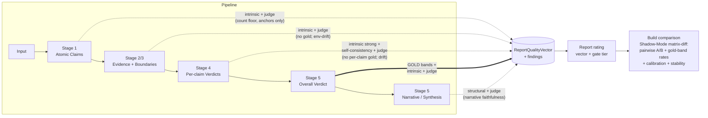

# Report Quality — Measurement, Rating & Build Comparison (Concept)

**Date:** 2026-06-04
**Role:** Lead Architect
**Status:** Concept / proposal — *propose-and-stop*. **v7 — BOTH independent re-reviewers now PASS** (re-review #2 = GO on v6; re-review #1's v6 NO-GO routing-leaks all addressed in v7 + canonical signal-routing table, Appendix B). **Implementation-ready & Captain-ready.** Design principles unchanged; the §10 MVP has an **explicit data contract**, **deterministic formulas** (harmful-error, [−100,100] no-clip), a **tie-band cost rule**, a **zero-spend / live-run split**, **one-role-per-signal routing**, and a **dependency-free CI approach** (hand-rolled bootstrap in Node). No code changed. **Decided:** §9 ①②④⑤ + the **cost-ranking rule = 2a tie-band** (2026-06-04). **Open:** ③ cross-provider judge (Phase 2), ⑥ contestation-weight drift (awaiting investigation task). MVP (Phase 0 → 1) is now execution-ready bar those two (neither blocks it).
**▶ Consolidated actionable plan:** `Docs/WIP/2026-06-04_Report_Quality_Measurement_Implementation_Plan.md` — the clean, converged plan (design + decisions + phased execution + routing table). **Start there to execute.** This concept doc is the full rationale + v1→v7 review audit trail.
**Relationship:** This is the **measurement layer** the Pipeline-Era Comparison study (`2026-06-04_Pipeline_Era_Comparison_Worktree_Study_Plan.md`) leaves open — its Phase 3 "normalize + compare" slot. The era harness *runs* builds; this concept *scores and compares* what they produce. It applies to branch builds and HEAD-vs-HEAD reps directly; for era-worktree arms it applies **only through versioned read adapters** — cross-era result schemas are *not* directly diffable (era plan §2.2), so an older arm exposes only the dimensions its schema supports (often just C4 / integrity / evidence-count). See §5h.
**v3 changes (independent review, 2026-06-04):** a fresh external reviewer raised one **BLOCKER** (the C4 aggregation-faithfulness check was specified against the wrong module — corrected in §3-C4 against the live `aggregation-stage.ts::aggregateAssessment()`, and a possible *contestation-weight drift* bug surfaced) plus premise-level fixes now folded in: a **signal-independence taxonomy** to bound the circularity of grading the pipeline with its own LLM self-labels (§4a′); **statistical gates** (pilot vs decision N, bootstrap CIs, MDE — §5a/§5d); **pairwise A/B made hierarchical** with explicit non-transitive-cycle reporting (§5b); a concrete **lexicographic default decision rule** (§5f); a **two-vector attribution** split (§5e); **versioned era adapters** (§5h); a **Phase 0** that makes the cheap reference annotations a prerequisite (§8); and a **confidence-band policy** reconciliation (§9.5).
**v4 changes (second external review, 2026-06-04 — returned NO-GO on one residual C4 inaccuracy):** the live aggregator's **narrative confidence post-step** (`verdictNarrative.adjustedConfidence`, up to `narrativeConfidenceMaxDownwardDelta` ≈5pp; `aggregation-stage.ts:437-446`) lowers `finalAggregate.confidence` on *all* paths — so §3-C4 now reconciles baseline↔final **separately**: truth (never narrative-adjusted; guards only) vs confidence (integrity cap → guards → narrative downward delta). Also replaced the variance-discarding "median-rep" option with a **bounded random sample of rep-pairs** (§5b/§6), and marked §5c's confidence tolerance as pending policy (§9.5).
**v5 changes (third independent review — Gemini, fresh-eyes; verdict SIMPLIFY-THEN-BUILD):** five accepted findings folded in — (a) **integrity ≠ quality**: T2 recomputed checks (incl. aggregation faithfulness) now *gate/floor*, they do **not** rank quality (§4a′, §5f); (b) **cost/latency** added as a first-class comparison dimension (§3 cross-cutting, §5f); (c) **harmful-error asymmetry** — confident-wrong penalised below honest abstention (§3-C4); (d) **bias/neutrality** measured via the existing fixtures (§3 cross-cutting); (e) a **gated-beta-field** Phase-1 availability caveat (§8). Partial-accept with push-back on "cut Phase 2 entirely": pairwise reframed as *conditional* quality — clean for C1/C5, drift-confounded for C3 (§5b). And the **MVP is now explicit** (Phase 0+1 = decision-useful core; pairwise judge + sub-stage isolation deferred, §8).
**Telemetry integration (2026-06-04):** the Efficiency dimension + infra/reliability signals are now explicitly sourced from the persisted metrics subsystem (`metrics.ts` `AnalysisMetrics`, per-`LLMTaskType` → per-stage cost/latency/retries/schema-compliance), joined to reports by `jobId` (§3 Efficiency, §10 P1.5); historical retention flagged to verify. Telemetry is **HEAD-era / forward-only** — old branches/eras emit none, so Efficiency is telemetry-gated (n/a, never penalised; §5h).
**v6 changes (two NO-GO implementation reviews, 2026-06-04):** (a) **explicit Phase-1 data contract** — `ResultJson.meta` has only `llmCalls`+`runtimeRoleModels` (no tokens/duration, confirmed `claimboundary-pipeline.ts:305-341`); rich cost needs the `AnalysisMetrics`+Job-timestamps join, so Phase-1 cost = coarse `llmCalls` (§10 P1.5). (b) **Cost can't be Pareto-ranked** (inversely correlated with quality → stalemate); an explicit rule is now MANDATORY — **2a tie-band (default) or 2b exchange rate** (§5f, §9.1). (c) **Harmful-error asymmetry given a deterministic formula** (`flip = baseTiered − confidence`; UNVERIFIED = 25), de-duplicated from calibration (§3-C4, §5d). (d) **Integrity≠quality fully propagated** — C1/C2 structural mins moved INTO the integrity gate (P1.2) so they aren't dead code; §4b/Appendix relabelled by role. (e) **Neutrality is a live/paired Phase-3 signal**, not a Phase-1 stored rollup (§3). (f) **zero-spend rollup split from live HEAD-vs-HEAD/branch runs** (Phase 1b, §10).
**v7 changes (re-review #1 of 2, NO-GO on routing leaks):** (a) **canonical signal-routing table (Appendix B)** — one role per signal (gate/rank/tie-break/colour) + source + score-domain; (b) removed `source-type diversity` from the integrity gate — it reads the `sourceType` self-label → T3 colour, not a gate (§10 P1.2); (c) **§5g matrix-diff rewritten by role** — tie-band verdict, C1/C2 as gates, C3 as colour, no "Pareto" claim; (d) harm-adjusted C4 **score domain [−100,100], aggregate raw (no clipping)** (§3-C4); (e) Phase-1 coarse cost = **`meta.llmCalls` primary** (`runtimeRoleModels.callCount` is Stage-4 role-tracing → per-role colour only, §10 P1.5/§9.1); (f) §9.5 wording corrected to "decided strict".
**Consolidates (v2):** two peer concepts reviewed 2026-06-04. From peer **B**: *Report narrative* promoted to a first-class component (C5); a named `ReportQualityVector` object with a per-report `calibrationSignals` field. From peer **C** (Gemini): concrete structural rating formulas (anchor-drop, tiered band score, citation floor, probative index, checkworthy-resolution), the sequential-dependency / quality-bounding framing (§1.7), and the **Shadow-Mode CLI matrix-diff** front-end (§5g). **Two corrections applied to C:** (i) its *Net Quality Score* is kept only as a labelled gate-summary, never to rank builds (§4c/§5f) — C's own "symmetrical drift" example shows a flat scalar hides offsetting component changes; (ii) its Stage-4 truth-band scoring belongs at the **overall** layer (C4), not per-atomic-claim — `benchmark-expectations.json` bands are overall-level, so per-claim verdicts (C3) stay ungolded (structural + self-consistency + judge). See §2 reference gradient.

---

## 0. The concept in one page

We do **not** start from a blank rubric. FactHarbor already has a mature, stage-aligned quality vocabulary — the **Q-code catalog** (`report-quality-expectations.json`, 40+ codes), **gold bands** per input family (`benchmark-expectations.json`), narrative intent (`Captain_Quality_Expectations.md`), and a fleet of diagnostic scripts. The Q-codes already partition almost exactly along the lines the request asks for:

| Requested isolatable part | Pipeline stage | Existing Q-code family |
|---|---|---|
| Atomic Claims generated from input | Stage 1 | `Q-S1.*` |
| (Evidence — gates verdict quality) | Stage 2/3 | `Q-EV*` |
| Atomic Claim verdict | Stage 4 | `Q-V*` |
| Overall verdict | Stage 5 | `Q-BE*` (gold bands) |
| Report narrative / synthesis | Stage 5 | `Q-WS*` + `explanationQualityCheck` |
| Stability across runs | cross-cutting | `Q-ST*` |
| Runtime integrity (gate) | cross-cutting | `Q-HF1` |

**What is missing is not the criteria — it is three things:**

1. **A rating model.** The Q-codes today emit *findings* (pass/fail flags inside the `/report-review` debate). There is no principled roll-up into a **per-component score / tier**, nor a defensible report-level rating.
2. **A build-comparison methodology.** Diagnostic scripts measure single populations; nothing systematically compares *build A vs build B* on the same inputs while separating real change from alpha-variance noise and attributing the change to a component.
3. **An honest reference model.** A measurement is only as good as its notion of "correct." That notion is **not uniform across the pipeline** — and getting this right is the whole design.

This document proposes all three, built on one organizing principle (§2), a per-component decomposition (§3), a rating model (§4), a comparison methodology (§5), and a phased, mostly-zero-spend rollout (§8).

---

## 1. Design principles (Lead Architect stance)

1. **Reuse, don't reinvent.** Every metric below maps to an existing Q-code, an existing field in `types.ts`, or an existing diagnostic script. New machinery is *roll-up and comparison plumbing*, not new criteria.
2. **The vector is primary; the scalar only gates.** A single composite quality number is convenient and dangerous (false precision, masking, gameability). We keep a **vector of per-component sub-scores** as the authoritative object. A scalar exists only to *gate* (pass/block) — it **never ranks builds** (§4c, §5f).
3. **Categorical → continuous discipline.** Per the role learning: categorical signals (verdict label, confidence tier, Q-code pass/fail) stay categorical; continuous signals (truth%, confidence, spread) stay continuous. Scores are derived *from* these, not substituted for them.
4. **Measure each component conditional on its realized input.** A great Stage-4 verdict on a bad Stage-1 claim set is still a bad report — but it is a *good Stage-4*. Component scores must not let an upstream failure masquerade as a downstream one. True *cross-build* per-stage causal attribution has a hard limit (§5e).
5. **Comparison is relative.** To compare builds we need **ordering**, not cardinal scores. Where a real anchor exists (gold bands, structural pass/fail) we score absolutely; where it does not (sub-stage quality) we judge **pairwise A-vs-B**, which is far more reliable than score-then-subtract.
6. **Variance is signal-bearing, not noise to suppress.** Alpha runs intentionally vary (memory: no result caching during alpha). Every metric is reported as a **distribution over N reps**, compared against the established `noiseTolerancePct: 8` band, never as a single run.
7. **Quality is a dependency chain — upstream bounds downstream** (from peer concept C). A stage's achievable quality is capped by what it receives: a perfect Stage-4 cannot rescue a claim set that dropped the user's anchor. This is why component scores are conditioned on realized input (§1.4), why a C1 failure shrinks the ceiling for C3/C4, and why cross-build *causal* attribution needs upstream-artifact injection (§5e).

---

## 2. Organizing principle — the reference gradient

> **Reference availability is not uniform across the pipeline. Gold ("the right answer") exists only at the aggregate verdict and at a few coarse structural floors. Everything in between is measured by intrinsic structural checks, cross-run stability, and judge models. And the deeper into per-item detail you go, the more run-to-run drift erodes any per-item target you might compare against.**

This single sentence dictates the whole design. Spelled out:

| Layer | Is there a "correct answer" to compare against? | Why | Dominant measurement mode |
|---|---|---|---|
| Input → **Atomic claims** (C1) | **Almost none.** Only a count floor (`minDistinctEvents`) and must-survive predicates (`anchorTokens`). Enumerating "the correct claim set" for arbitrary input is impossible *and* prohibited (no teaching-to-the-test). | Generic-by-design constraint | Intrinsic + judge + stability |
| Claims → **Evidence** (C2) | **Almost none** — only a `minBoundaryCount` floor (`Q-BE4`). The live web drifts; evidence-pool overlap between identical reruns is already measured at Jaccard 0.10–0.29 (memory). There is no stable "correct evidence set." | External-world drift | Intrinsic + judge + stability |
| Claim → **Per-claim verdict** (C3) | **No per-claim gold.** And the claim set itself drifts (Q-ST3 tolerates Jaccard ≥ 0.6 — up to ~40% of claims can differ run-to-run). So there is no fixed per-claim target. | Drift confound | Intrinsic (strong here) + self-consistency + judge |
| Verdicts → **Overall verdict** (C4) | **Gold exists.** `benchmark-expectations.json` defines expected label set, truth band, confidence band, min boundaries per family. | Captain-curated bands | **Gold-reference** + intrinsic + judge |

**Consequence for per-claim-verdict scoring (C3) — the subtle one:** because the claim *population* drifts between runs and builds, C3 must be (a) scored **conditional on the realized claim set**, and (b) reported as a **distribution over a drifting population**, not a per-claim time series. Comparing C3 *across builds* therefore requires either **semantic claim alignment** (match "AC about legal basis" in build A to its counterpart in build B) or it must **step up to the aggregate level** (C4) where the population is collapsed away. This is stated as a first-class limitation, not a footnote.



---

## 3. The decomposition — isolatable components

Each component below lists: **what it scores**, the **data fields** it reads (all already in `types.ts`), the **measurement modes** available (R0 intrinsic / R1 gold / R2 judge / stability), the **mapped Q-codes**, and the **confound** that limits cross-build isolation. Full field→Q-code→reference table in Appendix A.

### Gate — Runtime integrity (`Q-HF1`)
- **Scores:** Did the job actually produce a report? `status == SUCCEEDED` AND no `report_damaged | analysis_generation_failed | llm_provider_error` warning.
- **Role:** This is a **gate, not a dimension.** If it fails, every semantic score below is meaningless — the report is capped to the BLOCK tier and excluded from comparison (or counted only in the *integrity-rate* metric). Population rate today: hard-failure ≈ 8.6% of SUCCEEDED jobs (memory). The **integrity rate** (fraction of reps that clear the gate) is itself a build-comparison metric.

### C1 — Atomic-claim extraction (Stage 1)
- **Scores:** Are the claims a faithful, atomic, complete decomposition of the input?
- **Fields:** `AtomicClaim{statement, category, verifiability, centrality, harmPotential, specificityScore, groundingQuality, claimDirection, thesisRelevance, isDimensionDecomposition}`; `CBClaimUnderstanding.gate1Stats`.
- **R0 intrinsic:** count ≥ `minDistinctEvents` (`Q-S1.1`); anchor tokens survive into a primary claim (`Q-S1.3`); `specificityScore` ≥ gate; opinion not admitted as factual (Gate-1 opinion filter — `claimType`/`opinionScore`, surfaced in `gate1Stats`; **not** `Q-S1.6`, which is a verdict-stage contestation-immunity check belonging to C3).
- **R1 gold:** only the two cheap annotations — count floor + anchor tokens. *No claim-text gold.*
- **R2 judge:** atomicity (one verifiable assertion per claim), **faithfulness** (no hallucinated claim absent from input; no *dropped* check-worthy clause — e.g. the Bolsonaro "sentence-justice clause dropped" regression), decomposition sensibility.
- **Concrete structural rating (from peer C):** anchor-token dropped → this sub-score = **0** (a dropped truth-condition modifier changes the nature of the check); otherwise continuous from (count vs `minDistinctEvents`, `specificityScore` ≥ gate, severity-weighted `Q-S1` pass-rate) minus a **redundancy penalty** — semantic overlap between sibling claims, penalising fragmentation of one event into many. *(Independence, §4a′: count + anchor-token presence are T2; `specificityScore` and opinion-class are T3 self-labels — don't let them dominate the sub-score.)*
- **Stability:** `Q-ST3` claim-set Jaccard, `Q-ST6` classification stability.
- **Confound:** claim drift (Jaccard ≥ 0.6 tolerated) → cross-build comparison needs semantic alignment or steps up to C4.

### C2 — Evidence acquisition & boundaries (Stage 2/3)
- **Scores:** Is the evidence relevant, sufficient per claim, diverse, and correctly scoped/clustered?
- **Fields:** `EvidenceItem{probativeValue, extractionConfidence, evidenceBasis, scopeQuality, applicability, sourceType, claimDirection, fromOppositeClaimSearch}`; `FetchedSource{trackRecordScore, fetchSuccess}`; `ClaimAssessmentBoundary{internalCoherence, evidenceCount}`; `coverageMatrix`.
- **R0 intrinsic:** per-claim research completeness — every claim has ≥1 *non-seeded* researched item (`Q-EV6`); source diversity (`Q-EV5`); evidence-language match (`Q-EV_LANGUAGE`); probative not low-dominated (`Q-EV_PROBATIVE`); direction-balance integrity (`Q-EV_DIRECTION_BALANCE`); coverage-matrix has no empty claim row; boundary `internalCoherence`.
- **R1 gold:** `minBoundaryCount` (`Q-BE4`).
- **R2 judge:** relevance / contamination (is cited evidence actually about the claim's jurisdiction & scope — the asylum "foreign-reaction" contamination pattern); evidence↔claim applicability.
- **Concrete structural rating (from peer C):** base = **citation floor** (% of published verdicts with ≥1 evidence item, `Q-HF4`) and **per-claim research completeness** (`Q-EV6`); adjusted by the **probative-value index** (ratio of primary/official to secondary/opinion sources) and the **checkworthy-resolution rate** (% of checkworthy claims reaching a conclusive verdict — penalises unjustified UNVERIFIED; memory baseline 24.2% unresolved). *(Independence, §4a′: citation floor + research-completeness are T2; the probative-value index and source-type diversity read LLM self-labels (`probativeValue`, `sourceType`) → T3 — reported as colour, not used to rank a build.)*
- **Stability:** `Q-ST4` evidence-mix; evidence-pool Jaccard (`compare-evidence-pools.cjs`). **Note:** evidence-pool drift is the *primary driver* of downstream verdict variance (memory) — so C2 stability is partly a measure *of the confound itself*, and worth reporting on its own.
- **Confound:** environment-level evidence drift; large and not fully controllable.

### C3 — Per-claim verdict (Stage 4)
- **Scores:** Given the realized claim and its evidence, is the verdict internally coherent, evidence-grounded, well-reasoned, and self-consistent?
- **Fields:** `CBClaimVerdict{truthPercentage, verdict(7pt), confidence, confidenceTier, isContested, supportingEvidenceIds, contradictingEvidenceIds, boundaryFindings, triangulationScore, challengeResponses, misleadingness, sourceReliabilityCalibration, reasoning}`; `consistencyResult{spread, stable}`.
- **R0 intrinsic (strongest here — most `Q-V*` are structural):** label↔truth% agreement (`Q-V_LABEL_DIRECTION`); verdict↔evidence-direction alignment (`Q-V1`); reason citations in-set, no hallucinated evidence IDs (`Q-V_REASON_CITATION`); evidence-citation minimum (`Q-HF4`); evidence-backed-contestation-only structural proxy (`Q-V7`/`Q-S1.6`); truth-vs-misleadingness separation (`Q-V6`, annotation-gated).
- **R1 gold:** none per-claim (only via the aggregate, C4). *Correction to peer C: tiered truth-band scoring lives at **C4**, not here — `benchmark-expectations.json` bands are overall-level, so grading a per-claim verdict against an overall band is a reference error.*
- **R2 judge:** reasoning quality & soundness; is the truth% defensible on the cited evidence — **the ideal place for pairwise A/B** (§5b).
- **Self-consistency / calibration:** `consistencyResult.spread` (the pipeline already runs 3 temp>0 samples per verdict); confidence-vs-spread coherence.
- **Confound:** conditional on realized claim+evidence; population drifts → cross-build needs alignment or step-up.

### C4 — Aggregation & overall verdict (Stage 5) — *the anchored layer*
- **Scores:** Is the headline verdict correct (vs gold band) and faithfully aggregated? *(Narration quality is scored separately as C5.)*
- **Fields:** `OverallAssessment{truthPercentage, verdict(7pt), confidence, truthPercentageRange, verdictNarrative, coverageMatrix, qualityGates, explanationQualityCheck, tigerScore, articleAdjudication, adjudicationPath}`.
- **R1 gold (this is where gold lives):** label ∈ expected set (`Q-BE1`); truth% in band ± noise (`Q-BE2`); confidence in band — **strict** (`Q-BE3`; **resolved §9.5, Captain 2026-06-04: drop the JSON ±noise expansion on confidence to match the band scripts — a one-line `report-quality-expectations.json` edit is the Phase-0 follow-up**). *(Boundary count ≥ min, `Q-BE4`, is scored once — at **C2**, where boundaries are formed — to avoid double-counting it as a Pareto dimension.)* **Concrete tiered rating (from peer C, scoped to the overall layer):** exact band match = **100**; adjacent band (e.g. LEANING-TRUE vs MOSTLY-TRUE) = **70**; directional flip (true-side ↔ false-side across the 50% midpoint) = **0**; truth%/confidence graded continuously within the band ± `noiseTolerancePct`. **Harmful-error asymmetry — concrete deterministic rule (both reviewers; was prose-only):** compute a **harm-adjusted C4 score** = the base tiered score, with one modification — for a **directional flip** (verdict on the wrong side of the 50% midpoint vs gold) subtract the verdict's confidence: `harmAdjustedC4 = baseTiered − confidencePct` (a 90%-confident flip ≈ **−90**; a low-confidence flip ≈ **0**). A **same-side out-of-band** error keeps its distance-graded **0–70**. **UNVERIFIED / abstention is a bounded safe non-answer = 25** (better than confident-wrong, worse than a correct verdict) — it is *not* a flip. **No double-count with calibration (§5d):** this harm adjustment lives in the C4 *quality* score; calibration is reported *separately* and must not re-penalise the same confidence, unless the Captain explicitly opts for double weighting. **Score domain & aggregation (implementer-critical):** harm-adjusted C4 ∈ **[−100, 100]**; aggregate **raw** across claims/reps/families before CIs — **do NOT clip negatives to 0** (clipping would erase the "confident-wrong scores below abstention" property the whole rule exists to create).
- **R0 intrinsic:** **aggregation faithfulness** — an **integrity / regression check, NOT a quality measure** (§4a′): it verifies Stage 5 aggregated per spec and catches *silent cross-build aggregation changes*; it does **not** measure whether the verdict is *right* (it recomputes over T3 self-labels). It gates/floors, it does not rank. **Define it against the LIVE aggregator `aggregation-stage.ts::aggregateAssessment()`** (called by `claimboundary-pipeline.ts:829/1463`) — **not** the parallel `aggregation.ts` module (which exports `getClaimWeight`/`calculateWeightedVerdictAverage` but is *not* on this call path). Per claim, recompute `finalWeight = centrality{high 3 / med 2 / low 1} × harm{critical 1.5 / high 1.2 / med 1.0 / low 1.0} × (confidence/100) × (1 + triangulationFactor) × derivativeFactor × anchorFactor{2.5 if the claim preserves the truth-condition anchor, else 1.0} × probativeFactor{mean of supporting-evidence probativeValue weights 1.0/0.9/0.5}`; **invert** truth → (100 − t) for `claimDirection == "contradicts_thesis"`; set weight **0** for `thesisRelevance != "direct"` and for `confidenceTier == "INSUFFICIENT"` claims with zero directional citations. The weight-normalised mean of truth must equal **`adjudicationPath.baselineAggregate.truthPercentage`** (modulo the final rounding). The **confidence** mean matches `baselineAggregate.confidence` **only after replicating two post-steps the function applies** — the integrity cap (`min(weightedConfidence, INSUFFICIENT_CONFIDENCE_MAX)` whenever any claim has `verdictReason == "verdict_integrity_failure"`, aggregation-stage.ts:276-281) and the final `Math.round` — otherwise the check **false-positives exactly the integrity-downgraded reports it most wants to validate**. (Both means are computed in this function — there is *no* separate confidence module, contrary to v2.) Then reconcile `finalAggregate` vs `baselineAggregate` **separately for truth and confidence — they do NOT reconcile the same way:**
  - **Truth** is never narrative-adjusted (aggregation-stage.ts:427): `finalAggregate.truthPercentage == baselineAggregate.truthPercentage` on `baseline_same_direction`/`baseline_fallback`, and on `llm_adjudicated` diverges *only* through `guardsApplied{deviationCapped (±maxDeviation from baseline), boundsClamped}`.
  - **Confidence** can diverge on **every** path: after the baseline integrity cap and any adjudication guards (`confidenceCeiled (≤ max claim confidence), integrityDowngraded, boundsClamped`), a **narrative post-step** (aggregation-stage.ts:437-446) may lower it by up to `narrativeConfidenceMaxDownwardDelta` (default 5pp) via `verdictNarrative.adjustedConfidence` — so `finalAggregate.confidence` can differ from `baselineAggregate.confidence` *even with no adjudication*. The check must bound confidence to `[post-guard − narrativeMaxDownwardDelta, post-guard]`, never assert equality.

  Checking `finalAggregate` against a naive baseline (ignoring the guards **and** the narrative confidence step) would false-positive every adjudicated report *and* every report whose narrative lowered confidence. **⚠ Flagged drift — verify before building this metric:** `aggregateAssessment` does **not** apply the `contestationWeights` (0.5 established / 0.7 disputed) that `aggregation.ts::getClaimWeight` *and* `calcConfig.aggregation.contestationWeights` define — contestation weighting looks **defined-but-unwired** on the live path. Confirm whether that is intentional (it may be a latent aggregation bug) before the metric assumes either behaviour; this is itself a finding for the LLM Expert / Captain (§9.6). Plus: confidence floor (`Q-HF6`). *(Narrative grounding is C5, not here.)*
- **R2 judge:** `TIGERScore` (holistic, already in pipeline, Beta). *Narrative-specific judging (`explanationQualityCheck` rubric, `verdictNarrative` faithfulness) is scored as **C5**.*
- **Calibration:** belongs to the **build layer** (§5d) — needs many inputs × reps against gold.

### C5 — Report narrative & communication (Stage 5 synthesis) — *promoted from peer concept B*
- **Scores:** Does the human-facing explanation faithfully reflect the verdict, the evidence, the uncertainty, and the limits? A build can land the C4 numbers yet narrate them badly (or vice-versa) — so narrative is its own component, not a sub-item of the verdict.
- **Fields:** `verdictNarrative{headline, evidenceBaseSummary, keyFinding, boundaryDisagreements, limitations, adjustedConfidence}`; `explanationQualityCheck{structuralFindings, rubricScores}`; `analysisWarnings[]`.
- **R0 intrinsic:** structural grounding (`explanationQualityCheck.structuralFindings`: cites evidence, states a verdict category, states confidence, states limitations); warning hygiene — severity matches verdict impact and types are registered (`Q-WS1/2`).
- **R2 judge:** narrative faithfulness (does the prose match the cited evidence and the verdict direction?), appropriate hedging, neutrality (`explanationQualityCheck` rubric mode; pairwise A/B across builds).
- **Reference:** no gold; structural + judge only.
- **Confound:** narrative quality is partly stylistic — keep the judge anchored (§6) and prefer pairwise to absolute.

### Cross-cutting dimensions
- **Stability** (`Q-ST1–6`, `verdict-direction-instability.cjs`): truth-spread, confidence-tier stability, claim-set & evidence-mix similarity, cross-linguistic equivalence (`Q-ST5`, e.g. bolsonaro-en vs -pt), classification stability. **Requires ≥2 reps.** A build-level dimension.
- **Calibration** (build layer, §5d): the failure mode the project keeps hitting (plastic-en: FALSE 9/78 *and* MOSTLY-TRUE 85/88 both overconfident — the real defect was calibration, not direction). Measurable only where gold exists (C4 bands) and only across many inputs × reps.
- **Presentation / warning hygiene** (`Q-WS1/2`): now scored inside **C5** (narrative & communication) — listed here only as a pointer.
- **Infrastructure confounds** (`Q-INF_*`): concurrency collapse, timeout pressure, silent model fallback, prompt-rollout drift. **These are controlled-for, not scored** — a build must not be penalised for a concurrency artifact, and must not be credited for one either.
- **Efficiency — cost & latency, a CO-EQUAL comparison dimension (Captain decision ①), sourced from pipeline telemetry.** The dedicated metrics subsystem (`metrics.ts` / `metrics-integration.ts`, persisted via `persistMetrics`) already records **per-LLM-call** `promptTokens`/`completionTokens`/cache tokens, `durationMs`, `retries`, `success`, `schemaCompliant`, `errorType` — **keyed by `LLMTaskType`** (`understand`/`research`/`cluster`/`verdict`/`aggregate`). Because it is per-task-type, it maps onto the components: **cost & latency *per stage*** (understand→C1, research/cluster→C2, verdict→C3, aggregate→C4), so "which stage got more expensive in build B" is answerable. Report **quality-per-cost** and **quality-per-latency** (true, cache-aware cost by model tier) **and** a **reliability** sub-signal (schema-compliance + retry rate per stage — a stage that needs 3 retries to parse is shakier). A build that buys +2pp C4 accuracy by tripling cost or model tier is not unconditionally better. (FactHarbor is a live, cost-sensitive pipeline — alpha/NPO; the API bill *is* the pipeline.) **Caveat — telemetry is HEAD-era infrastructure, and it gates this whole dimension:** it is a *separate persisted store* (via the API, admin-keyed), joined to a report by `jobId`; but more importantly **old branches / era-worktree arms that predate or omit the metrics subsystem emit *no* telemetry at all** (not merely thin retention) — even on a fresh run. So Efficiency is **fully available only when *both* compared arms emit telemetry** (recent branch ↔ HEAD, or HEAD ↔ HEAD). For an arm without it, mark Efficiency **n/a — never a penalty** (§5h); at most a *coarse fallback* (end-to-end wall-clock from the job record + raw `llmCalls` if that field is present), with per-stage cost and reliability unavailable.
- **Bias / neutrality — a LIVE/paired signal (Phase 3), NOT a Phase-1 stored rollup (reviewers' correction).** The fixtures are paired-calibration inputs run *live* by the calibration runner (both sides of a pair, measuring the delta) — they are **not** benchmark families with stored `ResultJson`, so neutrality **cannot** be computed in the zero-spend Phase-1 rollup. So `neutralitySignals` is an **optional Phase-3 (live-spend) dimension**, sourced from the **paired calibration artifact**: framing-symmetry pairs (`framing-symmetry-pairs.json` — mirrored claims symmetric within the declared `expectedSkew`/`expectedAsymmetry`, whichever the pair carries — note not all pairs have `expectedAsymmetry`) and question-vs-statement neutrality (`neutrality-pairs.json` — ≤4pp delta), plus **evidence-pool skew** in C2. A build can improve C4 accuracy while regressing neutrality — track it separately.

---

## 4. The rating model

### 4a. Three measurement modes

| Mode | What it is | Reliability | Cost | Where it applies |
|---|---|---|---|---|
| **R0 — Structural / intrinsic** | Deterministic checks recomputable from `ResultJson` (the structural Q-codes). No "right answer" needed — checks *internal coherence* and *contracts*. | High, deterministic | ~0 (already-stored data) | All components; **dominant for C1–C3** |
| **R1 — Gold reference** | Compare against Captain-curated expectations (`benchmark-expectations.json`). | High where it exists | ~0 to evaluate | **C4 only** (+ count/anchor floors at C1, min-boundary at C2) |
| **R2 — Judge model** | A stronger / independent model rates a rubric or, preferably, judges **A-vs-B**. Existing precedent: `TIGERScore`, `explanationQualityCheck` rubric mode. | Moderate; **pairwise ≫ absolute** | LLM spend | Sub-stage quality where R0/R1 run out (C1 faithfulness, C2 relevance, C3 reasoning) |

### 4a′. Signal-independence taxonomy (the circularity bound)

"Structural" ≠ "independent." A measurement's trust depends on how independent the *check* is of the very pipeline it grades. Many fields the pipeline emits about its own work are LLM self-labels — using them to grade the pipeline is partly circular (a regression can corrupt the output **and** its self-label in the same direction, so the check can't catch it).

| Tier | What the *check* compares against | Examples | Trust |
|---|---|---|---|
| **T1 — Externally anchored** | a reference outside the pipeline | gold bands (`benchmark-expectations.json`), the input text, byte-exact wording; "confidence ∈ gold band" | highest |
| **T2 — Recomputed-structural** | a value deterministically recomputed from `ResultJson`, independent of any LLM-assigned field | label↔truth consistency, reason-citations-in-set, aggregation-faithfulness recompute, claim-count / anchor-token presence | high |
| **T3 — Pipeline self-label (used alone)** | an LLM-assigned field taken at face value | raw `probativeValue`, `evidenceBasis`, `applicability`, `sourceType`, `specificityScore`, `consistencyResult`, `TIGERScore`, `explanationQualityCheck` rubric | **low — capped** |
| **T4 — Independent judge** | a separate (ideally cross-provider) model, anchored on gold (§6) | pairwise A/B on claims / reasoning / narrative | medium |

**Rule — separate INTEGRITY from QUALITY (the layer most easily confused, per the third review):**
  - **Quality** (is the analysis *correct / good*?) is measured **only by T1 (gold) + T4 (independent judge) + calibration**. These rank builds.
  - **Integrity / contract** is what **T2 recomputed-structural checks actually measure** — aggregation faithfulness, label↔truth consistency, citation-in-set. Recomputing arithmetic or contracts **over T3 self-labels detects code regressions and broken contracts, NOT analytical quality** (a build can be perfectly self-consistent and confidently wrong). So **T2 + the `Q-HF1` gate form an integrity gate-and-floor**: a build must pass them, and their *violation rate* is a comparison floor (more violations = worse, can block a build) — but **T2 does not enter the quality ranking.**
  - **T3 self-labels** (probative-value index, source-type, etc.) are **colour only** — reported to *explain*, never to *rank* (a regression can move output and self-label together).

So the build verdict (§5f) **ranks on T1 + calibration + cost-efficiency + T4**, **gated/floored by integrity (T2 + Q-HF1)**. (This corrects v4, where T2 wrongly sat *inside* the quality ranking — a reviewer rightly noted that recomputing math over self-labels is an integration test, not a quality measure. C2's probative-value index and source-type are **T3**; the gold-band checks are **T1**.)

### 4b. Per-component scorecard

For each component we produce **both**:
- a **finding vector** — the categorical Q-code results (pass / fail / speculative), always; and
- a **quality sub-score** *only where a quality anchor exists* — i.e. **C4** (gold-band tiered, harm-adjusted) plus the build-level **calibration** and **cost** dimensions. **C1/C2/C3 do NOT get a quality sub-score:** their deterministic checks are integrity gates/floors (T2) or T3 colour, and their quality (when judged) is the **pairwise** verdict (T4, Phase 2). C4's aggregation-faithfulness recompute is a separate **integrity gate**, not part of its quality sub-score (§4a′). C1–C3 get a **structural sub-score** (fraction of applicable structural Q-codes passed, severity-weighted) plus a **judge verdict** that is *ordinal in comparison mode* (§5b) and *rubric in single-report mode*. We deliberately **do not fabricate a cardinal sub-stage score from the judge** for single reports — that is the judge's weakest mode.

Severity weights reuse the established **per-report** penalty tiering in `best-commit-phase1.cjs`: PHASE-BLOCKER → gate; HIGH ≈ −25; MEDIUM ≈ −10 (a LOW ≈ −5 tier is a *proposed addition* — the script has no generic LOW penalty, only a plastic-specific −5 ceiling). **We reuse only its per-report penalty weights, NOT its composite cross-build ranking** — that composite (equal-family-weighted mean) is exactly the scalar-ranking §5f replaces with the Pareto/weighted-vector verdict.

The concrete deterministic formulas in §3 are **computed cardinally but routed by their §4a′ role, not merged into one "sub-score":** the **C4 tiered band score** is the gold *quality rank* (T1); **anchor-drop / claim-count / citation floor / aggregation faithfulness** are **integrity gates/floors** (T2 — they gate, they don't rank); **probative index / source-type** are **T3 colour**. Judgment signals (reasoning soundness, relevance, narrative faithfulness) stay **pairwise/ordinal** (§5b, T4). So peer concept C's formulas are adopted where deterministic, but each is dispatched to gate / rank / colour by role — reconciling C's cardinal sub-stage scores with §1.5 and §4a′.

### 4c. Report-level rating — gate, then vector, then a lossy tier

The authoritative per-report object is the **`ReportQualityVector`** (name & shape adopted from peer concept B):

```
ReportQualityVector = {
  integrity,          // GATE  — Q-HF1 → PASS / BLOCK; a fail zeroes everything below
  claims,             // C1
  evidence,           // C2
  claimVerdicts,      // C3
  overallVerdict,     // C4    — the only gold-anchored component
  narrative,          // C5
  stability,          // cross-cutting — populated only when ≥2 reps exist
  calibrationSignals, // per-report inputs (conf vs probative-mix, conf vs spread, conf vs in-band)
                      //   that FEED the build-level calibration metric (§5d)
  efficiency,         // cost/latency: llmCalls, token spend by tier, wall-clock (build dimension)
  neutralitySignals   // bias/framing-symmetry inputs that FEED the build-level neutrality metric
}
```
`integrity`…`narrative` are single-report; `stability` and the calibration *metric* are build-level — `calibrationSignals` is the per-report half that the metric aggregates over reps. (This reconciles peer B's per-report `calibrationSignals` with the build-level calibration dimension.)

Rating procedure:
```
1. GATE:  Q-HF1 fails → tier = BLOCK, vector zeroed, stop. (semantic checks moot)
2. VECTOR: emit the ReportQualityVector (findings + sub-scores). THIS IS THE AUTHORITATIVE OBJECT.
3. TIER (lossy, gating only — never used to rank builds):
     BLOCK  if any PHASE-BLOCKER / hard-failure floor fails
     WATCH  if any HIGH finding, or any C4 gold band missed beyond noise
     PASS   otherwise
4. (optional) NQS — a single 0–100 "gate summary" for dashboards ONLY, explicitly labelled
     non-authoritative. It MUST NOT be used to compare or rank builds (§5f).
```

The scalar/tier **gates release readiness**; it does not order builds. Rationale: a flat scalar can hide a Stage-1 regression offset by a Stage-4 gain — the exact masking we forbid in §1.4, and the exact failure peer concept C's own "symmetrical drift" example demonstrates (its NQS stays flat while +evidence/−verdicts cancel). (This closes a real gap: today no single asset emits an "all-checks-pass / release-ready" verdict per job.)

---

## 5. Build comparison methodology

**Question answered:** *On a fixed input panel, does build A produce better reports than build B — and in which component does the difference live?*

### 5a. The experimental frame
- **Input panel:** the Captain-defined families in `benchmark-expectations.json` (currently 8: bundesrat ×2, asylum ×2, bolsonaro en/pt, hydrogen, plastic). **No invented inputs** (AGENTS.md; memory). Byte-exact wording (`Q-IN1`).
- **Reps:** N ≥ 5 per input per build (matches the live-A/B precedent in memory; required because alpha variance is real).
- **Concurrency control:** run reps so that `Q-INF_CONCURRENCY` / timeout pressure are held constant or excluded — otherwise infra artifacts read as build quality. Record `runtimeRoleModels.fallbackUsed`, prompt hashes, commit + dirty state per arm (the era harness already collects these).
- **Statistical gates (not just "N≥5").** N≈5 catches *catastrophic / categorical* breaks, not 8pp shifts, calibration, or multi-dimension deltas across 8 families. Separate **pilot** (N≈5, large-effect only) from **decision** runs (N sized to a stated **minimum detectable effect**, e.g. an 8–10pp family band-rate change). Report **clustered/bootstrap confidence intervals** (resample reps within input within build) on every rate, with a **multiple-comparison correction** across families × dimensions; call a difference real only when its CI clears the `noiseTolerancePct` band. At pilot N, the comparison is directional, not conclusive. **Implementation note (review #2):** the scorer (`measure-report-quality.ts`) is a **Node/TS script, not bash/CI**, so the clustered bootstrap is a ~30-line hand-roll (resample reps with replacement → percentile CI) — **no heavy math dependency required**; a **normal-approximation standard error** is the lightweight fallback for the at-a-glance §5g matrix-diff, with the full bootstrap reserved for the decision-grade tie-band verdict.

### 5b. Comparison engine — pairwise A/B where there is no gold
For sub-stage quality (C1 faithfulness, C2 relevance, C3 reasoning) we do **not** subtract cardinal scores. Instead, for each input we ask a judge: *"Same input. Here are build A's atomic claims and build B's atomic claims. Which better decomposes the input, and why?"* — and likewise *"which per-claim verdict reasoning is better-grounded in its cited evidence?"*.

**What pairwise measures (and doesn't) — third review:** it compares *conditional* quality — "given THIS build's realized claims/evidence, which output is better" — **not** isolated stage *capability* (that needs the injection harness, §5e). For **C1** (input→claims) and **C5** (narrative) the realized input is the same user text, so the comparison is clean. For **C3**, the two builds reason over *different evidence pools* (Jaccard 0.10–0.29), so cross-build C3 pairwise is heavily drift-confounded — treat it as **colour, deferred to the injection harness for any capability claim**, not a ranking signal. This is why §5f ranks on C1/C5 pairwise only and demotes C3 pairwise to colour.

Properties:
- **Blind & order-balanced:** A/B labels hidden; run both orders to cancel position bias.
- **Adapts existing machinery (extension, not drop-in):** `/report-review`'s reviewer panels — **Evidence & Boundary Reviewer / Verdict Reasoning Reviewer / Warning Severity Reviewer** + **Devil's-Advocate** reconciliation (the "≥2 panels confirm AND Devil's Advocate cannot rebut" rule already exists) — are adapted into a *cross-build pairwise A/B* judge. Those panels today grade a *single report's* dimensions; using them for A/B preference is new wiring, not reuse. (Note: "Advocate/Challenger/Reconciler" are the Stage-4 self-consistency / `/debate` roles, a different mechanism.)
- **Pairwise is itself distributional.** With N≥5 drifting claim-sets per side (§5a; Jaccard ≥0.6 — the very confound of §5e), a *single* A-vs-B comparison per input is a noisy sample of that confound. So aggregate wins over **rep pairings** (each A-rep vs each B-rep, or — to cap cost — a **bounded random sample of rep-pairs**, *not* median-rep representatives, which discard the very variance we are measuring) and fold rep variance into the win-rate — never one rep vs one rep.
- **Output:** win / loss / tie per component per input → aggregated to **win-rate with confidence** over reps, not a score delta.
- **Treat pairings hierarchically, not as i.i.d. samples.** The full A-rep × B-rep cross-product is **not** independent (shared build, shared reps), and median-rep representatives discard real variance — so use **paired/concurrent run blocks** and a **clustered bootstrap or hierarchical (reps within input within build) model** for the win-rate interval. With **>2 builds**, pairwise preference can be **non-transitive** (A≻B≻C≻A): detect and **report cycles / no-strict-order explicitly** rather than forcing a ranking.

### 5c. Absolute-anchored comparison — where gold or structure exists
- **C4 gold-band agreement rate:** fraction of (input × rep) where label ∈ set ∧ truth ∈ band±noise ∧ confidence ∈ band (**strict — Captain decision 2026-06-04, §9.5**: drop the Q-BE3 ±noise expansion on confidence to match the scripts). Compared build-to-build as **rates with the `noiseTolerancePct` band applied to truth only**. (Reuses `benchmark-band-analysis-equiv.cjs` / `benchmark-band-era-check.cjs`.)
- **Structural-Q-code pass-rate** per component: directly comparable across builds (deterministic).
- **Integrity rate** (`Q-HF1` clear rate) and **per-claim verdict yield** (1 − checkworthy-UNVERIFIED rate; memory baseline 24.2%): comparable rates. (Reuses `checkworthy-unverified-census.cjs`.)

### 5d. Calibration dimension (build layer)
Across the full panel × reps, for each build:
- **Direction accuracy** vs gold (already in 5c) **and** **calibration**: do confidences track in-band hit-rate? A build that is in-band 60% of the time but reports 90% confidence is *overconfident* — the plastic failure mode. Report an ECE/Brier-style calibration summary against the gold bands. This is a distinct axis from correctness and must be named separately — a build can get *more* correct and *worse* calibrated. **Caveat:** with ~8 families × pilot N the binary band-hit sample is small (~40), so ECE/Brier is **descriptive, not decisive** until the sample grows — report it with bootstrap intervals and never gate a build on calibration at pilot N. **No double-count with §3-C4:** the per-report confident-wrong penalty lives in the C4 harm-adjusted score; calibration is the *build-level* aggregate (confidence vs in-band hit-rate across reps). Related but distinct — they must not both dock the same report for the same confidence; report calibration, don't re-penalise it.

### 5e. Attribution & the isolation limit (honest boundary)
- **Within a build:** component sub-scores + pairwise wins already localise *where* A and B differ (claim quality vs verdict reasoning vs aggregation).
- **The hard limit:** truly proving *"build A's Stage 4 is better, holding Stage 1 constant"* requires feeding **the same upstream output** into both builds' downstream — i.e. **cross-version claim/evidence injection**, which is exactly the deferred in-tree adapter machinery (era study conditions ③ & ④). Without it, cross-build C3 comparison must rely on **semantic claim alignment** (fuzzy, lossy) or **step up to C4** (where the drifting population is collapsed). **State this in any build-comparison report; do not over-claim per-stage causal attribution.**
- **Report two vectors, not one.** (1) **Conditional component quality** — each component scored on its *realized* input (what §3 defines); (2) **end-to-end capped quality** — each component capped by its upstream (per §1.7: a good C3 on a bad C1 cannot count as a good report). The two diverge exactly when upstream drifts; a build that wins on conditional-C3 but loses end-to-end has merely changed its claim/evidence *population*, not improved Stage 4. Reserve any *causal* stage claim for injection-harness runs.

### 5f. The build verdict — gated, then a ranking with an explicit cost rule (never a scalar race)
We **never** rank builds on the §4c scalar; integrity/T2 and T3 self-labels never enter the *quality* ranking (§4a′). The verdict follows this **pre-registered** rule (Captain owns the cost rule, §9.1):
(1) **GATES / FLOORS:** integrity rate (`Q-HF1`) + **integrity/contract violation rate** (T2: aggregation faithfulness, label↔truth, citation-in-set) + a **C4 gold-band floor** — a build may not regress correctness below the floor; fail any → it loses regardless of efficiency gains. *(The correctness floor is protected so "cheap but wrong" can never win.)*
(2) **QUALITY + COST RANKING (Captain decision ① — cost is co-equal).** ⚠ *Pure Pareto cannot decide this* (both reviewers' headline): cost is **inversely correlated** with quality (more LLM intelligence usually costs more), so almost every real iteration trades one for the other and Pareto returns "no-strict-order". **An explicit rule is therefore MANDATORY, not an optional override. ✅ Captain chose 2a (tie-band) on 2026-06-04** (2b retained as a future alternative):
   - **(2a) Tie-band lexicographic [recommended default]:** rank on the quality set {C4 harm-adjusted quality, calibration, stability} first; **among builds *statistically tied* on quality (CIs overlap within the noise band), the cheaper/faster build wins.** Cost decides only when quality is a wash — *no exchange rate needed*. (Cost is "co-equal within the statistical tie", not freely tradeable against correctness.)
   - **(2b) Explicit exchange rate:** Captain sets a rate (e.g. "+X pp harm-adjusted C4 justifies +Y cost-units/report or +Z s/report"); quality and cost combine into one utility and trade off directly — stronger cost weight, but the Captain owns the rate.
   Either way, the **correctness floor (step 1) is never crossed** — cost can't buy a wrong verdict. **Cost-efficiency is also *conditionally present*** (§3): it participates only when **both** arms emit the cost signal; on an arm lacking even coarse `llmCalls` it is **n/a** (never a penalty). Forward comparisons (recent branch ↔ HEAD) get rich cost; era comparisons get coarse `llmCalls` or n/a.
(3) then **T4** pairwise wins (C1, C5; conditional-C3 as colour only) + **bias/neutrality** (live/paired, §3), as tie-breakers.
**T2 gates but never ranks quality; T3 self-labels are colour, never ranked (§4a′).** Ties fall through; a tie that survives is **no-strict-order — report it, don't manufacture a winner.** The §5g matrix-diff shows *all* per-dimension deltas, so genuine sub-stage gains stay visible even when the headline verdict is a C4 tie.

### 5g. Operational front-end — the Shadow-Mode matrix-diff (from peer concept C)
The build comparison is surfaced as a **per-family matrix-diff** an implementer or CI can read at a glance — A→B deltas grouped **by role** (gate / rank / colour, per Appendix B), with a **tie-band verdict (§5f)** — quality ranks first; cost is consulted only on a quality tie; integrity gates; T3 and conditional-C3 are colour (never Pareto):

```
Family: bolsonaro-en               build A → build B    (N=5 reps each)
  [GATES / FLOORS — pass/fail, not ranked]
  Integrity rate                 5/5  → 5/5     (pass)
  C1/C2 contract+floor violations  2  →   1     (fewer better; floor held)
  C4 gold-band floor             pass → pass
  [QUALITY RANK]
  C4 harm-adjusted (gold)          58 →  74     (+16)
  Calibration (ECE)              0.22 → 0.10    (better)
  Stability (truth-spread)         14 →  11     (better)
  Cost-efficiency (tie-band)   18 calls → 22 calls   (consulted ONLY if quality ties)
  [TIE-BREAKERS]
  C5 narrative (T4 pairwise)        — → A4/B4/tie7   ( = )
  [COLOUR — reported, never ranked]
  C3 verdict reasoning            A2/B8/tie5  (conditional; evidence-drift-confounded)
  probative-mix / sourceType      …reported only…
  ────────────────────────────────────────────────
  Verdict: ACCEPT — B wins on QUALITY (C4 +16, calibration & stability better, all gates pass);
           quality is NOT tied, so cost is not consulted. (Tie-band §5f — never Pareto.)
```

**Reuse target:** build `scripts/measure-report-quality.ts` to emit the `ReportQualityVector` per report and drive this diff. Treat `scripts/measure-evidence-quality.ts` as **IO scaffolding to reuse, not a base to evolve** — it is a 2026-01 v1 script keyed on the legacy `fact`/`contextId` fields and measures only evidence-extraction coverage, so this is closer to a rewrite than an evolution.

### 5h. Cross-era / cross-schema comparison — versioned read adapters
Build comparison is schema-agnostic **only** through a normalization layer. Cross-era result JSONs are **not** directly diffable (era plan §2.2; the CB result shape is schema-versioned, `claimboundary-pipeline.ts:305`). So the harness needs a **versioned read adapter per result schema** projecting each arm onto the common `ReportQualityVector`, plus a **per-dimension availability flag**: an older arm lacking per-claim structure may support only **C4 (gold-band) + integrity + evidence-count**, with C1/C2/C3/C5 marked *unavailable* (NOT zero — a missing dimension is not a failing one). **Likewise the Efficiency dimension is telemetry-gated: old branches / era arms that predate or omit the metrics subsystem (`metrics.ts`) emit no telemetry, so Efficiency is `n/a` for them** (§3) — never scored zero. The §5g matrix-diff shows `n/a` for unavailable dimensions and never diffs a dimension an arm cannot express. Branch-vs-HEAD and HEAD-vs-HEAD reps share a schema and need no adapter.

---

## 6. Judge design & circularity mitigation
- **Anchor the judge before trusting it.** First validate the pairwise judge on the families that *have* gold bands: does the judge's A/B preference agree with gold-band agreement? Only after it tracks gold do we extend it to ungolded sub-stages (C1/C2/C3). A judge that can't reproduce the gold ordering is not trusted on the ungolded layers.
- **Independence:** prefer a **cross-provider** judge (e.g. GPT-5.5) to avoid same-family self-grading bias. **Caveat (memory):** OpenAI Pro access may have lapsed (~2026-05-26) and alpha cost levers are tight — so cross-provider is *aspirational*; the **multi-vote debate panel (≥2 confirm + Devil's-Advocate)** is the available, already-built mitigation if a single provider must be used.
- **Cost discipline:** judge calls are LLM spend. They are a **Phase-2+** layer, gated; Phase 1 spends nothing (§8). Rough order to size at the Phase-2 gate: pairwise at N≥5 ≈ up to 25 ordered rep-pairs/input × 2 (order-balancing) × ungolded components (C1/C2/C3/C5) × families — cap it (e.g. a bounded random sample of rep-pairs instead of the full cross-product — *not* median reps, which discard variance) before live spend.

---

## 7. Honest limitations (state these in every comparison report)
1. **No gold below the aggregate verdict** — C1/C2/C3 quality is intrinsic + judge, never "verified correct."
2. **Run-to-run drift** (claim-set Jaccard ≥ 0.6 tolerated; evidence-pool Jaccard 0.10–0.29) is the primary confound for per-component isolation and for cross-build C3 comparison.
3. **External-world drift** — live LLM + search mean we measure "this build on *today's* world," not a frozen benchmark. Mitigate by running arms concurrently (era-study caveat).
4. **Judge bias** — pairwise reduces but does not remove it; anchor on gold (§6).
5. **Per-stage causal attribution across builds** needs the deferred injection harness (§5e).
6. **Alpha variance** — single runs are not evidence; everything is distributional.
7. **Measurement circularity** — much of the "structural" signal is pipeline self-labels (T3, §4a′); the framework leans on T1/T2/T4 precisely because a regression can corrupt the output *and* its self-label in the same direction.
8. **Statistical power** — at pilot N the comparison catches only large/categorical differences; calibration and small band-rate deltas need larger samples (§5a/§5d).
9. **Sub-stage isolation is deferred** — cross-build C3 pairwise is evidence-drift-confounded (conditional-quality colour only); isolated stage *capability* comparison waits for the injection harness. The decision-useful MVP (Phase 0+1) does not attempt it.
10. **Integrity ≠ quality** — T2 recomputed checks (incl. aggregation faithfulness) detect brokenness/regression, not analytical goodness; they gate and floor, they do not measure whether a verdict is *right* (§4a′).

---

## 8. Phased rollout (mostly zero new spend)

| Phase | What | Spend | Reuses | Gate |
|---|---|---|---|---|
| **0 — References (prerequisite, owner: LLM Expert)** | Populate the cheap per-family annotations in `benchmark-expectations.json`: `minDistinctEvents`, `anchorTokens` / semantic anchor, `trueButMisleading`, `crossLanguageVariantOf`. Not "teaching to the test"; unlocks C1/C3 anchoring + 4 dormant Q-codes. Without them, C1 is judge-only and known regressions (anchor loss, dropped fairness clause, WTW/TTW conflation) stay structurally uncaught. **Also:** apply the strict-confidence policy (drop the Q-BE3 ±noise expansion — §9.5). | **Zero** | `report-quality-expectations.json` `pendingAnnotations` | Annotations present; confidence policy strict |
| **1 — Rollup over stored reports** | Turn existing Q-code findings into the per-component **finding vector + structural sub-scores + report tier**, computed over already-stored `ResultJson`. Prove the vector, gate, and *comparison plumbing* (5a, 5c) on historical data. | **Zero** | `report-quality-expectations.json` checks; `best-commit-phase1.cjs` scoring; `checkworthy-unverified-census.cjs`; new `measure-report-quality.ts` (emits the vector; reuse `measure-evidence-quality.ts` IO scaffolding only — §5g) | Plumbing validated, no judge yet |
| **2 — Pairwise judge, gold-anchored** | Add the A/B preference judge (§5b), validate it against gold families (§6), then extend to ungolded C1/C2/C3. | LLM (gated) | `/report-review` reviewer panels (adapted, §5b) | Judge tracks gold ordering |
| **3 — Calibration + full build comparison** | Add the calibration dimension (5d); wire the whole vector into the era-worktree harness Phase 3 ("normalize + compare"); produce the build-verdict (5f); ship the Shadow-Mode matrix-diff CLI (§5g). | Live reps (Captain-gated) | era harness; `benchmark-band-*`, `verdict-direction-instability.cjs`, `compare-evidence-pools.cjs` | Captain-gated live spend |

**Phase-1 C1 caveat:** C1's headline structural checks (`Q-S1.1`/`Q-S1.3`, anchor-drop → 0) depend on the **Phase-0** annotations (table row 0; confirmed absent in `benchmark-expectations.json` today). The independent review elevated these from optional to a **prerequisite** — so Phase 0 runs first; until it lands, C1 is judge-only and Phase 1 proves the plumbing for C2/C3/C4.

**Phase-1 availability caveat (gated beta fields — third review):** `TIGERScore` (C4 holistic) and `explanationQualityCheck` (C5 structural + rubric) are config-gated and **default off** (`claimboundary-pipeline.ts:1473` `explanationQualityMode ?? "off"`; `:1509` `tigerScoreMode === "on"`). On historically-stored reports where these modes were off, those fields are **absent** — mark the C4-holistic and C5-structural/rubric sub-signals **unavailable** (per the §5h availability flag, extended to historical data), never score them hollow as 0.

**Minimum viable version — the decision-useful core (third review's SIMPLIFY-THEN-BUILD):** **Phase 0 + Phase 1 ARE the MVP** and deliver most of the decision value with zero LLM spend — C4 gold-band rate + integrity gates (Q-HF1 + T2 contract checks) + **cost/latency** + simple C1/C2 structural minimums (claim count, anchor preservation, evidence/citation floors) + stability. The pairwise LLM judge (Phase 2) and isolated sub-stage *capability* comparison are **deferred, optional** value-adds — explicitly not required to start gating builds, and gated behind the injection harness for any causal stage claim. Build the MVP first; add Phase 2 only if the MVP's decisions prove too coarse. **First comparison target (Captain 2026-06-04): branch-vs-HEAD**, preceded by a **HEAD-vs-HEAD noise-floor run** — but note these are **live jobs (Phase 1b, Captain-gated spend)**, *separate* from the zero-spend Phase-1 rollup that builds and validates the scorer on already-stored reports. Era-worktree arms (needing §5h adapters) come later.

**Safe verification for Phases 1–3 plumbing:** `node --check`, dry-runs over stored reports, no batch/live spend until the Phase-3 gate.

---

## 9. Open decisions for the Captain

**Captain decisions recorded 2026-06-04:** ①✅ **cost is a CO-EQUAL ranking dimension**, operationalised as **2a tie-band** (cost decides among builds *statistically tied* on quality; correctness never tradeable — §5f); exclude plastic-en from the headline aggregate. ②✅ **Phase-0 full annotation set, LLM Expert curates** (all four keys). ④✅ **first target = branch-vs-HEAD**, preceded by a HEAD-vs-HEAD noise-floor run. ⑤✅ **confidence band = strict** (drop the Q-BE3 ±noise expansion to match the scripts). ③ (cross-provider judge) and ⑥ (contestation-weight drift) remain **OPEN** — ③ is a Phase-2 concern; ⑥ awaits the spawned investigation task. Background for each below.

1. **Vector weighting (§5f), incl. per-family weighting.** Confirm or amend the proposed default ordering (correctness + integrity first; then stability + calibration; then sub-stage quality). This is the one genuinely Captain-owned judgement; everything else is mechanical. **Sub-decision:** win-rates and gold-band rates averaged *equally* across families are skewed by control lanes — `plastic-en` is flagged in `benchmark-expectations.json` as "a control lane, not a reliable family for asserting total report-quality stability." Decide per-family weights or exclusions (e.g. exclude plastic-en from the headline build-quality aggregate, report it separately). ✅ **DECIDED 2026-06-04: 2a tie-band** — cost decides only among builds statistically tied on quality (no exchange rate to maintain; correctness never tradeable; works with the coarse `llmCalls` cost available on stored data). 2b (explicit exchange rate) retained as a future option. **Phase-1 cost unit = `meta.llmCalls`** (primary; `runtimeRoleModels.callCount` is role-tracing → per-role colour only; rich token/$ cost is forward-only — §10 P1.5).
2. **Confirm the Phase-0 annotation set (§8 row 0).** The review elevated the cheap `pendingAnnotations` (`minDistinctEvents`, `anchorTokens`, `trueButMisleading`, `crossLanguageVariantOf`) from optional to a **prerequisite** — without them C1 is judge-only and known regressions go structurally uncaught. They are cheap and not "teaching to the test." Captain to confirm scope/effort and who curates them (LLM Expert).
3. **Cross-provider judge (§6).** Is independent-provider judging (GPT-5.5) affordable/available under current alpha cost constraints, or do we rely on the multi-vote single-provider panel?
4. **Scope of first comparison.** Phase 3 first target: era-worktree arms (ties to the era study) or branch-vs-HEAD?
5. ✅ **DECIDED ⑤ (2026-06-04): STRICT.** `Q-BE3` (in `report-quality-expectations.json`) currently expands the confidence band by `noiseTolerancePct`, but the band scripts (`benchmark-band-era-check.cjs`, `benchmark-band-analysis-equiv.cjs`) treat confidence strictly. Resolution = **strict** (match the scripts); the one-line `Q-BE3` JSON edit is Phase-0 task **P0.2** (pending, not yet applied).
6. **Contestation-weight drift (possible bug — surfaced by §3-C4).** The live `aggregation-stage.ts::aggregateAssessment` does **not** apply the `contestationWeights` (0.5/0.7) that `aggregation.ts::getClaimWeight` *and* `calcConfig.aggregation.contestationWeights` define. Decide: wire it in, remove the dead config, or document it as intentional — and whether `aggregation.ts` is a stale parallel module to retire. (LLM Expert / Senior Developer scope; not part of this concept, but it changes what "aggregation faithfulness" should assert.)

---

## 10. MVP task breakdown (Phase 0 + Phase 1) — reflecting the 2026-06-04 Captain decisions

*Plan only — execution awaits Captain greenlight; no code in this doc.*

**Phase 0 — references & policy (owner: LLM Expert; zero spend, no LLM calls):**
- **P0.1** Annotate all 8 benchmark families in `Docs/AGENTS/benchmark-expectations.json` with the four pending keys (`minDistinctEvents`, `anchorTokens`, `trueButMisleading`, `crossLanguageVariantOf`) — generic, non-teaching-to-test.
- **P0.2** Apply the **strict-confidence** policy (decision ⑤): drop the `±noise` expansion on confidence in `Q-BE3` (`Docs/AGENTS/report-quality-expectations.json`) to match the band scripts (one-line edit; confirm `benchmark-band-*.cjs` already strict).
- *Gate:* annotations present for all families; JSON↔script confidence policy consistent.

**Phase 1 — `measure-report-quality.ts` (owner: Senior Developer; zero spend — already-stored data only):**
- **P1.1** New `scripts/measure-report-quality.ts` emitting the `ReportQualityVector` per stored `ResultJson` (reuse `measure-evidence-quality.ts` IO scaffolding only — it's legacy v1).
- **P1.2 Integrity gate/floor (T2 — these GATE, they don't rank, §4a′):** Q-HF1; label↔truth; citation-in-set; aggregation-faithfulness recompute vs `aggregation-stage.ts` baseline (truth exact; confidence within integrity-cap + narrative-delta band); **plus the C1/C2 structural minimums — claim count vs `minDistinctEvents`, anchor-token survival, per-claim citation/evidence floor** (these live HERE so they have consequence — they gate/floor; more violations = worse). They are not quality ranks. **NOT here: source-type diversity** — it reads the `sourceType` *self-label* (T3), so it is **colour (P1.4), never a gate** (gating on a self-label is forbidden, §4a′).
- **P1.3 C4 quality:** tiered gold-band score (100/70/0) with **harmful-error asymmetry** (confident-wrong < abstention) and **strict** confidence band.
- **P1.4 T3 colour (reported, never ranked):** tag pipeline self-labels — probative-value index, `sourceType` mix — as explanatory colour only (§4a′); surface them in the matrix-diff but exclude from the verdict. (The C1/C2 structural *minimums* moved to P1.2 as gates.)
- **P1.5 Efficiency (co-equal — decision ①) — explicit data contract (the stored `ResultJson` does NOT carry cost; confirmed `claimboundary-pipeline.ts:305-341`, `meta` has only `llmCalls` + `runtimeRoleModels`):**
  - **Coarse cost — always available, zero-spend from `ResultJson`:** **`meta.llmCalls` (PRIMARY)** — the true total-call counter. `runtimeRoleModels[*].callCount` is **Stage-4 role-tracing, not a full physical-call denominator** (`claimboundary-pipeline.ts:763/1335/1555`) → use it for per-role *colour* only, never as the cost total. **Phase 1 uses `meta.llmCalls`** for the tie-band cost signal (it's the only complete cost signal on stored data and the only one old branches carry).
  - **Rich cost — tokens, $-by-tier, cache, per-stage `durationMs`, retries, schemaCompliant:** join **`AnalysisMetrics.MetricsJson`** (separate store, `persistMetrics`→API, keyed by `jobId`); **wall-clock latency:** join **Job timestamps** (Jobs table). Available only when telemetry exists (HEAD-era; §3, §5h) — `n/a` on old branches/eras.
  - **Phase-1 data contract:** `{ Jobs.ResultJson, AnalysisMetrics.MetricsJson (optional), Job timestamps (optional) }`, grouped by `(benchmark input, build = commit + dirty-state, rep)`. Cost is computed from whichever tier is present, never invented.
- **P1.6 Stability** (needs ≥2 reps) + **availability flags** for gated beta fields (`TIGERScore`, `explanationQualityCheck` — may be absent on historical reports; mark unavailable, don't score hollow).
- **P1.7 Comparison front-end (zero-spend part):** build the §5g Shadow-Mode matrix-diff and **validate it on EXISTING stored reports** — no new jobs. This is the boundary of zero-spend Phase 1. CIs for the tie-band/matrix-diff = a hand-rolled clustered bootstrap in Node (no heavy dependency) or a normal-approx SE fallback for display (§5a).
- **Phase 1b — live comparison (Captain-gated spend; NOT zero-spend, split out per review):** a HEAD-vs-HEAD **noise-floor run** (validate the framework finds "no difference" when there is none), then **branch-vs-HEAD** (decision ④). These are live jobs and must not be conflated with the Phase-1 stored-data rollup.
- *Safe verification:* `node --check`, dry-run over already-stored reports, **no batch/live spend**.

**Explicitly deferred (NOT MVP):** Phase 2 pairwise LLM judge; isolated sub-stage *capability* comparison; era-worktree adapters (§5h); cross-provider judge (decision ③, open); contestation-weight disposition (decision ⑥, awaiting the spawned investigation task).

---

## Appendix A — Component → field → Q-code → reference-mode map

*Note: the R0/R1/R2 columns describe **reference availability** (how a check is computed) — **orthogonal** to the **role** (gate / quality-rank / colour) set by §4a′. A check can be R0-deterministic yet an integrity **gate** (aggregation faithfulness), or R1-gold-referenced yet a **floor** not a quality rank (claim-count vs `minDistinctEvents`). **Role — not reference — governs the build verdict (§5f).** Only **C4 gold bands → quality rank**; **calibration + cost → rank**; **T4 judge → rank (Phase 2)**. Everything else gates/floors or is colour.*

| Component | Key fields (`types.ts`) | Q-codes | R0 intrinsic | R1 gold | R2 judge | Stability |
|---|---|---|---|---|---|---|
| **Gate: integrity** | `status`, `analysisWarnings[].type` | Q-HF1 | ✓ | — | — | — |
| **C1 claims** *[gate/floor + judge; no quality rank]* | `AtomicClaim.*`, `CBClaimUnderstanding.gate1Stats` | Q-S1.1/.3 (+ Gate-1 opinion filter) | ✓ count, anchor, opinion-filter **[gate]** | count + anchor floors **[gate, not gold-quality]** | atomicity, faithfulness, dropped-clause **[T4 rank, Phase 2]** | Q-ST3, Q-ST6 |
| **C2 evidence** | `EvidenceItem.*`, `FetchedSource.trackRecordScore`, `boundary.internalCoherence`, `coverageMatrix` | Q-EV5/6, Q-EV_LANGUAGE/PROBATIVE/DIRECTION_BALANCE, Q-BE4 | ✓ (completeness, diversity, coverage, coherence) | minBoundaryCount | relevance/contamination, applicability | Q-ST4, evidence-pool Jaccard |
| **C3 per-claim verdict** | `CBClaimVerdict.*`, `consistencyResult.spread` | Q-V1/6/7, Q-V_LABEL_DIRECTION, Q-V_REASON_CITATION, Q-HF4, Q-S1.6 | ✓✓ (most Q-V are structural) | — (only via C4) | reasoning soundness, truth% defensibility (**pairwise**) | consistencyResult.spread; Q-ST1/2 |
| **C4 overall verdict** | `OverallAssessment.*`, `qualityGates`, `tigerScore`, `adjudicationPath` | Q-BE1/2/3, Q-HF6 | ✓ aggregation faithfulness **[gate]** | ✓✓ tiered band score, harm-adjusted **[QUALITY RANK]** (label/truth/confidence bands; `Q-BE4` boundary count at C2) | TIGERScore (holistic) | Q-ST1/2/5 |
| **C5 narrative** | `verdictNarrative.*`, `explanationQualityCheck.*`, `analysisWarnings[]` | Q-WS1/2 | ✓ (structural grounding, warning hygiene) | — | narrative faithfulness, hedging (**pairwise**) | — |
| **Stability (x-cut)** | across reps | Q-ST1–6 | ✓ | — | — | (is the dimension) |
| **Calibration (build)** | C4 truth/confidence vs bands × reps | (new, derived from Q-BE*) | — | ✓ (needs gold) | — | across reps |
| **Efficiency (build)** | pipeline telemetry — `metrics.ts AnalysisMetrics` per-`LLMTaskType` (tokens, cache, `durationMs`, `retries`, `schemaCompliant`), joined by `jobId` | (new) | ✓ (measured, not a self-label) | — | — | per stage + across reps |
| **Bias / neutrality (build)** | framing-symmetry & neutrality fixtures; C2 evidence-pool skew | (new) | ✓ (vs fixtures) | ✓ (mirror-pair gold-ish) | tone judge | across reps |
| **(Presentation)** | folded into **C5 narrative** | Q-WS1/2 | — | — | — | — |
| **Infra (control-for)** | `runtimeRoleModels`, prompt hashes, log | Q-INF_* | ✓ (control, not score) | — | — | — |

---

## Appendix B — Canonical signal-routing table (one role per signal)

*The executable contract (re-review #1's "most important missing thing"): every signal has **exactly one** role — **GATE/FLOOR** (must pass; violation-rate is a floor; never ranks), **RANK** (decides the verdict, tie-band §5f), **TIE-BREAK** (T4/Phase-2+; ranks only after RANK ties), or **COLOUR** (reported, never ranked). If a signal isn't here, it isn't used. No signal appears in two roles.*

| Signal | Role | Source / availability | Score domain / rule |
|---|---|---|---|
| `Q-HF1` runtime integrity | **GATE** | ResultJson status + warnings | pass / BLOCK |
| label↔truth consistency | **GATE** | ResultJson (recompute) | pass / violation |
| citation-in-set (no hallucinated evidence IDs) | **GATE** | ResultJson (recompute) | pass / violation |
| aggregation faithfulness | **GATE** | ResultJson recompute vs `aggregation-stage` baseline | pass / violation (truth exact; conf within cap+narrative-δ) |
| claim count ≥ `minDistinctEvents` | **FLOOR** | ResultJson + Phase-0 annotation | pass / violation |
| anchor-token survival | **FLOOR** | ResultJson + Phase-0 annotation | pass / violation |
| per-claim citation/evidence floor | **FLOOR** | ResultJson | pass / violation |
| **C4 harm-adjusted gold-band** | **RANK** | ResultJson + benchmark bands | **[−100, 100]**, raw mean (no clip) |
| calibration (ECE/Brier) | **RANK** (build) | C4 vs bands × reps | [0,1]; descriptive at pilot N |
| stability (`Q-ST1–6`) | **RANK** (build) | ≥2 reps | spreads / Jaccard |
| cost-efficiency | **RANK** (build, tie-band — only on a quality tie) | `meta.llmCalls` (coarse, always) / `AnalysisMetrics` (rich, forward-only) | quality-per-cost; **n/a** if absent (never a penalty) |
| C1 claim-decomposition pairwise | **TIE-BREAK** (T4, Phase 2, live) | judge | win-rate |
| C5 narrative pairwise | **TIE-BREAK** (T4, Phase 2, live) | judge | win-rate |
| bias / neutrality | **TIE-BREAK** (Phase 3, live/paired) | calibration runner | symmetry delta vs `expectedSkew` |
| C3 verdict-reasoning pairwise | **COLOUR** (cross-build drift-confounded) | judge (Phase 2) | win-rate, explanatory only |
| probative-value index, `sourceType`, `evidenceBasis`, `applicability` | **COLOUR** (T3 self-labels) | ResultJson | reported only |
| `TIGERScore`, `explanationQualityCheck` rubric | **COLOUR** (T3, availability-gated) | ResultJson (if mode on) | reported; **n/a** if off |
| per-stage reliability (schema-compliance, retries) | **COLOUR** / diagnostic | `AnalysisMetrics` (forward-only) | reported |
| `Q-INF_*` (concurrency, timeout, fallback, prompt drift) | **CONTROL-FOR** (not scored) | log + `runtimeRoleModels` | excluded from scoring |

---

*Lead Architect concept. Reuses the existing Q-code catalog, gold bands, and diagnostic scripts; adds a rating model (vector-primary, scalar-gates), a pairwise build-comparison engine, an explicit reference gradient, a signal-independence taxonomy, and a calibration dimension. **v2 consolidated peer concepts B (narrative component C5, named `ReportQualityVector`) and C (concrete structural formulas, Shadow-Mode matrix-diff CLI). v3 folds in an independent review: corrected the C4 aggregation-faithfulness check against the live `aggregation-stage.ts` (and flagged a contestation-weight drift bug), added the §4a′ independence taxonomy, statistical gates (§5a/d), hierarchical pairwise stats (§5b), a lexicographic default decision rule (§5f), two-vector attribution (§5e), versioned era adapters (§5h), and a Phase-0 annotation prerequisite (§8). v4 fixed the C4 baseline↔final reconciliation to split truth (guards-only) from confidence (which the narrative post-step can lower on all paths) and dropped the median-rep shortcut. v5 folded in a third (Gemini) review: integrity-vs-quality reclassification (T2 gates, never ranks), cost/latency + bias dimensions, harmful-error asymmetry, a gated-field caveat, and an explicit MVP (Phase 0+1). v6 addressed two NO-GO implementation reviews: explicit Phase-1 data contract (cost = coarse llmCalls on stored data; rich cost = telemetry join, forward-only), a mandatory cost-ranking rule (Pareto can't decide cost-vs-quality), a deterministic harmful-error formula de-duped from calibration, full integrity-vs-quality propagation, neutrality moved to live/paired Phase 3, and a zero-spend/live-run split.** Implementation deferred pending Captain sign-off on §9 (incl. the new cost-ranking rule).*
