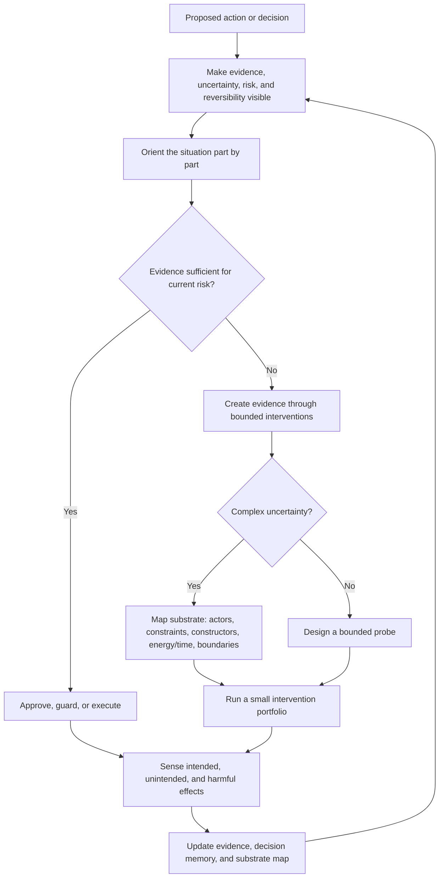
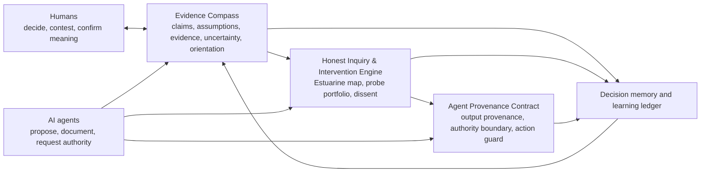
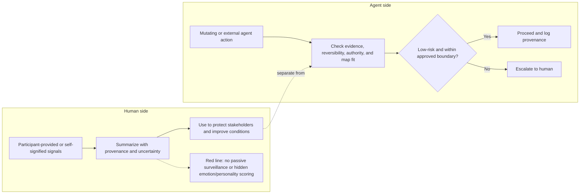

# Evidence-Based Action Tools Product Concept

**Status:** DRAFT — current design is the 3 consolidated tools in the "2026-07-01 current concept" section below. Session 2 pruned superseded forward-looking content. Session 3 restored non-surveilling agent enforcement, outcome-learning closure, and the parked workplace/team track. Session 4 incorporated Estuarine Mapping: participatory domain orientation, substrate mapping, intervention portfolios, volatility/counterfactual boundaries, and map-based learning. Session 5 added concept diagrams only. Session 6 documented conceptual gaps and removed roadmap/spec-level forward planning.
**Created:** 2026-07-01
**Last Updated:** 2026-07-01 (session 6, Codex)
**Author Role:** Product Strategist + LLM Expert

---

## Context

This WIP captures a product direction proposed after the LinkedIn discussion about a simple shared rule:

> Decisions and actions should be evidence-based, whether they are human actions or AI-agent actions.

The extension is the important part: if evidence is missing, the system should not pretend certainty or proceed by intuition alone. It should create evidence through bounded, reversible, observable interventions before committing to higher-impact action.

This is product discovery, not an approved roadmap. Any implementation path still needs Product Strategist, Lead Architect, and LLM Expert review.

## Source Anchors

- FactHarbor role in the broader program: evidence modelling, contested-claim analysis, reasoning transparency, and verifiable reports.
- FactHarbor user needs: evidence transparency, source provenance, understanding uncertainty/consensus, professional API access, and social-media fact-checking.
- FactHarbor quality model: quality gates, evidence quality defence, source reliability, source provenance tracking, and confidence calibration.
- Cynefin: orient each coherent part of a situation before choosing an action mode; mixed situations should be decomposed rather than forced into one domain.
- Estuarine Mapping: for complex situations, map the substrate (actors, constraints, and constructors), energy/time to change, counterfactual and volatile boundaries, then design a portfolio of micro-interventions.
- BestWorkplace: iterate, make work visible, build psychological safety, empower teams, and use feedback loops instead of top-down certainty.
- Evidence-based management: combine scientific evidence, organizational data, practitioner expertise, and stakeholder values/concerns.
- Improvement science/PDSA: treat uncertain changes as small tests with explicit learning criteria.
- Human decision psychology: emotions, loss aversion, motivated reasoning, social threat, and trust shape whether people can use evidence well.
- AI risk guidance: AI systems need accountability, transparency, monitoring, risk controls, and human oversight for consequential actions.

Public references:

- https://thecynefin.co/about-us/about-cynefin-framework
- https://www.linkedin.com/posts/strategy-cynefin-decisionmaking-share-7478037566621982720-k4T7
- https://thecynefin.co/effective-decision-making-support-tool/
- https://cynefin.io/wiki/Estuarine_framework
- https://cynefin.io/wiki/Constraint_mapping
- https://cynefin.io/wiki/Vector_theory_of_change
- https://thecynefin.co/sensemaker-algorithms-ai/
- https://www.nature.com/articles/s44159-024-00305-0
- https://hbr.org/2007/11/a-leaders-framework-for-decision-making
- https://robertschaub.github.io/BestWorkplace
- https://cebma.org/resources-and-tools/what-is-evidence-based-management/
- https://www.ihi.org/resources/how-to-improve
- https://www.nist.gov/itl/ai-risk-management-framework

## 2026-07-01 current concept

*This section is the current state. It took the original concept catalog through two adversarial debates (`/debate`, FULL tier), consolidated it to three tools, translated it to plain language, and later corrected the design with Estuarine Mapping. Read this first; later sections keep only supporting provenance, risks, and known gaps.*

### Two debates run

1. **General design — "are these the right tools?"** → **MODIFY: consolidate to 3** (confidence INFERRED). Both consistency probes broke the larger set: failure-mode coverage only justifies ~3 tools, and a Decision Ledger + Agent Firewall pairing *reads as surveillance* — failing the human-psychology / agency-and-dignity requirement as a **design** flaw, not a deployment risk.
2. **FactHarbor-specific — "build it during alpha?"** → **MODIFY: defer build** (confidence INFERRED). Keep capacity on core analysis quality. Any future dogfood probe must be treated as evidence creation for the concept, not as an implicit commitment to product build.

### Evidence assessment for the Estuarine revision

- The supplied LinkedIn post (The Cynefin Company, 2026-07-01) links to Beth Smith's 2024 article distinguishing **Cynefin as orientation** from **Estuarine Mapping as action design in complexity**. The official Cynefin wiki adds the operational detail used here: decomposition, energy/time mapping, counterfactual and volatile boundaries, and intervention portfolios.
- These are practitioner frameworks, not evidence that this product has demand or will improve decisions. They justify design hypotheses; KG1 demand and product-effectiveness claims still require direct probes.
- A 2024 *Nature Reviews Psychology* review provides a narrower empirical anchor: across the synthesized domains, interventions targeting access and social support had stronger average effects than those targeting knowledge or beliefs; among individual determinants, habit-focused interventions also ranked above knowledge and beliefs. This supports designing beyond information-only or belief-correction interventions, but it does not validate Estuarine Mapping software or guarantee an effect in a specific context.

### The consolidated design — 3 tools (down from the component catalog below)

| Tool | Absorbs (from catalog below) | Human face | Agent face |
|---|---|---|---|
| **Evidence Compass** | #1 Card, #4 Cynefin room, #5 Ledger, #7 Claim radar | participatory intake decomposes mixed situations into coherent parts, maps each part to a Cynefin domain, flags confusion/aporia and domain dissonance, and records claims, assumptions, evidence, and revisit triggers; a human confirms consequential orientations | proposes domain mappings with evidence, rationale, alternatives, and uncertainty; emits a machine-readable orientation ledger, not an opaque whole-system classification |
| **Honest Inquiry & Intervention Engine** | #3 Experiment Designer, #6 Emotional radar, #9 Dissent room | combines the pre-commit inquiry ritual with two separable modules: an **Estuarine Action Mapper** (actors; constraints that shape possibilities; constructors that create repeatable transformations; energy/time; boundaries; intervention portfolio) and a **Probe Designer** (hypothesis or directional intent, stop rule, reversibility, harms, provenance, sensing plan) | surfaces disconfirming evidence and unattributed effects; proposes substrate maps and portfolios for human review; creates callable probe, monitoring, amplification, and dampening specifications |
| **Agent Provenance Contract** | #2 Firewall (scoped down), #8 Provenance graph | readers see provenance or a `no-evidence / probe-required` flag; action proposals also expose domain, map item, authority boundary, reversibility, and learning triggers | declaration protocol for outputs; a separate capability-side guard checks mutating/external actions against the approved map and escalates high-impact, cross-boundary, or domain-shifted actions to a human |

Key design rulings:

- **Orient, do not label.** Cynefin intake must decompose mixed situations and preserve alternative perspectives. AI may propose an orientation, but it must not silently assign one domain to an entire consequential situation.
- **Keep Cynefin and Estuarine roles distinct.** Compass identifies the kind of response needed. The Estuarine Action Mapper turns a complex situation into an actionable substrate map. Every resulting intervention is mapped back to Cynefin because a portfolio can contain clear, complicated, complex, and chaotic actions.
- **Map before prioritising.** Identify actors, constraints, constructors, energy/time to change, the currently counterfactual area (not changeable from the present perspective), external-authority/liminal area, and volatile area before selecting work. Easy and fast to change can mean fragile or dangerous, not "low-hanging fruit."
- **Use portfolios, not a single bet.** Complex contexts require multiple small, coherent interventions with sensing, containment, and explicit conditions to amplify, dampen, stop, stabilise, or monitor.
- **Change conditions before trying to change people.** Prefer changes to access, roles, connections, constraints, incentives, and support. Stakeholders remain interpreters of their own experience; the system must not infer hidden emotions or treat people as optimisation targets.
- **Keep the Probe Designer hard-edged and separable.** It creates evidence, while inquiry protects against motivated reasoning and the Estuarine map determines where probes are coherent.
- **Separate observation from enforcement.** Surveillance of people is forbidden; capability control for high-impact agent actions is required. Output provenance remains declarative, while mutating/external actions use a non-surveilling, risk-aware guard and human escalation.

A workplace-practice-coach concept remains out of core for FactHarbor alpha, not invalidated as a future or adjacent product track.

Preserved constraints from the original proposal:

- **Agent action enforcement is still needed for mutating/external actions.** The lighter Agent Provenance Contract is right for agent outputs and human-facing review, but declaration alone may be too weak when an agent can spend money, publish, modify production state, change configuration, send messages, or create irreversible side effects. The next design pass must find a non-surveilling capability-side guard: risk/reversibility-aware, evidence-aware, and human-escalating for high-impact actions.
- **Outcome-learning closure is non-negotiable.** Every accepted action or probe should record the expected directional shift, sensing/revisit trigger, observed effects (including harms and surprises), relevant context, the response taken (amplify/dampen/stop/stabilise), and what changed in the evidence base and substrate map. In complex settings, an observed shift is contextual evidence, not automatic proof of a universal causal rule.
- **BestWorkplace remains a parked adjacent track.** The workplace-practice coach is out of core for the current FactHarbor alpha build, but the underlying need remains: help teams improve psychological safety, transparency, iteration, and decision quality through evidence and bounded experiments rather than slogans or surveillance.

### Plain-language version (the "explain it to anyone" cut)

The whole idea in four steps:

> Make the evidence and uncertainty visible. Work out what kind of situation each part belongs to. In complex situations, map what shapes the system and run a small portfolio of safe-to-fail changes rather than betting on one solution. Watch what shifts, contain harm, and update the map before deciding what to amplify or stop.

Make-or-break principles: **the tools must feel like a teammate ("let's figure this out together"), not a watchdog ("prove you followed the process"), and they should improve the conditions around people before attempting to correct people.** A watchdog or personality-scoring product will be routed around and will damage the psychological safety needed for honest evidence.

### Concept diagrams

These diagrams show the concept boundary. They are not a UI flow, data model, or implementation specification.

**1. Evidence-based action loop**



**2. Three-tool relationship**



**3. Human dignity and agent control boundary**



Worked examples used to explain it (rendered as in-session visuals, not embedded here):
- **Hiring:** "should we hire X?" → name the bet (a good interview ≈ weak proof) → create evidence with a small paid trial task → the AI shows why it ranked a CV and never rejects a person on its own (dignity).
- (Earlier, discarded as too generic: a live-chat-button decision.)

### Charter application caveat

The founder's Our AI Charter path decision was used as an early teaching example. **Session 4 correction:** this was an orientation and probe sketch, not a complete live application, because it did not map the substrate, energy/time to change, counterfactual/volatile boundaries, or intervention dependencies. Do not treat its provisional recommendation as validated by the revised design. The charter itself lives in `Docs/Initiatives/our-ai-charter/` and `github.com/robertschaub/our-ai-charter`; this note is only about the tools, not charter strategy.

What the example still preserves: the tools should expose that a decision is genuinely uncertain, identify the missing evidence, and prevent the team from turning an early probe sketch into a validated strategy.

### Conceptual gaps before spec

These are concept gaps, not a build backlog. They should be resolved only if the concept is deliberately moved into discovery, spec, or implementation.

| Gap | Why it matters |
|---|---|
| **First wedge / first user** | "Humans and AI agents" is directionally right but too broad for a first product. The concept does not yet choose between founder/PM, leadership team, AI-agent builder, compliance/audit, or FactHarbor-internal dogfood as the first wedge. |
| **Evidence threshold by risk** | The rule "actions must be evidence-based" still needs a risk-sensitive interpretation. Low-risk reversible actions, high-impact external actions, and irreversible actions cannot require the same evidence standard. |
| **Evidence creation boundary** | Bounded interventions create contextual evidence, not universal proof. The concept must prevent small probes from becoming pseudo-certainty or post-hoc justification. |
| **Minimum usable Estuarine map** | The current map is faithful to complexity but may be too heavy without facilitation. The unresolved concept question is the smallest non-expert map that changes a decision without importing the whole method. |
| **Authority and override model** | The concept names human escalation but does not yet define who can approve, override, contest, stop, or reopen a consequential action. |
| **Anti-evidence-theatre mechanism** | Users and agents can attach evidence-looking artifacts to pre-decided actions. The concept needs a stronger challengeability rule: evidence must be contestable, provenance-visible, and able to change the action. |
| **Agent failure modes** | The concept needs explicit treatment of fabricated provenance, stale evidence, hidden tool calls, action drift after approval, and overconfident extrapolation from local observations. |
| **Adoption psychology** | The tool must feel like a teammate, not a watchdog. The concept still needs evidence that the workflow lowers cognitive/emotional load instead of adding bureaucracy. |
| **Workplace/team boundary** | BestWorkplace remains a valid adjacent track, but any team-facing product must stay participant-owned and environmental, not emotion inference, employee scoring, or surveillance. |

---

## Product Thesis

FactHarbor can expand from:

> Is this claim supported?

to:

> Is this decision or action justified by evidence, and if not, what evidence should we create next?

The core workflow:

```text
Proposed action
-> expose claims, evidence, uncertainty, risk, and reversibility
-> decompose the situation and orient each coherent part with Cynefin
-> if complex: map substrate, energy/time, and operating boundaries
-> design a portfolio; map each intervention back to Cynefin
-> approve, guard, execute, or escalate each action
-> sense intended, unintended, and harmful effects
-> amplify, dampen, stop, stabilise, or monitor
-> update evidence, decision memory, and the substrate map
```

## Primary Users

| User | Need |
|---|---|
| Human decision-maker | Know whether an action is justified, risky, reversible, and evidence-backed. |
| Team lead / Product Manager | Convert uncertainty into small experiments instead of political debate or guesswork. |
| AI agent | Know when it may act, when it must gather evidence, and when it must ask a human. |
| Reviewer / auditor | Trace what evidence supported an action and whether the outcome matched the prediction. |
| Contributor / employee | Raise concerns without being dismissed as negative or emotional. |

## Component provenance

The original catalog has been compressed so this WIP remains a concept, not a specification. The current design is the three-tool model above.

| Original idea | Current status |
|---|---|
| Evidence-to-Action Card | Absorbed into **Evidence Compass** as the decision/evidence object. Field-level schema is intentionally deferred. |
| Agent Evidence Firewall | Superseded as a hard auth-gate framing because it read as surveillance. The retained need is a separate, non-surveilling capability guard for mutating/external agent actions. |
| Evidence Gap / Experiment Designer | Absorbed into **Honest Inquiry & Intervention Engine** as bounded evidence creation and intervention portfolio design. |
| Cynefin Sensemaking Room | Absorbed into **Evidence Compass** as participatory orientation and decomposition. |
| Decision Memory & Learning Ledger | Retained as the learning substrate across all three tools. |
| Emotional & Stakeholder Signal Radar | Retained only as participant-provided or self-signified impact data; no passive inference, scoring, or surveillance. |
| Claim / Assumption Radar | Absorbed into **Evidence Compass** as load-bearing claim and assumption capture. |
| Evidence Provenance & Independence Graph | Absorbed into **Agent Provenance Contract** and the shared evidence substrate. |
| Evidence-Backed Dissent Room | Absorbed into **Honest Inquiry & Intervention Engine** as contestation and dissent handling. |
| Workplace-practice coach | Parked as an adjacent future track, not part of the FactHarbor alpha concept. |

## Product Risks

| Risk | Mitigation |
|---|---|
| Evidence theatre: users attach weak evidence to justify pre-decided action. | Require counterevidence search, source independence checks, and “what would change our mind.” |
| Agent blockage: evidence requirements make agents too slow. | Tier requirements by risk and reversibility. |
| Emotional signals become manipulative or over-weighted. | Treat emotions as impact and adoption evidence, not as factual truth. |
| Complex situations are forced into simple scoring. | Use Cynefin orientation, decomposition, and safe-to-fail probes. |
| Tool becomes bureaucracy. | Keep the evidence object compact; require proof that extra structure changes decisions. |
| Privacy or workplace surveillance concerns. | Use aggregation, consent, minimization, and strict access controls before any team/emotion feature. |
| Domain cascade: one wrong orientation corrupts downstream action. | Decompose mixed situations, preserve alternatives, require human confirmation for consequential work, and reopen orientation when conditions shift. |
| The easiest item is treated as low-hanging fruit although it is volatile. | Draw the volatile boundary and assess impact before prioritisation; stabilise high-impact volatile items first. |
| A map is mistaken for objective reality. | Record perspective, evidence, uncertainty, dissent, and version; treat the map as a guide to attention, not a substitute for lived observation. |
| A successful local probe is presented as universal causal proof. | Record context and observed pattern shifts; require stronger designs before making general causal claims. |
| Facilitation or AI framing suppresses minority knowledge. | Gather perspectives independently where practical, expose unattributed effects, and use disagreement as a decomposition signal rather than forcing consensus. |

## Resolved concept choices (2026-07-01 wizard)

Seven of the open questions were resolved with the founder via a guided wizard (recommendation-first, with alternatives):

| # | Question | Decision |
|---|---|---|
| 1 | First form | **Standalone Decision Ledger app + service** remains the possible long-run product shape; no build sequence is committed in this concept. |
| 2 | Which actions to guard first | **Any** — action-type-agnostic; a Card can wrap an agent call, a public claim, a code change, or a roadmap decision. |
| 3 | Risk model | **Reversibility + blast-radius** — one uniform model for any action; irreversible/external side-effects auto-escalate. This is what makes "any" (#2) tractable without per-type rules. |
| 4 | Agent autonomy | **Autonomous only if the probe is safe-to-fail** (reversible, bounded, no external side-effects); anything that spends/publishes/mutates escalates to a human. |
| 5 | Evidence sources | **All** — the evidence-item shape (source + provenance + independence) is source-agnostic, so new source types are data, not new code. Bootstrap with telemetry + probe results (already available). |
| 6 | Cynefin orientation | **Hybrid** — a short guided question sequence; the LLM proposes an orientation, the human inspects, contests, and confirms or overrides. No opaque auto-classifier (avoids cascade failure). |
| 7 | Emotion / psych-safety signals | **Voluntary, anonymous, aggregate, decision-attached** — participant-provided, never per-person, never a score. The only form consistent with agency/dignity and the no-surveillance red line. |

**Shape of these answers:** broad on what the concept could become, disciplined on the boundaries that protect trust: uniform risk model, safe-to-fail autonomy bound, human-confirmable orientation, and anonymised/participant-owned human signals.

### Starting hypothesis, if this graduates to a spec (non-binding)

Not a build commitment (see Spec boundary) — just the founder's preferred way to *start*, captured from the wizard so it isn't lost. Use the tool on itself, smallest step first:

1. **Define the Card schema, not an app** (~1 day) — the one object the app and service both revolve around.
2. **Dogfood it as a plain-file / CLI log for ~3 weeks** — the safe-to-fail probe that tests the schema and produces the demand/feasibility evidence (KG1) at near-zero cost.
3. **Then a thin service / API, then the thinnest app** — each only if the prior step earns it.

Stages 1+ wait for both a dogfood signal and the FactHarbor quality gate (same solo-founder hours).

## Spec boundary

This document is intentionally not a product specification. It does not define screens, schemas, prompts, API contracts, data retention, acceptance criteria, or a committed build sequence (the starting hypothesis above is explicitly non-binding). The concept should only move into specification after the gaps above are deliberately accepted, narrowed, or tested.

## Related Local Docs

- `Docs/WIP/2026-07-02_Evidence_Based_Action_Tools_Competitive_Landscape.md` (grounded market sweep: what exists, what's commoditized, where the white space is)
- `Docs/xwiki-pages/FactHarbor/Product Development/Requirements/User Needs/WebHome.xwiki`
- `Docs/xwiki-pages/FactHarbor/Product Development/Specification/Architecture/Quality and Trust/WebHome.xwiki`
- `Docs/WIP/2026-04-04_Source_Provenance_Tracking_Design.md`
- `Docs/WIP/2026-05-28_Pipeline_Telemetry_Concept_and_Plan.md`
- `Docs/AGENTS/Handoffs/2026-06-30_Product_Strategist_LLM_Expert_Evidence_Action_Tools_Proposal.md`
