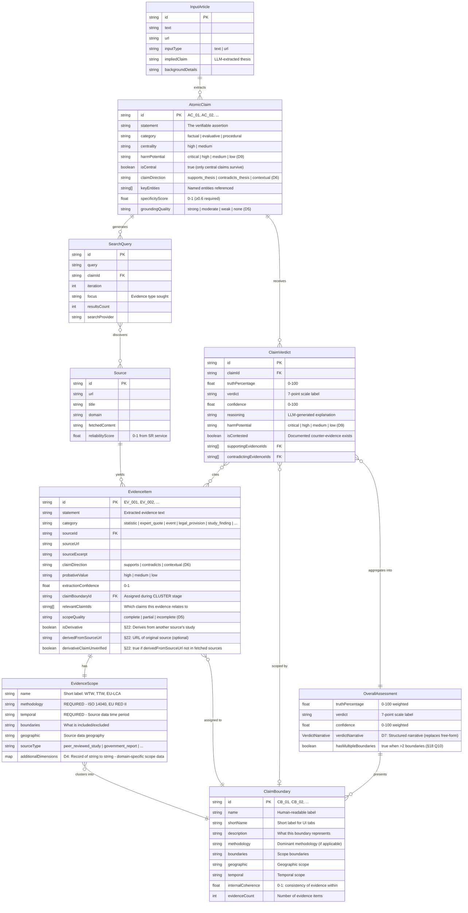
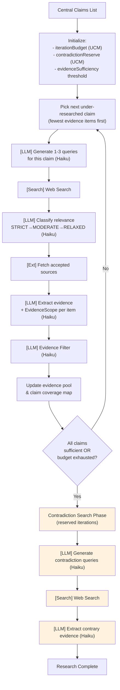
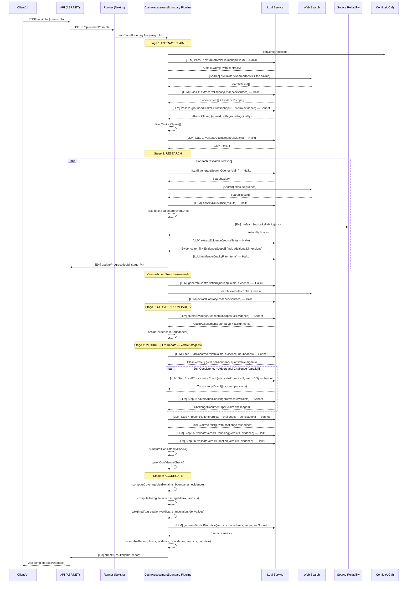
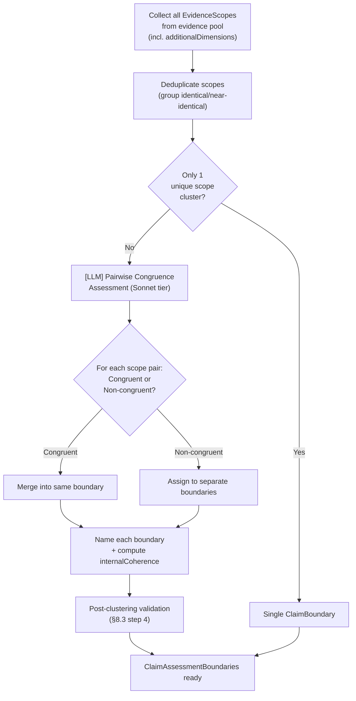

# ClaimAssessmentBoundary Pipeline — Architecture & Design

**Date:** 2026-02-15 (reviewed 2026-02-16, revised 2026-02-16)
**Author:** Claude Opus 4.6 (Lead Architect)
**Status:** IMPLEMENTED (v2.11.0, 2026-02-17) — All 5 stages operational. 817 tests passing.
**Supersedes:** Orchestrated pipeline AnalysisContext architecture (Phases 1–9)
**Git tag:** `pre-claimboundary-redesign` (tagged before any changes)

> **Implementation Note (2026-02-17):** This architecture is fully implemented in `claimboundary-pipeline.ts` and `verdict-stage.ts`. The following items are **deferred to v1.1**: Gate 1 retry loop (§8.1.5), CLAIM_GROUPING UI display (§18 Q1), advanced triangulation (§8.5.2), contestation weight reduction (requires factualBasis field), derivative detection improvements (§8.5.3). See [CB_Execution_State.md](CB_Execution_State.md) for full implementation history.

### Review & Revision History

| Date | Action | Author |
|------|--------|--------|
| 2026-02-15 | Initial architecture draft (§1–18, Appendices A-C) | Lead Architect |
| 2026-02-16 | Senior Developer review (§19) — APPROVE WITH 6 CONDITIONS | Senior Developer |
| 2026-02-16 | Captain inputs (§20) — 2 dismissed, 2 sharpened, 1 reframed, 1 unchanged | Captain |
| 2026-02-16 | Lead Architect revision (§21) — all conditions addressed in-line | Lead Architect |
| 2026-02-16 | Brainstorming round — 5 ideas assessed by Lead Architect, Lead Developer, Senior Architect | All reviewers |
| 2026-02-16 | Captain decisions (D1–D3) — all decisions closed | Captain |
| 2026-02-16 | **Full revision (§22)** — integrated LLM debate, triangulation, multi-perspective verdicts, self-consistency, coverage matrix, verdict module, structural checks | Lead Architect |
| 2026-02-16 | **Round 2 revision** — D4–D9 decisions integrated: EvidenceScope extensibility, qualitative field granularity, claimDirection rename, VerdictNarrative, rules audit Step 0, harmPotential 4-level. Diagram tagging, I/O contracts, evidence-informed granularity rule. | Lead Architect |
| 2026-02-16 | **§18 Open Questions closed** — All 10 questions resolved via multi-role review (6 roles). Captain decisions on Q1 priority (v1.0), Q4 migration (hard cutover), Q10 threshold (≤ 2), tooltip display (hybrid). | Lead Architect |
| 2026-02-16 | **§15 Monolithic Dynamic adaptation** — Phase 3b added for MD→ClaimBoundary. **§8.5.5 verdict calculation** — quantified self-consistency spread multipliers, added article confidence formula, documented 7-point band table. **§15 incremental cleanup** — restructured all phases to remove dead code step by step (build+test after each step), not big-bang Phase 4. ~15,800 lines removed across phases 2-4. **§22.3 expanded** — Agent Confusion Prevention rules, per-phase test updates (10 files/49 refs), per-phase xWiki doc updates (51 files/483 refs). Tests and docs update with code, not deferred. **§15.1.1 Commit & Tag Strategy** — commit at every stable state (code+tests+docs bundled), lightweight git tags at each phase boundary (~17-27 commits, 9 tags). | Lead Architect |
| 2026-02-16 | **§22.5 Execution Team Plan** — role-to-phase assignments, model tier rationale, handover protocol, worktree strategy, Cline/GLM-5 guidelines. **§22.6 Self-Recovery Protocol** — build failure, test failure, architecture confusion, import cycle recovery procedures. **Execution infrastructure:** `CB_Execution_State.md` tracking file + `CB_Phase_Prompts.md` copy-paste playbook created. | Lead Architect |

### Decision Record

#### Round 1 (Brainstorming Review)

| Decision | Choice | Rationale |
|----------|--------|-----------|
| **D1: Claim Quality Gate** | **Merged** — `groundingQuality` in Pass 2, validated in Gate 1 | No separate Haiku call; auditability via Gate 1 rejection log |
| **D2: Self-Consistency Modes** | **Two modes (full / disabled)** | No "lightweight" Haiku mode — measures model capability, not verdict instability |
| **D3: Architecture Doc Update** | **Full update** | All decisions closed; architecture doc is the single implementation reference |

#### Round 2 (Captain Comments)

| Decision | Choice | Rationale |
|----------|--------|-----------|
| **D4: EvidenceScope Structure** | **Named core + extensible `additionalDimensions`** | Keep `methodology` (optional, populated when available), `temporal` (optional, populated when available), `boundaries` (optional), `geographic` (optional) as stable core. Add `additionalDimensions: Record<string, string>` for domain-specific scope data. **Implementation note:** All fields except `name` are optional in TypeScript types (`types.ts`). The LLM is instructed to extract scope data when present, but extraction is best-effort — `scopeQuality` tracks completeness. |
| **D5: Qualitative Field Granularity** | **Field-by-field** | `probativeValue` 3, `harmPotential` 4, `centrality` 3, `groundingQuality` 4, `scopeQuality` 3, `specificityScore` continuous. Rule: categorical for LLM classification, continuous for LLM assessment. |
| **D6: claimDirection "neutral"** | **Rename to "contextual"** | "neutral" was dead code in decision-making. "contextual" signals clear semantics: evidence providing relevant background without directional stance. |
| **D7: Structured VerdictNarrative** | **Yes — structured type** | `VerdictNarrative` with `headline`, `evidenceBaseSummary`, `keyFinding`, `boundaryDisagreements[]`, `limitations`. LLM-generated (Sonnet, 1 call). |
| **D8: Rules Audit Timing** | **Lead Architect as Step 0** | Audit AGENTS.md + Multi_Agent_Collaboration_Rules.md for AnalysisContext-specific rules BEFORE implementation. Deliverable: diff of rule changes. |
| **D9: harmPotential 4 Levels** | **critical / high / medium / low** | Addresses inflation: `critical` (1.5×) = death/injury allegations, `high` (1.2×) = serious but not life-threatening, `medium` (1.0×) = moderate, `low` (1.0×) = minimal. |

**Status: All 9 decisions closed + all 10 open questions resolved (§18). No open items remain.**

### Condition Resolution Summary

| # | Condition | Status | Where Addressed |
|---|-----------|--------|----------------|
| 1 | **EvidenceScope mandatory** | **RESOLVED** | §8.1 step 2c, §8.2 step 6, §9.1 EvidenceScope schema, §9.2 note |
| 2 | API backward compatibility | **DISMISSED** (Captain: clean break) | §15 simplified |
| 3 | **Evidence-grounded claim extraction** | **RESOLVED** | §8.1 redesigned as two-pass with preliminary search |
| 4 | **Congruence-focused clustering** | **RESOLVED** | §11 reframed around congruence assessment |
| 5 | Budget reference | **DISMISSED** (Captain: new budget model) | §13.2 note added |
| 6 | **ResearchState schema alignment** | **RESOLVED** | §9.1 ResearchState updated with iteration counters |

**Approved as-is (no changes needed):** Key Factors removal, one verdict per claim, claim-only research, hard cutover migration, aggregation.ts reuse, legal framework search removal.

### v1 Feature Set (14 items — all reviewers aligned)

| # | Feature | Origin | LLM Cost | Notes |
|---|---------|--------|----------|-------|
| 1 | Two-pass evidence-grounded extraction | §8.1 | 3–5 Haiku | Pass 2 includes `groundingQuality` |
| 2 | Mandatory EvidenceScope | §8.2 | 0 | `methodology` + `temporal` required |
| 3 | Congruence-focused clustering | §11 | 1 Sonnet | Merge-vs-separate by scope congruence |
| 4 | LLM debate pattern (advocate/challenger/reconciliation) | §8.4 | +2 Sonnet | 3-step sequential in verdict stage |
| 5 | Source triangulation scoring | §8.5 | 0 | Deterministic, plugs into weight chain |
| 6 | Multi-perspective verdict (quantitative only) | §8.4 | 0 | Per-boundary truth%, confidence, direction |
| 7 | Self-consistency check (full/disabled) | §8.4 | 0–2 Sonnet | Re-run advocate only. Skip in deterministic mode. |
| 8 | `isDerivative` flag + weight reduction | §8.2, §8.5 | 0 | `derivativeMultiplier` in AggregationWeights |
| 9 | Claim coverage matrix | §8.5 | 0 | Claims × boundaries, logged to job events |
| 10 | Verdict stage module (`verdict-stage.ts`) | §15 | 0 | Separate module, NOT in orchestrated.ts |
| 11 | Gate 1 enhancement (grounding quality + retry) | §12 | 0 | If >50% claims fail, re-run preliminary search + Pass 2 |
| 12 | Verdict consistency check (structural) | §12 | 0 | Structural invariants only (AGENTS.md compliant) |
| 13 | Derivative validation | §8.2 | 0 | Verify `derivedFromSourceUrl` in fetched sources |
| 14 | Optional claim grouping for UI | §18 Q1 | 1 Haiku | Post-verdict grouping for 4+ claims. UCM toggle `ui.enableClaimGrouping` (default off) |

---

## Table of Contents

1. [Executive Summary](#1-executive-summary)
2. [Motivation & Problem Statement](#2-motivation--problem-statement)
3. [Core Design Principles](#3-core-design-principles)
4. [Architecture Overview](#4-architecture-overview)
5. [Entity Relationship Diagram (ERD)](#5-entity-relationship-diagram-erd)
6. [Pipeline Workflow Diagram](#6-pipeline-workflow-diagram)
7. [Collaboration Diagram](#7-collaboration-diagram)
8. [Detailed Stage Design](#8-detailed-stage-design)
9. [Data Types / Schema](#9-data-types--schema)
10. [Key Factors: Recommendation](#10-key-factors-recommendation)
11. [ClaimBoundary Clustering Algorithm](#11-claimboundary-clustering-algorithm)
12. [Quality Gates](#12-quality-gates)
13. [Configuration (UCM)](#13-configuration-ucm)
14. [Current vs New: Comparison Matrix](#14-current-vs-new-comparison-matrix)
15. [Migration Strategy](#15-migration-strategy)
16. [Success Criteria](#16-success-criteria)
17. [Risks & Mitigations](#17-risks--mitigations)
18. [Resolved Questions](#18-resolved-questions-formerly-open-questions)
22. [Brainstorming Integration](#22-brainstorming-integration) (Schema/UI contract, UCM prompt registry, Step 0 rules audit, v2 deferred items)

---

## 1. Executive Summary

This document proposes a **complete rework** of the FactHarbor orchestrated analysis pipeline. The central change is replacing the **AnalysisContext** concept (pre-created analytical frames that drive research and verdicts) with **ClaimBoundary** (evidence-grouping boundaries that emerge organically from gathered EvidenceScopes).

**Core thesis:** The current pipeline creates analytical contexts *before* evidence is gathered, then struggles to maintain them (context explosion, cap enforcement bugs, refinement instability). The new design inverts this: **claims extracted from the input article drive all research**, and **ClaimAssessmentBoundaries are created *after* research** by clustering compatible EvidenceScopes. This eliminates the context lifecycle management that has been the source of persistent quality issues through Phases 1–9.

**Key changes:**
- **Drop AnalysisContext** as a pipeline concept (UI: renamed to ClaimBoundary)
- **ClaimAssessmentBoundaries emerge from evidence**, not from input analysis
- **Atomic claims are the sole research driver** — no context-driven queries
- **Aggressive centrality filtering** — only central claims from the input article
- **Recommend removing Key Factors** as a pipeline stage (see §10)

---

## 2. Motivation & Problem Statement

### 2.1 Chronic Issues with AnalysisContext

The AnalysisContext concept has been the single largest source of pipeline instability across 9 phases of development:

| Phase | Problem | Root Cause |
|-------|---------|------------|
| Phase 1–7 | Context instability, ID drift | Pre-created contexts don't match reality of gathered evidence |
| Phase 8 | Context explosion (11 contexts for H2 vs EV) | LLM over-generates contexts during UNDERSTAND |
| Phase 9a | Cap enforcement incomplete | 3 uncapped paths in `refineContextsFromEvidence()` |
| Phase 9a | Budget starvation | Too many contexts → iterations spread thin → thin evidence per claim |
| Phase 9a | Verdict instability (±15pp) | Context assignment shuffles evidence between runs |
| Phase 9a | 60–100% Gate4 insufficient rate | Per-context budget not implemented; too many contexts |

### 2.2 The Fundamental Design Flaw

AnalysisContext is created **before** evidence gathering (during UNDERSTAND), then **refined** post-research, creating a circular dependency:

```
UNDERSTAND → Create Contexts → Research per Context → Refine Contexts → Verdict per Context
     ↑                                                        |
     └───── Contexts depend on evidence that doesn't exist yet ┘
```

This circularity produces:
1. **Speculative context creation** — the LLM guesses what contexts will be relevant
2. **Context-driven research bias** — searches shaped by guessed contexts miss cross-cutting evidence
3. **Refinement instability** — post-research refinement can create/merge/split contexts unpredictably
4. **Complex cap enforcement** — 6+ code paths where context count must be controlled
5. **Budget fragmentation** — iteration budget split across contexts that may be wrong

### 2.3 The ClaimBoundary Insight

Trustworthy evidence documentation states its scope (methodology, temporal bounds, geographic region). By extracting EvidenceScopes during research and clustering them *afterward*, we let the evidence itself define the analytical structure.

**Key principle:** Evidence tells us what boundaries exist. We don't need to guess.

---

## 3. Core Design Principles

| # | Principle | Rationale |
|---|-----------|-----------|
| 1 | **Claims drive research, nothing else** | Removes context bias from search queries |
| 2 | **Only central claims survive extraction** | Prevents research budget waste on peripheral claims |
| 3 | **Boundaries emerge from evidence** | Eliminates speculative context creation |
| 4 | **EvidenceScopes cluster into ClaimAssessmentBoundaries** | Compatible scopes merge; contradictory scopes separate |
| 5 | **One verdict per claim** | Simpler than per-claim-per-context; boundaries provide narrative nuance |
| 6 | **LLM intelligence for all semantic decisions** | Per AGENTS.md mandate — no deterministic text analysis |
| 7 | **Generic by design** | No domain-specific logic — works for legal, scientific, regulatory, any topic |

---

## 4. Architecture Overview

### 4.1 High-Level Pipeline

```
┌────────────────────────────────────────────────────────────────────────────────────────────┐
│                             ClaimAssessmentBoundary Pipeline                                          │
│                                                                                            │
│  ┌──────────────┐   ┌──────────┐   ┌───────────┐   ┌──────────────┐   ┌─────────────┐   │
│  │ EXTRACT      │──▶│ RESEARCH │──▶│ CLUSTER   │──▶│ VERDICT      │──▶│  AGGREGATE   │   │
│  │ CLAIMS       │   │          │   │ BOUNDARIES│   │ (debate)     │   │              │   │
│  │ (two-pass)   │   │          │   │(congruence│   │              │   │              │   │
│  └──────────────┘   └──────────┘   └───────────┘   └──────────────┘   └─────────────┘   │
│                                                                                            │
│  1. Quick scan      2. Query gen    3. Congruence    4. Advocate         5. Coverage       │
│     [LLM]              [LLM]          assessment        [LLM]              matrix         │
│  2. Prelim search   3. Web search      [LLM]        5. Self-consistency  6. Triangulation │
│     [Search]           [Search]     4. Assign           [LLM]           7. Narrative gen  │
│  3. Prelim extract  4. Classify        evidence      6. Adversarial        [LLM]         │
│     [LLM]              [LLM]                            [LLM]           8. Weighted avg   │
│  4. Grounded        5. Fetch [Ext]                   7. Reconciliation  9. Report         │
│     extract [LLM]   6. Extract                          [LLM]                             │
│  5. Centrality +       [LLM]                         8. Validation                        │
│     Gate 1 [LLM]                                        [LLM]                             │
│                                                      9. Structural chk                    │
└────────────────────────────────────────────────────────────────────────────────────────────┘

Legend: [LLM] = LLM call  [Search] = Web search  [Ext] = External service call  (no tag) = deterministic
```

### 4.2 Comparison: Current vs New

```
CURRENT (AnalysisContext):
Input → UNDERSTAND(+contexts) → RESEARCH(per context) → REFINE(contexts) → VERDICT(per context) → AGGREGATE

NEW (ClaimBoundary):
Input → EXTRACT_CLAIMS → RESEARCH(per claim) → CLUSTER_BOUNDARIES → VERDICT(per claim) → AGGREGATE
```

### 4.3 What's Eliminated

| Removed | Why |
|---------|-----|
| Context detection in UNDERSTAND | Boundaries emerge from evidence |
| Context canonicalization | No pre-created contexts to canonicalize |
| `enforceContextCap()` (all 6+ call sites) | No pre-created contexts to cap |
| `refineContextsFromEvidence()` | Replaced by single-pass boundary clustering |
| `ensureContextsCoverAssignments()` | No context→claim assignment to maintain |
| Context anchor recovery | No anchors needed |
| Supplemental context request | No recovery path needed |
| Per-context iteration budget | Per-claim budget instead |
| `contextId` on claims/evidence | `claimBoundaryId` assigned post-clustering |

---

## 5. Entity Relationship Diagram (ERD)

### 5.1 Core Entity Relationships



### 5.2 Key Relationship Rules

1. **InputArticle → AtomicClaim**: 1-to-many. Only central claims survive the extraction filter.
2. **AtomicClaim → SearchQuery**: 1-to-many. Each claim generates 1–3 queries per research iteration.
3. **Source → EvidenceItem**: 1-to-many. Each source can yield multiple evidence items.
4. **EvidenceItem ↔ EvidenceScope**: 1-to-1. Every evidence item carries its source's scope metadata.
5. **EvidenceScope → ClaimBoundary**: Many-to-1. Compatible scopes are clustered into one boundary.
6. **ClaimVerdict → ClaimBoundary**: Optional. A verdict may reference boundary-specific findings. If only one boundary exists, this is implicit.
7. **ClaimVerdict → EvidenceItem**: Many-to-many. Each verdict cites supporting and contradicting evidence.

---

## 6. Pipeline Workflow Diagram

### 6.1 Full Pipeline Workflow

```mermaid
flowchart TD
    subgraph "Stage 1: EXTRACT CLAIMS (Two-Pass, Evidence-Grounded)"
        I["Input Article<br>(text or URL)"] --> P["Parse & Clean Input"]
        P --> P1["[LLM] Pass 1: Quick Claim Scan<br>(Haiku tier)"]
        P1 --> PS["[Search] Preliminary Search<br>2-3 queries on thesis + top claims"]
        PS --> PE["[LLM] Extract preliminary evidence<br>+ EvidenceScopes (Haiku tier)"]
        PE --> P2["[LLM] Pass 2: Evidence-Grounded<br>Claim Extraction (Sonnet tier)<br>Input + preliminary evidence"]
        P2 --> CF["Centrality Filter<br>Keep only central claims"]
        CF --> G1["[LLM] Gate 1: Claim Validation<br>Factual + Specificity ≥0.6"]
        G1 --> DR{"Specificity<br>pass?"}
        DR -->|"Yes"| CL["Central Claims List<br>(with expectedEvidenceProfile)"]
        DR -->|"No (high centrality)"| RETRY["[LLM] Decomposition Retry<br>(Haiku tier)"]
        RETRY --> CL
    end

    subgraph "Stage 2: RESEARCH"
        CL --> QG["[LLM] Generate Search Queries<br>per claim (Haiku tier)"]
        QG --> WS["[Search] Web Search<br>(Tavily/Brave/etc.)"]
        WS --> REL["[LLM] Relevance Classification<br>(Haiku tier)"]
        REL --> FE["[Ext] Fetch Relevant Sources"]
        FE --> EX["[LLM] Extract Evidence + EvidenceScopes<br>(Haiku tier)"]
        EX --> EF["[LLM] Evidence Filter<br>(quality assessment)"]
        EF --> SC{"Sufficient<br>evidence<br>per claim?"}
        SC -->|"No (budget remains)"| QG
        SC -->|"Yes / budget exhausted"| CON
        CON["[Search]+[LLM] Contradiction Search<br>(reserved iterations)"]
        CON --> EV["Evidence Pool<br>with EvidenceScopes"]
    end

    subgraph "Stage 3: CLUSTER BOUNDARIES"
        EV --> SC2["Collect All EvidenceScopes"]
        SC2 --> LLM2["[LLM] Cluster Scopes<br>into ClaimAssessmentBoundaries<br>(Sonnet tier)"]
        LLM2 --> ASN["Assign Evidence<br>to ClaimAssessmentBoundaries"]
        ASN --> CB["ClaimAssessmentBoundaries<br>+ assigned evidence"]
    end

    subgraph "Stage 4: VERDICT (LLM Debate — verdict-stage.ts)"
        CB --> ADV["[LLM] Step 1: Advocate Verdict<br>(Sonnet) — per-claim verdicts<br>with per-boundary signals"]
        ADV --> SC3["[LLM] Step 2: Self-Consistency<br>(Sonnet × 2, parallel)"]
        ADV --> CH["[LLM] Step 3: Adversarial Challenge<br>(Sonnet, parallel with Step 2)"]
        SC3 --> REC["[LLM] Step 4: Reconciliation<br>(Sonnet) — final verdicts<br>incorporating challenges"]
        CH --> REC
        REC --> VV["[LLM] Step 5: Verdict Validation<br>(Haiku × 2, grounding + direction)"]
        VV --> SCC["Structural Consistency Check<br>(deterministic)"]
        SCC --> G4["Gate 4: Confidence Check"]
        G4 --> VL["Validated Verdicts"]
    end

    subgraph "Stage 5: AGGREGATE"
        VL --> CM["Coverage Matrix<br>(claims × boundaries)"]
        CM --> TRI["Triangulation Scoring<br>(boundary agreement)"]
        TRI --> DW["Derivative Weight<br>Reduction"]
        DW --> AG["Weighted Aggregation<br>(centrality × harm × confidence<br>× triangulation × derivative)"]
        AG --> VN["[LLM] VerdictNarrative<br>Generation (Sonnet)"]
        VN --> RA["Report Assembly"]
        RA --> OUT["Final Report<br>with ClaimBoundary sections"]
    end

    style CF fill:#fff3e0
    style G1 fill:#c8e6c9
    style CON fill:#fff3e0
    style LLM2 fill:#e3f2fd
    style G4 fill:#c8e6c9
```



### 6.2 Research Loop Detail



---

## 7. Collaboration Diagram

### 7.1 Component Interaction



### 7.2 LLM Call Budget

| Stage | LLM Calls | Model Tier | Purpose |
|-------|-----------|------------|---------|
| PASS_1_EXTRACTION | 1 | Haiku | Quick rough claim scan |
| PASS_1_EVIDENCE | 1–3 | Haiku | Extract evidence from preliminary sources |
| PASS_2_EXTRACTION | 1 | Sonnet | Evidence-grounded claim extraction (incl. groundingQuality) |
| CLAIM_VALIDATION (Gate 1) | 1 | Haiku | Factual + specificity + grounding check |
| DECOMPOSITION_RETRY | 0–1 | Haiku | Split vague claims (if needed) |
| GATE1_RETRY | 0–4 | Haiku+Sonnet | §22: If >50% fail, re-search + re-extract (max 1 retry) |
| GENERATE_QUERIES | N (1 per claim per iteration) | Haiku | Search query generation |
| RELEVANCE_CLASSIFICATION | N (1 per search batch) | Haiku | Accept/reject search results |
| EXTRACT_EVIDENCE | N (1 per source) | Haiku | Extract evidence + mandatory scope + isDerivative |
| SCOPE_VALIDATION_RETRY | 0–N | Haiku | Re-extract items with missing scope (if needed) |
| EVIDENCE_QUALITY | N (1 per evidence batch) | Haiku | Quality assessment |
| CONTRADICTION_QUERIES | 1 | Haiku | Generate opposing search terms |
| CLUSTER_BOUNDARIES | 1 | Sonnet | Congruence-based scope clustering |
| ADVOCATE_VERDICT (Step 1) | 1 | Sonnet | §22: Advocate verdicts with per-boundary signals |
| SELF_CONSISTENCY (Step 2) | 0–2 | Sonnet | §22: Re-run advocate at elevated temp (parallel with Step 3) |
| ADVERSARIAL_CHALLENGE (Step 3) | 1 | Sonnet | §22: Devil's advocate challenges (parallel with Step 2) |
| RECONCILIATION (Step 4) | 1 | Sonnet | §22: Final verdicts incorporating challenges + consistency |
| VERDICT_VALIDATION (Step 5) | 2 (grounding + direction) | Haiku | Validate verdict quality |
| VERDICT_NARRATIVE (D7) | 1 | Sonnet | Generate structured VerdictNarrative for overall assessment |

**Expected total LLM calls:** 18–37 (vs 20–50+ in current pipeline with context loops). The 5–7 added calls for the debate pattern + narrative (advocate + 0–2 consistency + challenger + reconciliation + narrative) are offset by eliminating context detection, canonicalization, refinement, and supplemental context calls. Additional cost ~$0.65/run.

---

## 8. Detailed Stage Design

### 8.1 Stage 1: EXTRACT CLAIMS (Evidence-Grounded, Two-Pass)

> **Revision note (§21, Condition 3):** Redesigned from single cold extraction to two-pass evidence-grounded approach per Captain directive: "Give LLMs all information to enable excellent atomic claim isolation."

**Purpose:** Parse the input article and extract only the central, verifiable atomic claims — grounded by preliminary evidence so claims are specific and research-ready.

**Input:** Raw text or URL

**Output:** `AtomicClaim[]` — ordered by centrality, filtered to central only, each with `expectedEvidenceProfile`

**Rationale for two-pass:** In a claim-only research pipeline, claim quality is the critical gate — vague claims produce weak search queries and thin evidence. A cold extraction from text alone often produces broad claims (e.g., "hydrogen is inefficient") that relied on AnalysisContext framing for precision in the old pipeline. By grounding the second pass in real preliminary evidence, the LLM can produce specific, independently-researchable claims (e.g., "FCEV well-to-wheel efficiency is 25–35% vs BEV 70–80%").

**Process:**

1. **Parse input** — if URL, fetch and extract article text. If text, use directly.
2. **Pass 1: Rapid claim scan + preliminary search** (Haiku tier)
   - (a) **Quick extraction:** LLM extracts the article's central thesis (`impliedClaim`) and 3–8 rough claim candidates from the input text. These are deliberately imprecise — just enough to drive a preliminary search.
   - (b) **Preliminary search:** For the `impliedClaim` and top 2–3 rough claims, execute 1–2 web search queries each. Fetch top 3–5 sources per query. Extract brief evidence snippets with EvidenceScope metadata.
   - (c) **Evidence grounding context:** Collect the preliminary evidence items (with their EvidenceScopes) as grounding material for Pass 2. This gives the LLM real-world context: what methodologies exist, what metrics are used, what scope boundaries matter.
3. **Pass 2: Evidence-grounded claim extraction** (Sonnet tier)
   - The LLM receives:
     - The original input text
     - The preliminary evidence items + EvidenceScopes from step 2
     - Guidance: "Each claim must be specific enough to generate targeted search queries without additional framing. Use the preliminary evidence to inform claim precision — reference specific methodologies, metrics, and scope boundaries where the evidence reveals them."
   - Outputs:
     - `impliedClaim`: The overall thesis (refined with evidence context)
     - `backgroundDetails`: Context/background (informational, not analytical)
     - `atomicClaims[]`: Specific, research-ready verifiable assertions
     - Each claim includes `expectedEvidenceProfile` describing what evidence types would verify/refute it
     - Each claim includes `groundingQuality` (4-level, LLM-assessed, required output field):
       - **"strong"** — preliminary evidence directly informed claim precision (specific metrics, methodologies, or scope boundaries referenced)
       - **"moderate"** — preliminary evidence referenced evidence themes but claim lacks specifics from it
       - **"weak"** — preliminary evidence was tangential; claim largely derived from input text alone
       - **"none"** — claim not informed by preliminary evidence (pure cold extraction)
   - Any evidence items from the preliminary search that are high-quality are **retained** and fed directly into the Stage 2 evidence pool (avoiding redundant re-extraction).
4. **Centrality filter** — keep only claims where `centrality = "high"` or `centrality = "medium"`. Drop:
   - Attribution claims ("X said Y") — unless Y itself is the central claim
   - Source/timing metadata ("According to a 2024 report")
   - Peripheral context-setting claims
   - Claims about the article's structure or rhetoric
5. **Gate 1: Claim Validation** — verify each claim is:
   - Factual/verifiable (not pure opinion or prediction)
   - **Specific enough to research independently** (specificity score ≥ 0.6, LLM-assessed)
   - **Grounded in preliminary evidence** (`groundingQuality` ≥ "moderate" preferred for pass. "weak" acceptable for claims the input article states explicitly. "none" acceptable but flagged for monitoring.)
   - If a claim fails specificity but passes factual check and has high centrality, trigger a **decomposition retry**: ask the LLM to split the vague claim into 2–3 more specific sub-claims
6. **Gate 1 retry loop** (Decision D1 — merged quality gate):
   - After Gate 1, if **>50% of central claims are rejected** (failed specificity or factual check), this indicates poor claim extraction quality
   - **Action:** Trigger a second preliminary search with refined queries (based on the claims that DID pass + the rejection reasons), then re-run Pass 2 with the expanded evidence context
   - **Max 1 retry** to avoid infinite loops
   - Gate 1 rejection reasons are logged per claim for auditability

**Centrality assessment criteria (LLM-evaluated):**

| Centrality | Keep? | Description |
|------------|-------|-------------|
| `high` | Yes | Directly supports or contradicts the article's thesis |
| `medium` | Yes | Provides important supporting/contextual evidence for the thesis |
| `low` | **No** | Peripheral, attributional, or rhetorical — not central to verifying the thesis |

**Claim fields extracted:**

```typescript
{
  id: "AC_01",
  statement: "The verifiable factual assertion",
  category: "factual" | "evaluative" | "procedural",
  centrality: "high" | "medium",
  harmPotential: "critical" | "high" | "medium" | "low",  // D9: 4-level scale
  isCentral: true,
  claimDirection: "supports_thesis" | "contradicts_thesis" | "contextual",  // D6: "neutral" → "contextual"
  keyEntities: ["Entity A", "Entity B"],
  checkWorthiness: "high" | "medium",
  specificityScore: number,             // 0-1, LLM-assessed (≥0.6 required)
  groundingQuality: "strong" | "moderate" | "weak" | "none", // D5: 4-level scale
  expectedEvidenceProfile: {            // What evidence would verify/refute this
    methodologies: string[],            // e.g., ["WTW analysis", "vehicle dynamometer testing"]
    expectedMetrics: string[],          // e.g., ["efficiency %", "energy loss kWh/km"]
    expectedSourceTypes: SourceType[],  // e.g., ["peer_reviewed_study", "government_report"]
  }
}
```

**LLM call budget for Stage 1:**

| Call | Tier | Purpose |
|------|------|---------|
| Pass 1 extraction | Haiku | Quick rough claim scan |
| Pass 1 evidence extraction | Haiku | Extract evidence from preliminary sources (1–3 calls) |
| Pass 2 grounded extraction | Sonnet | Final specific claim extraction with evidence context |
| Gate 1 validation | Haiku | Factual + specificity check |
| Decomposition retry (if needed) | Haiku | Split vague claims into specific sub-claims |

**Total Stage 1 cost:** 3–6 LLM calls (vs 1 in original design). The added cost is justified: claim quality is the foundation of the entire pipeline. A well-scoped claim saves 2–3 wasted research iterations later.

**Evidence-Informed Claim Granularity Rule (Captain Comment 9):**

> Claims should be at the granularity where evidence naturally supports or contradicts them. Do not force artificial atomicity. If a compound claim cannot be meaningfully split without losing its verifiable core, keep it compound. If a broad claim can be sharpened by referencing specific evidence patterns discovered during preliminary search, sharpen it. The LLM should use preliminary evidence to determine the RIGHT level of claim specificity, not default to maximum decomposition.

Pass 2 prompt guidance includes: "When extracting claims, consider the evidence landscape from the preliminary search. If the evidence addresses the topic at a particular level of specificity, match your claim specificity to the evidence level. Do not split claims into sub-claims that no evidence directly addresses. A claim that is too atomic to research is worse than a compound claim that evidence naturally engages with."

Gate 1 `specificityScore` should be assessed relative to the evidence landscape, not in absolute terms — if evidence exists at a claim's level of generality, the claim's specificity is adequate.

**harmPotential Assessment (D9 — 4-level scale):**

| Level | Definition | Weight Multiplier (UCM) | Prompt Example |
|-------|-----------|------------------------|----------------|
| `critical` | The claim ITSELF alleges death, severe physical injury, imminent safety hazards, or major fraud (>$1M) | **1.5×** | "The drug caused 12 deaths" |
| `high` | Serious but not life-threatening: significant legal consequences, major reputational damage, substantial economic harm | **1.2×** | "The trial violated due process" |
| `medium` | Moderate impact: procedural fairness, policy criticism, moderate economic/legal effects. **DEFAULT when uncertain.** | **1.0×** | "The regulatory approval was rushed" |
| `low` | Minimal real-world impact: routine updates, factual descriptions, low-stakes claims | **1.0×** | "The study was published in 2023" |

**Qualitative Field Design Rule (D5):** Categorical for LLM classification outputs (the LLM chooses a category). Continuous for LLM assessment outputs (the LLM rates on a scale). Never ask for "0.73 probativeValue" when you mean "high."

**I/O Contracts (Captain Comment 8):**

```
[LLM] Pass 1: Quick Claim Scan
  Tier: Haiku
  Input: { originalText }
  Output: { impliedClaim, roughClaims[3-8] }
  UCM Prompt Key: CLAIM_EXTRACTION_PASS1

[Search] Preliminary Evidence Search
  Input: { impliedClaim, topRoughClaims[2-3], queriesPerClaim: 1-2 (UCM) }
  Output: { searchResults[], fetchedSources[3-5 per query] }
  Provider: Tavily/Brave (UCM-configured)

[LLM] Pass 1: Preliminary Evidence Extraction
  Tier: Haiku (1-3 calls depending on source count)
  Input: { fetchedSourceTexts[], roughClaims[] }
  Output: { preliminaryEvidenceItems[], preliminaryEvidenceScopes[] }
  UCM Prompt Key: (part of CLAIM_EXTRACTION_PASS1)

[LLM] Pass 2: Evidence-Grounded Claim Extraction
  Tier: Sonnet
  Input: { originalText, preliminaryEvidence[], preliminaryEvidenceScopes[], guidance }
  Output: { impliedClaim, backgroundDetails, atomicClaims[] (with groundingQuality, harmPotential,
            claimDirection, specificityScore, expectedEvidenceProfile), retainedEvidence[] }
  UCM Prompt Key: CLAIM_EXTRACTION_PASS2

[LLM] Gate 1: Claim Validation
  Tier: Haiku
  Input: { atomicClaims[], specificityThreshold: 0.6 (UCM) }
  Output: { passedClaims[], rejectedClaims[] (with reasons), gate1Stats }
  UCM Prompt Key: (part of Gate 1 prompt)

[LLM] Decomposition Retry (conditional)
  Tier: Haiku
  Input: { vagueHighCentralityClaims[] }
  Output: { decomposedSubClaims[2-3 per input claim] }
  UCM Prompt Key: (part of CLAIM_EXTRACTION_PASS2)
```

**What's NOT extracted (compared to current UNDERSTAND):**
- No `analysisContexts[]`
- No `keyFactors[]` (see §10)
- No `contextId` on claims
- No `legalFrameworks[]` (LLM will use domain knowledge during research)
- No `researchQuestions[]` (claims drive research directly)

---

### 8.2 Stage 2: RESEARCH

**Purpose:** Gather evidence for each central claim using web search and LLM evidence extraction.

**Input:** `AtomicClaim[]` (+ any preliminary evidence retained from Stage 1)

**Output:** `EvidenceItem[]` (each carrying a **mandatory** `EvidenceScope`)

**Process:**

1. **Seed evidence pool** — import any high-quality evidence retained from Stage 1 preliminary search. These already have EvidenceScopes and avoid re-fetching the same sources.
2. **Claim-driven query generation** — for each under-researched claim, generate 1–3 search queries. The `expectedEvidenceProfile` from Stage 1 informs query construction (e.g., searching for specific methodology names or metric types).
3. **Web search** — execute queries via configured provider (Tavily, Brave, etc.)
4. **Relevance classification** — LLM classifies results as relevant/irrelevant (STRICT→MODERATE→RELAXED progression)
5. **Source fetch** — download and extract content from relevant URLs
6. **Source reliability prefetch** — batch-check domain reliability scores
7. **Evidence extraction with mandatory EvidenceScope** — LLM extracts evidence items from source text. Each item MUST include:
   - `statement`: The extracted evidence assertion
   - `category`: Type classification
   - `claimDirection`: supports/contradicts/**contextual** (D6) relative to relevant claims. Use `contextual` for evidence that provides relevant background — temporal context, definitional facts, process descriptions — without supporting or contradicting the claim. Do NOT use `contextual` as a fallback when direction is unclear; assess direction first.
   - `probativeValue`: high/medium/low quality assessment
   - `evidenceScope`: **REQUIRED** — source methodology metadata (see below). Includes `additionalDimensions` (D4) for domain-specific scope data.
   - `relevantClaimIds[]`: Which central claims this evidence relates to
   - `isDerivative`: **boolean** — true if this evidence derives from or cites another source's underlying study rather than presenting independent findings
   - `derivedFromSourceUrl`: **string (optional)** — URL of the source this evidence derives from. Used instead of internal evidence IDs because during extraction the LLM can identify "this evidence cites the same underlying study as [source URL]" more reliably than matching internal IDs it hasn't seen yet.
8. **EvidenceScope validation** — deterministic check that `methodology` and `temporal` are non-empty. Items failing validation are retried once with a targeted prompt ("This evidence item is missing scope metadata. Re-extract with methodology and temporal fields."). `scopeQuality` assessment (D5 — 3-level):
   - **`complete`** — all required fields (`methodology`, `temporal`) are meaningful and specific; optional fields (`boundaries`, `geographic`) present where applicable
   - **`partial`** — `methodology` + `temporal` present but vague (e.g., "some kind of study" or "recent")
   - **`incomplete`** — missing required fields even after retry
   Items with `scopeQuality: "incomplete"` are kept but flagged. Items with `scopeQuality: "partial"` can still be clustered with reduced confidence.
   The LLM may also populate `additionalDimensions` (D4) — domain-specific scope data like `{ "sample_size": "N=12,000", "blinding": "double-blind" }`. These are optional and LLM-driven; no validation is required for their presence, but they enrich clustering (§11).
9. **Derivative validation** — for items with `isDerivative: true` and a `derivedFromSourceUrl`, verify that the URL exists in the fetched sources pool. If not found, set `derivativeClaimUnverified: true` on the item (prevents hallucinated derivative relationships from affecting aggregation weight).
10. **Evidence filter** — LLM quality check + deterministic safety net
11. **Sufficiency check** — if any claim has fewer than `sufficiencyThreshold` evidence items and iteration budget remains, loop back

> **Revision note (§21, Condition 1):** EvidenceScope is now **mandatory, not optional**. The extraction prompt must always produce meaningful scope metadata, even for non-scientific sources. See EvidenceScope prompt guidance below.

**Research budget model (simplified from current):**

| Parameter | Default | Source |
|-----------|---------|--------|
| `maxResearchIterations` | 12 | UCM |
| `contradictionReservedIterations` | 2 | UCM |
| `claimSufficiencyThreshold` | 3 | UCM |
| `maxSourcesPerIteration` | 8 | UCM |
| `maxEvidencePerSource` | 5 | UCM |

**Claim-priority iteration:** Each iteration targets the claim with the fewest evidence items. This naturally balances research budget across claims without complex per-context allocation.

**Contradiction search (reserved):** After the main research loop, `contradictionReservedIterations` iterations are dedicated to searching for counter-evidence for claims that have one-sided evidence (only supports or only contradicts).

**EvidenceScope prompt guidance for all source types:**

The extraction prompt must instruct the LLM to always produce a meaningful EvidenceScope. Empty strings are NOT acceptable for `methodology` and `temporal`. Examples by source type:

| Source Type | methodology | temporal | boundaries | geographic |
|-------------|-------------|----------|------------|------------|
| Peer-reviewed study | "ISO 14040 lifecycle assessment" | "2019-2023 data" | "Well-to-wheel, excluding manufacturing" | "European Union (27 states)" |
| Government report | "Official statistical survey, census methodology" | "FY2024 (Apr 2023–Mar 2024)" | "Federal jurisdiction, all sectors" | "United States" |
| News (primary) | "Investigative journalism, multi-source corroboration" | "2025-09 (publication date)" | "Single event coverage" | "Switzerland" |
| News (secondary) | "Wire service aggregation, single-source attribution" | "2025-10 (publication date)" | "Event summary, no original investigation" | "Global" |
| Expert statement | "Expert opinion, based on stated professional experience" | "2025 (statement date)" | "Personal assessment, field-specific" | "Not geographically bounded" |
| Fact-check report | "Systematic claim verification, multi-source cross-check" | "2025-08 (published)" | "Single claim verification" | "Brazil" |
| Legal document | "Court ruling, adversarial proceeding with evidence review" | "2024-06-28 (ruling date)" | "Electoral law, Art. 14 Constitution" | "Brazil, federal jurisdiction" |
| Organization report | "NGO field assessment, mixed-methods" | "2022-2024 (study period)" | "Human rights monitoring, prison systems" | "Southeast Asia" |

**`additionalDimensions` examples by domain (D4):**

| Source Domain | `additionalDimensions` Example |
|---------------|-------------------------------|
| Medical/clinical | `{ "sample_size": "N=12,000", "blinding": "double-blind", "follow_up": "24 months" }` |
| Legal | `{ "standard_of_proof": "beyond reasonable doubt", "jurisdiction_level": "federal" }` |
| Economic | `{ "denomination": "2023 USD PPP", "sector_coverage": "all sectors" }` |
| Environmental | `{ "emission_scope": "Scope 1+2+3", "baseline_year": "2019" }` |

The LLM populates `additionalDimensions` when domain-specific scope data enriches the analysis. Core fields (`methodology`, `temporal`) remain the primary congruence signals; `additionalDimensions` provide supplementary clustering context (see §11).

**Key prompt instruction:** "Every evidence source has a methodology — even an opinion column uses 'editorial commentary, author's interpretation.' Every source has a temporal anchor — at minimum the publication date. NEVER return empty strings for these fields. Where domain-specific scope data exists (sample size, legal standard, emission scope, etc.), include it in `additionalDimensions`."

**I/O Contracts (Captain Comment 8):**

```
[LLM] Generate Search Queries (per claim per iteration)
  Tier: Haiku
  Input: { claim (statement, expectedEvidenceProfile), existingEvidence[], iteration }
  Output: { queries[1-3] (with focus annotation) }
  UCM Prompt Key: (part of evidence extraction prompt)

[Search] Web Search
  Input: { queries[], searchProvider (UCM) }
  Output: { searchResults[] (title, url, snippet, relevanceScore) }
  Provider: Tavily/Brave (UCM-configured)

[LLM] Relevance Classification
  Tier: Haiku
  Input: { searchResults[], claim, relevanceMode (UCM: STRICT/MODERATE/RELAXED) }
  Output: { accepted[], rejected[] (with reasons) }
  UCM Prompt Key: (part of evidence extraction prompt)

[Ext] Fetch Sources
  Input: { acceptedUrls[] }
  Output: { fetchedSources[] (url, title, extractedText, fetchStatus) }

[Ext] Source Reliability Prefetch
  Input: { domains[] }
  Output: { reliabilityScores (domain → 0-1 score) }

[LLM] Evidence Extraction (per source)
  Tier: Haiku
  Input: { sourceText, relevantClaims[], extractionGuidance }
  Output: { evidenceItems[] (with statement, category, claimDirection, probativeValue,
            evidenceScope {methodology, temporal, boundaries?, geographic?, additionalDimensions?},
            relevantClaimIds[], isDerivative, derivedFromSourceUrl?) }
  UCM Prompt Key: (part of evidence extraction prompt)

[LLM] Evidence Quality Filter
  Tier: Haiku
  Input: { evidenceItems[], qualityCriteria }
  Output: { passed[], filtered[] (with reasons) }
  UCM Prompt Key: (part of evidence filter prompt)

[LLM] Contradiction Query Generation
  Tier: Haiku
  Input: { claims[], existingEvidence[] (flagging one-sided claims) }
  Output: { contradictionQueries[] }
  UCM Prompt Key: (part of evidence extraction prompt)
```

**What's eliminated:**
- No per-context iteration budget or reallocation
- No context-driven query framing
- No `exhaustedContextNames` tracking
- No gap research per context
- No legal framework search (LLM incorporates domain knowledge into claim queries)

---

### 8.3 Stage 3: CLUSTER BOUNDARIES

**Purpose:** Organize gathered evidence into coherent ClaimAssessmentBoundaries by clustering compatible EvidenceScopes.

**Input:** `EvidenceItem[]` (each with `EvidenceScope`), `AtomicClaim[]`

**Output:** `ClaimBoundary[]`, each EvidenceItem assigned to a boundary

**This is the key innovation.** Instead of pre-creating analytical contexts, we let the evidence's own scope metadata define the analytical structure.

**Process:**

1. **Collect scopes** — extract all unique EvidenceScopes from gathered evidence
2. **LLM clustering** — single Sonnet-tier call that:
   - Groups EvidenceScopes with compatible methodology, boundaries, geography, and temporal period
   - Separates scopes where evidence within them is contradictory due to different methodological assumptions
   - Names each cluster as a ClaimAssessmentBoundary with a human-readable label
   - Assigns each EvidenceItem to its ClaimBoundary
3. **Coherence assessment** — for each boundary, compute `internalCoherence` (0–1) measuring how consistent the evidence within the boundary is
4. **Post-clustering validation** (deterministic, addressing Observation O1):
   - Validate that every returned boundary has a non-empty `id`, `name`, and at least 1 assigned evidence item
   - Validate that every evidence item is assigned to exactly one boundary (no orphans, no duplicates)
   - Validate no duplicate boundary IDs
   - If validation fails (0 boundaries, malformed output, orphaned evidence): **fallback to single "General" boundary** containing all evidence
   - If LLM returns more than `maxClaimAssessmentBoundaries` (UCM, soft cap): merge the two most similar boundaries (using scope similarity from the clustering output) and repeat until under cap. This is a safety net, not the primary control — the congruence-focused prompt (§11) is the primary mechanism.

**Clustering criteria (LLM-evaluated):**

| Factor | Merge if... | Separate if... |
|--------|------------|---------------|
| Methodology | Same or compatible methodology | Fundamentally different approach (WTW vs TTW) |
| Boundaries | Overlapping scope boundaries | Non-overlapping system boundaries |
| Geographic | Same or overlapping regions | Distinct jurisdictions with different rules |
| Temporal | Overlapping time periods | Non-overlapping periods with policy changes |
| Contradiction | Low contradiction between items | High contradiction driven by scope differences |

**Boundary count:** Not capped artificially. The number of boundaries is determined by the evidence. However, a soft guideline in the prompt asks the LLM to avoid unnecessary fragmentation (prefer fewer, broader boundaries unless genuine methodological differences require separation).

**Default boundary:** If evidence doesn't have meaningful scope distinctions (e.g., all from the same type of source about the same topic), all evidence goes into a single "General" boundary.

**Example outcomes:**

| Input Topic | Expected Boundaries |
|-------------|-------------------|
| "H2 vs EV efficiency" | CB_WTW (Well-to-Wheel studies), CB_TTW (Tank-to-Wheel studies), CB_LCA (Lifecycle analyses) |
| "Bolsonaro trial fairness" | CB_TSE (Electoral proceedings), CB_STF (Criminal proceedings) |
| "SRG bias" | CB_GENERAL (single boundary — most evidence uses similar methodology) |
| "Vaccine efficacy" | CB_RCT (Randomized controlled trials), CB_OBSERVATIONAL (Observational studies) |

**I/O Contracts (Captain Comment 8):**

```
[LLM] Congruence-Based Scope Clustering
  Tier: Sonnet
  Input: { uniqueEvidenceScopes[] (incl. additionalDimensions), evidenceItems[] (with scope assignments
           and claimDirections), atomicClaims[], congruenceExamples (from §11.5) }
  Output: { claimBoundaries[] (id, name, shortName, description, constituentScopes[]),
            scopeToBoundaryMapping, congruenceRationale[] }
  UCM Prompt Key: BOUNDARY_CLUSTERING
```

---

### 8.4 Stage 4: VERDICT (LLM Debate Pattern)

> **Revision note (§22):** Major rewrite. Expanded from 2-step (verdict + validation) to 5-step debate pattern integrating Features #4 (adversarial challenge), #6 (multi-perspective quantitative signals), #7 (self-consistency check), and #12 (structural consistency check). Implemented as a separate `verdict-stage.ts` module (Feature #10).

**Purpose:** Generate a verdict for each central claim using an LLM debate pattern — advocate, challenge, reconcile — informed by evidence organized by ClaimBoundary.

**Input:** `AtomicClaim[]`, `EvidenceItem[]` (boundary-assigned), `ClaimBoundary[]`, `CoverageMatrix`

**Output:** `ClaimVerdict[]` (with per-boundary quantitative findings, consistency data, and challenge responses)

**Implementation:** This entire stage is a separate module (`verdict-stage.ts`), NOT inline in the main pipeline file. Each step is an independently testable function. Prompts live in `apps/web/prompts/` and are referenced from UCM (see §22.2 UCM Prompt Registry).

**Process (5 steps):**

#### Step 1 — Advocate Verdict (Sonnet)

Single batch LLM call. The advocate generates initial verdicts for all claims.

- **Input:** Claims + evidence organized by boundary (evidence grouped by `ClaimBoundary` so the LLM understands methodological context)
- **Output:** `ClaimVerdict[]` with per-boundary quantitative findings
- For each claim, consider ALL evidence across all boundaries
- Where boundaries disagree, the verdict explains why and which boundary's evidence is more applicable
- Per-boundary findings are **quantitative signals** (Feature #6 — scoped for v1):
  - `truthPercentage`: Per-boundary truth assessment (0–100)
  - `confidence`: Per-boundary confidence (0–100)
  - `evidenceDirection`: "supports" | "contradicts" | "mixed" | "neutral"
  - `evidenceCount`: Number of evidence items in this boundary for this claim
  - **No per-boundary narrative reasoning in v1** (deferred to v2 — per-boundary narratives multiply prompt complexity without proportional value gain)

#### Step 2 — Self-Consistency Check (Sonnet × 2, PARALLEL with Step 3)

Re-run the Step 1 advocate prompt 2 additional times at elevated temperature to measure verdict stability.

- **Input:** Same prompt as Step 1
- **Temperature:** UCM `selfConsistencyTemperature` (default 0.3, floor 0.1, ceiling 0.7)
- **Output:** `ConsistencyResult[]` per claim:
  ```typescript
  {
    claimId: string;
    percentages: number[];   // [v1, v2, v3] truth percentages
    average: number;
    spread: number;          // max - min
    stable: boolean;         // spread ≤ stableThreshold (UCM, default 12pp)
    assessed: boolean;       // false if skipped
  }
  ```
- **Skip conditions:** If UCM `selfConsistencyMode = "disabled"` OR deterministic mode → return `{ assessed: false, stable: true, spread: 0 }` for all claims. The `assessed: false` flag distinguishes "stable because measured" from "stable because not tested."
- **Model tier:** Same as Step 1 (Sonnet). NOT Haiku — Haiku would measure model capability differences rather than genuine verdict instability (Decision D2).
- **What gets re-run:** The advocate call ONLY (Step 1 prompt), not the full debate. The spread of initial assessment is what matters.

**Spread interpretation (UCM-configurable thresholds):**

| Spread (max - min) | Assessment | Action |
|--------------------|------------|--------|
| ≤ UCM `stableThreshold` (default 5pp) | Highly stable | Full confidence |
| ≤ UCM `moderateThreshold` (default 12pp) | Moderately stable | Slight confidence reduction |
| ≤ UCM `unstableThreshold` (default 20pp) | Unstable | Significant confidence reduction |
| > UCM `unstableThreshold` | Highly unstable | Flag claim as low-confidence regardless of average |

#### Step 3 — Adversarial Challenge (Sonnet, PARALLEL with Step 2)

A dedicated challenger LLM argues the strongest possible case against the emerging verdicts.

- **Input:** Step 1 output (advocate verdicts + per-boundary breakdown)
- **Prompt core:**
  > "You are a critical analyst. The evidence gathered so far suggests the following verdicts. Your job: argue the strongest possible case for why each verdict could be WRONG.
  >
  > For each claim:
  > 1. What assumptions does the current evidence rely on?
  > 2. What evidence would we expect to find if the claim were FALSE — was it looked for? (assess evidence COVERAGE, not just interpretation)
  > 3. Are there methodological weaknesses in the supporting evidence?
  > 4. Is the evidence base truly independent, or does it share common sources?
  >
  > Be specific. Cite evidence items by ID where relevant. If evidence is absent, explain what SHOULD have been found."
- **Output:** `ChallengeDocument` with per-claim challenges:
  ```typescript
  {
    challenges: Array<{
      claimId: string;
      challengePoints: Array<{
        type: "assumption" | "missing_evidence" | "methodology_weakness" | "independence_concern";
        description: string;
        evidenceIds: string[];  // Referenced evidence items (or empty if citing absence)
        severity: "high" | "medium" | "low";
      }>;
    }>;
  }
  ```
- **Scope:** The challenger sees the per-boundary breakdown (useful context for identifying where reasoning is weak), but challenges target the OVERALL verdict synthesis. Per-boundary challenges are v2.
- **Quality requirement:** The challenger must be genuinely adversarial — specific counter-arguments citing evidence IDs or absence thereof. The prompt requires specificity to prevent weak challenges ("maybe more research would help").

#### Step 4 — Reconciliation (Sonnet)

The reconciler produces final verdicts incorporating challenge points and consistency data.

- **Input:** Step 1 verdicts + Step 3 challenges + Step 2 consistency data
- **Output:** Final `ClaimVerdict[]` with:
  - Revised `truthPercentage` and `confidence` (incorporating challenge responses)
  - Consistency-adjusted confidence (if spread was high, confidence reduced per threshold table)
  - Per-boundary `boundaryFindings` retained from Step 1
  - Explicit `challengeResponses[]` — how each challenge point was addressed in the final verdict
  - `reasoning` field includes responses to challenge points
- **Key instruction:** "Consider the challenges seriously. If a challenge point is valid, adjust the verdict. If a challenge is unfounded, explain why with evidence citations. Note any instability flagged by the self-consistency check."

#### Step 5 — Verdict Validation (Haiku × 2, existing design)

Two lightweight checks to catch structural errors.

- **Check A — Grounding:** Does the reasoning cite actual evidence items? Are evidence IDs valid?
- **Check B — Direction:** Does the truth percentage align with the evidence direction?
- **Retry:** If validation fails for some verdicts, retry those in a smaller batch.

#### THEN — Structural Consistency Check (deterministic, Feature #12)

Deterministic checks after the LLM validation. **Structural invariants only** (AGENTS.md compliance — no semantic interpretation):

- Verify all evidence IDs referenced in verdicts exist in the evidence pool
- Verify all boundary IDs in `boundaryFindings` are valid boundary IDs
- Verify no cross-boundary evidence references unless explicitly flagged
- Verify truth percentage within 0–100 range
- Verify verdict label matches truth percentage band (7-point scale mapping)
- Verify claim coverage matrix completeness (every claim has ≥1 evidence item or is flagged)
- **Log** any failures as warnings (do not block pipeline — structural inconsistencies are captured, not fatal)
- **NOT allowed** (would require LLM per AGENTS.md LLM Intelligence rule):
  - Judging whether reasoning is semantically consistent with truth%
  - Assessing whether boundary findings narratively support the overall verdict
  - Any check that interprets text meaning

#### Gate 4: Confidence Check

After all validation, classify each verdict's confidence tier: HIGH, MEDIUM, LOW, INSUFFICIENT (unchanged from current).

**I/O Contracts (Captain Comment 8):**

```
[LLM] Step 1: Advocate Verdict
  Tier: Sonnet
  Input: { atomicClaims[], evidenceItems[] (grouped by ClaimBoundary), claimBoundaries[],
           coverageMatrix }
  Output: { claimVerdicts[] (truthPercentage, verdict, confidence, reasoning, harmPotential,
            supportingEvidenceIds[], contradictingEvidenceIds[],
            boundaryFindings[] {boundaryId, truthPercentage, confidence, evidenceDirection, evidenceCount}) }
  UCM Prompt Key: VERDICT_ADVOCATE

[LLM] Step 2: Self-Consistency Check (0 or 2 calls, parallel with Step 3)
  Tier: Sonnet
  Input: { same prompt as Step 1, temperature: selfConsistencyTemperature (UCM, default 0.3) }
  Output: { consistencyResults[] (claimId, percentages[3], average, spread, stable, assessed) }
  Skip: if selfConsistencyMode="disabled" → return { assessed: false } for all
  UCM Prompt Key: (reuses VERDICT_ADVOCATE)

[LLM] Step 3: Adversarial Challenge (parallel with Step 2)
  Tier: Sonnet
  Input: { Step 1 claimVerdicts[] (with per-boundary breakdown) }
  Output: { challengeDocument { challenges[] (claimId, challengePoints[] {type, description,
            evidenceIds[], severity}) } }
  UCM Prompt Key: VERDICT_CHALLENGER

[LLM] Step 4: Reconciliation
  Tier: Sonnet
  Input: { Step 1 verdicts, Step 3 challenges, Step 2 consistencyResults }
  Output: { finalClaimVerdicts[] (revised truthPercentage, confidence, reasoning (with challenge
            responses), challengeResponses[] {challengeType, response, verdictAdjusted}) }
  UCM Prompt Key: VERDICT_RECONCILIATION

[LLM] Step 5a: Verdict Grounding Validation
  Tier: Haiku
  Input: { finalVerdicts[], evidencePool[] }
  Output: { validationResults[] (claimId, groundingValid: boolean, issues[]) }
  UCM Prompt Key: (part of Gate 1 prompt)

[LLM] Step 5b: Verdict Direction Validation
  Tier: Haiku
  Input: { finalVerdicts[], evidencePool[] }
  Output: { validationResults[] (claimId, directionValid: boolean, issues[]) }
  UCM Prompt Key: (part of Gate 1 prompt)
```

**Parallelism:** Steps 2 and 3 run in parallel (both need only Step 1 output). Step 4 waits for both.

**Critical path latency:** Step 1 → max(Step 2, Step 3) → Step 4 → Step 5 + structural check → Gate 4.

**LLM calls for this stage:** 4–6 Sonnet (1 advocate + 0–2 consistency + 1 challenger + 1 reconciliation) + 2 Haiku (validation). Total added cost ~$0.60/run.

**Verdict structure per claim (v1 — quantitative per-boundary signals):**

```typescript
{
  claimId: "AC_01",
  truthPercentage: 72,
  verdict: "MOSTLY-TRUE",
  confidence: 78,
  reasoning: "Evidence from WTW analyses (CB_WTW) consistently shows... [Challenge response: The challenger noted potential independence concerns between EV_003 and EV_007 — both cite the same JEC-WTW study. However, EV_012 provides independent confirmation from GREET model data.]",
  harmPotential: "medium",
  isContested: true,
  supportingEvidenceIds: ["EV_003", "EV_007", "EV_012"],
  contradictingEvidenceIds: ["EV_005", "EV_019"],
  boundaryFindings: [
    { boundaryId: "CB_WTW", truthPercentage: 76, confidence: 85, evidenceDirection: "supports", evidenceCount: 8 },
    { boundaryId: "CB_TTW", truthPercentage: 88, confidence: 90, evidenceDirection: "supports", evidenceCount: 5 },
    { boundaryId: "CB_GRID", truthPercentage: 52, confidence: 65, evidenceDirection: "mixed", evidenceCount: 6 }
  ],
  consistencyResult: { spread: 4, stable: true, assessed: true },
  challengeResponses: [
    { challengeType: "independence_concern", response: "Valid: EV_003 and EV_007 share common JEC source. EV_012 provides independent GREET confirmation.", verdictAdjusted: false }
  ]
}
```

**Key difference from current:** One verdict per claim (not per-claim-per-context). Boundary-specific findings are quantitative signals (truth%, confidence, direction) for UI display. Full debate trail preserved for auditability.

**Single-boundary display rule:** When `claimBoundaries.length === 1`, do NOT show "Perspective 1 of 1" or multi-boundary UI chrome. Show boundary scope metadata inline beneath the verdict:
> **Evidence base:** Well-to-wheel analyses, 2019–2024, primarily European data

---

### 8.5 Stage 5: AGGREGATE

> **Revision note (§22):** Expanded to include claim coverage matrix (Feature #9), triangulation scoring (Feature #5), derivative weight reduction (Feature #8), and revised aggregation formula.

**Purpose:** Produce the overall assessment by weighted aggregation of claim verdicts, enriched with triangulation and derivative analysis.

**Input:** `ClaimVerdict[]`, `ClaimBoundary[]`, `EvidenceItem[]`, `CoverageMatrix`

**Output:** `OverallAssessment`

**Process:**

#### 8.5.1 Claim Coverage Matrix (Feature #9)

Computed once after Stage 3 (boundaries created), before Stage 4 (verdict). This is the shared data structure that enables triangulation scoring and the sufficiency check.

```
         CB_01   CB_02   CB_03
AC_01:   4       2       3       ← well-covered across boundaries
AC_02:   1       0       0       ← under-researched, single-boundary
AC_03:   0       3       1       ← boundary-specific coverage
```

**Uses:**
- Input to triangulation scoring (below) — determines boundary count per claim
- Input to sufficiency check (§8.2 step 11) — identifies under-researched claims
- Logged to job events for debugging and post-run analysis
- Input to structural consistency check (§8.4 Feature #12) — completeness validation

**Implementation:** ~20 lines of deterministic code. Zero LLM cost.

#### 8.5.2 Triangulation Scoring (Feature #5)

Source triangulation measures whether multiple *independent* boundaries using *different methodologies* reach the same conclusion. This is the quantitative payoff of the ClaimBoundary design — proving boundary structure is analytically valuable, not just organizational.

Computed per claim BEFORE calling `calculateWeightedVerdictAverage()`. Pre-computed and attached as `claim.triangulationFactor`:

| Triangulation Level | Condition | Factor | Action |
|---------------------|-----------|--------|--------|
| **Strong** | ≥3 boundaries pointing same direction | UCM `strongAgreementBoost` (default +0.15) | Increase weight |
| **Moderate** | 2 boundaries agreeing, 1 dissenting | UCM `moderateAgreementBoost` (default +0.05) | Slight increase |
| **Weak** | All evidence from 1 boundary only | UCM `singleBoundaryPenalty` (default -0.10) | Reduce weight |
| **Conflicted** | Boundaries evenly split on direction | UCM `conflictedFlag` (default true) | Flag as contested |

All thresholds are **UCM-configurable** in CalcConfig (mandatory per AGENTS.md):
```json
{
  "triangulation": {
    "strongAgreementBoost": 0.15,
    "moderateAgreementBoost": 0.05,
    "singleBoundaryPenalty": -0.10,
    "conflictedFlag": true
  }
}
```

**Implementation:** ~50 lines of deterministic code. Zero LLM cost. Highest value-to-effort ratio of all v1 features.

```typescript
function computeTriangulation(
  coverageMatrix: CoverageMatrix,
  boundaries: ClaimAssessmentBoundary[],
  verdicts: ClaimVerdict[],
  claim: AtomicClaim
): TriangulationScore {
  const relevantBoundaryIds = coverageMatrix.getBoundariesForClaim(claim.id);
  const directions = relevantBoundaryIds.map(bId => {
    const finding = verdicts.find(v => v.claimId === claim.id)
      ?.boundaryFindings.find(f => f.boundaryId === bId);
    return finding?.evidenceDirection ?? "neutral";
  });

  const supporting = directions.filter(d => d === "supports").length;
  const contradicting = directions.filter(d => d === "contradicts").length;

  return {
    boundaryCount: relevantBoundaryIds.length,
    supporting,
    contradicting,
    level: classifyTriangulation(supporting, contradicting, relevantBoundaryIds.length),
    factor: computeTriangulationFactor(/* from UCM thresholds */)
  };
}
```

#### 8.5.3 Derivative Weight Reduction (Feature #8)

Evidence items with `isDerivative: true` and `derivativeClaimUnverified: false` get reduced weight via UCM `derivativeMultiplier` (default 0.5) in `AggregationWeights`. This prevents 5 articles citing the same UN report from counting as 5 independent sources.

Items with `derivativeClaimUnverified: true` (the `derivedFromSourceUrl` was not found in fetched sources) are treated as non-derivative — the derivative claim could not be validated, so the evidence retains full weight to avoid penalizing potentially legitimate independent evidence.

The `derivativeFactor` for a claim is computed as:
```
derivativeFactor = 1.0 - (derivativeRatio × (1.0 - derivativeMultiplier))
```
Where `derivativeRatio` = proportion of supporting evidence items marked `isDerivative` for this claim.

#### 8.5.4 Revised Aggregation Weight Formula

**v1.0 formula:**
```
weight = centrality × harm × (confidence/100) × triangulationFactor × derivativeFactor
```

Where:
- `centrality`: high=3.0, medium=2.0
- `harm` (D9 — 4-level): critical=1.5, high=1.2, medium=1.0, low=1.0 (UCM `harmPotentialMultipliers`)
- `confidence`: from Gate 4 (0–100), adjusted by self-consistency spread
- `triangulationFactor`: from §8.5.2 (UCM-configured boosts/penalties)
- `derivativeFactor`: from §8.5.3 (UCM `derivativeMultiplier`)

**Contestation weighting deferred to v1.1:**
- CBClaimVerdict (v1.0) has `isContested: boolean` but lacks the `factualBasis` field ("established" / "disputed" / "opinion") needed for 3-level contestationWeights mapping
- Current `aggregation.ts:getClaimWeight()` expects factualBasis field, which is incompatible with CB types
- v1.1 will either: (a) add `factualBasis` field to CBClaimVerdict, or (b) implement simple binary contestation penalty (e.g., `isContested ? 0.7 : 1.0`)
- For v1.0, contestation factor = 1.0 (no penalty)

#### 8.5.5 Weighted Average + Confidence

**Article truth percentage (deterministic):**
```
overallTruth = Σ(effectiveTruth_i × w_i) / Σ(w_i)
```
Where `effectiveTruth = isCounterClaim ? (100 - truthPercentage) : truthPercentage`

**Self-consistency confidence adjustment (per claim, before aggregation):**
```
adjustedConfidence = confidence × spreadMultiplier
```
Where `spreadMultiplier` (UCM `selfConsistencySpreadMultipliers`):

| Spread (max - min) | Multiplier | Band |
|---------------------|-----------|------|
| ≤ `stableThreshold` (default 5pp) | 1.0 | Highly stable |
| ≤ `moderateThreshold` (default 12pp) | 0.9 | Moderately stable |
| ≤ `unstableThreshold` (default 20pp) | 0.7 | Unstable |
| > `unstableThreshold` | 0.4 | Highly unstable |

If `selfConsistencyMode = "disabled"`, no adjustment (`spreadMultiplier = 1.0`).

**Article confidence (deterministic):**
```
overallConfidence = Σ(adjustedConfidence_i × w_i) / Σ(w_i)
```
Same weighted average formula, using the same weights as truth aggregation.

**7-point verdict label (hardcoded bands, NOT UCM-configurable):**

| truthPercentage | Label | Score |
|-----------------|-------|-------|
| 86–100% | TRUE | +3 |
| 72–85% | MOSTLY-TRUE | +2 |
| 58–71% | LEANING-TRUE | +1 |
| 43–57% (confidence ≥ threshold) | MIXED | 0 |
| 43–57% (confidence < threshold) | UNVERIFIED | 0 |
| 29–42% | LEANING-FALSE | -1 |
| 15–28% | MOSTLY-FALSE | -2 |
| 0–14% | FALSE | -3 |

Where `mixedConfidenceThreshold` (UCM, default 40) distinguishes MIXED from UNVERIFIED.

#### 8.5.6 VerdictNarrative Generation (D7)

> **Added Round 2.** Single Sonnet call that produces a structured narrative for the overall assessment, replacing the free-form `narrative: string`.

**Input:** All claim verdicts, boundary structure, triangulation scores, coverage matrix, weighted aggregation results.

**Output:** `VerdictNarrative` (see §9.1):
- `headline`: Overall finding in one sentence (e.g., "Evidence consistently shows X, though Y")
- `evidenceBaseSummary`: Quantitative summary (e.g., "14 items, 9 sources, 3 perspectives")
- `keyFinding`: Main synthesis (2–3 sentences) — the "so what" of the analysis
- `boundaryDisagreements`: Where and why boundaries diverge (only present when relevant)
- `limitations`: What the analysis couldn't determine or where evidence was insufficient

**Generation timing:** After weighted aggregation (§8.5.5), before report assembly (§8.5.7). This is a single Sonnet call with structured output (Zod-validated).

**UCM prompt key:** `VERDICT_NARRATIVE` (added to §22.2 prompt registry).

**Why structured, not free-form:** A structured narrative ensures the headline, key finding, and limitations are always present and separately addressable by the UI. Free-form narratives risk missing critical information or being inconsistently formatted.

#### 8.5.7 Report Assembly

- Overall verdict (7-point scale)
- **VerdictNarrative** (D7 — structured headline, key finding, limitations, boundary disagreements)
- Per-claim verdicts with evidence citations and challenge responses
- ClaimBoundary sections showing evidence organized by scope
- Per-boundary quantitative findings (truth%, confidence, direction) per claim
- Triangulation assessment per claim (boundary agreement level)
- Coverage matrix (for transparency — shows evidence distribution)
- Boundary comparison (when relevant boundaries disagree)
- Self-consistency data (when assessed)

**Two-level presentation:**
- **Overall view** (monolithic equivalent): Overall weighted verdict without per-boundary breakdown
- **Detailed view**: Per-claim verdicts with boundary-specific quantitative signals, triangulation, and challenge responses

**I/O Contracts (Captain Comment 8):**

```
[LLM] VerdictNarrative Generation (D7)
  Tier: Sonnet
  Input: { claimVerdicts[], claimBoundaries[], triangulationScores[], coverageMatrix,
           weightedAggregationResult (truthPercentage, confidence, verdict) }
  Output: { verdictNarrative { headline, evidenceBaseSummary, keyFinding,
            boundaryDisagreements[]?, limitations } }
  UCM Prompt Key: VERDICT_NARRATIVE
```

Note: All other §8.5 computations (coverage matrix, triangulation scoring, derivative weight reduction, weighted aggregation) are deterministic — no LLM or Search calls.

---

## 9. Data Types / Schema

### 9.1 New Types

```typescript
/**
 * AtomicClaim: A single verifiable assertion extracted from the input article.
 * Only central claims (high/medium centrality) survive the extraction filter.
 *
 * Revision (§21, Condition 3): Added specificityScore and expectedEvidenceProfile.
 * Revision (Round 2): harmPotential→4 levels (D9), claimDirection neutral→contextual (D6),
 * groundingQuality→4 levels (D5).
 */
interface AtomicClaim {
  id: string;                    // "AC_01", "AC_02", ...
  statement: string;             // The verifiable assertion
  category: "factual" | "evaluative" | "procedural";
  centrality: "high" | "medium"; // Only central claims survive
  harmPotential: "critical" | "high" | "medium" | "low"; // D9: 4-level (see §8.1 table)
  isCentral: true;               // Always true (filtered)
  claimDirection: "supports_thesis" | "contradicts_thesis" | "contextual"; // D6: "neutral"→"contextual"
  keyEntities: string[];         // Named entities referenced
  checkWorthiness: "high" | "medium";
  specificityScore: number;      // 0-1, LLM-assessed. ≥0.6 required by Gate 1.
  groundingQuality: "strong" | "moderate" | "weak" | "none"; // D5: 4-level (see §8.1)
  expectedEvidenceProfile: {     // What evidence would verify/refute this claim
    methodologies: string[];     // e.g., ["WTW analysis", "vehicle dynamometer testing"]
    expectedMetrics: string[];   // e.g., ["efficiency %", "energy loss kWh/km"]
    expectedSourceTypes: SourceType[]; // e.g., ["peer_reviewed_study", "government_report"]
  };
}

/**
 * ClaimBoundary: A group of compatible EvidenceScopes that define
 * a coherent analytical lens. Created AFTER research by clustering
 * EvidenceScopes — NOT pre-created.
 *
 * Replaces AnalysisContext in the UI (different name to avoid confusion).
 */
interface ClaimBoundary {
  id: string;                    // "CB_01", "CB_02", ...
  name: string;                  // Human-readable: "Well-to-Wheel Analyses"
  shortName: string;             // Short label: "WTW"
  description: string;           // What this boundary represents

  // Derived from constituent EvidenceScopes
  methodology?: string;          // Dominant methodology
  boundaries?: string;           // Scope boundaries
  geographic?: string;           // Geographic scope
  temporal?: string;             // Temporal scope

  // Clustering metadata
  constituentScopes: EvidenceScope[]; // The scopes that compose this boundary
  internalCoherence: number;     // 0-1: how consistent evidence within is
  evidenceCount: number;         // Number of evidence items in this boundary
}

/**
 * BoundaryFinding: Per-boundary quantitative signals within a claim verdict.
 * Provides nuance when different methodological boundaries yield
 * different conclusions about the same claim.
 *
 * Revision (§22): Promoted from narrative summary to quantitative signals.
 * Per-boundary narrative reasoning deferred to v2.
 */
interface BoundaryFinding {
  boundaryId: string;
  boundaryName: string;
  truthPercentage: number;       // §22: Per-boundary truth assessment (0–100)
  confidence: number;            // §22: Per-boundary confidence (0–100)
  evidenceDirection: "supports" | "contradicts" | "mixed" | "neutral";
  evidenceCount: number;
  // NOTE: No `summary` or `reasoning` field in v1 — per-boundary narratives deferred to v2
}

/**
 * ClaimVerdict: Verdict for a single claim (one per claim, not per-boundary).
 * Boundary-specific nuance embedded in boundaryFindings[].
 *
 * Revision (§22): Added consistencyResult, challengeResponses, triangulationScore.
 * Revision (Round 2): harmPotential→4 levels (D9).
 */
interface ClaimVerdict {
  id: string;
  claimId: string;               // FK to AtomicClaim
  truthPercentage: number;       // 0-100
  verdict: ClaimVerdict7Point;   // 7-point scale label
  confidence: number;            // 0-100 (adjusted by self-consistency spread)
  reasoning: string;             // LLM-generated explanation (includes challenge responses)
  harmPotential: "critical" | "high" | "medium" | "low"; // D9: 4-level
  isContested: boolean;
  supportingEvidenceIds: string[];
  contradictingEvidenceIds: string[];
  boundaryFindings: BoundaryFinding[]; // Per-boundary quantitative signals
  consistencyResult: ConsistencyResult; // §22: Self-consistency check output
  challengeResponses: ChallengeResponse[]; // §22: How challenges were addressed
  triangulationScore: TriangulationScore; // §22: Cross-boundary agreement assessment
}

/**
 * OverallAssessment: Final aggregated result.
 *
 * Revision (Round 2): narrative→verdictNarrative (D7, structured type).
 */
interface OverallAssessment {
  truthPercentage: number;       // 0-100 weighted average
  verdict: ArticleVerdict7Point;
  confidence: number;            // 0-100 weighted average
  verdictNarrative: VerdictNarrative; // D7: Structured narrative (replaces free-form string)
  hasMultipleBoundaries: boolean; // true when boundaries.length > 2 (§18 Q10: UI shows boundary breakdown only for 3+)
  claimBoundaries: ClaimAssessmentBoundary[];
  claimVerdicts: ClaimVerdict[];
  coverageMatrix: CoverageMatrix; // §22: Claims × boundaries evidence distribution
  qualityGates: QualityGates;
}

// ===== New Types (§22 — Brainstorming Round Integration) =====

/**
 * ConsistencyResult: Output of self-consistency check (§8.4 Step 2).
 * Measures verdict stability across multiple LLM runs with temperature > 0.
 */
interface ConsistencyResult {
  claimId: string;
  percentages: number[];         // Truth percentages from each run [v1, v2, v3]
  average: number;
  spread: number;                // max - min
  stable: boolean;               // spread ≤ stableThreshold (UCM)
  assessed: boolean;             // false if skipped (disabled or deterministic mode)
}

/**
 * ChallengeDocument: Output of adversarial challenge (§8.4 Step 3).
 */
interface ChallengeDocument {
  challenges: Array<{
    claimId: string;
    challengePoints: ChallengePoint[];
  }>;
}

interface ChallengePoint {
  type: "assumption" | "missing_evidence" | "methodology_weakness" | "independence_concern";
  description: string;
  evidenceIds: string[];         // Referenced evidence (or empty if citing absence)
  severity: "high" | "medium" | "low";
}

/**
 * ChallengeResponse: How a challenge point was addressed in reconciliation (§8.4 Step 4).
 */
interface ChallengeResponse {
  challengeType: ChallengePoint["type"];
  response: string;              // Reconciler's response to the challenge
  verdictAdjusted: boolean;      // Whether the verdict changed because of this challenge
}

/**
 * TriangulationScore: Cross-boundary agreement assessment (§8.5.2).
 */
interface TriangulationScore {
  boundaryCount: number;         // Number of boundaries with evidence for this claim
  supporting: number;            // Boundaries with "supports" direction
  contradicting: number;         // Boundaries with "contradicts" direction
  level: "strong" | "moderate" | "weak" | "conflicted";
  factor: number;                // Multiplicative weight adjustment from UCM thresholds
}

/**
 * CoverageMatrix: Claims × boundaries evidence distribution (§8.5.1).
 * Computed after Stage 3, used by triangulation, sufficiency check, and structural validation.
 */
interface CoverageMatrix {
  claims: string[];              // Claim IDs (rows)
  boundaries: string[];          // Boundary IDs (columns)
  counts: number[][];            // counts[claimIdx][boundaryIdx] = evidence count
  getBoundariesForClaim(claimId: string): string[];  // Boundaries with ≥1 evidence for this claim
  getClaimsForBoundary(boundaryId: string): string[]; // Claims with ≥1 evidence in this boundary
}

/**
 * VerdictNarrative: Structured narrative for the overall assessment (D7).
 * LLM-generated (Sonnet, 1 call) after weighted aggregation.
 * Replaces free-form `narrative: string` on OverallAssessment.
 */
interface VerdictNarrative {
  headline: string;              // Overall finding in one sentence: "Evidence consistently shows X, though Y"
  evidenceBaseSummary: string;   // Quantitative: "14 items, 9 sources, 3 perspectives"
  keyFinding: string;            // Main synthesis (2–3 sentences) — the "so what"
  boundaryDisagreements?: string[]; // Where and why boundaries diverge (only when relevant)
  limitations: string;           // What the analysis couldn't determine
}

/**
 * ClaimUnderstanding: Output of Stage 1 (simplified from current).
 * No analysisContexts, no keyFactors, no researchQuestions.
 */
interface ClaimUnderstanding {
  detectedInputType: InputType;
  impliedClaim: string;
  backgroundDetails: string;
  articleThesis: string;
  atomicClaims: AtomicClaim[];   // Replaces subClaims
  distinctEvents: Array<{ name: string; date: string; description: string }>;
  riskTier: "A" | "B" | "C";
}

/**
 * ResearchState: Accumulating state through analysis (simplified).
 *
 * Revision (§21, Condition 6): Replaced contradictionSearchPerformed boolean
 * with iteration counters to align with the reserved-iteration budget model.
 */
interface ResearchState {
  originalInput: string;
  originalText: string;
  inputType: "text" | "url";
  understanding: ClaimUnderstanding | null;
  evidenceItems: EvidenceItem[];
  sources: FetchedSource[];
  searchQueries: SearchQuery[];
  // Iteration tracking (replaces boolean contradictionSearchPerformed)
  mainIterationsUsed: number;            // Research iterations consumed
  contradictionIterationsReserved: number; // From UCM config
  contradictionIterationsUsed: number;     // Contradiction iterations consumed
  contradictionSourcesFound: number;
  claimBoundaries: ClaimAssessmentBoundary[]; // Populated in Stage 3
  llmCalls: number;
}
```

### 9.2 Retained Types (with notes)

| Type | Notes |
|------|-------|
| `EvidenceItem` | `contextId` replaced by `claimBoundaryId`; `scopeQuality` expanded to 3 levels: `"complete" \| "partial" \| "incomplete"` (D5); `claimDirection` value `"neutral"` renamed to `"contextual"` (D6); added `isDerivative: boolean`, `derivedFromSourceUrl?: string`, `derivativeClaimUnverified?: boolean` (§22 Features #8, #13) |
| `EvidenceScope` | **MODIFIED (§21, Condition 1; Round 2, D4):** `methodology` and `temporal` are now **required** (non-empty string). Validated by Zod schema during extraction. `boundaries`, `geographic`, `sourceType` remain optional but encouraged. **Added `additionalDimensions?: Record<string, string>`** (D4) for LLM-populated domain-specific scope data (e.g., `sample_size`, `standard_of_proof`). Core fields drive clustering; `additionalDimensions` enrich it (see §11). See §8.2 for examples by domain. |
| `SourceType` | Unchanged |
| `ClaimVerdict7Point` | Unchanged (7-point scale) |
| `ArticleVerdict7Point` | Unchanged |
| `QualityGates`, `Gate1Stats`, `Gate4Stats` | Unchanged |
| `VerdictValidationResult` | Unchanged |
| `SearchQuery` | Minor: `claimId` replaces `contextId` |
| `FetchedSource` | Unchanged |

### 9.3 Removed Types

| Type | Reason |
|------|--------|
| `AnalysisContext` | Replaced by ClaimBoundary |
| `EnrichedAnalysisContext` | Replaced by ClaimBoundary + assigned evidence |
| `ContextVerdict` | Replaced by per-claim ClaimVerdict with boundaryFindings |
| `AnalysisContextAnswer` | Replaced by OverallAssessment |
| `KeyFactor` | Removed (see §10) |
| `FactorAnalysis` | Removed (see §10) |

---

## 10. Key Factors: Recommendation

### 10.1 Current Role

Key Factors decompose multi-dimensional claims into evaluation dimensions. For example, "Was X fair?" becomes:
- Procedural fairness (was due process followed?)
- Evidential basis (was the decision based on evidence?)
- Neutrality (was there bias?)

### 10.2 Analysis

In the new ClaimBoundary pipeline, atomic claim extraction **already performs this decomposition**. "Was X fair?" would be extracted as:
- AC_01: "Process followed established legal procedure Y" (procedural)
- AC_02: "Decision was supported by documented evidence Z" (evidential)
- AC_03: "No evidence of systematic bias was found" (evaluative)

Each dimension becomes a separate atomic claim with its own evidence, verdict, and confidence. This is strictly more powerful than Key Factors because:
1. Each dimension gets its own research budget
2. Each dimension gets its own evidence-backed verdict
3. Contradictions within a dimension are captured per-claim
4. No separate "factor supports: yes/no/neutral" assessment needed

### 10.3 Recommendation: Remove Key Factors

**Remove Key Factors as a pipeline concept.** The atomic claim decomposition subsumes their function.

**For UI grouping (if desired):** Use `AtomicClaim.category` (factual/evaluative/procedural) to group claims visually. This is a presentation concern, not a pipeline concept.

**Trade-off:**
- **Pro:** Simpler pipeline, fewer LLM concepts to manage, no opinion-only factor pruning needed
- **Con:** Loses the structured "factor grid" display; claim categories are less descriptive than factor labels

### 10.4 Alternative: Lightweight Claim Grouping (if review team prefers)

If the architecture team wants a "factor grid" UI, an alternative is to add an optional post-verdict **claim grouping** step:
1. After verdicts are generated, LLM groups claims into 3–6 thematic categories
2. Each group gets a label (like a Key Factor name)
3. This is purely presentational — it does not affect verdicts or aggregation

This would be a **post-processing UI enhancement**, not a pipeline stage.

**Decision (§18 Q1): Remove Key Factors from pipeline. Implement §10.4 lightweight claim grouping as a v1.0 post-verdict UI enhancement (UCM toggle `ui.enableClaimGrouping`, default false). Only display for 4+ claim analyses. Any future thematic grouping beyond `AtomicClaim.category` MUST use LLM — deterministic grouping by claim fields is prohibited per LLM Intelligence mandate.**

---

## 11. ClaimBoundary Clustering — Congruence Assessment

> **Revision note (§21, Condition 4):** Reframed from boundary-count management to **congruence assessment** per Captain directive: "Deciding if multiple EvidenceScopes are congruent or not is crucial." The critical quality gate is whether scopes are measuring the same thing in a compatible way — not how many boundaries result.

### 11.1 Core Concept: Scope Congruence

**The clustering stage's primary function is congruence assessment** — determining whether two EvidenceScopes are measuring the same thing in a compatible way (congruent → merge into one ClaimBoundary) or measuring different things / the same thing in incompatible ways (non-congruent → separate ClaimAssessmentBoundaries).

This is what transforms a flat evidence pool into structured analysis. Without it, evidence from WTW and TTW studies would be mixed together, leading to apparent contradictions that are actually methodological differences.

### 11.2 Algorithm Overview



### 11.3 Congruence Assessment Prompt Design

The clustering LLM call receives:
1. All unique EvidenceScopes (deduplicated by methodology+boundaries+geographic+temporal), including any `additionalDimensions` (D4)
2. Evidence items with their scope assignments and claim directions
3. Claim list (for context on what's being analyzed)

**Central prompt instruction:**

> "For each pair of EvidenceScopes, assess congruence: Are these scopes measuring the same thing in a compatible way?
>
> **Congruent** = merge into one ClaimBoundary. **Non-congruent** = separate ClaimAssessmentBoundaries.
>
> Focus on whether merging would obscure a meaningful analytical distinction. The number of boundaries is not a goal — congruence accuracy is.
>
> Also consider `additionalDimensions` when assessing scope compatibility. Dimensions present in one scope but absent in another are NOT grounds for separation — only contradictory dimension values indicate non-congruence. For example, Scope A having `{ "sample_size": "N=12,000" }` and Scope B having no `sample_size` dimension is compatible. But Scope A having `{ "standard_of_proof": "beyond reasonable doubt" }` and Scope B having `{ "standard_of_proof": "balance of probabilities" }` indicates a fundamental methodological difference."

It returns:
1. `ClaimBoundary[]` with names, descriptions, and constituent scope list
2. Scope-to-boundary mapping
3. **Congruence rationale** for each merge/separation decision (critical for auditability)

### 11.4 Congruence Decision Rules (LLM-Evaluated)

**Congruent (merge) when:**
- Same or compatible methodology with overlapping system boundaries
- Same measurement framework, same or overlapping normalization/denomination
- Evidence across scopes is broadly consistent — differences are noise, not signal
- Separation would NOT change the analytical conclusion
- The distinction is granularity (two WTW studies using different datasets), not fundamental approach

**Non-congruent (separate) when:**
- Fundamentally different methodologies that measure different things (WTW vs TTW — different system boundaries)
- Evidence reaches contradictory conclusions **because of** methodological differences
- Different normalization/denomination that makes direct comparison misleading (g CO₂/km vs g CO₂/kWh)
- Different analytical frameworks applied to the same subject (RCT vs observational study)
- Merging would obscure a meaningful distinction that affects the verdict

### 11.5 Congruence Examples (for prompt)

These examples should be included in the clustering prompt to calibrate the LLM's congruence decisions:

| Scope A | Scope B | Congruent? | Rationale |
|---------|---------|------------|-----------|
| "WTW analysis, ISO 14040, EU grid mix 2023" | "WTW analysis, GREET model, US grid mix 2022" | **Yes** | Same methodology family (WTW), same system boundary, different datasets → merge |
| "WTW analysis, ISO 14040, full lifecycle" | "TTW analysis, EPA dynamometer test" | **No** | Different system boundaries (WTW includes production, TTW excludes it) → separate |
| "RCT, double-blind, 12-month follow-up" | "RCT, single-blind, 6-month follow-up" | **Yes** | Same methodology (RCT), compatible design → merge |
| "RCT, double-blind, 12-month" | "Observational cohort study, 5-year" | **No** | Fundamentally different methodology → separate |
| "TSE electoral law, Art. 14 Constitution" | "TSE electoral law, Resolution 23.607" | **Yes** | Same legal framework and jurisdiction → merge |
| "TSE electoral proceeding, 2024" | "STF criminal proceeding, 2024" | **No** | Different legal proceedings with different standards of proof → separate |
| "Journalistic reporting, Reuters, 2025" | "Journalistic reporting, AP, 2025" | **Yes** | Same methodology, same temporal → merge |
| "Government official statistics, 2023" | "NGO field assessment, mixed-methods, 2023" | **No** | Different methodology and different data collection → separate |
| "RCT, double-blind, 12-month" + `{ "standard_of_proof": "FDA Phase III" }` | "RCT, double-blind, 6-month" + `{ "standard_of_proof": "FDA Phase III" }` | **Yes** | Same methodology, same regulatory standard (D4: matching `additionalDimensions`) → merge |
| "Court ruling, 2024" + `{ "standard_of_proof": "beyond reasonable doubt" }` | "Civil proceeding, 2024" + `{ "standard_of_proof": "balance of probabilities" }` | **No** | Different legal standard in `additionalDimensions` (D4) → separate |

### 11.6 Edge Cases

| Scenario | Handling |
|----------|----------|
| All scopes congruent | Single boundary (valid — many topics have uniform methodology) |
| All scopes non-congruent | N boundaries (valid but unusual — the prompt asks: "could any of these be merged?") |
| 20+ unique scopes | LLM clusters by congruence; post-validation merges if >maxClaimAssessmentBoundaries (safety cap) |
| Single evidence item per scope | Cluster by methodology family similarity; avoid singleton boundaries (merge with closest) |
| Scopes disagree but NOT because of methodology | **Merge** — the contradiction is factual, not methodological. The boundary should show internal disagreement via low `internalCoherence`. |
| Evidence with `scopeQuality: "incomplete"` | Still clustered (using whatever scope data exists). Low-quality scopes are clustered by source type and temporal proximity as secondary signals. |

---

## 12. Quality Gates

### 12.1 Gate 1: Claim Validation (enhanced with specificity + grounding quality)

> **Revision note (§21, Condition 3; §22, Decision D1):** Gate 1 now validates claim **specificity** and **grounding quality**. If >50% of claims fail, triggers a retry loop (see §8.1 step 6).

**Trigger:** After EXTRACT_CLAIMS Pass 2, before RESEARCH

**Checks:**
- Is the claim factual/verifiable? (not pure opinion or prediction)
- Is the claim **specific enough to research independently**? (`specificityScore ≥ 0.6`)
- Is the claim **grounded in preliminary evidence**? (`groundingQuality` 4-level assessment, D5):

  | groundingQuality | Gate 1 Treatment |
  |-----------------|------------------|
  | `strong` | Pass — fully grounded in preliminary evidence |
  | `moderate` | Pass — evidence themes referenced but claim lacks specifics |
  | `weak` | Pass with flag — acceptable for claims the input article states explicitly |
  | `none` | Pass with monitoring flag — cold extraction, may indicate poor preliminary search |

**Pass/fail:**
- Pure opinion → filtered out
- Prediction → filtered out (unless explicitly in article thesis)
- Ambiguous → kept if centrality is "high"
- **Specific enough** (score ≥ 0.6) → pass
- **Too vague** (score < 0.6, centrality "high") → **decomposition retry** — LLM splits into 2–3 specific sub-claims
- **Too vague** (score < 0.6, centrality "medium") → filtered out

**Retry loop (§22, Decision D1):**
- After Gate 1, if **>50% of central claims are rejected** (UCM `gate1GroundingRetryThreshold`, default 0.5): this indicates poor overall extraction quality
- **Action:** Trigger second preliminary search with refined queries (using passing claims + rejection reasons), re-run Pass 2 with expanded evidence context
- **Max 1 retry** to avoid infinite loops
- Gate 1 rejection reasons logged per claim for auditability

### 12.2 Gate 4: Verdict Confidence (retained, unchanged)

**Trigger:** After VERDICT (all 5 steps complete), before AGGREGATE

**Checks:**
- Evidence count per claim
- Average source quality
- Evidence agreement ratio
- Uncertainty factors
- Self-consistency spread (§22 — if `assessed: true`, high spread reduces confidence tier)

**Confidence tiers:** HIGH, MEDIUM, LOW, INSUFFICIENT (unchanged)

### 12.3 Structural Consistency Check (§22, Feature #12)

> **Added in §22.** Deterministic post-verdict validation. AGENTS.md compliant — structural invariants only, no semantic interpretation.

**Trigger:** After §8.4 Step 5 (verdict validation), before Gate 4

**Allowed checks (deterministic):**
- All evidence IDs referenced in verdicts exist in the evidence pool
- All boundary IDs in `boundaryFindings` are valid ClaimBoundary IDs
- No cross-boundary evidence references unless explicitly flagged
- Truth percentage within 0–100 range
- Verdict label matches truth percentage band (7-point scale mapping)
- Claim coverage matrix completeness (every claim has ≥1 evidence item or is flagged)

**NOT allowed (would require LLM — AGENTS.md LLM Intelligence rule):**
- Judging whether a verdict's reasoning is semantically consistent with its truth%
- Assessing whether boundary findings narratively support the overall verdict
- Any check that interprets text meaning

If semantic consistency checking is desired in the future, it must be routed through an LLM call and made a UCM-toggled quality gate.

**Failures:** Logged as warnings, do not block the pipeline. Structural inconsistencies are captured for debugging, not treated as fatal errors.

### 12.4 Removed Gates / Checks

| Check | Reason for Removal |
|-------|-------------------|
| Context cap enforcement | No contexts to cap |
| Context–claim assignment validation | No context assignments |
| Context coverage completeness | Boundaries are emergent, not checked for coverage |
| Context anchor validation | No anchors |

---

## 13. Configuration (UCM)

### 13.1 New Parameters

> **Revision note (§22):** Parameters from brainstorming round added. All new parameters that influence analysis output are UCM-configurable per AGENTS.md.

**Stage 1 — Claim Extraction:**

| Parameter | Default | Type | Description |
|-----------|---------|------|-------------|
| `centralityThreshold` | `"medium"` | enum | Minimum centrality to keep a claim (`"high"` or `"medium"`) |
| `claimSpecificityMinimum` | `0.6` | float | Minimum specificity score for Gate 1 pass |
| `maxAtomicClaims` | `15` | int | Maximum claims after centrality filter |
| `preliminarySearchQueriesPerClaim` | `2` | int | Search queries in Stage 1 preliminary search |
| `preliminaryMaxSources` | `5` | int | Max sources to fetch in Stage 1 preliminary search |
| `gate1GroundingRetryThreshold` | `0.5` | float | §22: If >X% of claims fail Gate 1, trigger retry loop |

**Stage 2 — Research:**

| Parameter | Default | Type | Description |
|-----------|---------|------|-------------|
| `claimSufficiencyThreshold` | `3` | int | Min evidence items per claim before considering it sufficient |
| `contradictionReservedIterations` | `2` | int | Iterations reserved for contradiction search |

**Stage 3 — Clustering:**

| Parameter | Default | Type | Description |
|-----------|---------|------|-------------|
| `maxClaimAssessmentBoundaries` | `6` | int | Safety cap on boundary count (post-validation merge trigger, not prompt target) |
| `boundaryCoherenceMinimum` | `0.3` | float | Minimum internalCoherence; below this, boundary is flagged |

**Stage 4 — Verdict (§22 additions):**

| Parameter | Default | Type | Config | Description |
|-----------|---------|------|--------|-------------|
| `selfConsistencyMode` | `"full"` | `"full" \| "disabled"` | PipelineConfig | §22: Self-consistency check mode. No "lightweight" option (Decision D2). |
| `selfConsistencyTemperature` | `0.3` | float | PipelineConfig | §22: Temperature for self-consistency re-runs |
| `selfConsistencySpreadThresholds` | `{stable: 5, moderate: 12, unstable: 20}` | object | CalcConfig | §22: Spread thresholds (pp) for stable/moderate/unstable classification |

**Note:** `selfConsistencyTemperature` floor (0.1) and ceiling (0.7) are **hardcoded structural constants** — below 0.1 the spread is always near-zero (meaningless), above 0.7 everything looks unstable. These are fixed design decisions per AGENTS.md Configuration Placement.

**Stage 5 — Aggregation (§22 additions):**

| Parameter | Default | Type | Config | Description |
|-----------|---------|------|--------|-------------|
| `triangulation.strongAgreementBoost` | `0.15` | float | CalcConfig | §22: Weight boost for ≥3 boundaries agreeing |
| `triangulation.moderateAgreementBoost` | `0.05` | float | CalcConfig | §22: Weight boost for 2 boundaries agreeing, 1 dissenting |
| `triangulation.singleBoundaryPenalty` | `-0.10` | float | CalcConfig | §22: Weight penalty for single-boundary evidence only |
| `triangulation.conflictedFlag` | `true` | boolean | CalcConfig | §22: Flag claim as contested when boundaries evenly split |
| `derivativeMultiplier` | `0.5` | float | CalcConfig (AggregationWeights) | §22: Weight reduction for derivative evidence |
| `harmPotentialMultipliers.critical` | `1.5` | float | CalcConfig (AggregationWeights) | D9: Weight multiplier for critical-harm claims |
| `harmPotentialMultipliers.high` | `1.2` | float | CalcConfig (AggregationWeights) | D9: Weight multiplier for high-harm claims |
| `harmPotentialMultipliers.medium` | `1.0` | float | CalcConfig (AggregationWeights) | D9: Weight multiplier for medium-harm claims |
| `harmPotentialMultipliers.low` | `1.0` | float | CalcConfig (AggregationWeights) | D9: Weight multiplier for low-harm claims |

### 13.2 Retained Parameters

> **Note (§21, Condition 5 dismissed):** Budget parameters will be designed fresh for the new pipeline. Current values are starting points, not inherited constraints. The budget model will be finalized during implementation based on prototype results.

| Parameter | Default | Notes |
|-----------|---------|-------|
| `maxResearchIterations` | `12` | Starting point; to be tuned during implementation |
| `maxSourcesPerIteration` | `8` | Unchanged |
| `maxTotalTokens` | `500000` | Unchanged |
| `searchProvider` | `"tavily"` | Unchanged |
| `searchRelevanceMode` | `"MODERATE"` | Unchanged |
| `sourceReliabilityEnabled` | `true` | Unchanged |

### 13.3 Removed Parameters

| Parameter | Reason |
|-----------|--------|
| `contextDetectionEnabled` | No context detection |
| `contextDetectionMaxContexts` | No contexts to cap |
| `contextDetectionMinConfidence` | No context confidence |
| `contextDetectionMethod` | No context detection method |
| `maxIterationsPerContext` | No per-context budgets |

---

## 14. Current vs New: Comparison Matrix

| Aspect | Current (AnalysisContext) | New (ClaimBoundary) |
|--------|--------------------------|---------------------|
| **Analytical structure** | Pre-created before research | Emerges from evidence |
| **Research driver** | Context-framed queries | Claim-driven queries |
| **Structure creation** | UNDERSTAND (speculative) + REFINE (post-hoc) | CLUSTER (one-shot, post-research) |
| **Cap management** | 6+ enforcement points, 3 uncapped bugs | Not needed (soft guidance only) |
| **Budget model** | Per-context allocation (complex, untested) | Per-claim priority (simple: least-evidence-first) |
| **Verdicts** | Per-claim-per-context, single LLM call | Per-claim with LLM debate (advocate → challenge → reconcile), per-boundary quantitative signals |
| **Context lifecycle** | Create → canonicalize → cap → research → refine → cap again → verify | Gather evidence → cluster → done |
| **LLM calls for structure** | 3–5 (detect, canonicalize, refine, supplement, verify) | 1 (cluster) + 4–6 (verdict debate) |
| **Verdict quality assurance** | None (single LLM call) | Adversarial challenge + self-consistency check + structural validation |
| **Evidence independence** | Not tracked | `isDerivative` flag + derivative weight reduction |
| **Cross-boundary analysis** | Implicit (context narrative) | Explicit (triangulation scoring, coverage matrix, per-boundary quantitative signals) |
| **Code complexity** | ~3000 lines for context management | ~800–1200 lines for boundary clustering + two-pass extraction (O3 correction) |
| **Key problem areas** | Context explosion, cap enforcement, refinement instability | None known (new design) |
| **Key Factors** | Pipeline stage (detect, prune, aggregate) | Removed (claims subsume) |
| **UI display** | "Contexts" tabs → per-context verdicts | Inline boundary findings within claim verdicts (§18 Q9); suppressed for ≤ 2 boundaries (§18 Q10) |

---

## 15. Migration Strategy

### 15.1 Approach: Clean Break with Parallel Development

> **Revision note (§21, Captain Input 2):** No backward compatibility needed. Clean break with fresh databases (except source-reliability). This significantly simplifies migration.

Build the new pipeline alongside the existing one, sharing infrastructure (LLM service, search, SR, UCM). The new pipeline defines its own `resultJson` schema from scratch.

**Preserved across transition:** `source-reliability.db` only.
**Fresh start:** `factharbor.db`, `config.db`, API response schema.

#### 15.1.1 Commit & Tag Strategy

> **Rule: Commit at every stable state.** Each commit bundles code + related tests + updated documentation. Never commit code without its tests, never commit code without updating affected docs. Tag milestones so any phase can be rolled back to its starting point.

**Commit discipline:**
- Commit after each sub-step within a phase (e.g., "2a", "2b", "2c"), not at phase end
- Each commit must leave `npm run build` + `npm test` green
- Commit message format: `feat(claimboundary): <what>` or `refactor(claimboundary): <what>` or `docs(claimboundary): <what>`
- Bundle related code + tests + docs in one commit when they form a logical unit
- Separate cleanup commits from feature commits (e.g., "delete orchestrated.ts" is its own commit, not mixed with new feature code)

**Lightweight git tags at phase boundaries:**

| Tag | When | What it marks |
|-----|------|---------------|
| `cb-step0-rules-audit` | After Step 0 complete | AGENTS.md + governance docs updated, xWiki annotated. Safe to start implementation. |
| `cb-phase1-pipeline` | After Phase 1 complete | New pipeline + verdict-stage + types + prompts created. New tests pass. Old pipeline still active. |
| `cb-phase2-cutover` | After Phase 2 route wiring (before cleanup) | New pipeline is the default route. Both old and new code still in codebase. Last point where old pipeline code exists. |
| `cb-phase2a-orchestrated-deleted` | After Cleanup 2a | orchestrated.ts + AC-only files deleted. Build + test green. |
| `cb-phase2b-prompts-cleaned` | After Cleanup 2b | Old prompt files deleted. |
| `cb-phase2c-config-cleaned` | After Cleanup 2c + Phase 2 doc updates | AC config fields removed. xWiki pure-AC pages rewritten. Phase 2 fully complete. |
| `cb-phase3-ui` | After Phase 3 + Cleanup 3a | New UI components live. ClaimsGroupedByContext.tsx deleted. UI docs updated. |
| `cb-phase3b-monolithic` | After Phase 3b | Monolithic Dynamic uses CB model. Shared prompts cleaned. Pipeline Variants docs updated. |
| `cb-phase4-ac-removed` | After Phase 4 final sweep | **Zero AnalysisContext references in codebase.** All xWiki pages updated. Full test suite green. |

**Tag commands** (lightweight, not annotated):
```bash
git tag cb-phase1-pipeline    # after Phase 1
git tag cb-phase2-cutover     # after route wiring, before cleanup
# etc.
```

**Rollback:** If a phase introduces issues, `git diff cb-phase2-cutover..HEAD` shows exactly what changed. If needed: `git revert` back to the tagged state.

**Commit cadence per phase (expected):**

| Phase | Expected commits | Typical commit pattern |
|-------|-----------------|----------------------|
| Step 0 | 1-2 | `docs(claimboundary): update AGENTS.md + governance for CB pipeline` |
| Phase 1 | 5-8 | Types, pipeline skeleton, each stage, verdict-stage module, prompts, tests |
| Phase 2 | 4-6 | Route wiring, delete orchestrated, delete prompts, clean config, update docs |
| Phase 3 | 3-5 | UI components, cleanup, docs |
| Phase 3b | 2-3 | MD rewrite, shared prompt cleanup, docs |
| Phase 4 | 2-3 | Type cleanup, utility cleanup, final verification |
| **Total** | **~17-27** | |

> **Principle: Clean dead code step by step.** Each phase removes what it makes dead, verified by `npm run build` + `npm test` after each cleanup step. No accumulating dead code for a big-bang Phase 4.

**Phase 1: Types + Core pipeline** (no cleanup — old code still active)
1. Add new types to `types.ts` (AtomicClaim, ClaimBoundary, BoundaryFinding, etc.)
2. Create `apps/web/src/lib/analyzer/claimboundary-pipeline.ts`
3. Implement Stages 1–5 as described
4. Reuse: evidence-filter.ts, source-reliability.ts, aggregation.ts, config-storage.ts
5. New prompts: `apps/web/prompts/claimboundary.prompt.md`
6. Create `apps/web/src/lib/analyzer/verdict-stage.ts`

**Phase 2: Route integration + first dead code removal**
1. Wire new pipeline into run-job route as the default (hard cutover)
2. Define new `resultJson` schema (no AnalysisContext references)
3. Validate with 2 test jobs
4. **Cleanup 2a** — delete orchestrated pipeline (now unreachable):
   - Delete `orchestrated.ts` (~13600 lines)
   - Delete `analysis-contexts.ts` (564 lines — only called by orchestrated)
   - Delete `evidence-context-utils.ts` (86 lines — only called by orchestrated)
   - Build + test ✓
5. **Cleanup 2b** — delete orchestrated prompt files:
   - Delete `prompts/orchestrated.prompt.md`
   - Delete `prompts/orchestrated-compact.prompt.md`
   - Delete prompt base files used only by orchestrated: `orchestrated-understand.ts`, `orchestrated-supplemental.ts`, `context-refinement-base.ts`
   - Build + test ✓
6. **Cleanup 2c** — remove AC config fields:
   - Remove `contextDetection*`, `contextDedupThreshold`, `maxIterationsPerContext` from `config-schemas.ts` (~10 lines)
   - Remove AC config accessors from `config.ts` (~5 lines)
   - Build + test ✓

**Phase 3: UI adaptation + second dead code removal**
1. Build new UI components: inline `BoundaryFindings` within claim verdict cards (§18 Q9)
2. Suppress boundary display when `boundaries.length <= 2` (§18 Q10); always show EvidenceScope tooltips
3. Hybrid tooltip: compact inline metadata (count + temporal range) in boundary rows; full scope details on hover
4. Implement `BoundaryFinding` component with direction icons (✓ supports, ✗ refutes, ⚖ mixed)
5. Optional: claim grouping accordion for 4+ claims (UCM `ui.enableClaimGrouping`, §18 Q1)
6. **Cleanup 3a** — remove AC UI code:
   - Delete `ClaimsGroupedByContext.tsx` (154 lines)
   - Remove AC display sections from `page.tsx` (~20 lines: `analysisContexts`, `analysisContextAnswers`)
   - Build + test ✓

**Phase 3b: Monolithic Dynamic adaptation (parallel with Phase 3)**
1. Rewrite `monolithic-dynamic.ts` (780 lines) to ClaimBoundary model in-place
2. Replace AnalysisContext output schema with ClaimBoundary `resultJson`
3. Simplified CB integration: single-pass extraction + single clustering call (no debate pattern — fast mode trades verdict depth for speed)
4. Reuse `verdict-stage.ts` in abbreviated mode (advocate-only, no challenger/consistency)
5. Share new types, evidence-filter, aggregation, source-reliability with main pipeline
6. **Cleanup 3b** — old MD AnalysisContext code replaced in-place (not a separate step)
7. Remove AC references from shared prompt files used by MD: `verdict-base.ts`, `extract-evidence-base.ts`, provider prompt files
8. Build + test ✓

**Phase 4: Final sweep (should be small if phases 2-3b cleaned properly)**
1. **Cleanup 4a** — remove AC from shared types:
   - Delete `AnalysisContext`, `ContextVerdict`, `EnrichedAnalysisContext`, `AnalysisContextAnswer` from `types.ts` (~50 lines)
   - Remove AC exports from `index.ts` (~2 lines)
   - Build + test ✓
2. **Cleanup 4b** — remove AC from utility modules:
   - Remove `contextAnswers` parameter from `confidence-calibration.ts` (~30 lines)
   - Remove AC check from `evidence-recency.ts` (~10 lines)
   - Remove `contextId` grouping from `claim-importance.ts` (~5 lines)
   - Remove AC metrics from `metrics-integration.ts` (~5 lines)
   - Build + test ✓
3. **Cleanup 4c** — UCM parameter removal:
   - Remove obsolete AC parameters from config.db
   - Build + test ✓
4. **Verification**: grep codebase for `AnalysisContext`, `contextId`, `analysisContext` — **goal: zero references** (except `Docs/ARCHIVE/` and git history)

**Dead code removal totals by phase:**

| Phase | Lines Removed | Risk |
|-------|--------------|------|
| 2a: orchestrated + AC files | ~14,250 | Low (unreachable after route change) |
| 2b: orchestrated prompts | ~500 | Low (only used by deleted files) |
| 2c: AC config fields | ~15 | Low (no consumers) |
| 3a: AC UI code | ~175 | Low (replaced by new components) |
| 3b: MD rewrite | ~780 (rewritten) | Medium (in-place replacement) |
| 4a: AC types | ~52 | Low (no imports remain) |
| 4b: AC in utilities | ~50 | Low (small, isolated changes) |
| **Total** | **~15,822** | |

### 15.2 Files to Create (Phase 1)

| File | Purpose |
|------|---------|
| `apps/web/src/lib/analyzer/claimboundary-pipeline.ts` | Main pipeline implementation |
| `apps/web/src/lib/analyzer/verdict-stage.ts` | §22: Verdict stage module (5-step debate pattern) — separate from main pipeline |
| `apps/web/prompts/claimboundary.prompt.md` | All prompts for the new pipeline (UCM-managed, see §22.2) |

### 15.3 Files to Modify (across phases)

| File | Phase | Changes |
|------|-------|---------|
| `apps/web/src/lib/analyzer/types.ts` | 1 (add), 4a (remove AC) | Add CB types; later remove `AnalysisContext`, `ContextVerdict`, `EnrichedAnalysisContext`, `AnalysisContextAnswer` |
| `apps/web/src/lib/analyzer/aggregation.ts` | 1 | Support ClaimVerdict without contextId |
| `apps/web/src/lib/analyzer/evidence-filter.ts` | — | No changes (generic) |
| `apps/web/src/lib/analyzer/source-reliability.ts` | — | No changes (generic) |
| `apps/web/src/lib/config-storage.ts` | 1 | Add new UCM parameters |
| `apps/web/src/app/api/internal/run-job/route.ts` | 2, 3b | Wire CB pipeline (Phase 2), update MD route (Phase 3b) |
| `apps/web/src/lib/config-schemas.ts` | 2c | Remove `contextDetection*`, `contextDedupThreshold` (~10 lines) |
| `apps/web/src/lib/analyzer/config.ts` | 2c | Remove AC config accessors (~5 lines) |
| `apps/web/src/lib/analyzer/monolithic-dynamic.ts` | 3b | Rewrite in-place to CB model (780 lines) |
| `apps/web/src/app/jobs/[id]/page.tsx` | 3a | Remove AC display sections (~20 lines) |
| `apps/web/src/lib/analyzer/confidence-calibration.ts` | 4b | Remove `contextAnswers` parameter (~30 lines) |
| `apps/web/src/lib/analyzer/evidence-recency.ts` | 4b | Remove AC check (~10 lines) |
| `apps/web/src/lib/analyzer/claim-importance.ts` | 4b | Remove `contextId` grouping (~5 lines) |
| `apps/web/src/lib/analyzer/metrics-integration.ts` | 4b | Remove AC metrics (~5 lines) |
| `apps/web/src/lib/analyzer/index.ts` | 4a | Remove AC exports (~2 lines) |

### 15.4 Files Deleted (by phase)

| File | Phase | Lines | Why safe to delete |
|------|-------|-------|-------------------|
| `apps/web/src/lib/analyzer/orchestrated.ts` | 2a | ~13,600 | No longer routed to after Phase 2 |
| `apps/web/src/lib/analyzer/analysis-contexts.ts` | 2a | 564 | Only called by orchestrated.ts |
| `apps/web/src/lib/analyzer/evidence-context-utils.ts` | 2a | 86 | Only called by orchestrated.ts |
| `apps/web/prompts/orchestrated.prompt.md` | 2b | — | Replaced by `claimboundary.prompt.md` |
| `apps/web/prompts/orchestrated-compact.prompt.md` | 2b | — | Replaced by `claimboundary.prompt.md` |
| `prompts/base/orchestrated-understand.ts` | 2b | ~200 | Only used by orchestrated pipeline |
| `prompts/base/orchestrated-supplemental.ts` | 2b | ~200 | Only used by orchestrated pipeline |
| `prompts/base/context-refinement-base.ts` | 2b | ~300 | Only used by orchestrated pipeline |
| `apps/web/src/app/jobs/[id]/components/ClaimsGroupedByContext.tsx` | 3a | 154 | Replaced by BoundaryFindings component |

---

## 16. Success Criteria

### 16.1 Structural Goals

| Metric | Target | Measurement |
|--------|--------|-------------|
| ClaimBoundary count (H2 vs EV) | 2–4 boundaries (WTW, TTW, LCA type splits) | Run test job |
| ClaimBoundary count (Bolsonaro) | 1–3 boundaries (by proceeding type) | Run test job |
| ClaimBoundary count (SRG) | 1–2 boundaries (single methodology) | Run test job |
| Claim specificity score (avg) | ≥ 0.7 across test jobs | LLM-assessed per claim (Condition 3) |
| EvidenceScope completion rate | ≥ 90% of items have complete scope | Validation counter (Condition 1) |
| No context cap bugs | 0 uncapped paths | Code review |
| Pipeline code lines (structure mgmt) | <1200 lines (vs ~3000 current) | LOC count (O3 correction) |
| LLM calls for structure | 1 (cluster) vs 3–5 (current) | Instrumentation |

### 16.2 Quality Goals

| Metric | Target | Measurement |
|--------|--------|-------------|
| Gate4 insufficient rate | <40% (vs 60–100% current) | 4 test jobs |
| Verdict stability | ±8pp across runs (vs ±15pp current) | 3× repeat per job |
| Self-consistency spread (avg) | ≤12pp on stable topics (§22) | Self-consistency check on 4 test jobs |
| Evidence per claim | ≥3 average (vs budget-starved current) | Instrumentation |
| Contradiction coverage | 100% of jobs get contradiction search | Reserved iterations |
| Overall confidence | ≥65% average (vs 53–75% current) | 4 test jobs |
| Adversarial challenge quality | ≥2 substantive challenge points per claim (§22) | Manual review of challenger output |
| Triangulation: multi-boundary jobs | ≥50% of multi-boundary jobs show "strong" or "moderate" triangulation (§22) | Triangulation scoring output |

### 16.3 Efficiency Goals

| Metric | Target | Measurement |
|--------|--------|-------------|
| Total LLM calls | <36 per job (vs 20–50+ current) | Instrumentation |
| Verdict stage extra cost | ~$0.60/run for debate pattern (§22) | Per-stage cost tracking |
| Total token budget | <500K (adjusted for debate pattern) | Token tracking |
| Research iterations used | <10 average (vs 3–4 starved current) | Instrumentation |

---

## 17. Risks & Mitigations

| Risk | Likelihood | Impact | Mitigation |
|------|-----------|--------|------------|
| Boundary clustering produces poor groupings | Medium | High | Iterative prompt engineering; fallback to single boundary |
| Too few boundaries (everything merges) | Medium | Medium | Prompt guidance: separate when methodology differs |
| Too many boundaries (fragmentation) | Low | Medium | Soft cap in prompt (max 6 guidance); not as critical as context explosion since boundaries don't drive research |
| Evidence extraction produces low-quality EvidenceScopes despite mandatory prompt | Medium | Medium | Scope validation + retry (§8.2 step 8); `scopeQuality` flag tracks incomplete items; clustering uses secondary signals (source type, temporal proximity) for incomplete scopes |
| Verdict quality drops without per-context framing | Low | High | Verdicts receive boundary-organized evidence; structured boundaryFindings preserve nuance |
| Claims too aggressively filtered | Medium | Medium | UCM `centralityThreshold` tunable; start at "medium" |
| Implementation period: old code still in codebase | Low | Low | Hard cutover (§18 Q4): old pipeline code archived/deleted in Phase 4 after validation. No parallel routing. |
| Old pipeline tests don't apply to new pipeline | Expected | Medium | Write new test suite alongside; share evidence-filter and aggregation tests |
| **Claim extraction single point of failure** (§22, R1) | Medium | High | Two-pass extraction + groundingQuality validation + Gate 1 retry loop (max 1 retry). If Gate 1 still fails after retry, proceed with surviving claims. |
| **Verdict reconciliation prompt overload** (§22, R2) | Medium | Medium | Per-boundary quantitative signals only (no narratives in v1). Structured output schema (Zod) constrains output. Structural consistency check catches arithmetic errors. |
| **Self-consistency cost at scale** (§22, R3) | Low | Medium | UCM `selfConsistencyMode: "disabled"` option. Two modes only (full/disabled). Per-stage cost tracking for monitoring. |
| **Adversarial challenger produces weak challenges** | Medium | Medium | Prompt requires specific evidence ID citations and absence-of-evidence analysis. Manual quality checks during prototyping. |
| **Derivative flag hallucination** | Low | Low | `derivativeClaimUnverified` flag catches hallucinated derivative relationships. Unverified derivatives treated as non-derivative (full weight). |

---

## 18. Resolved Questions (formerly Open Questions)

> **Resolved 2026-02-16.** All 10 questions closed via multi-role review (Senior Developer, Senior Architect, Lead Developer, LLM Expert, Code Reviewer, Product Strategist). Captain decisions on 4 items requiring arbitration.

### 18.1 Architecture Team — CLOSED

**Q1: Key Factors** → **Remove from pipeline; implement optional post-verdict claim grouping for UI (v1.0)**
- Pipeline: Key Factors removed entirely. Atomic claim extraction subsumes their function (§10.3).
- UI: Optional post-verdict LLM grouping for analyses with 4+ claims (§10.4 path). 1 Haiku call (~$0.001). UCM toggle: `ui.enableClaimGrouping` (default: false until tested).
- **Guardrail (Code Reviewer):** Future thematic grouping beyond `AtomicClaim.category` MUST use LLM (§10.4 path). Deterministic grouping by claim fields (keyEntities, statement similarity) would violate the LLM Intelligence mandate.
- *Consensus: all 6 roles. Captain decision: v1.0 priority.*

**Q2: Boundary count guidance** → **CLOSED — already resolved in §13.1**
- `maxClaimAssessmentBoundaries: 6` is a post-validation merge trigger, not a prompt target. Soft prompt guidance, no hard cap.
- *Identified by Senior Architect + Code Reviewer as already decided.*

**Q3: Claim–boundary verdicts** → **CLOSED — already resolved in §9**
- Single cross-boundary verdict per claim with `boundaryFindings[]` quantitative signals. Per-boundary narratives deferred to v2 (§22.4).
- *Identified by Senior Architect + Code Reviewer as already decided.*

**Q4: Migration approach** → **Hard cutover (no temporary parallel routing)**
- Clean break per §15.1 + §22.1. No UCM pipeline switch, no parallel code routing.
- Old pipeline code archived/deleted after new pipeline validation (Phase 4).
- *Divergence: Lead Developer + Senior Developer proposed temporary parallel routing (~30 lines, UCM switch, 2-3 week time-box). Captain decided: hard cutover.*

### 18.2 LLM Experts — CLOSED

**Q5: Claim extraction quality** → **Two-pass design confirmed; add centrality tags to Pass 1**
- Stage 1: EXTRACT CLAIMS (not "UNDERSTAND phase") uses the two-pass design (§8.1).
- Add explicit centrality tags (high/medium/low) to Pass 1 output for Pass 2 filtering.
- Claim precision (not centrality filtering) is the bottleneck. Exhaust two-pass + Gate 1 retry before considering Sonnet tier upgrade.
- *LLM Expert recommendation + Code Reviewer efficiency mandate check.*

**Q6: Clustering prompt design** → **Prototype 3 strategies during Step 2 implementation**
- Strategies: (1) Pairwise congruence (current §11 design), (2) Taxonomy-First (cluster by scope type, then refine), (3) Freeform Holistic (present all scopes, let LLM propose groupings).
- ~45 Sonnet calls, ~$3-5 total prototyping cost.
- **All prompt variants UCM-managed from day one** — no "hardcode now, UCM later." §22.2 `BOUNDARY_CLUSTERING` key applies to all variants. §11.5 congruence examples must stay in UCM-managed prompt, not inline TypeScript strings.
- *LLM Expert recommendation + Code Reviewer UCM compliance flag.*

**Q7: Verdict quality without context framing** → **Boundary-organized evidence presentation mandatory; single call**
- Add "FIRST summarize per-boundary findings, THEN synthesize cross-boundary verdict" instruction to advocate prompt (§8.4 Step 1).
- Single advocate call only — per-boundary LLM calls would violate efficiency mandate and §22.4 deferral.
- Stays within §16.3 budget of <36 LLM calls per job.
- *LLM Expert recommendation + Code Reviewer efficiency mandate check.*

**Q8: Contradiction detection in clustering** → **Two-step LLM decomposition; zero heuristics**
- Step 1: Detect contradiction (do these evidence items disagree?).
- Step 2: Assess whether scope differences explain the disagreement (methodological difference → separate boundaries; factual disagreement → keep in same boundary).
- Coherence threshold safety net: `internalCoherence < 0.4` → flag for re-splitting.
- ~85% reliability estimate with rich EvidenceScope metadata.
- **CRITICAL (Code Reviewer, HIGH risk):** Any heuristic pre-classification of contradictions (temporal overlap checks, source type matching, keyword-based routing) violates the LLM Intelligence mandate. The entire distinction must route through the clustering LLM call (§11.4).
- *LLM Expert recommendation + Code Reviewer compliance review.*

### 18.3 Product/UX — CLOSED

**Q9: ClaimAssessmentBoundary UI presentation** → **Inline boundary findings within claim verdicts**
- NOT tabs (AnalysisContexts were mutually exclusive lenses — tabs made sense; ClaimAssessmentBoundaries are methodology groups informing one verdict — inline makes sense).
- `BoundaryFinding` component with direction icons: ✓ supports, ✗ refutes, ⚖ mixed.
- Show "Evidence by methodology" breakdown only when `boundaries.length > 2`.
- **Hybrid tooltip display (Captain decision):** Compact inline metadata (evidence count + temporal range) in boundary finding rows for multi-boundary claims. Full scope details (source types, geographic scope, methodology description) on hover. Example:
  ```
  ✓ WTW Studies (8 items · 2018-2024): Supports — consistent 25-35% vs 70-80%
  ⚖ Grid-Dependent LCA (6 items · 2020-2025): Mixed — depends on grid carbon intensity
  ```
- *Product Strategist + Code Reviewer UX recommendation. Captain decision: hybrid tooltip.*

**Q10: Suppress boundary display for low-boundary jobs** → **YES — suppress when `boundaries.length <= 2`**
- ≤ 2 boundaries: Show unified evidence list with EvidenceScope tooltips. No boundary grouping.
- \> 2 boundaries: Show "Evidence by methodology" breakdown with `BoundaryFindings` component.
- Zero-boundary edge case (should never happen): Treat as single-boundary + log warning.
- Always show EvidenceScope tooltips regardless of boundary count — scope metadata remains valuable.
- Reference: `OverallAssessment.hasMultipleBoundaries` (§9) already supports conditional display.
- *Product Strategist + Code Reviewer recommendation. Captain decision: ≤ 2 threshold.*

### 18.4 Cross-Cutting Compliance Notes (Code Reviewer)

- **Terminology:** All new code must use "Stage 1: EXTRACT CLAIMS" (not "UNDERSTAND phase"), `claimBoundaryId` (not `contextId`), `ClaimBoundary` (not `AnalysisContext`).
- **UCM from day one:** All prompt text — including prototyping variants for Q6 — must be UCM-managed per §22.2 registry.
- **LLM Intelligence mandate:** Q8 contradiction detection is the highest-risk area for mandate violations. Implementation review must specifically verify no heuristic pre-filtering exists.
- **Efficiency mandate:** Q7 verdict presentation must stay within single-call design (§8.4). Per-boundary calls are a v2 item (§22.4).

---

## Appendix A: Worked Example — H2 vs EV

**Input:** "Hydrogen fuel cell vehicles are less efficient than battery electric vehicles"

### Current Pipeline (AnalysisContext)

```
UNDERSTAND → Detects 9-11 contexts:
  - Fuel Production & Combustion Emissions (tangential)
  - FCEV Technology Development (tangential)
  - FCEV Energy-Flow Test Analysis (core)
  - Lifecycle Carbon Payback BEV vs ICE (tangential)
  - FCEV Operational Specs & Cost (tangential)
  - WTW: Energy Source Dependency (core)
  - WTW: Operating Conditions Simulation (core)
  - WTW: Driving Range & Vehicle Mass (core)
  - WTW: Multi-Powertrain Primary Energy (core)

RESEARCH → 3-4 iterations split across 9 contexts = ~0.3 iter/context
           → Thin evidence per context, 69% Gate4 insufficient

VERDICT → 9 separate per-context verdicts, 4 tangential
```

### New Pipeline (ClaimBoundary)

```
EXTRACT CLAIMS →
  AC_01: "FCEV well-to-wheel efficiency is lower than BEV" (high centrality)
  AC_02: "FCEV tank-to-wheel conversion efficiency is ~30-35% vs BEV ~85-90%" (high)
  AC_03: "Hydrogen production via electrolysis loses 30-40% of input energy" (high)
  AC_04: "FCEV lifecycle carbon footprint exceeds BEV in most grid scenarios" (medium)
  [Dropped: "Toyota announced FCEV plans" (low, peripheral)]
  [Dropped: "Hyundai invested $6B in hydrogen" (low, attributional)]

RESEARCH → 12 iterations across 4 claims
           → Claim-priority: AC_01 researched first (fewest evidence)
           → Rich evidence per claim

CLUSTER BOUNDARIES →
  CB_WTW: "Well-to-Wheel Efficiency Studies"
    - Scopes: ISO 14040 LCA, GREET model, JEC-WTW
    - 8 evidence items, internalCoherence: 0.75
  CB_TTW: "Tank-to-Wheel Direct Efficiency"
    - Scopes: Vehicle dynamometer tests, EPA fuel economy data
    - 5 evidence items, internalCoherence: 0.90
  CB_GRID: "Grid-Dependent Lifecycle Analysis"
    - Scopes: EU RED II pathway, US DOE lifecycle, IEA global mix
    - 6 evidence items, internalCoherence: 0.60

VERDICT → 4 verdicts (one per claim)
  AC_01: 72% MOSTLY-TRUE, confidence 82%
    boundaryFindings:
      CB_WTW: "supports — WTW studies consistently show FCEV 25-35% vs BEV 70-80%"
      CB_TTW: "supports — direct efficiency measurements confirm tank-to-wheel gap"
      CB_GRID: "mixed — depends on grid carbon intensity and H2 production method"
```

---

## Appendix B: Worked Example — Bolsonaro Trial

**Input:** Article about Bolsonaro's trial fairness

### New Pipeline (ClaimBoundary)

```
EXTRACT CLAIMS →
  AC_01: "TSE electoral proceedings followed established legal procedure" (high)
  AC_02: "Evidence presented in STF criminal case was sufficient for conviction" (high)
  AC_03: "Defendants had adequate legal representation" (medium)
  AC_04: "International observers found no procedural irregularities" (medium)
  [Dropped: "Bolsonaro served as president 2019-2022" (low, background)]
  [Dropped: "Alexandre de Moraes is a STF minister" (low, attributional)]

CLUSTER BOUNDARIES →
  CB_TSE: "TSE Electoral Proceedings"
    - Scopes: TSE rulings, electoral law analysis, constitutional court precedent
    - 7 evidence items, internalCoherence: 0.85
  CB_STF: "STF Criminal Proceedings"
    - Scopes: Criminal case evidence, prosecution documents, defense arguments
    - 5 evidence items, internalCoherence: 0.70

VERDICT → 4 verdicts with boundary-specific findings
```

---

## Appendix C: Glossary

| Term | Definition |
|------|-----------|
| **AtomicClaim** | A single, verifiable factual assertion extracted from the input article. Only central claims survive the extraction filter. |
| **ClaimBoundary** | A grouping of compatible EvidenceScopes that defines a coherent analytical lens. Created post-research by clustering, not pre-created. Replaces AnalysisContext in the UI. |
| **EvidenceScope** | Per-evidence source methodology metadata. Core fields: `methodology` (required), `temporal` (required), `boundaries` (optional), `geographic` (optional). Extended by `additionalDimensions` (D4) for domain-specific scope data. Attached to each EvidenceItem. |
| **EvidenceItem** | A piece of evidence extracted from a web source. Carries an EvidenceScope and is assigned to a ClaimAssessmentBoundary during clustering. |
| **BoundaryFinding** | A per-boundary summary within a claim verdict, explaining what that boundary's evidence says about the claim. |
| **Centrality** | How central a claim is to the article's thesis. Only "high" and "medium" centrality claims are retained. |
| **Internal Coherence** | A 0–1 score measuring how consistent the evidence within a ClaimAssessmentBoundary is. Low coherence suggests the boundary may need to be split. |
| **VerdictNarrative** | (D7) Structured narrative for the overall assessment. Contains headline, evidence base summary, key finding, boundary disagreements, and limitations. LLM-generated (Sonnet). Replaces free-form `narrative: string`. |

---

---

## 22. Brainstorming Integration (§22)

> **Added 2026-02-16.** Integrates outcomes from the brainstorming round (Ideas A–G assessed by Lead Architect, Lead Developer, Senior Architect), Captain decisions D1–D3 (Round 1), and D4–D9 (Round 2). All changes have been applied in-line to the relevant architecture sections. This section documents cross-cutting concerns: schema/UI contract, UCM prompt registry, rules audit (Step 0), and v2 deferred items.

### 22.1 Schema / UI Contract Change

ClaimBoundary replaces AnalysisContext in the new pipeline. This is a **schema and UI contract change** affecting multiple layers:

| Contract | Current (AnalysisContext) | New (ClaimBoundary) | Migration |
|----------|--------------------------|---------------------|-----------|
| API `resultJson.analysisContexts` | Top-level enriched contexts | Replaced by `resultJson.claimBoundaries` | Clean break (no backward compatibility) |
| API `resultJson.verdictSummary.analysisContextAnswers` | Per-context verdict summaries | Replaced by per-claim `ClaimVerdict.boundaryFindings` | Clean break |
| API `resultJson.understanding.analysisContexts` | Raw context metadata | Removed (claims replace contexts as the analytical unit) | Clean break |
| API `resultJson.claimVerdicts[].contextId` | Claim-to-context linkage | Replaced by `claimBoundaryId` + `boundaryFindings[]` | Clean break |
| API `resultJson.evidenceItems[].contextId` | Evidence-to-context linkage | Replaced by `claimBoundaryId` (assigned during CLUSTER stage) | Clean break |
| UI components | "Contexts" tabs, context-shaped data | Inline `BoundaryFindings` within claim verdicts (§18 Q9); suppressed for ≤ 2 boundaries | Full UI update in Phase 3 |
| xWiki terminology (`WebHome.xwiki`) | AnalysisContext defined as top-level structure | Must be updated to define ClaimBoundary | Documentation update |
| `enrichContextsForReport()` | Joins all data via `contextId` | Replaced by boundary-aware report assembly | New function |

**Per Captain decision:** This is a clean break. No backward compatibility, no response mapping, no schema versioning. The new pipeline defines its own `resultJson` schema from scratch. Only `source-reliability.db` is preserved.

**Implementation note:** All layers (API response, UI, documentation) must be updated together. The `resultJson` schema is free-form JSON (`ResultJson` stores any JSON), so the API layer is flexible — no schema migration needed at the DB level.

### 22.2 UCM Prompt Registry

Per AGENTS.md String Usage Boundary: "All text that goes into LLM prompts must be managed in UCM, not hardcoded inline in code." Every new prompt introduced by v1 features must be UCM-managed.

| UCM Key (suggested) | Feature | Stage | Purpose |
|---------------------|---------|-------|---------|
| `CLAIM_EXTRACTION_PASS1` | #1 | Stage 1 | Pass 1 quick extraction prompt |
| `CLAIM_EXTRACTION_PASS2` | #1 | Stage 1 | Pass 2 evidence-grounded extraction prompt |
| `BOUNDARY_CLUSTERING` | #3 | Stage 3 | Congruence clustering prompt (with examples from §11.5) |
| `VERDICT_ADVOCATE` | #4 | Stage 4 | Advocate verdict prompt (Step 1) |
| `VERDICT_CHALLENGER` | #4 | Stage 4 | Adversarial challenge prompt (Step 3) |
| `VERDICT_RECONCILIATION` | #4 | Stage 4 | Reconciliation prompt (Step 4) |
| Part of evidence extraction | #2 | Stage 2 | EvidenceScope guidance (added to existing extraction prompt) |
| Part of Gate 1 | #11 | Stage 1 | Grounding quality check (added to existing Gate 1 prompt) |
| `VERDICT_NARRATIVE` | D7 | Stage 5 | VerdictNarrative structured generation prompt |
| `CLAIM_GROUPING` | §18 Q1 | Post-verdict | Optional claim grouping for UI (Haiku, only for 4+ claims, UCM `ui.enableClaimGrouping`) |

**Prompt file location:** `apps/web/prompts/claimboundary.prompt.md` (new file, dedicated to ClaimBoundary pipeline).

**Multilingual robustness (AGENTS.md compliance):** All prompts must:
- Not assume English input text
- Preserve the original language of claims and evidence
- Use language-agnostic instructions (no English-specific patterns, regex, or word-order assumptions)
- Be validated with non-English scenarios in integration tests

### 22.3 Step 0: Rules Audit + Agent Confusion Prevention (D8)

> **Added Round 2, expanded 2026-02-16.** Before implementation begins, the Lead Architect updates all governance documents so that agents working on implementation receive unambiguous ClaimBoundary-era guidance. This is critical: if AGENTS.md, xWiki terminology, or test fixtures still reference AnalysisContext patterns, agents WILL produce confused code.

**Timing:** Step 0 — before any implementation code is written.

**Who:** Lead Architect (knows the new design best — D8 decision).

**Principle:** Tests and documentation update step by step with code. Each implementation phase includes its own test + doc cleanup. Step 0 prepares the foundation so agents start clean.

#### 22.3.1 Governance Document Updates (Step 0)

| Document | What to Update | Priority |
|----------|---------------|----------|
| `AGENTS.md` | Terminology table: add ClaimBoundary, AtomicClaim. Architecture section: add `claimboundary-pipeline.ts`, `verdict-stage.ts` to Key Files. Mark `orchestrated.ts` as "being replaced." Update line references. | CRITICAL |
| `Docs/AGENTS/Multi_Agent_Collaboration_Rules.md` | Area-to-document mapping: point pipeline area to this architecture doc. Role reading lists: add this doc for Lead Developer, Senior Developer, LLM Expert. | CRITICAL |
| xWiki **Terminology** page (81 AC refs) | Add ClaimBoundary section alongside AnalysisContext. Mark AC section as "Current pipeline — being replaced." Add clear "DO NOT USE for new code" notice. Full rewrite deferred to Phase 2 doc cleanup. | HIGH |
| `CLAUDE.md` | Update "Primary data flow" to mention ClaimBoundary pipeline. Add `claimboundary-pipeline.ts` to key files when created. | HIGH |

**Deliverable:** Updated `AGENTS.md`, `Multi_Agent_Collaboration_Rules.md`, and `CLAUDE.md` with ClaimBoundary terminology and file references. Terminology xWiki page annotated. Captain reviews before Phase 1 begins.

#### 22.3.2 Agent Confusion Prevention Rules

**During implementation, every agent MUST follow these rules:**

1. **New code uses ClaimBoundary terminology ONLY.** No `contextId`, no `AnalysisContext`, no `analysisContexts` in any new file. Use `claimBoundaryId`, `ClaimBoundary`, `claimBoundaries`.
2. **Do not import from `orchestrated.ts`.** New pipeline code must not depend on the old pipeline. Shared utilities (evidence-filter, aggregation, source-reliability) are fine.
3. **Do not import from `analysis-contexts.ts` or `evidence-context-utils.ts`.** These are AC-only files scheduled for deletion in Phase 2a.
4. **Test fixtures use CB schema.** New tests must use `ClaimBoundary`, `AtomicClaim`, `BoundaryFinding` types. Never create test fixtures with `analysisContexts` or `contextId` in new test files.
5. **Doc updates accompany code changes.** When implementing a phase, update the corresponding xWiki pages and test files in the SAME phase, not deferred.

#### 22.3.3 Per-Phase Test Updates

| Phase | Test Action |
|-------|-------------|
| **Phase 1** | Create new test files for `claimboundary-pipeline.ts` and `verdict-stage.ts`. Use CB fixtures only. Do NOT modify existing orchestrated tests. |
| **Phase 2** | Delete AC-only test files: `context-preservation.test.ts` (23 AC refs), `adversarial-context-leak.test.ts` (16 AC refs). Update `confidence-calibration.test.ts` (remove `contextAnswers` fixtures). Update `monolithic-dynamic-prompt.test.ts` (remove AC schema refs). Run `npm test` — all remaining tests must pass. |
| **Phase 3** | Add UI component tests for `BoundaryFindings`, boundary suppression logic. Remove any UI test fixtures with `analysisContexts`. |
| **Phase 3b** | Update `monolithic-dynamic-prompt.test.ts` for CB schema. Add MD+CB integration test. |
| **Phase 4** | Final test audit: grep all test files for `AnalysisContext|contextId` — zero hits. Run full `npm test`. |

**Test files with AC references (10 files, 49 occurrences):**

| File | AC refs | Phase to clean |
|------|---------|---------------|
| `context-preservation.test.ts` | 23 | 2 (delete — tests AC-specific behavior) |
| `adversarial-context-leak.test.ts` | 16 | 2 (delete — tests AC-specific behavior) |
| `confidence-calibration.test.ts` | 3 | 2 (update — remove `contextAnswers` parameter) |
| `monolithic-dynamic-prompt.test.ts` | 2 | 3b (update for CB schema) |
| `input-neutrality.test.ts` | 2 | 2 (update — change AC fixture to CB) |
| `verdict-corrections.test.ts` | 1 | 2 (update — remove AC reference) |
| `prompt-optimization.test.ts` | 1 | 2b (update — remove AC prompt reference) |
| `v2.8-verification.test.ts` | — | 2 (assess — may be fully obsolete) |
| `prompt-quality.test.ts` | — | 2b (update — remove AC prompt checks) |
| `regression-test.js` | 1 | 4 (update script for CB schema) |

#### 22.3.4 Per-Phase Documentation Updates (xWiki + Markdown)

> **51 xWiki files** reference AnalysisContext (483 total occurrences). Categorized as: 5 pure AC, 11 heavy AC, 35 light AC.

| Phase | Doc Action |
|-------|-----------|
| **Step 0** | Annotate governance docs (AGENTS.md, CLAUDE.md, Multi_Agent_Collaboration_Rules.md). Annotate xWiki Terminology page with "being replaced" notice. |
| **Phase 1** | No doc changes (new code doesn't replace anything yet). |
| **Phase 2** | **Major doc wave.** Rewrite 5 PURE AC xWiki pages for ClaimBoundary: Terminology (81 refs), Scope Definition Guidelines (63 refs), Context Detection (31 refs), Context Detection Decision Tree (5 refs), Context Detection Phases (3 refs). Update `Docs/STATUS/Current_Status.md`. Update `Docs/STATUS/Backlog.md` to mark phases complete. |
| **Phase 3** | Update UI-related xWiki pages: Examples, FAQ, POC pages. Update HEAVY AC pages that describe verdict display (Calculations and Verdicts, Implementation Status). |
| **Phase 3b** | Update Pipeline Variants xWiki page. Update Monolithic Dynamic references across docs. |
| **Phase 4** | **Final doc sweep.** Update remaining 35 LIGHT AC pages (targeted search-replace). Verify: grep all xWiki for `AnalysisContext` — should only appear in historical notes (e.g., "formerly AnalysisContext"). Update all ERD/diagram xWiki pages (7 files). |

**xWiki pages by cleanup priority:**

| Priority | Page | AC refs | Phase |
|----------|------|---------|-------|
| CRITICAL | Terminology | 81 | Step 0 (annotate) + Phase 2 (rewrite) |
| CRITICAL | Scope Definition Guidelines | 63 | Phase 2 |
| HIGH | LLM Schema Mapping | 46 | Phase 2 |
| HIGH | Context Detection | 31 | Phase 2 (archive or rewrite as "Boundary Clustering") |
| HIGH | Data Model (Specification) | 15 | Phase 2 |
| HIGH | Examples | 12 | Phase 3 |
| MEDIUM | 11 remaining HEAVY pages | 5-10 each | Phase 3-4 |
| LOW | 35 LIGHT pages | 1-6 each | Phase 4 (batch search-replace) |

### 22.4 v2 Deferred Items (Do NOT Design in v1)

| Item | Why Deferred |
|------|-------------|
| Full evidence relationship graph (Idea A) | High complexity — graph data structure, noisy LLM pairwise relationships. v1's `isDerivative` flag captures the highest-value relationship. |
| Per-boundary narrative verdicts (Idea D full scope) | Per-boundary `reasoning` text multiplies LLM output by `boundaries × claims`. v1 quantitative signals provide the analytical value. |
| Per-boundary adversarial challenges | O(boundaries) extra LLM calls. v1 challenger targets overall verdict only. |
| Empirical threshold recalibration | Requires v1 data collection first. Plan as post-v1 calibration phase with 20+ test jobs. |

### 22.5 Execution Team Plan

> **Added 2026-02-16.** Defines which agents execute each phase, their model tiers, tools, and handover protocol. The Captain (human) launches each phase by pasting prompts from `Docs/WIP/CB_Phase_Prompts.md`, reviews results at tag points, and makes go/no-go decisions.

#### 22.5.1 Role Assignments by Phase

| Phase | Role | Model | Tool | Estimated Time |
|-------|------|-------|------|---------------|
| Step 0: Rules Audit | Lead Architect | Opus | Claude Code (VS Code) | 30-60 min |
| Phase 1a: Types + Skeleton | Senior Developer | Opus | Claude Code (VS Code) | 2-4 hours |
| Phase 1b: Verdict Stage | Senior Developer | Opus | Claude Code (VS Code) | 2-3 hours |
| Phase 1c: Prompts | LLM Expert | Opus | Claude Code (VS Code) | 2-3 hours |
| Phase 1 Review | Code Reviewer | Opus | Claude Code (VS Code) | 30-60 min |
| Phase 2: Route Wiring | Senior Developer | Sonnet | Claude Code (VS Code) | 1-2 hours |
| Phase 2a-2c: Cleanup | Senior Developer | Sonnet | Claude Code or Cline/GLM-5 | 1-2 hours |
| Phase 2 Docs | Technical Writer | Sonnet | Claude Code (VS Code) | 2-3 hours |
| Phase 3: UI | Senior Developer | Sonnet | Claude Code (VS Code) | 2-3 hours |
| Phase 3b: Monolithic Dynamic | Senior Developer | Sonnet | Claude Code (VS Code) | 1-2 hours |
| Phase 4: Final Sweep | Senior Developer | Sonnet | Cline/GLM-5 or Claude Code | 1-2 hours |

**Model tier rationale:**
- **Opus** for Phase 1 (new architecture, complex types, debate pattern logic, prompt design) — needs deep reasoning
- **Sonnet** for Phases 2-4 (wiring, cleanup, docs, UI) — execution tasks with clear instructions
- **Cline/GLM-5** for mechanical cleanup (file deletions, batch search-replace in docs) — cost-effective for low-reasoning tasks

#### 22.5.2 Handover Protocol

Each agent session follows this lifecycle:

1. **Start:** Read `CB_Execution_State.md` → verify preconditions (previous phase complete)
2. **Read:** Load architecture doc sections referenced in the phase prompt
3. **Execute:** Implement the phase task
4. **Verify:** `npm run build && npm test` — must pass
5. **Update:** Write handover entry in `CB_Execution_State.md`
6. **Commit:** Following §15.1.1 commit discipline
7. **Report:** Summarize work done, issues found, files touched

**Between sessions (Captain actions):**
- Review `CB_Execution_State.md` handover entry
- Check build/test status (agent should confirm)
- Tag if phase is complete: `git tag <tag-name>`
- Paste next phase prompt into the appropriate tool

**Estimated Captain time per handover:** ~5 minutes (read handover entry, verify green build, apply tag, paste next prompt).

#### 22.5.3 Worktree Strategy (Optional)

For phases that can run in parallel, git worktrees avoid branch conflicts:

| Worktree | Purpose | Phases |
|----------|---------|--------|
| `main` | Primary implementation (pipeline, types, route wiring) | Step 0, Phase 1, Phase 2 |
| `docs` | xWiki batch updates (independent of code changes) | Phase 2 docs, Phase 4 docs |
| `cleanup` | Mechanical file deletions (isolate from active development) | Phase 2a-2c (if parallel) |

**When to use worktrees:** Only if running docs and cleanup in parallel with other work. For sequential execution, a single worktree on `main` is simpler and preferred.

#### 22.5.4 Cline/GLM-5 Usage Guidelines

When using Cline with a local model (GLM-5 or similar) for cleanup and batch doc tasks:

**Every Cline/GLM-5 prompt MUST include this preamble:**
```
## MANDATORY CONTEXT
Read FIRST:
- /AGENTS.md (terminology, safety)
- /Docs/WIP/CB_Execution_State.md (current state)
- /Docs/WIP/ClaimBoundary_Pipeline_Architecture_2026-02-15.md §22.3.2 (confusion prevention)
```

**Suitable tasks for Cline/GLM-5:**
- File deletions with import fixup (Phase 2a-2c)
- Batch xWiki search-replace (Phase 4 light-AC pages)
- Config field removal (Phase 2c)

**NOT suitable for Cline/GLM-5:**
- New architecture code (Phase 1)
- Prompt design (Phase 1c)
- Complex reasoning about types or aggregation formulas

### 22.6 Self-Recovery Protocol

> **Added 2026-02-16.** What to do when things go wrong during implementation. Agents follow this protocol before escalating to the Captain.

#### 22.6.1 Build Failure After a Change

1. Read the build error output carefully
2. Check if the error is in your newly created/modified code → fix it
3. Check if the error is in an existing file that imports something you deleted → fix the import
4. If the error is unclear: `git diff HEAD~1` to see exactly what changed
5. If you cannot fix after 2 attempts: **do not force it.** Revert with `git checkout -- <file>` and report the issue in `CB_Execution_State.md` under "Blocking Issues"

#### 22.6.2 Test Failure After a Change

1. Read the test failure output — which test, what assertion
2. If the test is in a NEW test file you created → fix the test or the implementation
3. If the test is in an EXISTING test file → the failure reveals an unintended side effect of your change. Investigate before fixing.
4. If an existing test fails because it depends on deleted code (expected during cleanup phases) → update or delete the test per §22.3.3 schedule
5. If you cannot determine the cause: report in `CB_Execution_State.md`, do NOT mark the phase as complete

#### 22.6.3 Confusion About Architecture

If an agent is unsure whether a design decision has been made or how something should work:

1. Search this architecture doc (§1-22) — the answer is almost certainly here
2. Check `CB_Execution_State.md` handover log for recent decisions
3. Check §18 (Resolved Questions) — all 10 open questions are answered there
4. If still unclear: **stop and ask the Captain.** Do not guess on architectural decisions.

#### 22.6.4 Import Cycle or Dependency Issue

If new code creates an import cycle with existing modules:

1. The new pipeline MUST NOT import from `orchestrated.ts`, `analysis-contexts.ts`, or `evidence-context-utils.ts` (§22.3.2 Rule 2-3)
2. Shared modules (`evidence-filter.ts`, `aggregation.ts`, `source-reliability.ts`, `config-storage.ts`) are safe to import
3. If a shared module has AC-specific exports mixed with generic ones: import only the generic exports, do NOT refactor the shared module in Phase 1. AC removal from shared modules happens in Phase 4.
4. If you need functionality that only exists in `orchestrated.ts`: re-implement it in the new pipeline, do not extract from orchestrated.

---

*End of architecture document. §19–21 below are preserved as historical review record.*

---
---

## 19. Senior Developer Review

**Reviewer:** Claude Opus 4.6 (Senior Developer)
**Date:** 2026-02-16
**Document Reviewed:** ClaimAssessmentBoundary Pipeline Architecture §1–18 + Appendices A-C
**Cross-checked:** Current codebase (`orchestrated.ts`, `types.ts`, `aggregation.ts`, `budgets.ts`, `config.ts`, `config-storage.ts`), `AGENTS.md`, Phase 9a validation results

---

### 19.1 Overall Verdict: APPROVE WITH CONDITIONS

The core thesis is sound and well-motivated. The circular dependency — creating contexts before evidence, then struggling to maintain them — is indeed the root cause of Phases 1–9 instability. The inversion to evidence-first boundary clustering is architecturally elegant and eliminates the entire category of context lifecycle bugs that have consumed 9 phases of work.

The document is exceptionally thorough: ERD, workflow diagrams, collaboration diagram, worked examples, migration strategy, risk assessment. This is one of the best-structured architecture proposals I've reviewed.

**I approve with 6 conditions (3 HIGH, 2 MEDIUM, 1 LOW) detailed below.**

---

### 19.2 Condition 1 — EvidenceScope Sparsity Risk (HIGH)

**Finding:** The entire ClaimBoundary architecture depends on EvidenceScope containing meaningful methodology/boundaries/geographic/temporal data for clustering. But in the current codebase:

- All EvidenceScope fields except `name` are **TypeScript-optional** (`types.ts:300-313`)
- The LLM extraction prompt instructs **"empty string if not applicable"**
- Existing code has **extensive defensive checks** for empty scopes at 4+ locations
- Items WITH populated EvidenceScope are **force-kept** during evidence selection (`orchestrated.ts:2471`), suggesting they are a **valuable minority**, not the norm
- News sources, opinion pieces, and general web content rarely have meaningful methodology/boundaries/geographic/temporal data

**Risk:** For non-scientific/non-legal topics, a majority of evidence items may have empty or near-empty EvidenceScopes. The clustering step would frequently produce a single "General" boundary, making the entire ClaimBoundary stage a no-op for many jobs.

**Condition:** Before implementing, **prototype the clustering prompt with real evidence from the 4 test jobs** (extract actual EvidenceScope data from the Phase 9a results). Quantify what percentage of evidence items have meaningful scope data. If <40% have meaningful scopes, the clustering design needs a **secondary clustering signal** beyond EvidenceScope — for example, evidence `category`, source `domain` type, or claim-direction patterns.

The proposal should include a fallback clustering strategy for low-scope-quality evidence pools, beyond just "single General boundary."

---

### 19.3 Condition 2 — API Backward Compatibility Plan (HIGH)

**Finding:** The current API response contract (`resultJson`) is deeply AnalysisContext-centric. Five linked structures depend on `contextId`:

| Field | Location | Usage |
|-------|----------|-------|
| `resultJson.analysisContexts` | Top-level enriched contexts | UI tabs |
| `resultJson.verdictSummary.analysisContextAnswers` | Per-context verdict summaries | UI per-context verdicts |
| `resultJson.understanding.analysisContexts` | Raw context metadata | Debug/audit |
| `resultJson.claimVerdicts[].contextId` | Claim-to-context linkage | Evidence grouping |
| `resultJson.evidenceItems[].contextId` | Evidence-to-context linkage | Evidence display |

Additionally, the `enrichContextsForReport()` function at `orchestrated.ts:3347` joins all of these via `contextId`.

**Risk:** The proposal's §15 migration strategy mentions UI adaptation in Phase 4 but does NOT address API contract changes. Existing API consumers (UI, potential future integrations) expect `analysisContexts` and `analysisContextAnswers`. A schema change without versioning breaks the contract.

**Condition:** Add a **§15.3a API Contract Migration** section that specifies:
1. Schema version bump (e.g., `3.0.0` for the new pipeline)
2. During parallel operation: ClaimAssessmentBoundary pipeline MUST produce a backward-compatible `resultJson` that maps `ClaimBoundary → analysisContexts` shape (rename `claimBoundaryId` → `contextId`, `ClaimBoundary` → `AnalysisContext` in the response)
3. New fields (`claimBoundaries`, `boundaryFindings`) added alongside, not replacing
4. Breaking change (drop `analysisContexts`) only after deprecation period

---

### 19.4 Condition 3 — Claim Extraction Is Now the Critical Gate (HIGH)

**Finding:** In the current pipeline, mediocre claim extraction is partially compensated by context-driven research (contexts guide searches toward relevant evidence even if claims are vague). In the new pipeline, claims are the SOLE research driver. If claim extraction produces vague or poorly-scoped claims (e.g., "hydrogen is inefficient" instead of "FCEV well-to-wheel efficiency is lower than BEV"), the research queries will be weak and evidence quality will suffer.

The worked example in Appendix A shows well-scoped claims. But the UNDERSTAND LLM today often produces broader claims that rely on context framing for research precision.

**Condition:** The claim extraction prompt and validation must be **the most carefully designed prompt in the pipeline**. Specifically:
1. The `EXTRACT_CLAIMS` prompt must include explicit guidance: "Each claim should be specific enough to generate targeted search queries without additional framing."
2. Gate 1 should validate claim SPECIFICITY, not just factual/opinion classification
3. If claim quality is low (vague, broad), the pipeline should either (a) decompose further via a retry pass, or (b) fall back to a broader research strategy
4. Include claim extraction quality as a **success criterion** in §16: e.g., "Average claim specificity score ≥ 0.7 (LLM-assessed)"

---

### 19.5 Condition 4 — Hard Safety Cap on Boundaries (MEDIUM)

**Finding:** §13.1 specifies `maxClaimAssessmentBoundaries: 6` as **soft prompt guidance**. The rationale (§18.1 Q2) is that "boundaries don't drive research, so count is less critical." This is correct in principle — boundary explosion is less harmful than context explosion. However:

- The clustering LLM could still return 15+ boundaries in edge cases (many diverse sources)
- Too many boundaries dilute the verdict narrative and make UI unreadable
- **Lesson from Phase 9:** Soft guidance alone proved insufficient for context cap (the LLM ignored the SUPPLEMENTAL_CONTEXTS hint and returned 9 contexts)

**Condition:** Add a **hard safety cap** alongside the soft prompt guidance. If the LLM returns more than `maxClaimAssessmentBoundaries` boundaries, merge the most similar ones (using the same evidence-scope similarity the clustering LLM already computed). This is a 10-line safety net, not a complex enforcement mechanism — boundaries are already clustered, so further merging is trivial.

---

### 19.6 Condition 5 — Stale Budget Reference (MEDIUM)

**Finding:** §13.2 states `maxResearchIterations: 12, "Reduced from 20"`. The actual current default is:

- `maxTotalIterations: 10` (`budgets.ts:71`, reduced in v2.11.1 cost optimization)
- Per-mode `maxResearchIterations`: quick=4, deep=5 (`config.ts:51,58`)

The proposal's value of 12 is actually an **increase** from the current 10, not a reduction from 20. This may be intentional (more budget available when not split across contexts), but the justification is wrong.

**Condition:** Correct the reference. If 12 is intended (reasonable given claim-focused research), justify it: "Increased from current 10 because claim-focused research without context splitting uses iterations more efficiently." If the cost optimization constraint still applies, consider keeping it at 10 and letting UCM admins increase if needed.

---

### 19.7 Condition 6 — ResearchState Consistency (LOW)

**Finding:** §9.1 `ResearchState` retains `contradictionSearchPerformed: boolean` and `contradictionSourcesFound: number`. But §8.2 describes reserved contradiction iterations with an iteration counter model. These are two different approaches to tracking contradiction.

**Condition:** Align the schema with the design. If using reserved iterations (§8.2), track `contradictionIterationsUsed: number` and `contradictionIterationsReserved: number` instead of a boolean flag. Drop the boolean from the interface.

---

### 19.8 Items NOT Requiring Conditions (Approved As-Is)

**Key Factors removal (§10):** APPROVE. The argument is convincing — atomic claims subsume the Key Factors function. I recommend implementing the §10.4 lightweight claim grouping as a post-v1.0 enhancement if user feedback requests it, but NOT blocking the initial implementation on it.

**One verdict per claim (§8.4):** APPROVE. This is architecturally simpler and the `boundaryFindings[]` structure preserves nuance. The current per-context verdicts create more confusion than clarity.

**Claim-only research (§8.2):** APPROVE with the caveat in Condition 3. If claims are well-scoped, this works well. The worked examples demonstrate this convincingly.

**Parallel migration strategy (§15):** APPROVE. UCM pipeline variant switch is the right approach. The 5-phase rollout is sensible.

**aggregation.ts reuse (§15.3):** CONFIRMED SAFE. Cross-check shows `aggregation.ts` has **zero references** to `contextId`, `analysisContexts`, or any AnalysisContext concept. It operates on flat claim arrays. It will work with the new pipeline without modification.

**Legal framework search removal:** APPROVE. Cross-check confirms it's a lightweight one-shot query hint (2-3 search terms, fires once, uses only `legalFrameworks[0]`). Not a sustained research mechanism. The LLM's claim-based query generation can naturally produce legal search terms from well-scoped claims like "TSE electoral proceedings followed established legal procedure."

---

### 19.9 Summary of Conditions

| # | Condition | Priority | Blocks Implementation? |
|---|-----------|----------|----------------------|
| 1 | Prototype clustering with real EvidenceScope data; add fallback clustering strategy for sparse scopes | HIGH | Yes — validate before building |
| 2 | Add API backward compatibility plan (schema versioning, response mapping during transition) | HIGH | Yes — must be designed before Phase 3 |
| 3 | Strengthen claim extraction as the critical gate (specificity validation, retry mechanism) | HIGH | Yes — claim quality drives everything |
| 4 | Add hard safety cap on boundary count alongside soft prompt guidance | MEDIUM | No — can be added during implementation |
| 5 | Correct stale maxResearchIterations reference (current default is 10, not 20) | MEDIUM | No — documentation fix |
| 6 | Align ResearchState schema with reserved-iteration model | LOW | No — schema detail |

---

### 19.10 Recommended Next Steps

1. **Prototype the clustering prompt** (Condition 1): Extract real EvidenceScope data from the 4 Phase 9a test job results. Feed it to a clustering prompt. Measure scope quality % and boundary quality.
2. **Address Conditions 1-3** in the document before implementation begins.
3. **Implement Phase 1** (core pipeline in new file) once conditions are met.
4. **First validation**: Run the 4 test jobs through the new pipeline and compare with Phase 9a results.

---

### 19.11 Observations (Non-Blocking)

**O1: Post-clustering validation.** The document doesn't describe what happens if the clustering LLM returns malformed output (0 boundaries, evidence assigned to non-existent boundaries, duplicate IDs). Add schema validation with fallback to single "General" boundary.

**O2: Gate 4 per-claim evidence distribution.** Current Gate4 operates per-claim. With boundaries, a claim might have 5 evidence items total but 4 from one boundary and 1 from another. Consider boundary-level evidence distribution as a Gate4 input (not just total count).

**O3: The proposal says "~3000 lines for context management" vs "~500 lines for boundary clustering."** This estimate should be validated. The clustering prompt, schema validation, fallback handling, evidence assignment, and boundary naming logic may be more than 500 lines. A more realistic estimate is 800-1200 lines for a production-quality implementation. Still a major improvement over 3000.

**O4: Prompt caching.** The new pipeline's Sonnet calls (EXTRACT_CLAIMS, CLUSTER_BOUNDARIES, GENERATE_VERDICTS) should be designed with prompt caching in mind. The system prompts should be stable across calls to benefit from Anthropic's prompt caching.

---

*Review complete. Ready for Lead Architect response to conditions.*

---
---

## 20. Captain Inputs & Reviewer Updates

**Date:** 2026-02-16
**Source:** Captain (human) feedback on §19 review conditions

---

### 20.1 Captain Input 1 — Single ClaimBoundary / Single Claim Case

> "There will be cases where there is only one ClaimBoundary for an atomic claim, and relatively often users will enter just one atomic claim. But even in this case it is very desired to find at least one valid Evidence with a defined EvidenceScope."

**Impact on review:** This reinforces and SHARPENS Condition 1 (EvidenceScope sparsity). The fix is not "fall back to General boundary" — it's **make EvidenceScope extraction BETTER**. Even single-claim, single-boundary jobs must produce evidence with meaningful scope data. The evidence extraction prompt must treat EvidenceScope as a required output, not optional metadata.

**Update to §8.2 (Research) recommendation:** The evidence extraction LLM call should be prompted to ALWAYS produce a meaningful EvidenceScope — methodology, boundaries, geographic, temporal — even for news sources (e.g., methodology="journalistic reporting, single-source attribution", temporal="2025-09", geographic="Switzerland"). Empty strings should be treated as extraction failures, not acceptable defaults.

**Update to §9.1 (Schema) recommendation:** Change `EvidenceScope` fields from optional to required in the new pipeline's extraction schema. The Zod schema should validate that at least `methodology` and `temporal` are non-empty strings.

---

### 20.2 Captain Input 2 — No Backward Compatibility Needed

> "We do not need backward compatibility, except for source-reliability database. We can re-start with new empty factharbor.db and config.db databases."

**Impact on review:** **Condition 2 (API backward compatibility) is DISMISSED.** Clean break. This dramatically simplifies the migration:

- No schema versioning needed
- No `ClaimBoundary → AnalysisContext` response mapping
- No parallel response format
- The new pipeline defines its own `resultJson` schema from scratch
- Only `source-reliability.db` is preserved across the transition
- `factharbor.db` and `config.db` start fresh

**Update to §15 (Migration Strategy):** Phase 3 (route integration) simplifies: no need for backward-compatible response format. Phase 5 (deprecation) simplifies: no transition period, just switch. The old orchestrated pipeline code can be archived/deleted once the new pipeline is validated.

---

### 20.3 Captain Input 3 — Claim Extraction Should Include Evidence Context

> "Claim extraction shall of course be done by the LLM. There it will be helpful to already also 'talk about' evidence and even already keep found grounded evidence and EvidenceScope. We shall give LLMs a prompt for claim extraction by providing all information to enable LLM to do excellent atomic claim isolation."

**Impact on review:** This ENHANCES Condition 3 significantly. The Captain is proposing that the EXTRACT_CLAIMS stage should not be a cold extraction from text alone — it should be evidence-aware. Two possible approaches:

**Approach A: Two-pass extraction**
1. First pass: Extract raw claims from input text (fast, Haiku-tier)
2. Brief search pass: Quick web search on the top claims to gather preliminary evidence
3. Second pass: Re-assess claims WITH evidence context — the LLM sees both the input AND preliminary evidence+scopes, enabling it to (a) sharpen vague claims into specific ones, (b) discover claims the text implies but doesn't state explicitly, (c) pre-populate evidence that the research loop will build on

**Approach B: Single enriched pass (Sonnet-tier)**
1. The EXTRACT_CLAIMS prompt includes the LLM's own knowledge as grounding context
2. The LLM is asked: "Extract atomic claims AND for each, describe what kind of evidence would verify it (methodology, expected sources, key metrics)"
3. This "evidence blueprint" guides query generation without requiring actual search

**Recommendation:** Approach A is more aligned with the pipeline's evidence-first philosophy and AGENTS.md's LLM Intelligence mandate. The preliminary evidence from pass 1 gives the LLM real grounding rather than speculation. However, it adds 1-2 LLM calls and a search round to Stage 1. The trade-off is worth it if it significantly improves claim specificity.

**Update to §8.1 (Extract Claims) recommendation:** Add an evidence-grounding step. The claim extraction prompt should receive:
- The input text
- (Optionally) preliminary search results for the input's central thesis
- Guidance to produce claims specific enough that each could be independently researched
- For each claim, a preliminary `expectedEvidenceTypes` field describing what evidence would verify or refute it

---

### 20.4 Captain Input 4 — EvidenceScope Congruence Is the Critical Decision

> "With ClaimBoundary such a cap will be less important. But what's important is deciding if a ClaimAssessmentBoundary should aggregate multiple similar EvidenceScopes vs. creating different ClaimAssessmentBoundaries — in other words deciding if multiple EvidenceScopes are congruent or not is crucial."

**Impact on review:** **Condition 4 (hard safety cap) is REFRAMED.** The Captain shifts focus from boundary count to **clustering quality**. The critical decision is not "how many boundaries" but "when do EvidenceScopes belong together vs. apart."

This reframes the clustering algorithm (§11) from a count-management problem to a **congruence-assessment problem**:

**Congruent scopes (merge into one boundary):**
- Same or compatible methodology (e.g., two WTW studies using different datasets)
- Same measurement framework with overlapping boundaries
- Evidence reaches broadly consistent conclusions despite different sources
- Separation would not change the analytical conclusion

**Non-congruent scopes (separate boundaries):**
- Fundamentally different methodologies (WTW vs. TTW — different system boundaries)
- Evidence reaches contradictory conclusions BECAUSE of methodological differences
- Different normalization/denomination that makes comparison misleading
- Merging would obscure a meaningful analytical distinction that affects the verdict

**The congruence decision IS the value-add of the clustering stage.** This is what transforms a flat evidence pool into structured analysis. The clustering prompt should focus on this decision, not on count targets.

**Update to §11 (Clustering Algorithm) recommendation:** Replace the boundary count guidance with congruence-focused prompt design. The LLM should be asked: "For each pair of EvidenceScopes, are they measuring the same thing in a compatible way (congruent → merge) or measuring different things or the same thing in incompatible ways (non-congruent → separate)?" The prompt should include examples of congruent vs. non-congruent scope pairs.

**Soft cap retained as a minor safety net**, but de-emphasized. The critical quality gate is congruence assessment accuracy, not boundary count.

---

### 20.5 Captain Input 5 — Budget Will Be Redesigned

> "As we have a new design, budgeting will be a little different — we can adjust that later."

**Impact on review:** **Condition 5 (stale budget reference) is DISMISSED.** Budget parameters will be designed fresh for the new pipeline. The current values in `budgets.ts` and `config.ts` are baseline references, not constraints on the new design.

---

### 20.6 Updated Condition Summary (Post-Captain Input)

| # | Original Condition | Captain Input | Updated Status |
|---|-------------------|---------------|---------------|
| 1 | EvidenceScope sparsity: prototype + fallback | "Even single-claim jobs must find evidence with defined EvidenceScope" | **SHARPENED** → Make EvidenceScope extraction mandatory, not optional. Require non-empty methodology + temporal. |
| 2 | API backward compatibility | "No backward compatibility needed, clean break" | **DISMISSED** |
| 3 | Claim extraction critical gate | "Include evidence context in claim extraction prompt" | **ENHANCED** → Evidence-grounded claim extraction (two-pass or enriched single-pass) |
| 4 | Hard safety cap on boundaries | "Congruence decision is crucial, not count" | **REFRAMED** → Focus on EvidenceScope congruence quality. Soft cap retained as minor safety net. |
| 5 | Stale budget reference | "Budget will be different, adjust later" | **DISMISSED** |
| 6 | ResearchState consistency | (not addressed) | **Unchanged** (LOW) |

**Remaining blocking conditions for implementation:** Conditions 1 (sharpened) and 3 (enhanced).

---

### 20.7 Revised Recommended Next Steps

1. **Update §8.1 (Extract Claims):** Add evidence-grounding step per Captain Input 3. Design the enriched claim extraction prompt.
2. **Update §9.1 (Schema):** Make EvidenceScope fields required (methodology, temporal at minimum) per Captain Input 1.
3. **Update §11 (Clustering):** Reframe around congruence assessment per Captain Input 4.
4. **Simplify §15 (Migration):** Remove backward compatibility requirements per Captain Input 2.
5. **Prototype:** Run clustering + extraction prompts on real data from 4 test jobs.
6. **Implement Phase 1** once prototype validates.

---

*Captain inputs incorporated. Updated conditions ready for Lead Architect to address in next revision.*

---
---

## 21. Lead Architect Revision Response

**Author:** Claude Opus 4.6 (Lead Architect)
**Date:** 2026-02-16
**Scope:** Address all remaining conditions from §19 (Senior Developer) and §20 (Captain inputs)

---

### 21.1 Condition 1 Response — EvidenceScope Made Mandatory

**Senior Dev finding:** EvidenceScope fields are currently optional; most evidence items may have empty scopes, making clustering a no-op.
**Captain sharpening:** "Even single-claim jobs must find evidence with defined EvidenceScope."

**What I changed:**

1. **§8.2 (Research), step 7:** Evidence extraction now explicitly requires mandatory EvidenceScope. Added step 8 (scope validation + retry) as a safety net for items where the LLM fails to produce scope data on the first attempt.

2. **§8.2, new subsection "EvidenceScope prompt guidance":** Added a concrete example table showing what `methodology` and `temporal` should look like for every source type (peer-reviewed study, government report, news primary/secondary, expert statement, fact-check, legal document, organization report). The key prompt instruction: "Every evidence source has a methodology — even an opinion column uses 'editorial commentary, author's interpretation.' Every source has a temporal anchor — at minimum the publication date. NEVER return empty strings."

3. **§9.1 (Schema):** AtomicClaim unchanged (no scope at claim level). But see §9.2 update.

4. **§9.2 (Retained Types):** EvidenceScope is now **MODIFIED** — `methodology` and `temporal` are required (non-empty string, enforced by Zod). `boundaries`, `geographic`, and `sourceType` remain optional but encouraged. Added `scopeQuality` to EvidenceItem for tracking extraction quality (later expanded to 3 levels — `"complete" | "partial" | "incomplete"` — by D5).

5. **§16.1 (Success Criteria):** Added "EvidenceScope completion rate ≥ 90%" as a structural goal.

6. **§17 (Risks):** Updated the EvidenceScope risk entry to reflect the mandatory extraction approach and fallback mechanisms.

**Design rationale:** Making scope extraction mandatory at the prompt level (rather than falling back to "General") aligns with the Captain's vision: the pipeline should always try to understand the methodology behind evidence. Items that genuinely lack meaningful scope (rare edge case) get the `scopeQuality: "incomplete"` flag and are still usable — they just get clustered using secondary signals during boundary formation.

---

### 21.2 Condition 3 Response — Evidence-Grounded Two-Pass Extraction

**Senior Dev finding:** Claim extraction is now the critical gate; vague claims produce weak research.
**Captain enhancement:** "Give LLMs all information to enable excellent atomic claim isolation." Include preliminary evidence context in the extraction prompt.

**What I changed:**

1. **§8.1 (Extract Claims):** Completely redesigned as a two-pass evidence-grounded process:
   - **Pass 1 (Haiku):** Quick rough claim scan + preliminary web search (2–3 queries on thesis + top claims) + evidence extraction from top 3–5 sources
   - **Pass 2 (Sonnet):** Evidence-grounded extraction — the LLM sees the input text AND the preliminary evidence items with their EvidenceScopes, enabling it to produce specific, research-ready atomic claims
   - High-quality evidence from the preliminary search is **retained** and seeded into the Stage 2 evidence pool

2. **Gate 1 enhanced:** Now validates claim **specificity** (score ≥ 0.6, LLM-assessed) in addition to factual/opinion. Vague high-centrality claims trigger a **decomposition retry** rather than passing through unchecked.

3. **AtomicClaim schema (§9.1):** Added `specificityScore` and `expectedEvidenceProfile` fields. The evidence profile describes what types of evidence would verify/refute each claim — guiding Stage 2 query generation.

4. **§7.2 (LLM Call Budget):** Updated to reflect added calls (Pass 1 extraction, Pass 1 evidence, decomposition retry). Total estimated: 13–30 calls (vs 10–25 in original design, vs 20–50+ in current pipeline).

5. **§6.1 (Workflow Diagram):** Updated to show the two-pass extraction flow with specificity check and decomposition retry branch.

6. **§13.1 (UCM):** Added `claimSpecificityMinimum`, `preliminarySearchQueriesPerClaim`, `preliminaryMaxSources`.

7. **§16.1 (Success Criteria):** Added "Claim specificity score (avg) ≥ 0.7".

**Design choice — Approach A (two-pass with search) over Approach B (single enriched pass):**

I chose the two-pass approach (§20.3 Approach A) because:
- It provides **real evidence grounding** rather than relying on LLM parametric knowledge
- Preliminary evidence items with scopes are directly reusable in Stage 2
- It aligns with the pipeline's evidence-first philosophy and AGENTS.md LLM Intelligence mandate
- The cost (3–5 extra Haiku calls + 1–2 search rounds) is modest and pays for itself by avoiding wasted research iterations on vague claims

The risk is that preliminary search results could bias claim extraction toward topics with easy-to-find evidence. The prompt mitigates this: "The preliminary evidence is context for precision, not a filter. Extract ALL central claims from the input text, including those for which preliminary evidence was not found."

---

### 21.3 Condition 4 Response — Congruence-Focused Clustering

**Captain reframing:** "Deciding if multiple EvidenceScopes are congruent or not is crucial. The cap is less important."

**What I changed:**

1. **§11 title:** Renamed from "ClaimBoundary Clustering Algorithm" to "ClaimBoundary Clustering — Congruence Assessment"

2. **§11.1 (Core Concept):** New subsection defining congruence as the primary function of the clustering stage. The question is not "how many boundaries?" but "are these scopes measuring the same thing in a compatible way?"

3. **§11.3 renamed to "Congruence Assessment Prompt Design":** The central prompt instruction now focuses on pairwise congruence assessment. Count targets removed from the prompt.

4. **§11.4 renamed to "Congruence Decision Rules":** Expanded and reframed the merge/separate criteria around congruence language. Added the key non-congruence signal: "different normalization/denomination that makes direct comparison misleading."

5. **§11.5 (NEW — Congruence Examples):** Added 8 concrete congruence/non-congruence examples spanning scientific (WTW/TTW, RCT/observational), legal (TSE/STF), and journalistic domains. These examples should be included in the clustering prompt to calibrate LLM decisions.

6. **§11.6 (Edge Cases):** Updated to reflect congruence framing. Added handling for `scopeQuality: "incomplete"` items.

7. **§13.1 (UCM):** `maxClaimAssessmentBoundaries` description changed from "soft guidance for max boundaries" to "safety cap on boundary count (post-validation merge trigger, not prompt target)."

**Design rationale:** The Captain correctly identified that boundary count is a secondary concern. With mandatory EvidenceScopes and congruence-focused clustering, the number of boundaries emerges naturally from the evidence structure. The safety cap (6) only fires as a post-validation fallback, not as a prompt target — this avoids the Phase 9 lesson where LLMs ignored count guidance.

---

### 21.4 Condition 6 Response — ResearchState Schema Alignment

**What I changed:**

**§9.1 ResearchState:** Replaced `contradictionSearchPerformed: boolean` with three iteration counters:
- `mainIterationsUsed: number` — tracks main research iterations consumed
- `contradictionIterationsReserved: number` — from UCM config
- `contradictionIterationsUsed: number` — tracks contradiction iterations consumed

This aligns the schema with the reserved-iteration budget model described in §8.2 and provides finer-grained instrumentation for budget analysis.

---

### 21.5 Additional Changes (Observations)

**O1 (Post-clustering validation):** Added to §8.3 step 4. Deterministic validation for malformed LLM output (0 boundaries, orphaned evidence, duplicate IDs) with fallback to single "General" boundary. Safety cap merge logic also lives here.

**O3 (Code estimate):** Updated §14 comparison matrix from "~500 lines" to "~800–1200 lines" per Senior Dev's assessment. Still a 60–75% reduction from ~3000.

**O4 (Prompt caching):** Acknowledged but not addressed in architecture — this is an implementation optimization, not an architectural decision. Noted for the implementer: design system prompts for Stage 1 Pass 2, Stage 3, and Stage 4 to be stable across calls for Anthropic prompt caching benefit.

---

### 21.6 Migration Strategy Simplification (Captain Input 2)

Updated §15 to reflect the clean break:
- No backward compatibility or schema versioning
- Fresh `factharbor.db` and `config.db`
- Only `source-reliability.db` preserved
- 5 phases → 4 phases (deprecation phase simplified to cleanup)
- Old pipeline archived, not maintained in parallel

---

### 21.7 Items Not Changed (Approved As-Is)

These sections remain unchanged per the approved-as-is list:
- §10 (Key Factors removal)
- §8.4 (One verdict per claim with boundaryFindings)
- §8.5 (Aggregation with centrality × harm × confidence)
- §8.2 claim-only research (no context-driven queries)
- aggregation.ts reuse confirmed safe by Senior Dev cross-check

---

### 21.8 Recommended Next Steps

1. **Captain sign-off** on this revision — all blocking conditions are addressed.
2. **Prototype the two critical LLM calls** before full implementation:
   - The **evidence-grounded claim extraction** prompt (Pass 2) — test with the 4 existing test job inputs
   - The **congruence-based clustering** prompt — test with evidence from the 4 test jobs
3. **Implement Phase 1** once prototypes validate. Start with types + pipeline skeleton.
4. **First validation:** Run the 4 test jobs and compare with Phase 9a baseline data (§2.2 in Phase 9 Status doc).

---

*Lead Architect revision complete. All 4 remaining conditions addressed in-line. Document ready for Captain sign-off.*
