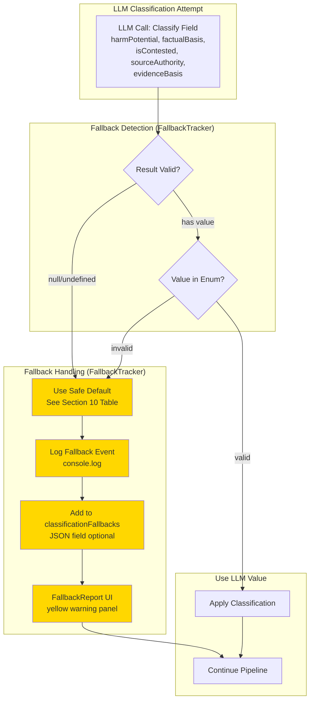
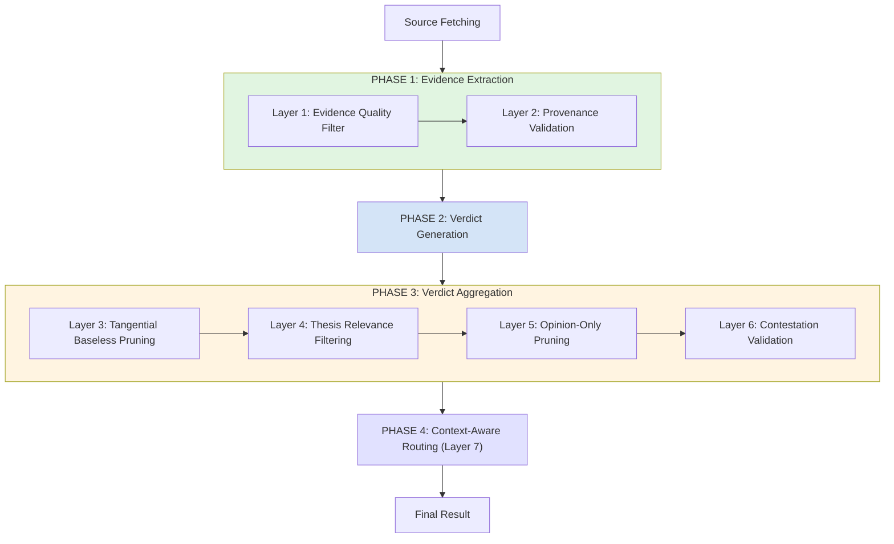

# Documentation Improvement Plan - February 2026

**Date:** 2026-02-03
**Status:** DRAFT
**Author Role:** Technical Writer
**Priority:** High

**Execution Update (2026-02-03)**:
- Completed: Mermaid diagrams + decision tree for classification fallbacks (Evidence_Quality_Filtering.md Section 10)
- Completed: Cross-links from Getting Started and Overview to Section 10
- Completed: Added generic examples to Context_Detection_via_EvidenceScope.md (context merge/split)
- Completed: UI overlap warning documentation (Context_Detection_via_EvidenceScope.md Section: Context Count and User Guidance)
- Completed: Test coverage summary + Admin Tuning Guide + Troubleshooting (Evidence_Quality_Filtering.md Sections 8, 9.5, 9.6)
- Completed: Diagram 1 updated with actual module references (FallbackTracker, classificationFallbacks JSON, FallbackReport UI)
- Verified: No lingering pattern-based classification references in active codebase (only in ARCHIVE/WIP historical docs)
- Verified: All git dates in Section 2.1 match actual commits
- Verified: All diagrams use generic examples (no domain-specific entities)
- Verified: All performance metrics labeled as "(estimated)"

---

## Executive Summary

**Problem**: Recent architectural changes (last 10 days) are documented but missing key diagrams and cross-references, and critical information is spread across multiple documents, making it difficult for developers and users to find authoritative guidance.

**Impact**:
- New features (P0 Fallback Strategy, Pattern-Based Classification Removal) documented but missing flow diagrams and user-facing guidance cross-links
- Developers must read 3-4 documents to understand single concepts (context detection, pipeline variants)
- Missing diagrams for recent architectural changes (fallback flow, complete 7-layer defense, context merge/split decisions)

**Solution**: Add missing diagrams, consolidate documentation, and ensure recent changes have proper cross-references in user-facing docs.

**Effort Estimate**: 12-16 hours over 2-3 days (estimated)

---
**REVIEW: Senior Developer - 2026-02-03**
**Section:** 0
**Assessment:** CHANGES_NEEDED

**Comment:**
The overall problem statement is directionally correct, but it currently overstates "lack complete documentation" for some items that were already documented on 2026-02-02/2026-02-03 (e.g., classification fallbacks are already covered in Evidence_Quality_Filtering.md Section 10). Also, the Table of Contents does not list Sections 7-10 even though they exist later in this document, which makes navigation harder.

**Action Required:**
Clarify which parts are truly missing (e.g., specific diagrams and cross-links) vs already documented, and update the Table of Contents to include Sections 7-10.
---

## Table of Contents

1. [Findings Summary](#findings-summary)
2. [Recent Changes Audit](#recent-changes-audit)
3. [Documentation Consolidation Opportunities](#documentation-consolidation-opportunities)
4. [Missing Diagrams](#missing-diagrams)
5. [Implementation Plan](#implementation-plan)
6. [Success Criteria](#success-criteria)
7. [Risk Assessment](#risk-assessment)
8. [Rollout Plan](#rollout-plan)
9. [Review & Approval](#review--approval)
10. [Related Documents](#related-documents)

---

## 1. Findings Summary

### 1.1 Documentation Landscape

**Current State:**
- 10 architecture documents (~5,600 lines)
- 22 diagrams (Mermaid + ASCII)
- 7 user guides
- 5 reference documents

**Strengths:**
- ✅ Excellent coverage of core systems (SR, Evidence Filtering, Calculations)
- ✅ Consistent use of Mermaid diagrams
- ✅ Strong cross-referencing between docs
- ✅ Version tracking on all documents

**Weaknesses:**
- ❌ Context detection explained in 3 different documents
- ❌ Pipeline variants minimally documented
- ❌ Quality Gates scattered across 3 locations
- ❌ Recent changes (last 10 days) partially documented
- ❌ Overview.md too large (891 lines) - navigation difficult

---
**REVIEW: Senior Developer - 2026-02-03**
**Section:** 1.1
**Assessment:** CHANGES_NEEDED

**Comment:**
Most findings look plausible, but a couple of the "hard numbers" should be either verified with a repeatable method or marked as approximate. For example, Overview.md is currently 892 lines (off by 1 vs 891). Without a definition of what counts as an "architecture document" or "diagram", the counts risk drifting quickly.

**Action Required:**
Either (a) mark counts as approximate, or (b) add a short note describing how counts were computed (files included, what qualifies as a diagram), and correct the Overview.md line count.
---

## 2. Recent Changes Audit

### 2.1 Changes from Last 10 Days (Jan 24 - Feb 3, 2026)

**Note**: This table highlights major user-facing changes. See git log for complete commit history.

| Date | Feature | Implementation Status | Documentation Status | Gap |
|------|---------|----------------------|---------------------|-----|
| **Feb 3** | P0 Fallback Strategy | ✅ Complete (95e2eeb + 5 commits) | ✅ Documented | Missing: flow diagrams, user guide cross-links |
| **Feb 3** | Pattern-Based Classification Removal (Phase 4) | ✅ Complete (de84597) | ⚠️ Minimal | Missing: migration context, before/after |
| **Feb 2** | LLM-Only Text Analysis Service | ✅ Complete (ae7c236) | ✅ Complete | None |
| **Feb 2** | Claim Filtering Enhancements | ✅ Complete (c22d094, f4ec039) | ⚠️ Partial | Missing: test results summary, tuning guide |
| **Feb 2** | UCM Phase 2 (Save-to-File, Drift Detection) | ✅ Complete (9368109, ec6e464) | ✅ Complete | None |
| **Jan 31** | UCM Pre-Validation Sprint (6 features) | ✅ Complete (multiple commits) | ✅ Complete | None |

**Other Notable Commits** (Jan 24 - Feb 3):
- Admin config improvements (370a000, dbda741, eef9e60)
- Monolithic pipeline timeout configuration (542dde9)
- Aggregation lexicon keyword refinement (fa4fa10)
- UCM implementation (9403932, 35edcf5, and many Phase 1-4 commits)

---
**REVIEW: Senior Developer - 2026-02-03**
**Section:** 2.1
**Assessment:** CHANGES_NEEDED

**Comment:**
Several dates and/or labels do not match the git log for the stated window (Jan 24 - Feb 3, 2026). Notably:
- "Pattern-Based Classification Removal" landed on 2026-02-03 (commit de84597), not Jan 30.
- The repo change making the text analysis service LLM-only is 2026-02-02 (commit ae7c236); listing an "LLM Text Analysis Pipeline" on Jan 29 inside this 10-day window is likely misleading unless you intend to refer to an earlier phase and explicitly say so.
- "Claim Filtering Enhancements" are 2026-02-02 (commit c22d094) with unit tests added 2026-02-02 (commit f4ec039).
Also, there are other notable changes in the same window (admin/UCM improvements, fallback report UI/tests) that are not captured; the table should either be explicitly "highlights" or broadened.

**Action Required:**
Update the table with correct dates for the items above and either (a) add missing high-impact items from the window or (b) label the table as curated highlights and add a short "Other notable commits" bullet list.
---

### 2.2 Detailed Gap Analysis

#### Gap 1: P0 Fallback Strategy (Priority: MEDIUM)

**Already Documented** (Evidence_Quality_Filtering.md Section 10):
- ✅ When fallbacks occur (null/undefined, invalid enum, LLM error)
- ✅ Safe defaults table for all 5 fields (harmPotential, factualBasis, isContested, sourceAuthority, evidenceBasis)
- ✅ Rationale for each default value
- ✅ Reporting mechanisms (JSON `classificationFallbacks`, Markdown reports, FallbackReport UI component)
- ✅ Monitoring guidance (thresholds: <5% healthy, >10% investigate)
- ✅ Impact on analysis quality

**Still Missing:**
1. **Flow Diagrams**: Mermaid diagrams showing classification fallback decision flow
2. **Visual Decision Tree**: Quick-reference diagram for all 5 fields and their safe defaults
3. **User Guide Cross-Links**: Links from `Docs/USER_GUIDES/Getting_Started.md` and `Docs/ARCHITECTURE/Overview.md` pointing to Section 10
4. **Onboarding Integration**: "What to do when you see fallback warnings" in user-facing guides

**Needs:**
```
Classification Fallback Flow Diagram
┌─────────────────────────────────────────────┐
│ LLM Classification Attempt                  │
└─────────────┬───────────────────────────────┘
              │
              ├─ Result: null/undefined ──────► Use Safe Default
              ├─ Result: invalid enum value ──► Use Safe Default
              ├─ LLM Error ──────────────────► Use Safe Default
              └─ Result: valid ──────────────► Use LLM Value
                                                      │
                                                      ▼
                                         ┌────────────────────────┐
                                         │ Track in fallbackStats │
                                         └────────────────────────┘
```

**Action Items:**
- [x] Add Mermaid flow diagram to Evidence_Quality_Filtering.md Section 10
- [x] Create decision tree showing all 5 fields and their defaults in Section 10
- [x] Add cross-link from `Docs/USER_GUIDES/Getting_Started.md` to Section 10
- [x] Add cross-link from `Docs/ARCHITECTURE/Overview.md` to Section 10

---
**REVIEW: Senior Developer - 2026-02-03**
**Section:** 2.2 (Gap 1)
**Assessment:** CHANGES_NEEDED

**Comment:**
This gap list appears partially outdated relative to current docs. Evidence_Quality_Filtering.md Section 10 already documents: when fallbacks occur, the safe defaults table for all fields, reporting in JSON/Markdown/UI (FallbackReport), and monitoring guidance. The remaining gap seems to be primarily "missing diagrams and cross-linking into user-facing onboarding docs", not a lack of core fallback explanation.

**Action Required:**
Revise Gap 1 to explicitly distinguish what is already covered vs what is still missing (e.g., Mermaid diagram(s), decision-tree visualization, and links from `Docs/USER_GUIDES/Getting_Started.md`/Overview.md). Also fix references that point to a non-existent `Docs/Getting_Started.md`.
---

#### Gap 2: Pattern-Based Classification Removal (Priority: LOW)

**Already Complete:**
- ✅ Overview.md correctly states text analysis is LLM-only (no heuristic fallback)
- ✅ Implementation completed in commit de84597 (Feb 3, 2026)
- ✅ Code transitioned to LLM-only service (apps/web/src/lib/analyzer/text-analysis-service.ts)

**Potentially Missing:**
1. **Historical Context**: Retrospective document explaining why pattern-based classification was removed
2. **Code References**: Search for any remaining comments/docs mentioning pattern-based classification
3. **Performance Baseline**: Document whether LLM-only approach changed cost/latency (if measured)

**Current Coverage:**
- ⚠️ Mentioned in LLM_Text_Analysis_Pipeline_Deep_Analysis.md (archived)
- ❌ No dedicated retrospective document explaining the transition rationale

**Action Items:**
- [x] Search codebase for lingering references to pattern-based classification (comments, docs)
  - **Result**: No lingering references in active codebase
  - Pattern-based references found only in ARCHIVE/ and WIP/ (historical/migration docs - appropriate)
  - Context_Detection_via_EvidenceScope.md references are about context *detection* heuristics, not classification (acceptable)
- [x] Mark as complete - no immediate documentation need identified

---
**REVIEW: Senior Developer - 2026-02-03**
**Section:** 2.2 (Gap 2)
**Assessment:** CHANGES_NEEDED

**Comment:**
Two accuracy issues to fix before this gap can drive work:
- Overview.md already states the text analysis service is LLM-only (no heuristic fallback), so "Overview.md still mentions heuristic fallback" is not currently true (it mentions the opposite). If other docs still imply pattern-based classification, call those out explicitly with file/section references.
- "LLM calls increased" is an assumption; the Phase 4 change removed pattern-based classification logic and uses safe defaults + fallback tracking. That does not necessarily add LLM calls and could even reduce complexity without increasing cost.
Verification note: apps/web/src/lib/analyzer/text-analysis-service.ts is LLM-only (factory returns the LLM service), with the LLM-only switch landing on 2026-02-02 (commit ae7c236).
Also, creating an active "migration guide" under ARCHIVE/ is likely the wrong place if the intent is guidance for current users/developers (ARCHIVE implies historical reference).

**Action Required:**
Update Gap 2 with concrete references to where pattern-based wording still exists (if any), remove/qualify the "LLM calls increased" claim unless measured, and relocate the proposed migration guide to a non-archived location (or clearly label it as a retrospective/historical document if it truly belongs in ARCHIVE/).
---

#### Gap 3: Context Overlap Detection (Priority: MEDIUM)

**Already Documented:**
- ✅ Overview.md mentions overlap detection feature
- ✅ Context_Detection_via_EvidenceScope.md contains some examples and pattern guidance

**Still Missing:**
1. **Merge vs Split Heuristics**: Additional concrete scenarios showing when contexts merge vs split
2. **Temporal Guidance Examples**: Specific examples distinguishing "incidental temporal mentions" from "time period as primary subject"
3. **UI Behavior Documentation**: How overlap warnings appear in the UI and what users should do

**Action Items:**
- [x] Add 3-4 generic examples to Context_Detection_via_EvidenceScope.md showing:
  - Example 1: Temporal mention NOT requiring split (incidental)
  - Example 2: Time period requiring distinct context (primary subject)
  - Example 3: Methodology difference requiring split
  - Example 4: Two contexts merging due to overlap
- [x] Document UI overlap warning behavior and user response guidance
  - **Completed**: Added "Context Count and User Guidance" section to Context_Detection_via_EvidenceScope.md
  - Documented how context count appears, thresholds (max 5), and user guidance for high counts

---
**REVIEW: Senior Developer - 2026-02-03**
**Section:** 2.2 (Gap 3)
**Assessment:** CHANGES_NEEDED

**Comment:**
The "needs examples" direction is reasonable, but the current writeup should be tightened for accuracy: Context_Detection_via_EvidenceScope.md already contains some examples/pattern guidance. If the real gap is specifically "merge vs split heuristics with concrete scenarios and UI behavior," say that, and point to the exact missing subsection(s). Also ensure all examples remain generic-by-design (avoid jurisdiction-specific entity names).

**Action Required:**
Refine the gap statement to specify what additional examples are missing (merge vs split scenarios + UI behavior), and add file/section references so the work is unambiguous.
---

#### Gap 4: Claim Filtering Enhancements (Priority: MEDIUM)

**Already Documented:**
- ✅ Evidence_Quality_Filtering.md has comprehensive 7-layer defense overview
- ✅ End-to-end implementation flow documented

**What's Missing:**
1. **Test Coverage Summary**: 30 tests in claim-filtering-enhancements.test.ts but results/coverage not documented
2. **Admin Tuning Guide**: When and how to adjust filter thresholds
3. **Troubleshooting**: Common false positive scenarios and remediation

**Current Coverage:**
- ✅ Evidence_Quality_Filtering.md has comprehensive detail
- ❌ Test results/coverage not surfaced in documentation
- ❌ No tuning guide for admins

**Action Items:**
- [x] Add test coverage summary to Evidence_Quality_Filtering.md (30 test cases covering 7 layers)
  - **Completed**: Added Section 8 enhancement with detailed test structure and layer coverage breakdown
- [x] Create "Evidence Filter Tuning Guide" section for admins
  - **Completed**: Added Section 9.5 with threshold tuning recommendations, workflow, and configuration access
- [x] Add troubleshooting section for common false positive issues
  - **Completed**: Added Section 9.6 with 5 common issues, symptoms, causes, solutions, and diagnostic steps

---
**REVIEW: Senior Developer - 2026-02-03**
**Section:** 2.2 (Gap 4)
**Assessment:** CHANGES_NEEDED

**Comment:**
The statement "53 tests" does not match the current unit test file (claim-filtering-enhancements.test.ts has 30 `it(...)` cases). Also, Evidence_Quality_Filtering.md already includes an end-to-end 7-layer overview; the remaining gap is more about surfacing test coverage/results and adding an admin-facing tuning/troubleshooting guide.

**Action Required:**
Correct the test count claim (or cite where 53 comes from), and narrow the "missing" items to what is actually absent (test result summary + tuning/troubleshooting guidance).
---

## 3. Documentation Consolidation Opportunities

### 3.1 High Priority Consolidations

#### Consolidation 1: Context & EvidenceScope Detection (Priority: HIGH)

**Current State:**
- Context_Detection_via_EvidenceScope.md (378 lines) - Principle-based approach
- Overview.md Section 1.1 - System overview with diagram
- Calculations.md Section 2 - AnalysisContext definition
- Pipeline_TriplePath_Architecture.md - Context routing

**Problem:** Developers must read 4 documents to understand how context detection works.

**Proposed Solution:** Create unified "Context_and_EvidenceScope_Detection_Guide.md"

**Structure:**
```markdown
# Context and Scope Detection Guide

## 1. Terminology (from TERMINOLOGY.md)
## 2. AnalysisContext vs EvidenceScope (decision tree)
## 3. Detection Pipeline Flow (from Overview.md diagram)
## 4. Principle-Based Detection Rules (from Context_Detection_via_EvidenceScope.md)
## 5. Overlap Detection & Merge Heuristics (new content)
## 6. Examples (consolidate from all 4 docs)
## 7. Implementation Reference (file locations, key functions)
```

**Action Items:**
- [ ] Create Context_and_EvidenceScope_Detection_Guide.md
- [ ] Consolidate content from 4 source documents
- [ ] Update cross-references in Overview.md to point to new guide
- [ ] Archive redundant sections (don't delete from original docs, just cross-reference)

---

#### Consolidation 2: Pipeline Variants Guide (Priority: HIGH)

**Current State:**
- Pipeline_TriplePath_Architecture.md (258 lines) - Technical implementation
- Overview.md mentions variants briefly
- No user-facing "when to use which pipeline" guide

**Problem:** Users don't know which pipeline to select for their use case.

**Proposed Solution:** Expand Pipeline_TriplePath_Architecture.md with decision guide

**Add Sections:**
```markdown
## When to Use Each Pipeline

### Decision Tree
START: What's your priority?
│
├─ Speed over accuracy → Monolithic Canonical
├─ Flexibility & debugging → Monolithic Dynamic
└─ Production quality → Orchestrated (default)

### Use Case Matrix
| Use Case | Recommended Pipeline | Reasoning |
|----------|---------------------|-----------|
| Production fact-checking | Orchestrated | Highest quality, source reliability integration |
| Development/testing | Monolithic Dynamic | Fast iteration, readable output |
| API integration | Monolithic Canonical | Consistent performance, lower cost |
| Research & analysis | Orchestrated | Comprehensive evidence collection |

### Performance Comparison (Estimated)
| Metric | Orchestrated | Monolithic Canonical | Monolithic Dynamic |
|--------|-------------|---------------------|-------------------|
| Typical time (estimated) | 2-5 min | 1-3 min | 1-3 min |
| LLM calls (estimated) | 15-25 | 8-12 | 10-15 |
| Cost per analysis (estimated) | $0.50-$2.00 | $0.20-$0.80 | $0.30-$1.00 |
| Evidence quality | Highest | Good | Good |
| Source reliability | Integrated | Integrated | Integrated |
```

**Action Items:**
- [ ] Add decision guide to Pipeline_TriplePath_Architecture.md
- [ ] Create use case matrix with examples
- [ ] Document performance/cost trade-offs
- [ ] Add diagram showing pipeline selection flow

---

#### Consolidation 3: Quality Gates (Priority: MEDIUM)

**Current State:**
- Overview.md Section 5 - Brief explanation
- Evidence_Quality_Filtering.md Section 2-3 - 7-layer defense
- Calculations.md Section 5 - Gate 4 (Verdict Confidence)

**Problem:** Quality gates explained in 3 places with different focuses.

**Proposed Solution:** Create dedicated "Quality_Gates_Reference.md"

**Structure:**
```markdown
# Quality Gates Reference

## Overview
- What are quality gates
- When they apply
- How to monitor gate failures

## Gate 1: Claim Validation
- Rules (from Overview.md)
- Examples
- Failure handling

## Gate 4: Verdict Confidence
- Threshold calculation (from Calculations.md)
- MIXED vs UNVERIFIED distinction
- Confidence calibration

## 7-Layer Defense (Evidence Quality)
- Layer-by-layer breakdown (from Evidence_Quality_Filtering.md)
- Integration with gates
- Configuration options

## Monitoring & Tuning
- How to check gate stats
- When to adjust thresholds
- Common failure patterns
```

**Action Items:**
- [ ] Create Quality_Gates_Reference.md
- [ ] Consolidate gate information from 3 sources
- [ ] Add monitoring section with examples
- [ ] Update cross-references

---
**REVIEW: Senior Developer - 2026-02-03**
**Section:** 3.1
**Assessment:** CHANGES_NEEDED

**Comment:**
The consolidation targets make sense, but there are two correctness/consistency issues:
- Naming: "Context & EvidenceScope Detection" and "Context_and_EvidenceScope_Detection_Guide.md" risks violating the repo's strict terminology rule (Scope vs EvidenceScope). This should likely be "Context & EvidenceScope" in both headings and filenames to avoid reintroducing confusion.
- Performance/cost tables: the numbers read like estimates. Without instrumentation citations, they should be labeled as estimated (or backed with measurement methodology).
Also, expanding/merging docs without breaking links is feasible, but it will require a deliberate redirect strategy (keep old files as stubs with pointers, or preserve anchors).

**Action Required:**
Rename the proposed consolidation doc(s) to use EvidenceScope terminology, label performance/cost values as estimated (or cite measurements), and add a short "link preservation strategy" note for consolidation work.
---

### 3.2 Medium Priority Consolidations

#### Consolidation 4: Source Reliability Documentation

**Current State:**
- Source_Reliability.md (1,013 lines) - Comprehensive main doc
- Source_Reliability_Prompt_Improvements.md (284 lines) - Prompt refinements
- Calculations.md Section 10 - Weighting formula
- Overview.md - Brief summary

**Problem:** SR improvements documented separately, creating version confusion.

**Proposed Solution:** Merge Source_Reliability_Prompt_Improvements.md into main SR doc

**Action Items:**
- [ ] Add "Prompt Evolution History" section to Source_Reliability.md
- [ ] Consolidate v1.1, v1.2, v1.3 improvements into chronological narrative
- [ ] Archive Source_Reliability_Prompt_Improvements.md
- [ ] Update CHANGELOG to reflect consolidation

---
**REVIEW: Senior Developer - 2026-02-03**
**Section:** 3.2
**Assessment:** APPROVE

**Comment:**
Merging the prompt-improvements doc into the canonical Source_Reliability.md should reduce version confusion. Just ensure the merged content is clearly dated/versioned so readers can distinguish current behavior from historical evolution.

**Action Required:**
None.
---

## 4. Missing Diagrams

### 4.1 Critical Missing Diagrams

#### Diagram 1: P0 Fallback Classification Flow (Priority: HIGH)

**Purpose:** Show how classification failures are detected and handled

**Proposed Mermaid Diagram:**


**Location:** Evidence_Quality_Filtering.md Section 10

**Action Items:**
- [ ] Create diagram in Evidence_Quality_Filtering.md
- [ ] Add caption explaining yellow highlight = fallback path
- [ ] Cross-reference from Current_Status.md

---

#### Diagram 2: 7-Layer Defense Complete Flow (Priority: HIGH)

**Purpose:** Show all 7 layers in execution order with data flow

**NOTE:** Layer numbering/responsibilities are currently inconsistent across existing docs. This diagram follows the actual execution flow in orchestrated.ts: extraction → filtering/provenance → verdict generation → aggregation (with pruning/weighting) → routing.

**Proposed Mermaid Diagram:**


**Location:** Evidence_Quality_Filtering.md Section 2

**Action Items:**
- [ ] Reconcile layer numbering/responsibilities across all docs before creating diagram
- [ ] Create complete 7-layer diagram with phases clearly separated
- [ ] Color-code by phase (green=extraction, blue=verdict generation, yellow=aggregation, purple=routing)
- [ ] Add legend explaining each layer's purpose and execution timing

---

#### Diagram 3: Context Detection & Merge Decision Tree (Priority: MEDIUM)

**Purpose:** Clarify when contexts merge vs split

**Proposed Diagram:**
```
Context Detection Decision Tree
================================

START: Analyzing evidence set
  │
  ├─ Same subject matter?
  │   ├─ NO → SPLIT (different topics)
  │   └─ YES → Continue
  │
  ├─ Methodology compatible?
  │   ├─ NO → SPLIT (e.g., Methodology A vs Methodology B)
  │   └─ YES → Continue
  │
  ├─ Jurisdiction/Authority same?
  │   ├─ NO → SPLIT (e.g., Authority A vs Authority B)
  │   └─ YES → Continue
  │
  ├─ Time period primary subject?
  │   ├─ YES → SPLIT (historical vs current)
  │   └─ NO (incidental) → MERGE
  │
  └─ MERGE into single context
```

**Location:** Context_Detection_via_EvidenceScope.md (new section)

**Action Items:**
- [ ] Add decision tree to Context_Detection_via_EvidenceScope.md
- [ ] Include 4 generic examples (2 merge, 2 split scenarios)
- [ ] Cross-reference from Overview.md

---
**REVIEW: Senior Developer - 2026-02-03**
**Section:** 4.1
**Assessment:** CHANGES_NEEDED

**Comment:**
Diagram 1 is directionally fine, but should reference the actual modules/outputs involved (FallbackTracker, classificationFallbacks JSON, FallbackReport UI) so it is implementable and reviewable.
Diagram 2 does not match the real execution/data flow: Layers 3-6 are aggregation-time protections that should influence verdict aggregation, not run after "Generate Verdicts" as a post-step. In apps/web/src/lib/analyzer/orchestrated.ts, the extraction pipeline applies deterministic filtering and provenance validation before verdict generation, and the pruning/weighting happens during aggregation. Also, the responsibilities and numbering of Layers 1-2 are currently inconsistent across existing docs (some places describe Layer 1 as prompts vs deterministic filtering). Decide and document a single authoritative layer definition before drawing the "complete flow".
Diagram 3 contains domain-specific examples ("TSE vs STF") which violates the repo's generic-by-design rule; these examples should be abstract (Authority A vs Authority B) and must not reuse known verification/test-case entities.

**Action Required:**
Revise Diagram 2 to reflect actual pipeline ordering (extraction -> filtering/provenance -> verdict generation -> aggregation filters -> final), reconcile layer numbering with the authoritative definition, and remove domain-specific examples from Diagram 3.
---

### 4.2 Desirable Diagrams (Lower Priority)

#### Diagram 4: Pipeline Variant Selection Flow
**Location:** Pipeline_TriplePath_Architecture.md
**Purpose:** Help users choose which pipeline to use

#### Diagram 5: UCM Config Flow
**Location:** Unified_Config_Management.md
**Purpose:** Show config loading, validation, and activation

#### Diagram 6: Classification Field Safe Defaults Table
**Location:** Evidence_Quality_Filtering.md Section 10
**Purpose:** Visual reference for all 5 fields and their defaults

---
**REVIEW: Senior Developer - 2026-02-03**
**Section:** 4.2
**Assessment:** APPROVE

**Comment:**
These are good "nice-to-have" diagrams and align with the consolidation goals. Ensure Diagram 6 stays synchronized with the actual safe-defaults table and any schema changes.

**Action Required:**
None.
---

## 5. Implementation Plan

### Phase 1: Document Recent Changes (Priority: HIGH)
**Duration:** 4-6 hours (estimated)

| Task | Document | Action | Time (est.) |
|------|----------|--------|------|
| 1.1 | Evidence_Quality_Filtering.md | Add P0 Fallback flow diagram | 1h |
| 1.2 | Evidence_Quality_Filtering.md | Add classification decision tree | 0.5h |
| 1.3 | Evidence_Quality_Filtering.md | Add complete 7-layer defense diagram | 1h |
| 1.4 | USER_GUIDES/Getting_Started.md | Add fallback warning guidance | 0.5h |
| 1.5 | ARCHIVE/ | Create Pattern_Classification_Migration_Guide.md | 1h |
| 1.6 | Overview.md | Remove pattern-based references | 0.5h |
| 1.7 | Context_Detection_via_EvidenceScope.md | Add merge heuristics examples | 1h |

**Deliverables:**
- ✅ P0 Fallback Strategy fully documented with diagrams
- ✅ Pattern-based classification removal explained
- ✅ Context overlap detection clarified

---

### Phase 2: Consolidate Documentation (Priority: HIGH)
**Duration:** 6-8 hours (estimated)

| Task | Action | Time (est.) |
|------|--------|------|
| 2.1 | Create Context_and_EvidenceScope_Detection_Guide.md | 2h |
| 2.2 | Expand Pipeline_TriplePath_Architecture.md with decision guide | 2h |
| 2.3 | Create Quality_Gates_Reference.md | 2h |
| 2.4 | Merge SR improvements into Source_Reliability.md | 1h |
| 2.5 | Update cross-references in all affected docs | 1h |

**Deliverables:**
- ✅ Context detection in single authoritative doc
- ✅ Pipeline selection guide with use cases
- ✅ Quality gates consolidated
- ✅ SR documentation unified

---

### Phase 3: Add Missing Diagrams (Priority: MEDIUM)
**Duration:** 2-3 hours (estimated)

| Task | Action | Time (est.) |
|------|--------|------|
| 3.1 | Create Pipeline Variant Selection diagram | 1h |
| 3.2 | Create UCM Config Flow diagram | 1h |
| 3.3 | Create Classification Defaults visual table | 0.5h |

**Deliverables:**
- ✅ All critical diagrams present
- ✅ Visual guides for complex decisions

---

### Phase 4: Verification & Cleanup (Priority: MEDIUM)
**Duration:** 2-3 hours (estimated)

| Task | Action | Time (est.) |
|------|--------|------|
| 4.1 | Verify all cross-references work | 1h |
| 4.2 | Check terminology consistency | 0.5h |
| 4.3 | Update "Last Updated" dates | 0.5h |
| 4.4 | Create "What's New" summary for recent changes | 1h |

**Deliverables:**
- ✅ All links functional
- ✅ Terminology consistent with TERMINOLOGY.md
- ✅ Documentation current and accurate

---
**REVIEW: Senior Developer - 2026-02-03**
**Section:** 5
**Assessment:** CHANGES_NEEDED

**Comment:**
The phase breakdown is sensible, but the time estimates look optimistic given the required verification steps (cross-reference checking, anchor/link preservation, reconciling layer definitions, and validating performance claims). Also, Phase 1 includes creating a migration guide under ARCHIVE/, which likely conflicts with "active guidance" goals unless it is explicitly historical.
Finally, Phase 2 task naming still uses "Context_and_EvidenceScope_*" which risks reintroducing the Scope/Context terminology confusion.

**Action Required:**
Adjust time estimates (or add buffer/assumptions), correct doc paths (e.g., Getting Started is `Docs/USER_GUIDES/Getting_Started.md`), move the migration guide out of ARCHIVE/ unless it is explicitly a historical record, and rename deliverables/tasks to use "EvidenceScope" terminology consistently.
---

## 6. Success Criteria

### 6.1 Completeness Metrics

- [ ] **Recent Changes Coverage**: All changes from last 10 days documented with diagrams
- [ ] **Diagram Currency**: No missing diagrams for major features
- [ ] **Consolidation**: No topic requires reading more than 2 documents
- [ ] **Cross-References**: All links tested and functional
- [ ] **Terminology**: 100% compliance with TERMINOLOGY.md

### 6.2 User Experience Metrics

- [ ] **Developer Onboarding**: New developer can understand architecture from Overview.md + 2 specialized docs
- [ ] **Pipeline Selection**: User can choose pipeline variant in < 5 minutes using decision guide
- [ ] **Fallback Understanding**: User knows what to do when seeing fallback warnings
- [ ] **Context Detection**: Developer can implement context detection rules without asking questions

### 6.3 Maintenance Metrics

- [ ] **Update Frequency**: Each doc has "Last Updated" date
- [ ] **Change Tracking**: CHANGELOG.md reflects all architectural changes
- [ ] **Archive Policy**: Historical docs clearly marked and separated

---
**REVIEW: Senior Developer - 2026-02-03**
**Section:** 6
**Assessment:** CHANGES_NEEDED

**Comment:**
"Developer can implement context detection rules without asking questions" is ambiguous and risks conflicting with the repo's generic-by-design direction (avoid hardcoded rules/keywords). A better success metric is that a developer can understand the intended behavior, where it lives, and how to tune/configure it (prompts/config), not "implement rules" as a new rule engine.

**Action Required:**
Reword the context detection success criterion to emphasize understanding, verification, and tuning rather than creating new hardcoded rules.
---

## 7. Risk Assessment

### 7.1 Risks

| Risk | Probability | Impact | Mitigation |
|------|-------------|--------|------------|
| Breaking existing links during consolidation | Medium | High | Verify all cross-references after each change |
| Terminology inconsistency during merge | Low | Medium | Use TERMINOLOGY.md as canonical reference |
| Diagram complexity overwhelming users | Low | Low | Use progressive disclosure (simple → detailed) |
| Outdated information in consolidated docs | Medium | High | Verify against codebase before merging |

### 7.2 Dependencies

- **Technical Writer availability**: 12-16 hours needed (estimated)
- **Code review access**: To verify implementation details
- **Mermaid diagram tool**: For creating/editing diagrams
- **Git access**: For checking recent commits

---
**REVIEW: Senior Developer - 2026-02-03**
**Section:** 7
**Assessment:** CHANGES_NEEDED

**Comment:**
Add an explicit risk around violating "generic-by-design" in documentation examples/diagrams (domain-specific entity names leaking into prompts/docs), since this has already occurred in the proposed Diagram 3 text. Also consider a link/anchor breakage risk for external references and internal bookmarks when consolidating.

**Action Required:**
Add the two risks above with mitigations (example linting/review checklist, link-stub strategy, anchor preservation).
---

## 8. Rollout Plan

### Week 1 (Feb 4-7)
- **Day 1-2**: Phase 1 (Document Recent Changes)
- **Day 3-4**: Phase 2 (Consolidate Documentation)

### Week 2 (Feb 10-14)
- **Day 1**: Phase 3 (Add Missing Diagrams)
- **Day 2**: Phase 4 (Verification & Cleanup)
- **Day 3**: Final review and user feedback

---
**REVIEW: Senior Developer - 2026-02-03**
**Section:** 8
**Assessment:** APPROVE

**Comment:**
Schedule sequencing is reasonable assuming Phase 1/2 scope stays tight and link preservation is planned upfront.

**Action Required:**
None.
---

## 9. Review & Approval

### Review Checklist

Before finalizing, verify:

- [ ] All recent changes (last 10 days) documented
- [ ] No broken links
- [ ] All diagrams render correctly
- [ ] Terminology consistent
- [ ] Examples clear and accurate
- [ ] Cross-references updated
- [ ] Archive decisions documented

### Approval Required From

- [ ] **Lead Architect**: Architecture accuracy
- [ ] **Lead Developer**: Implementation details
- [ ] **Technical Writer**: Documentation quality

---
**REVIEW: Senior Developer - 2026-02-03**
**Section:** 9
**Assessment:** APPROVE

**Comment:**
Checklist is solid. Consider adding a specific item to verify proposed dates/status against `git log --since="2026-01-24" --oneline` to prevent drift in "Recent Changes Audit".

**Action Required:**
Optionally add the git-log verification step to the checklist.
---

## 10. Related Documents

- [Multi_Agent_Collaboration_Rules.md](../AGENTS/Multi_Agent_Collaboration_Rules.md) - Documentation standards
- [TERMINOLOGY.md](../REFERENCE/TERMINOLOGY.md) - Canonical terminology reference
- [Evidence_Quality_Filtering.md](../ARCHITECTURE/Evidence_Quality_Filtering.md) - P0 Fallback documentation
- [Current_Status.md](../STATUS/Current_Status.md) - Recent changes tracking

---
**REVIEW: Senior Developer - 2026-02-03**
**Section:** 10
**Assessment:** APPROVE

**Comment:**
Links look correct and relevant. If consolidation proceeds, ensure these references are updated (or stubs remain) so downstream docs do not break.

**Action Required:**
None.
---

**Document Status**: DRAFT - Awaiting approval
**Next Step**: Review with Lead Architect and Lead Developer
**Target Start Date**: 2026-02-04
**Estimated Completion**: 2026-02-14

---
## SENIOR DEVELOPER REVIEW SUMMARY

**Reviewer:** Senior Developer (Codex AI)
**Date:** 2026-02-03
**Overall:** REQUEST_CHANGES

### Critical Issues
1. Section 2.1 recent-changes table contains incorrect dates/labels vs git log (must be corrected before use).
2. Section 4.1 proposed "7-layer defense" Mermaid flow does not match real pipeline ordering; layer numbering is inconsistent across existing docs.
3. Proposed Diagram 3 includes domain-specific examples, violating the repo's generic-by-design rule.

### Recommendations
1. Mark all performance/cost numbers as estimated unless backed by measurements/instrumentation.
2. Rename "Context & Scope" deliverables to "Context & EvidenceScope" to maintain terminology integrity and avoid confusion.
3. Add an explicit link/anchor preservation strategy before consolidating docs.

### Approval Status
- [ ] Approved as-is
- [ ] Approved with minor changes
- [x] Requires revision
---
