# FactHarbor — Academic Cooperation for Automated Fact-Checking

> **Author:** Robert Schaub (Founder and Lead Developer, FactHarbor.ch) **Date:** 18 March 2026 (Updated: 29 September 2026)

## Purpose and Organisation

FactHarbor is a **non-profit, open-source project**. Its mission is to bring clarity to unclear, contested and misleading information by making the evidence, assumptions and uncertainty behind claim assessments easier to inspect. The project is supported by the [FactHarbor Verein](https://github.com/robertschaub/FactHarbor/blob/main/Docs/Legal/Vereinsstatuten_FactHarbor_DE.md).

This overview invites discussion about academic cooperation: which research questions matter, what each participant could contribute, and whether a student project, feasibility study or jointly funded project would be a useful starting point.

## What FactHarbor Does

FactHarbor analyses claims and articles. It identifies verifiable claims, researches supporting and opposing evidence, and produces reports with assessments, source citations and stated uncertainty. The evidence found may be incomplete or point in different directions.

[Full-size diagram](diagrams/academic-cooperation-1.svg) · [Mermaid source](diagrams/academic-cooperation-1.mmd)

The aim is to help readers examine why an assessment was reached and where the evidence leaves questions open.

### Interface and Report Examples

The following screenshots show examples of the Alpha interface. They illustrate the report format, not a current performance or quality benchmark.

Reports present claim assessments, confidence, reasoning and cited evidence for readers to examine.

## Current Status and Limitations

**FactHarbor remains in an invite-gated Alpha. The Alpha remains available; broader development is paused pending funding.**

Reliability, repeatability and efficiency still need improvement and systematic evaluation. Results can vary between runs as model outputs and available web evidence change. A report may miss relevant evidence, misinterpret a source or express more confidence than the evidence warrants. Citations make scrutiny possible; they do not guarantee correctness.

Quality across languages and different phrasings is an evaluation priority. No uniform accuracy or stability level is claimed across topics or languages. Researchers should inspect the underlying sources and limitations when using results.

The public application is at [app.FactHarbor.ch](https://app.factharbor.ch). Access for a proposed study would need to be agreed.

## Research Questions for Cooperation

| Area | Research question | Possible contribution |
| --- | --- | --- |
|**Evidence and reliability**|How can we assess whether evidence is sufficient and whether a conclusion is properly supported?|Evaluation methods, annotated datasets and studies of uncertainty and source attribution. |
|**Multilingual stability**|How do results vary across repeated runs, languages and different phrasings of a claim?|Comparative evaluation and reproducibility protocols. |
|**Resource efficiency**|Can smaller models and faster retrieval reduce time and cost while maintaining report quality?|Measured comparisons of quality, latency and resource use. |
|**Useful explanations**|Can readers understand the evidence, disagreements and limitations in a report?|Studies with researchers, journalists, educators or other intended users. |

These are proposed research questions, not completed studies or claims of established performance.

## Mutual Contribution and Possible First Steps

FactHarbor can offer an Alpha application with inspectable reports and concrete evaluation questions. Academic cooperation could contribute research methods, subject expertise, multilingual evaluation and independent assessment. A suitable project could produce a thesis, comparative study or joint publication.

A practical first step would be to agree on one research question, the evidence needed to evaluate it, and a manageable scope. Possible formats include a student thesis, a feasibility study or a small joint research project. Data access, resources, responsibilities and publication arrangements would be agreed before work starts.

Research grants, foundation support and infrastructure sponsorship are possible funding routes, depending on the participants and scope. Eligibility, funding terms and availability would need to be checked for the selected route. Longer-term operation requires financing beyond an individual research project.

## Longer-Term Directions

Proposed directions include broader integrations, evidence reuse, multimedia verification and tools for expert or community participation. Cooperation between independently operated instances is a longer-term research direction. These are future possibilities, not commitments or delivered capabilities.

**Invitation:** Discuss which question best matches your research interests, what a useful first result would look like, and what support would make the work feasible.

----

**Navigation:** [Presentations](product-development/presentations/index.md) | [Support FactHarbor](funding.md) | [LinkedIn Article](linkedin.md) | [Architecture](product-development/specification/architecture/index.md) | [Method diagram](product-development/diagrams/akel-engine-overview/index.md)
