# Support FactHarbor — Why and How?

> Status, 1 October 2026: FactHarbor is an invite-gated Alpha. Development is paused pending funding; the roadmap below describes intended future work, without a committed delivery schedule.

> **Author:** Robert Schaub (Founder and Lead Developer, FactHarbor.ch) **Date:** 31 March 2026 (Updated: 4 April 2026)

## Document Purpose

**Inspect:**

*   What FactHarbor does and where it stands
*   Costs and resource needs
  **Discuss:**
*   How to support FactHarbor — funding, contributions, or partnerships

## FactHarbor Organisation

Open-source applications and web services for AI-powered fact-checking — every verdict backed by evidence you can inspect.
**Mission:**
FactHarbor brings clarity and transparency to a world full of unclear, contested, and misleading information by shedding light on the context, assumptions, and evidence behind claims.

**Non-profit and Transparent**
FactHarbor is a **Non-Profit Organisation** and a strictly **Open-Source** project.
We serve the public interest with full transparency — no hidden algorithms, and no profit motive.

The FactHarbor **[Verein](https://github.com/robertschaub/FactHarbor/blob/main/Docs/Legal/Vereinsstatuten_FactHarbor_DE.md)** is a Swiss non-profit association, founded on April 23, 2026 and registered in the Commercial Register of the Canton of Zürich (UID CHE-448.446.098).

## The FactHarbor Application

**FactHarbor analyzes claims and articles** by breaking them into verifiable pieces and collecting supporting and opposing evidence from web sources and databases.

It evaluates evidence quality and source reliability, then compares, challenges, and reconciles findings through a structured multi-agent AI debate.

**The result: a transparent verdict where every conclusion links to cited evidence — so you can judge for yourself.**

----

## Why This Matters

People are losing trust — not just in specific claims, but in the ability to know what is true at all. Misinformation spreads faster than corrections can follow, and existing tools are manual, slow, and opaque.

At the same time, the infrastructure is shrinking:

*   **Meta** exited the US Third-Party Fact-Checking Program (January 2025).
*   **Google** reduced ClaimReview visibility in Search results (2025).
*   Fact-checking organisations lost significant platform funding.

The sector needs independent, sustainable infrastructure that no single platform controls. FactHarbor is built for that: open-source, non-profit, and transparent.

----

## How It Works

Unlike single-model AI tools, FactHarbor uses a **structured multi-agent debate** — in the current default configuration, a Claude-led analysis is independently challenged by a model from a second AI provider (OpenAI). Only evidence-backed objections can change the verdict; [model allocation depends on the active configuration](verdict-debate.md).

[Full-size diagram](diagrams/fact-checker-cooperation-1.svg) · [Mermaid source](diagrams/fact-checker-cooperation-1.mmd)

----

## FactHarbor UI

[app.FactHarbor.ch](https://app.factharbor.ch)

### Verdict and Report

Each verdict includes: truth percentage, confidence, supporting and opposing evidence citations, and a full reasoning narrative.

----

## Questions & Answers

### How are claims selected?

Users can freely submit any claim or full article. The system extracts so-called "Atomic Claims" — individual verifiable statements — and analyzes each one automatically.

### How does it avoid AI hallucination?

Unlike a ChatGPT-style conversation, the AI agents here are constrained — they must follow a tightly prescribed multi-step workflow and produce structured data at each stage.

In the second stage, the agents are fed with evidence gathered via web search (Google, Semantic Scholar, Wikipedia etc.) — a technique known as RAG (Retrieval Augmented Generation).

### How accurate is the analysis?

The headline verdicts (True through False on a 7-point scale) are a starting point, not the final word — language and evidence are rarely black and white.

The real value is in the report behind the verdict: every claim is backed by cited sources, counter-arguments, confidence scores, and quality warnings. When evidence is thin or conflicting, the system says so openly rather than producing a confident-sounding answer.

The value is not just a verdict — it's the structured reasoning, cited evidence, and counter-arguments that enable you to form your own informed judgment and share it with others.

----

## Current Status and Roadmap

| Area | Status |
| --- | --- |
|**Full pipeline**|5 stages operational: extract claims, research evidence, cluster, AI debate, aggregation |
|**Independent AI challenger**|Claude-led debate with an OpenAI challenger in the current default configuration; allocation is configurable |
|**Quality control**|6-layer quality checks, confidence tiers, warnings when evidence is thin |
|**Source evaluation**|Automatic per-domain credibility scoring |
|**Multilingual**|German, English, French, Portuguese tested — multilingual by design |
|**Analysis time**|~15 minutes per claim (target: under 5 minutes) |

The system is in **Alpha**; further development depends on funding.

| Phase | What It Unlocks |
| --- | --- |
|**Beta** (planned)|User authentication, performance optimization, monitoring |
|**V1.0** (planned)|Public REST API, browser extensions, ClaimReview schema |
|**V1.5+** (vision)|Image/video verification, CMS plugins, team workspaces |

----

## Working Together

### For Researchers and Universities

| What you bring | What you gain |
| --- | --- |
|Research expertise in NLP, information retrieval, or computational journalism|A working Alpha testbed with real claims, structured artifacts, and configurable stages — not a paper prototype |
|Access to Swiss and EU grant instruments (Innosuisse, BRIDGE, Horizon Europe)|A concrete implementation partner and co-applicant for applied research proposals |
|Student supervision capacity|Focused thesis projects on open, measurable problems (multilingual robustness, evidence retrieval, model distillation) |
|Publication track record|Joint papers at ACL, EMNLP, CLEF — with real-world data and reproducible baselines |

### For Fact-Checkers and Newsrooms

| What you bring | What you gain |
| --- | --- |
|Workflow knowledge — where verification takes the most time|A tool that automates evidence research, not editorial judgment |
|Real-world claims and feedback on verdict quality|Early access and influence on how the tool evolves for your use case |
|Network reach into the DACH fact-checking ecosystem|A technology partner building specifically for your needs — not a generic AI product |
|Willingness to test in a short pilot|Transparent, auditable reports you can inspect and build on |

### For Foundations and Sponsors

| What you bring | What you gain |
| --- | --- |
|Financial support for development, infrastructure, or research partnerships|A measurable contribution to independent, transparent fact-checking infrastructure |
|Grant expertise or programme introductions|A project with clear public-interest alignment, open-source transparency, and non-profit governance |
|Infrastructure credits (AI, hosting, search APIs)|Direct impact — every franc extends the number of claims that can be verified |

### For Developers and Contributors

| What you bring | What you gain |
| --- | --- |
|Code contributions, bug fixes, performance optimization|Meaningful open-source contribution to a working system with real users |
|Translation and localization (DE/FR/IT/EN)|Visible impact on multilingual fact-checking capability |
|Testing and quality feedback|Early access and a say in how the project develops |

**Every franc goes to the mission.** No profit distribution — surplus is reinvested. All funders above CHF 5,000 will be disclosed.

----

## How We Protect Your Trust

FactHarbor's governance ensures that funding never compromises editorial independence.

| Safeguard | Detail |
| --- | --- |
|**20% rule**|No single donor may finance more than 20% of the annual budget (exception: competitive public grants) |
|**Rejection criteria**|Political parties, pharma, and any donor demanding editorial control are refused |
|**Full transparency**|All funders above CHF 5,000 published by name and amount. Annual financial report. |
|**Mission lock**|Swiss Verein statutes prohibit profit distribution — surplus is irrevocably reinvested |
|**Editorial firewall**|Donors have zero influence on claims analyzed, verdicts produced, or methodology used |
|**IFCN alignment**|Governance is designed to align with the International Fact-Checking Network Code of Principles (FactHarbor is not an IFCN signatory) |

| Aspect | Detail |
| --- | --- |
|**Legal form**|Swiss Verein (Association) under Art. 60 ff. ZGB |
|**Purpose**|Promote informed opinion-forming through evidence-based tools — non-profit, public-benefit |
|**Neutrality**|Politically and religiously neutral, no substantial political activities |
|**Prohibited funding**|Advertising revenue, user data sales, outcome-conditional payments |
|**Dissolution**|Assets transfer to an organisation with comparable public-benefit purpose |

----

## Try It

**Live Demo:**
**[app.FactHarbor.ch](https://app.factharbor.ch)**

Invited testers can submit text or URLs for evidence-based analysis. Access and availability are subject to the Alpha invitation and quota controls.

----

## Contact

Robert Schaub — Founder and Lead Developer

*   info@factharbor.ch
*   [factharbor.ch](https://factharbor.ch)
*   [LinkedIn](https://www.linkedin.com/in/robertschaub)
*   Phone: +41 76 449 14 39

----

**Navigation:** [Presentations](product-development/presentations/index.md) | [Organisation](organisation/index.md) | [LinkedIn Article](linkedin.md)
