# Organisational Model

FactHarbor operates as a **Swiss Verein** (non-profit association) with a **simple, flat structure** focused on automation over bureaucracy.

## 1. Legal Structure

**Entity Type**: Swiss Verein (Association) **Jurisdiction**: Switzerland **Governed By**: Swiss Civil Code (Art. 60-79) **Statutes**: [Statutes](../../../legal-framework.md) (adopted April 23, 2026)

**Key Characteristics**:

-   Non-profit purpose
-   Member-based governance
-   Democratic decision-making
-   Limited liability
-   Tax-exempt status (if public benefit)

## 2. Governance Structure

### 2.1 General Assembly

**Composition**: All Verein members **Powers**:

-   Elect Governing Team
-   Approve annual budget
-   Amend statutes
-   Decide on major strategic changes
-   Dissolve organization

**Meetings**: Annually (+ extraordinary as needed)

### 2.2 Governing Team

**Size**: small group **Composition**:

-   Facilitator (chair)
-   Coordinator
-   Treasurer
-   0-4 additional team members

**Term**: 2 years (renewable) **Powers**:

-   Strategic direction
-   Budget approval
-   Policy decisions
-   Hiring/firing key staff
-   Represent organization externally

**Meetings**: Quarterly (minimum)

### 2.3 Operational Domains & Roles

**Philosophy**: Minimal team, automation-first. Role holders improve the SYSTEM, not the DATA. **Core Principle**: AKEL makes content decisions. Humans monitor system performance and improve algorithms.

We divide operations into four primary **Domains** (based on Sociocracy 3.0). Each domain has a lead responsible for its performance and health.

**A. R&D Domain (Research & Development)**

-   **Purpose**: Ensure the technical architecture and AI reasoning are state-of-the-art and reliable.
-   **Responsibilities**: AKEL performance, data models, algorithm improvements, LLM evaluation metrics.
-   **Authority**: Approve technical changes that don't affect public policy.
-   **Constraint**: Must not manually override individual AKEL verdicts.

**B. Operations Domain**

-   **Purpose**: Maintain the organisational structure, tools, and documentation.
-   **Responsibilities**: Documentation maintenance, repository structure, internal processes, contributor onboarding workflows.
-   **Authority**: Approve changes to organisational documentation and internal tools.
-   **Constraint**: Must align with Governance policies set by the Governing Team.

**C. Partner & User Relations Domain**

-   **Purpose**: Maintain productive relationships with partners (contributors, sponsors, cooperations) and users (news providers, individuals).
-   **Responsibilities**: Public relations, user support, contributor engagement, sponsor relations, cooperation coordination, community guidelines, moderator coordination.
-   **Authority**: Approve community process changes and external communication materials.
-   **Constraint**: Cannot change technical systems or legal policies autonomously.

**D. Finance Domain**

-   **Purpose**: Ensure financial integrity, compliance, and sustainability.
-   **Responsibilities**: Budgeting, financial reporting, grant applications, conflict-of-interest register, legal compliance.
-   **Authority**: Approve expenses within budget limits; manage financial audits.
-   **Constraint**: All major expenditures (\>CHF 20k) require Governing Team approval.

**Key Distinction**:

-   ✅ Role holders monitor AGGREGATE metrics and improve SYSTEMS.
-   ❌ Role holders do NOT review individual claims or override AKEL.
-   ✅ When metrics show problems, fix the ALGORITHM or the PROMPT.
-   ❌ Do NOT manually correct individual outputs.

### 2.3.5 Team Roles Diagram

# User Role Structure

[Full-size diagram](../../../diagrams/diagram-6f576e7ac5aaef6d.svg) · [Mermaid source](../../../diagrams/diagram-6f576e7ac5aaef6d.mmd)

# Role Descriptions

| Role | Purpose | Current Status |
|----|----|----|
| **Reader (Guest)** | Anonymous browsing, searching, and viewing | Implemented (all users) |
| **User (Registered)** | Submit URLs/text for analysis (rate-limited) | Not yet implemented (no auth) |
| **UCM Administrator** | Manage UCM configuration, view audit trail | Partially implemented (CLI/direct DB) |
| **Moderator** | Handle abuse, enforce community guidelines | Not yet implemented |

# Current Implementation

All users are anonymous **Readers**:

-   Can view analysis results
-   Can browse and search published analyses
-   No persistent accounts (no authentication system yet)
-   No submission rate limiting (single-user development mode)

# Design Principles

-   **No data editing** — analysis outputs are immutable
-   **Improve the system, not the data** — UCM Administrators tune configuration to improve quality
-   **Moderators handle abuse only** — not content quality (that is automated)
-   **Low barrier to entry** — anyone can browse and search without registration; submission requires a free account
-   **Rate-limited submissions** — LLM inference and web search are not free; registered users have configurable quotas

## 3. Decision-Making

### 3.1 Routine Operations

**Handled by**: Domain Leads (R&D, Operations, Partner & User Relations, Finance) **Scope**:

-   Day-to-day operations
-   Technical maintenance
-   Minor policy clarifications

**Transparency**: All decisions documented in the Decision Log.

### 3.2 Strategic Decisions

**Handled by**: Governing Team (Board) **Scope**:

-   Budget allocation
-   Major feature additions
-   Policy changes (e.g., Risk Policy)
-   Hiring of Domain Leads

**Process**: Majority vote or Consent-based (Sociocracy 3.0).

### 3.3 Major Changes

**Handled by**: General Assembly **Scope**:

-   Statute amendments
-   Dissolution
-   Merger/acquisition
-   Major strategic pivots

**Process**: 2/3 majority vote

## 4. User Community Roles

# Governance Structure

[Full-size diagram](../../../diagrams/diagram-2f6b502a73c6a990.svg) · [Mermaid source](../../../diagrams/diagram-2f6b502a73c6a990.mmd)

## Structure Summary

-   **General Assembly (Members)**: The supreme body; elects the Board and may appoint an Auditor.
-   **Governing Team (Board)**: Strategic oversight, policy setting, and appointments.
-   **Auditor (Optional)**: Provides independent financial oversight. Not mandatory by Swiss law for associations of FactHarbor's current size.
-   **Governance Steward**: Safeguards neutrality and fairness of all processes.
-   **Domain Leads**: Operational execution leads for R&D, Operations, Community, and Finance.
-   **Team & Community**: The collective operational workforce managed by Domain Leads. Individuals in the following roles are members of this group:
    -   **Developers / Core Ops**: Build and maintain the Application & Services and the technical infrastructure.
    -   **UCM Administrators**: Manage system configuration and prompt architecture within the Application & Services.
    -   **Moderators**: Handle system-flagged content escalations and system gaming.
-   **Application & Services**: The technical platform consisting of the core reasoning logic (AKEL), infrastructure, and the Unified Config Management (UCM) system. It generates the analytical reports.
-   **Reports (Claims & Evidence)**: The primary output of the system, consisting of claim decompositions, evidence items, and truth assessments.
-   **Readers & Users**: Interact with the platform while remaining subject to community guidelines and automated moderation.

### 4.1 Readers

**Rights**:

-   Browse content
-   Flag issues
-   Submit claims

**Responsibilities**:

-   Respect community standards
-   Provide constructive feedback

### 4.2 UCM Administrators

**Appointed by Governing Team** to manage system configuration. **Requirements**:

-   Appointed by Governing Team
-   Technical understanding of UCM configuration

**Rights**:

-   Manage UCM configuration (prompt templates, quality thresholds, model selection)
-   View config audit trail and system metrics
-   Trigger re-analysis with updated config

**Responsibilities**:

-   Maintain system quality through configuration improvements
-   Document config change rationale
-   Monitor quality metrics after config changes

### 4.3 Moderators

**Selection**:

-   Appointed by Governing Team
-   Must have high reputation
-   Must have clean track record

**Rights**:

-   Review flagged content
-   Hide harmful content
-   Issue warnings/bans
-   Resolve disputes

**Responsibilities**:

-   Impartiality
-   Transparency
-   Documented decisions
-   Timely response

**Oversight**:

-   Governing Team reviews moderator actions
-   Can overturn decisions
-   Annual performance review

## 5. Membership

### 5.1 Verein Membership

**Who can join**:

-   Anyone supporting FactHarbor's mission
-   Age 18+
-   Accept statutes

**Membership fee**: Symbolic (e.g., CHF 20/year) **Rights**:

-   Vote in General Assembly
-   Stand for Governing Team election
-   Access to member-only information
-   Participate in strategic discussions

**Termination**:

-   Voluntary resignation
-   Non-payment of dues (after warning)
-   Serious violation of principles
-   Decision by General Assembly

### 5.2 Contributor Status

**Separate from membership**: Can be contributor without being member **Based on**: Activity and reputation **No fees**: Open to all

## 6. Funding Model

### 6.1 Revenue Sources

**Primary**:

-   Grants from foundations
-   Donations from individuals
-   Institutional partnerships

**Secondary**:

-   API access fees (commercial users)
-   Data licensing (with open data commitment)
-   Training/consulting services

**Prohibited**:

-   Advertising
-   Selling user data
-   Pay-for-rating
-   Conflicts of interest

### 6.2 Budget Transparency

**Publicly disclosed**:

-   Annual financial statements
-   Major funding sources (\>10% of budget)
-   Team Members compensation ranges
-   Major expenses

**Published**: On website, annually

## 7. Conflict of Interest Policy

### 7.1 Governing Team Members & Team Members

**Must disclose**:

-   Financial interests
-   Employment relationships
-   Family connections
-   Other potential conflicts

**Must recuse** from decisions where conflicted

### 7.2 Contributors

**Prohibited**:

-   Direct financial stake in claim outcomes
-   Paid to promote/attack specific claims

**Required**:

-   Disclosure of other potential conflicts
-   In evaluation history, not in account

## 8. Accountability Mechanisms

### 8.1 Internal

-   Governing Team oversight of staff
-   Regular audits (financial, security)
-   Performance metrics published
-   Community feedback channels
-   Moderator appeal process

### 8.2 External

-   Annual report to members
-   Public financial statements
-   Independent audits
-   Media scrutiny
-   Academic research welcome

### 8.3 Transparency Commitments

-   Open source code
-   Public data exports
-   Documented decisions
-   Algorithm transparency
-   Quality metrics dashboard

## 9. Dispute Resolution

### 9.1 User Disputes

**Level 1**: Moderator decision **Level 2**: Appeal to different moderator **Level 3**: Governing Team review (final) **Timeline**: Reasonable timeframe

### 9.2 Team Members/Governing Team Disputes

**Internal**: Direct discussion **Mediation**: If needed, external mediator **Arbitration**: If unresolved, Swiss arbitration

### 9.3 Legal Disputes

**Jurisdiction**: Swiss courts **Applicable law**: Swiss law **Venue**: Zürich

## 10. Succession Planning

### 10.1 Governing Team Succession

-   Staggered terms (not all expire simultaneously)
-   Nominating committee identifies candidates
-   General Assembly elects
-   Transitional handover period

### 10.2 Team Members Succession

-   Key staff document their processes
-   Cross-training where possible
-   External recruitment if needed
-   Contractor support during transitions

### 10.3 Organisational Continuity

-   Documented procedures
-   Automated systems reduce key person risk
-   Regular backups and documentation
-   Emergency response plan

## 11. Evolution & Adaptation

### 11.1 Regular Reviews

**Periodic reviews**:

-   Structure assessment
-   Process improvements
-   Policy updates
-   Strategic planning

**Major reviews**:

-   Comprehensive review
-   Major reforms if needed
-   Statutes amendments

### 11.2 Community Input

-   Open RFC (Request for Comments) process
-   Public discussion forums
-   Surveys and feedback
-   Trial periods for major changes

### 11.3 Emergency Changes

**Governing Team can act quickly** for:

-   Security issues
-   Legal compliance
-   Critical bugs
-   Abuse crises

**Must be ratified** by General Assembly at next meeting

## 12. Related Pages

-   [Governance](../index.md)
-   [Legal Framework](../../../legal-framework.md)
-   [Open Source Model](../../legal-and-compliance/open-source-model-and-licensing/index.md)
-   [Transparency Policy](../../legal-and-compliance/transparency-policy.md)
