# Debate Role Configuration

## Overview

This page explains how verdict debate roles are configured in FactHarbor.

Role structure is fixed:

-   `advocate`
-   `selfConsistency`
-   `challenger`
-   `reconciler`
-   `validation`

Behavior is configurable per role (tier and provider) through UCM PipelineConfig.

### Recommended Starting Point (cross-provider)

The current default config sets `challenger` to OpenAI for structural independence:

```
{
  "debateModelProviders": { "challenger": "openai" }
}
```

Why this is recommended:

-   Introduces structural independence where it matters most (challenger role)
-   Keeps blast radius small (only challenger provider changes)
-   Preserves current debate flow and tier strategy
-   Directly supports C1/C16 risk reduction goals

Operational note:

-   Requires both `ANTHROPIC_API_KEY` and `OPENAI_API_KEY`
-   If OpenAI credentials are missing, runtime falls back and emits `debate_provider_fallback`

------------------------------------------------------------------------

## How Debate Works (Diagram)

The verdict stage runs a fixed 5-step debate pattern per claim.



[Full-size diagram](../../../../../diagrams/diagram-2aaf5e3824f0fd53.svg) · [Mermaid source](../../../../../diagrams/diagram-2aaf5e3824f0fd53.mmd)

Role-to-step mapping:

-   `advocate` -\> Step 1
-   `selfConsistency` -\> Step 2
-   `challenger` -\> Step 3
-   `reconciler` -\> Step 4
-   `validation` -\> Step 5

------------------------------------------------------------------------

## Worked Example

### Example config

```
{
  "llmProvider": "anthropic",
  "debateModelProviders": {
    "challenger": "openai"
  }
}
```

### What this executes as

Assuming default model mappings and default tiers (sonnet for debate, haiku for validation):

| Role              | Tier   | Provider           | Sub-model used               |
|-------------------|--------|--------------------|------------------------------|
| `advocate`        | sonnet | anthropic (global) | `claude-sonnet-4-5-20250929` |
| `selfConsistency` | sonnet | anthropic (global) | `claude-sonnet-4-5-20250929` |
| `challenger`      | sonnet | openai (explicit)  | `gpt-4.1`                    |
| `reconciler`      | sonnet | anthropic (global) | `claude-sonnet-4-5-20250929` |
| `validation`      | haiku  | anthropic (global) | `claude-haiku-4-5-20251001`  |

Execution order:

1.  Advocate generates initial verdict.
2.  Self-consistency runs 3 parallel verdict samples.
3.  Challenger critiques the advocate verdict.
4.  Reconciler merges advocate + self-consistency + challenger outputs.
5.  Validation runs grounding/direction checks and returns final verdict package.

------------------------------------------------------------------------

## Where to Configure

Configure in Admin -\> Config -\> Pipeline (JSON editor):

-   `debateModelTiers` — per-role model tier
-   `debateModelProviders` — per-role provider override
-   `llmProvider` — global fallback provider

All of these are runtime config values (no code change required).

------------------------------------------------------------------------

## Resolution Precedence

Effective role config is resolved in this order:

1.  Explicit per-role values:
    -   `debateModelTiers` (per-role)
    -   `debateModelProviders` (per-role)
2.  Hardcoded defaults:
    -   debate tiers: sonnet for debate roles, haiku for validation
    -   providers: inherit global `llmProvider`

------------------------------------------------------------------------

## Common Configurations

| Configuration | debateModelTiers | debateModelProviders | Notes |
|----|----|----|----|
| **Baseline** (default) | (omit — all defaults) | (omit — all inherit global) | All roles same provider+tier |
| **Tier-split** | `{ "challenger": "haiku" }` | (omit) | Lower cost challenger |
| **Cross-provider** | (omit) | `{ "challenger": "openai" }` | Provider diversity |
| **Max-diversity** | (omit) | `{ "challenger": "openai", "selfConsistency": "google" }` | Maximum provider diversity |

------------------------------------------------------------------------

## Full Role Map Example

Define the complete role map explicitly.

```
{
  "llmProvider": "anthropic",
  "debateModelTiers": {
    "advocate": "sonnet",
    "selfConsistency": "sonnet",
    "challenger": "haiku",
    "reconciler": "sonnet",
    "validation": "haiku"
  },
  "debateModelProviders": {
    "advocate": "anthropic",
    "selfConsistency": "google",
    "challenger": "openai",
    "reconciler": "anthropic",
    "validation": "anthropic"
  }
}
```

------------------------------------------------------------------------

## Tier to Model Mapping

For verdict-stage role calls, tier is mapped to task routing:

-   `sonnet` tier -\> `verdict` task model
-   `haiku` tier -\> `understand` task model

Current provider defaults:

| Provider | sonnet tier | haiku tier |
|----|----|----|
| Anthropic | `modelVerdict` (default: `claude-sonnet-4-5-20250929`) | `modelUnderstand` (default: `claude-haiku-4-5-20251001`) |
| OpenAI | `gpt-4.1` | `gpt-4.1-mini` |
| Google | `gemini-2.5-pro` | `gemini-2.5-flash` |
| Mistral | `mistral-large-latest` | `mistral-small-latest` |

Note: For Anthropic, effective model IDs depend on current PipelineConfig values of `modelVerdict` and `modelUnderstand`.

------------------------------------------------------------------------

## Credential Fallback Behavior

If a role has provider override but that provider key is missing, runtime falls back to global `llmProvider` and emits a warning:

-   `debate_provider_fallback` in `analysisWarnings`

If all 4 debate roles use the same tier and same provider intent, runtime emits:

-   `all_same_debate_tier`

Both warnings are expected signals for calibration/governance review.

------------------------------------------------------------------------

## Verification

### Quick verification (UI)

1.  Set PipelineConfig values in Admin -\> Config -\> Pipeline
2.  Run a job or calibration
3.  Inspect `analysisWarnings` in result JSON for:
    -   `all_same_debate_tier`
    -   `debate_provider_fallback`

### Effective runtime dump (terminal)

```
cd apps/web
npx tsx -e "import { loadPipelineConfig, loadCalcConfig } from './src/lib/config-loader.ts'; import { buildVerdictStageConfig } from './src/lib/analyzer/claimboundary-pipeline.ts'; (async () => { const p = await loadPipelineConfig('default'); const c = await loadCalcConfig('default'); const v = buildVerdictStageConfig(p.config as any, c.config as any); console.log(JSON.stringify({ llmProvider: (p.config as any).llmProvider, debateModelTiers: v.debateModelTiers, debateModelProviders: v.debateModelProviders }, null, 2)); })();"
```

------------------------------------------------------------------------

## Related

-   [LLM Configuration Guide](../index.md)
-   [Unified Config Management](../../unified-config-management/index.md)
-   [LLM Model Tiering (Diagram)](../../../../diagrams/llm-model-tiering/index.md)
