# AKEL Analysis Pipeline

[Full-size diagram](../../../diagrams/diagram-19820a8aed5786d7.svg) · [Mermaid source](../../../diagrams/diagram-19820a8aed5786d7.mmd)

*The 5-stage ClaimAssessmentBoundary analysis pipeline with quality gates. Stage 2 (Research) is iterative. Gate 1 validates claims; Stage 4 uses a structured LLM debate; Stage 5 aggregates results into a final narrative.*
