> **Info**
>
> **Implementation Status (v2.10.2)** — Current implementation uses `JobEvents` for job execution logs and UCM config tables for configuration versioning. Analysis output data is **immutable** and never edited. All audit tracking is on UCM configuration changes and job execution, not on data edits.

# Current Implementation: Job Execution Audit

[Full-size diagram](../../../diagrams/diagram-5e7eb50583e27680.svg) · [Mermaid source](../../../diagrams/diagram-5e7eb50583e27680.mmd)

**Current audit capabilities:**

-   Job creation and completion timestamps
-   Job execution events (start, progress, errors)
-   Immutable analysis results (JSON blobs)
-   No user attribution needed (anonymous submission model)

# UCM Configuration Audit Trail

[Full-size diagram](../../../diagrams/diagram-da7eab816e734908.svg) · [Mermaid source](../../../diagrams/diagram-da7eab816e734908.mmd)

**UCM audit capabilities:**

-   Every config change stored as immutable blob (content-addressed by hash)
-   Activation history: which config was active when, changed by whom
-   Per-job config snapshots: every analysis references the exact config used
-   Full reproducibility: re-run any analysis with its original config

# Design Principles

-   **Analysis data is immutable** — never edited after creation
-   **Improve the system, not the data** — quality improvements flow through UCM config changes
-   **Every report references its config** — via `config_usage` linking job to config snapshot
-   **Config blobs are never deleted** — complete audit trail preserved

See [Data Model](../../specification/data-model/index.md) for complete architecture.
