# Boundary Clustering Decision Flow

[Full-size diagram](../../../diagrams/diagram-0ed4a5e93143f84c.svg) · [Mermaid source](../../../diagrams/diagram-0ed4a5e93143f84c.mmd)

*Yellow = EvidenceScope extraction. Green = single boundary (compatible). Orange = multiple boundaries (incompatible). Blue = verdict stage.*
