> **Info**
>
> **Current Implementation (CB Pipeline v2.11.0+)** — This ERD shows the ClaimAssessmentBoundary pipeline data model as implemented in `types.ts` and stored as JSON blobs in SQLite `ResultJson` field.
>
> Updated 2026-02-22 per source code audit against `apps/web/src/lib/analyzer/types.ts` (CB pipeline interfaces: `AtomicClaim`, `ClaimAssessmentBoundary`, `CBClaimVerdict`, `BoundaryFinding`, `OverallAssessment`, `VerdictNarrative`, `CBClaimUnderstanding`, etc.).

# ClaimAssessmentBoundary Data Model (v2.11.0+)

[Full-size diagram](../../../diagrams/diagram-ab4e5f07f40c8ad8.svg) · [Mermaid source](../../../diagrams/diagram-ab4e5f07f40c8ad8.mmd)

## Key Implementation Notes

**7-Point Verdict Scale:**

-   TRUE (86-100%) / MOSTLY-TRUE (72-85%) / LEANING-TRUE (58-71%)
-   MIXED (43-57%, confidence \>= 40%) / UNVERIFIED (43-57%, confidence \< 40%)
-   LEANING-FALSE (29-42%) / MOSTLY-FALSE (15-28%) / FALSE (0-14%)

**EvidenceScope (mandatory core fields):** Per-evidence metadata describing the methodology and boundaries of the source data. `methodology` and `temporal` are the primary scope dimensions populated when available from the source. All fields except `name` are optional in the TypeScript interface, but the extraction prompt targets methodology and temporal as mandatory when source data permits. Embedded in EvidenceItem, not a separate stored entity. Extensible via `additionalDimensions` (Decision D4).

**harmPotential (4-level, Decision D9):** `critical` (1.5x weight) = death/injury allegations, `high` (1.2x) = serious but not life-threatening, `medium` (1.0x) = moderate, `low` (1.0x) = minimal. Applied to both AtomicClaim and CBClaimVerdict.

**claimDirection "contextual" (Decision D6):** Evidence providing relevant background without directional stance. Renamed from "neutral" to clarify semantics. Used in AtomicClaim. Note: EvidenceItem still uses "supports" / "contradicts" / "neutral" for backward compatibility.

**Derivative evidence (CB pipeline):** Evidence items that cite another source's underlying study are flagged with `isDerivative` and `derivedFromSourceUrl`. If the original source was not fetched, `derivativeClaimUnverified` = true. Derivative evidence receives reduced weight in aggregation.

**VerdictNarrative (Decision D7):** Structured type with `headline`, `evidenceBaseSummary`, `keyFinding`, `boundaryDisagreements[]`, and `limitations`. LLM-generated (Sonnet, 1 call) after weighted aggregation. Stored within OverallAssessment.

**BoundaryFinding:** Per-boundary quantitative signals within a CBClaimVerdict. Provides nuance when different methodological boundaries yield different conclusions about the same claim. Each BoundaryFinding records truth percentage, confidence, evidence direction, and evidence count for one ClaimAssessmentBoundary.

**Self-Consistency & Triangulation:** CBClaimVerdict includes `consistencyResult` (spread of truth percentages across multiple LLM runs) and `triangulationScore` (cross-boundary agreement: strong/moderate/weak/conflicted). Both influence final confidence.

**Adversarial Challenge:** CBClaimVerdict includes `challengeResponses` recording how each adversarial challenge point was addressed in reconciliation. Challenges must be evidence-backed to adjust verdicts; unsubstantiated objections do not reduce truth percentage.

**Misleadingness (B-7):** Optional independent assessment on CBClaimVerdict. Values: `not_misleading`, `potentially_misleading`, `highly_misleading`. Output-only; not fed back into the debate.

**Storage:** All data stored as JSON blob in SQLite `ResultJson` field. Schema version: `3.0.0-cb`.

**See Also:** [Entity Views](../entity-views/index.md) for multi-view field-level detail. [Quality Gates Flow](../quality-gates-flow/index.md) for Gate 1 and Gate 4 detail.
