> **Info**
>
> **Multi-View Entity Reference (CB Pipeline v2.11.0+)** -- Five complementary ERD views of the FactHarbor entity landscape. Each view highlights a different aspect: overview, analysis result, target database, runtime processing, and UI visibility.
>
> **Source of truth**: `apps/web/src/lib/analyzer/types.ts`, `apps/api/Data/Entities.cs`, `apps/web/src/lib/config-storage.ts`
>
> Updated 2026-02-22 per CB pipeline interfaces in `types.ts`.

# Entity Views

Five views of the same entity landscape, each serving a different audience and purpose.

| View | Purpose | Audience |
|----|----|----|
| **[Overview](#overview-erd)** | Bird's-eye view of all entity groups | Everyone (entry point) |
| **[Analysis Result](#analysis-result-entities)** | Everything persisted in `resultJson` | Developers, data architects |
| **[Target Database](#target-database-entities)** | Future PostgreSQL table design | Database architects, backend developers |
| **[Runtime Process](#runtime-process-entities)** | Transient entities during pipeline execution | Pipeline developers |
| **[UI Visible](#ui-visible-entities)** | What users see in the browser | Frontend developers, UX designers |

### Color Legend

All views use a consistent color scheme:

| Color  | Meaning                                |
|--------|----------------------------------------|
| Green  | Core analysis (verdicts, claims)       |
| Blue   | Infrastructure (jobs, config, metrics) |
| Orange | Evidence and sources                   |
| Purple | Understanding and decomposition        |
| Yellow | Quality and validation                 |
| Grey   | Runtime-only / transient               |
| Red    | Planned / not yet implemented          |

------------------------------------------------------------------------

## Overview ERD

Bird's-eye view showing all major entity groups and their primary relationships. Minimal field detail -- use the other views for field-level information.

[Full-size diagram](../../../diagrams/diagram-a70448a0428a4ac5.svg) · [Mermaid source](../../../diagrams/diagram-a70448a0428a4ac5.mmd)

*Overview: JOB produces an ANALYSIS_RESULT containing decomposed claims (CB_CLAIM_UNDERSTANDING with ATOMIC_CLAIMs), per-claim verdicts (CB_CLAIM_VERDICT with per-boundary BOUNDARY_FINDINGs) supported by evidence (EVIDENCE_ITEM) from web sources (FETCHED_SOURCE), grouped into evidence-emergent CLAIM_BOUNDARYs, and aggregated into an OVERALL_ASSESSMENT with VERDICT_NARRATIVE and COVERAGE_MATRIX. Quality validation (QUALITY_GATES) and a user-facing summary (TWO_PANEL_SUMMARY) complete the result. SOURCE_RELIABILITY provides cached domain-level trust scores for FETCHED_SOURCEs.*

------------------------------------------------------------------------

## Analysis Result Entities

Everything persisted in the `resultJson` blob at the end of an analysis. This is the complete entity model inside the JSON. Grouped by pipeline stage.

### Stage 1: Extract Claims

[Full-size diagram](../../../diagrams/diagram-0505e81fe88f9d19.svg) · [Mermaid source](../../../diagrams/diagram-0505e81fe88f9d19.mmd)

*Stage 1 output: CB_CLAIM_UNDERSTANDING with ATOMIC_CLAIMs (the analytical units). Each claim has centrality, harmPotential (4-level: critical/high/medium/low), groundingQuality (strong/moderate/weak/none), specificityScore (0-1, Gate 1 minimum 0.6), and an expectedEvidenceProfile describing what evidence would verify or refute the claim. Gate 1 stats include passedFidelity (claim-to-input fidelity check). The optional verifiability field (B-6) independently assesses fact-checkability.*

### Stage 2: Research

[Full-size diagram](../../../diagrams/diagram-d721cb633792d51e.svg) · [Mermaid source](../../../diagrams/diagram-d721cb633792d51e.mmd)

*Stage 2 output: EVIDENCE_ITEMs with EVIDENCE_SCOPEs from FETCHED_SOURCEs. CB pipeline additions: relevantClaimIds (which atomic claims evidence relates to), claimBoundaryId (assigned in Stage 3), isDerivative/derivedFromSourceUrl/derivativeClaimUnverified (derivative evidence tracking), scopeQuality assessment (complete/partial/incomplete), fromOppositeClaimSearch (contradiction research flag). Each SEARCH_QUERY records provider, results, and any error. FETCHED_SOURCE includes trackRecordScore, trackRecordConfidence, and trackRecordConsensus from Source Reliability evaluation.*

### Stage 3: Cluster Boundaries

[Full-size diagram](../../../diagrams/diagram-a2b2eba1c0aed87b.svg) · [Mermaid source](../../../diagrams/diagram-a2b2eba1c0aed87b.mmd)

*Stage 3 output: CLAIM_BOUNDARYs (ClaimAssessmentBoundary) emerge from clustering compatible EVIDENCE_SCOPEs. Each boundary has a name, shortName (for UI tabs), derived methodology/boundaries/geographic/temporal from constituent scopes, internalCoherence (0-1), and evidenceCount. Evidence items receive their claimBoundaryId assignment in this stage.*

### Stage 4: Verdict (LLM Debate)

[Full-size diagram](../../../diagrams/diagram-48b604f235da7779.svg) · [Mermaid source](../../../diagrams/diagram-48b604f235da7779.mmd)

*Stage 4 output: CB_CLAIM_VERDICTs via 5-step LLM debate (Advocate -\> Self-Consistency -\> Adversarial Challenge -\> Reconciliation -\> Validation). Each verdict includes per-boundary BOUNDARY_FINDINGs, CONSISTENCY_RESULT (self-consistency spread across multiple LLM runs), CHALLENGE_RESPONSEs (how challenges were addressed, with adjustmentBasedOnChallengeIds for provenance), TRIANGULATION_SCORE (cross-boundary agreement), TRUTH_PERCENTAGE_RANGE (plausible range from consistency spread and boundary variance), and optional misleadingness assessment (B-7, output-only).*

### Stage 5: Aggregate + Quality

[Full-size diagram](../../../diagrams/diagram-9e3b55482364b6fe.svg) · [Mermaid source](../../../diagrams/diagram-9e3b55482364b6fe.mmd)

*Stage 5 output: OVERALL_ASSESSMENT aggregates CB_CLAIM_VERDICTs with weighted averaging (centrality, harm, confidence, triangulation, derivative). VERDICT_NARRATIVE provides structured summary (headline, evidenceBaseSummary, keyFinding, boundaryDisagreements, limitations). COVERAGE_MATRIX maps claims to boundaries. QUALITY_GATES summarize Gate 1 (claim validation with total/passed/filtered/centralKept) and Gate 4 (verdict confidence with publishable/high/medium/low/insufficient/centralKept), plus QUALITY_GATES_SUMMARY (evidence and search counts). EXPLANATION_QUALITY_CHECK (B-8) provides Tier 1 structural findings and optional Tier 2 rubric scores. TRUTH_PERCENTAGE_RANGE gives the plausible overall range. TWO_PANEL_SUMMARY, PSEUDOSCIENCE_ANALYSIS, and ANALYSIS_WARNINGs complete the result.*

------------------------------------------------------------------------

## Target Database Entities

Entities that should become PostgreSQL tables in the target architecture. Color indicates implementation status: green = exists as table, blue = target (currently in JSON blob), red = planned but not implemented.

[Full-size diagram](../../../diagrams/diagram-34128b7eff16d95f.svg) · [Mermaid source](../../../diagrams/diagram-34128b7eff16d95f.mmd)

### Implementation Status

| Table | Status | Technology | Notes |
|----|----|----|----|
| `jobs` | Exists | .NET EF Core (SQLite) | Analysis results stored as JSON blob in `ResultJson`. Includes retry tracking (ParentJobId, RetryCount) and prompt tracking (PromptContentHash). |
| `job_events` | Exists | .NET EF Core (SQLite) | Event log with SSE streaming |
| `analysis_metrics` | Exists | .NET EF Core (SQLite) | Metrics as JSON blob |
| `config_blobs` | Exists | Next.js better-sqlite3 | Immutable, content-addressed |
| `config_active` | Exists | Next.js better-sqlite3 | Activation pointers |
| `config_usage` | Exists | Next.js better-sqlite3 | Per-job config snapshots |
| `source_reliability` | Exists | Next.js better-sqlite3 | LLM-evaluated cache (90-day TTL) |
| `atomic_claims` | **Target** | PostgreSQL | Normalised from JSON blob (includes claimDirection, keyEntities, expectedEvidenceProfile) |
| `cb_claim_verdicts` | **Target** | PostgreSQL | Normalised from JSON blob (includes boundaryFindings, consistencyResult, challengeResponses, triangulationScore, truthPercentageRange, misleadingness) |
| `evidence_items` | **Target** | PostgreSQL | Normalised from JSON blob (includes claimBoundaryId, derivative flags, scopeQuality, sourceType) |
| `fetched_sources` | **Target** | PostgreSQL | Normalised from JSON blob (includes trackRecordConfidence, trackRecordConsensus) |
| `claim_boundaries` | **Target** | PostgreSQL | Normalised from JSON blob (includes geographic, temporal, internalCoherence) |
| `users` | **Planned** | PostgreSQL | Not yet implemented (Alpha phase) |
| `flags` | **Planned** | PostgreSQL | Not yet implemented (Alpha phase) |
| `quality_metrics` | **Planned** | PostgreSQL | Not yet implemented (time-series) |

For detailed field descriptions, denormalisation strategy, and cost projections, see [Target Data Model](../../specification/data-model/index.md).

------------------------------------------------------------------------

## Runtime Process Entities

Entities that exist only during pipeline execution. These are transient -- they facilitate processing but are not directly stored in the result JSON. Some contribute data that flows into stored entities.

[Full-size diagram](../../../diagrams/diagram-989c60184812a332.svg) · [Mermaid source](../../../diagrams/diagram-989c60184812a332.mmd)

*Grey boxes = transient runtime entities. Colored boxes = stored destinations. Arrows show how runtime data flows into (or is discarded from) the final result. CBResearchState is the main mutable container through the pipeline, accumulating evidenceItems, sources, searchQueries, claimBoundaries, and warnings. ChallengeDocument contains ChallengePoints with ChallengeValidation (structural validation of evidence references). Source files: `types.ts`, `metrics.ts`, `budgets.ts`, `claimboundary-pipeline.ts`, `verdict-stage.ts`.*

### Runtime Entity Reference

| Entity | Source File | Lifecycle | Destination |
|----|----|----|----|
| `CBResearchState` | `types.ts:971` | Full pipeline | Container -- fields distributed into resultJson. Includes queryBudgetUsageByClaim, iteration counters, and accumulated warnings. |
| `BudgetTracker` | `budgets.ts` | Full pipeline | `meta.budgetStats` |
| `ResearchDecision` | `types.ts:599` | Per iteration | Discarded after use |
| `InputClassificationResult` | `text-analysis-types.ts` | Extract phase | Data flows into `CBClaimUnderstanding` |
| `EvidenceQualityResult` | `text-analysis-types.ts` | Research phase | Filters `EvidenceItems` (pass/fail) |
| `VerdictValidationResult` | `types.ts:121` | Verdict phase | Advisory checks on `CBClaimVerdicts` |
| `MetricsCollector` | `metrics.ts` | Full pipeline | `AnalysisMetrics` (separate DB) |
| `LLMCallMetric` | `metrics.ts` | Per LLM call | Aggregated in `MetricsCollector` |
| `SearchQueryMetric` | `metrics.ts` | Per search call | Aggregated in `MetricsCollector` |
| `ProvenanceValidation` | `evidence-filter.ts` | Research phase | Filters evidence (pass/fail) |
| `ChallengeDocument` | `types.ts:845` | Verdict Step 3 | Challenge points consumed by Reconciliation (Step 4) |
| `ChallengePoint` | `types.ts:857` | Verdict Step 3 | Individual challenges with ChallengeValidation, consumed by Reconciliation |
| `ChallengeValidation` | `types.ts:874` | Verdict Step 3 | Structural validation of evidence references (validIds/invalidIds) |
| `ConsistencyResult` | `types.ts:820` | Verdict Step 2 | Stored in `CBClaimVerdict.consistencyResult` |

------------------------------------------------------------------------

## UI-Visible Entities

Entities and fields that surface to users in the browser. Grouped by UI page.

[Full-size diagram](../../../diagrams/diagram-66c5e8f975291af0.svg) · [Mermaid source](../../../diagrams/diagram-66c5e8f975291af0.mmd)

*UI visibility: The Jobs list shows minimal JOB metadata. The Job detail page renders the full analysis result across multiple sections: verdict banner (OVERALL_ASSESSMENT with truthPercentageRange + VERDICT_NARRATIVE), ClaimAssessmentBoundary tabs with BOUNDARY_FINDINGs (including evidenceCount), claims section showing ATOMIC_CLAIMs with their CB_CLAIM_VERDICTs (including misleadingness when present), evidence panel, sources, quality gates (including EXPLANATION_QUALITY_CHECK from B-8), and search queries. Admin pages show operational data (provider health, aggregated metrics, config snapshots).*

### What Users See vs. What's Internal

| Entity | User-Visible Fields | Internal-Only Fields |
|----|----|----|
| **AtomicClaim** | statement, category, centrality, harmPotential, claimDirection | specificityScore, groundingQuality, checkWorthiness, keyEntities, expectedEvidenceProfile, verifiability |
| **CBClaimVerdict** | truthPercentage, verdict, confidence, reasoning, isContested, harmPotential, misleadingness | triangulationScore, consistencyResult details, challengeResponses, supportingEvidenceIds, contradictingEvidenceIds, truthPercentageRange details |
| **EvidenceItem** | statement, category, sourceTitle, claimDirection, probativeValue | sourceId, extractionConfidence, scopeQuality, sourceAuthority, evidenceBasis, isDerivative, derivedFromSourceUrl, derivativeClaimUnverified, fromOppositeClaimSearch, isContestedClaim, relevantClaimIds |
| **FetchedSource** | url, title, trackRecordScore, fetchSuccess | fullText, fetchedAt, searchQuery, trackRecordConfidence, trackRecordConsensus, category |
| **ClaimBoundary** | name, shortName, description, methodology, geographic, temporal | internalCoherence, constituentScopes, evidenceCount |
| **BoundaryFinding** | truthPercentage, confidence, evidenceDirection, evidenceCount | boundaryId (used for cross-referencing) |
| **OverallAssessment** | truthPercentage, verdict, confidence, truthPercentageRange | hasMultipleBoundaries, coverageMatrix details |
| **VerdictNarrative** | headline, keyFinding, limitations, boundaryDisagreements | evidenceBaseSummary |
| **QualityGates** | passed, gate1Stats (counts), gate4Stats (counts) | Individual ClaimValidationResult, VerdictValidationResult per claim |
| **ExplanationQualityCheck** | mode, structuralFindings, rubricScores (when rubric mode) | Internal scoring details |

------------------------------------------------------------------------

**Navigation:** [Diagrams Index](../index.md) \| [Core Data Model ERD](../core-data-model-erd/index.md) \| [Architecture Data Model](../../specification/architecture/data-model/index.md) \| [Target Data Model](../../specification/data-model/index.md)
