# Evidence Defence in Depth

[Full-size diagram](../../../diagrams/diagram-3dd2442d3cec4516.svg) · [Mermaid source](../../../diagrams/diagram-3dd2442d3cec4516.mmd)

*Two-phase defence system: Phase 1 (blue) filters evidence before verdict generation, Phase 2 (yellow) protects verdict quality through source reliability weighting, aggregation pruning, and verdict corrections.*
