# External Dependencies Map

[Full-size diagram](../../../diagrams/diagram-4b0158243f6583c7.svg) · [Mermaid source](../../../diagrams/diagram-4b0158243f6583c7.mmd)

*FactHarbor's external dependency map showing integrations with 4 LLM providers, 6 search providers, and web content sources, all routed through abstraction layers and monitored by the provider health system.*
