> **Info**
>
> **Current Implementation** — Uses Vercel AI SDK for multi-provider abstraction. Provider selected via `LLM_PROVIDER` environment variable (default: anthropic). Tiered model routing uses budget models for extraction, premium for verdict reasoning. Per-task model overrides available via UCM.
>
> Updated 2026-02-12 — Restored from Outdated after source-code verification.

# LLM Abstraction Architecture

[Full-size diagram](../../../diagrams/diagram-ebeac1a3a34ec458.svg) · [Mermaid source](../../../diagrams/diagram-ebeac1a3a34ec458.mmd)

## Tiered Model Routing

Tasks are routed to appropriate model tiers for cost optimization:

| Task Type | Tier | Purpose |
|----|----|----|
| `understand` | Budget | Claim extraction and classification |
| `extract_evidence` | Budget | Evidence extraction from sources |
| `context_refinement` | Standard | EvidenceScope clustering into ClaimAssessmentBoundaries (Stage 3) |
| `verdict` | Premium | Verdict reasoning (critical quality) |
| `supplemental` | Standard | Supplemental generation |
| `summary` | Standard | Summary generation |

## Provider Model Mapping

| Provider | Budget | Standard | Premium |
|----|----|----|----|
| **Anthropic** | claude-haiku-4-5 | claude-haiku-4-5 | claude-sonnet-4-5 |
| **OpenAI** | gpt-4.1-mini | gpt-4.1 | gpt-4.1 |
| **Google** | gemini-2.5-flash | gemini-2.5-pro | gemini-2.5-pro |
| **Mistral** | mistral-small-latest | mistral-large-latest | mistral-large-latest |

> **Warning**
>
> **Mistral dual-path note:** When tiered model routing is enabled (`model-tiering.ts`), Mistral falls back to Anthropic models for all tiers. When tiering is disabled (`llm.ts` default path), Mistral uses its own models as shown above.

## Configuration

| Variable | Default | Options |
|----|----|----|
| `LLM_PROVIDER` | anthropic | anthropic, openai, google, mistral |
| `FH_DETERMINISTIC` | true | true = temperature 0, false = default |
| `modelUnderstand` | claude-haiku-4-5-20251001 | Any model ID (UCM override) |
| `modelExtractEvidence` | claude-haiku-4-5-20251001 | Any model ID (UCM override) |
| `modelVerdict` | claude-opus-4-6 | Any model ID (UCM override) |

## Implementation Status

| Feature | Status | Notes |
|----|----|----|
| **Multi-provider support** | Implemented | Anthropic, OpenAI, Google, Mistral |
| **Provider selection** | Implemented | Via `LLM_PROVIDER` env var |
| **Deterministic mode** | Implemented | `FH_DETERMINISTIC=true` sets temperature 0 |
| **Tiered model routing** | Implemented | `model-tiering.ts` routes tasks to budget/standard/premium |
| **Per-task model overrides** | Implemented | Via UCM: `modelUnderstand`, `modelExtractEvidence`, `modelVerdict` |
| **Structured output** | Implemented | Zod schemas with `generateObject()`, provider-specific adaptations |
| **Automatic failover** | Not implemented | Manual provider switch only |
| **Per-stage provider** | Not implemented | Single provider for all stages (different models per tier) |

## Key Files

| File | Purpose |
|----|----|
| `llm.ts` | Provider selection, model info, structured output helpers |
| `model-tiering.ts` | Task-to-tier routing, model definitions, cost calculation |
| `schema-retry.ts` | Structured output retry with provider-specific fallbacks |
| `prompts/prompt-builder.ts` | Provider-adapted prompt construction |
| `prompts/config-adaptations/structured-output.ts` | Per-provider structured output guidance |
