# LLM Model Tiering

[Full-size diagram](../../../diagrams/diagram-48a116b9e2e10f71.svg) · [Mermaid source](../../../diagrams/diagram-48a116b9e2e10f71.mmd)

*Per-task model tiering: lightweight tasks (extraction, understanding) use budget models, while critical tasks (verdict reasoning) use premium models. All calls routed through the Vercel AI SDK.*
