> **Info**
>
> **Fast Alternative Pipeline** — Flexible output structure not bound to canonical schema. File: `apps/web/src/lib/analyzer/monolithic-dynamic.ts`. Streamlined analysis at lower cost, complementing the ClaimAssessmentBoundary pipeline. Updated 2026-02-19.

# Monolithic Dynamic Pipeline Internal Flow

[Full-size diagram](../../../diagrams/diagram-91aae53e0af5cb54.svg) · [Mermaid source](../../../diagrams/diagram-91aae53e0af5cb54.mmd)

**Legend:** `[LLM]` = LLM call ~· `[WEB]` = Web/Search/Fetch call ~· `[EXT]` = External service/cache boundary. (Colors remain as secondary visual cue.)

# Key Characteristics

| Feature             | Description                                   |
|---------------------|-----------------------------------------------|
| **Flexible Output** | LLM can structure analysis freely             |
| **Experimental**    | Labeled as experimental in UI                 |
| **Safety Contract** | Must always include citations\[\] and rawJson |
| **Shorter Budget**  | More restrictive limits than canonical        |
| **No Fallback**     | Does not fall back to other pipelines         |

# Budget Configuration

| Parameter     | Value  | Comparison to Canonical      |
|---------------|--------|------------------------------|
| maxIterations | 4      | vs 5 (20% less)              |
| maxSearches   | 6      | vs 8 (25% less)              |
| maxFetches    | 8      | vs 10 (20% less)             |
| timeoutMs     | 150000 | vs 180000 (2.5 min vs 3 min) |

# Minimum Safety Contract

**Required fields (always present):**

| Field       | Type  | Purpose                                |
|-------------|-------|----------------------------------------|
| `citations` | Array | Source URLs with excerpts (provenance) |
| `rawJson`   | Any   | Full LLM output for auditing           |

**Optional fields (LLM decides):**

| Field         | Type   | Purpose                             |
|---------------|--------|-------------------------------------|
| `summary`     | String | Analysis summary                    |
| `verdict`     | Object | label, score, confidence, reasoning |
| `findings`    | Array  | Key findings with support levels    |
| `methodology` | String | Analysis approach description       |
| `limitations` | Array  | Known analysis limitations          |

# Output Schema

[Full-size diagram](../../../diagrams/diagram-8dd065caa2d2e576.svg) · [Mermaid source](../../../diagrams/diagram-8dd065caa2d2e576.mmd)

# Differences from Other Pipelines

| Aspect   | ClaimAssessmentBoundary | Mono Dynamic   |
|----------|-------------------------|----------------|
| Schema   | Canonical fixed         | Flexible       |
| UI       | Jobs page               | Dynamic viewer |
| Fallback | Default                 | None           |
| Budget   | Generous                | Restrictive    |
| Label    | Comprehensive           | Streamlined    |

# Use Cases

**When to use Dynamic:**

-   Exploratory analysis of novel claim types
-   Research where canonical structure is limiting
-   Comparing LLM reasoning approaches
-   Debugging LLM behavior

**When NOT to use:**

-   Production fact-checking
-   Results that need UI rendering
-   Comparing results across pipelines
