# Pipeline Shared Primitives

[Full-size diagram](../../../diagrams/diagram-ad3b2205db139dbf.svg) · [Mermaid source](../../../diagrams/diagram-ad3b2205db139dbf.mmd)

*Shared primitives and analyzer modules are used by both pipelines. Pipeline logic is isolated per variant — no cross-calls between implementations.*
