> **Info**
>
> **Current Implementation (CB Pipeline v2.11.0+)** — Quality gates in the ClaimAssessmentBoundary pipeline. Gate 1 validates claims after extraction (Stage 1), Structural Consistency Check runs after verdict (Stage 4), and Gate 4 assesses verdict confidence before aggregation (Stage 5).
>
> Updated 2026-02-22 per `claimboundary-pipeline.ts`, `verdict-stage.ts`, and `quality-gates.ts`. Added B-6 verifiability annotation (Gate 1) and B-8 explanation quality check (Stage 5).

# Quality Gates Flow

## Overview

The ClaimAssessmentBoundary pipeline enforces three quality checkpoints plus two optional quality features. **Gate 1** filters non-verifiable or unfaithful claims before research begins, with optional verifiability annotation (B-6). The **Structural Consistency Check** validates deterministic invariants after the verdict debate. **Gate 4** classifies verdict confidence into tiers for publication decisions. The **Explanation Quality Check** (B-8) optionally validates narrative quality after aggregation.

[Full-size diagram](../../../diagrams/diagram-0d09a4a4e14e487f.svg) · [Mermaid source](../../../diagrams/diagram-0d09a4a4e14e487f.mmd)

*Quality gates in the ClaimAssessmentBoundary pipeline: Gate 1 filters non-verifiable and evidence-contaminated claims before research (with optional B-6 verifiability annotation), Structural Consistency Check validates verdict integrity (non-blocking), Gate 4 classifies verdict confidence based on evidence count, source quality, agreement, and self-consistency spread. B-8 Explanation Quality Check optionally validates narrative quality after aggregation.*

------------------------------------------------------------------------

## Gate 1: Claim Validation (Detail)

Gate 1 runs after Stage 1 (Extract Claims — Pass 1 + Pass 2) to filter non-verifiable or unfaithful claims before research. It uses a **batched LLM call** (Haiku tier) that validates all claims in a single request for efficiency.

### Gate 1 Decision Flow

[Full-size diagram](../../../diagrams/diagram-7e57b8f595fb1e1d.svg) · [Mermaid source](../../../diagrams/diagram-7e57b8f595fb1e1d.mmd)

### Gate 1 Checks

| Check | Field | Criteria | Action on Failure |
|----|----|----|----|
| **Fidelity** | `passedFidelity` | Claim must be derivable from original input text, not evidence-contaminated or hallucinated by prior LLM pass | Filtered out (hard filter) |
| **Factuality** | `passedOpinion` | Not pure opinion or prediction (unless in article thesis). Evaluated by LLM, not keyword matching | Filtered out only if specificity also fails (both must fail) |
| **Specificity** | `specificityScore` | Score \>= UCM `claimSpecificityMinimum` (default 0.6). Claim must be researchable independently | Filtered if grounded (moderate/strong/weak); **exempt** if `groundingQuality` is "none" (cold extraction — low specificity expected without preliminary evidence) |
| **Grounding Quality** | `groundingQuality` | 4-level assessment of how well the claim is grounded in preliminary evidence | All levels pass; weak/none receive monitoring flag |

### groundingQuality Levels

| Level | Meaning | Gate 1 Treatment |
|----|----|----|
| **strong** | Fully grounded in preliminary evidence | Pass |
| **moderate** | Evidence themes referenced but claim lacks specifics | Pass |
| **weak** | Acceptable for claims the input article states explicitly | Pass with monitoring flag |
| **none** | Cold extraction — no preliminary evidence available. May indicate poor preliminary search | Pass with monitoring flag. **Exempt from specificity filter** (low specificity expected without grounding) |

### Safety Net

If **all claims** are filtered by Gate 1 (would result in an empty pipeline), the safety net rescues the highest-centrality claim to prevent a completely empty analysis. Rescue priority:

1.  Prefer claims that **passed fidelity** (faithful to input)
2.  Then by **centrality** (high \> medium \> low)

This ensures the pipeline always produces a result, even when input quality is poor.

### Verifiability Annotation (B-6)

After Gate 1 filtering, if UCM `claimAnnotationMode` is not "off", each surviving AtomicClaim receives a **verifiability** assessment:

| Level | Meaning |
|----|----|
| **high** | Directly checkable against available evidence (data, studies, official records) |
| **medium** | Partially checkable — some aspects verifiable, others depend on interpretation or unavailable data |
| **low** | Difficult to check — predictions, subjective assessments, or evidence unlikely to be public |
| **none** | Pure value judgment, preference, or unfalsifiable statement |

**Key property:** Verifiability is **independent of claim category**. A factual claim can have low verifiability (too vague to research), and an evaluative claim can have high verifiability (contains checkable sub-assertions).

**UCM control:** `claimAnnotationMode` = "off" (default) \| "verifiability" \| "verifiability_and_misleadingness". When "off", verifiability is computed but stripped from the output.

### Decomposition Retry Path (deferred to v1.1)

When \> 50% of central claims fail specificity (UCM `gate1GroundingRetryThreshold`, default 0.5), this indicates poor overall extraction quality. The planned retry path:

1.  Trigger second preliminary search with refined queries (using passing claims + rejection reasons)
2.  Re-run Pass 2 with expanded evidence context
3.  Max 1 retry to avoid infinite loops

**Current status (v1.0):** Threshold exceedance is **logged as a warning** but retry is not yet implemented. The warning reads: *"Gate 1: N% of claims failed specificity (threshold: M%). Retry deferred to v1.1."*

------------------------------------------------------------------------

## Structural Consistency Check

Runs after Stage 4 Step 5 (Verdict Validation), before Gate 4. This is a **deterministic structural validation only** — no semantic interpretation, per AGENTS.md LLM Intelligence rule.

### Structural Check Flow

[Full-size diagram](../../../diagrams/diagram-eb165de79748e167.svg) · [Mermaid source](../../../diagrams/diagram-eb165de79748e167.mmd)

### Structural Checks

| Check | What It Validates | On Failure |
|----|----|----|
| **Evidence ID validity** | All evidence IDs referenced in `supportingEvidenceIds` and `contradictingEvidenceIds` exist in the evidence pool | Warning logged |
| **Boundary ID validity** | All boundary IDs in `boundaryFindings` are valid ClaimAssessmentBoundary IDs | Warning logged |
| **Truth percentage range** | `truthPercentage` within 0–100 | Warning logged |
| **Label-band matching** | Verdict label matches truth percentage band via `percentageToClaimVerdict()` (7-point scale mapping, factoring in confidence and `mixedConfidenceThreshold`) | Warning logged |
| **Coverage completeness** | Every claim has \>= 1 evidence item in the coverage matrix, or is explicitly flagged | Warning logged |

**Non-blocking:** Structural inconsistencies are captured for debugging and quality monitoring. They do NOT block the pipeline or alter verdicts.

### What Is NOT Checked (requires LLM)

Per AGENTS.md LLM Intelligence rule, the following are **not allowed** as deterministic checks:

-   Judging whether a verdict's reasoning is semantically consistent with its truth%
-   Assessing whether boundary findings narratively support the overall verdict
-   Any check that interprets text meaning

If semantic consistency checking is desired in the future, it must be routed through an LLM call and made a UCM-toggled quality gate.

------------------------------------------------------------------------

## Gate 4: Confidence Classification

Gate 4 runs after Stage 4 (Verdict) and the Structural Consistency Check. It classifies the **pre-computed** confidence value from each `CBClaimVerdict` into tiers using simple numeric thresholds. It does NOT calculate confidence — confidence is determined during the verdict stage by the LLM debate pattern (Steps 1–4).

### Gate 4 Decision Flow

[Full-size diagram](../../../diagrams/diagram-7ca35fd369d1c14a.svg) · [Mermaid source](../../../diagrams/diagram-7ca35fd369d1c14a.mmd)

### Confidence Tiers

| Confidence Tier  | Threshold                   | Action                       |
|------------------|-----------------------------|------------------------------|
| **HIGH**         | confidence \>= 70           | Publish with full confidence |
| **MEDIUM**       | confidence \>= 40 and \< 70 | Publish with caveats         |
| **LOW**          | confidence \> 0 and \< 40   | Flag for review              |
| **INSUFFICIENT** | confidence = 0              | Mark as UNVERIFIED           |

### What Determines Confidence (during Stage 4, before Gate 4)

Confidence is computed during the verdict debate (Steps 1–4) by the LLM. The following factors influence the LLM's confidence assessment:

| Factor | Influence |
|----|----|
| **Evidence count** per claim | More evidence = higher confidence |
| **Average source quality** | Higher `trackRecordScore` (from Source Reliability) = higher confidence |
| **Evidence agreement** ratio | Strong agreement in one direction = higher confidence; high contradiction = lower confidence |
| **Self-consistency spread** | High spread from Step 2 (parallel Sonnet calls) reduces confidence — indicates unstable verdict |

### High-Harm Confidence Floor (C8)

After Gate 4 classification, claims with `harmPotential` "critical" or "high" are subject to an additional confidence floor (Stammbach/Ash bias mitigation). Claims below the configured minimum confidence (UCM `highHarmMinConfidence`) are downgraded to UNVERIFIED, regardless of their truth percentage. This prevents low-evidence definitive verdicts on potentially harmful topics.

------------------------------------------------------------------------

## Statistics and Audit

Gate 1 and Gate 4 statistics are recorded in `QualityGates` and persisted in the analysis result:

### Gate 1 Statistics

| Field               | Description                                     |
|---------------------|-------------------------------------------------|
| `totalClaims`       | Total claims entering Gate 1                    |
| `passedOpinion`     | Claims that passed the factuality/opinion check |
| `passedSpecificity` | Claims that passed the specificity check        |
| `passedFidelity`    | Claims that passed the fidelity check           |
| `filteredCount`     | Number of claims filtered out                   |
| `overallPass`       | Boolean — true if at least one claim survived   |

### Gate 4 Statistics

| Field              | Description                                |
|--------------------|--------------------------------------------|
| `totalVerdicts`    | Total verdicts entering Gate 4             |
| `highConfidence`   | Verdicts classified as HIGH                |
| `mediumConfidence` | Verdicts classified as MEDIUM              |
| `lowConfidence`    | Verdicts classified as LOW                 |
| `insufficient`     | Verdicts classified as INSUFFICIENT        |
| `publishable`      | HIGH + MEDIUM count (publishable verdicts) |

*The `QualityGates.passed` flag is true when Gate 1 overall passes (at least one claim survives) AND at least one verdict is publishable (HIGH or MEDIUM confidence).*

------------------------------------------------------------------------

## Explanation Quality Check (B-8)

Runs after Stage 5 aggregation and verdict narrative generation. Validates the quality of the `VerdictNarrative` — the structured explanation shown to users. Controlled by UCM `explanationQualityMode`.

### Modes

| Mode | Behavior | LLM Cost |
|----|----|----|
| **off** (default) | No quality check | 0 calls |
| **structural** | Tier 1 only — deterministic structural checks | 0 calls |
| **rubric** | Tier 1 + Tier 2 — structural checks plus LLM rubric evaluation | 1 Haiku call |

### Tier 1: Structural Findings (deterministic)

Four boolean checks on the narrative text:

| Check | Field | What It Detects |
|----|----|----|
| **Evidence cited** | `hasCitedEvidence` | Narrative references evidence quantities (numeric references like "14 items", "9 sources") |
| **Verdict stated** | `hasVerdictCategory` | Verdict label or type is explicitly stated (Unicode-aware: ALL-CAPS tokens, title-case, or percentage) |
| **Confidence statement** | `hasConfidenceStatement` | Confidence level mentioned (percentage like "72%" or fraction like "4/5") |
| **Limitations acknowledged** | `hasLimitations` | Limitations section is substantive (\> 5 characters, excluding "None" / "N/A") |

### Tier 2: Rubric Scores (LLM — Haiku)

Five dimensions, each scored 1–5:

| Dimension | What It Measures |
|----|----|
| **Clarity** | Is the explanation understandable? Avoids jargon, ambiguity, convoluted phrasing? |
| **Completeness** | Addresses all claims? Evidence summary references actual quantities? |
| **Neutrality** | Balanced and impartial? Avoids loaded language or implicit bias? |
| **Evidence Support** | Cites specific evidence? Explains how evidence supports the conclusion? |
| **Appropriate Hedging** | Includes appropriate caveats? Avoids overconfidence? |

**Overall score:** Mean of the 5 dimension scores.

**Quality flags:** String array detecting specific issues (e.g., "overconfident_language", "missing_counterevidence", "vague_key_finding", "no_limitations_acknowledged").

### Output

Attached to `OverallAssessment.explanationQualityCheck` (optional):

-   `mode`: "structural" or "rubric"
-   `structuralFindings`: 4 boolean checks (always present)
-   `rubricScores`: 5 dimension scores + overall + flags (only when mode = "rubric")

------------------------------------------------------------------------

## Source Files

| File | Quality Gate Role |
|----|----|
| `claimboundary-pipeline.ts` | Gate 1 LLM-based validation (`runGate1Validation`), Gate 4 stats (`buildQualityGates`) |
| `verdict-stage.ts` | Structural Consistency Check (`runStructuralConsistencyCheck`), high-harm confidence floor (`enforceHarmConfidenceFloor`) |
| `quality-gates.ts` | Gate 1 structural pre-filter (`validateClaimGate1`, `applyGate1ToClaims`), Gate 4 evidence-based validation (`validateVerdictGate4`, `applyGate4ToVerdicts`) |
| `truth-scale.ts` | `percentageToClaimVerdict` — maps truth% + confidence to verdict label (used by label-band matching) |
| `types.ts` | `QualityGates`, `Gate1Stats`, `Gate4Stats` type definitions |
