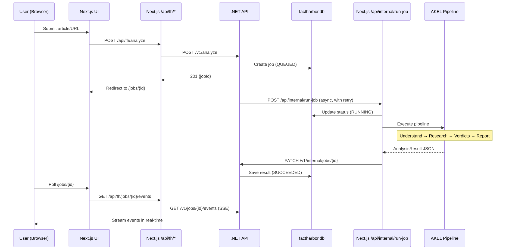

# Request Lifecycle

[Full-size diagram](../../../diagrams/diagram-a464e5c16158f221.svg) · [Mermaid source](../../../diagrams/diagram-a464e5c16158f221.mmd)

*Full request lifecycle from user submission through job queuing, AKEL pipeline execution, and real-time event streaming back to the browser.*
