> **Warning**
>
> **Partially Implemented (v2.6.33)** - Only AKEL system service is implemented. User system, moderators, background scheduler, and search indexer are **not yet implemented**.

# Target Technical Model

[Full-size diagram](../../../diagrams/diagram-a807bc3e1e27e32e.svg) · [Mermaid source](../../../diagrams/diagram-a807bc3e1e27e32e.mmd)

# Implementation Status

| Component | Target Purpose | Current Status |
|----|----|----|
| **USER** | User accounts with reputation | Not implemented (anonymous only) |
| **MODERATOR** | Appointed users with permissions | Not implemented |
| **AKEL** | AI processing engine | Implemented (Twin-Path pipeline) |
| **BACKGROUND_SCHEDULER** | Periodic tasks | Not implemented |
| **SEARCH_INDEXER** | Elasticsearch sync | Not implemented (no Elasticsearch) |

# Current Implementation

**v2.6.33 has only:**

-   AKEL pipeline for analysis
-   .NET API for job persistence
-   No background services
-   No search indexing (uses web search only)
