# Technology Stack

[Full-size diagram](../../../diagrams/diagram-2b5af8e61d99b188.svg) · [Mermaid source](../../../diagrams/diagram-2b5af8e61d99b188.mmd)

*Technology stack organised in layers: UI (React/Next.js), Engine (TypeScript/AI SDK), API (.NET/EF Core), Storage (SQLite), and External Services (LLM + search providers with specific model versions).*
