# UCM Config Precedence

[Full-size diagram](../../../diagrams/diagram-8ba1b8b885a4b914.svg) · [Mermaid source](../../../diagrams/diagram-8ba1b8b885a4b914.mmd)

*How FactHarbor loads, validates, and activates configurations at runtime. Fallback chain: config.db -\> JSON files -\> Code constants.*
