# User Class Diagram

[Full-size diagram](../../../diagrams/diagram-16c7b668042d1094.svg) · [Mermaid source](../../../diagrams/diagram-16c7b668042d1094.mmd)

# Role Permissions

| Role | Capabilities | Requirements |
|----|----|----|
| **Reader (Guest)** | Browse, search, view results | No login required |
| **User (Registered)** | Everything Reader can + submit URLs/text (rate-limited), flag content | Free account required |
| **UCM Administrator** | Everything User can + manage UCM config, view audit trail, trigger re-analysis | Appointed by Governing Team |
| **Moderator** | Everything User can + review flags, hide content, ban users | Appointed by Governing Team |

# Current Implementation

-   All users are anonymous Readers (no authentication system yet)
-   UCM config management via CLI/direct DB access
-   No moderator tooling
-   No rate limiting (single-user development mode)

# Design Principles

-   **No data editing roles** — analysis outputs are immutable
-   **UCM Administrator** improves the system through configuration, not by editing individual outputs
-   **Submission requires login** — LLM inference and web search are not free; rate limits control costs
-   **Four roles**: Reader (guest), User (registered), UCM Administrator (appointed), Moderator (appointed)
